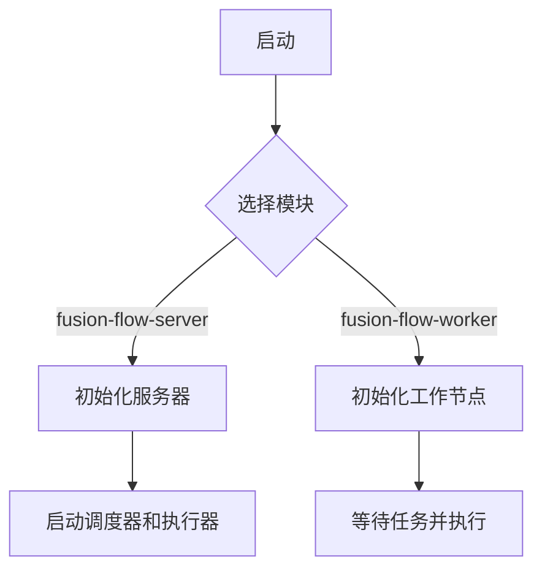

# Fusion Data

- Web UI 交互以 HTTP RPC JSON 形式实现。?还是统一都使用 gRPC（gRPC-Web）
- 服务之间通过 gRPC 进行通讯

## Fusion Flow

**BIN**

- fusion-flow-server: 提供 WEB & UI 服务，也可以选择同时内嵌 `fusion-flow-scheduler` 和 `fusion-flow-executor` 服务
- fusion-flow-broker: 提供定时任务（Cron、Simple）、流程编排任务的调度和触发
  - ~~fusion-flow-executor: 提供流程编排服务~~
- fusion-flow-worker: 具体的作业任务运行节点
- fusion-flow-cli: 命令行工具，用于快速创建、运行、调试编排任务

**LIB**

- fusion-flow: 流程公共代码，fusion-flow-scheduler 实现
- fusion-flow-api: 用于 `worker` 和 `cli` 的接口定义（使用 gRPC）



```math
f(x) = sin(x) + 12
```
