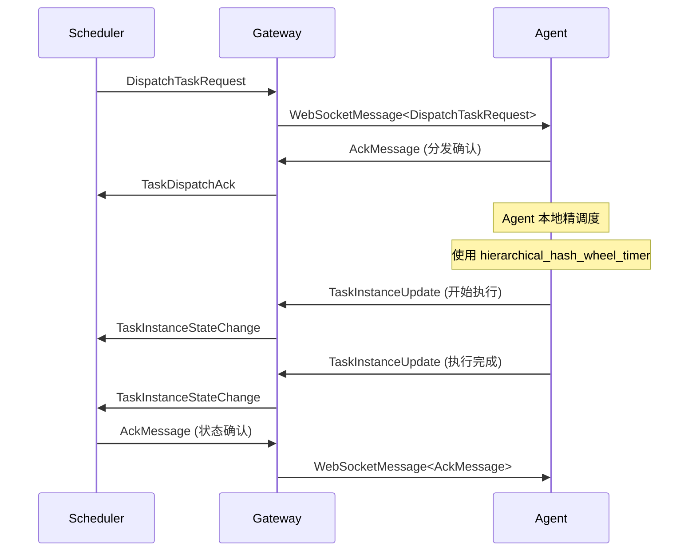
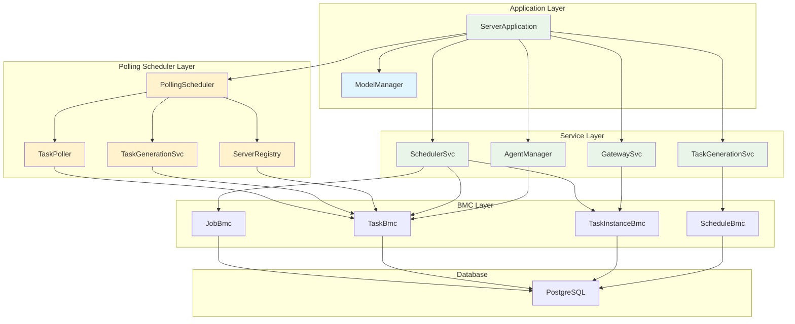
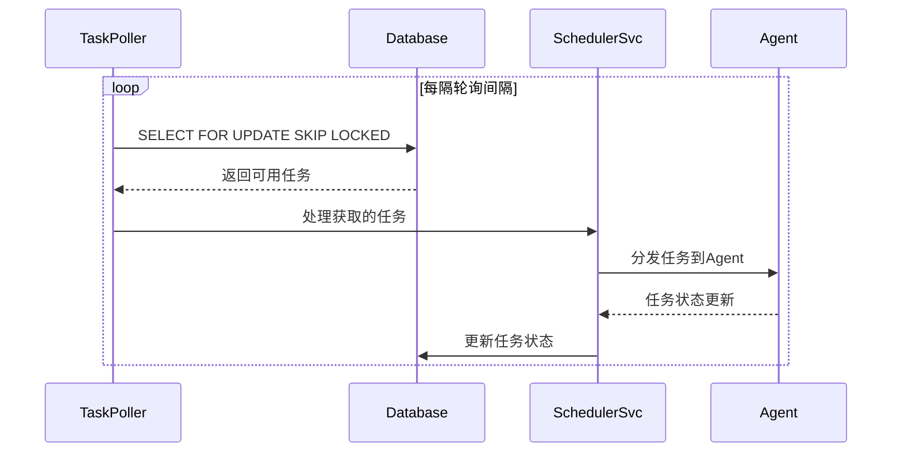
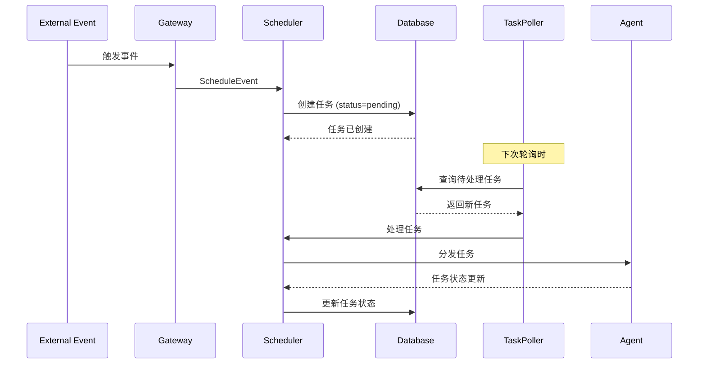
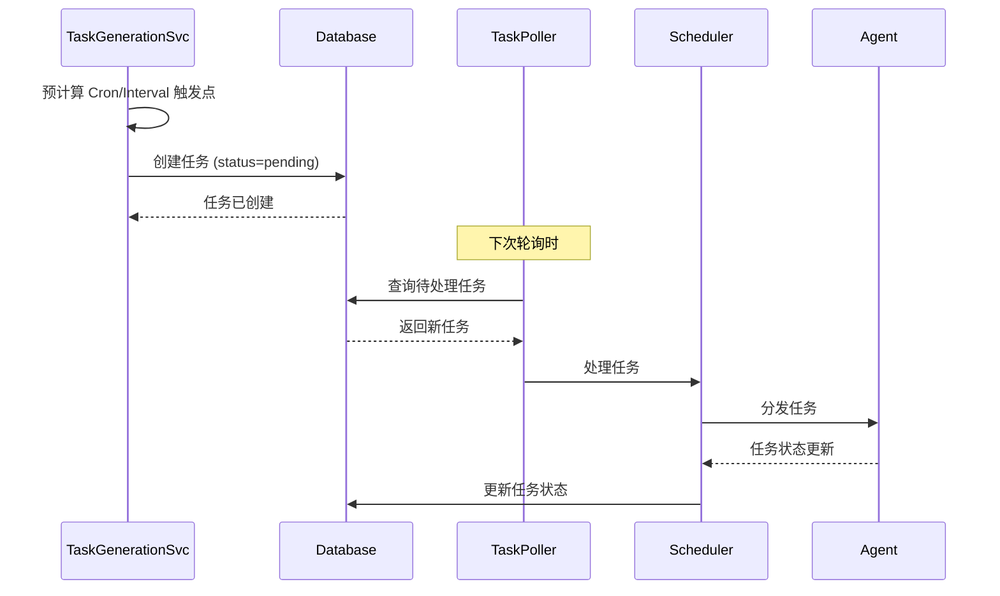
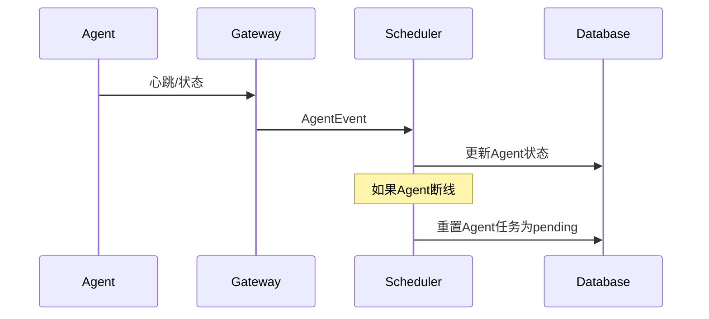
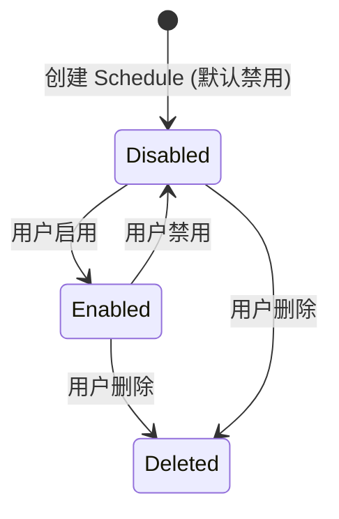
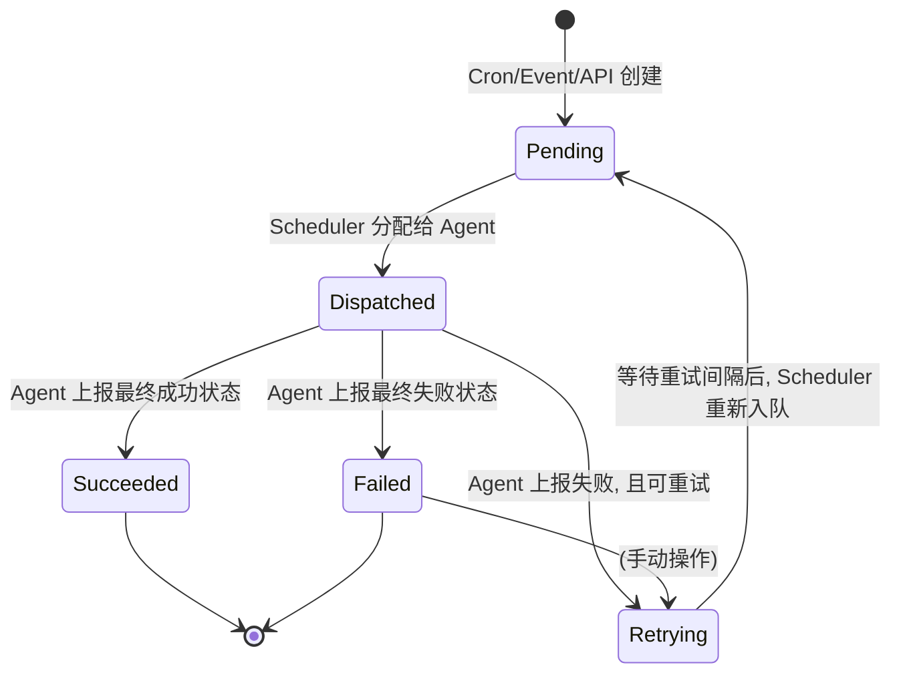
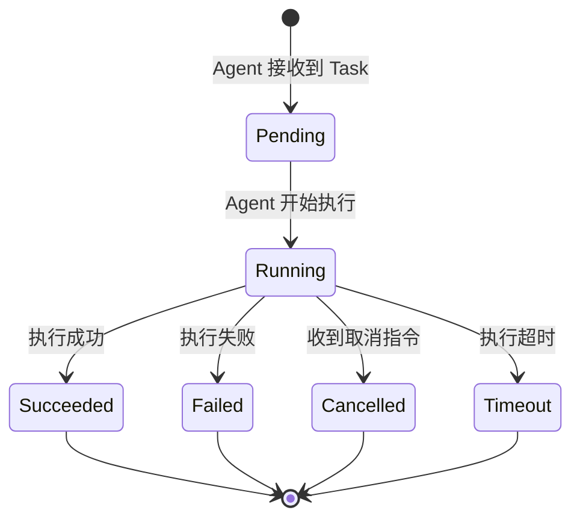

# `hetuflow-server` 服务端调度器（scheduler）设计

## 1. 概述

调度器 (`Scheduler`) 是 `hetuflow-server` 的核心决策大脑。它基于 **两级调度 (Two-Level Scheduling)** 架构设计，承担"粗调度"职责，专注于**任务的策略性调度、分发和状态管理**。

### 1.1 两级调度架构

- **Server 粗调度**: 负责根据业务策略提前分发任务（如提前 5 秒），选择合适的 Agent，处理任务的生命周期管理。重点关注分布式资源分配、负载均衡和可靠性保证。
- **Agent 精调度**: 接收到任务后，使用本地高精度定时器（`hierarchical_hash_wheel_timer`）在预定的精确时间点触发任务，消除网络延迟对调度精度的影响。

### 1.2 核心职责

调度器围绕 **Job** -> **Task** -> **TaskInstance** 的三层模型，专注于以下核心职责：

- **生成 `SchedTask`**: 根据 `SchedJob` 的调度策略（Cron, Event 等），生成待执行的 `SchedTask`。
- **提前分发 `SchedTask`**: 根据业务策略提前将任务分发给 Agent（例如提前 5 秒），确保 Agent 有足够时间进行精调度。
- **Agent 选择与负载均衡**: 根据 Agent 的状态、负载和能力选择最佳的执行节点。
- **监控 `SchedTaskInstance`**: 接收和处理来自 Agent 的 `SchedTaskInstance` 状态更新。
- **状态驱动与可靠通信**: 通过 WebSocket 建立全双工持久连接，确保所有关键操作都有明确的状态流转和 ACK 确认机制。
- **确保可靠性**: 处理任务失败、超时和重试逻辑，并保证 `Daemon` 类型 `Job` 的高可用。

### 1.3 轮询调度机制

调度器采用**轮询方案**，通过定时轮询 `sched_task` 表来获取待处理任务，并使用分布式锁确保任务的唯一性分配。这种设计提供了更好的可靠性、扩展性和分布式支持。

## 2. 两级调度与可靠通信机制

### 2.1 提前分发策略 (Early Dispatch)

为了确保任务的精确时间触发，调度器实现提前分发机制：

- **提前时间计算**: 根据网络延迟、Agent 负载等因素，动态计算合适的提前分发时间（默认 5 秒）
- **批量分发优化**: 对于相同 Agent 的多个任务，进行批量分发以减少网络开销
- **分发时间预测**: 基于历史数据和当前网络状况，智能调整每个 Agent 的分发提前量

```rust
pub struct EarlyDispatchConfig {
    pub default_advance_seconds: i64,      // 默认提前分发时间（秒）
    pub min_advance_seconds: i64,          // 最小提前时间
    pub max_advance_seconds: i64,          // 最大提前时间
    pub network_latency_factor: f64,       // 网络延迟系数
    pub agent_load_factor: f64,            // Agent 负载系数
    pub batch_dispatch_threshold: usize,   // 批量分发阈值
}

impl SchedulerSvc {
    /// 计算任务的最佳分发时间
    async fn calculate_dispatch_time(
        &self,
        task: &SchedTask,
        agent_id: &str,
    ) -> Result<DateTime<FixedOffset>, DataError> {
        let agent_info = self.agent_manager.get_agent_info(agent_id).await?;
        let base_advance = self.early_dispatch_config.default_advance_seconds;

        // 基于网络延迟调整
        let latency_adjustment = (agent_info.avg_latency_ms as f64 / 1000.0
            * self.early_dispatch_config.network_latency_factor) as i64;

        // 基于 Agent 负载调整
        let load_adjustment = (agent_info.cpu_usage *
            self.early_dispatch_config.agent_load_factor) as i64;

        let total_advance = (base_advance + latency_adjustment + load_adjustment)
            .clamp(
                self.early_dispatch_config.min_advance_seconds,
                self.early_dispatch_config.max_advance_seconds
            );

        Ok(task.scheduled_at - Duration::seconds(total_advance))
    }
}
```

### 2.2 状态驱动与 ACK 确认机制

所有关键操作都采用状态驱动模式，确保分布式环境下的一致性：

#### 2.2.1 任务分发流程



#### 2.2.2 ACK 确认与重试机制

```rust
#[derive(Debug, Clone)]
pub struct AckConfig {
    pub ack_timeout_seconds: u64,          // ACK 超时时间
    pub max_retry_attempts: u32,           // 最大重试次数
    pub retry_backoff_base_ms: u64,        // 重试退避基础时间
    pub retry_backoff_max_ms: u64,         // 重试退避最大时间
}

pub struct PendingAck {
    pub message_id: Uuid,
    pub sent_at: DateTime<FixedOffset>,
    pub retry_count: u32,
    pub agent_id: String,
    pub message_type: String,
}

impl SchedulerSvc {
    /// 发送需要 ACK 确认的消息
    pub async fn send_with_ack(
        &self,
        agent_id: &str,
        message: WebSocketMessage,
    ) -> Result<(), DataError> {
        let message_id = Uuid::new_v4();
        let pending_ack = PendingAck {
            message_id,
            sent_at: Utc::now(),
            retry_count: 0,
            agent_id: *agent_id,
            message_type: message.message_kind.clone(),
        };

        // 记录待确认消息
        self.pending_acks.write().await.insert(message_id, pending_ack);

        // 发送消息
        self.gateway_svc.send_message(agent_id, message).await?;

        // 启动 ACK 超时检查
        self.schedule_ack_timeout_check(message_id).await;

        Ok(())
    }

    /// 处理收到的 ACK 确认
    pub async fn handle_ack(&self, ack: AckMessage) -> Result<(), DataError> {
        if let Some(pending) = self.pending_acks.write().await.remove(&ack.message_id) {
            info!("Received ACK for message {} from agent {}",
                  ack.message_id, pending.agent_id);

            // 更新 Agent 可靠性统计
            self.agent_manager.update_reliability_stats(
                &pending.agent_id,
                true,
                Utc::now().signed_duration_since(pending.sent_at).num_milliseconds()
            ).await?;
        }

        Ok(())
    }
}
```

### 2.3 Agent 自治与弹性设计

#### 2.3.1 无状态 Agent 设计

Agent 被设计为相对无状态，不依赖本地文件系统保存任务：

- **任务状态同步**: Agent 重连后，完全从 Server 同步当前应处理的任务列表
- **会话恢复机制**: 使用 `session_id` 实现会话的快速恢复和状态重建
- **内存状态管理**: Agent 所有运行时状态都保存在内存中，重启即重置

#### 2.3.2 断线重连与状态恢复

```rust
impl SchedulerSvc {
    /// Agent 重连后的状态同步
    pub async fn handle_agent_reconnect(
        &self,
        agent_id: &str,
        session_id: &str,
    ) -> Result<Vec<SchedTask>, DataError> {
        info!("Agent {} reconnected with session {}", agent_id, session_id);

        // 1. 验证会话有效性
        self.validate_agent_session(agent_id, session_id).await?;

        // 2. 查询该 Agent 当前应处理的任务
        let active_tasks = self.task_bmc.find_active_tasks_by_agent(agent_id).await?;

        // 3. 重置任务状态（从 dispatched 回到 assigned）
        for task in &active_tasks {
            if task.status == TaskStatus::Dispatched as i16 {
                self.task_bmc.update_status(
                    task.id,
                    TaskStatus::Assigned as i16,
                    None
                ).await?;
            }
        }

        // 4. 重新分发所有任务
        for task in &active_tasks {
            self.dispatch_task_to_agent(task, agent_id).await?;
        }

        // 5. 更新 Agent 连接状态
        self.agent_manager.mark_agent_online(agent_id).await?;

        Ok(active_tasks)
    }

    /// 处理 Agent 断线
    pub async fn handle_agent_disconnect(&self, agent_id: &str) -> Result<(), DataError> {
        warn!("Agent {} disconnected", agent_id);

        // 1. 标记 Agent 为离线状态
        self.agent_manager.mark_agent_offline(agent_id).await?;

        // 2. 查询该 Agent 正在处理的任务
        let active_tasks = self.task_bmc.find_active_tasks_by_agent(agent_id).await?;

        // 3. 根据任务类型和策略进行处理
        for task in active_tasks {
            match task.job_type {
                JobType::Daemon => {
                    // Daemon 任务需要立即重新调度到其他 Agent
                    self.reschedule_task_immediately(&task).await?;
                }
                JobType::Scheduled => {
                    // 定时任务标记为待重新分配，等待下次调度
                    self.task_bmc.update_status(
                        task.id,
                        TaskStatus::Pending as i16,
                        None
                    ).await?;
                }
                JobType::Event => {
                    // 事件任务需要根据重试策略决定是否重新分配
                    if task.retry_count < task.max_retry_count {
                        self.reschedule_task_with_retry(&task).await?;
                    } else {
                        self.task_bmc.update_status(
                            task.id,
                            TaskStatus::Failed as i16,
                            Some("Agent disconnected, max retries exceeded".to_string())
                        ).await?;
                    }
                }
            }
        }

        Ok(())
    }
}
```

### 2.4 "至少一次" 和 "恰好一次" 执行保证

#### 2.4.1 至少一次执行 (At-Least-Once)

通过以下机制确保任务至少被执行一次：

- **分发确认**: 任务分发后必须收到 Agent 的 ACK 确认
- **执行监控**: 监控任务执行状态，超时未收到更新则触发重新分发
- **故障恢复**: Agent 断线或故障时，自动将任务重新分配给其他 Agent

#### 2.4.2 恰好一次执行 (Exactly-Once)

对于需要精确执行的任务，通过幂等性设计实现：

```rust
#[derive(Debug, Clone)]
pub struct TaskIdempotencyKey {
    pub job_id: Uuid,
    pub scheduled_time: DateTime<FixedOffset>,
    pub execution_round: i32,
}

impl SchedulerSvc {
    /// 生成任务幂等性键
    fn generate_idempotency_key(&self, task: &SchedTask) -> String {
        let key = TaskIdempotencyKey {
            job_id: task.job_id,
            scheduled_time: task.scheduled_at,
            execution_round: task.retry_count,
        };

        format!("{}:{}:{}",
                key.job_id,
                key.scheduled_time.timestamp(),
                key.execution_round)
    }

    /// 检查任务是否已经执行
    async fn is_task_already_executed(
        &self,
        idempotency_key: &str,
    ) -> Result<bool, DataError> {
        // 查询幂等性记录表或使用 Redis 缓存
        self.task_instance_bmc.exists_by_idempotency_key(idempotency_key).await
    }

    /// 创建幂等执行的任务实例
    async fn create_idempotent_task_instance(
        &self,
        task: &SchedTask,
        agent_id: &str,
    ) -> Result<SchedTaskInstance, DataError> {
        let idempotency_key = self.generate_idempotency_key(task);

        // 检查是否已存在
        if self.is_task_already_executed(&idempotency_key).await? {
            return Err(DataError::conflict("Task already executed with this idempotency key"));
        }

        // 创建任务实例
        let task_instance = TaskInstanceForCreate {
            task_id: task.id,
            agent_id: Some(*agent_id),
            idempotency_key: Some(idempotency_key),
            status: TaskInstanceStatus::Assigned as i16,
            // ... 其他字段
        };

        self.task_instance_bmc.create(task_instance).await
    }
}
```

## 3. 轮询调度机制设计

### 3.1 核心设计原理

轮询调度机制通过以下核心组件确保任务的唯一性分配和系统可靠性：

- **定时轮询器 (TaskPoller)**: 定期查询 `sched_task` 表中的待处理任务
- **分布式锁机制**: 使用 `SELECT FOR UPDATE SKIP LOCKED` 确保任务原子性获取
- **任务状态管理**: 扩展任务状态，新增 `locked` 状态用于锁定管理
- **故障恢复机制**: 自动检测和恢复超时锁定的任务
- **服务器注册**: 记录处理任务的服务器信息，支持故障转移

### 3.2 任务获取核心算法

使用 PostgreSQL 的 `SELECT FOR UPDATE SKIP LOCKED` 实现原子性任务获取：

```sql
-- 原子性获取待处理任务
WITH acquired_tasks AS (
    SELECT id
    FROM sched_task
    WHERE status = 1
      AND scheduled_at <= NOW()
    ORDER BY priority DESC, scheduled_at ASC
    LIMIT $1
    FOR UPDATE SKIP LOCKED
)
UPDATE sched_task
SET status = 10,
    server_id = $2,
    locked_at = NOW(),
    lock_version = lock_version + 1,
    updated_at = NOW()
WHERE id IN (SELECT id FROM acquired_tasks)
RETURNING *;
```

## 4. 应用架构与依赖管理

调度器采用现代化的 `Application` 容器模式，统一管理所有服务和组件依赖，确保资源管理和生命周期控制的一致性。详细的 Application 容器架构实现请参考 [server.md](./server.md#application-与服务层实现) 中的相关章节。

## 5. 核心组件架构

调度器由多个协作的内部组件构成，每个组件负责一部分独立的逻辑。



### 核心组件说明

- **`ServerApplication` (应用容器)**: 管理所有服务和组件的生命周期，提供统一的依赖注入。
- **`ModelManager` (数据管理器)**: 持有数据库连接池，为所有 BMC 提供数据访问能力。
- **`PollingScheduler` (轮询调度器)**: 协调整个轮询调度流程，管理轮询策略和负载均衡。
- **`TaskPoller` (任务轮询器)**: 定时轮询 `sched_task` 表，获取待处理任务并进行分发。
- **`ServerRegistry` (服务器注册表)**: 管理服务器注册、心跳检测和故障恢复。
- **`SchedulerSvc` (调度服务)**: 处理任务分发逻辑，与 Agent 进行通信。
- **`GatewaySvc` (网关服务)**: 管理 Agent 连接和消息路由。
- **`TaskGenerationSvc` (任务生成服务)**: 按策略（预生成/事件驱动）创建任务并写入 sched_task，配合 TaskPoller 与 SchedulerSvc 实现提前分发与执行闭环。
- **`AgentManager` (Agent 管理器)**: 维护 Agent 状态，提供负载均衡策略。

## 6. 轮询调度器实现

### 6.1 TaskPoller (任务轮询器)

```rust
use fusion_core::DataError;
use tokio::time::{interval, Duration, Instant};
use std::sync::atomic::{AtomicBool, AtomicU64, Ordering};
use std::sync::Arc;

#[derive(Debug, Clone)]
pub struct PollingConfig {
    pub polling_interval_ms: u64,
    pub batch_size: usize,
    pub lock_timeout_seconds: i64,
    pub max_retry_count: i32,
    pub cleanup_interval_seconds: u64,
    pub jitter_ms: u64,
}

impl Default for PollingConfig {
    fn default() -> Self {
        Self {
            polling_interval_ms: 2000,  // 2秒
            batch_size: 20,
            lock_timeout_seconds: 300,   // 5分钟
            max_retry_count: 3,
            cleanup_interval_seconds: 60, // 1分钟
            jitter_ms: 500,
        }
    }
}

pub struct TaskPoller {
    mm: Arc<ModelManager>,
    config: PollingConfig,
    server_id: String,
    is_running: Arc<AtomicBool>,
    last_cleanup: Arc<AtomicU64>,
}

impl TaskPoller {
    pub fn new(
        mm: Arc<ModelManager>,
        config: PollingConfig,
        server_id: String,
    ) -> Self {
        Self {
            mm,
            config,
            server_id,
            is_running: Arc::new(AtomicBool::new(false)),
            last_cleanup: Arc::new(AtomicU64::new(0)),
        }
    }

  /// 启动轮询调度器
  pub async fn start_polling(&self) -> Result<(), DataError> {
    if self.is_running.swap(true, Ordering::Relaxed) {
      return Err(DataError::internal_error("TaskPoller is already running"));
    }

    info!("Starting TaskPoller with server_id: {}", self.server_id);

    let mm = self.mm.clone();
    let config = self.config.clone();
    let server_id = self.server_id.clone();
    let is_running = self.is_running.clone();
    let last_cleanup = self.last_cleanup.clone();

    tokio::spawn(async move {
      let mut base_interval = Duration::from_millis(config.polling_interval_ms);
      let mut consecutive_empty_polls = 0u32;

      while is_running.load(Ordering::Relaxed) {
        let start_time = Instant::now();

        match Self::poll_and_process_tasks(
          &mm,
          &config,
          &server_id,
        ).await {
          Ok(processed_count) => {
            if processed_count > 0 {
              info!("Processed {} tasks", processed_count);
              consecutive_empty_polls = 0;
            } else {
              consecutive_empty_polls += 1;
            }

            // 动态调整轮询间隔
            base_interval = Self::adjust_polling_interval(
              base_interval,
              processed_count,
              consecutive_empty_polls,
              &config,
            );
          }
          Err(e) => {
            error!("Error during polling: {:?}", e);
            consecutive_empty_polls += 1;
          }
        }

        // 定期清理超时锁
        if Self::should_cleanup_locks(&last_cleanup, &config) {
          if let Err(e) = Self::cleanup_expired_locks(&mm, &config).await {
            error!("Failed to cleanup expired locks: {:?}", e);
          }
        }

        // 添加 jitter 避免多个实例同时轮询
        let jitter = Duration::from_millis(
          rand::thread_rng().gen_range(0..=config.jitter_ms)
        );
        let sleep_duration = base_interval + jitter;

        tokio::time::sleep(sleep_duration).await;
      }

      info!("TaskPoller stopped");
    });

    Ok(())
  }

  /// 轮询并处理任务
  async fn poll_and_process_tasks(
    mm: &ModelManager,
    config: &PollingConfig,
    server_id: &str,
  ) -> Result<usize, DataError> {
    // 原子性获取待处理任务
    let acquired_tasks = Self::acquire_pending_tasks(
      mm,
      config.batch_size,
      server_id,
    ).await?;

    if acquired_tasks.is_empty() {
      return Ok(0);
    }

    debug!("Acquired {} tasks for processing", acquired_tasks.len());

    // 并发处理获取到的任务
    let mut handles = Vec::new();
    for task in acquired_tasks {
      let mm = mm.clone();
      let server_id = server_id.to_string();

      let handle = tokio::spawn(async move {
        if let Err(e) = Self::process_acquired_task(&mm, task, &server_id).await {
          error!("Failed to process task: {:?}", e);
        }
      });
      handles.push(handle);
    }

    // 等待所有任务处理完成
    let processed_count = handles.len();
    for handle in handles {
      let _ = handle.await;
    }

    Ok(processed_count)
  }

  /// 原子性获取待处理任务
  async fn acquire_pending_tasks(
    mm: &ModelManager,
    batch_size: usize,
    server_id: String,
  ) -> Result<Vec<SchedTask>, DataError> {
    mm
      .dbx()
      .use_postgres(|dbx| async move {
        let query = r#"
          WITH acquired_tasks AS (
            SELECT t.id
            FROM sched_task t
            WHERE t.status = $3
              AND t.scheduled_at <= NOW()
              AND t.deleted_at IS NULL
            ORDER BY t.priority DESC, t.scheduled_at ASC
            LIMIT $1
            FOR UPDATE SKIP LOCKED
          )
          UPDATE sched_task
          SET status = $4,
              server_id = $2,
              locked_at = NOW(),
              lock_version = lock_version + 1,
              updated_at = NOW()
          WHERE id IN (SELECT id FROM acquired_tasks)
          RETURNING *
        "#;

        let tasks = sqlx::query_as::<_, SchedTask>(query)
          .bind(batch_size as i32)
          .bind(server_id)
          .bind(TaskStatus::Pending as i32)
          .bind(TaskStatus::Locked as i32)
          .fetch_all(dbx.db())
          .await?;

        Ok(tasks)
      })
      .await
      .map_err(DataError::from)
  }

  /// 处理获取到的任务
  async fn process_acquired_task(
    mm: &ModelManager,
    task: SchedTask,
    server_id: &str,
  ) -> Result<(), DataError> {
    // 查找合适的 Agent
    let agents = AgentBmc::find_online_agents(mm).await
      .map_err(DataError::from)?;

    if let Some(agent) = agents.first() {
      // 更新任务状态为已分发
      let update = TaskForUpdate {
        status: Some("dispatched".to_string()),
        agent_id: Some(Some(agent.id.clone())),
        update_mask: Some(FieldMask::new(vec![
          "status".to_string(),
          "agent_id".to_string(),
          "updated_at".to_string()
        ])),
        ..Default::default()
      };

      TaskBmc::update_by_id(mm, task.id, update)
        .await
        .map_err(DataError::from)?;

      // TODO: 发送任务到 Gateway
      info!("Task {} dispatched to agent {}", task.id, agent.id);
    } else {
      // 没有可用 Agent，释放任务锁
      Self::release_task_lock(mm, task.id).await?;
      warn!("No available agent for task {}, lock released", task.id);
    }

    Ok(())
  }

  /// 释放任务锁
  async fn release_task_lock(
    mm: &ModelManager,
    task_id: i64,
  ) -> Result<(), DataError> {
    let update = TaskForUpdate {
      status: Some("pending".to_string()),
      server_id: Some(None),
      locked_at: Some(None),
      update_mask: Some(FieldMask::new(vec![
        "status".to_string(),
        "server_id".to_string(),
        "locked_at".to_string(),
        "updated_at".to_string()
      ])),
      ..Default::default()
    };

    TaskBmc::update_by_id(mm, task_id, update)
      .await
      .map_err(DataError::from)
      .map(|_| ())
  }

  /// 动态调整轮询间隔
  fn adjust_polling_interval(
    current_interval: Duration,
    processed_count: usize,
    consecutive_empty_polls: u32,
    config: &PollingConfig,
  ) -> Duration {
    let base_ms = config.polling_interval_ms;
    let min_ms = base_ms / 2;
    let max_ms = base_ms * 4;

    let new_ms = if processed_count > 0 {
      // 有任务处理，减少间隔
      (current_interval.as_millis() as u64 * 8 / 10).max(min_ms)
    } else if consecutive_empty_polls > 5 {
      // 连续空轮询，增加间隔
      (current_interval.as_millis() as u64 * 12 / 10).min(max_ms)
    } else {
      current_interval.as_millis() as u64
    };

    Duration::from_millis(new_ms)
  }

  /// 检查是否需要清理超时锁
  fn should_cleanup_locks(
    last_cleanup: &AtomicU64,
    config: &PollingConfig,
  ) -> bool {
    let now = now_offset().timestamp() as u64;
    let last = last_cleanup.load(Ordering::Relaxed);

    if now - last > config.cleanup_interval_seconds {
      last_cleanup.store(now, Ordering::Relaxed);
      true
    } else {
      false
    }
  }

  /// 清理超时的锁定任务
  async fn cleanup_expired_locks(
    mm: &ModelManager,
    config: &PollingConfig,
  ) -> Result<usize, DataError> {
    let timeout_threshold = now_offset()
      - chrono::Duration::seconds(config.lock_timeout_seconds);

    mm
      .dbx()
      .use_postgres(|dbx| async move {
        let query = r#"
          UPDATE sched_task
          SET status = 'pending',
              server_id = NULL,
              locked_at = NULL,
              updated_at = NOW()
          WHERE status = 'locked'
            AND locked_at < $1
        "#;

        let result = sqlx::query(query)
          .bind(timeout_threshold)
          .execute(dbx.db())
          .await?;

        Ok(result.rows_affected() as usize)
      })
      .await
      .map_err(DataError::from)
  }

  /// 停止轮询
  pub fn stop(&self) {
    self.is_running.store(false, Ordering::Relaxed);
    info!("TaskPoller stop signal sent");
  }
}
```

### 6.2 SchedulerSvc 集成轮询机制

```rust
use fusion_core::DataError;
use mea::mpsc;
use std::sync::Arc;

pub struct SchedulerSvc {
  mm: ModelManager,
  gateway_command_sender: mpsc::UnboundedSender<GatewayCommand>,
  task_poller: Option<TaskPoller>,
  server_id: String,
}

impl SchedulerSvc {
  pub fn new(
    mm: ModelManager,
    gateway_command_sender: mpsc::UnboundedSender<GatewayCommand>,
  ) -> Self {
    let server_id = Self::get_server_id();

    Self {
      mm,
      gateway_command_sender,
      task_poller: None,
      server_id,
    }
  }

  /// 启动轮询调度器
  pub async fn start_polling_scheduler(&mut self, config: PollingConfig) -> Result<(), DataError> {
    info!("Starting polling scheduler with server_id: {}", self.server_id);

    // 创建任务轮询器
    let task_poller = TaskPoller::new(
      self.mm.clone(),
      config,
      self.server_id.clone(),
    );

    // 启动轮询
    task_poller.start_polling().await?;
    self.task_poller = Some(task_poller);

    // 启动心跳任务
    self.start_heartbeat_task().await?;

    Ok(())
  }

  /// 启动心跳任务
  async fn start_heartbeat_task(&self) -> Result<(), DataError> {
    let mm = self.mm.clone();
    let server_id = self.server_id.clone();

    tokio::spawn(async move {
      let mut interval = tokio::time::interval(Duration::from_secs(30));

      loop {
        interval.tick().await;

        // 更新服务器心跳
        if let Err(e) = Self::update_server_heartbeat(&mm, &server_id).await {
          error!("Failed to update server heartbeat: {:?}", e);
        }
      }
    });

    Ok(())
  }

  /// 处理获取到的任务
  async fn process_acquired_task(
    mm: &ModelManager,
    gateway_sender: &mpsc::UnboundedSender<GatewayCommand>,
    task: SchedTask,
    server_id: &str,
  ) -> Result<(), DataError> {
    // 查找合适的 Agent
    let agents = AgentBmc::find_online_agents(mm).await
      .map_err(DataError::from)?;

    if let Some(agent) = agents.first() {
      // 更新任务状态为已分发
      let update = TaskForUpdate {
        status: Some("dispatched".to_string()),
        agent_id: Some(Some(agent.id.clone())),
        update_mask: Some(FieldMask::new(vec![
          "status".to_string(),
          "agent_id".to_string(),
          "updated_at".to_string()
        ])),
        ..Default::default()
      };

      TaskBmc::update_by_id(mm, task.id, update)
        .await?;

      // 释放任务锁
      TaskPoller::release_task_lock(mm, task.id).await?;

    // 获取关联的作业信息
    let job = JobBmc::find_by_id(mm, task.job_id)
      .await?;

    // 构建任务分发请求
    let dispatch_request = DispatchTaskRequest {
      task_id: task.id,
      job_id: job.id,
      command: job.command.clone(),
      environment: job.environment.clone(),
      config: job.config.clone(),
      scheduled_at: task.scheduled_at,
      priority: task.priority,
      dependencies: task.dependencies.clone(),
    };

    // 发送到网关
    let message = WebSocketMessage {
      message_id: Uuid::now_v7(),
      timestamp: now_epoch_millis(),
      message_kind: MessageKind::TaskDispatch,
      payload: serde_json::to_value(dispatch_request)
        .map_err(|e| DataError::internal_error(&format!("Serialization failed: {}", e)))?,
      metadata: HashMap::default(),
    };

    let gateway_command = GatewayCommand {
      target_agent_id: agent.id.clone(),
      message,
    };

    gateway_sender.send(gateway_command)
      .map_err(|e| DataError::internal_error(&format!("Failed to send gateway command: {}", e)))?;

    info!("Task {} dispatched to agent {}", task.id, agent.id);
    } else {
      // 没有可用 Agent，释放任务锁
      TaskPoller::release_task_lock(mm, task.id).await?;
      warn!("No available agent for task {}, lock released", task.id);
    }

    Ok(())
  }

  /// 生成服务器 ID
  fn get_server_id() -> Uuid {
    // TODO 从配置文件中获取，若不存在则生成并将生成的 server_id 写入配置文件中
    Uuid::new_v7()
  }

  /// 更新服务器心跳
  async fn update_server_heartbeat(
    mm: &ModelManager,
    server_id: &str,
  ) -> Result<(), DataError> {
    mm
      .dbx()
      .use_postgres(|dbx| async move {
        let query = r#"
          INSERT INTO sched_server (id, last_heartbeat, status)
          VALUES ($1, NOW(), 'active')
          ON CONFLICT (id)
          DO UPDATE SET
            last_heartbeat = NOW(),
            status = 'active'
        "#;

        sqlx::query(query)
          .bind(server_id)
          .execute(dbx.db())
          .await?;

        Ok(())
      })
      .await
      .map_err(DataError::from)
    }

  /// 优雅关闭
  pub async fn shutdown_gracefully(&self) -> Result<(), DataError> {
    info!("Shutting down scheduler gracefully");

    // 停止轮询器
    if let Some(poller) = &self.task_poller {
      poller.stop();
    }

    // 释放当前服务器锁定的所有任务
    self.mm
      .dbx()
      .use_postgres(|dbx| async move {
        let query = r#"
          UPDATE sched_task
          SET status = 'pending',
              server_id = NULL,
              locked_at = NULL,
              updated_at = NOW()
          WHERE server_id = $1
            AND status = 'locked'
        "#;

        let result = sqlx::query(query)
          .bind(&self.server_id)
          .execute(dbx.db())
          .await?;

        info!("Released {} locked tasks", result.rows_affected());
        Ok(())
      })
      .await
      .map_err(DataError::from)
    }

  /// 更新服务器状态
  async fn update_server_status(&self, status: &str) -> Result<(), DataError> {
    self.mm
      .dbx()
      .use_postgres(|dbx| async move {
        let query = r#"
          UPDATE sched_server
          SET status = $1,
              last_heartbeat = NOW()
          WHERE id = $2
        "#;

        sqlx::query(query)
          .bind(status)
          .bind(&self.server_id)
          .execute(dbx.db())
          .await?;

        Ok(())
      })
      .await
      .map_err(DataError::from)
  }
 }

  /// 处理任务状态更新事件
  pub async fn handle_task_status_update(
    &self,
    task_id: i64,
    status: String,
    agent_id: String,
    output: Option<String>,
    error_message: Option<String>,
    exit_code: Option<i32>,
  ) -> Result<(), DataError> {
    // 创建任务实例记录
    let instance = TaskInstanceForCreate {
      task_id,
      agent_id: agent_id.clone(),
      status: status.clone(),
      started_at: Some(now_offset()),
      completed_at: if matches!(status.as_str(), "success" | "failed" | "cancelled") {
        Some(now_offset())
      } else {
        None
      },
      output,
      error_message,
      exit_code,
      ..Default::default()
    };

    TaskInstanceBmc::create(&self.mm, instance)
      .await
      .map_err(DataError::from)?;

    // 更新任务状态
    let task_update = TaskForUpdate {
      status: Some(status.clone()),
      update_mask: Some(FieldMask::new(vec!["status".to_string(), "updated_at".to_string()])),
      ..Default::default()
    };

    TaskBmc::update_by_id(&self.mm, task_id, task_update)
      .await
      .map_err(DataError::from)?;

    info!("Updated task {} status to {}", task_id, status);
    Ok(())
  }

  /// 处理 Agent 断线事件
  pub async fn handle_agent_disconnect(&self, agent_id: &str) -> Result<(), DataError> {
    info!("Handling agent disconnect: {}", agent_id);

    // 查找该 Agent 上处于 'dispatched' 或 'locked' 状态的任务
    let filter = TaskFilter {
      agent_id: Some(OpValString::Eq(agent_id.to_string())),
      status: Some(OpValString::In(vec!["dispatched".to_string(), "locked".to_string()])),
      ..Default::default()
    };

    let orphaned_tasks = TaskBmc::list(&self.mm, vec![filter])
      .await
      .map_err(DataError::from)?;

    // 批量重置任务状态
    for task in &orphaned_tasks {
      let update = TaskForUpdate {
        status: Some("pending".to_string()),
        agent_id: Some(None),
        server_id: Some(None),
        locked_at: Some(None),
        update_mask: Some(FieldMask::new(vec![
          "status".to_string(),
          "agent_id".to_string(),
          "server_id".to_string(),
          "locked_at".to_string(),
          "updated_at".to_string()
        ])),
        ..Default::default()
      };

      TaskBmc::update_by_id(&self.mm, task.id, update)
        .await
        .map_err(DataError::from)?;
    }

    info!("Reset {} tasks from disconnected agent {}", orphaned_tasks.len(), agent_id);
    Ok(())
  }

}

// 调度器事件 #[derive(Debug)]
pub enum SchedulerEvent {
  TaskStatusUpdated {
    task_id: i64,
    status: String,
    output: Option<String>,
    error_message: Option<String>,
    exit_code: Option<i32>,
  },
  AgentDisconnected {
    agent_id: String,
  },
}
```

### 6.3 AgentManager 集成

```rust
use std::collections::HashMap;
use std::sync::Arc;

use tokio::sync::RwLock;

use fusion_core::DataError;
use fusion_common::time::OffsetDateTime;

#[derive(Debug, Clone)]
pub struct AgentInfo {
  pub agent_id: String,
  pub status: String,
  pub capabilities: serde_json::Value,
  pub last_heartbeat: OffsetDateTime,
  pub active_tasks: i32,
}

pub struct AgentManager {
  mm: Arc<ModelManager>,
  agents: Arc<RwLock<HashMap<String, AgentInfo>>>,
}

impl AgentManager {
  pub fn new(mm: Arc<ModelManager>) -> Self {
    Self {
      mm,
      agents: Arc::new(RwLock::new(HashMap::default())),
    }
  }

  // 注册 Agent
  pub async fn register_agent(&self, agent_id: String, capabilities: serde_json::Value) -> Result<(), DataError> {
    let agent_info = AgentInfo {
      agent_id: agent_id.clone(),
      status: "online".to_string(),
      capabilities,
      last_heartbeat: now_offset(),
      active_tasks: 0,
    };

    let mut agents = self.agents.write().await;
    agents.insert(agent_id, agent_info);

    Ok(())
  }

  // 更新 Agent 心跳
  pub async fn update_heartbeat(&self, agent_id: &str) -> Result<(), DataError> {
    let mut agents = self.agents.write().await;
    if let Some(agent) = agents.get_mut(agent_id) {
      agent.last_heartbeat = now_offset();
    }

    Ok(())
  }

  // 选择最佳 Agent
  pub async fn select_best_agent(&self, task_requirements: &serde_json::Value) -> Result<Option<String>, DataError> {
    let agents = self.agents.read().await;

    // 简单的负载均衡策略：选择活跃任务最少的 Agent
    let best_agent = agents.values()
      .filter(|agent| agent.status == "online")
      .min_by_key(|agent| agent.active_tasks);

    Ok(best_agent.map(|agent| agent.agent_id.clone()))
  }

  // 处理 Agent 断线
  pub async fn handle_agent_disconnect(&self, agent_id: &str) -> Result<(), DataError> {
    warn!("Agent {} disconnected, reassigning tasks", agent_id);

    // 查找该 Agent 上处于 'dispatched' 状态的任务
    let filter = TaskFilter {
      agent_id: Some(OpValString::Eq(agent_id.to_string())),
      status: Some(OpValString::Eq("dispatched".to_string())),
      ..Default::default()
    };

    let orphaned_tasks = TaskBmc::list(&self.mm, vec![filter])
      .await
      .map_err(DataError::from)?;

    // 批量更新任务状态
    for task in orphaned_tasks {
      let update = TaskForUpdate {
        status: Some("pending".to_string()),
        agent_id: None,
        updated_at: Some(now_offset()),
        ..Default::default()
      };

      TaskBmc::update_by_id(&self.mm, task.id, update)
        .await
        .map_err(DataError::from)?;
    }

    // 从内存中移除 Agent
    let mut agents = self.agents.write().await;
    agents.remove(agent_id);

    info!("Reassigned {} tasks from disconnected agent {}", orphaned_tasks.len(), agent_id);
    Ok(())
  }
}
```

## 7. 任务生成策略

### 7.1 设计理念

在新的两级调度架构下，Server 不再承担精确时间触发责任，而是负责任务的生成与提前分发，精确调度由 Agent 端完成。任务生成采用以下策略：

- **预生成任务**：根据 Schedule 配置，提前计算并生成未来一段时间的任务实例
- **事件驱动生成**：基于外部事件或 API 调用按需生成任务
- **分发前置**：任务生成后进入 `sched_task` 表，由 TaskPoller 轮询并提前分发给 Agent

### 7.2 任务预生成机制

```rust
use fusion_core::DataError;
use chrono::{DateTime, Utc, Duration as ChronoDuration};
use croner::Cron;
use std::str::FromStr;
use std::time::Duration;

#[derive(Debug, Clone)]
pub struct GenerationConfig {
  /// 预生成时间窗口（秒）
  pub lookahead_seconds: u64,
  /// 批量大小，每次读取的 JOB 数量
  pub job_batch_size: usize,
  /// 生成间隔
  pub generation_interval: Duration,
}

impl Default for GenerationConfig {
  fn default() -> Self {
    Self {
      lookahead_seconds: 5 * 60,      // 预生成未来5分钟任务
      job_batch_size: 100,
      generation_interval: Duration::minutes(1), // 每分钟生成一次
    }
  }
}

pub struct TaskGenerationSvc {
  mm: ModelManager,
  generation_config: GenerationConfig,
}

impl TaskGenerationSvc {
  pub fn new(mm: ModelManager, config: GenerationConfig) -> Self {
    Self { mm, generation_config: config }
  }

  /// 为指定 Schedule 预生成任务
  pub async fn generate_tasks_for_schedule(
    &self,
    schedule: &SchedSchedule,
    from_time: DateTime<FixedOffset>,
    to_time: DateTime<FixedOffset>,
  ) -> Result<Vec<TaskId>, DataError> {
    let mut generated_tasks = Vec::new();

    // TODO: 根据 schedule.kind 的类型，调用不同的生成方法

    Ok(generated_tasks)
  }
}
```

### 7.3 事件驱动任务生成

```rust
/// 外部事件触发的任务生成
impl TaskGenerationSvc {
  /// 基于事件生成即时任务
  pub async fn generate_event_task(
    &self,
    job_id: JobId,
    event_data: Option<String>,
    priority: Option<i32>,
  ) -> Result<TaskId, DataError> {
    let task = TaskForCreate {
      job_id,
      schedule_id: None, // 事件驱动任务无关联 Schedule
      priority: priority.unwrap_or(100), // 事件任务默认高优先级
      scheduled_at: Utc::now(), // 即时触发
      status: TaskStatus::Pending,
      payload: event_data,
      retry_count: 0,
      max_retries: 3,
      ..Default::default()
    };

    let task_id = TaskBmc::create(&self.mm, task).await?;
    info!("Generated event-driven task {} for job {}", task_id, job_id);
    Ok(task_id)
  }
}
```

### 7.4 生成策略配置

任务生成服务支持灵活的策略配置：

- **预生成窗口**：控制提前生成多长时间的任务
- **生成频率**：定期重新计算和补充任务
- **去重机制**：避免重复生成相同时间点的任务
- **清理策略**：自动清理过期或无效的待执行任务

## 8. 核心工作流程

### a. 轮询调度流程



### b. 事件驱动的任务生成



### c. 定时任务生成



### d. Agent 状态上报



## 8. 与网关的交互

调度器与网关之间通过 `mea::sync` 无界通道进行通信，实现完全解耦。

**通道定义 (示例)**:

```rust
// 从 Gateway 发送到 Scheduler 的消息
#[derive(Debug)]
pub enum GatewayEvent {
  AgentRegistered(AgentRegisterRequest),
  AgentHeartbeat(HeartbeatRequest),
  TaskStatusUpdated(TaskInstanceUpdate),
  AgentDisconnected { agent_id: String },
}

// 从 Scheduler 发送到 Gateway 的指令
#[derive(Debug)]
pub struct GatewayCommand {
  pub target_agent_id: Uuid,
  pub message: WebSocketMessage,
}

// 在应用初始化时创建通道
impl ServerApplication {
  pub async fn new() -> Result<Self, DataError> {
    // ... 其他初始化代码 ...

    let (gateway_command_tx, gateway_command_rx) = mpsc::unbounded_channel::<GatewayCommand>();
    let (gateway_event_tx, gateway_event_rx) = mpsc::unbounded_channel::<GatewayEvent>();

    // 将通道传递给相关服务
    let gateway_svc = Arc::new(GatewaySvc::new(
      mm.clone(),
      gateway_command_rx,
      gateway_event_tx,
    ));

    // ... 其他代码 ...
  }
}
```

- **调度器 -> 网关**: 当 `SchedulerSvc` 需要分发任务时，它会创建一个 `GatewayCommand`（包含目标 Agent ID 和完整的 `WebSocketMessage`），并将其发送到 `gateway_command_tx`。
- **网关 -> 调度器**: 当 `GatewaySvc` 收到来自 Agent 的消息时，它会将其解析为 `GatewayEvent`，并通过 `gateway_event_tx` 发送给调度器。`SchedulerSvc` 会在 `gateway_event_rx` 上监听这些事件。

## 9. Agent 负载均衡策略

`SchedulerSvc` 在选择 Agent 时，可以采用多种策略，这些策略依赖于 `AgentManager` 提供的实时数据。

- **轮询 (Round-Robin)**: 简单地循环选择下一个可用的 Agent。
- **最少任务数 (Least Tasks)**: 选择当前正在执行任务数量最少的 Agent。`AgentInfo` 中的 `active_tasks` 字段可用于此判断。
- **基于资源 (Resource-based)**: 选择 CPU 和内存使用率最低的 Agent。`AgentInfo` 中的 `capabilities` 字段可用于此判断。
- **基于能力 (Capability-based)**: 如果任务需要特定能力（例如需要 GPU），则只在声明具备该能力的 Agent 中选择。

策略可以在系统配置中指定，并可动态调整。

## 10. 核心实体生命周期

### a. Job 生命周期

Job 本身没有状态，其生命周期由用户的创建和删除操作决定。

### b. Schedule 生命周期

Schedule 的状态由用户通过 API 控制。



### c. Task 生命周期

Task 的生命周期由 Scheduler 自动管理。



### d. TaskInstance 生命周期

TaskInstance 的生命周期由 Agent 管理。



## 11. Service 层实现

### 11.1 TaskSvc 完整实现

TaskSvc 的代码实现见: [task_svc.rs](../../../fusion/hetuflow-server/src/service/task_svc.rs)

### 11.2 AgentSvc 完整实现

Agent 管理服务，维护 Agent 状态并提供负载均衡：

AgentSvc 的代码实现见: [AgentSvc](../../../fusion/hetuflow-server/src/service/agent_svc.rs)

## 12. 与 Core 协议的集成

Scheduler 模块通过 `hetuflow-core` 与 Gateway 和外部系统进行通信，确保协议的一致性和类型安全。

### 协议类型使用

```rust
use hetuflow_core::protocol::{
  DispatchTaskRequest, TaskInstanceUpdate, ScheduleKind, TaskInstanceStatus,
  WebSocketMessage, MessageKind
};
use std::collections::HashMap;

impl SchedulerSvc {
  // 构建任务分发请求
  pub fn create_dispatch_request(&self, task: &SchedTask, job: &SchedJob) -> DispatchTaskRequest {
    DispatchTaskRequest {
      job_id: job.id,
      task_id: task.id,
      task_name: Some(task.name.clone()),
      schedule_kind: ScheduleKind::Cron, // 来自 core 的 ScheduleKind 枚举
      command: job.command.clone(),
      cron_expression: None,
      environment: job.environment.clone(),
      config: job.config.clone(),
      scheduled_at: task.scheduled_at,
      priority: task.priority,
      dependencies: task.dependencies.clone(),
    }
  }

  // 发送任务到 Gateway
  pub async fn dispatch_task(&self, request: DispatchTaskRequest, agent_id: &str) {
    let message = WebSocketMessage {
      message_id: Uuid::now_v7(),
      timestamp: now_epoch_millis(),
      message_kind: MessageKind::TaskDispatch,
      payload: serde_json::to_value(request).unwrap(),
      metadata: HashMap::default(),
    };

    let gateway_command = GatewayCommand {
      target_agent_id: agent_id.to_string(),
      message,
    };

    // 发送到网关
    // gateway_sender.send(gateway_command).await.unwrap();
  }
}
```

## 13. 分布式特性

### 领导者选举

```rust
use fusion_core::DataError;

impl SchedulerSvc {
  // 使用 PostgreSQL Advisory Lock 实现领导者选举
  pub async fn try_acquire_leadership(&self) -> Result<bool, DataError> {
    let lock_id = 12345; // 固定的锁 ID
    let result: bool = sqlx::query_scalar("SELECT pg_try_advisory_lock($1)")
      .bind(lock_id)
      .fetch_one(self.mm.dbx().pool())
      .await
      .map_err(|e| DataError::internal_error(&format!("Failed to acquire leadership: {}", e)))?;

    if result {
      info!("Acquired scheduler leadership");
      self.is_leader.store(true, std::sync::atomic::Ordering::Relaxed);
    }

    Ok(result)
  }

  pub async fn release_leadership(&self) -> Result<(), DataError> {
    let lock_id = 12345;
    sqlx::query("SELECT pg_advisory_unlock($1)")
      .bind(lock_id)
      .execute(self.mm.dbx().pool())
      .await
      .map_err(|e| DataError::internal_error(&format!("Failed to release leadership: {}", e)))?;

    self.is_leader.store(false, std::sync::atomic::Ordering::Relaxed);
    info!("Released scheduler leadership");

    Ok(())
  }
}
```
