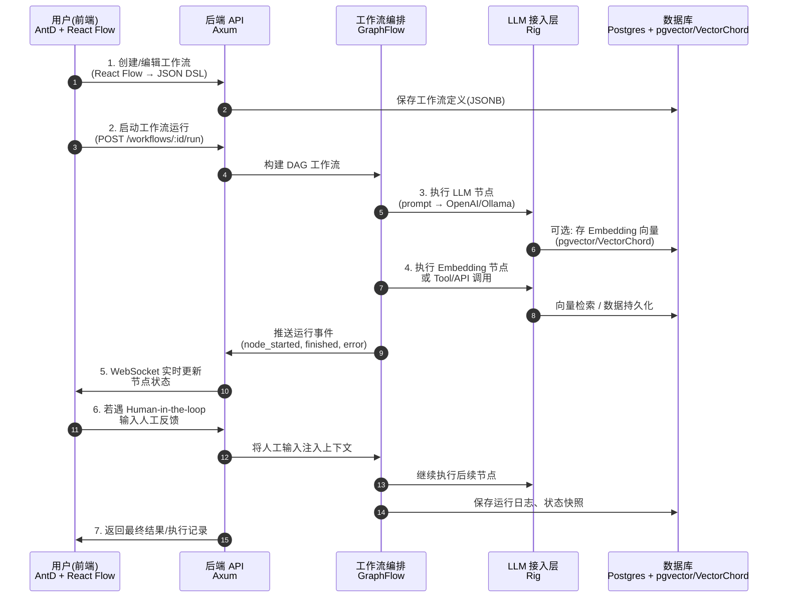

# AI 工作流平台的基础架构

兼顾 工作流编排、LLM 集成、Web API 层 三个层次。下面我整理一份最适合这套库的 技术方案建议：

**Ant Design + React Flow 前端**，**PostgreSQL + pgvector + VectorChord 向量存储**。这样一来，我们可以把之前的方案升级为一个 **完整的 AI 工作流平台架构**，同时对前后端交互和数据存储层做精细化调整。

---

## 1. 系统总体架构

```
前端层 (React + Ant Design + React Flow)
 ├─ 可视化节点编辑器 (基于 React Flow)
 ├─ 工作流 DSL 编辑/保存 (JSON Schema)
 ├─ 实时运行状态展示 (WebSocket 订阅)
 └─ 用户认证、权限管理 UI

后端 API 层 (Axum)
 ├─ REST API (工作流 CRUD, 执行, 查询)
 ├─ WebSocket (实时运行事件: 节点开始/完成/错误)
 ├─ Auth (JWT/OAuth2)
 └─ 日志/监控接口

工作流编排层 (GraphFlow rs-graph-llm)
 ├─ 工作流解析 (DSL → DAG)
 ├─ 节点调度 (LLM 节点, Embedding 节点, Tool 节点)
 ├─ Session 状态管理 (支持持久化)
 └─ Human-in-the-loop (人工确认/补充输入)

LLM 集成层 (Rig Core)
 ├─ LLM Client (统一接口：OpenAI, Anthropic, Ollama, etc.)
 ├─ Prompt & RAG 管理
 ├─ Embedding API
 └─ Trait 扩展机制 (接入新模型/工具)

存储层 (PostgreSQL + pgvector + VectorChord)
 ├─ 工作流定义 (JSONB)
 ├─ 工作流运行实例 & 日志 (表结构)
 ├─ 向量存储 (pgvector + VectorChord)
 └─ 任务调度用 KV (可用 Redis 缓存加速)
```

---

## 2. 工作流 DSL 设计（前后端交互）

前端 React Flow 导出的 **JSON Schema DSL**：

```json
{
  "nodes": [
    {
      "id": "n1",
      "type": "llm",
      "label": "Summarizer",
      "params": {
        "model": "openai:gpt-4",
        "prompt": "请总结以下文本: {{input}}"
      }
    },
    {
      "id": "n2",
      "type": "embedding",
      "label": "Vector Store",
      "params": {
        "store": "pgvector",
        "collection": "docs"
      }
    },
    {
      "id": "n3",
      "type": "tool",
      "label": "API Call",
      "params": {
        "url": "https://api.example.com/post",
        "method": "POST"
      }
    }
  ],
  "edges": [
    { "from": "n1", "to": "n2" },
    { "from": "n2", "to": "n3" }
  ]
}
```

---

## 3. 数据库存储设计

### 表结构（PostgreSQL + pgvector）

```sql
-- 工作流定义表
CREATE TABLE workflows (
  id UUID PRIMARY KEY,
  name TEXT NOT NULL,
  definition JSONB NOT NULL,
  created_at TIMESTAMP DEFAULT now()
);

-- 工作流运行实例
CREATE TABLE workflow_runs (
  id UUID PRIMARY KEY,
  workflow_id UUID REFERENCES workflows(id),
  status TEXT, -- pending, running, completed, failed
  started_at TIMESTAMP DEFAULT now(),
  finished_at TIMESTAMP
);

-- 节点运行日志
CREATE TABLE node_runs (
  id UUID PRIMARY KEY,
  run_id UUID REFERENCES workflow_runs(id),
  node_id TEXT,
  status TEXT,
  input JSONB,
  output JSONB,
  started_at TIMESTAMP DEFAULT now(),
  finished_at TIMESTAMP
);

-- 向量存储 (pgvector + VectorChord)
CREATE TABLE embeddings (
  id UUID PRIMARY KEY,
  workflow_id UUID REFERENCES workflows(id),
  content TEXT,
  embedding VECTOR(1536) -- 由 pgvector 提供
);
```

---

## 4. 运行流程

1. **前端 (React Flow + AntD)**

   - 用户拖拽节点、配置参数 → 导出 JSON DSL
   - 保存工作流（POST `/workflows`）
   - 启动运行（POST `/workflows/:id/run`）
   - 订阅运行事件（WebSocket `/runs/:id/events`）

2. **后端 (Axum)**

   - 接收 DSL，存入 `workflows.definition`
   - 启动运行实例，调用 GraphFlow 构建 DAG
   - 执行节点 → 调用 Rig → 执行 LLM / Embedding / Tool
   - 向 WebSocket 推送节点运行状态

3. **GraphFlow (rs-graph-llm)**

   - 解析 DSL → 构建节点/边 DAG
   - 调度执行，支持状态持久化 (存 PostgreSQL)
   - 遇到 Human-in-loop 节点时，向 WebSocket 推送请求，等待前端人工反馈

4. **Rig**

   - 调用 OpenAI API / Anthropic / Ollama 等
   - 统一封装 LLM 请求接口
   - 提供 Embedding → 写入 PostgreSQL (pgvector + VectorChord 索引)

5. **PostgreSQL + pgvector + VectorChord**

   - 存储工作流、运行实例、节点日志
   - 向量存储：支持语义检索、RAG 查询
   - 通过 VectorChord 加速大规模 embedding 检索

---

## 5. 前端交互亮点

- **Ant Design**：表单、表格、结果展示（适合配置 LLM 节点参数、运行日志查询）
- **React Flow**：拖拽式工作流构建器 → JSON DSL
- **WebSocket 实时更新**：显示每个节点的运行状态 (running ✅, error ❌, waiting ⏳)
- **人机协作**：GraphFlow 人工输入节点 → 前端弹窗请求输入 → 提交回后端继续执行

---

## 6. 技术亮点

- Rust 全链路后端：**类型安全 + 高性能**
- **GraphFlow**：复杂工作流编排（支持 DAG、分支、循环、状态恢复）
- **Rig**：统一多模型 LLM API，支持 Embedding + RAG
- **Postgres/pgvector/VectorChord**：既是主数据库，也是向量检索存储，降低运维复杂度
- **React Flow + AntD**：低门槛的前端交互体验，快速搭建 n8n/Dify 风格编辑器

---

✅ 这样更新后，你的系统基本就是一个 Rust 版的 **Dify + n8n 混合体**：

- **GraphFlow = Orchestration Engine**
- **Rig = LLM/RAG 层**
- **Axum = API Gateway**
- **Postgres/pgvector/VectorChord = 统一存储层**
- **AntD + React Flow = 前端可视化平台**

---

### Mermaid 架构/交互图

展示从 前端 → Axum → GraphFlow → Rig → PostgreSQL(pgvector/VectorChord) 的完整运行流程。



🔑 图解说明

- 前端用 React Flow 搭建工作流 → Axum API 保存到 Postgres(JSONB)
- 启动时 Axum 调用 GraphFlow，构建并执行 DAG
- LLM/Embedding/工具节点统一通过 Rig 调用（屏蔽不同 LLM API）
- 向量数据写入 Postgres + pgvector + VectorChord，支持后续语义检索
- 运行事件通过 WebSocket 推送前端 → 前端实时更新节点运行状态
- 支持 human-in-the-loop，前端输入后继续执行
- 运行结束，保存日志和快照，返回结果
