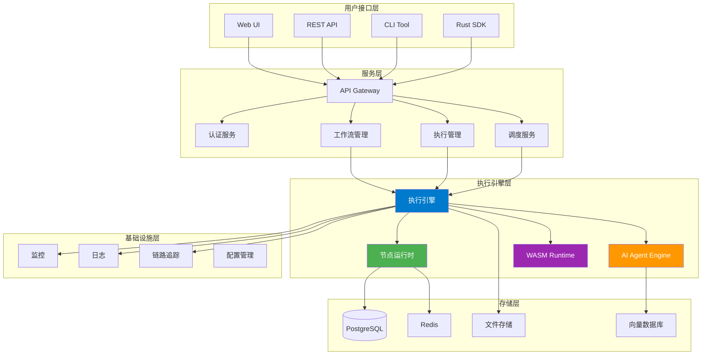
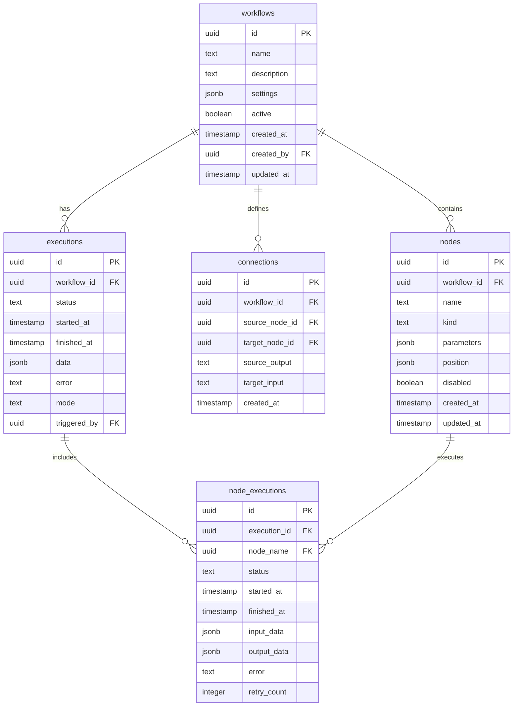
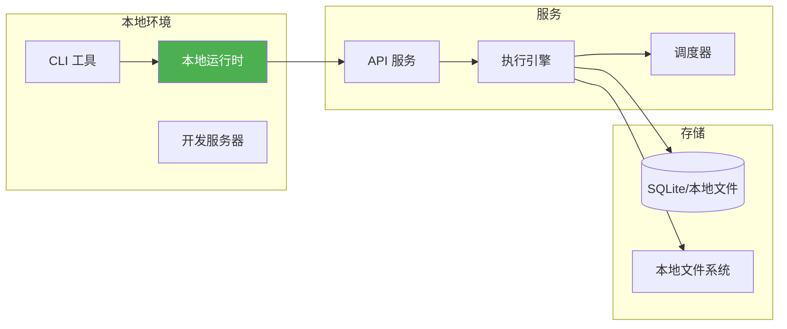
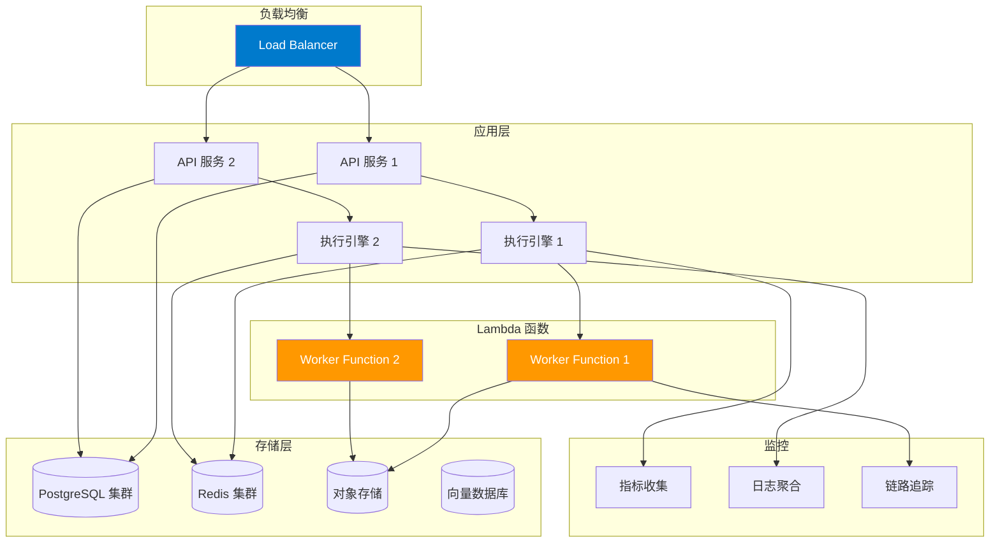

# Hetumind：基于 Rust 的工作流自动化系统架构总览

## 1. 系统概述

Hetumind（河图智思）是一个完全基于 Rust 重写的现代化工作流自动化系统，受 n8n 启发但采用了更加现代化的架构设计。系统提供了高性能、类型安全、内存安全的工作流执行引擎，支持本地运行和 Lambda 函数部署。

### 1.1 设计哲学

- **类型安全**: 利用 Rust 的类型系统确保编译时安全
- **零拷贝**: 尽可能使用零拷贝操作提升性能
- **异步优先**: 全面采用 async/await 模式
- **模块化**: 松耦合的模块设计便于扩展
- **可观测性**: 内置监控、日志和追踪能力

### 1.2 核心特性

- **高性能**: Rust 原生性能，比 Node.js 版本快 5-10 倍
- **内存安全**: 无 GC 压力，内存使用可预测
- **并发执行**: 基于 Tokio 的高并发异步执行
- **WASM 支持**: Code 节点支持 WebAssembly 执行
- **AI 集成**: 内置 AI Agent 支持（基于 rig 框架）
- **云原生**: 支持容器化和 Lambda 函数部署

## 2. 技术栈架构

### 2.1 系统架构图

## 3. 核心模块架构

### 3.1 模块划分

```mermaid
graph TD
    Core[hetumind-core] --> Workflow[workflow]
    Core --> Node[node]
    Core --> Execution[execution]
    Core --> Types[types]

    Runtime[hetumind-runtime] --> Engine[engine]
    Runtime --> Scheduler[scheduler]
    Runtime --> Memory[memory]

    Nodes[hetumind-nodes] --> Standard[standard]
    Nodes --> AI[ai]
    Nodes --> Integration[integration]

    API[hetumind-api] --> Routes[routes]
    API --> Middleware[middleware]
    API --> Auth[auth]

    DB[hetumind-db] --> Schema[schema]
    DB --> Models[models]
    DB --> Migrations[migrations]

    Lambda[hetumind-lambda] --> Handler[handler]
    Lambda --> Deploy[deploy]

    style Core fill:#007acc,color:#fff
    style Runtime fill:#4CAF50,color:#fff
    style Nodes fill:#FF9800,color:#fff
```

### 3.2 数据架构

## 4. 部署架构

### 4.1 本地运行模式

### 4.2 生产部署模式

## 5. 性能指标目标

### 5.1 性能基准

| 指标           | 目标值     | n8n 对比 |
| -------------- | ---------- | -------- |
| 工作流启动延迟 | < 10ms     | < 100ms  |
| 节点执行吞吐   | > 10,000/s | ~1,000/s |
| 内存占用       | < 50MB     | ~200MB   |
| 并发执行数     | > 1,000    | ~100     |
| 冷启动时间     | < 500ms    | ~2s      |

### 5.2 扩展性目标

- **水平扩展**: 支持 100+ 执行引擎实例
- **工作流规模**: 单个工作流支持 1000+ 节点
- **数据处理**: 单次执行处理 GB 级数据
- **并发用户**: 支持 10,000+ 并发用户

## 6. 开发计划

### 6.1 MVP 阶段（第一阶段）

1. **核心类型系统** - 定义基础数据结构
2. **简单执行引擎** - 支持基础节点执行
3. **REST API** - 基本的 CRUD 操作
4. **本地运行时** - 命令行工具支持

### 6.2 增强阶段（第二阶段）

1. **完整节点生态** - 实现所有标准节点
2. **AI Agent 集成** - 基于 rig 的 AI 能力
3. **WASM 支持** - Code 节点 WebAssembly 执行
4. **调度系统** - Cron 和事件触发器

### 6.3 生产阶段（第三阶段）

1. **Lambda 部署** - 云函数执行模式
2. **监控系统** - 完整的可观测性
3. **集群部署** - 高可用生产环境
4. **生态集成** - 第三方节点和插件

Hetumind 将成为下一代工作流自动化平台的标杆，结合 Rust 的性能优势和现代化的架构设计，为用户提供更快、更安全、更可靠的自动化解决方案。
