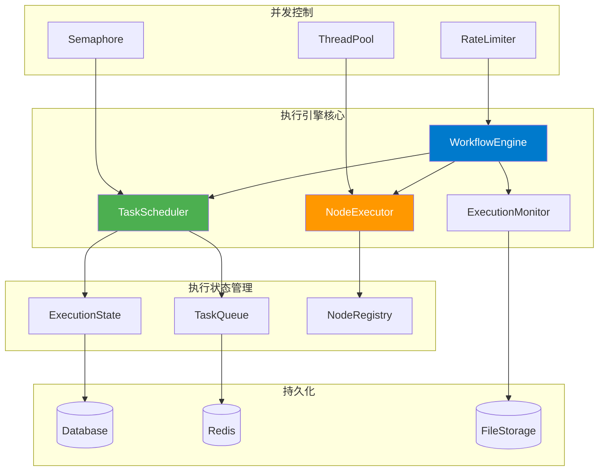
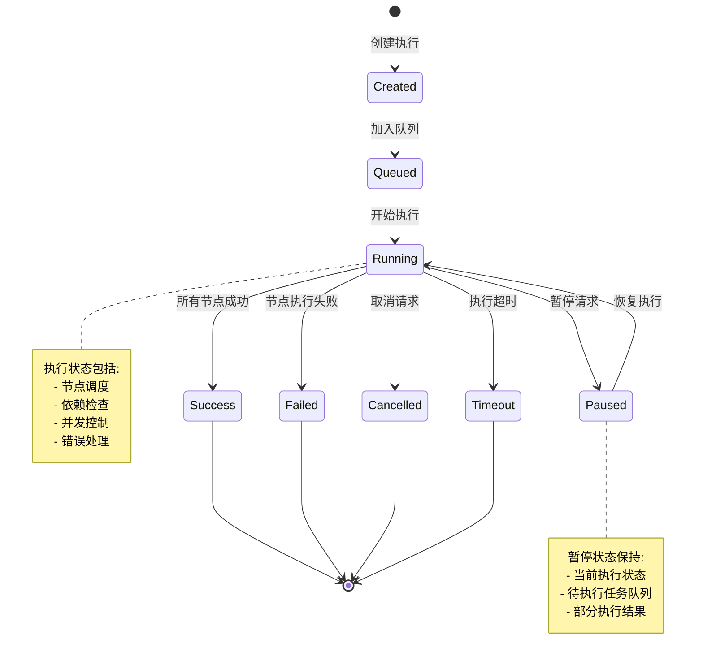
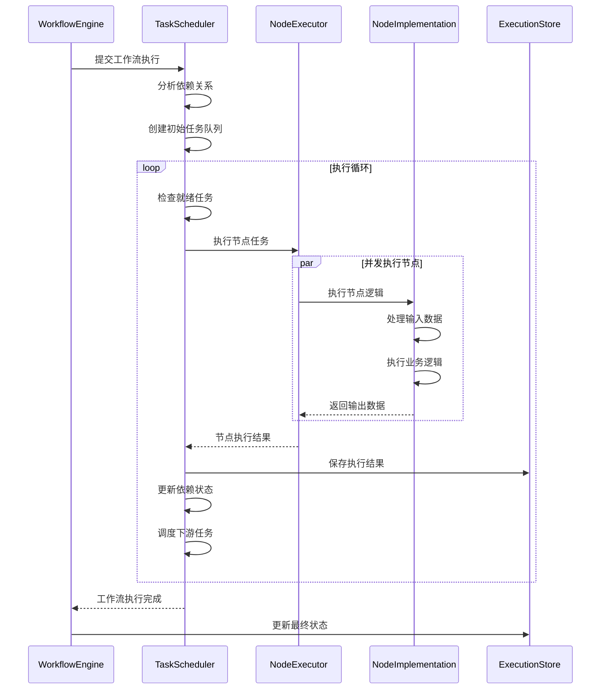
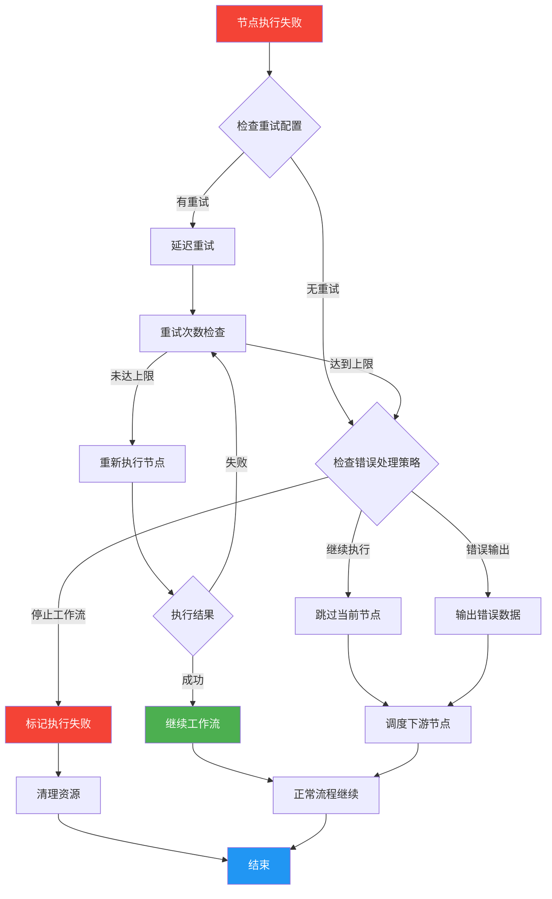
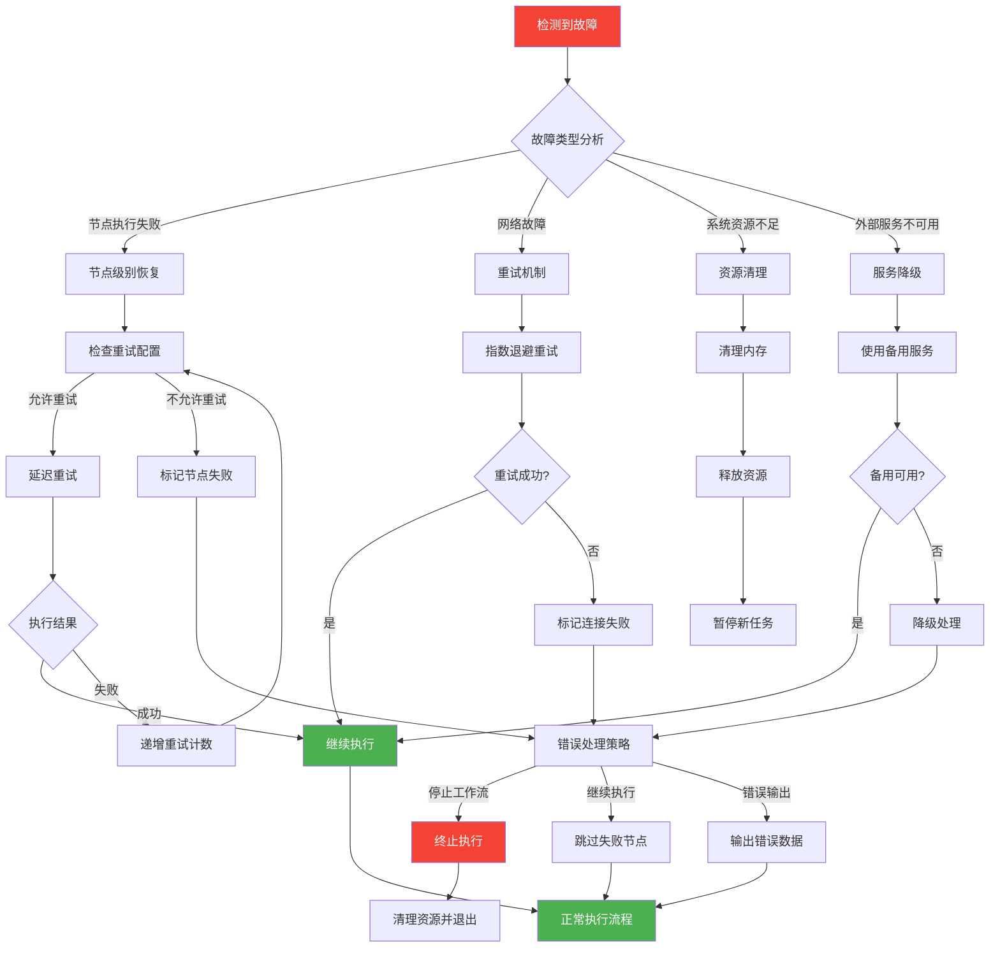

# Hetumind 执行引擎设计

## 1. 执行引擎概述

Hetumind 执行引擎是系统的核心组件，负责工作流的调度、执行和管理。它采用基于 Rust 的 async/await 模式，提供高性能、类型安全的工作流执行能力。

### 1.1 设计目标

- **高性能**: 利用 Rust 零成本抽象和 Tokio 异步运行时
- **并发安全**: 利用 Rust 的所有权系统保证内存安全
- **可扩展**: 支持水平扩展和负载均衡
- **容错性**: 具备故障恢复和重试机制
- **可观测**: 内置监控和日志记录

### 1.2 核心组件

## 2. 核心执行结构

### 2.1 工作流执行引擎

- [ExecutionConfig](../../../crates/hetumind/hetumind-core/src/workflow/config.rs)
- [WorkflowEngineImpl](../../../crates/hetumind/hetumind-studio/src/runtime/workflow/engine.rs)

### 2.2 任务调度器

- [TaskScheduler](../../../crates/hetumind/hetumind-studio/src/runtime/task/task_scheduler.rs)

### 2.3 节点执行器

- [NodeExecutorImpl](../../../crates/hetumind/hetumind-studio/src/runtime/node/node_executor.rs)

## 3. 执行流程设计

### 3.1 工作流执行状态机

### 3.2 节点执行流程

### 3.3 错误处理流程

## 4. 并发控制机制

### 4.1 并发控制器

- [ConcurrencyController](../../../crates/hetumind/hetumind-studio/src/runtime/task/concurrency_controller.rs)

### 4.2 资源监控

- [ResourceMonitor](../../../crates/hetumind/hetumind-studio/src/runtime/task/resource_monitor.rs)

## 5. 执行监控和观测

### 5.1 执行监控器

- [ExecutionMonitor](../../../crates/hetumind/hetumind-studio/src/runtime/task/execution_monitor.rs)

### 5.2 性能指标定义

- [ExecutionMetrics](../../../crates/hetumind/hetumind-core/src/metrics/mod.rs)
- [ResourceUsage](../../../crates/hetumind/hetumind-core/src/metrics/mod.rs)

## 6. 容错和恢复机制

### 6.1 故障检测和恢复

### 6.2 检查点和状态恢复

- [CheckpointManager](../../../crates/hetumind/hetumind-studio/src/runtime/checkpoint/checkpoint_manager.rs)

这个执行引擎设计提供了完整的工作流执行能力，包括高性能的任务调度、并发控制、错误处理和监控能力，为 Hetumind 系统提供了可靠的执行基础。
