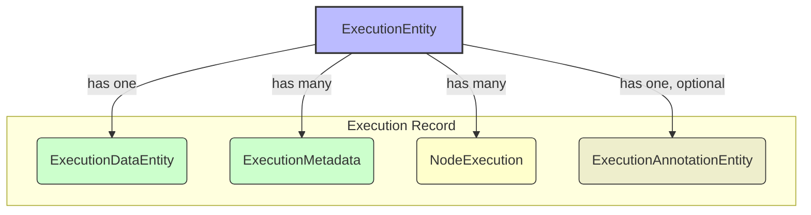

# Hetumind Execution 执行相关数据实体

## Execution Entities

Hetumind 的执行实体设计深受 n8n 的启发，并针对 Rust 的强类型、高性能环境进行了优化和调整。其核心思想一脉相承：将一次工作流执行的**宏观摘要**、**最终业务数据**、**详细过程日志**和**人工备注**进行分离存储，以实现高性能的运行时、可追溯的执行历史和清晰的关注点分离。

本文档将分别介绍用于**持久化存储的数据库实体**和在**执行期间流转的内存数据结构**。

### 1. 数据库持久化实体 (Persistence Models)

这些是在 `crates/hetumind/hetumind/src/domain/workflow/execution_model.rs` 中定义的结构体，它们直接映射到数据库中的表，用于永久记录工作流的执行历史。



#### `ExecutionEntity`

**作用**: **执行的摘要**。这是核心实体，代表了一次工作流的**整体执行过程**的宏观状态和生命周期信息。

- **核心字段**:
  - `id: ExecutionId`: 唯一标识符。
  - `workflow_id: WorkflowId`: 关联到具体的工作流。
  - `status: ExecutionStatus`: 执行状态 (e.g., `Running`, `Succeeded`, `Failed`)。
  - `mode: ExecutionMode`: 执行模式 (e.g., `Manual`, `Webhook`, `Cron`)。
  - `started_at`, `finished_at`: 执行的开始和结束时间。

#### `ExecutionDataEntity`

**作用**: **执行的结果与快照**。此表与 `ExecutionEntity` 是一对一关系，但分离出来以优化性能。

- **核心字段**:
  - `execution_id: ExecutionId`: 外键，关联到 `ExecutionEntity`。
  - `workflow_data: serde_json::Value`: **执行快照**。在每次执行开始时，将当时的工作流定义完整序列化为 JSON 并存储。这保证了无论工作流后续如何修改，本次执行的记录都是不可变、可复现的。
  - `data: String`: **最终结果**。仅存储工作流最后一个（或所有未连接输出的）节点的最终输出数据。不包含中间节点的输入输出。

#### `NodeExecution` (from `hetumind-core/src/node/execution.rs`)

**作用**: **执行的过程日志**。虽然在 `execution.rs` 中定义，但它被设计为可持久化的实体，用于记录**每一个节点**的详细执行情况。

- **核心字段**:
  - `id: Uuid`: 节点执行的唯一 ID。
  - `execution_id: ExecutionId`: 关联到 `ExecutionEntity`。
  - `node_name: NodeId`: 执行的节点 ID。
  - `status: NodeExecutionStatus`: 该节点执行的成功/失败状态。
  - `started_at`, `finished_at`: 节点的开始和结束时间。
  - `input_data`, `output_data`: 节点的输入输出数据（可选存储，用于调试）。
- **关系**: 与 `ExecutionEntity` 是"一对多"关系。通过查询一个 `execution_id` 关联的所有 `NodeExecution` 记录，可以在 UI 上重现工作流每一步的执行状态、耗时和数据预览。

#### `ExecutionMetadata`

**作用**: **工作流级别的元数据**。这是一个灵活的键值对存储，用于记录关于**整个工作流执行过程**的、非结构化的上下文信息，它不应用于记录单个节点的执行细节。

- **核心字段**: `execution_id`, `key`, `value`。
- **使用场景**:
  - 存储触发来源信息，如 `triggering_ip_address: "192.168.1.1"`。
  - 记录执行环境的版本，如 `runner_version: "v0.2.1"`。
  - 标记特殊的执行，如 `source: "manual_retry"`。
- **与 `NodeExecution` 的区别**: `ExecutionMetadata` 关注的是**整个执行**的上下文，而 `NodeExecution` 关注的是**单个节点**的详细过程。两者互为补充。

#### `ExecutionAnnotationEntity`

**作用**: **执行的备注**。用于存储用户或系统为某次执行添加的人工注释或标记，以增强团队协作和问题追溯。

---

### 2. 运行时内存数据结构 (In-Memory Structures)

这些是在 `crates/hetumind/hetumind-core/src/node/execution.rs` 中定义的结构体。为了极致的性能，它们在工作流执行期间在内存中创建和传递，执行结束后其部分信息会被持久化到上述数据库实体中。

#### `ExecutionData`

**作用**: **节点间流动的数据单元**。这是 Hetumind 工作流中的"血液"，是节点之间传递数据的标准格式。它并非直接传递裸的 JSON，而是借鉴了 n8n 的 `INodeExecutionData` 思想，作为一个多功能的**数据容器 (Data Container)**，被包装在一个携带了丰富上下文的结构体中。

- **核心字段**:
  - `json: JsonValue`: **核心业务数据**。与 n8n 一样，这是所有数据项的基础，存放着结构化的 JSON 数据。
  - `binary: Option<BinaryDataReference>`: **二进制数据引用**。这个设计与 n8n 的二进制处理机制在理念上完全一致。它不直接在内存中传递文件内容，而是传递一个指向对象存储中文件的轻量级引用。这极大地提升了内存效率，并为云原生/Serverless 架构铺平了道路。
  - `source: Option<DataSource>`: **数据血缘 (Data Lineage)**。这是 Hetumind 对 n8n `pairedItem` 概念的实现，用于追踪数据来源。`DataSource` 清晰地记录了数据来自哪个节点的哪个输出端口，这对于调试和理解复杂工作流至关重要。
  - `index: usize`: **数据项索引**。保留了数据项在进入节点前的原始批次中的索引。在循环、合并等操作中，这个索引可以用来保持数据的对应关系。

##### 与 n8n 的主要设计差异

虽然 Hetumind 的 `ExecutionData`深受 n8n 启发，但在 Rust 的强类型和设计哲学下，也做出了一些关键的取舍和改变：

1.  **错误处理 (Error Handling)**:

    - **n8n**: `INodeExecutionData` 内部有一个可选的 `error` 字段。这允许在 "Continue on Fail" 模式下，将某个失败的数据项连同其错误信息一起传递给下游节点，实现数据流层面的错误处理。
    - **Hetumind**: `ExecutionData` **没有** `error` 字段。Hetumind 将成功的数据流和失败的执行状态彻底分离。一个节点的执行结果是 `NodeExecutionResult`，它要么包含一个**纯净的** `Vec<ExecutionData>`（全部成功），要么包含一个 `error`（执行失败）。这种设计更符合 Rust 的 `Result<T, E>` 模式，逻辑更清晰，避免了数据与错误在同一个集合中混合。

2.  **数据溯源 (Data Lineage)**:
    - **n8n**: `pairedItem` 机制非常灵活，可以记录一个输出项来自多个输入（例如 `Merge` 节点），其血缘可以是一个数组。
    - **Hetumind**: 当前的 `DataSource` 只能记录**单一来源**。这意味着在需要合并多个输入源的场景（如 `Merge` 节点）中，需要由节点自身通过其他方式（例如在 `json` 数据内部添加字段）来维护更复杂的血缘关系。这是为了简化核心数据结构所做的权衡。

**总结**: Hetumind 的 `ExecutionData` 是一个符合 Rust 语言习惯、类型安全、高性能的数据容器。它通过内置的数据血缘和二进制引用机制，为构建健壮、可观测的工作流引擎提供了坚实的基础，同时通过分离数据与错误，提供了更清晰的执行模型。

#### `BinaryDataReference`

**作用**: **处理二进制数据的高效机制**。当节点处理文件（如图片、视频、二进制文件）时，Hetumind 不会在 `ExecutionData` 中直接传递庞大的文件内容。相反，它会将文件存入对象存储（如 S3 或本地文件系统），然后在节点间只传递这个轻量级的 `BinaryDataReference` 引用。

- **优势**:
  - **内存效率**: 极大地降低了执行引擎的内存占用。
  - **云原生友好**: 在分布式或 Serverless 环境中，无法直接传递内存 Buffer，而传递对象存储的 Key 是标准实践。
  - **流程规范**: 强制规范了二进制数据的处理流程，使工作流状态更容易持久化和恢复。

---

### 总结与对比

| 特性         | n8n (Node.js)                                           | Hetumind (Rust)                                                                | 优势与考量                                                                                           |
| ------------ | ------------------------------------------------------- | ------------------------------------------------------------------------------ | ---------------------------------------------------------------------------------------------------- |
| **核心实体** | `ExecutionEntity`, `ExecutionData`, `ExecutionMetadata` | `ExecutionEntity`, `ExecutionDataEntity`, `NodeExecution`, `ExecutionMetadata` | Hetumind 将节点执行日志明确为 `NodeExecution` 实体，结构更清晰。                                     |
| **数据传递** | `INodeExecutionData[][]` (内存中的对象数组)             | `Vec<ExecutionData>` (携带`DataSource`和`BinaryDataReference`的结构体)         | Hetumind 的 `ExecutionData` 提供了内置的**数据血缘**和**二进制引用**，设计更健壮、更适合云原生环境。 |
| **执行快照** | 通过 `ExecutionData` 的 `data` 字段存储                 | 通过 `ExecutionDataEntity` 的 `workflow_data` 字段明确存储                     | Hetumind 的字段命名更清晰地分离了"工作流快照"和"最终输出数据"。                                      |
| **类型系统** | 动态类型 (TypeScript)                                   | 静态类型 (Rust)                                                                | Rust 的强类型在编译时就能消除大量潜在错误，但要求数据结构定义更严谨。                                |

### 3. 设计分析与重构建议

#### 问题：`NodeExecution` 与 `ExecutionMetadata` 的职责重叠

在当前的设计中，`NodeExecution` 和 `ExecutionMetadata` 存在明显的功能冗余。`NodeExecution` 是一个强类型的结构化实体，专门用于记录节点执行的详细日志（状态、时间、I/O 数据、错误等）。然而，`ExecutionMetadata` 的文档注释却描述了几乎完全相同的用途，这造成了设计的混淆。

#### 解决方案：明确职责，实施单一数据源原则

为了设计的清晰和长久的可维护性，我们必须对二者进行严格的职责划分：

1.  **`NodeExecution` 作为唯一数据源**:

    - **职责**: **唯一**负责持久化**单个节点**执行过程的所有结构化信息。
    - **定位**: 节点级的、详细的、结构化的**过程日志 (Process Log)**。

2.  **`ExecutionMetadata` 重新定位**:
    - **职责**: 负责持久化**整个工作流执行**级别的、非结构化的**上下文元数据 (Contextual Metadata)**。
    - **定位**: 工作流级的、灵活的、非结构化的**属性包 (Property Bag)**。它不应被用来存储任何节点级的过程信息。

#### 代码重构建议

为了使代码与上述设计原则保持一致，建议对 `crates/hetumind/hetumind/src/domain/workflow/execution_model.rs` 中的 `ExecutionMetadata` 结构体进行如下修改：

- **修改文档注释**: 将其文档注释更新，明确说明其用途是存储**工作流级别**的、灵活的**键值对元数据**，并给出具体用例（如触发 IP、运行环境版本等），同时删除所有与节点执行细节相关的描述。

**重构示例 (伪代码):**

```rust
// In: crates/hetumind/hetumind/src/domain/workflow/execution_model.rs

/// 执行元数据表
/// - 作用: 存储关于【整个工作流执行】的、非结构化的上下文元信息。
///         这是一个灵活的键值对集合，用于补充 ExecutionEntity 中的标准字段。
/// - 注意: 【不要】用它来存储任何与单个节点执行相关的过程信息（如状态、时间、错误等），
///         这类信息应由专门的 `NodeExecution` 实体负责。
/// - 示例:
///   - key: "triggering_ip", value: "192.168.1.1"
///   - key: "runner_version", value: "v0.2.1"
#[derive(Debug, Clone, Serialize, Deserialize, FromRow, Fields)]
#[enum_def(table_name = "execution_metadata")]
pub struct ExecutionMetadata {
  pub id: Uuid,
  pub execution_id: ExecutionId,
  pub key: String,
  pub value: String,
}
```

通过这次重构，我们将建立一个清晰、无冗余且更易于理解和维护的执行数据模型。
