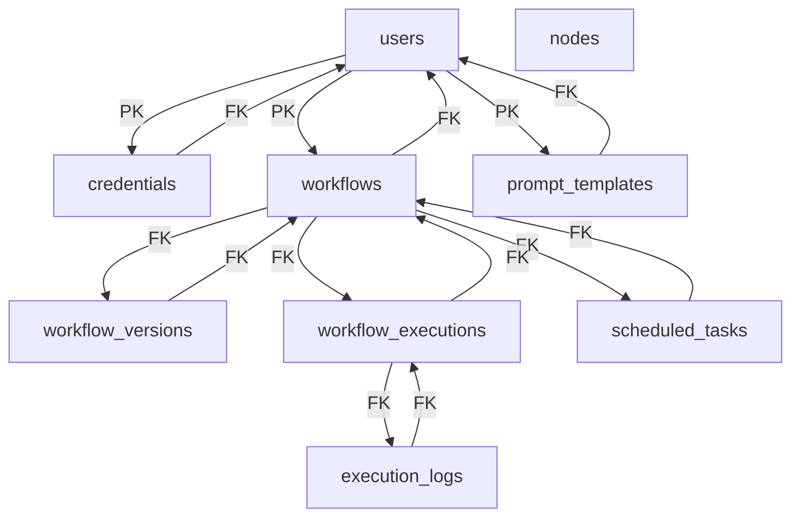

## ERD (Entity-Relationship Diagram)

## 实体属性 (Entity Attributes)

### users

- id: bigint, PK
- username: varchar
- email: varchar
- password_hash: varchar
- role: varchar
- cid: bigint
- ctime: timestamptz
- mid: bigint
- mtime: timestamptz

### credentials

- id: bigint, PK
- user_id: int, FK
- name: varchar
- type: varchar
- encrypted_data: varchar
- cid: bigint
- ctime: timestamptz
- mid: bigint
- mtime: timestamptz

### workflows

- id: bigint, PK
- user_id: int, FK
- name: varchar
- description: text
- definition: jsonb
- is_active: boolean
- cid: bigint
- ctime: timestamptz
- mid: bigint
- mtime: timestamptz

### workflow_versions

- id: bigint, PK
- workflow_id: int, FK
- version_number: int
- definition: jsonb
- cid: bigint, FK
- ctime: timestamptz

### workflow_executions

- id: bigint, PK
- workflow_id: int, FK
- workflow_version_id: int, FK
- status: varchar
- triggered_by: varchar
- start_time: timestamptz
- end_time: timestamptz
- input_data: jsonb
- output_data: jsonb
- error_message: text
- cid: bigint
- ctime: timestamptz

### execution_logs

- id: bigint, PK
- execution_id: int, FK
- node_id_in_workflow: int
- node_name: varchar
- status: varchar
- input_data: jsonb
- output_data: jsonb
- error_message: text
- cid: bigint
- ctime: timestamptz

### scheduled_tasks

- id: bigint, PK
- workflow_id: int, FK
- cron_expression: varchar
- next_run_time: timestamptz
- is_active: boolean
- last_run_status: varchar
- cid: bigint
- ctime: timestamptz

### nodes

- id: bigint, PK
- name: varchar
- type: varchar
- description: text
- icon: varchar
- parameters_schema: jsonb
- package_url: varchar
- cid: bigint
- ctime: timestamptz

### prompt_templates

- id: bigint, PK
- user_id: int, FK
- name: varchar
- template_text: text
- variables: jsonb
- cid: bigint
- ctime: timestamptz
- mid: bigint
- mtime: timestamptz

## 项目开发计划 (Project Development Plan)

1. **需求分析 (Requirement Analysis)**

   - 时间：2 周
   - 活动：收集和分析用户需求，确定项目范围和目标。

2. **系统设计 (System Design)**

   - 时间：3 周
   - 活动：设计系统架构和数据库结构，创建 ERD。

3. **前端开发 (Frontend Development)**

   - 时间：4 周
   - 活动：使用 Vue 3 和 OpenTiny 开发用户界面，集成 Vue Flow。

4. **后端开发 (Backend Development)**

   - 时间：6 周
   - 活动：使用 Rust 和 Axum 开发 API 和服务层，集成 SQLx 和 PostgreSQL。

5. **集成与测试 (Integration and Testing)**

   - 时间：3 周
   - 活动：集成前后端，进行功能测试和性能测试。

6. **部署与发布 (Deployment and Release)**

   - 时间：2 周
   - 活动：准备生产环境，部署应用，发布版本。

7. **维护与支持 (Maintenance and Support)**
   - 时间：持续
   - 活动：监控系统运行，修复问题，提供用户支持。
