# n8n AI Agent（智能代理）节点深度解析

## 1. 节点架构与基础信息

### 1.1 节点基本信息
- **显示名称**: AI Agent
- **节点名称**: `agent`
- **图标**: 🤖 (fa:robot)
- **图标颜色**: 黑色
- **组别**: transform
- **当前版本**: 2.0 (默认版本)
- **源码路径**: `packages/@n8n/nodes-langchain/nodes/agents/Agent/`

### 1.2 节点描述
AI Agent 节点是 n8n 中最核心的人工智能节点之一，它能够生成行动计划并执行复杂任务。该节点支持多种智能代理类型，可以使用外部工具，具备记忆能力，并能产生结构化输出，是构建智能自动化工作流的核心组件。

### 1.3 版本历史与演进
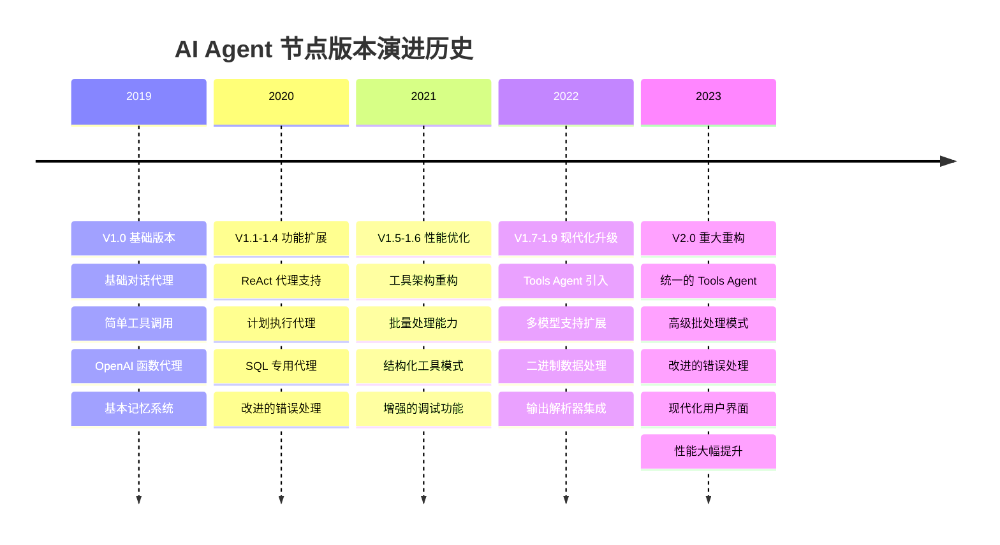

### 1.4 节点架构与数据流
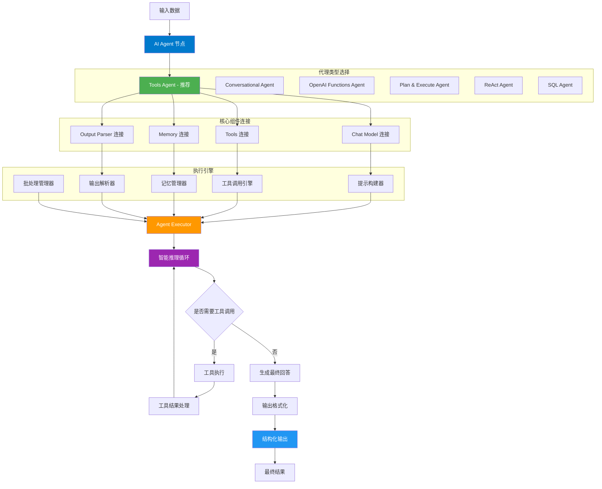

---

## 2. 节点属性配置详解

### 2.1 代理类型配置

#### 支持的代理类型
```typescript
interface AgentTypes {
  toolsAgent: {
    name: 'Tools Agent';
    description: '利用结构化工具模式进行精确可靠的工具选择和执行';
    features: ['结构化工具调用', '高精度', '推荐使用'];
    requirements: ['支持工具调用的模型'];
  };
  conversationalAgent: {
    name: 'Conversational Agent';
    description: '在系统提示中描述工具并解析JSON响应进行工具调用';
    features: ['灵活性高', '兼容性强', '简单交互'];
    requirements: ['基础聊天模型'];
  };
  openAiFunctionsAgent: {
    name: 'OpenAI Functions Agent';
    description: '利用OpenAI的函数调用能力精确选择和执行工具';
    features: ['OpenAI优化', '结构化输出', '高精度'];
    requirements: ['OpenAI 兼容模型'];
  };
  planAndExecuteAgent: {
    name: 'Plan and Execute Agent';
    description: '为复杂任务创建高级计划然后逐步执行';
    features: ['策略规划', '多阶段处理', '复杂任务'];
    requirements: ['规划能力强的模型'];
  };
  reActAgent: {
    name: 'ReAct Agent';
    description: '在迭代过程中结合推理和行动';
    features: ['推理行动循环', '逐步分析', '问题解决'];
    requirements: ['推理能力强的模型'];
  };
  sqlAgent: {
    name: 'SQL Agent';
    description: '专门用于与SQL数据库交互';
    features: ['SQL查询生成', '数据分析', '结构化数据'];
    requirements: ['数据库连接', '数据库知识'];
  };
}
```

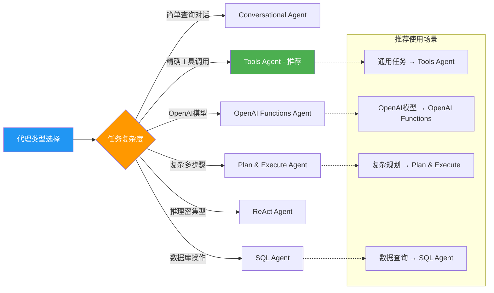

### 2.2 Chat Model 配置

#### 支持的语言模型
```typescript
interface SupportedChatModels {
  anthropic: {
    name: '@n8n/n8n-nodes-langchain.lmChatAnthropic';
    features: ['高级推理', '工具调用', '多模态'];
    toolSupport: true;
  };
  openai: {
    name: '@n8n/n8n-nodes-langchain.lmChatOpenAi';
    features: ['函数调用', '结构化输出', 'JSON模式'];
    toolSupport: true;
  };
  azure: {
    name: '@n8n/n8n-nodes-langchain.lmChatAzureOpenAi';
    features: ['企业级', '隐私保护', '本地部署'];
    toolSupport: true;
  };
  bedrock: {
    name: '@n8n/n8n-nodes-langchain.lmChatAwsBedrock';
    features: ['AWS集成', '多模型选择', '企业级'];
    toolSupport: true;
  };
  ollama: {
    name: '@n8n/n8n-nodes-langchain.lmChatOllama';
    features: ['本地运行', '开源模型', '隐私优先'];
    toolSupport: true;
  };
  // ... 其他模型
}
```

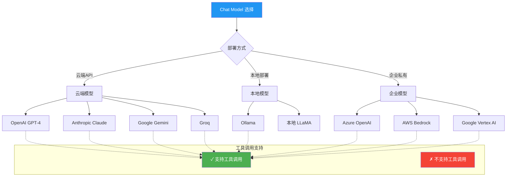

### 2.3 Memory 系统配置

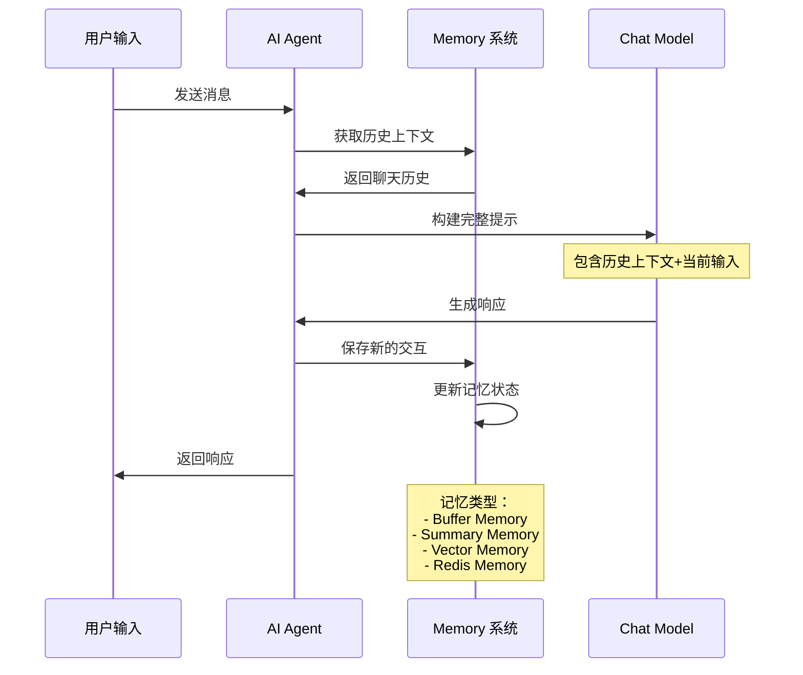

#### Memory 系统架构
```typescript
interface MemoryConfiguration {
  bufferMemory: {
    type: 'BufferMemory';
    features: ['简单存储', '完整历史', '内存限制'];
    config: {
      returnMessages: boolean;
      memoryKey: string;
      inputKey: string;
      outputKey: string;
    };
  };
  summaryMemory: {
    type: 'ConversationSummaryMemory';
    features: ['历史摘要', '节省内存', '智能压缩'];
    config: {
      llm: BaseChatModel;
      maxTokenLimit: number;
    };
  };
  vectorMemory: {
    type: 'VectorStoreRetrieverMemory';
    features: ['语义检索', '长期记忆', '相关性匹配'];
    config: {
      vectorStore: VectorStore;
      returnDocs: number;
    };
  };
}
```

---

## 3. Tools 系统深度解析

### 3.1 Tools 数据结构

#### 核心 Tool 接口
```typescript
// 基础工具接口
interface BaseTool {
  name: string;                    // 工具名称
  description: string;             // 工具描述
  func: (input: string) => Promise<string>; // 工具执行函数
}

// 结构化工具接口
interface StructuredTool extends BaseTool {
  schema: ZodSchema;               // 输入参数模式
  returnDirect?: boolean;          // 是否直接返回结果
}

// 动态结构化工具
interface DynamicStructuredTool {
  name: string;
  description: string;
  schema: ZodObject<any, any, any, any>;
  func: (input: Record<string, any>) => Promise<string>;
}
```

#### Tools 类型分类
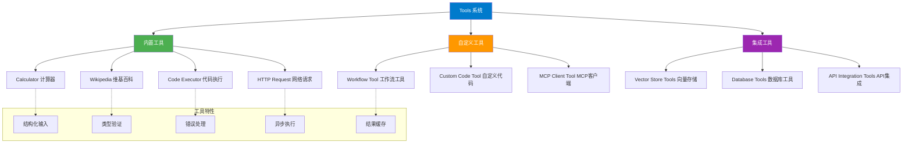

### 3.2 Tool 执行流程

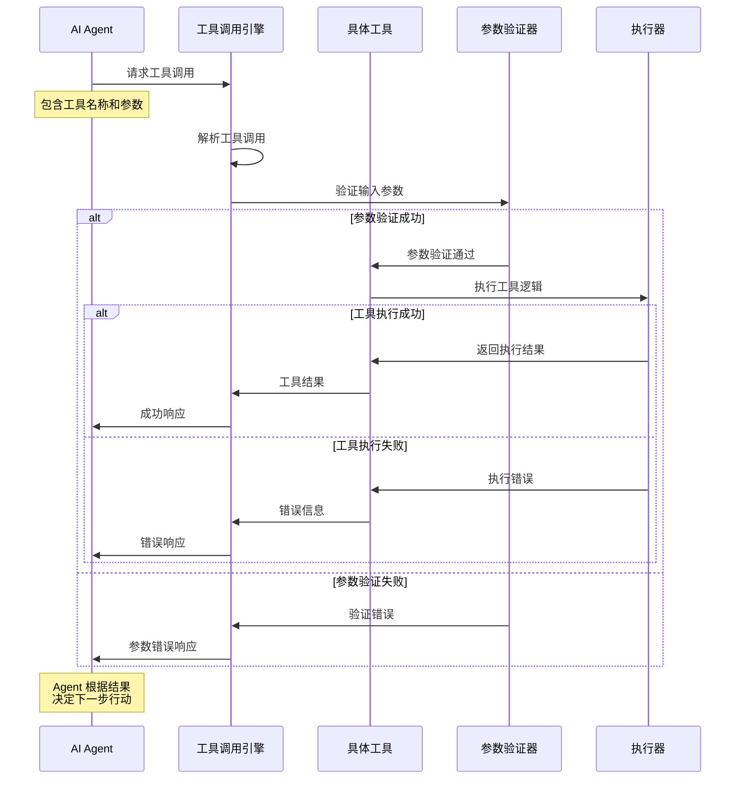

### 3.3 Tools 配置与注册

#### 工具注册流程
```typescript
// 工具连接获取
export async function getConnectedTools(
  ctx: IExecuteFunctions,
  nodeVersion: number,
  includeStructuredTools: boolean
): Promise<Array<DynamicStructuredTool | Tool>> {
  const tools: Array<DynamicStructuredTool | Tool> = [];

  // 获取所有连接的工具
  const connectedTools = await ctx.getInputConnectionData(
    NodeConnectionTypes.AiTool,
    0
  );

  if (Array.isArray(connectedTools)) {
    tools.push(...connectedTools);
  } else if (connectedTools) {
    tools.push(connectedTools);
  }

  return tools;
}

// 输出解析器工具创建
export async function createOutputParserTool(
  outputParser: N8nOutputParser
): Promise<DynamicStructuredTool> {
  const schema = getOutputParserSchema(outputParser);

  return new DynamicStructuredTool({
    name: 'format_final_json_response',
    description: `使用此工具将最终响应格式化为结构化JSON格式。
                 此工具根据模式验证输出以确保符合要求的格式。
                 仅在完成所有必要推理并准备提供最终答案时使用此工具。`,
    schema,
    func: async () => '' // 通过解析器拦截输出
  });
}
```

### 3.4 高级 Tools 功能

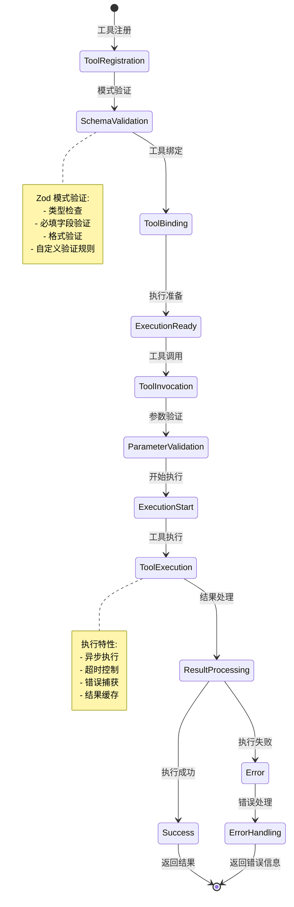

---

## 4. Output Parser 系统深度解析

### 4.1 Output Parser 数据结构

#### 核心 Parser 接口
```typescript
// 基础输出解析器接口
interface BaseOutputParser<T = unknown> {
  parse(text: string): Promise<T>;           // 解析文本
  getFormatInstructions(): string;           // 获取格式说明
  getSchema?(): ZodSchema;                   // 获取验证模式
}

// N8n 结构化输出解析器
class N8nStructuredOutputParser extends StructuredOutputParser {
  constructor(
    private context: ISupplyDataFunctions,
    zodSchema: z.ZodSchema<object>
  );

  async parse(text: string): Promise<object>;
  getSchema(): ZodSchema;
  static fromZodJsonSchema(
    zodSchema: z.ZodSchema<object>,
    nodeVersion: number,
    context: ISupplyDataFunctions
  ): Promise<N8nStructuredOutputParser>;
}

// 项目列表输出解析器
class N8nItemListOutputParser extends BaseOutputParser<string[]> {
  constructor(options: {
    numberOfItems?: number;
    separator?: string;
  });

  async parse(text: string): Promise<string[]>;
  getFormatInstructions(): string;
}

// 自动修复输出解析器
class N8nOutputFixingParser {
  constructor(
    context: ISupplyDataFunctions,
    model: BaseLanguageModel,
    parser: N8nStructuredOutputParser,
    retryPrompt: PromptTemplate
  );

  async parse(text: string): Promise<object>;
}
```

### 4.2 Output Parser 类型系统

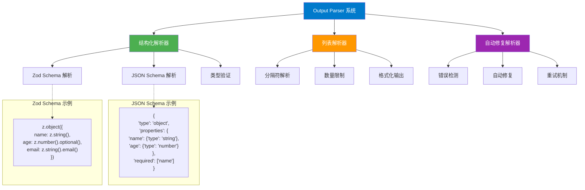

### 4.3 Parser 执行流程

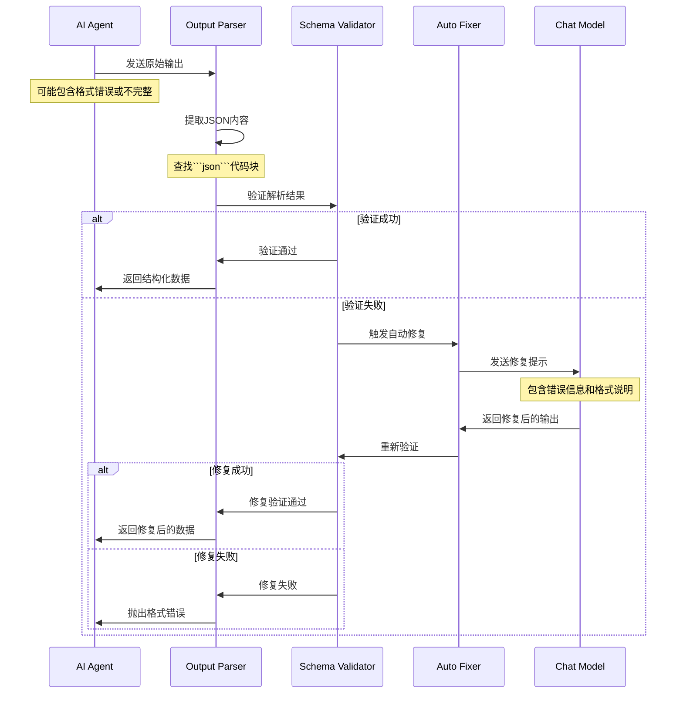

### 4.4 Schema 验证与转换

#### JSON Schema 到 Zod 转换
```typescript
// JSON Schema 定义
interface JSONSchemaDefinition {
  type: 'object' | 'array' | 'string' | 'number' | 'boolean' | 'null';
  properties?: Record<string, JSONSchemaDefinition>;
  items?: JSONSchemaDefinition;
  required?: string[];
  description?: string;
  format?: string;
  enum?: any[];
}

// Zod Schema 转换
export function convertJsonSchemaToZod<T extends ZodSchema>(
  jsonSchema: JSONSchema7
): T {
  // 递归转换 JSON Schema 到 Zod Schema
  const convertProperty = (schema: JSONSchema7): ZodTypeAny => {
    switch (schema.type) {
      case 'string':
        let stringSchema = z.string();
        if (schema.format === 'email') stringSchema = stringSchema.email();
        if (schema.format === 'url') stringSchema = stringSchema.url();
        return stringSchema;

      case 'number':
      case 'integer':
        let numberSchema = z.number();
        if (schema.minimum) numberSchema = numberSchema.min(schema.minimum);
        if (schema.maximum) numberSchema = numberSchema.max(schema.maximum);
        return numberSchema;

      case 'boolean':
        return z.boolean();

      case 'array':
        const itemSchema = schema.items ? convertProperty(schema.items) : z.any();
        return z.array(itemSchema);

      case 'object':
        const shape: Record<string, ZodTypeAny> = {};
        const required = schema.required || [];

        for (const [key, propSchema] of Object.entries(schema.properties || {})) {
          let propZodSchema = convertProperty(propSchema);
          if (!required.includes(key)) {
            propZodSchema = propZodSchema.optional();
          }
          shape[key] = propZodSchema;
        }

        return z.object(shape);

      default:
        return z.any();
    }
  };

  return convertProperty(jsonSchema) as T;
}
```

### 4.5 输出格式化与包装

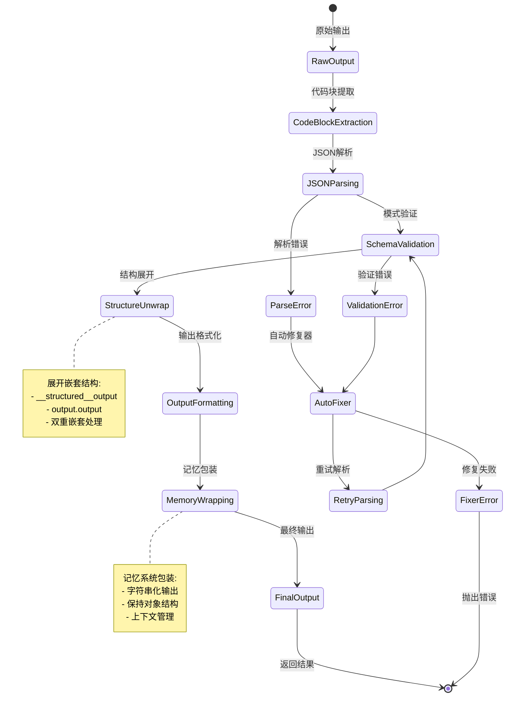

---

## 5. 执行模式详细分析

### 5.1 智能推理循环

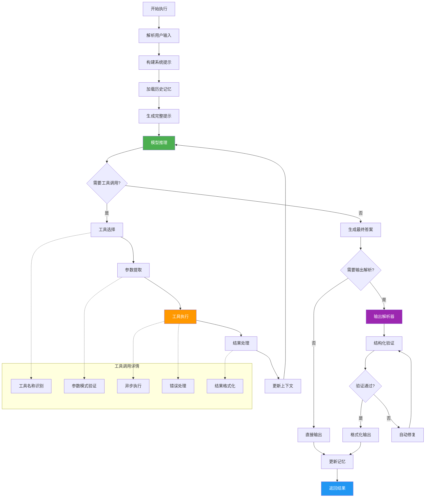

### 5.2 批处理执行模式

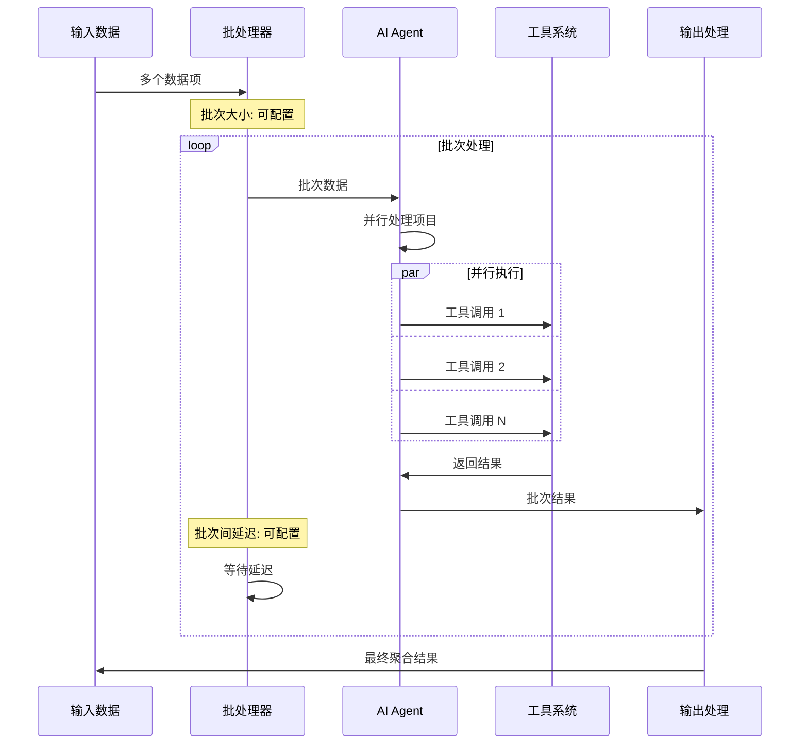

#### 批处理配置
```typescript
interface BatchProcessingConfig {
  batchSize: {
    default: 1;
    description: '每批次处理的项目数量';
    min: 1;
    max: 100;
  };
  delayBetweenBatches: {
    default: 0;
    description: '批次间延迟时间(毫秒)';
    min: 0;
    max: 60000;
  };
  parallelExecution: {
    enabled: boolean;
    maxConcurrency: number;
    description: '批次内并行执行配置';
  };
}
```

### 5.3 错误处理与恢复

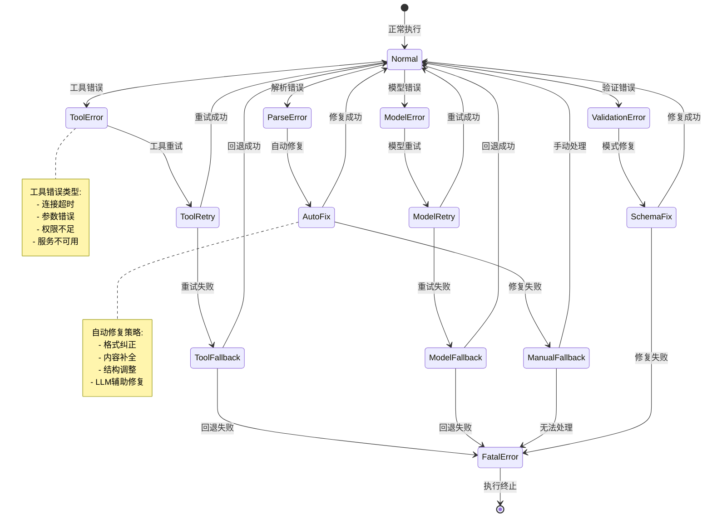

---

## 6. 实际应用场景与最佳实践

### 6.1 常见使用场景

#### 场景 1: 智能客服助手
```javascript
// AI Agent 配置示例 - 客服机器人
{
  "agentType": "toolsAgent",
  "systemMessage": "你是一个专业的客服助手，能够帮助用户解决问题。",
  "connectedTools": [
    {
      "name": "knowledge_base_search",
      "description": "搜索知识库获取相关信息"
    },
    {
      "name": "order_query_tool",
      "description": "查询订单状态和详情"
    },
    {
      "name": "ticket_creation_tool",
      "description": "创建客服工单"
    }
  ],
  "memory": {
    "type": "BufferMemory",
    "returnMessages": true,
    "memoryKey": "chat_history"
  },
  "outputParser": {
    "type": "StructuredOutputParser",
    "schema": {
      "response": "string",
      "action": "string",
      "confidence": "number"
    }
  }
}
```

#### 场景 2: 数据分析助手
```javascript
// 数据分析 AI Agent 配置
{
  "agentType": "planAndExecuteAgent",
  "systemMessage": "你是一个数据分析专家，能够分析数据并生成报告。",
  "connectedTools": [
    {
      "name": "sql_query_tool",
      "description": "执行SQL查询获取数据"
    },
    {
      "name": "data_visualization_tool",
      "description": "创建数据可视化图表"
    },
    {
      "name": "statistical_analysis_tool",
      "description": "执行统计分析"
    },
    {
      "name": "report_generation_tool",
      "description": "生成分析报告"
    }
  ],
  "batchProcessing": {
    "batchSize": 5,
    "delayBetweenBatches": 1000
  }
}
```

#### 场景 3: 自动化测试助手
```javascript
// 自动化测试 AI Agent 配置
{
  "agentType": "reActAgent",
  "systemMessage": "你是一个自动化测试专家，能够设计和执行测试用例。",
  "connectedTools": [
    {
      "name": "test_case_generator",
      "description": "生成测试用例"
    },
    {
      "name": "api_testing_tool",
      "description": "执行API测试"
    },
    {
      "name": "ui_testing_tool",
      "description": "执行UI自动化测试"
    },
    {
      "name": "test_report_tool",
      "description": "生成测试报告"
    }
  ],
  "options": {
    "maxIterations": 15,
    "returnIntermediateSteps": true
  }
}
```

### 6.2 工作流设计模式

#### 智能路由模式
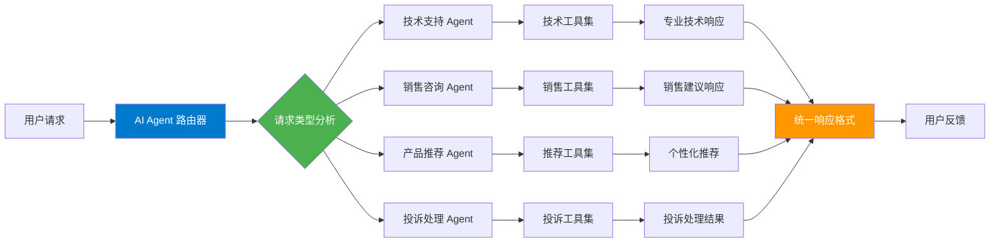

#### 多阶段处理模式
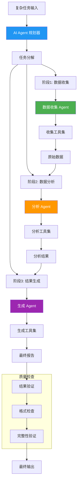

### 6.3 性能优化策略

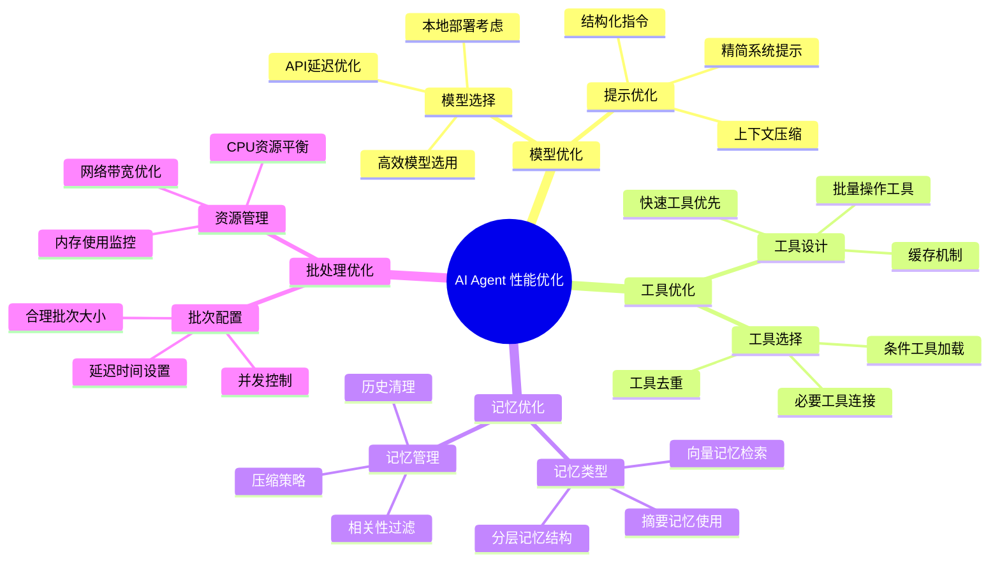

---

## 7. 技术规格总结

### 7.1 节点接口规格
```typescript
interface AIAgentNodeSpecification {
  // 基础信息
  name: 'agent';
  displayName: 'AI Agent';
  group: ['transform'];
  version: 1 | 1.1 | 1.2 | 1.3 | 1.4 | 1.5 | 1.6 | 1.7 | 1.8 | 1.9 | 2;

  // 代理类型
  supportedAgents: [
    'toolsAgent',
    'conversationalAgent',
    'openAiFunctionsAgent',
    'planAndExecuteAgent',
    'reActAgent',
    'sqlAgent'
  ];

  // 连接类型
  inputs: {
    main: { required: true };
    ai_languageModel: { required: true; maxConnections: 1 };
    ai_memory: { required: false; maxConnections: 1 };
    ai_tool: { required: false; maxConnections: undefined };
    ai_outputParser: { required: false; maxConnections: 1 };
  };

  outputs: {
    main: { type: 'main' };
  };

  // 功能特性
  features: {
    toolCalling: boolean;
    memorySupport: boolean;
    structuredOutput: boolean;
    batchProcessing: boolean;
    errorHandling: boolean;
    customPrompts: boolean;
  };
}
```

### 7.2 版本功能对比矩阵

| 功能特性 | V1.0 | V1.5 | V1.9 | V2.0 | 说明 |
|----------|------|------|------|------|------|
| 代理类型数量 | 3种 | 5种 | 6种 | 简化为1种主要 | V2.0专注Tools Agent |
| 工具调用 | 基础 | 改进 | 高级 | 完善 | 逐步增强工具能力 |
| 批处理支持 | ❌ | ❌ | ❌ | ✅ | V2.0新增批处理 |
| 输出解析器 | 可选 | 可选 | 可选 | 可选 | 持续支持结构化输出 |
| 二进制数据 | ❌ | ❌ | ✅ | ✅ | V1.9起支持图像 |
| 错误处理 | 简单 | 改进 | 完善 | 高级 | 逐步增强错误处理 |
| 性能优化 | 基础 | 优化 | 高度优化 | 极致优化 | 持续性能提升 |

### 7.3 Tools 系统规格

```typescript
interface ToolsSystemSpecification {
  // 工具类型
  supportedToolTypes: {
    structured: 'DynamicStructuredTool';
    dynamic: 'DynamicTool';
    custom: 'CustomTool';
    workflow: 'WorkflowTool';
  };

  // 参数验证
  parameterValidation: {
    schema: 'Zod Schema';
    types: ['string', 'number', 'boolean', 'object', 'array'];
    validation: ['required', 'optional', 'custom'];
  };

  // 执行特性
  executionFeatures: {
    async: boolean;
    timeout: number;
    retries: number;
    caching: boolean;
    errorHandling: boolean;
  };

  // 性能指标
  performance: {
    maxConcurrentTools: 10;
    defaultTimeout: 30000; // 30秒
    maxRetries: 3;
    cacheExpiry: 300000; // 5分钟
  };
}
```

### 7.4 Output Parser 系统规格

```typescript
interface OutputParserSystemSpecification {
  // 解析器类型
  supportedParsers: {
    structured: 'N8nStructuredOutputParser';
    itemList: 'N8nItemListOutputParser';
    autoFixing: 'N8nOutputFixingParser';
  };

  // Schema 支持
  schemaSupport: {
    jsonSchema: 'JSON Schema Draft 7';
    zodSchema: 'Zod v3+';
    validation: 'Runtime validation';
    conversion: 'JSON Schema to Zod';
  };

  // 自动修复
  autoFixingFeatures: {
    llmAssisted: boolean;
    retryAttempts: number;
    errorTypes: ['parse', 'validation', 'format'];
    fallbackStrategy: 'graceful degradation';
  };

  // 性能限制
  limitations: {
    maxTextLength: 100000; // 100KB
    maxRetries: 3;
    timeout: 15000; // 15秒
    maxNestingDepth: 10;
  };
}
```

### 7.5 最佳实践指南

#### 设计原则
1. **简单优先**: 优先使用 Tools Agent，避免过度复杂化
2. **工具最小化**: 只连接必要的工具，减少选择复杂度
3. **提示精确**: 使用清晰、具体的系统消息和工具描述
4. **错误处理**: 实现完善的错误处理和回退机制
5. **性能监控**: 监控执行时间、令牌使用量和错误率

#### 避免常见陷阱
1. **工具过载**: 连接过多工具导致选择困难
2. **提示冗余**: 系统提示过于冗长影响性能
3. **记忆滥用**: 不必要的记忆使用增加复杂度
4. **解析过度**: 对简单输出使用复杂解析器
5. **批处理误用**: 在不适合的场景使用批处理

#### 监控与调试技巧
1. **中间步骤**: 启用中间步骤返回进行调试
2. **工具日志**: 监控工具调用的成功率和耗时
3. **解析日志**: 记录输出解析的成功和失败情况
4. **性能分析**: 定期分析执行时间和资源使用
5. **错误追踪**: 建立完善的错误分类和追踪系统

AI Agent 节点作为 n8n 中最复杂和最强大的智能组件，提供了构建高级AI自动化工作流的完整能力。通过合理的配置和使用，它能够处理从简单对话到复杂多步骤任务的各种场景，是实现智能化业务流程的核心工具。
