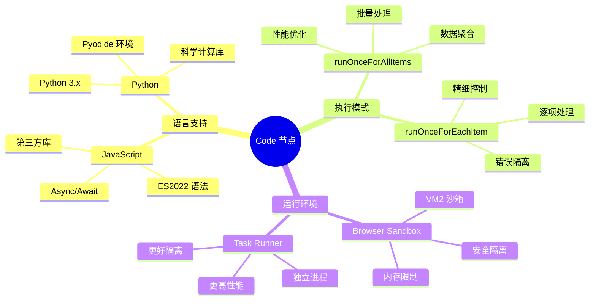
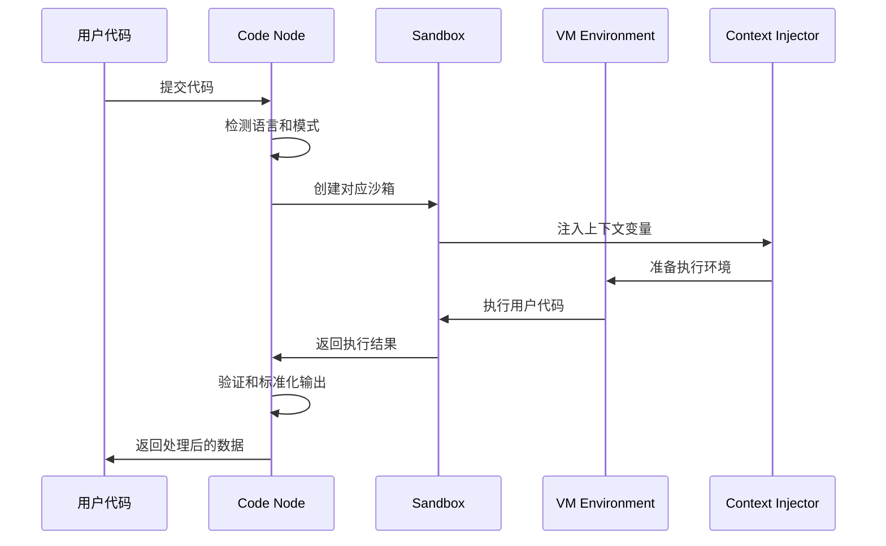
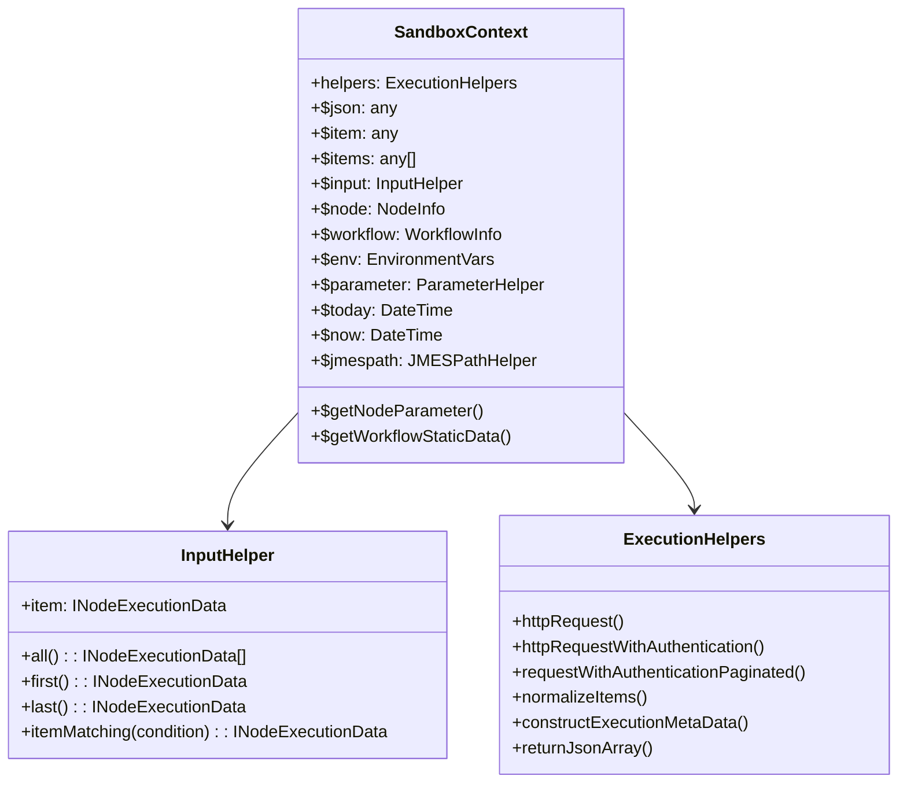
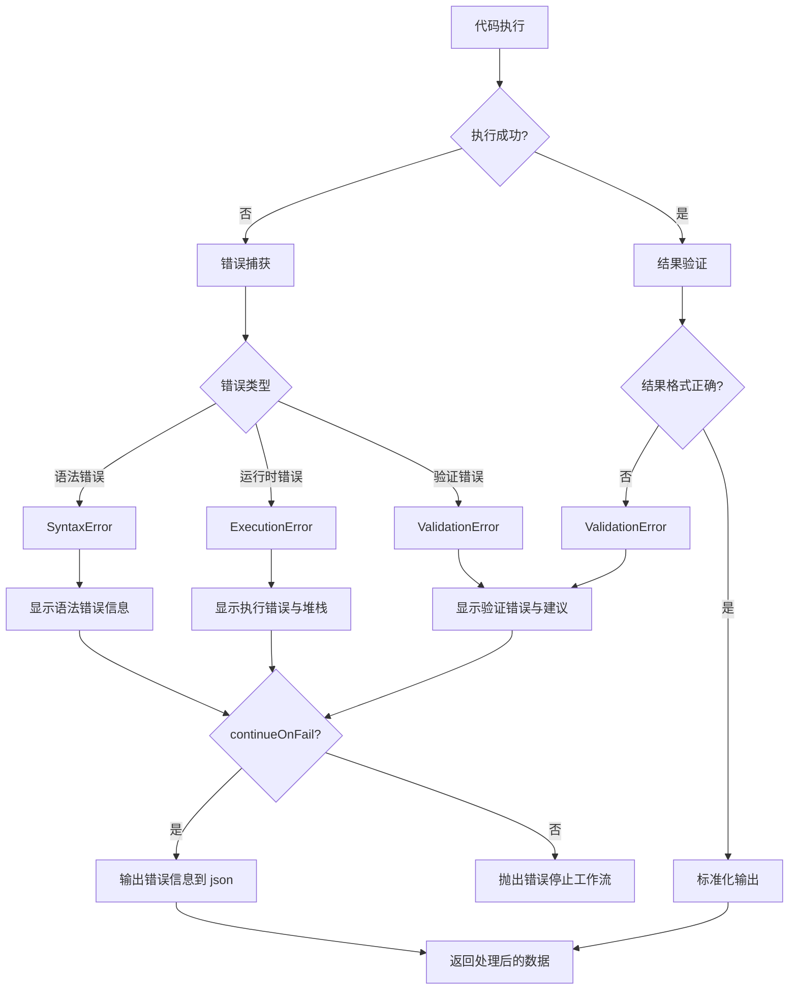
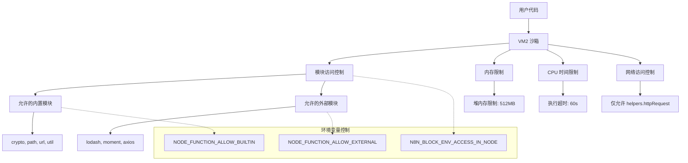
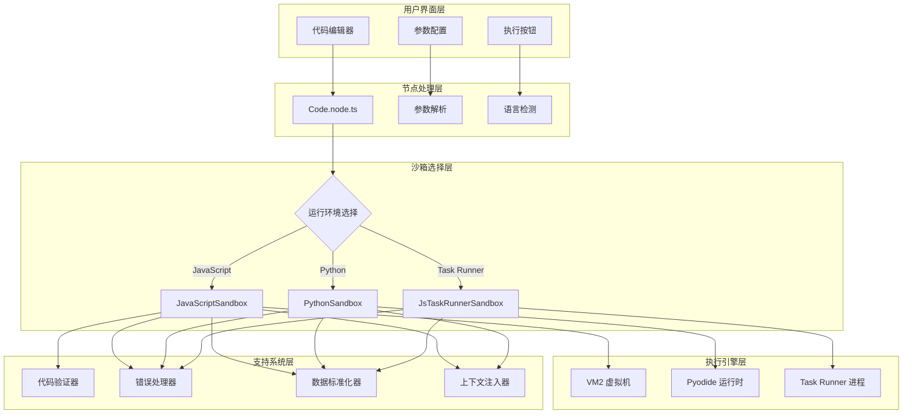
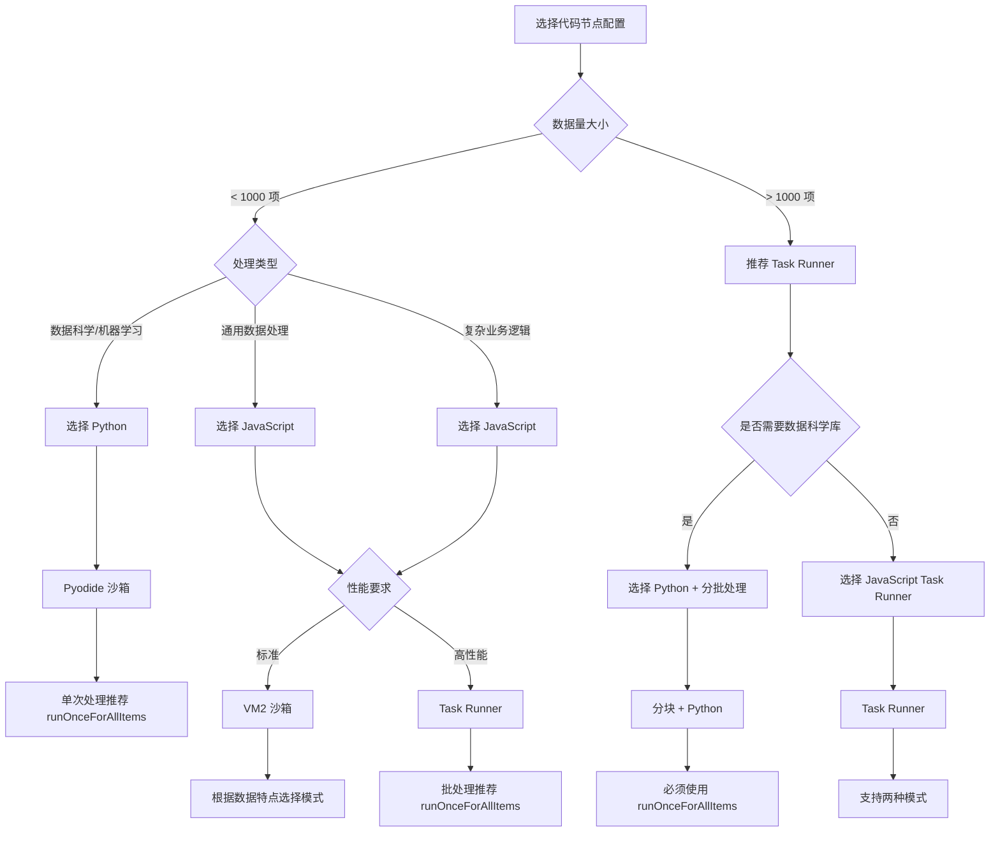
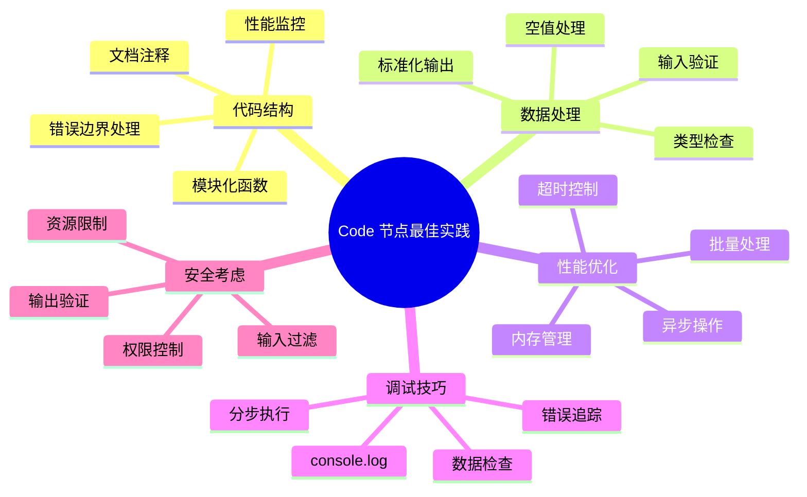

# n8n Code 节点深度解析

## 1. 节点架构与基础信息

### 1.1 节点基本概念

Code 节点是 n8n 中最强大和灵活的数据处理节点，允许用户在工作流中编写和执行自定义 JavaScript 或 Python 代码。它提供了完整的编程能力，可以处理复杂的数据转换、业务逻辑和外部 API 调用。

### 1.2 支持的语言与版本



### 1.3 核心架构组件

- **源码路径**: `packages/nodes-base/nodes/Code/`
- **当前版本**: 2 (支持 JavaScript 和 Python)
- **主要文件**:
  - `Code.node.ts` - 节点主入口
  - `JavaScriptSandbox.ts` - JavaScript 执行环境
  - `PythonSandbox.ts` - Python 执行环境
  - `JsTaskRunnerSandbox.ts` - Task Runner 执行器

---

## 2. 节点配置与属性详解

### 2.1 节点描述结构

```typescript
// packages/nodes-base/nodes/Code/Code.node.ts
export class Code implements INodeType {
  description: INodeTypeDescription = {
    displayName: "Code",
    name: "code",
    icon: "fa:code",
    group: ["transform"],
    version: [1, 2], // 支持版本 1 和 2
    description: "Run custom JavaScript or Python code",
    defaults: {
      name: "Code",
      color: "#FF6D5A",
    },
    inputs: [NodeConnectionTypes.Main],
    outputs: [NodeConnectionTypes.Main],
    properties: [
      // 动态属性配置
    ],
  };
}
```

### 2.2 动态属性配置系统

```mermaid
flowchart TD
    A[节点版本检查] --> B{版本类型}
    B -->|Version 1| C[仅支持 JavaScript]
    B -->|Version 2| D[支持语言选择]

    C --> E[JavaScript 代码编辑器]
    D --> F{选择语言}
    F -->|JavaScript| G[JavaScript 代码编辑器]
    F -->|Python| H[Python 代码编辑器]

    E --> I[执行模式选择]
    G --> I
    H --> I

    I --> J{模式类型}
    J -->|runOnceForAllItems| K[批量处理模式]
    J -->|runOnceForEachItem| L[逐项处理模式]

    K --> M[上下文: items, $input.all()]
    L --> N[上下文: item, $input.item]
```

### 2.3 详细属性配置

#### 语言选择 (Version 2)

```typescript
{
  displayName: 'Language',
  name: 'language',
  type: 'options',
  options: [
    {
      name: 'JavaScript',
      value: 'javaScript',
    },
    {
      name: 'Python (Beta)',
      value: 'python',
    },
  ],
  default: 'javaScript',
  description: 'Programming language to use'
}
```

#### 执行模式配置

```typescript
{
  displayName: 'Mode',
  name: 'mode',
  type: 'options',
  options: [
    {
      name: 'Run Once for All Items',
      value: 'runOnceForAllItems',
      description: 'The code is executed only once for all input items'
    },
    {
      name: 'Run Once for Each Item',
      value: 'runOnceForEachItem',
      description: 'The code is executed separately for each input item'
    }
  ],
  default: 'runOnceForEachItem'
}
```

#### 代码编辑器配置

```typescript
// JavaScript 代码配置
{
  displayName: 'JavaScript',
  name: 'jsCode',
  type: 'string',
  typeOptions: {
    editor: 'codeNodeEditor',
    editorLanguage: 'javaScript',
  },
  default: '',
  description: 'JavaScript code to execute. Access input data via $input methods.',
  noDataExpression: true
}

// Python 代码配置
{
  displayName: 'Python',
  name: 'pythonCode',
  type: 'string',
  typeOptions: {
    editor: 'codeNodeEditor',
    editorLanguage: 'python',
  },
  default: '',
  description: 'Python code to execute. Access input data via _input methods.',
  noDataExpression: true
}
```

---

## 3. 执行引擎与沙箱系统

### 3.1 执行流程架构



### 3.2 JavaScript 沙箱实现

```typescript
// packages/nodes-base/nodes/Code/JavaScriptSandbox.ts
export class JavaScriptSandbox extends Sandbox {
  private readonly vm: NodeVM;

  constructor(context: SandboxContext, private jsCode: string, helpers: IExecuteFunctions["helpers"]) {
    super({ object: { singular: "object", plural: "objects" } }, helpers);

    // 配置 VM2 沙箱环境
    this.vm = new NodeVM({
      console: "redirect", // 重定向 console 输出
      sandbox: context, // 注入上下文
      require: vmResolver, // 控制模块导入
      wasm: false, // 禁用 WebAssembly
    });

    // 监听 console.log 输出
    this.vm.on("console.log", (...args: unknown[]) => this.emit("output", ...args));
  }

  async runCodeAllItems(): Promise<INodeExecutionData[]> {
    const script = `module.exports = async function() {${this.jsCode}\n}()`;

    try {
      const executionResult = await this.vm.run(script, __dirname);
      return this.validateRunCodeAllItems(executionResult);
    } catch (error) {
      // 智能错误映射
      mapItemsNotDefinedErrorIfNeededForRunForAll(this.jsCode, error);
      throw new ExecutionError(error);
    }
  }

  async runCodeEachItem(itemIndex: number): Promise<INodeExecutionData | undefined> {
    // 验证不允许的方法调用
    validateNoDisallowedMethodsInRunForEach(this.jsCode, itemIndex);

    const script = `module.exports = async function() {${this.jsCode}\n}()`;

    try {
      const executionResult = await this.vm.run(script, __dirname);
      return this.validateRunCodeEachItem(executionResult, itemIndex);
    } catch (error) {
      mapItemNotDefinedErrorIfNeededForRunForEach(this.jsCode, error);
      throw new ExecutionError(error, itemIndex);
    }
  }
}
```

### 3.3 Python 沙箱实现

```typescript
// packages/nodes-base/nodes/Code/PythonSandbox.ts
export class PythonSandbox extends Sandbox {
  private readonly context: PythonSandboxContext;

  constructor(context: SandboxContext, private pythonCode: string, helpers: IExecuteFunctions["helpers"]) {
    super({ object: { singular: "dictionary", plural: "dictionaries" } }, helpers);

    // 转换上下文变量名 ($var -> _var)
    this.context = Object.keys(context).reduce((acc, key) => {
      acc[key.startsWith("$") ? key.replace(/^\$/, "_") : key] = context[key];
      return acc;
    }, {} as PythonSandboxContext);
  }

  private async runCodeInPython<T>() {
    const packageCacheDir = this.helpers.getStoragePath();
    const pyodide = await LoadPyodide(packageCacheDir);

    try {
      // 设置类型字典
      await pyodide.runPythonAsync("jsproxy_typedict[0] = type(Object.new().as_object_map())");

      // 加载依赖包
      await pyodide.loadPackagesFromImports(this.pythonCode);

      // 创建全局变量字典
      const dict = pyodide.globals.get("dict");
      const globalsDict: PyDict = dict();
      for (const key of Object.keys(this.context)) {
        if ((key === "_env" && envAccessBlocked) || key === "_node") continue;
        globalsDict.set(key, this.context[key]);
      }

      // 设置输出重定向
      pyodide.setStdout({ batched: (str) => this.emit("output", str) });

      // 包装代码为异步函数
      const runCode = `
async def __main():
${this.pythonCode
  .split("\n")
  .map((line) => "  " + line)
  .join("\n")}
await __main()`;

      const executionResult = await pyodide.runPythonAsync(runCode, { globals: globalsDict });
      globalsDict.destroy();

      // 转换 Python 对象为 JavaScript 对象
      return executionResult?.toJs
        ? executionResult.toJs({ dict_converter: Object.fromEntries, create_proxies: false })
        : executionResult;
    } catch (error) {
      throw this.getPrettyError(error as PyodideError);
    }
  }
}
```

### 3.4 Task Runner 沙箱

```typescript
// packages/nodes-base/nodes/Code/JsTaskRunnerSandbox.ts
export class JsTaskRunnerSandbox {
  constructor(
    private readonly jsCode: string,
    private readonly nodeMode: CodeExecutionMode,
    private readonly workflowMode: WorkflowExecuteMode,
    private readonly executeFunctions: IExecuteFunctions,
    private readonly chunkSize = 1000
  ) {}

  async runCodeAllItems(): Promise<INodeExecutionData[]> {
    const executionResult = await this.executeFunctions.startJob<INodeExecutionData[]>(
      "javascript",
      {
        code: this.jsCode,
        nodeMode: this.nodeMode,
        workflowMode: this.workflowMode,
        continueOnFail: this.executeFunctions.continueOnFail(),
      },
      0
    );

    return executionResult.ok ? executionResult.result : this.throwExecutionError(executionResult.error);
  }

  async runCodeForEachItem(numInputItems: number): Promise<INodeExecutionData[]> {
    validateNoDisallowedMethodsInRunForEach(this.jsCode, 0);

    const chunks = this.chunkInputItems(numInputItems);
    let executionResults: INodeExecutionData[] = [];

    // 分块处理大量输入项
    for (const chunk of chunks) {
      const executionResult = await this.executeFunctions.startJob<INodeExecutionData[]>(
        "javascript",
        {
          code: this.jsCode,
          nodeMode: this.nodeMode,
          workflowMode: this.workflowMode,
          continueOnFail: this.executeFunctions.continueOnFail(),
          chunk: { startIndex: chunk.startIdx, count: chunk.count },
        },
        0
      );

      if (!executionResult.ok) {
        return this.throwExecutionError(executionResult.error);
      }

      executionResults = executionResults.concat(executionResult.result);
    }

    return executionResults;
  }

  private chunkInputItems(numInputItems: number) {
    const chunks = [];
    for (let i = 0; i < numInputItems; i += this.chunkSize) {
      chunks.push({
        startIdx: i,
        count: Math.min(this.chunkSize, numInputItems - i),
      });
    }
    return chunks;
  }
}
```

---

## 4. 上下文系统与数据访问

### 4.1 上下文变量架构



### 4.2 上下文创建机制

```typescript
// packages/nodes-base/nodes/Code/Sandbox.ts
export function getSandboxContext(this: IExecuteFunctions, index: number): SandboxContext {
  const helpers = {
    ...this.helpers,
    httpRequestWithAuthentication: this.helpers.httpRequestWithAuthentication.bind(this),
    requestWithAuthenticationPaginated: this.helpers.requestWithAuthenticationPaginated.bind(this),
  };

  return {
    // 节点执行函数
    $getNodeParameter: this.getNodeParameter.bind(this),
    $getWorkflowStaticData: this.getWorkflowStaticData.bind(this),
    helpers,

    // 工作流数据代理 - 所有 $ 前缀的变量和方法
    ...this.getWorkflowDataProxy(index),
  };
}
```

### 4.3 输入数据访问模式

#### runOnceForAllItems 模式

```javascript
// 可访问的上下文变量
console.log($input.all()); // 所有输入项
console.log($input.first()); // 第一个项目
console.log($input.last()); // 最后一个项目
console.log(items); // 所有输入项 (向后兼容)

// 数据处理示例
return $input.all().map((item) => ({
  json: {
    ...item.json,
    processed: true,
    timestamp: $now,
  },
}));
```

#### runOnceForEachItem 模式

```javascript
// 可访问的上下文变量
console.log($input.item); // 当前处理的项目
console.log(item); // 当前项目 (向后兼容)

// 数据处理示例
return {
  json: {
    ...$input.item.json,
    doubled: $input.item.json.value * 2,
    nodeInfo: $node.name,
  },
};
```

---

## 5. 代码验证与错误处理系统

### 5.1 代码验证机制

```typescript
// packages/nodes-base/nodes/Code/JsCodeValidator.ts
export function validateNoDisallowedMethodsInRunForEach(code: string, itemIndex: number) {
  const match = code.match(/\$input\.(?<disallowedMethod>first|last|all|itemMatching)/);

  if (match?.groups?.disallowedMethod) {
    const { disallowedMethod } = match.groups;
    const lineNumber =
      code.split("\n").findIndex((line) => {
        line = line.trimStart();
        return (
          line.includes(disallowedMethod) &&
          !line.startsWith("//") && // 忽略单行注释
          !line.startsWith("/*") && // 忽略多行注释开始
          !line.startsWith("*") // 忽略多行注释内容
        );
      }) + 1;

    if (lineNumber !== 0) {
      throw new ValidationError({
        message: `Can't use .${disallowedMethod}() here`,
        description: "This is only available in 'Run Once for All Items' mode",
        itemIndex,
        lineNumber,
      });
    }
  }
}

// 智能错误提示映射
export function mapItemsNotDefinedErrorIfNeededForRunForAll(code: string, error: Error) {
  if (error.message === "items is not defined" && !/(let|const|var) +items +=/.test(code)) {
    error.message = "`items` is not defined. Did you mean `$input.all()`?";
  }
}

export function mapItemNotDefinedErrorIfNeededForRunForEach(code: string, error: Error) {
  if (error.message === "item is not defined" && !/(let|const|var) +item +=/.test(code)) {
    error.message = "`item` is not defined. Did you mean `$input.item.json`?";
  }
}
```

### 5.2 错误处理架构



### 5.3 错误类实现

```typescript
// packages/nodes-base/nodes/Code/ExecutionError.ts
export class ExecutionError extends ApplicationError {
  description: string | null = null;
  itemIndex: number | undefined = undefined;
  context: { itemIndex: number } | undefined = undefined;
  lineNumber: number | undefined = undefined;

  constructor(error: Error & { stack?: string }, itemIndex?: number) {
    super(error.message);
    this.itemIndex = itemIndex;
    this.stack = error.stack ?? "";
    this.populateFromStack();
  }

  private populateFromStack() {
    const stackRows = this.stack.split("\n");
    const messageRow = stackRows.find((line) => line.includes("Error:"));
    const lineNumberRow = stackRows.find((line) => line.includes("Code:"));

    const lineNumberDisplay = this.toLineNumberDisplay(lineNumberRow);
    const [errorDetails, errorType] = this.toErrorDetailsAndType(messageRow);

    if (errorType) this.description = errorType;
    this.message = `${errorDetails || "Unknown error"} ${lineNumberDisplay}`;
  }
}

// packages/nodes-base/nodes/Code/ValidationError.ts
export class ValidationError extends ApplicationError {
  description = "";
  itemIndex: number | undefined = undefined;
  lineNumber: number | undefined = undefined;

  constructor({ message, description, itemIndex, lineNumber }) {
    super(message);
    this.description = description;
    this.itemIndex = itemIndex;
    this.lineNumber = lineNumber;

    // 构建详细的错误消息
    if (this.lineNumber !== undefined && this.itemIndex !== undefined) {
      this.message = `${message} [line ${lineNumber}, for item ${itemIndex}]`;
    } else if (this.lineNumber !== undefined) {
      this.message = `${message} [line ${lineNumber}]`;
    } else if (this.itemIndex !== undefined) {
      this.message = `${message} [item ${itemIndex}]`;
    }
  }
}
```

---

## 6. 数据验证与标准化系统

### 6.1 输出数据验证流程

```mermaid
flowchart TD
    A[用户代码返回结果] --> B{执行模式}
    B -->|runOnceForAllItems| C[validateRunCodeAllItems]
    B -->|runOnceForEachItem| D[validateRunCodeEachItem]

    C --> E{结果类型检查}
    E -->|非对象| F[抛出验证错误]
    E -->|对象或数组| G[normalizeItems]

    D --> H{结果类型检查}
    H -->|非对象| I[抛出验证错误]
    H -->|数组| J[抛出 "应使用批量模式" 错误]
    H -->|对象| K[normalizeItems]

    G --> L[validateItem 循环验证]
    K --> M[validateItem 单项验证]

    L --> N[validateTopLevelKeys]
    M --> N

    N --> O{有无效的顶级键?}
    O -->|是| P[抛出顶级键错误]
    O -->|否| Q[标准化完成]

    F --> R[用户看到错误]
    I --> R
    J --> R
    P --> R
    Q --> S[返回标准化数据]
```

### 6.2 数据标准化实现

```typescript
// packages/nodes-base/nodes/Code/Sandbox.ts
abstract class Sandbox extends EventEmitter {
  validateRunCodeEachItem(executionResult: INodeExecutionData | undefined, itemIndex: number): INodeExecutionData {
    if (typeof executionResult !== "object") {
      throw new ValidationError({
        message: `Code doesn't return an object`,
        description: `Please return an object representing the output item. ('${executionResult}' was returned instead.)`,
        itemIndex,
      });
    }

    if (Array.isArray(executionResult)) {
      const firstSentence =
        executionResult.length > 0
          ? `An array of ${typeof executionResult[0]}s was returned.`
          : "An empty array was returned.";
      throw new ValidationError({
        message: `Code doesn't return a single object`,
        description: `${firstSentence} If you need to output multiple items, please use the 'Run Once for All Items' mode instead.`,
        itemIndex,
      });
    }

    const [returnData] = this.helpers.normalizeItems([executionResult]);
    this.validateItem(returnData, itemIndex);
    this.validateTopLevelKeys(returnData, itemIndex);
    return returnData;
  }

  validateRunCodeAllItems(
    executionResult: INodeExecutionData | INodeExecutionData[] | undefined
  ): INodeExecutionData[] {
    if (typeof executionResult !== "object") {
      throw new ValidationError({
        message: "Code doesn't return items properly",
        description: `Please return an array of objects, one for each item you would like to output.`,
      });
    }

    const returnData = this.helpers.normalizeItems(executionResult);
    returnData.forEach((item, index) => this.validateItem(item, index));
    return returnData;
  }

  private validateItem({ json, binary }: INodeExecutionData, itemIndex: number) {
    if (json === undefined || !isObject(json)) {
      throw new ValidationError({
        message: `A 'json' property isn't an object`,
        description: `In the returned data, every key named 'json' must point to an object.`,
        itemIndex,
      });
    }

    if (binary !== undefined && !isObject(binary)) {
      throw new ValidationError({
        message: `A 'binary' property isn't an object`,
        description: `In the returned data, every key named 'binary' must point to an object.`,
        itemIndex,
      });
    }
  }

  private validateTopLevelKeys(item: INodeExecutionData, itemIndex: number) {
    const REQUIRED_N8N_ITEM_KEYS = new Set(["json", "binary", "pairedItem", "error"]);

    Object.keys(item).forEach((key) => {
      if (REQUIRED_N8N_ITEM_KEYS.has(key)) return;
      throw new ValidationError({
        message: `Unknown top-level item key: ${key}`,
        description: "Access the properties of an item under `.json`, e.g. `item.json`",
        itemIndex,
      });
    });
  }
}
```

---

## 7. 性能优化与安全机制

### 7.1 性能优化策略

```typescript
// 分块处理大量数据
interface ChunkProcessingConfig {
  chunkSize: number; // 默认 1000 项
  maxConcurrency: number; // 最大并发数
  memoryThreshold: string; // 内存阈值
  timeoutMs: number; // 超时设置
}

// VM2 沙箱优化配置
interface SandboxOptimization {
  sandbox: {
    console: "redirect"; // 重定向输出
    wasm: false; // 禁用 WebAssembly
    eval: false; // 禁用 eval
    require: vmResolver; // 限制模块导入
  };
  memory: {
    maxOldGenerationSizeMb: 512; // 老生代内存限制
    maxYoungGenerationSizeMb: 64; // 新生代内存限制
  };
  timeout: {
    script: 60000; // 脚本执行超时
    async: 120000; // 异步操作超时
  };
}
```

### 7.2 安全沙箱机制



### 7.3 模块访问控制

```typescript
// packages/nodes-base/nodes/Code/JavaScriptSandbox.ts
const { NODE_FUNCTION_ALLOW_BUILTIN: builtIn, NODE_FUNCTION_ALLOW_EXTERNAL: external } = process.env;

export const vmResolver = makeResolverFromLegacyOptions({
  external: external
    ? {
        modules: external.split(","), // 允许的外部模块列表
        transitive: false, // 不允许传递依赖
      }
    : false,
  builtin: builtIn?.split(",") ?? [], // 允许的内置模块列表
});

// 默认允许的内置模块
const defaultBuiltinModules = ["crypto", "path", "url", "util", "querystring", "stream"];

// 默认允许的外部模块
const defaultExternalModules = ["lodash", "moment", "axios", "uuid", "crypto-js"];
```

---

## 8. 代码示例与最佳实践

### 8.1 JavaScript 代码示例

#### 批量数据处理 (runOnceForAllItems)

```javascript
// 数据聚合和统计
const totalValue = $input.all().reduce((sum, item) => sum + (item.json.value || 0), 0);
const avgValue = totalValue / $input.all().length;

return $input.all().map((item, index) => ({
  json: {
    ...item.json,
    index,
    totalValue,
    avgValue,
    isAboveAverage: item.json.value > avgValue,
    processedAt: $now,
  },
}));
```

#### 异步 API 调用

```javascript
// 并发调用外部 API
const promises = $input.all().map(async (item) => {
  const response = await $helpers.httpRequest({
    method: "GET",
    url: `https://api.example.com/user/${item.json.userId}`,
    headers: {
      Authorization: `Bearer ${$env.API_TOKEN}`,
    },
  });

  return {
    json: {
      ...item.json,
      userInfo: response.data,
      enrichedAt: $now,
    },
  };
});

return await Promise.all(promises);
```

#### 复杂数据转换

```javascript
// 扁平化嵌套数据结构
const flattenObject = (obj, prefix = "") => {
  const flattened = {};
  for (const [key, value] of Object.entries(obj)) {
    const newKey = prefix ? `${prefix}_${key}` : key;
    if (typeof value === "object" && value !== null && !Array.isArray(value)) {
      Object.assign(flattened, flattenObject(value, newKey));
    } else {
      flattened[newKey] = value;
    }
  }
  return flattened;
};

return $input.all().map((item) => ({
  json: flattenObject(item.json),
  binary: item.binary,
}));
```

#### 逐项处理 (runOnceForEachItem)

```javascript
// 条件处理和验证
const item = $input.item;

// 数据验证
if (!item.json.email || !item.json.email.includes("@")) {
  throw new Error(`Invalid email address: ${item.json.email}`);
}

// 数据清理和格式化
const cleanedData = {
  email: item.json.email.toLowerCase().trim(),
  name: item.json.name?.trim() || "Unknown",
  age: parseInt(item.json.age) || 0,
  labels: Array.isArray(item.json.labels) ? item.json.labels : [],
  createdAt: $now,
  nodeId: $node.id,
};

// 条件逻辑
if (cleanedData.age >= 18) {
  cleanedData.category = "adult";
  cleanedData.permissions = ["read", "write"];
} else {
  cleanedData.category = "minor";
  cleanedData.permissions = ["read"];
}

return {
  json: cleanedData,
  pairedItem: { item: 0 },
};
```

### 8.2 Python 代码示例

#### 数据科学处理

```python
import pandas as pd
import numpy as np
from datetime import datetime

# 将输入数据转换为 DataFrame
df_data = [item['json'] for item in _input.all()]
df = pd.DataFrame(df_data)

# 数据统计分析
stats = {
    'count': len(df),
    'mean_value': df['value'].mean() if 'value' in df.columns else None,
    'std_value': df['value'].std() if 'value' in df.columns else None,
    'percentiles': df['value'].quantile([0.25, 0.5, 0.75]).to_dict() if 'value' in df.columns else None
}

# 异常值检测
if 'value' in df.columns:
    Q1 = df['value'].quantile(0.25)
    Q3 = df['value'].quantile(0.75)
    IQR = Q3 - Q1
    df['is_outlier'] = (df['value'] < Q1 - 1.5 * IQR) | (df['value'] > Q3 + 1.5 * IQR)

# 返回处理后的数据
result = []
for _, row in df.iterrows():
    result.append({
        'json': {
            **row.to_dict(),
            'stats': stats,
            'processed_at': datetime.now().isoformat()
        }
    })

return result
```

#### 机器学习预处理

```python
import re
import json
from collections import Counter

def preprocess_text(text):
    """文本预处理函数"""
    if not isinstance(text, str):
        return ""

    # 转换为小写
    text = text.lower()

    # 移除特殊字符，保留字母数字和空格
    text = re.sub(r'[^a-zA-Z0-9\s]', '', text)

    # 分词
    words = text.split()

    # 移除停用词（简化版）
    stop_words = {'the', 'a', 'an', 'and', 'or', 'but', 'in', 'on', 'at', 'to', 'for', 'of', 'with', 'by'}
    words = [word for word in words if word not in stop_words and len(word) > 2]

    return words

# 处理所有输入项
all_texts = []
results = []

for item in _input.all():
    text_field = item['json'].get('text', '')
    processed_words = preprocess_text(text_field)

    # 词频统计
    word_freq = Counter(processed_words)

    results.append({
        'json': {
            **item['json'],
            'processed_words': processed_words,
            'word_count': len(processed_words),
            'unique_words': len(word_freq),
            'top_words': dict(word_freq.most_common(5)),
            'preprocessing_completed': True
        }
    })

    all_texts.extend(processed_words)

# 全局词频统计
global_word_freq = Counter(all_texts)

# 为每个结果添加全局统计信息
for result in results:
    result['json']['global_stats'] = {
        'total_words': len(all_texts),
        'unique_global_words': len(global_word_freq),
        'most_common_global': dict(global_word_freq.most_common(10))
    }

return results
```

### 8.3 错误处理最佳实践

#### 优雅的错误处理

```javascript
// runOnceForAllItems 模式的错误处理
try {
  const results = [];
  const errors = [];

  for (const [index, item] of $input.all().entries()) {
    try {
      // 数据验证
      if (!item.json.id) {
        throw new Error("Missing required field: id");
      }

      // 数据处理
      const processed = await processItem(item);
      results.push({
        json: processed,
        pairedItem: { item: index },
      });
    } catch (error) {
      errors.push({
        json: {
          error: error.message,
          originalData: item.json,
          itemIndex: index,
        },
        pairedItem: { item: index },
      });
    }
  }

  // 如果所有项都失败，抛出错误
  if (results.length === 0 && errors.length > 0) {
    throw new Error(`All ${errors.length} items failed processing`);
  }

  // 返回成功和失败的项目
  return [...results, ...errors];
} catch (error) {
  console.error("Workflow processing failed:", error);
  throw error;
}

async function processItem(item) {
  // 模拟异步处理
  const response = await $helpers.httpRequest({
    method: "POST",
    url: "https://api.example.com/process",
    body: item.json,
    timeout: 10000,
  });

  return {
    ...item.json,
    processedBy: "external-api",
    result: response.data,
    processedAt: $now,
  };
}
```

#### 输入验证模式

```javascript
// runOnceForEachItem 模式的输入验证
const item = $input.item;

// 定义验证规则
const validationRules = {
  email: {
    required: true,
    type: "string",
    pattern: /^[^\s@]+@[^\s@]+\.[^\s@]+$/,
  },
  age: {
    required: false,
    type: "number",
    min: 0,
    max: 150,
  },
  status: {
    required: true,
    type: "string",
    enum: ["active", "inactive", "pending"],
  },
};

// 验证函数
function validateField(value, fieldName, rules) {
  const rule = rules[fieldName];
  if (!rule) return { valid: true };

  // 必填验证
  if (rule.required && (value === undefined || value === null || value === "")) {
    return { valid: false, error: `${fieldName} is required` };
  }

  // 类型验证
  if (value !== undefined && rule.type) {
    if (rule.type === "number" && isNaN(Number(value))) {
      return { valid: false, error: `${fieldName} must be a number` };
    }
    if (rule.type === "string" && typeof value !== "string") {
      return { valid: false, error: `${fieldName} must be a string` };
    }
  }

  // 范围验证
  if (rule.min !== undefined && Number(value) < rule.min) {
    return { valid: false, error: `${fieldName} must be at least ${rule.min}` };
  }
  if (rule.max !== undefined && Number(value) > rule.max) {
    return { valid: false, error: `${fieldName} must be at most ${rule.max}` };
  }

  // 枚举验证
  if (rule.enum && !rule.enum.includes(value)) {
    return { valid: false, error: `${fieldName} must be one of: ${rule.enum.join(", ")}` };
  }

  // 正则验证
  if (rule.pattern && !rule.pattern.test(value)) {
    return { valid: false, error: `${fieldName} format is invalid` };
  }

  return { valid: true };
}

// 执行验证
const validationErrors = [];
for (const [fieldName, rules] of Object.entries(validationRules)) {
  const validation = validateField(item.json[fieldName], fieldName, validationRules);
  if (!validation.valid) {
    validationErrors.push(validation.error);
  }
}

// 如果有验证错误，抛出异常或返回错误信息
if (validationErrors.length > 0) {
  throw new Error(`Validation failed: ${validationErrors.join(", ")}`);
}

// 验证通过，处理数据
return {
  json: {
    ...item.json,
    validated: true,
    validatedAt: $now,
    validationPassed: true,
  },
};
```

---

## 9. 高级功能与扩展

### 9.1 二进制数据处理

```javascript
// 处理图片文件
const item = $input.item;

if (item.binary && item.binary.data) {
  const binaryData = item.binary.data;

  // 获取文件信息
  const fileInfo = {
    mimeType: binaryData.mimeType,
    fileExtension: binaryData.fileExtension,
    fileName: binaryData.fileName,
    fileSize: Buffer.from(binaryData.data, "base64").length,
  };

  // 处理图片文件
  if (binaryData.mimeType.startsWith("image/")) {
    // 这里可以调用图片处理 API
    const processedImage = await $helpers.httpRequest({
      method: "POST",
      url: "https://api.imageprocessing.com/resize",
      headers: {
        "Content-Type": "application/json",
        Authorization: `Bearer ${$env.IMAGE_API_TOKEN}`,
      },
      body: {
        image: binaryData.data,
        width: 800,
        height: 600,
        format: "jpeg",
      },
    });

    return {
      json: {
        ...item.json,
        fileInfo,
        processed: true,
      },
      binary: {
        data: {
          ...binaryData,
          data: processedImage.data,
          fileName: `processed_${binaryData.fileName}`,
        },
      },
    };
  }
}

return {
  json: {
    ...item.json,
    error: "No binary data or unsupported file type",
  },
};
```

### 9.2 工作流状态管理

```javascript
// 使用静态数据存储工作流状态
const staticData = $getWorkflowStaticData("global");

// 初始化计数器
if (!staticData.processedCount) {
  staticData.processedCount = 0;
}
if (!staticData.lastProcessedAt) {
  staticData.lastProcessedAt = null;
}

// 更新状态
staticData.processedCount += $input.all().length;
staticData.lastProcessedAt = $now;

// 检查处理限制
const dailyLimit = 1000;
const today = new Date().toDateString();

if (!staticData.dailyStats) {
  staticData.dailyStats = {};
}
if (!staticData.dailyStats[today]) {
  staticData.dailyStats[today] = 0;
}

staticData.dailyStats[today] += $input.all().length;

if (staticData.dailyStats[today] > dailyLimit) {
  throw new Error(`Daily processing limit exceeded: ${staticData.dailyStats[today]}/${dailyLimit}`);
}

// 返回带状态信息的数据
return $input.all().map((item, index) => ({
  json: {
    ...item.json,
    processingStats: {
      totalProcessed: staticData.processedCount,
      todayProcessed: staticData.dailyStats[today],
      batchSize: $input.all().length,
      itemIndex: index,
    },
  },
}));
```

### 9.3 动态参数使用

```javascript
// 获取节点参数
const customParam = $getNodeParameter("customParameter", 0, "defaultValue");
const processingMode = $getNodeParameter("mode", 0, "standard");

// 根据参数调整处理逻辑
let processFunction;

switch (processingMode) {
  case "aggressive":
    processFunction = (data) => {
      // 激进处理模式
      return {
        ...data,
        processed: true,
        mode: "aggressive",
        transformations: ["normalize", "clean", "enrich", "validate"],
      };
    };
    break;

  case "conservative":
    processFunction = (data) => {
      // 保守处理模式
      return {
        ...data,
        processed: true,
        mode: "conservative",
        transformations: ["validate"],
      };
    };
    break;

  default:
    processFunction = (data) => {
      // 标准处理模式
      return {
        ...data,
        processed: true,
        mode: "standard",
        transformations: ["normalize", "validate"],
      };
    };
}

// 应用处理函数
return $input.all().map((item) => ({
  json: processFunction(item.json),
  pairedItem: { item: 0 },
}));
```

---

## 10. 源码结构与技术架构

### 10.1 核心目录结构

```
packages/nodes-base/nodes/Code/
├── Code.node.ts                    # 主节点定义
├── JavaScriptSandbox.ts           # JavaScript 执行沙箱
├── PythonSandbox.ts               # Python 执行沙箱
├── JsTaskRunnerSandbox.ts         # Task Runner 沙箱
├── Sandbox.ts                     # 抽象沙箱基类
├── descriptions/
│   ├── JavascriptCodeDescription.ts
│   └── PythonCodeDescription.ts
├── errors/
│   ├── ExecutionError.ts         # 执行错误
│   ├── ValidationError.ts        # 验证错误
│   └── WrappedExecutionError.ts  # 包装错误
├── JsCodeValidator.ts             # JavaScript 代码验证
├── Pyodide.ts                     # Python 运行时加载
├── utils.ts                       # 工具函数
└── test/                          # 测试文件
    ├── Code.node.test.ts
    ├── JsCodeValidator.test.ts
    └── workflow.*.json
```

### 10.2 架构交互图



---

## 11. 性能对比与选择指南

### 11.1 执行环境对比

| 特性         | JavaScript Sandbox | Python Sandbox       | Task Runner      |
| ------------ | ------------------ | -------------------- | ---------------- |
| **隔离级别** | VM2 沙箱           | Pyodide 沙箱         | 独立进程         |
| **启动速度** | 快 (< 10ms)        | 慢 (2-5s)            | 中等 (100-500ms) |
| **内存使用** | 低 (10-50MB)       | 高 (100-200MB)       | 中等 (50-100MB)  |
| **CPU 性能** | 原生 V8            | 编译到 WASM          | 原生 V8          |
| **第三方库** | 有限制             | 丰富 (NumPy, Pandas) | 有限制           |
| **并发处理** | 单线程             | 单线程               | 多进程           |
| **适用场景** | 通用数据处理       | 数据科学计算         | 大量数据处理     |

### 11.2 最佳实践选择



---

## 12. 故障排除与调试指南

### 12.1 常见错误类型

```typescript
interface CommonErrors {
  syntaxErrors: {
    "Unexpected token": "语法错误，检查括号匹配和分号";
    "Unexpected end of input": "代码不完整，缺少闭合括号";
    "Invalid regular expression": "正则表达式语法错误";
  };

  runtimeErrors: {
    "ReferenceError: ... is not defined": "变量未定义，检查变量名拼写";
    "TypeError: Cannot read property": "尝试访问 null/undefined 的属性";
    "TypeError: ... is not a function": "尝试调用非函数类型";
  };

  validationErrors: {
    "Code doesn't return an object": "需要返回对象类型的数据";
    "Can't use .all() here": "在 runOnceForEachItem 模式下不能使用批量方法";
    "Unknown top-level item key": "返回数据包含不支持的顶级键";
  };

  executionErrors: {
    "Request timeout": "HTTP 请求超时，检查网络或增加超时时间";
    "Memory limit exceeded": "内存使用超限，考虑分批处理";
    "Script execution timeout": "脚本执行超时，优化代码逻辑";
  };
}
```

### 12.2 调试技术

```javascript
// 1. 使用 console.log 调试
console.log("Input data:", $input.all().length, "items");
console.log("First item:", JSON.stringify($input.first(), null, 2));

// 2. 数据类型检查
const debugInfo = $input.all().map((item, index) => {
  return {
    index,
    hasJson: !!item.json,
    jsonKeys: Object.keys(item.json || {}),
    hasBinary: !!item.binary,
    binaryKeys: Object.keys(item.binary || {}),
  };
});
console.log("Debug info:", debugInfo);

// 3. 错误边界
try {
  // 你的代码逻辑
  const result = processData($input.all());
  console.log("Processing successful, result count:", result.length);
  return result;
} catch (error) {
  console.error("Processing failed:", error.message);
  console.error("Stack trace:", error.stack);

  // 返回调试信息
  return [
    {
      json: {
        error: error.message,
        debugInfo: {
          inputCount: $input.all().length,
          nodeInfo: $node,
          timestamp: $now,
        },
      },
    },
  ];
}

function processData(items) {
  // 数据处理逻辑
  return items.map((item) => {
    // 验证输入
    if (!item.json) {
      throw new Error("Item missing json property");
    }

    return {
      json: {
        ...item.json,
        processed: true,
      },
    };
  });
}
```

### 12.3 性能监控

```javascript
// 性能监控包装器
function withPerformanceMonitoring(fn, label = "operation") {
  return async function (...args) {
    const startTime = Date.now();
    const startMemory = process.memoryUsage?.() || { heapUsed: 0 };

    try {
      console.log(`[${label}] Starting...`);
      const result = await fn.apply(this, args);

      const endTime = Date.now();
      const endMemory = process.memoryUsage?.() || { heapUsed: 0 };

      console.log(`[${label}] Completed in ${endTime - startTime}ms`);
      console.log(
        `[${label}] Memory delta: ${((endMemory.heapUsed - startMemory.heapUsed) / 1024 / 1024).toFixed(2)}MB`
      );

      return result;
    } catch (error) {
      const endTime = Date.now();
      console.error(`[${label}] Failed after ${endTime - startTime}ms:`, error.message);
      throw error;
    }
  };
}

// 使用示例
const processWithMonitoring = withPerformanceMonitoring(async (items) => {
  // 你的处理逻辑
  return items.map((item) => ({
    json: {
      ...item.json,
      processed: true,
      timestamp: $now,
    },
  }));
}, "DataProcessing");

return await processWithMonitoring($input.all());
```

---

## 13. 总结与最佳实践

### 13.1 Code 节点特点总结

1. **灵活性强**: 支持 JavaScript 和 Python 两种语言
2. **安全可靠**: 基于沙箱技术，确保代码执行安全
3. **性能优化**: 支持多种执行模式，适应不同场景需求
4. **错误友好**: 详细的错误信息和智能提示
5. **扩展性好**: 丰富的上下文变量和辅助函数

### 13.2 开发建议



### 13.3 使用场景指南

- **数据转换**: 格式转换、字段映射、数据清洗
- **业务逻辑**: 条件判断、计算逻辑、状态管理
- **API 集成**: 外部服务调用、数据聚合、认证处理
- **数据科学**: 统计分析、机器学习预处理、可视化数据准备
- **自动化任务**: 批量处理、定时任务、工作流控制

> **总结**: n8n Code 节点是一个功能强大且灵活的数据处理工具，通过安全的沙箱环境和丰富的上下文支持，为用户提供了无限的自定义可能性。合理使用其执行模式、错误处理和性能优化功能，可以构建高效、可靠的自动化工作流。
