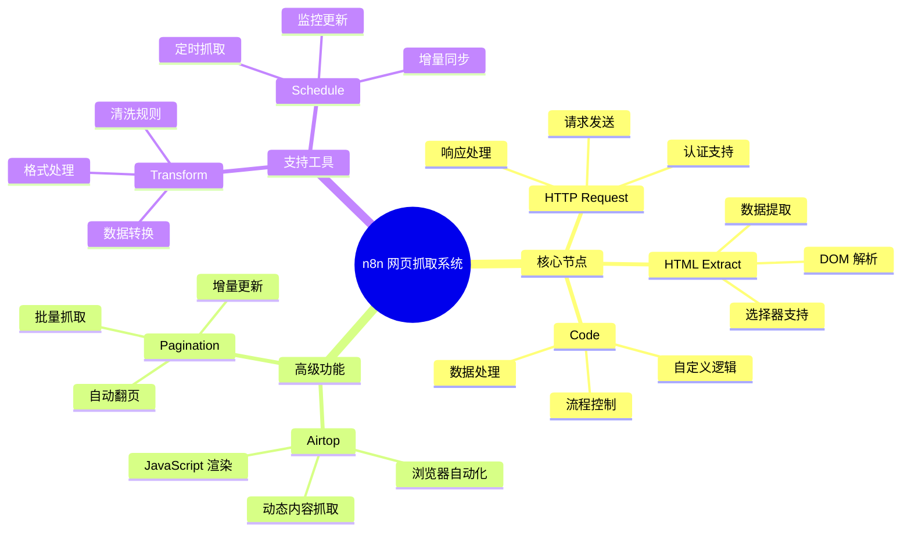
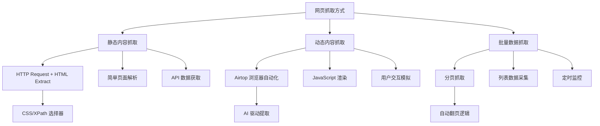
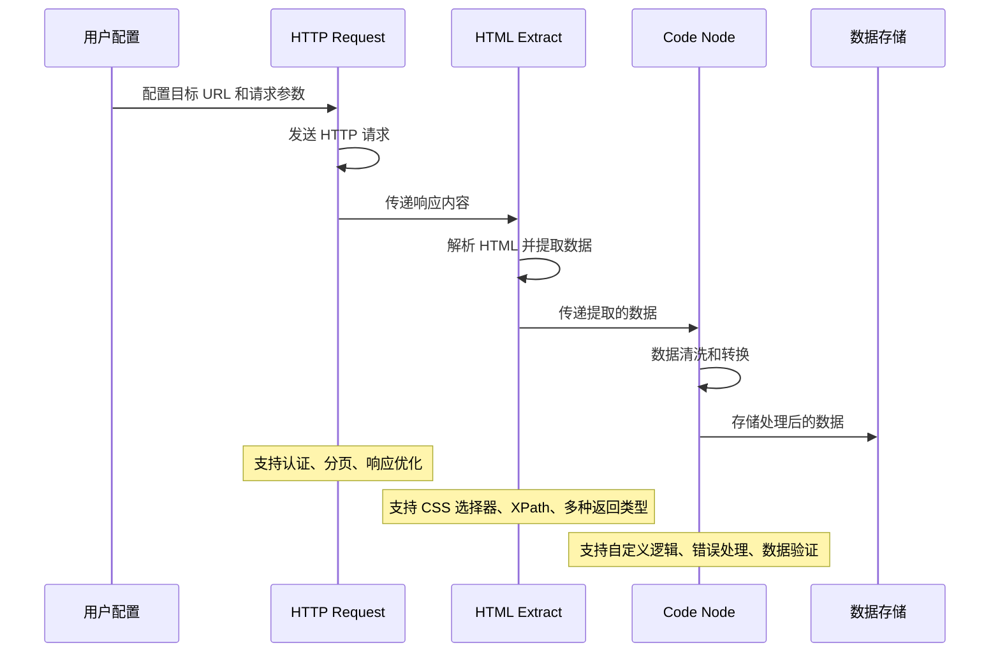
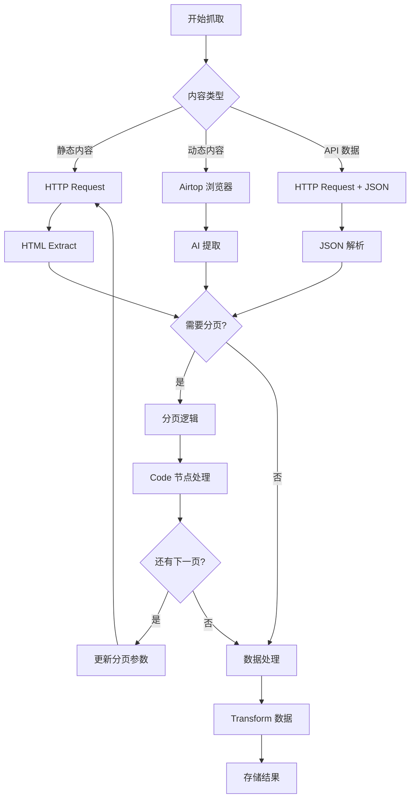
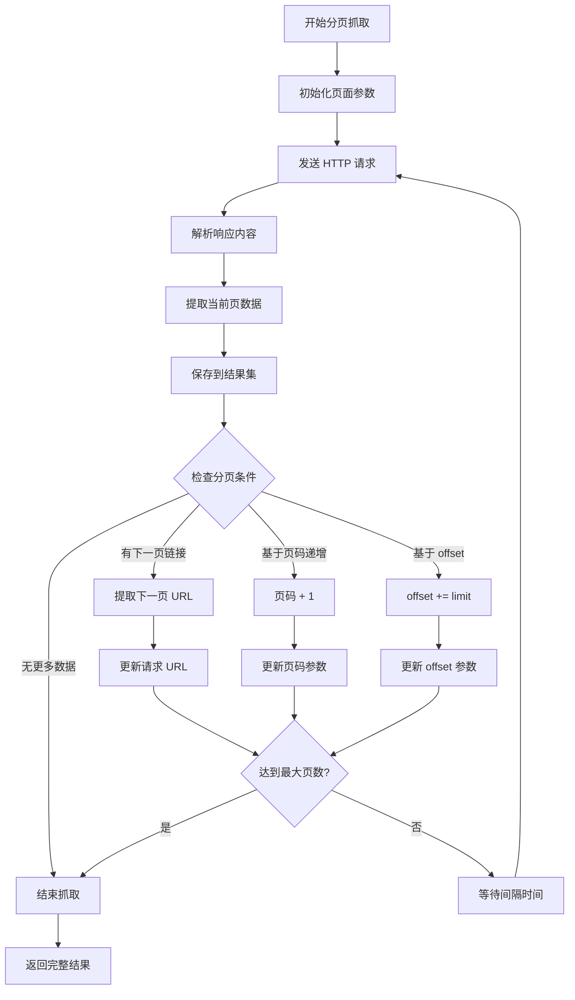
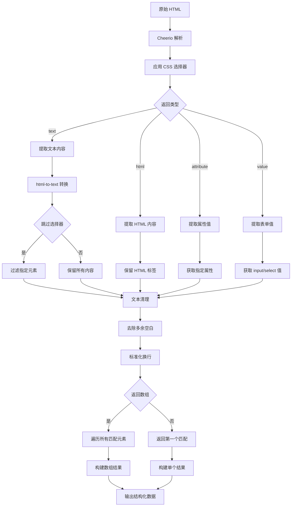
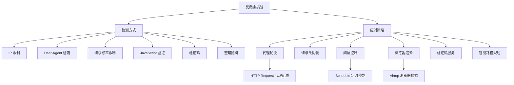
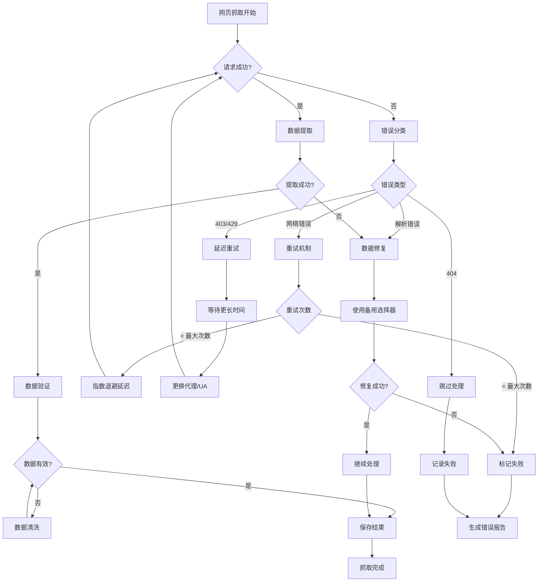
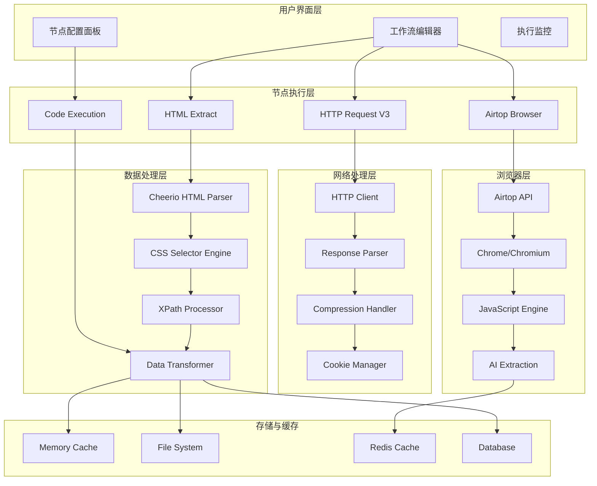
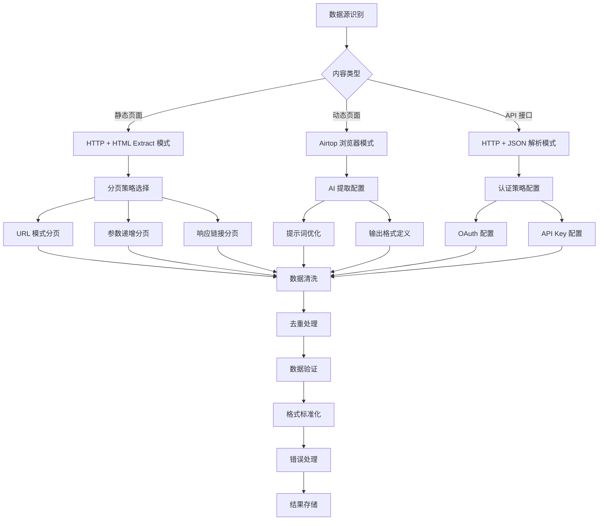

# n8n 网页抓取与爬虫系统深度解析

## 1. 系统架构与核心概念

### 1.1 网页抓取生态系统
n8n 没有单独的 "Crawler" 节点，而是通过多个节点协同工作实现强大的网页抓取功能。这种模块化设计提供了更高的灵活性和可扩展性。



### 1.2 抓取方式分类


---

## 2. 核心节点详解

### 2.1 HTTP Request 节点 (主要抓取引擎)

#### 节点基本信息
- **源码路径**: `packages/nodes-base/nodes/HttpRequest/`
- **当前版本**: 4.2
- **核心功能**: 发送 HTTP 请求，获取网页内容

#### 关键属性配置
```typescript
// packages/nodes-base/nodes/HttpRequest/V3/HttpRequestV3.node.ts
export class HttpRequestV3 implements INodeType {
  description: INodeTypeDescription = {
    displayName: 'HTTP Request',
    name: 'httpRequest',
    subtitle: '={{$parameter["method"] + ": " + $parameter["url"]}}',
    version: [3, 4, 4.1, 4.2],
    group: ['transform'],
    credentials: [
      // 支持多种认证方式
      'httpBasicAuth', 'httpBearerAuth', 'httpDigestAuth',
      'httpHeaderAuth', 'httpQueryAuth', 'httpCustomAuth',
      'oAuth1Api', 'oAuth2Api', 'httpSslAuth'
    ]
  };
}
```

#### 高级抓取功能
```typescript
interface AdvancedHttpOptions {
  // 分页支持
  pagination: {
    paginationMode: 'off' | 'updateAParameterInEachRequest' | 'responseContainsNextURL';
    maxRequests: number;
    requestInterval: number;
    completeExpression: string;
  };

  // 响应优化
  responseOptimization: {
    htmlOptimizer: boolean;
    cssSelector: string;
    onlyContent: boolean;
    elementsToOmit: string[];
  };

  // 请求配置
  requestConfig: {
    timeout: number;
    redirect: 'follow' | 'manual' | 'error';
    maxRedirects: number;
    batching: boolean;
    batchSize: number;
  };
}
```

### 2.2 HTML Extract 节点 (数据提取引擎)

#### 源码实现分析
```typescript
// packages/nodes-base/nodes/Html/Html.node.ts
const extractionValuesCollection: INodeProperties = {
  displayName: 'Extraction Values',
  name: 'extractionValues',
  type: 'fixedCollection',
  typeOptions: { multipleValues: true },
  options: [{
    name: 'values',
    displayName: 'Values',
    values: [
      {
        displayName: 'Key',
        name: 'key',
        type: 'string',
        description: 'The key under which the extracted value should be saved'
      },
      {
        displayName: 'CSS Selector',
        name: 'cssSelector',
        type: 'string',
        placeholder: '.price',
        description: 'The CSS selector to use'
      },
      {
        displayName: 'Return Value',
        name: 'returnValue',
        type: 'options',
        options: [
          { name: 'Attribute', value: 'attribute' },
          { name: 'HTML', value: 'html' },
          { name: 'Text', value: 'text' },
          { name: 'Value', value: 'value' }
        ]
      }
    ]
  }]
};
```

#### 提取函数实现
```typescript
// packages/nodes-base/nodes/Html/utils.ts
const extractFunctions: {
  [key: string]: ($: Cheerio, valueData: IValueData, nodeVersion: number) => string | undefined;
} = {
  attribute: ($: Cheerio, valueData: IValueData): string | undefined =>
    $.attr(valueData.attribute!),

  html: ($: Cheerio, _valueData: IValueData): string | undefined =>
    $.html() || undefined,

  text: ($: Cheerio, _valueData: IValueData, nodeVersion: number): string | undefined => {
    if (nodeVersion <= 1.1) return $.text() || undefined;

    const html = $.html() || '';
    let options;
    if (_valueData.skipSelectors) {
      options = {
        selectors: _valueData.skipSelectors.split(',').map((s) => ({
          selector: s.trim(),
          format: 'skip',
        })),
      };
    }
    return convert(html, options);  // html-to-text conversion
  },

  value: ($: Cheerio, _valueData: IValueData): string | undefined => $.val(),
};
```

### 2.3 Airtop 节点 (浏览器自动化)

#### 节点架构
```typescript
// packages/nodes-base/nodes/Airtop/Airtop.node.ts
export class Airtop implements INodeType {
  description: INodeTypeDescription = {
    displayName: 'Airtop',
    name: 'airtop',
    description: 'Scrape and control any site with Airtop',
    usableAsTool: true,
    resources: [
      'extraction',  // 数据提取
      'file',        // 文件处理
      'interaction', // 用户交互
      'session',     // 会话管理
      'window'       // 窗口控制
    ]
  };
}
```

#### AI 驱动的数据提取
```typescript
// packages/nodes-base/nodes/Airtop/actions/extraction/query.operation.ts
export async function execute(
  this: IExecuteFunctions,
  index: number,
): Promise<INodeExecutionData[]> {
  const prompt = this.getNodeParameter('prompt', index, '') as string;
  const additionalFields = this.getNodeParameter('additionalFields', index);

  const result = await executeRequestWithSessionManagement.call(this, index, {
    method: 'POST',
    path: '/sessions/{sessionId}/windows/{windowId}/query',
    body: {
      prompt,                              // AI 提示词
      includeVisualAnalysis: true,         // 视觉分析
      outputSchema: additionalFields.outputSchema  // 输出格式
    },
  });

  return this.helpers.returnJsonArray(parseJsonIfPresent.call(this, index, result));
}
```

---

## 3. 网页抓取完整流程

### 3.1 基本抓取流程架构


### 3.2 高级抓取模式


---

## 4. 分页抓取系统

### 4.1 HTTP Request 内置分页
```typescript
// packages/nodes-base/nodes/HttpRequest/V3/HttpRequestV3.node.ts
interface PaginationConfig {
  paginationMode: 'off' | 'updateAParameterInEachRequest' | 'responseContainsNextURL';

  // 参数更新模式
  parameters: {
    parameters: Array<{
      type: 'body' | 'headers' | 'qs';
      name: string;
      value: string;  // 支持表达式，如 {{ $response.body.next_page }}
    }>;
  };

  // 完成条件
  paginationCompleteWhen: 'responseIsEmpty' | 'receiveSpecificStatusCodes' | 'other';
  statusCodesWhenComplete: string;
  completeExpression: string;  // JavaScript 表达式

  // 限制设置
  limitPagesFetched: boolean;
  maxRequests: number;
  requestInterval: number;  // 请求间隔（毫秒）
}
```

### 4.2 Airtop 智能分页
```typescript
// packages/nodes-base/nodes/Airtop/actions/extraction/getPaginated.operation.ts
export async function execute(
  this: IExecuteFunctions,
  index: number,
): Promise<INodeExecutionData[]> {
  const prompt = this.getNodeParameter('prompt', index, '') as string;
  const additionalFields = this.getNodeParameter('additionalFields', index);

  const configuration = {
    paginationMode: additionalFields.paginationMode || 'auto',  // auto | paginated | infinite-scroll
    interactionMode: additionalFields.interactionMode || 'auto',  // auto | accurate | cost-efficient
    outputSchema: additionalFields.outputSchema
  };

  const result = await executeRequestWithSessionManagement.call(this, index, {
    method: 'POST',
    path: '/sessions/{sessionId}/windows/{windowId}/paginated-extraction',
    body: { prompt, configuration },
  });

  return this.helpers.returnJsonArray(parseJsonIfPresent.call(this, index, result));
}
```

### 4.3 自定义分页流程


---

## 5. 数据提取与处理系统

### 5.1 CSS 选择器系统
```typescript
interface ExtractionRule {
  key: string;              // 数据字段名
  cssSelector: string;      // CSS 选择器
  returnValue: 'text' | 'html' | 'attribute' | 'value';
  attribute?: string;       // 属性名（当 returnValue 为 'attribute' 时）
  returnArray: boolean;     // 是否返回数组
  skipSelectors?: string;   // 跳过的子选择器（用于文本提取）
}

// 使用示例
const extractionRules: ExtractionRule[] = [
  {
    key: 'title',
    cssSelector: 'h1.product-title',
    returnValue: 'text',
    returnArray: false
  },
  {
    key: 'price',
    cssSelector: '.price-current',
    returnValue: 'text',
    returnArray: false
  },
  {
    key: 'images',
    cssSelector: '.product-images img',
    returnValue: 'attribute',
    attribute: 'src',
    returnArray: true
  },
  {
    key: 'description',
    cssSelector: '.product-description',
    returnValue: 'text',
    returnArray: false,
    skipSelectors: 'script, style, .advertisement'
  }
];
```

### 5.2 高级数据处理流程


### 5.3 响应优化系统
```typescript
// packages/nodes-base/nodes/HttpRequest/shared/optimizeResponse.ts
function htmlOptimizer(
  ctx: IExecuteFunctions,
  itemIndex: number,
  maxLength: number,
): ResponseOptimizerFn {
  const cssSelector = ctx.getNodeParameter('cssSelector', itemIndex, '') as string;
  const onlyContent = ctx.getNodeParameter('onlyContent', itemIndex, false) as boolean;
  let elementsToOmit: string[] = [];

  if (onlyContent) {
    const elementsToOmitUi = ctx.getNodeParameter('elementsToOmit', itemIndex, '') as string | string[];
    elementsToOmit = Array.isArray(elementsToOmitUi)
      ? elementsToOmitUi
      : elementsToOmitUi.split(',').filter(s => s).map(s => s.trim());
  }

  return (response) => {
    const html = cheerio.load(response);
    const htmlElements = html(cssSelector);
    const returnData: string[] = [];

    htmlElements.each((_, el) => {
      let value = html(el).html() || '';

      if (onlyContent) {
        let htmlToTextOptions;
        if (elementsToOmit?.length) {
          htmlToTextOptions = {
            selectors: elementsToOmit.map((selector) => ({
              selector,
              format: 'skip',
            })),
          };
        }
        value = convert(value, htmlToTextOptions);
      }

      // 清理文本
      value = value
        .trim()
        .replace(/^\s+|\s+$/g, '')
        .replace(/(\r\n|\n|\r)/gm, '')
        .replace(/\s+/g, ' ');

      returnData.push(value);
    });

    const text = JSON.stringify(returnData, null, 2);
    return maxLength > 0 && text.length > maxLength
      ? text.substring(0, maxLength)
      : text;
  };
}
```

---

## 6. 实际应用场景与示例

### 6.1 电商产品信息抓取
```json
{
  "nodes": [
    {
      "name": "Product List Request",
      "type": "n8n-nodes-base.httpRequest",
      "parameters": {
        "method": "GET",
        "url": "https://example-shop.com/products?page={{ $json.page || 1 }}",
        "options": {
          "pagination": {
            "pagination": {
              "paginationMode": "updateAParameterInEachRequest",
              "parameters": {
                "parameters": [
                  {
                    "type": "qs",
                    "name": "page",
                    "value": "={{ $response.body.current_page + 1 }}"
                  }
                ]
              },
              "paginationCompleteWhen": "other",
              "completeExpression": "={{ $response.body.current_page >= $response.body.total_pages }}",
              "maxRequests": 50,
              "requestInterval": 2000
            }
          }
        }
      }
    },
    {
      "name": "Extract Product Data",
      "type": "n8n-nodes-base.html",
      "parameters": {
        "operation": "extractHtmlContent",
        "sourceData": "json",
        "dataPropertyName": "body",
        "extractionValues": {
          "values": [
            {
              "key": "product_name",
              "cssSelector": ".product-item h3",
              "returnValue": "text",
              "returnArray": true
            },
            {
              "key": "price",
              "cssSelector": ".product-item .price",
              "returnValue": "text",
              "returnArray": true
            },
            {
              "key": "product_url",
              "cssSelector": ".product-item a",
              "returnValue": "attribute",
              "attribute": "href",
              "returnArray": true
            },
            {
              "key": "image_url",
              "cssSelector": ".product-item img",
              "returnValue": "attribute",
              "attribute": "src",
              "returnArray": true
            }
          ]
        }
      }
    }
  ]
}
```

### 6.2 新闻监控抓取
```javascript
// Code 节点中的自定义逻辑
const articles = [];
const seenUrls = new Set();

// 处理每个新闻项目
for (const item of $input.all()) {
  const title = item.json.title?.trim();
  const url = item.json.url?.trim();
  const publishDate = item.json.publish_date;

  // 去重检查
  if (!url || seenUrls.has(url)) continue;
  seenUrls.add(url);

  // 数据验证和清理
  if (title && url) {
    articles.push({
      title: title,
      url: url.startsWith('http') ? url : `https://example-news.com${url}`,
      publishDate: publishDate || new Date().toISOString(),
      source: 'example-news',
      scrapedAt: $now,
      hash: require('crypto').createHash('md5').update(title + url).digest('hex')
    });
  }
}

// 按发布时间排序
articles.sort((a, b) => new Date(b.publishDate) - new Date(a.publishDate));

return articles.map(article => ({ json: article }));
```

### 6.3 社交媒体内容抓取（使用 Airtop）
```json
{
  "name": "Social Media Scraper",
  "type": "n8n-nodes-base.airtop",
  "parameters": {
    "resource": "extraction",
    "operation": "getPaginated",
    "prompt": "Extract all posts from this social media feed, including: author name, post content, timestamp, like count, comment count, and share count. Continue scrolling to load more posts.",
    "additionalFields": {
      "paginationMode": "infinite-scroll",
      "interactionMode": "accurate",
      "outputSchema": {
        "type": "array",
        "items": {
          "type": "object",
          "properties": {
            "author": { "type": "string" },
            "content": { "type": "string" },
            "timestamp": { "type": "string" },
            "likes": { "type": "number" },
            "comments": { "type": "number" },
            "shares": { "type": "number" }
          }
        }
      }
    }
  }
}
```

---

## 7. 反爬虫对策与最佳实践

### 7.1 反爬虫对策架构


### 7.2 请求头伪装配置
```typescript
interface AntiDetectionConfig {
  headers: {
    'User-Agent': string[];  // 轮换的 User-Agent 列表
    'Accept': string;
    'Accept-Language': string;
    'Accept-Encoding': string;
    'Referer': string;
    'DNT': string;
    'Connection': string;
    'Upgrade-Insecure-Requests': string;
  };

  timing: {
    minDelay: number;      // 最小请求间隔
    maxDelay: number;      // 最大请求间隔
    randomization: boolean; // 是否随机化间隔
  };

  behavior: {
    respectRobotsTxt: boolean;  // 是否遵守 robots.txt
    sessionPersistence: boolean; // 是否保持会话
    cookieHandling: boolean;     // 是否处理 Cookie
  };
}
```

### 7.3 智能延迟策略
```javascript
// Code 节点中的智能延迟实现
const requestHistory = $getWorkflowStaticData('global').requestHistory || [];
const currentTime = Date.now();

// 计算动态延迟
function calculateDelay() {
  const recentRequests = requestHistory.filter(
    time => currentTime - time < 60000  // 最近1分钟的请求
  );

  let baseDelay = 1000;  // 基础延迟 1 秒

  if (recentRequests.length > 10) {
    baseDelay *= 2;  // 请求过频繁，增加延迟
  }

  // 添加随机性 (±50%)
  const randomFactor = 0.5 + Math.random();
  return Math.floor(baseDelay * randomFactor);
}

// 记录请求时间
requestHistory.push(currentTime);
if (requestHistory.length > 100) {
  requestHistory.splice(0, 50);  // 保持历史记录不超过100条
}

const delay = calculateDelay();
console.log(`Applying delay: ${delay}ms`);

// 等待指定时间
await new Promise(resolve => setTimeout(resolve, delay));

return $input.all();
```

---

## 8. 错误处理与监控系统

### 8.1 错误处理架构


### 8.2 监控指标收集
```javascript
// 监控数据收集的 Code 节点实现
const metrics = $getWorkflowStaticData('global').metrics || {
  totalRequests: 0,
  successfulRequests: 0,
  failedRequests: 0,
  averageResponseTime: 0,
  errors: {},
  lastRun: null
};

const startTime = Date.now();

try {
  // 执行抓取逻辑
  const results = [];
  for (const item of $input.all()) {
    try {
      // 处理单个项目
      const processed = await processItem(item);
      results.push(processed);
      metrics.successfulRequests++;
    } catch (error) {
      metrics.failedRequests++;

      // 错误分类统计
      const errorType = error.name || 'UnknownError';
      metrics.errors[errorType] = (metrics.errors[errorType] || 0) + 1;

      console.error(`Processing failed for item:`, error.message);

      // 根据 continueOnFail 决定是否继续
      if (this.continueOnFail()) {
        results.push({
          json: {
            error: error.message,
            originalData: item.json
          }
        });
      } else {
        throw error;
      }
    }
  }

  const endTime = Date.now();
  const responseTime = endTime - startTime;

  // 更新平均响应时间
  metrics.averageResponseTime =
    (metrics.averageResponseTime * metrics.totalRequests + responseTime) /
    (metrics.totalRequests + 1);

  metrics.totalRequests++;
  metrics.lastRun = new Date().toISOString();

  // 成功率计算
  const successRate = (metrics.successfulRequests / metrics.totalRequests * 100).toFixed(2);

  console.log(`Crawling metrics:`, {
    successRate: `${successRate}%`,
    totalRequests: metrics.totalRequests,
    responseTime: `${responseTime}ms`,
    errors: Object.keys(metrics.errors).length
  });

  return results;

} catch (error) {
  metrics.failedRequests++;
  metrics.totalRequests++;

  console.error('Workflow failed:', error.message);
  throw error;
}

async function processItem(item) {
  // 实际的数据处理逻辑
  return {
    json: {
      ...item.json,
      processedAt: new Date().toISOString()
    }
  };
}
```

---

## 9. 性能优化策略

### 9.1 并发控制与批处理
```typescript
interface PerformanceConfig {
  concurrency: {
    maxConcurrentRequests: number;    // 最大并发请求数
    batchSize: number;                // 批处理大小
    queueThreshold: number;           // 队列阈值
    backpressureHandling: boolean;    // 背压处理
  };

  caching: {
    responseCache: boolean;           // 响应缓存
    cacheDuration: number;            // 缓存持续时间
    cacheStrategy: 'memory' | 'disk' | 'redis';
  };

  optimization: {
    compressionEnabled: boolean;       // 启用压缩
    keepAliveConnections: boolean;     // 保持连接
    connectionPooling: boolean;        // 连接池
    timeoutSettings: {
      connect: number;
      request: number;
      response: number;
    };
  };
}
```

### 9.2 内存管理优化
```javascript
// 内存优化的数据处理
class MemoryEfficientCrawler {
  constructor() {
    this.processedCount = 0;
    this.batchSize = 100;
    this.results = [];
  }

  async processBatch(items) {
    const batch = [];

    for (let i = 0; i < items.length; i += this.batchSize) {
      const batchItems = items.slice(i, i + this.batchSize);

      try {
        const batchResults = await this.processItems(batchItems);
        batch.push(...batchResults);

        // 内存压力检查
        if (process.memoryUsage().heapUsed > 500 * 1024 * 1024) { // 500MB
          console.log('Memory pressure detected, forcing garbage collection');
          if (global.gc) global.gc();

          // 等待一段时间让系统回收内存
          await new Promise(resolve => setTimeout(resolve, 1000));
        }

      } catch (error) {
        console.error(`Batch processing failed:`, error.message);
        // 继续处理下一批
      }

      this.processedCount += batchItems.length;
      console.log(`Processed ${this.processedCount} items`);
    }

    return batch;
  }

  async processItems(items) {
    return Promise.all(items.map(async (item) => {
      try {
        const result = await this.processItem(item);
        return { json: result };
      } catch (error) {
        return {
          json: {
            error: error.message,
            originalData: item.json
          }
        };
      }
    }));
  }

  async processItem(item) {
    // 处理单个项目的逻辑
    return {
      ...item.json,
      processedAt: new Date().toISOString()
    };
  }
}

// 使用优化的爬虫
const crawler = new MemoryEfficientCrawler();
return await crawler.processBatch($input.all());
```

---

## 10. 源码结构与技术架构

### 10.1 核心目录结构
```
packages/nodes-base/nodes/
├── HttpRequest/                    # HTTP 请求节点
│   ├── V3/HttpRequestV3.node.ts   # 主要实现
│   ├── shared/optimizeResponse.ts # 响应优化
│   └── GenericFunctions.ts        # 通用函数
├── Html/                          # HTML 处理节点
│   ├── Html.node.ts              # 主要实现
│   ├── utils.ts                  # 提取函数
│   └── types.ts                  # 类型定义
├── HtmlExtract/                   # HTML 提取节点
│   └── HtmlExtract.node.ts       # 简化版实现
├── Airtop/                        # 浏览器自动化
│   ├── Airtop.node.ts            # 主节点
│   ├── actions/extraction/       # 提取操作
│   │   ├── query.operation.ts    # AI 查询
│   │   ├── scrape.operation.ts   # 内容抓取
│   │   └── getPaginated.operation.ts # 分页抓取
│   └── actions/session/          # 会话管理
└── Code/                          # 自定义代码节点
    ├── Code.node.ts              # 主要实现
    └── JavaScriptSandbox.ts      # 沙箱环境
```

### 10.2 技术栈架构图


---

## 11. 最佳实践与部署建议

### 11.1 工作流设计模式


### 11.2 监控与维护
```typescript
interface CrawlerMonitoring {
  healthChecks: {
    endpointAvailability: boolean;    // 目标端点可用性
    responseTimeThreshold: number;    // 响应时间阈值
    errorRateThreshold: number;       // 错误率阈值
    dataQualityChecks: boolean;       // 数据质量检查
  };

  alerting: {
    channels: ('email' | 'slack' | 'webhook')[];
    conditions: {
      highErrorRate: number;          // 高错误率阈值
      slowResponse: number;           // 慢响应阈值
      dataAnomaly: boolean;           // 数据异常检测
      siteStructureChange: boolean;   // 网站结构变化
    };
  };

  recovery: {
    automaticRetry: boolean;          // 自动重试
    fallbackStrategies: string[];    // 备用策略
    gracefulDegradation: boolean;     // 优雅降级
  };
}
```

### 11.3 扩展性考虑
- **分布式抓取**: 使用多个 n8n 实例处理大规模抓取
- **云服务集成**: 利用 AWS Lambda、Google Cloud Functions 等
- **缓存策略**: Redis、Memcached 提升性能
- **数据管道**: 与 Apache Kafka、RabbitMQ 集成
- **机器学习**: 集成数据分析和预测模型

> **总结**: n8n 的网页抓取系统通过模块化的节点设计，提供了从简单静态页面抓取到复杂动态内容提取的完整解决方案。结合 HTTP Request、HTML Extract、Airtop 和 Code 节点，可以构建强大、灵活且可扩展的数据采集工作流，满足各种业务场景的需求。
