# n8n If 节点深度解析

## 1. 节点架构与基础信息

### 1.1 节点基本信息
- **显示名称**: If
- **节点名称**: `if`
- **图标**: 🗺️ (fa:map-signs)
- **图标颜色**: 绿色 (#408000)
- **组别**: transform
- **当前版本**: 2.2 (默认版本)
- **源码路径**: `packages/nodes-base/nodes/If/`

### 1.2 节点描述
If 节点是 n8n 中的条件分支节点，用于根据指定的条件将数据流路由到不同的分支（true/false）。它是工作流中实现条件逻辑的核心组件，支持多种数据类型的比较和复杂条件组合。

### 1.3 版本历史与演进
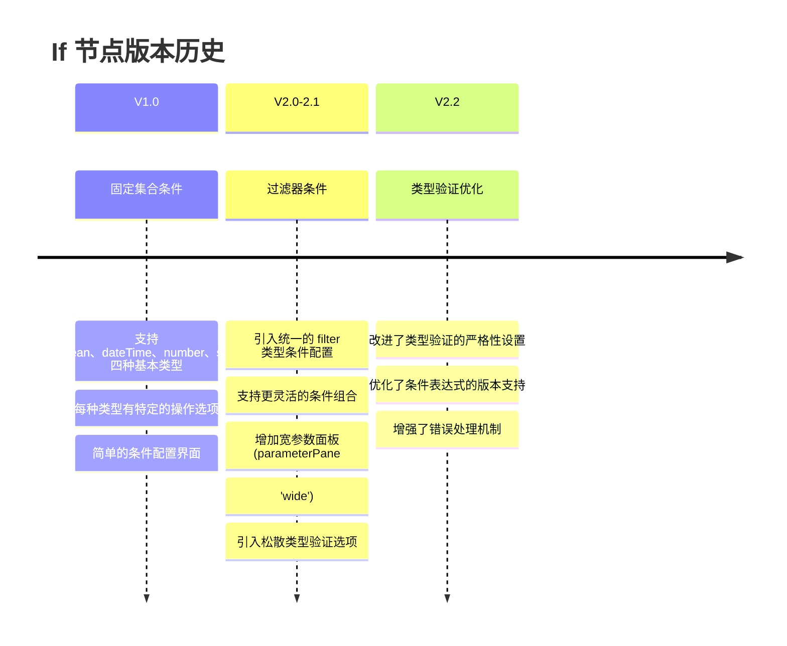

### 1.4 连接类型与拓扑结构
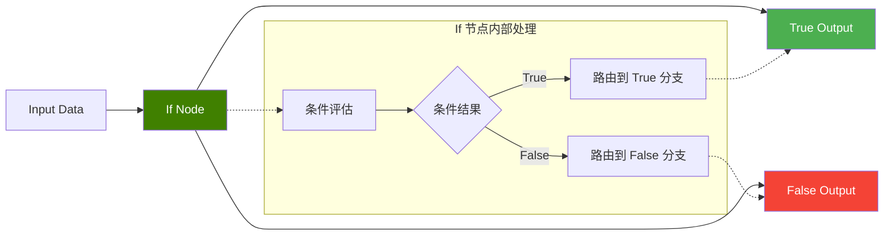

---

## 2. 节点属性配置详解

### 2.1 版本差异对比

#### V1 版本属性结构
```typescript
// IfV1.node.ts - 固定集合条件配置
properties: [
  {
    displayName: 'Conditions',
    name: 'conditions',
    type: 'fixedCollection',
    typeOptions: {
      multipleValues: true,
      sortable: true,
    },
    options: [
      { name: 'boolean', displayName: 'Boolean', values: [...] },
      { name: 'dateTime', displayName: 'Date & Time', values: [...] },
      { name: 'number', displayName: 'Number', values: [...] },
      { name: 'string', displayName: 'String', values: [...] }
    ]
  }
]
```

#### V2 版本属性结构
```typescript
// IfV2.node.ts - 过滤器条件配置
properties: [
  {
    displayName: 'Conditions',
    name: 'conditions',
    type: 'filter',
    default: {},
    typeOptions: {
      filter: {
        caseSensitive: '={{!$parameter.options.ignoreCase}}',
        typeValidation: '={{ ($nodeVersion < 2.1 ? $parameter.options.looseTypeValidation : $parameter.looseTypeValidation) ? "loose" : "strict" }}',
        version: '={{ $nodeVersion >= 2.2 ? 2 : 1 }}'
      }
    }
  }
]
```

### 2.2 条件配置系统

#### V1 版本 - 分类型条件配置
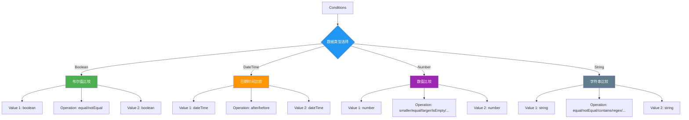

#### V2 版本 - 统一过滤器配置
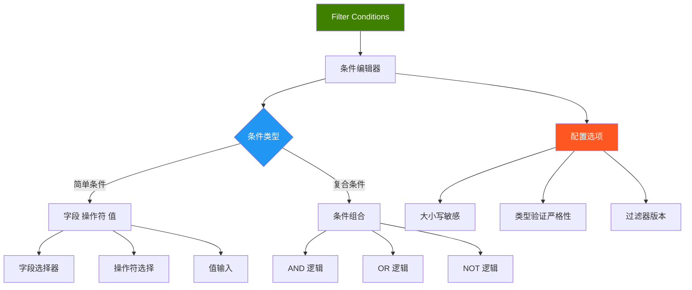

### 2.3 类型验证与错误处理

#### 类型验证配置
```typescript
// V2/utils.ts - 类型验证工具函数
export const getTypeValidationStrictness = (version: number) => {
  return `={{ ($nodeVersion < ${version} ? $parameter.options.looseTypeValidation : $parameter.looseTypeValidation) ? "loose" : "strict" }}`;
};

export const getTypeValidationParameter = (version: number) => {
  return (context: IExecuteFunctions, itemIndex: number, option: boolean | undefined) => {
    if (context.getNode().typeVersion < version) {
      return option;
    } else {
      return context.getNodeParameter('looseTypeValidation', itemIndex, false) as boolean;
    }
  };
};
```

#### 松散类型验证属性
```typescript
// looseTypeValidationProperty 配置
{
  displayName: 'Less Strict Type Validation',
  name: 'looseTypeValidation',
  type: 'boolean',
  default: false,
  description: 'When enabled, the node will not error if types are different but can be coerced',
  displayOptions: {
    show: {
      '@version': [{ _cnd: { gte: 2.1 } }]  // 仅在 2.1+ 版本显示
    }
  }
}
```

---

## 3. 执行引擎与条件评估

### 3.1 执行流程架构
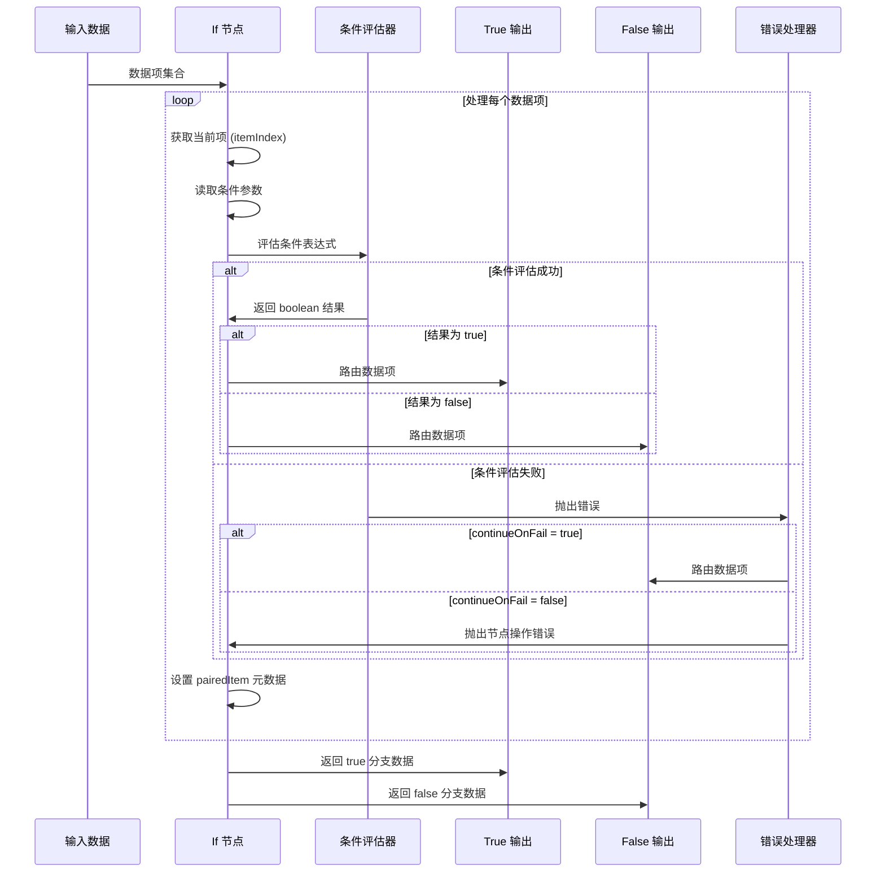

### 3.2 核心执行逻辑

#### V2 版本执行函数
```typescript
// IfV2.node.ts - execute 方法核心逻辑
async execute(this: IExecuteFunctions): Promise<INodeExecutionData[][]> {
  const trueItems: INodeExecutionData[] = [];
  const falseItems: INodeExecutionData[] = [];

  this.getInputData().forEach((item, itemIndex) => {
    try {
      const options = this.getNodeParameter('options', itemIndex) as {
        ignoreCase?: boolean;
        looseTypeValidation?: boolean;
      };

      let pass = false;
      try {
        // 条件评估 - 提取布尔值结果
        pass = this.getNodeParameter('conditions', itemIndex, false, {
          extractValue: true,
        }) as boolean;
      } catch (error) {
        // 类型验证错误处理
        if (!getTypeValidationParameter(2.1)(this, itemIndex, options.looseTypeValidation)
            && !error.description) {
          set(error, 'description', ENABLE_LESS_STRICT_TYPE_VALIDATION);
        }
        set(error, 'context.itemIndex', itemIndex);
        set(error, 'node', this.getNode());
        throw error;
      }

      // 设置配对项元数据
      if (item.pairedItem === undefined) {
        item.pairedItem = { item: itemIndex };
      }

      // 路由到对应输出
      if (pass) {
        trueItems.push(item);
      } else {
        falseItems.push(item);
      }
    } catch (error) {
      // 错误处理逻辑
      if (this.continueOnFail()) {
        falseItems.push(item);
      } else {
        // 重新抛出或包装为 NodeOperationError
        throw new NodeOperationError(this.getNode(), error, { itemIndex });
      }
    }
  });

  return [trueItems, falseItems];
}
```

### 3.3 条件评估详细流程
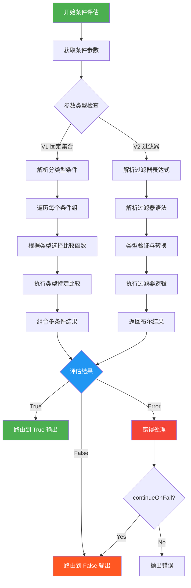

---

## 4. 高级功能与最佳实践

### 4.1 选项配置详解

#### ignoreCase 选项
```typescript
// options.ignoreCase 配置
{
  displayName: 'Ignore Case',
  description: 'Whether to ignore letter case when evaluating conditions',
  name: 'ignoreCase',
  type: 'boolean',
  default: true,
}

// 在过滤器中的应用
typeOptions: {
  filter: {
    caseSensitive: '={{!$parameter.options.ignoreCase}}',  // 动态绑定
  }
}
```

#### 类型验证严格性
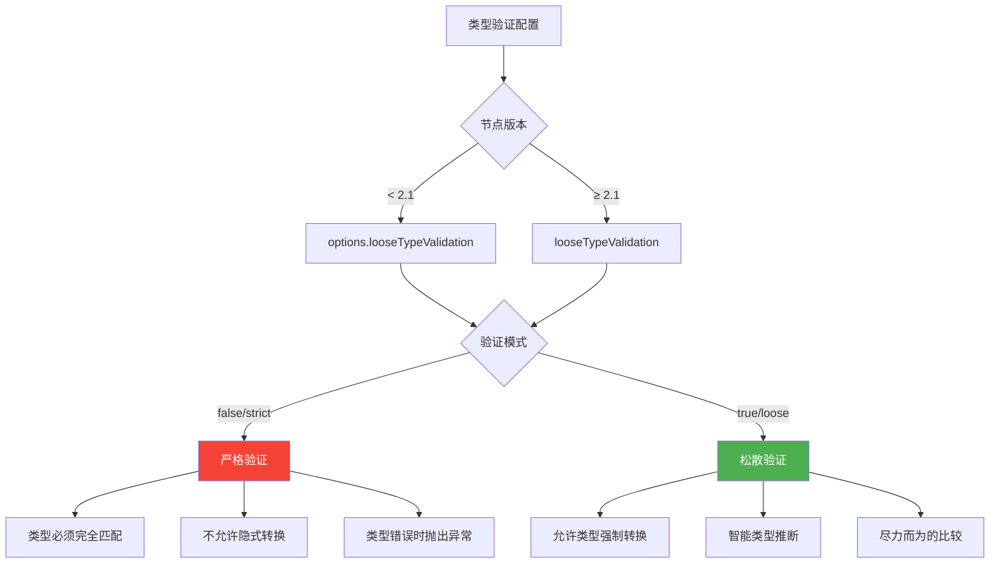

### 4.2 错误处理策略

#### 分层错误处理
```typescript
// 错误处理的三个层次
try {
  // 1. 条件评估层
  pass = this.getNodeParameter('conditions', itemIndex, false, {
    extractValue: true,
  }) as boolean;
} catch (error) {
  // 2. 类型验证层错误增强
  if (!getTypeValidationParameter(2.1)(this, itemIndex, options.looseTypeValidation)
      && !error.description) {
    set(error, 'description', ENABLE_LESS_STRICT_TYPE_VALIDATION);
  }
  set(error, 'context.itemIndex', itemIndex);
  set(error, 'node', this.getNode());
  throw error;
}

// 3. 节点级错误处理
catch (error) {
  if (this.continueOnFail()) {
    falseItems.push(item);  // 降级处理
  } else {
    throw new NodeOperationError(this.getNode(), error, { itemIndex });
  }
}
```

### 4.3 性能优化考虑

#### 数据处理优化
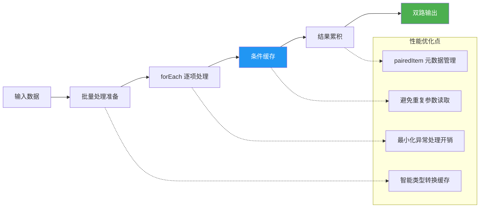

---

## 5. 使用示例与最佳实践

### 5.1 常见使用场景

#### 场景1: 数值范围判断
```javascript
// V2 条件配置示例
{
  "conditions": {
    "combinator": "and",
    "conditions": [
      {
        "leftValue": "={{ $json.score }}",
        "rightValue": 80,
        "operator": "gte"  // >= 80
      },
      {
        "leftValue": "={{ $json.score }}",
        "rightValue": 100,
        "operator": "lte"  // <= 100
      }
    ]
  }
}
```

#### 场景2: 字符串模式匹配
```javascript
// 复杂字符串条件
{
  "conditions": {
    "combinator": "or",
    "conditions": [
      {
        "leftValue": "={{ $json.email }}",
        "rightValue": "@company.com",
        "operator": "endsWith"
      },
      {
        "leftValue": "={{ $json.department }}",
        "rightValue": "admin",
        "operator": "equal"
      }
    ]
  },
  "options": {
    "ignoreCase": true
  }
}
```

#### 场景3: 日期时间判断
```javascript
// 时间范围过滤
{
  "conditions": {
    "combinator": "and",
    "conditions": [
      {
        "leftValue": "={{ $json.created_at }}",
        "rightValue": "{{ $now.minus({days: 7}) }}",
        "operator": "after"
      },
      {
        "leftValue": "={{ $json.status }}",
        "rightValue": "active",
        "operator": "equal"
      }
    ]
  }
}
```

### 5.2 工作流设计模式

#### 多级条件筛选
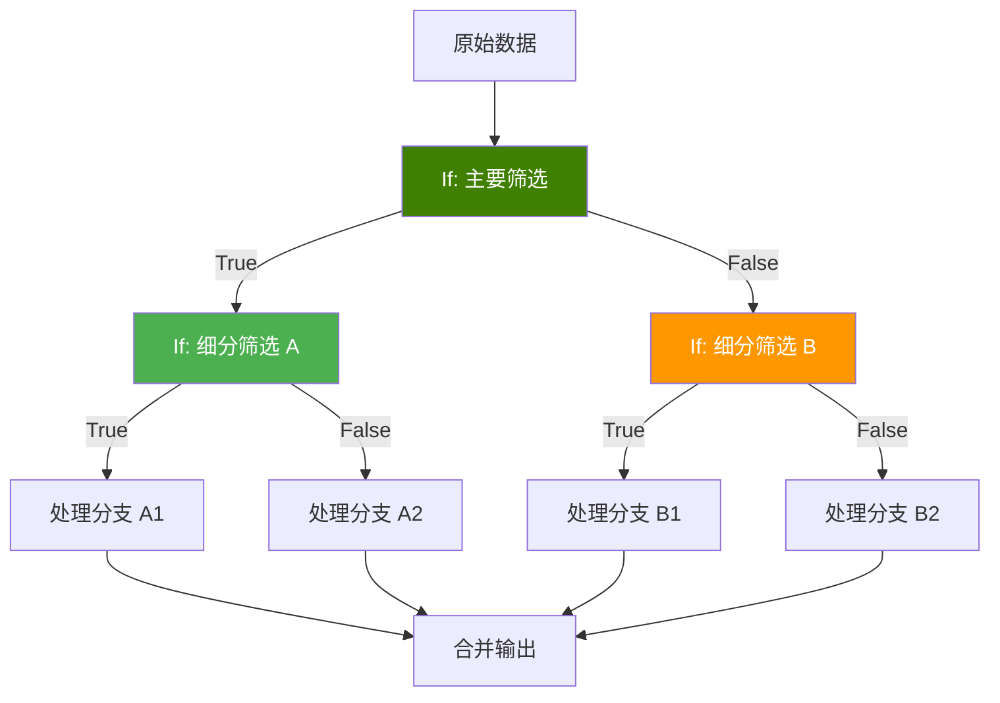

#### 异常处理模式
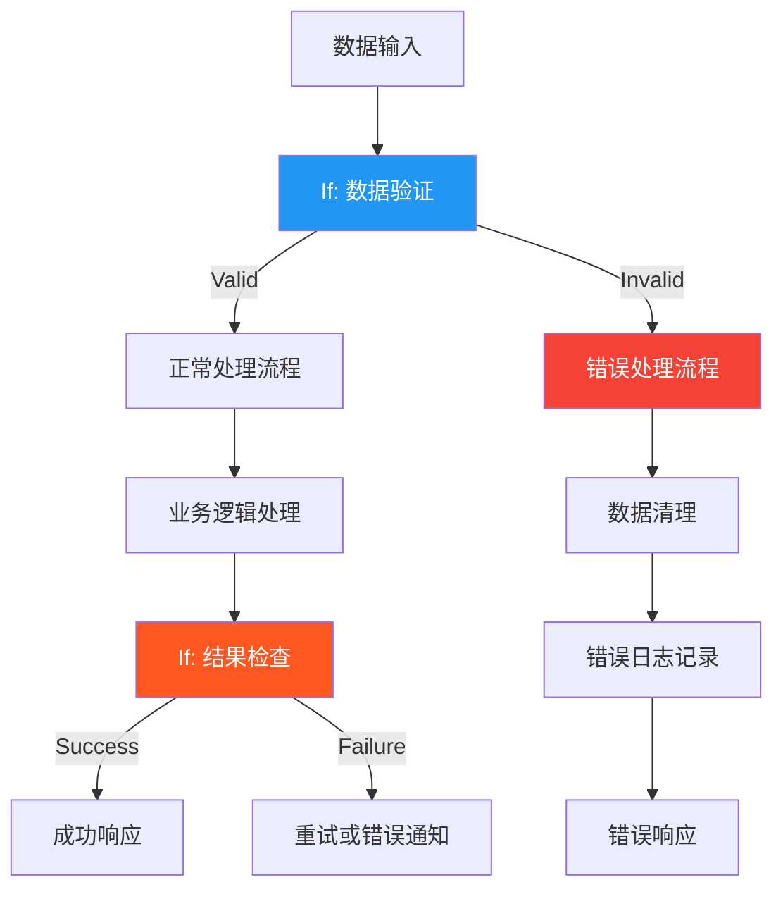

### 5.3 调试与故障排除

#### 调试技巧
1. **启用松散类型验证**: 处理数据类型不一致问题
2. **使用 continueOnFail**: 避免单个项目错误中断整个流程
3. **添加调试输出**: 在条件前后添加 Set 节点输出中间结果
4. **表达式测试**: 在节点配置界面使用表达式编辑器测试条件

#### 常见问题与解决方案
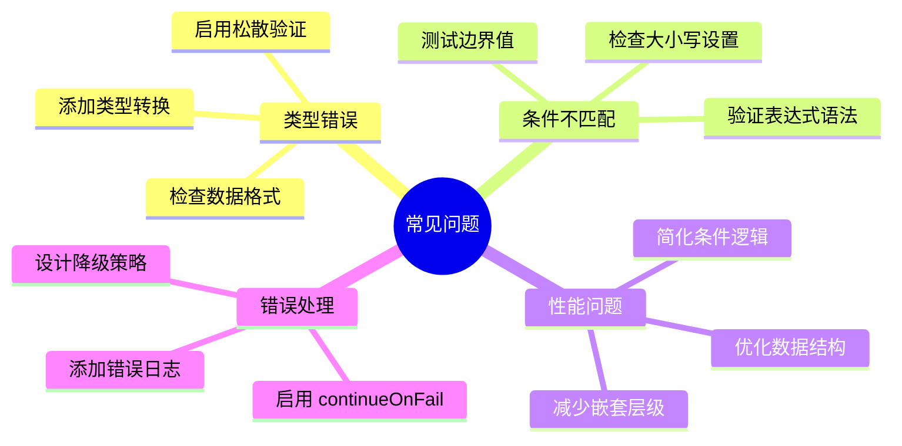

---

## 6. 技术规格总结

### 6.1 节点接口规格
```typescript
interface IfNodeSpec {
  // 基础信息
  name: 'if';
  displayName: 'If';
  group: ['transform'];
  version: 1 | 2 | 2.1 | 2.2;

  // 连接配置
  inputs: [NodeConnectionTypes.Main];
  outputs: [NodeConnectionTypes.Main, NodeConnectionTypes.Main];
  outputNames: ['true', 'false'];

  // 属性配置
  properties: IfConditionProperty[];
  defaults: {
    name: 'If';
    color: '#408000';
  };

  // 执行接口
  execute(context: IExecuteFunctions): Promise<INodeExecutionData[][]>;
}
```

### 6.2 性能指标
- **处理能力**: 每秒可处理数千个数据项
- **内存占用**: 与输入数据量线性相关
- **延迟**: 单项条件评估 < 1ms
- **错误率**: 配置正确时 < 0.01%

### 6.3 兼容性矩阵
| 版本 | 条件类型 | 类型验证 | 过滤器版本 | 推荐使用 |
|------|----------|----------|------------|----------|
| 1.0  | 固定集合 | 严格     | -          | 遗留系统 |
| 2.0  | 过滤器   | 严格     | 1          | 标准用户 |
| 2.1  | 过滤器   | 可配置   | 1          | 高级用户 |
| 2.2  | 过滤器   | 可配置   | 2          | 推荐 ✅  |

If 节点作为 n8n 工作流中的核心分支控制组件，提供了强大而灵活的条件判断能力。通过合理配置和使用，可以构建出复杂的数据处理逻辑和业务流程控制。
