# n8n Merge 节点深度解析

## 1. 节点架构与基础信息

### 1.1 节点基本信息
- **显示名称**: Merge
- **节点名称**: `merge`
- **图标**: 🔗 (file:merge.svg)
- **组别**: transform
- **当前版本**: 3.2 (默认版本)
- **源码路径**: `packages/nodes-base/nodes/Merge/`
- **子标题**: `={{$parameter["mode"]}}` (动态显示当前模式)

### 1.2 节点描述
Merge 节点是 n8n 中的数据合并节点，用于将来自多个输入流的数据合并为单一输出。它支持多种合并策略，从简单的数据追加到复杂的基于字段匹配的合并操作，是工作流中处理多源数据集成的核心组件。

### 1.3 版本历史与演进
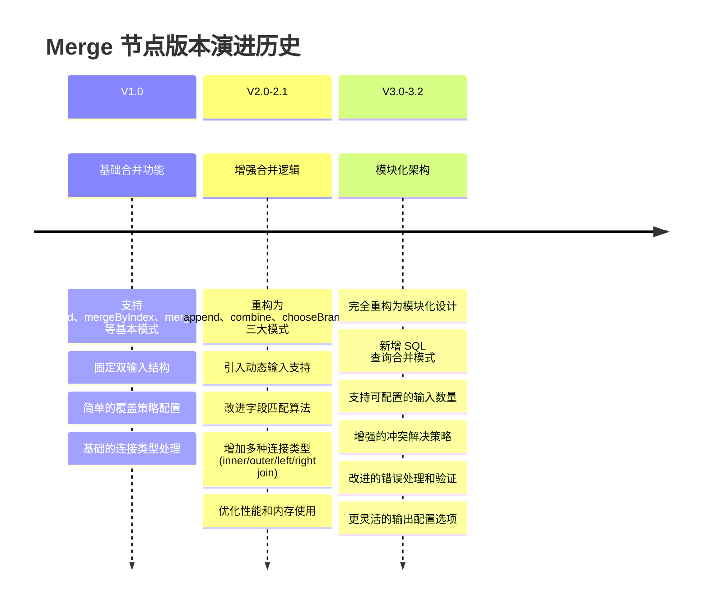
```mermaid
timeline
    title Merge 节点版本演进历史
    section V1.0
        基础合并功能 : 支持 append、mergeByIndex、mergeByKey 等基本模式
        : 固定双输入结构
        : 简单的覆盖策略配置
        : 基础的连接类型处理
    section V2.0-2.1
        增强合并逻辑 : 重构为 append、combine、chooseBranch 三大模式
        : 引入动态输入支持
        : 改进字段匹配算法
        : 增加多种连接类型 (inner/outer/left/right join)
        : 优化性能和内存使用
    section V3.0-3.2
        模块化架构 : 完全重构为模块化设计
        : 新增 SQL 查询合并模式
        : 支持可配置的输入数量
        : 增强的冲突解决策略
        : 改进的错误处理和验证
        : 更灵活的输出配置选项
```

### 1.4 连接类型与拓扑结构
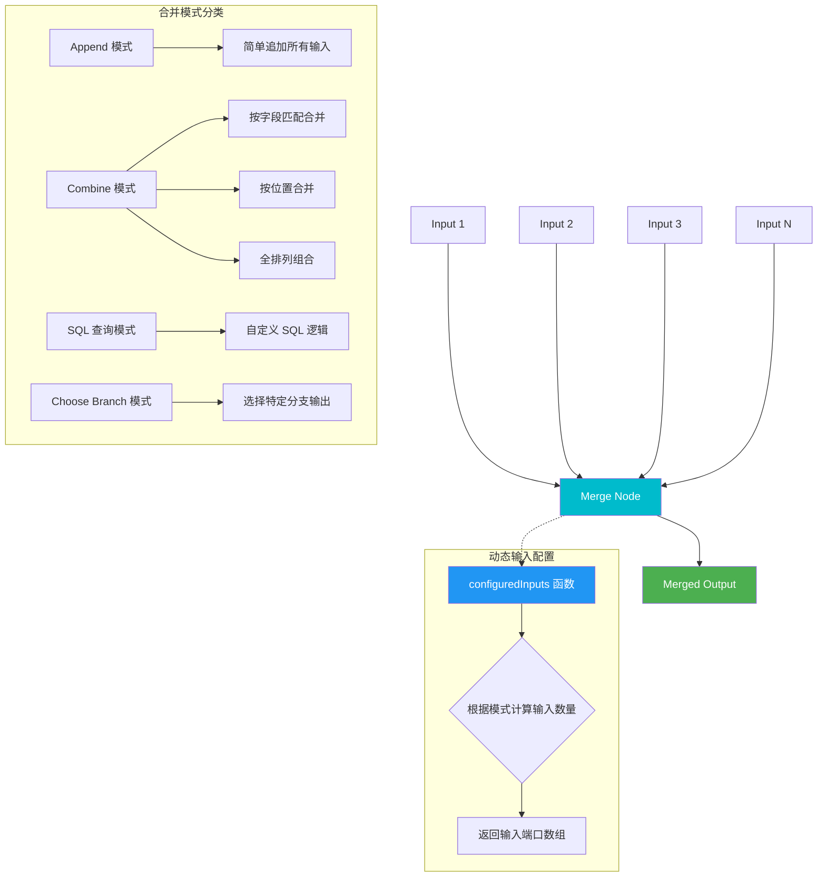
```mermaid
graph TD
    A[Input 1] --> E[Merge Node]
    B[Input 2] --> E
    C[Input 3] --> E
    D[Input N] --> E
    E --> F[Merged Output]

    subgraph "动态输入配置"
        G[configuredInputs 函数]
        G --> H{根据模式计算输入数量}
        H --> I[返回输入端口数组]
    end

    subgraph "合并模式分类"
        J[Append 模式] --> J1[简单追加所有输入]
        K[Combine 模式] --> K1[按字段匹配合并]
        K[Combine 模式] --> K2[按位置合并]
        K[Combine 模式] --> K3[全排列组合]
        L[SQL 查询模式] --> L1[自定义 SQL 逻辑]
        M[Choose Branch 模式] --> M1[选择特定分支输出]
    end

    E -.-> G

    style E fill:#00bbcc,color:#fff
    style F fill:#4CAF50,color:#fff
    style G fill:#2196F3,color:#fff
```

---

## 2. 节点属性配置详解

### 2.1 核心模式配置
```typescript
// 主要模式选择配置
{
  displayName: 'Mode',
  name: 'mode',
  type: 'options',
  options: [
    {
      name: 'Append',
      value: 'append',
      description: 'Output items of each input, one after the other'
    },
    {
      name: 'Combine',
      value: 'combine',
      description: 'Merge matching items together'
    },
    {
      name: 'SQL Query',
      value: 'combineBySql',
      description: 'Write a query to do the merge'
    },
    {
      name: 'Choose Branch',
      value: 'chooseBranch',
      description: 'Output data from a specific branch, without modifying it'
    }
  ],
  default: 'append'
}
```

### 2.2 合并模式分类与配置流程
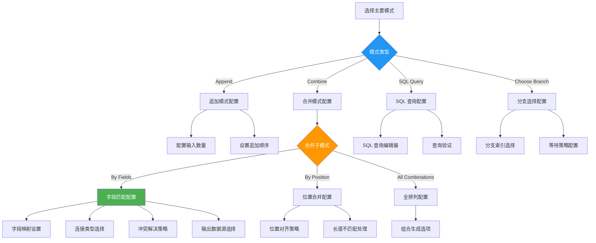
```mermaid
flowchart TD
    A[选择主要模式] --> B{模式类型}
    B -->|Append| C[追加模式配置]
    B -->|Combine| D[合并模式配置]
    B -->|SQL Query| E[SQL 查询配置]
    B -->|Choose Branch| F[分支选择配置]

    C --> C1[配置输入数量]
    C --> C2[设置追加顺序]

    D --> D1{合并子模式}
    D1 -->|By Fields| G[字段匹配配置]
    D1 -->|By Position| H[位置合并配置]
    D1 -->|All Combinations| I[全排列配置]

    G --> G1[字段映射设置]
    G --> G2[连接类型选择]
    G --> G3[冲突解决策略]
    G --> G4[输出数据源选择]

    H --> H1[位置对齐策略]
    H --> H2[长度不匹配处理]

    I --> I1[组合生成选项]

    E --> E1[SQL 查询编辑器]
    E --> E2[查询验证]

    F --> F1[分支索引选择]
    F --> F2[等待策略配置]

    style B fill:#2196F3,color:#fff
    style D1 fill:#FF9800,color:#fff
    style G fill:#4CAF50,color:#fff
```

### 2.3 动态输入系统
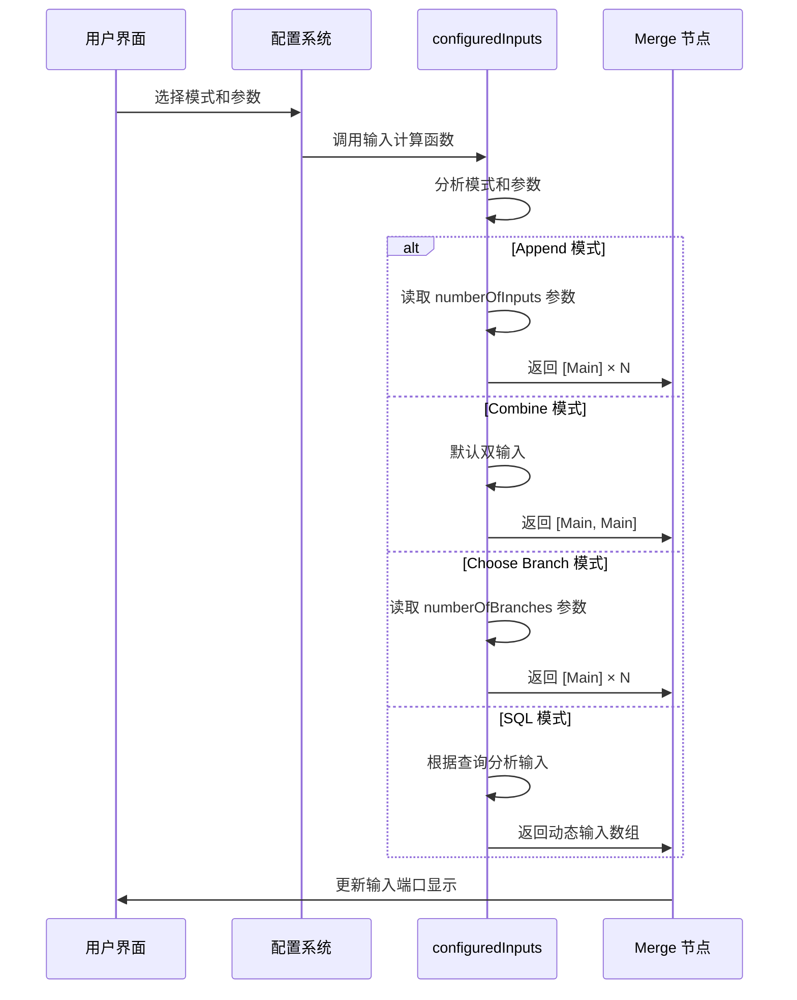
```mermaid
sequenceDiagram
    participant UI as 用户界面
    participant Config as 配置系统
    participant Utils as configuredInputs
    participant Node as Merge 节点

    UI->>Config: 选择模式和参数
    Config->>Utils: 调用输入计算函数
    Utils->>Utils: 分析模式和参数

    alt Append 模式
        Utils->>Utils: 读取 numberOfInputs 参数
        Utils->>Node: 返回 [Main] × N
    else Combine 模式
        Utils->>Utils: 默认双输入
        Utils->>Node: 返回 [Main, Main]
    else Choose Branch 模式
        Utils->>Utils: 读取 numberOfBranches 参数
        Utils->>Node: 返回 [Main] × N
    else SQL 模式
        Utils->>Utils: 根据查询分析输入
        Utils->>Node: 返回动态输入数组
    end

    Node->>UI: 更新输入端口显示
```

---

## 3. 合并模式详细解析

### 3.1 Append 模式 - 数据追加
```mermaid
flowchart LR
    A[Input 1: [a,b,c]] --> D[Merge Append]
    B[Input 2: [d,e]] --> D
    C[Input 3: [f,g,h]] --> D
    D --> E[Output: [a,b,c,d,e,f,g,h]]

    subgraph "执行逻辑"
        F[遍历所有输入]
        F --> G[按顺序追加到结果数组]
        G --> H[保持原始数据结构]
    end

    style D fill:#4CAF50,color:#fff
    style E fill:#2196F3,color:#fff
```

**Append 模式特点:**
- 最简单的合并方式
- 保持数据的原始顺序
- 不进行任何数据转换
- 性能最优，内存开销最小

### 3.2 Combine by Fields 模式 - 字段匹配合并
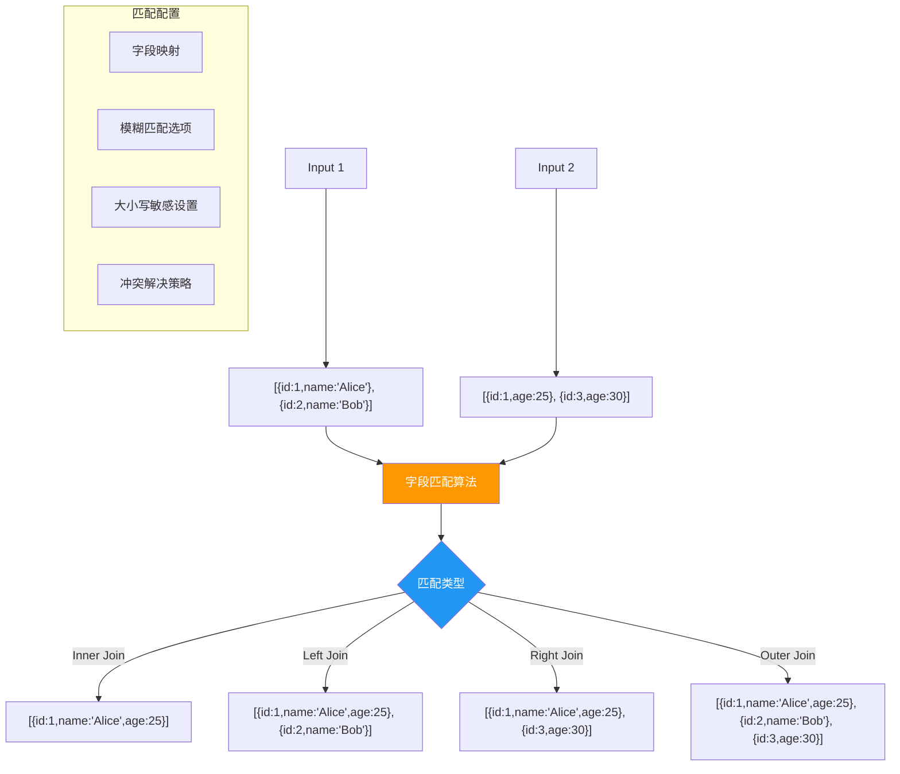
```mermaid
flowchart TD
    A[Input 1] --> A1["[{id:1,name:'Alice'}, {id:2,name:'Bob'}]"]
    B[Input 2] --> B1["[{id:1,age:25}, {id:3,age:30}]"]

    A1 --> C[字段匹配算法]
    B1 --> C

    C --> D{匹配类型}
    D -->|Inner Join| E["[{id:1,name:'Alice',age:25}]"]
    D -->|Left Join| F["[{id:1,name:'Alice',age:25}, {id:2,name:'Bob'}]"]
    D -->|Right Join| G["[{id:1,name:'Alice',age:25}, {id:3,age:30}]"]
    D -->|Outer Join| H["[{id:1,name:'Alice',age:25}, {id:2,name:'Bob'}, {id:3,age:30}]"]

    subgraph "匹配配置"
        I[字段映射]
        J[模糊匹配选项]
        K[大小写敏感设置]
        L[冲突解决策略]
    end

    style C fill:#FF9800,color:#fff
    style D fill:#2196F3,color:#fff
```

**字段匹配合并配置:**
```typescript
// 字段匹配配置示例
{
  mode: 'combine',
  combineBy: 'combineByFields',
  fieldsToMatchString: 'id, email',  // 简单字段匹配
  // 或使用高级配置
  mergeByFields: {
    values: [
      { field1: 'userId', field2: 'id' },
      { field1: 'email', field2: 'emailAddress' }
    ]
  },
  joinMode: 'keepMatches',  // inner join
  outputDataFrom: 'both',
  options: {
    fuzzyCompare: false,
    disableDotNotation: false,
    includeUnpaired: false
  }
}
```

### 3.3 Combine by Position 模式 - 位置合并
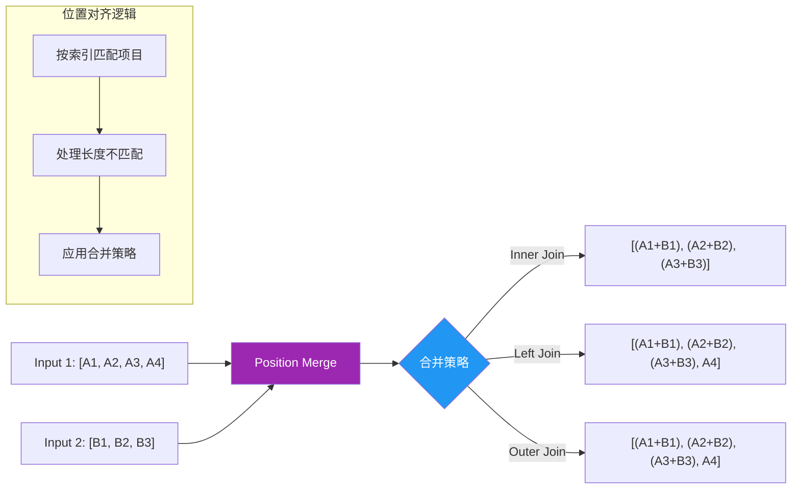
```mermaid
flowchart LR
    A["Input 1: [A1, A2, A3, A4]"] --> C[Position Merge]
    B["Input 2: [B1, B2, B3]"] --> C

    C --> D{合并策略}
    D -->|Inner Join| E["[(A1+B1), (A2+B2), (A3+B3)]"]
    D -->|Left Join| F["[(A1+B1), (A2+B2), (A3+B3), A4]"]
    D -->|Outer Join| G["[(A1+B1), (A2+B2), (A3+B3), A4]"]

    subgraph "位置对齐逻辑"
        H[按索引匹配项目]
        H --> I[处理长度不匹配]
        I --> J[应用合并策略]
    end

    style C fill:#9C27B0,color:#fff
    style D fill:#2196F3,color:#fff
```

### 3.4 SQL Query 模式 - 自定义查询合并
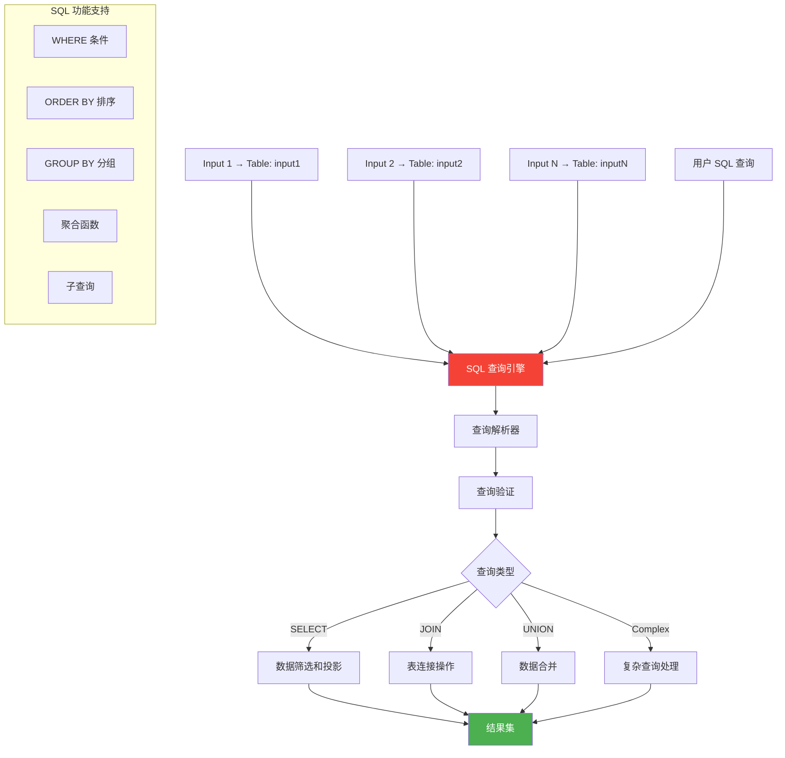
```mermaid
flowchart TD
    A[Input 1 → Table: input1] --> E[SQL 查询引擎]
    B[Input 2 → Table: input2] --> E
    C[Input N → Table: inputN] --> E

    D[用户 SQL 查询] --> E

    E --> F[查询解析器]
    F --> G[查询验证]
    G --> H{查询类型}

    H -->|SELECT| I[数据筛选和投影]
    H -->|JOIN| J[表连接操作]
    H -->|UNION| K[数据合并]
    H -->|Complex| L[复杂查询处理]

    I --> M[结果集]
    J --> M
    K --> M
    L --> M

    subgraph "SQL 功能支持"
        N[WHERE 条件]
        O[ORDER BY 排序]
        P[GROUP BY 分组]
        Q[聚合函数]
        R[子查询]
    end

    style E fill:#f44336,color:#fff
    style M fill:#4CAF50,color:#fff
```

**SQL 查询示例:**
```sql
-- 基础连接查询
SELECT
  i1.name,
  i1.email,
  i2.department,
  i2.salary
FROM input1 i1
INNER JOIN input2 i2 ON i1.id = i2.employee_id

-- 聚合查询
SELECT
  department,
  COUNT(*) as employee_count,
  AVG(salary) as avg_salary
FROM input1
GROUP BY department
ORDER BY avg_salary DESC

-- 复杂条件查询
SELECT
  i1.*,
  i2.status
FROM input1 i1
LEFT JOIN input2 i2 ON i1.id = i2.id
WHERE i1.created_date >= '2024-01-01'
  AND (i2.status IS NULL OR i2.status = 'active')
```

### 3.5 Choose Branch 模式 - 分支选择
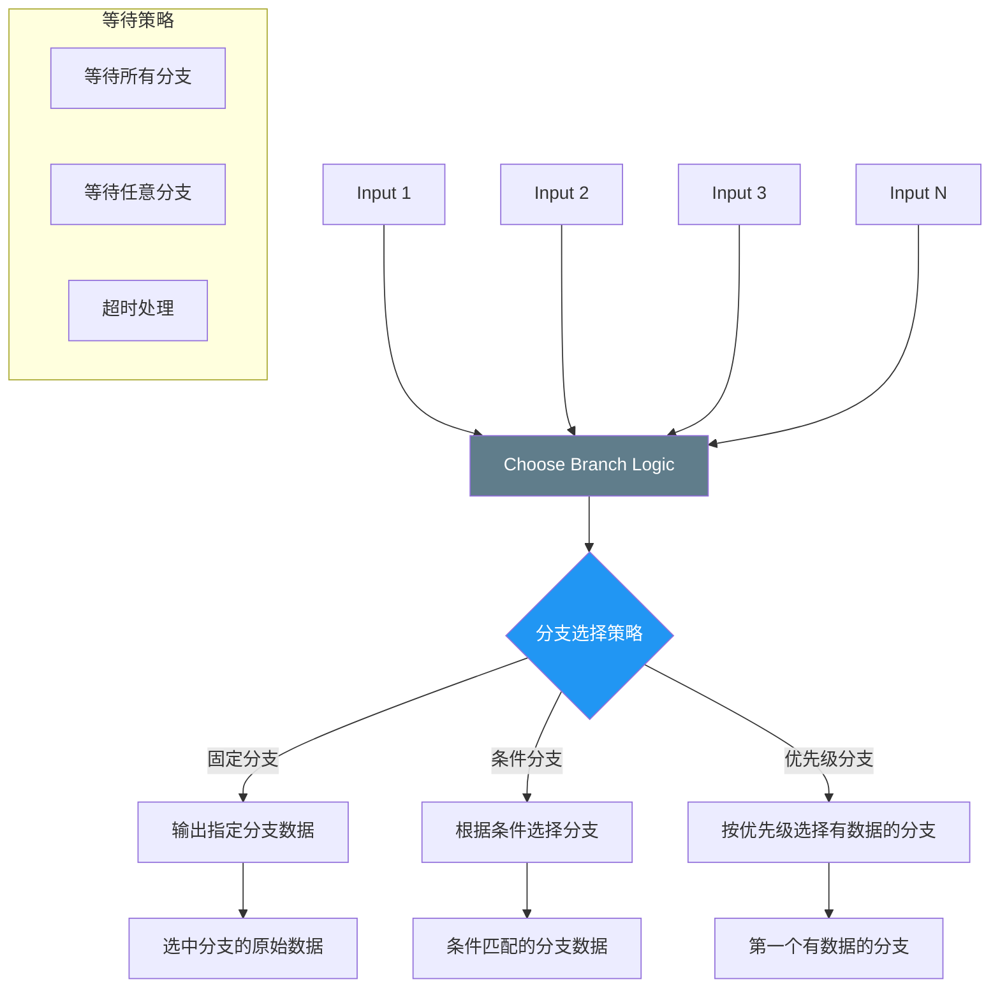
```mermaid
flowchart TD
    A[Input 1] --> E[Choose Branch Logic]
    B[Input 2] --> E
    C[Input 3] --> E
    D[Input N] --> E

    E --> F{分支选择策略}
    F -->|固定分支| G[输出指定分支数据]
    F -->|条件分支| H[根据条件选择分支]
    F -->|优先级分支| I[按优先级选择有数据的分支]

    G --> J[选中分支的原始数据]
    H --> K[条件匹配的分支数据]
    I --> L[第一个有数据的分支]

    subgraph "等待策略"
        M[等待所有分支]
        N[等待任意分支]
        O[超时处理]
    end

    style E fill:#607D8B,color:#fff
    style F fill:#2196F3,color:#fff
```

---

## 4. 执行引擎与合并算法

### 4.1 核心执行流程
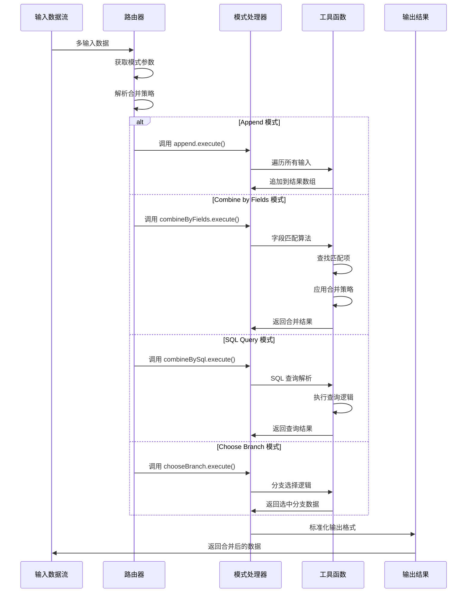
```mermaid
sequenceDiagram
    participant Input as 输入数据流
    participant Router as 路由器
    participant Mode as 模式处理器
    participant Utils as 工具函数
    participant Output as 输出结果

    Input->>Router: 多输入数据
    Router->>Router: 获取模式参数
    Router->>Router: 解析合并策略

    alt Append 模式
        Router->>Mode: 调用 append.execute()
        Mode->>Utils: 遍历所有输入
        Utils->>Mode: 追加到结果数组
    else Combine by Fields 模式
        Router->>Mode: 调用 combineByFields.execute()
        Mode->>Utils: 字段匹配算法
        Utils->>Utils: 查找匹配项
        Utils->>Utils: 应用合并策略
        Utils->>Mode: 返回合并结果
    else SQL Query 模式
        Router->>Mode: 调用 combineBySql.execute()
        Mode->>Utils: SQL 查询解析
        Utils->>Utils: 执行查询逻辑
        Utils->>Mode: 返回查询结果
    else Choose Branch 模式
        Router->>Mode: 调用 chooseBranch.execute()
        Mode->>Utils: 分支选择逻辑
        Utils->>Mode: 返回选中分支数据
    end

    Mode->>Output: 标准化输出格式
    Output->>Input: 返回合并后的数据
```

### 4.2 字段匹配算法详解
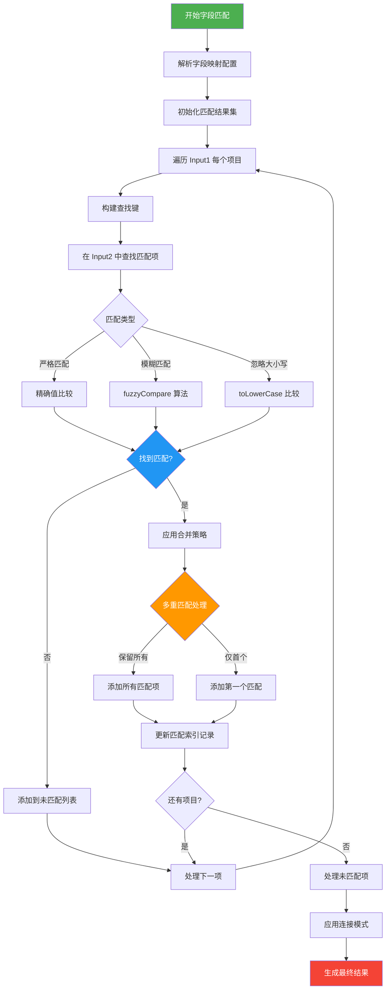
```mermaid
flowchart TD
    A[开始字段匹配] --> B[解析字段映射配置]
    B --> C[初始化匹配结果集]

    C --> D[遍历 Input1 每个项目]
    D --> E[构建查找键]
    E --> F[在 Input2 中查找匹配项]

    F --> G{匹配类型}
    G -->|严格匹配| H[精确值比较]
    G -->|模糊匹配| I[fuzzyCompare 算法]
    G -->|忽略大小写| J[toLowerCase 比较]

    H --> K{找到匹配?}
    I --> K
    J --> K

    K -->|是| L[应用合并策略]
    K -->|否| M[添加到未匹配列表]

    L --> N{多重匹配处理}
    N -->|保留所有| O[添加所有匹配项]
    N -->|仅首个| P[添加第一个匹配]

    O --> Q[更新匹配索引记录]
    P --> Q
    M --> R[处理下一项]

    Q --> S{还有项目?}
    S -->|是| R
    S -->|否| T[处理未匹配项]
    R --> D

    T --> U[应用连接模式]
    U --> V[生成最终结果]

    style A fill:#4CAF50,color:#fff
    style K fill:#2196F3,color:#fff
    style N fill:#FF9800,color:#fff
    style V fill:#f44336,color:#fff
```

### 4.3 冲突解决策略
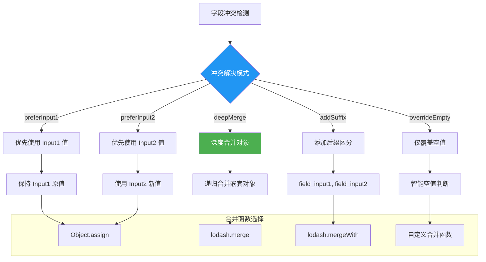
```mermaid
graph TD
    A[字段冲突检测] --> B{冲突解决模式}
    B -->|preferInput1| C[优先使用 Input1 值]
    B -->|preferInput2| D[优先使用 Input2 值]
    B -->|addSuffix| E[添加后缀区分]
    B -->|deepMerge| F[深度合并对象]
    B -->|overrideEmpty| G[仅覆盖空值]

    C --> H[保持 Input1 原值]
    D --> I[使用 Input2 新值]
    E --> J[field_input1, field_input2]
    F --> K[递归合并嵌套对象]
    G --> L[智能空值判断]

    subgraph "合并函数选择"
        M[Object.assign]
        N[lodash.merge]
        O[lodash.mergeWith]
        P[自定义合并函数]
    end

    H --> M
    I --> M
    J --> O
    K --> N
    L --> P

    style B fill:#2196F3,color:#fff
    style F fill:#4CAF50,color:#fff
```

---

## 5. 高级功能与配置选项

### 5.1 性能优化策略
```mermaid
flowchart LR
    A[输入数据] --> B[数据预处理]
    B --> C[索引构建]
    C --> D[批量处理]
    D --> E[内存管理]
    E --> F[输出优化]

    subgraph "优化技术"
        G[字段索引缓存]
        H[惰性求值]
        I[流式处理]
        J[内存池复用]
        K[并行匹配]
    end

    C -.-> G
    D -.-> H
    B -.-> I
    E -.-> J
    D -.-> K

    subgraph "性能指标"
        L[处理速度: O(n+m)]
        M[内存占用: 线性增长]
        N[并发支持: 是]
        O[大数据集: 支持]
    end

    style D fill:#4CAF50,color:#fff
    style F fill:#2196F3,color:#fff
```

### 5.2 错误处理与容错机制
```typescript
// 错误处理示例
try {
  // 字段匹配执行
  const matches = findMatches(input1, input2, fieldsToMatch, options);
} catch (error) {
  if (error instanceof ValidationError) {
    // 配置验证错误
    throw new NodeOperationError(this.getNode(),
      `Invalid field configuration: ${error.message}`, { itemIndex });
  } else if (error instanceof DataMismatchError) {
    // 数据类型不匹配错误
    if (options.continueOnFail) {
      return handlePartialResults(partialMatches);
    }
  }
  // 其他未知错误
  throw new NodeOperationError(this.getNode(), error, { itemIndex });
}
```

### 5.3 配置验证系统
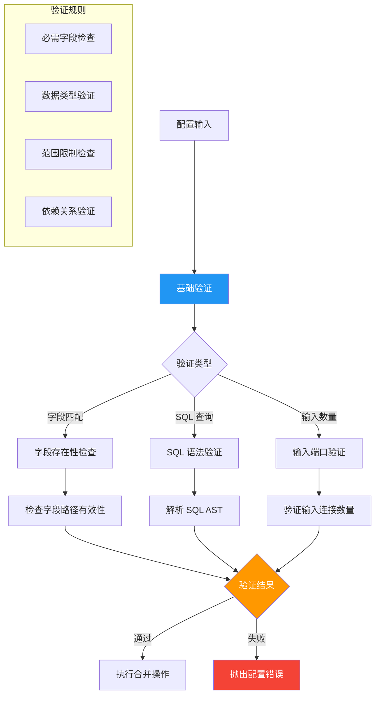
```mermaid
flowchart TD
    A[配置输入] --> B[基础验证]
    B --> C{验证类型}

    C -->|字段匹配| D[字段存在性检查]
    C -->|SQL 查询| E[SQL 语法验证]
    C -->|输入数量| F[输入端口验证]

    D --> G[检查字段路径有效性]
    E --> H[解析 SQL AST]
    F --> I[验证输入连接数量]

    G --> J{验证结果}
    H --> J
    I --> J

    J -->|通过| K[执行合并操作]
    J -->|失败| L[抛出配置错误]

    subgraph "验证规则"
        M[必需字段检查]
        N[数据类型验证]
        O[范围限制检查]
        P[依赖关系验证]
    end

    style B fill:#2196F3,color:#fff
    style J fill:#FF9800,color:#fff
    style L fill:#f44336,color:#fff
```

---

## 6. 使用示例与最佳实践

### 6.1 常见使用场景

#### 场景1: 用户数据enrichment
```javascript
// 合并用户基础信息和详细信息
{
  "mode": "combine",
  "combineBy": "combineByFields",
  "fieldsToMatchString": "userId",
  "joinMode": "enrichInput1",
  "outputDataFrom": "both",
  "options": {
    "fuzzyCompare": false,
    "multipleMatches": "first"
  }
}

// Input 1: 用户基础信息
[
  { "userId": 1, "name": "Alice", "email": "alice@company.com" },
  { "userId": 2, "name": "Bob", "email": "bob@company.com" }
]

// Input 2: 用户详细信息
[
  { "userId": 1, "department": "Engineering", "salary": 95000 },
  { "userId": 2, "department": "Marketing", "salary": 75000 }
]

// Output: 合并后的完整用户信息
[
  {
    "userId": 1,
    "name": "Alice",
    "email": "alice@company.com",
    "department": "Engineering",
    "salary": 95000
  },
  {
    "userId": 2,
    "name": "Bob",
    "email": "bob@company.com",
    "department": "Marketing",
    "salary": 75000
  }
]
```

#### 场景2: 销售数据分析
```sql
-- SQL 查询模式示例
SELECT
  o.order_id,
  o.customer_id,
  o.order_date,
  o.total_amount,
  c.customer_name,
  c.region,
  p.product_name,
  p.category
FROM input1 o  -- 订单数据
INNER JOIN input2 c ON o.customer_id = c.customer_id  -- 客户数据
INNER JOIN input3 p ON o.product_id = p.product_id    -- 产品数据
WHERE o.order_date >= '2024-01-01'
  AND o.total_amount > 100
ORDER BY o.order_date DESC
```

#### 场景3: 数据流合并
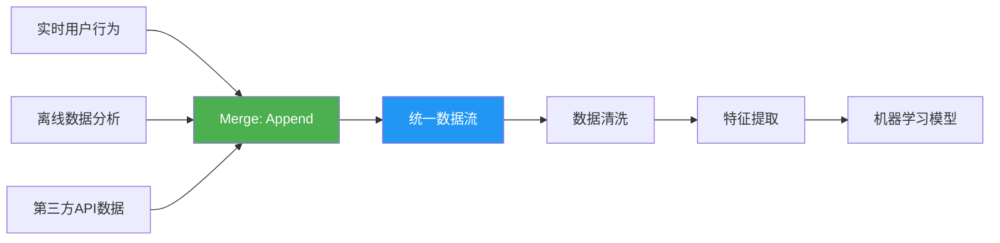
```mermaid
flowchart LR
    A[实时用户行为] --> D[Merge: Append]
    B[离线数据分析] --> D
    C[第三方API数据] --> D
    D --> E[统一数据流]

    E --> F[数据清洗]
    F --> G[特征提取]
    G --> H[机器学习模型]

    style D fill:#4CAF50,color:#fff
    style E fill:#2196F3,color:#fff
```

### 6.2 工作流设计模式

#### 数据enrichment模式
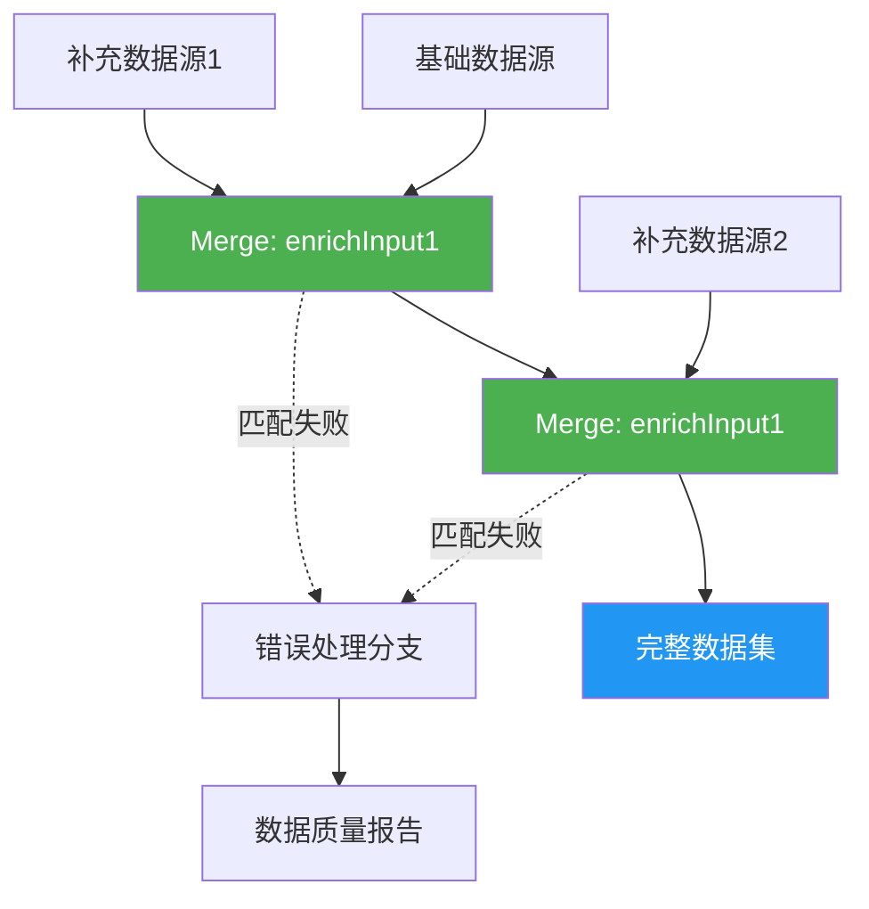
```mermaid
flowchart TD
    A[基础数据源] --> B[Merge: enrichInput1]
    C[补充数据源1] --> B
    D[补充数据源2] --> E[Merge: enrichInput1]
    B --> E
    E --> F[完整数据集]

    G[错误处理分支]
    B -.->|匹配失败| G
    E -.->|匹配失败| G
    G --> H[数据质量报告]

    style B fill:#4CAF50,color:#fff
    style E fill:#4CAF50,color:#fff
    style F fill:#2196F3,color:#fff
```

#### 数据聚合模式
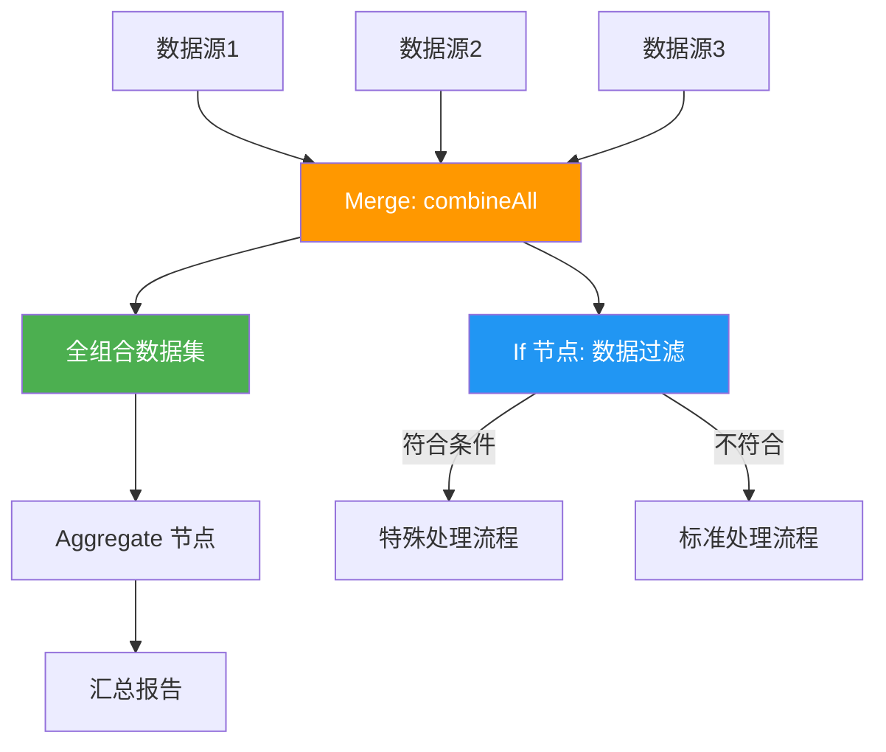
```mermaid
flowchart TD
    A[数据源1] --> D[Merge: combineAll]
    B[数据源2] --> D
    C[数据源3] --> D

    D --> E[全组合数据集]
    E --> F[Aggregate 节点]
    F --> G[汇总报告]

    D --> H[If 节点: 数据过滤]
    H -->|符合条件| I[特殊处理流程]
    H -->|不符合| J[标准处理流程]

    style D fill:#FF9800,color:#fff
    style E fill:#4CAF50,color:#fff
    style H fill:#2196F3,color:#fff
```

### 6.3 调试与故障排除

#### 调试技巧
1. **启用详细日志**: 在合并前后添加 Set 节点输出中间结果
2. **分步验证**: 使用 If 节点验证匹配字段的数据完整性
3. **性能监控**: 监控大数据集合并的内存和时间消耗
4. **结果验证**: 比较期望输出与实际输出的差异

#### 常见问题解决方案
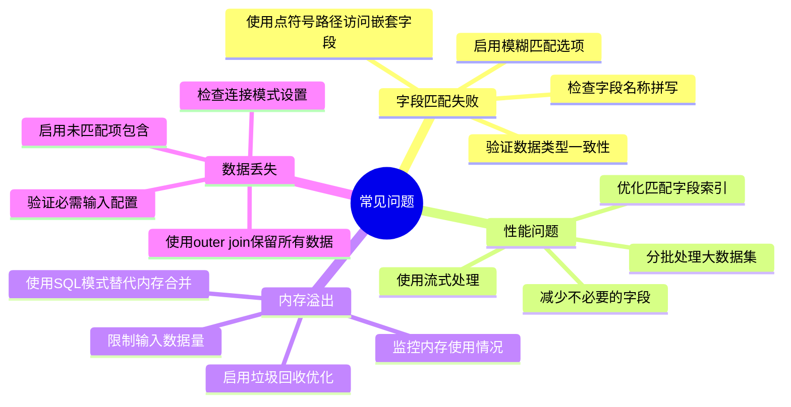
```mermaid
mindmap
  root((常见问题))
    字段匹配失败
      检查字段名称拼写
      验证数据类型一致性
      启用模糊匹配选项
      使用点符号路径访问嵌套字段
    性能问题
      减少不必要的字段
      优化匹配字段索引
      使用流式处理
      分批处理大数据集
    内存溢出
      限制输入数据量
      使用SQL模式替代内存合并
      启用垃圾回收优化
      监控内存使用情况
    数据丢失
      检查连接模式设置
      验证必需输入配置
      启用未匹配项包含
      使用outer join保留所有数据
```

---

## 7. 技术规格总结

### 7.1 节点接口规格
```typescript
interface MergeNodeSpec {
  // 基础信息
  name: 'merge';
  displayName: 'Merge';
  group: ['transform'];
  version: 1 | 2 | 2.1 | 3 | 3.1 | 3.2;

  // 动态输入配置
  inputs: string; // 表达式: configuredInputs($parameter)
  outputs: [NodeConnectionTypes.Main];
  requiredInputs: string; // 动态必需输入表达式

  // 属性配置
  properties: MergePropertyDescription[];

  // 方法
  methods: {
    loadOptions: LoadOptionsFunctions;
  };

  // 执行接口
  execute(context: IExecuteFunctions): Promise<INodeExecutionData[][]>;
}
```

### 7.2 合并模式能力矩阵
| 模式 | 输入数量 | 匹配策略 | 性能 | 复杂度 | 适用场景 |
|------|----------|----------|------|--------|----------|
| Append | 动态 | 无 | 🟢 高 | 🟢 低 | 数据收集、流合并 |
| Combine by Fields | 2+ | 字段匹配 | 🟡 中 | 🟡 中 | 数据关联、enrichment |
| Combine by Position | 2+ | 位置索引 | 🟢 高 | 🟢 低 | 结构化数据对齐 |
| Combine All | 2+ | 全排列 | 🔴 低 | 🔴 高 | 数据分析、特征组合 |
| SQL Query | 动态 | 自定义 | 🟡 中 | 🟡 中 | 复杂查询、报表生成 |
| Choose Branch | 动态 | 条件选择 | 🟢 高 | 🟢 低 | 路由控制、容错处理 |

### 7.3 性能指标
- **处理能力**: 每秒可处理数万个数据项 (依模式而定)
- **内存占用**: O(n+m) 到 O(n×m) (依合并策略而定)
- **延迟**: 单项合并 < 10ms (简单模式)
- **并发支持**: 支持多输入并行处理
- **可扩展性**: 支持动态输入数量配置

### 7.4 兼容性与迁移指南
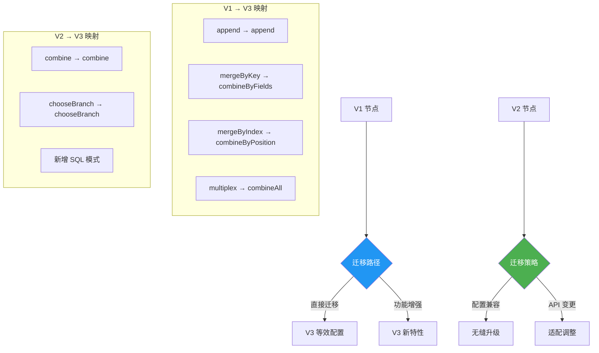
```mermaid
flowchart TD
    A[V1 节点] --> B{迁移路径}
    B -->|直接迁移| C[V3 等效配置]
    B -->|功能增强| D[V3 新特性]

    E[V2 节点] --> F{迁移策略}
    F -->|配置兼容| G[无缝升级]
    F -->|API 变更| H[适配调整]

    subgraph "V1 → V3 映射"
        I[append → append]
        J[mergeByKey → combineByFields]
        K[mergeByIndex → combineByPosition]
        L[multiplex → combineAll]
    end

    subgraph "V2 → V3 映射"
        M[combine → combine]
        N[chooseBranch → chooseBranch]
        O[新增 SQL 模式]
    end

    style B fill:#2196F3,color:#fff
    style F fill:#4CAF50,color:#fff
```

Merge 节点作为 n8n 工作流中的核心数据集成组件，提供了从简单数据追加到复杂关系查询的全方位合并能力。通过灵活的模式配置和强大的算法支持，它能够满足各种数据处理场景的需求，是构建复杂数据处理工作流的重要基础设施。
