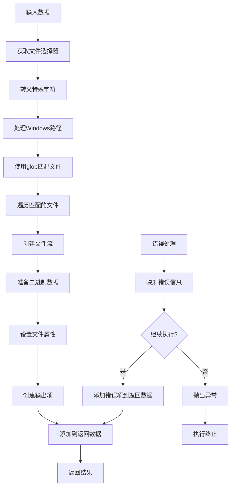
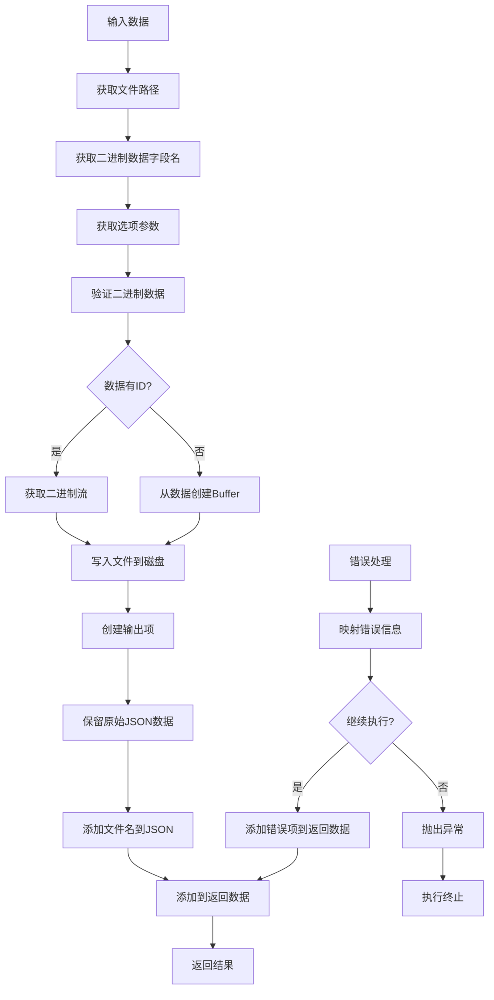

# Read/Write Files from Disk Node 技术实现分析

## 概述

Read/Write Files from Disk Node 是 n8n 中的一个核心文件操作节点，允许用户在运行 n8n 的计算机上读取和写入文件。本文档分析了该节点的技术架构、实现方式以及数据流转过程。

## 1. 技术架构概述

### 1.1 节点基本信息

- **节点名称**: ReadWriteFile
- **显示名称**: Read/Write Files from Disk
- **版本**: 1
- **组别**: input
- **输入/输出**: Main 连接类型

### 1.2 核心组件

节点由以下核心组件构成：

- **ReadWriteFile**: 主节点类，负责协调读写操作
- **read.operation**: 读操作实现
- **write.operation**: 写操作实现
- **utils**: 辅助工具函数

### 1.3 操作模式

节点支持两种主要操作模式：

1. **Read File(s) From Disk**: 从磁盘读取一个或多个文件
2. **Write File to Disk**: 将文件写入磁盘

## 2. 读操作实现分析

### 2.1 读操作数据流转图



### 2.2 读操作实现细节

读操作的核心实现在 `read.operation.ts` 文件中：

```typescript
export async function execute(this: IExecuteFunctions, items: INodeExecutionData[]) {
  const returnData: INodeExecutionData[] = [];
  let fileSelector;

  for (let itemIndex = 0; itemIndex < items.length; itemIndex++) {
    try {
      // 获取文件选择器参数
      fileSelector = String(this.getNodeParameter('fileSelector', itemIndex));

      // 转义特殊字符
      fileSelector = escapeSpecialCharacters(fileSelector);

      // 处理Windows路径
      if (/^[a-zA-Z]:/.test(fileSelector)) {
        fileSelector = fileSelector.replace(/\\\\/g, '/');
      }

      // 获取选项参数
      const options = this.getNodeParameter('options', itemIndex, {});

      // 使用glob匹配文件
      const files = await glob(fileSelector);

      // 处理每个匹配的文件
      const newItems: INodeExecutionData[] = [];
      for (const filePath of files) {
        // 创建文件流
        const stream = await this.helpers.createReadStream(filePath);
        // 准备二进制数据
        const binaryData = await this.helpers.prepareBinaryData(stream, filePath);

        // 设置文件属性
        if (options.fileName !== undefined) {
          binaryData.fileName = options.fileName as string;
        }

        // 创建输出项
        newItems.push({
          binary: {
            [dataPropertyName]: binaryData,
          },
          json: {
            mimeType: binaryData.mimeType,
            fileType: binaryData.fileType,
            fileName: binaryData.fileName,
            fileExtension: binaryData.fileExtension,
            fileSize: binaryData.fileSize,
          },
          pairedItem: {
            item: itemIndex,
          },
        });
      }
      returnData.push(...newItems);
    } catch (error) {
      // 错误处理
      const nodeOperatioinError = errorMapper.call(this, error, itemIndex, {
        filePath: fileSelector,
        operation: 'read',
      });
      if (this.continueOnFail()) {
        returnData.push({
          json: {
            error: nodeOperatioinError.message,
          },
          pairedItem: {
            item: itemIndex,
          },
        });
        continue;
      }
      throw new NodeApiError(this.getNode(), error as JsonObject, { itemIndex });
    }
  }

  return returnData;
}
```

### 2.3 关键功能点

1. **文件模式匹配**: 使用 `fast-glob` 库支持复杂的文件匹配模式
2. **路径处理**: 自动处理 Windows 和 Unix 风格的路径分隔符
3. **二进制数据处理**: 将文件内容转换为 n8n 的二进制数据格式
4. **错误处理**: 提供详细的错误映射和处理机制

## 3. 写操作实现分析

### 3.1 写操作数据流转图



### 3.2 写操作实现细节

写操作的核心实现在 `write.operation.ts` 文件中：

```typescript
export async function execute(this: IExecuteFunctions, items: INodeExecutionData[]) {
  const returnData: INodeExecutionData[] = [];
  let fileName;

  let item: INodeExecutionData;
  for (let itemIndex = 0; itemIndex < items.length; itemIndex++) {
    try {
      // 获取参数
      const dataPropertyName = this.getNodeParameter('dataPropertyName', itemIndex);
      fileName = this.getNodeParameter('fileName', itemIndex) as string;
      const options = this.getNodeParameter('options', itemIndex, {});
      const flag: string = options.append ? 'a' : 'w';

      item = items[itemIndex];

      // 创建输出项
      const newItem: INodeExecutionData = {
        json: {},
        pairedItem: {
          item: itemIndex,
        },
      };
      Object.assign(newItem.json, item.json);

      // 验证并获取二进制数据
      const binaryData = this.helpers.assertBinaryData(itemIndex, dataPropertyName);

      // 处理二进制数据
      let fileContent: Buffer | Readable;
      if (binaryData.id) {
        // 获取二进制流
        fileContent = await this.helpers.getBinaryStream(binaryData.id);
      } else {
        // 从数据创建Buffer
        fileContent = Buffer.from(binaryData.data, BINARY_ENCODING);
      }

      // 写入文件到磁盘
      await this.helpers.writeContentToFile(fileName, fileContent, flag);

      // 保留原始二进制数据引用
      if (item.binary !== undefined) {
        newItem.binary = {};
        Object.assign(newItem.binary, item.binary);
      }

      // 添加文件名到数据
      newItem.json.fileName = fileName;

      returnData.push(newItem);
    } catch (error) {
      // 错误处理
      const nodeOperatioinError = errorMapper.call(this, error, itemIndex, {
        filePath: fileName,
        operation: 'write',
      });
      if (this.continueOnFail()) {
        returnData.push({
          json: {
            error: nodeOperatioinError.message,
          },
          pairedItem: {
            item: itemIndex,
          },
        });
        continue;
      }
      throw new NodeApiError(this.getNode(), error as JsonObject, { itemIndex });
    }
  }

  return returnData;
}
```

### 3.3 关键功能点

1. **二进制数据处理**: 支持两种二进制数据格式（ID 引用和直接数据）
2. **文件写入模式**: 支持覆盖写入和追加写入两种模式
3. **数据保留**: 保留原始输入数据的 JSON 和二进制内容
4. **错误处理**: 提供详细的权限和路径错误处理

## 4. 辅助工具函数

### 4.1 错误映射器

错误映射器 (`errorMapper`) 提供了用户友好的错误信息：

```typescript
export function errorMapper(this: IExecuteFunctions, error: Error, itemIndex: number, context?: IDataObject) {
  let message;
  let description;

  if (typeof error.message === 'string') {
    if (error.message.includes('Cannot create a string longer than')) {
      message = 'The file is too large';
      description =
        'The binary file you are attempting to read exceeds 512MB, which is limit when using default binary data mode, try using the filesystem binary mode. More information <a href="https://docs.n8n.io/hosting/scaling/binary-data/" target="_blank">here</a>.';
    } else if (error.message.includes('EACCES') && context?.operation === 'read') {
      const path = ((error as unknown as IDataObject).path as string) || (context?.filePath as string);
      message = `You don't have the permissions to access ${path}`;
      description =
        "Verify that the path specified in 'File(s) Selector' is correct, or change the file(s) permissions if needed";
    } else if (error.message.includes('EACCES') && context?.operation === 'write') {
      const path = ((error as unknown as IDataObject).path as string) || (context?.filePath as string);
      message = `You don't have the permissions to write the file ${path}`;
      description =
        "Specify another destination folder in 'File Path and Name', or change the permissions of the parent folder";
    }
  }

  return new NodeOperationError(this.getNode(), error, { itemIndex, message, description });
}
```

### 4.2 特殊字符转义

特殊字符转义函数 (`escapeSpecialCharacters`) 处理文件路径中的特殊字符：

```typescript
export function escapeSpecialCharacters(str: string) {
  // Escape parentheses
  str = str.replace(/[()]/g, '\\$&');

  return str;
}
```

## 5. 主节点实现

主节点 (`ReadWriteFile`) 负责协调读写操作：

```typescript
export class ReadWriteFile implements INodeType {
  description: INodeTypeDescription = {
    displayName: 'Read/Write Files from Disk',
    name: 'readWriteFile',
    icon: 'file:readWriteFile.svg',
    group: ['input'],
    version: 1,
    description: 'Read or write files from the computer that runs n8n',
    defaults: {
      name: 'Read/Write Files from Disk',
    },
    inputs: [NodeConnectionTypes.Main],
    outputs: [NodeConnectionTypes.Main],
    properties: [
      // 属性定义...
    ],
  };

  async execute(this: IExecuteFunctions) {
    const operation = this.getNodeParameter('operation', 0, 'read');
    const items = this.getInputData();
    let returnData: INodeExecutionData[] = [];

    if (operation === 'read') {
      returnData = await read.execute.call(this, items);
    }

    if (operation === 'write') {
      returnData = await write.execute.call(this, items);
    }

    return [returnData];
  }
}
```

## 6. 总结

Read/Write Files from Disk Node 是一个功能强大的文件操作节点，具有以下特点：

1. **双模式操作**: 支持读取和写入两种操作模式
2. **灵活的文件匹配**: 使用 glob 模式支持复杂的文件选择
3. **二进制数据处理**: 完整支持 n8n 的二进制数据格式
4. **跨平台兼容**: 自动处理不同操作系统的路径差异
5. **错误处理**: 提供详细的错误映射和用户友好的错误信息
6. **数据保留**: 在操作过程中保留原始数据结构

该节点的设计体现了 n8n 节点开发的最佳实践，包括模块化设计、错误处理和数据流转管理。
