# n8n Set（Edit Fields）节点深度解析

## 1. 节点架构与基础信息

### 1.1 节点基本信息

- **显示名称**: Edit Fields (Set) - V3+ | Set - V1/V2
- **节点名称**: `set`
- **图标**: 🖊️ (fa:pen)
- **图标颜色**: 蓝色 (blue)
- **组别**: input
- **当前版本**: 3.4 (默认版本)
- **源码路径**: `packages/nodes-base/nodes/Set/`

### 1.2 节点描述

Set 节点是 n8n 中最常用的数据转换节点之一，用于修改、添加或删除数据项中的字段。它提供了灵活的数据操作功能，支持手动字段映射和 JSON 模式两种操作方式，是工作流数据处理的核心组件。

### 1.3 版本历史与演进

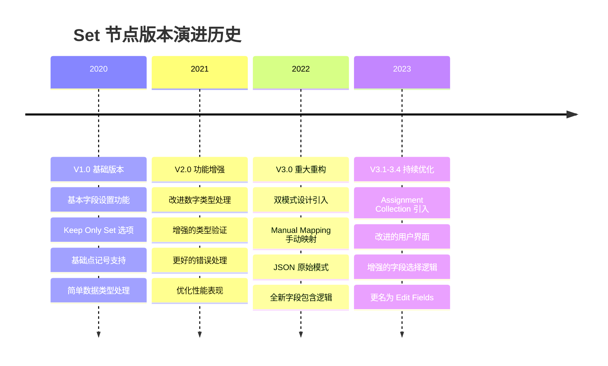
```mermaid
timeline
    title Set 节点版本演进历史

    2020    : V1.0 基础版本
            : 基本字段设置功能
            : Keep Only Set 选项
            : 基础点记号支持
            : 简单数据类型处理

    2021    : V2.0 功能增强
            : 改进数字类型处理
            : 增强的类型验证
            : 更好的错误处理
            : 优化性能表现

    2022    : V3.0 重大重构
            : 双模式设计引入
            : Manual Mapping 手动映射
            : JSON 原始模式
            : 全新字段包含逻辑

    2023    : V3.1-3.4 持续优化
            : Assignment Collection 引入
            : 改进的用户界面
            : 增强的字段选择逻辑
            : 更名为 Edit Fields
```

### 1.4 节点架构与数据流

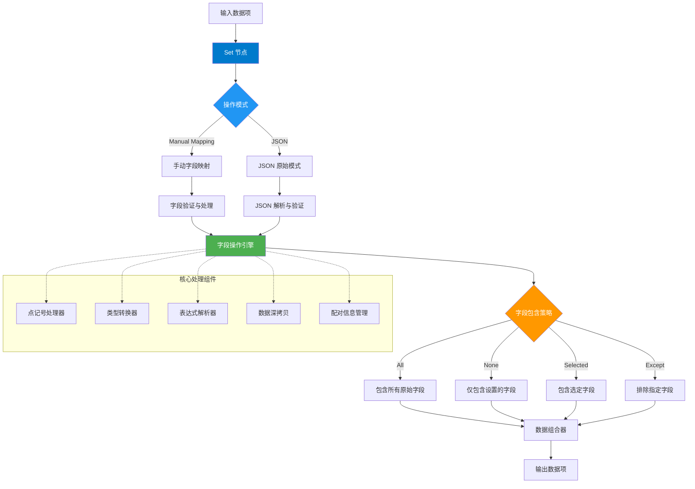
```mermaid
flowchart TD
    A[输入数据项] --> B[Set 节点]
    B --> C{操作模式}

    C -->|Manual Mapping| D[手动字段映射]
    C -->|JSON| E[JSON 原始模式]

    D --> F[字段验证与处理]
    E --> G[JSON 解析与验证]

    F --> H[字段操作引擎]
    G --> H

    H --> I{字段包含策略}
    I -->|All| J[包含所有原始字段]
    I -->|None| K[仅包含设置的字段]
    I -->|Selected| L[包含选定字段]
    I -->|Except| M[排除指定字段]

    J --> N[数据组合器]
    K --> N
    L --> N
    M --> N

    N --> O[输出数据项]

    subgraph "核心处理组件"
        P[点记号处理器]
        Q[类型转换器]
        R[表达式解析器]
        S[数据深拷贝]
        T[配对信息管理]
    end

    H -.-> P
    H -.-> Q
    H -.-> R
    H -.-> S
    H -.-> T

    style B fill:#007acc,color:#fff
    style C fill:#2196F3,color:#fff
    style H fill:#4CAF50,color:#fff
    style I fill:#FF9800,color:#fff
```

---

## 2. 节点属性配置详解

### 2.1 核心配置属性

#### 模式选择 (Mode)

```typescript
{
  displayName: 'Mode',
  name: 'mode',
  type: 'options',
  options: [
    {
      name: 'Manual Mapping',
      value: 'manual',
      description: 'Edit item fields one by one'
    },
    {
      name: 'JSON',
      value: 'raw',
      description: 'Customize item output with JSON'
    }
  ],
  default: 'manual'
}
```

#### 字段包含策略 (Include Options)

```typescript
// V3.3+ 版本
{
  displayName: 'Include Other Input Fields',
  name: 'includeOtherFields',
  type: 'boolean',
  default: false
}

// V3.0-3.2 版本
{
  displayName: 'Include in Output',
  name: 'include',
  type: 'options',
  options: [
    { name: 'All Input Fields', value: 'all' },
    { name: 'No Input Fields', value: 'none' },
    { name: 'Selected Input Fields', value: 'selected' },
    { name: 'All Input Fields Except', value: 'except' }
  ],
  default: 'all'
}
```

### 2.2 手动映射模式配置

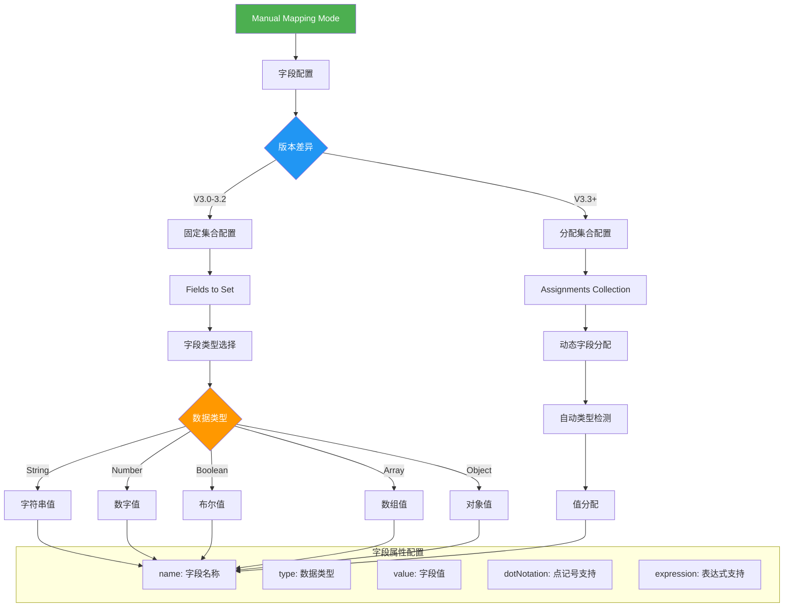
```mermaid
flowchart TD
    A[Manual Mapping Mode] --> B[字段配置]

    B --> C{版本差异}
    C -->|V3.0-3.2| D[固定集合配置]
    C -->|V3.3+| E[分配集合配置]

    D --> F[Fields to Set]
    F --> G[字段类型选择]

    E --> H[Assignments Collection]
    H --> I[动态字段分配]

    G --> J{数据类型}
    J -->|String| K[字符串值]
    J -->|Number| L[数字值]
    J -->|Boolean| M[布尔值]
    J -->|Array| N[数组值]
    J -->|Object| O[对象值]

    I --> P[自动类型检测]
    P --> Q[值分配]

    subgraph "字段属性配置"
        R[name: 字段名称]
        S[type: 数据类型]
        T[value: 字段值]
        U[dotNotation: 点记号支持]
        V[expression: 表达式支持]
    end

    K --> R
    L --> R
    M --> R
    N --> R
    O --> R
    Q --> R

    style A fill:#4CAF50,color:#fff
    style C fill:#2196F3,color:#fff
    style J fill:#FF9800,color:#fff
```

### 2.3 JSON 模式配置

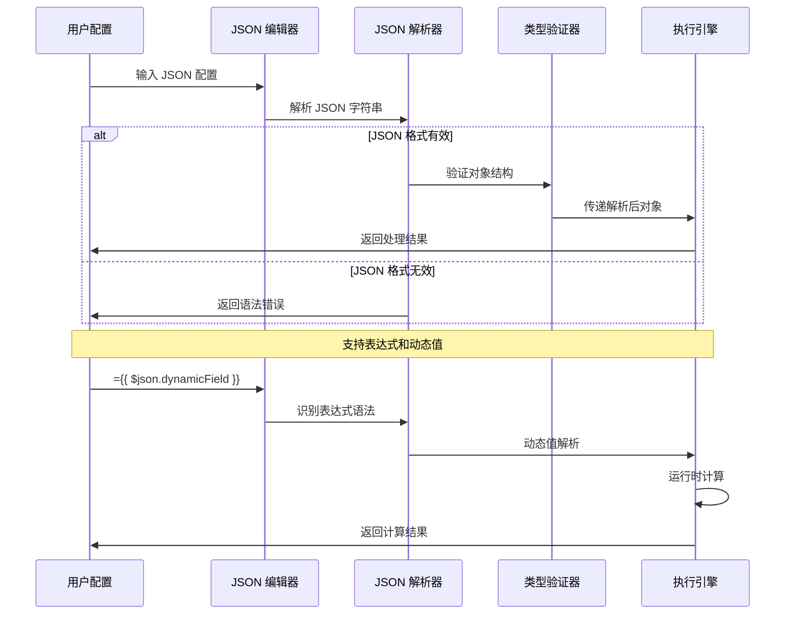
```mermaid
sequenceDiagram
    participant User as 用户配置
    participant Editor as JSON 编辑器
    participant Parser as JSON 解析器
    participant Validator as 类型验证器
    participant Engine as 执行引擎

    User->>Editor: 输入 JSON 配置
    Editor->>Parser: 解析 JSON 字符串

    alt JSON 格式有效
        Parser->>Validator: 验证对象结构
        Validator->>Engine: 传递解析后对象
        Engine->>User: 返回处理结果
    else JSON 格式无效
        Parser->>User: 返回语法错误
    end

    Note over User,Engine: 支持表达式和动态值

    User->>Editor: ={{ $json.dynamicField }}
    Editor->>Parser: 识别表达式语法
    Parser->>Engine: 动态值解析
    Engine->>Engine: 运行时计算
    Engine->>User: 返回计算结果
```

---

## 3. 数据处理机制详解

### 3.1 字段操作引擎

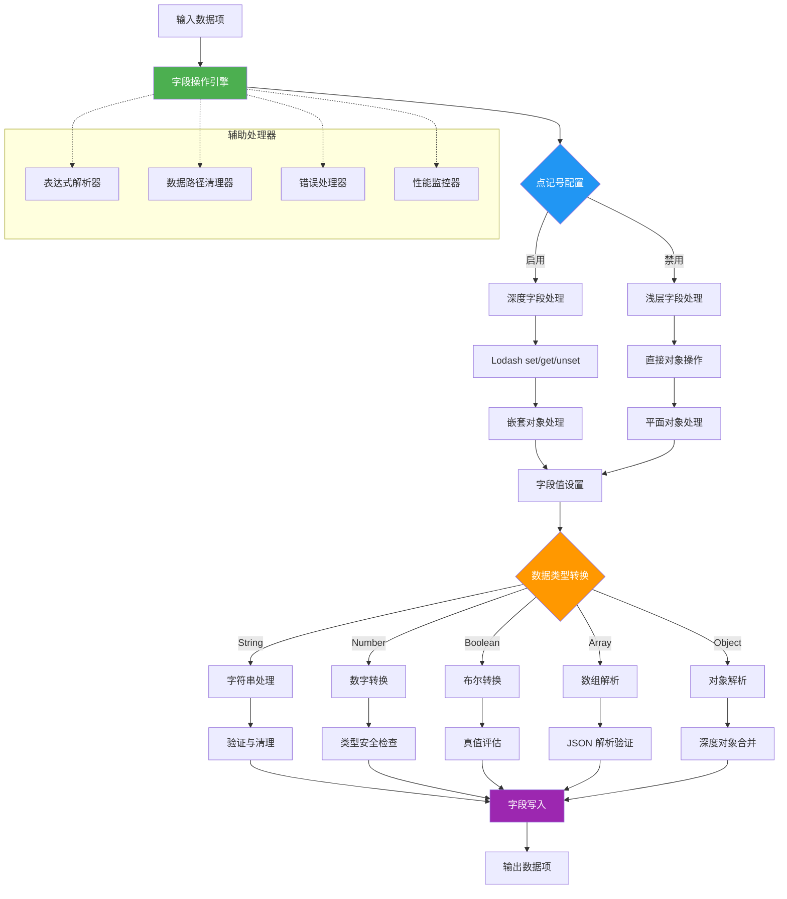
```mermaid
flowchart TD
    A[输入数据项] --> B[字段操作引擎]

    B --> C{点记号配置}
    C -->|启用| D[深度字段处理]
    C -->|禁用| E[浅层字段处理]

    D --> F[Lodash set/get/unset]
    E --> G[直接对象操作]

    F --> H[嵌套对象处理]
    G --> I[平面对象处理]

    H --> J[字段值设置]
    I --> J

    J --> K{数据类型转换}
    K -->|String| L[字符串处理]
    K -->|Number| M[数字转换]
    K -->|Boolean| N[布尔转换]
    K -->|Array| O[数组解析]
    K -->|Object| P[对象解析]

    L --> Q[验证与清理]
    M --> R[类型安全检查]
    N --> S[真值评估]
    O --> T[JSON 解析验证]
    P --> U[深度对象合并]

    Q --> V[字段写入]
    R --> V
    S --> V
    T --> V
    U --> V

    V --> W[输出数据项]

    subgraph "辅助处理器"
        X[表达式解析器]
        Y[数据路径清理器]
        Z[错误处理器]
        AA[性能监控器]
    end

    B -.-> X
    B -.-> Y
    B -.-> Z
    B -.-> AA

    style B fill:#4CAF50,color:#fff
    style C fill:#2196F3,color:#fff
    style K fill:#FF9800,color:#fff
    style V fill:#9C27B0,color:#fff
```

### 3.2 类型转换与验证

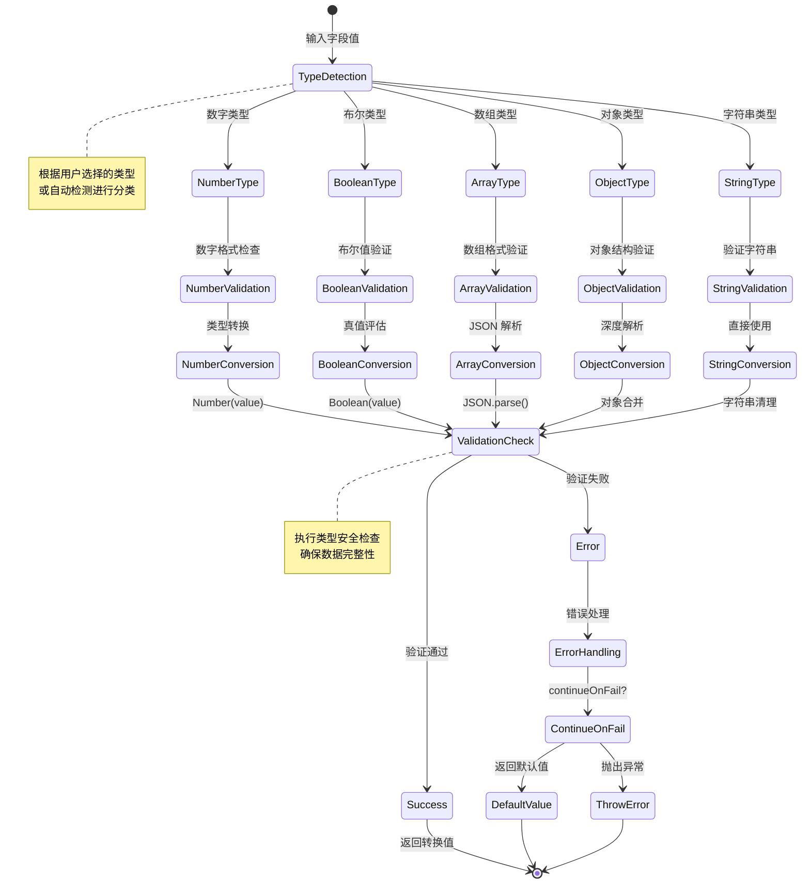
```mermaid
stateDiagram-v2
    [*] --> TypeDetection: 输入字段值

    TypeDetection --> StringType: 字符串类型
    TypeDetection --> NumberType: 数字类型
    TypeDetection --> BooleanType: 布尔类型
    TypeDetection --> ArrayType: 数组类型
    TypeDetection --> ObjectType: 对象类型

    StringType --> StringValidation: 验证字符串
    NumberType --> NumberValidation: 数字格式检查
    BooleanType --> BooleanValidation: 布尔值验证
    ArrayType --> ArrayValidation: 数组格式验证
    ObjectType --> ObjectValidation: 对象结构验证

    StringValidation --> StringConversion: 直接使用
    NumberValidation --> NumberConversion: 类型转换
    BooleanValidation --> BooleanConversion: 真值评估
    ArrayValidation --> ArrayConversion: JSON 解析
    ObjectValidation --> ObjectConversion: 深度解析

    NumberConversion --> ValidationCheck: Number(value)
    BooleanConversion --> ValidationCheck: Boolean(value)
    ArrayConversion --> ValidationCheck: JSON.parse()
    ObjectConversion --> ValidationCheck: 对象合并
    StringConversion --> ValidationCheck: 字符串清理

    ValidationCheck --> Success: 验证通过
    ValidationCheck --> Error: 验证失败

    Success --> [*]: 返回转换值
    Error --> ErrorHandling: 错误处理

    ErrorHandling --> ContinueOnFail: continueOnFail?
    ContinueOnFail --> DefaultValue: 返回默认值
    ContinueOnFail --> ThrowError: 抛出异常

    DefaultValue --> [*]
    ThrowError --> [*]

    note right of TypeDetection
        根据用户选择的类型
        或自动检测进行分类
    end note

    note right of ValidationCheck
        执行类型安全检查
        确保数据完整性
    end note
```

### 3.3 字段包含策略处理

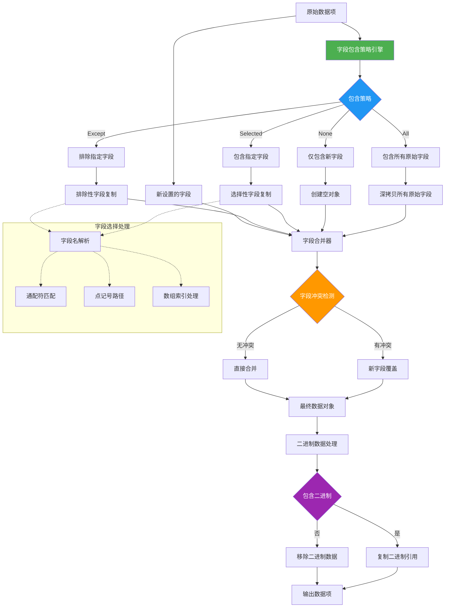
```mermaid
flowchart TD
    A[原始数据项] --> B[字段包含策略引擎]
    A --> C[新设置的字段]

    B --> D{包含策略}

    D -->|All| E[包含所有原始字段]
    D -->|None| F[仅包含新字段]
    D -->|Selected| G[包含指定字段]
    D -->|Except| H[排除指定字段]

    E --> I[深拷贝所有原始字段]
    F --> J[创建空对象]
    G --> K[选择性字段复制]
    H --> L[排除性字段复制]

    I --> M[字段合并器]
    J --> M
    K --> M
    L --> M

    C --> M

    M --> N{字段冲突检测}
    N -->|有冲突| O[新字段覆盖]
    N -->|无冲突| P[直接合并]

    O --> Q[最终数据对象]
    P --> Q

    Q --> R[二进制数据处理]
    R --> S{包含二进制}
    S -->|是| T[复制二进制引用]
    S -->|否| U[移除二进制数据]

    T --> V[输出数据项]
    U --> V

    subgraph "字段选择处理"
        W[字段名解析]
        X[通配符匹配]
        Y[点记号路径]
        Z[数组索引处理]
    end

    K -.-> W
    L -.-> W
    W -.-> X
    W -.-> Y
    W -.-> Z

    style B fill:#4CAF50,color:#fff
    style D fill:#2196F3,color:#fff
    style N fill:#FF9800,color:#fff
    style S fill:#9C27B0,color:#fff
```

---

## 4. 执行模式详细分析

### 4.1 Manual Mapping 模式执行流程

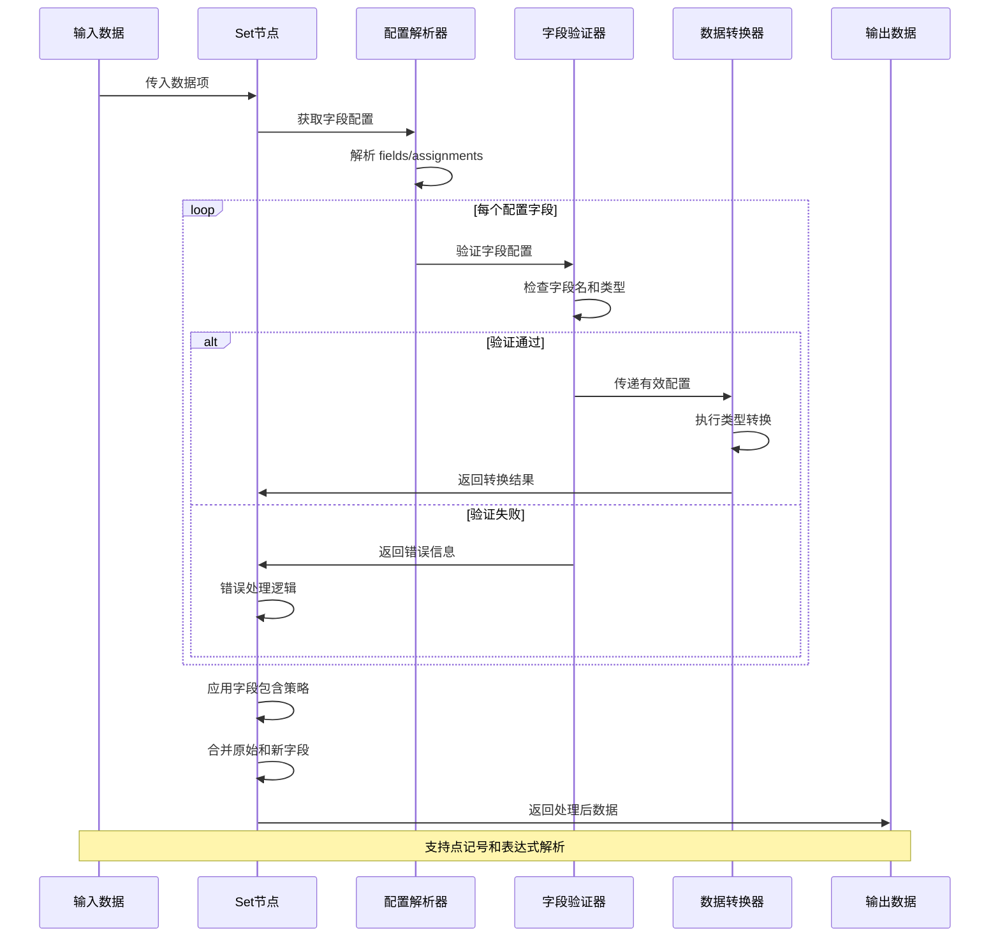
```mermaid
sequenceDiagram
    participant Input as 输入数据
    participant Set as Set节点
    participant Config as 配置解析器
    participant Validator as 字段验证器
    participant Transformer as 数据转换器
    participant Output as 输出数据

    Input->>Set: 传入数据项
    Set->>Config: 获取字段配置
    Config->>Config: 解析 fields/assignments

    loop 每个配置字段
        Config->>Validator: 验证字段配置
        Validator->>Validator: 检查字段名和类型

        alt 验证通过
            Validator->>Transformer: 传递有效配置
            Transformer->>Transformer: 执行类型转换
            Transformer->>Set: 返回转换结果
        else 验证失败
            Validator->>Set: 返回错误信息
            Set->>Set: 错误处理逻辑
        end
    end

    Set->>Set: 应用字段包含策略
    Set->>Set: 合并原始和新字段
    Set->>Output: 返回处理后数据

    Note over Input,Output: 支持点记号和表达式解析
```

### 4.2 JSON 模式执行流程

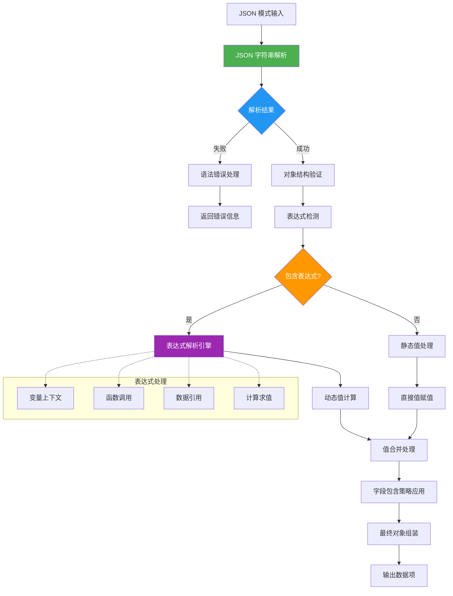
```mermaid
flowchart TD
    A[JSON 模式输入] --> B[JSON 字符串解析]

    B --> C{解析结果}
    C -->|成功| D[对象结构验证]
    C -->|失败| E[语法错误处理]

    E --> F[返回错误信息]

    D --> G[表达式检测]
    G --> H{包含表达式?}

    H -->|是| I[表达式解析引擎]
    H -->|否| J[静态值处理]

    I --> K[动态值计算]
    J --> L[直接值赋值]

    K --> M[值合并处理]
    L --> M

    M --> N[字段包含策略应用]
    N --> O[最终对象组装]

    O --> P[输出数据项]

    subgraph "表达式处理"
        Q[变量上下文]
        R[函数调用]
        S[数据引用]
        T[计算求值]
    end

    I -.-> Q
    I -.-> R
    I -.-> S
    I -.-> T

    style B fill:#4CAF50,color:#fff
    style C fill:#2196F3,color:#fff
    style H fill:#FF9800,color:#fff
    style I fill:#9C27B0,color:#fff
```

### 4.3 版本差异对比

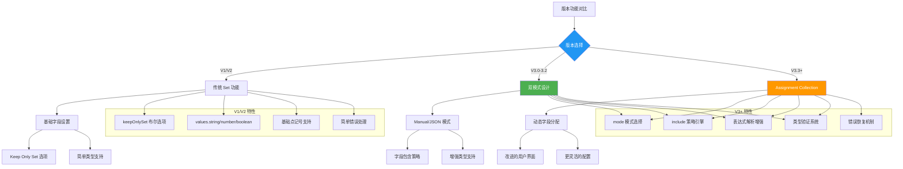
```mermaid
flowchart TD
    A[版本功能对比] --> B{版本选择}

    B -->|V1/V2| C[传统 Set 功能]
    B -->|V3.0-3.2| D[双模式设计]
    B -->|V3.3+| E[Assignment Collection]

    C --> F[基础字段设置]
    F --> G[Keep Only Set 选项]
    F --> H[简单类型支持]

    D --> I[Manual/JSON 模式]
    I --> J[字段包含策略]
    I --> K[增强类型支持]

    E --> L[动态字段分配]
    L --> M[改进的用户界面]
    L --> N[更灵活的配置]

    subgraph "V1/V2 特性"
        O[keepOnlySet 布尔选项]
        P[values.string/number/boolean]
        Q[基础点记号支持]
        R[简单错误处理]
    end

    subgraph "V3+ 特性"
        S[mode 模式选择]
        T[include 策略引擎]
        U[表达式解析增强]
        V[类型验证系统]
        W[错误恢复机制]
    end

    C --> O
    C --> P
    C --> Q
    C --> R

    D --> S
    D --> T
    D --> U
    D --> V

    E --> S
    E --> T
    E --> U
    E --> V
    E --> W

    style B fill:#2196F3,color:#fff
    style D fill:#4CAF50,color:#fff
    style E fill:#FF9800,color:#fff
```

---

## 5. 高级功能与配置选项

### 5.1 点记号 (Dot Notation) 处理

```mermaid
flowchart TD
    A[字段路径输入] --> B{点记号启用?}

    B -->|是| C[深度路径解析]
    B -->|否| D[平面键处理]

    C --> E[路径分割处理]
    E --> F{路径类型}

    F -->|"user.name"| G[嵌套对象访问]
    F -->|"items[0].id"| H[数组索引访问]
    F -->|"data.users[1].profile.email"| I[复杂路径解析]

    G --> J[Lodash set 操作]
    H --> K[数组安全访问]
    I --> L[深度对象创建]

    D --> M[直接键操作]
    M --> N[obj[key] = value]

    J --> O[设置嵌套值]
    K --> O
    L --> O
    N --> O

    O --> P[路径验证]
    P --> Q{路径有效?}

    Q -->|是| R[成功设置]
    Q -->|否| S[路径错误处理]

    S --> T[错误记录]
    T --> U[默认值处理]

    R --> V[输出结果]
    U --> V

    subgraph "路径解析器组件"
        W[键名清理器]
        X[数组索引验证]
        Y[对象创建器]
        Z[类型安全检查]
    end

    E -.-> W
    E -.-> X
    E -.-> Y
    E -.-> Z

    style B fill:#2196F3,color:#fff
    style F fill:#4CAF50,color:#fff
    style Q fill:#FF9800,color:#fff
```

### 5.2 数据复制与引用管理

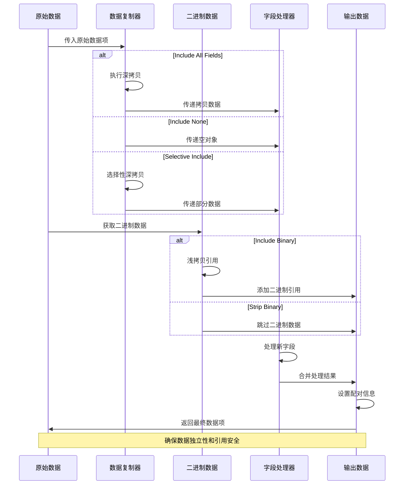
```mermaid
sequenceDiagram
    participant Original as 原始数据
    participant Copier as 数据复制器
    participant Binary as 二进制数据
    participant Fields as 字段处理器
    participant Output as 输出数据

    Original->>Copier: 传入原始数据项

    alt Include All Fields
        Copier->>Copier: 执行深拷贝
        Copier->>Fields: 传递拷贝数据
    else Include None
        Copier->>Fields: 传递空对象
    else Selective Include
        Copier->>Copier: 选择性深拷贝
        Copier->>Fields: 传递部分数据
    end

    Original->>Binary: 获取二进制数据

    alt Include Binary
        Binary->>Binary: 浅拷贝引用
        Binary->>Output: 添加二进制引用
    else Strip Binary
        Binary->>Output: 跳过二进制数据
    end

    Fields->>Fields: 处理新字段
    Fields->>Output: 合并处理结果

    Output->>Output: 设置配对信息
    Output->>Original: 返回最终数据项

    Note over Original,Output: 确保数据独立性和引用安全
```

### 5.3 错误处理与恢复机制

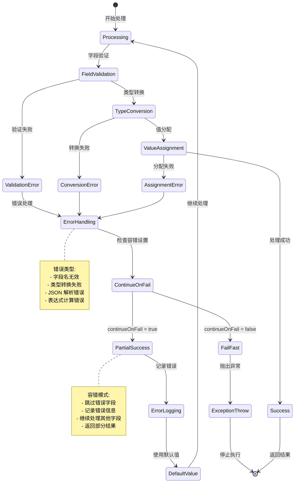
```mermaid
stateDiagram-v2
    [*] --> Processing: 开始处理

    Processing --> FieldValidation: 字段验证
    FieldValidation --> TypeConversion: 类型转换
    TypeConversion --> ValueAssignment: 值分配

    FieldValidation --> ValidationError: 验证失败
    TypeConversion --> ConversionError: 转换失败
    ValueAssignment --> AssignmentError: 分配失败

    ValidationError --> ErrorHandling: 错误处理
    ConversionError --> ErrorHandling
    AssignmentError --> ErrorHandling

    ErrorHandling --> ContinueOnFail: 检查容错设置

    ContinueOnFail --> PartialSuccess: continueOnFail = true
    ContinueOnFail --> FailFast: continueOnFail = false

    PartialSuccess --> ErrorLogging: 记录错误
    ErrorLogging --> DefaultValue: 使用默认值
    DefaultValue --> Processing: 继续处理

    FailFast --> ExceptionThrow: 抛出异常
    ExceptionThrow --> [*]: 停止执行

    ValueAssignment --> Success: 处理成功
    Success --> [*]: 返回结果

    note right of ErrorHandling
        错误类型:
        - 字段名无效
        - 类型转换失败
        - JSON 解析错误
        - 表达式计算错误
    end note

    note right of PartialSuccess
        容错模式:
        - 跳过错误字段
        - 记录错误信息
        - 继续处理其他字段
        - 返回部分结果
    end note
```

---

## 6. 实际应用场景与最佳实践

### 6.1 常见使用场景

#### 场景 1: 数据清理与标准化

```javascript
// 手动映射模式示例
{
  "mode": "manual",
  "includeOtherFields": true,
  "assignments": {
    "email": "={{ $json.email_address?.toLowerCase().trim() }}",
    "fullName": "={{ $json.first_name + ' ' + $json.last_name }}",
    "isActive": "={{ $json.status === 'active' }}",
    "createdAt": "={{ new Date($json.created_timestamp).toISOString() }}"
  }
}

// JSON 模式示例
{
  "mode": "raw",
  "jsonOutput": {
    "user": {
      "id": "={{ $json.user_id }}",
      "profile": {
        "name": "={{ $json.name?.trim() }}",
        "email": "={{ $json.email?.toLowerCase() }}",
        "verified": "={{ Boolean($json.email_verified) }}"
      }
    },
    "metadata": {
      "processedAt": "={{ new Date().toISOString() }}",
      "source": "data_cleaning_workflow"
    }
  }
}
```

#### 场景 2: API 响应格式转换

```javascript
// 转换外部 API 响应为内部格式
{
  "mode": "raw",
  "jsonOutput": {
    "id": "={{ $json.external_id }}",
    "name": "={{ $json.display_name }}",
    "contact": {
      "email": "={{ $json.contact_info.email }}",
      "phone": "={{ $json.contact_info.phone_number }}"
    },
    "address": {
      "street": "={{ $json.location.street_address }}",
      "city": "={{ $json.location.city }}",
      "country": "={{ $json.location.country_code }}"
    },
    "labels": "={{ $json.categories?.split(',').map(tag => tag.trim()) }}"
  }
}
```

### 6.2 工作流设计模式

#### 数据转换管道模式

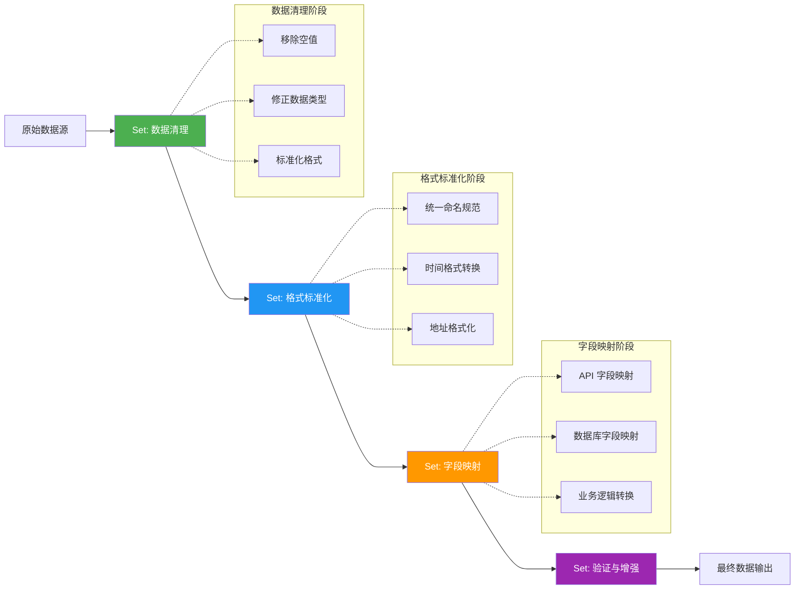
```mermaid
flowchart LR
    A[原始数据源] --> B[Set: 数据清理]
    B --> C[Set: 格式标准化]
    C --> D[Set: 字段映射]
    D --> E[Set: 验证与增强]
    E --> F[最终数据输出]

    subgraph "数据清理阶段"
        G[移除空值]
        H[修正数据类型]
        I[标准化格式]
    end

    subgraph "格式标准化阶段"
        J[统一命名规范]
        K[时间格式转换]
        L[地址格式化]
    end

    subgraph "字段映射阶段"
        M[API 字段映射]
        N[数据库字段映射]
        O[业务逻辑转换]
    end

    B -.-> G
    B -.-> H
    B -.-> I

    C -.-> J
    C -.-> K
    C -.-> L

    D -.-> M
    D -.-> N
    D -.-> O

    style B fill:#4CAF50,color:#fff
    style C fill:#2196F3,color:#fff
    style D fill:#FF9800,color:#fff
    style E fill:#9C27B0,color:#fff
```

#### 条件数据处理模式

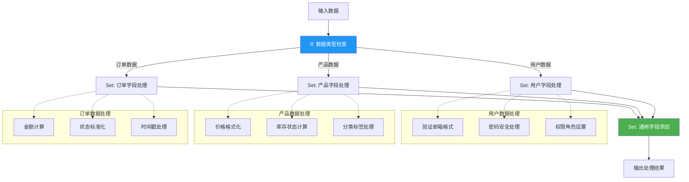
```mermaid
flowchart TD
    A[输入数据] --> B[If: 数据类型检查]

    B -->|用户数据| C[Set: 用户字段处理]
    B -->|产品数据| D[Set: 产品字段处理]
    B -->|订单数据| E[Set: 订单字段处理]

    C --> F[Set: 通用字段添加]
    D --> F
    E --> F

    F --> G[输出处理结果]

    subgraph "用户数据处理"
        H[验证邮箱格式]
        I[密码安全处理]
        J[权限角色设置]
    end

    subgraph "产品数据处理"
        K[价格格式化]
        L[库存状态计算]
        M[分类标签处理]
    end

    subgraph "订单数据处理"
        N[金额计算]
        O[状态标准化]
        P[时间戳处理]
    end

    C -.-> H
    C -.-> I
    C -.-> J

    D -.-> K
    D -.-> L
    D -.-> M

    E -.-> N
    E -.-> O
    E -.-> P

    style B fill:#2196F3,color:#fff
    style F fill:#4CAF50,color:#fff
```

### 6.3 性能优化与最佳实践

#### 性能优化策略

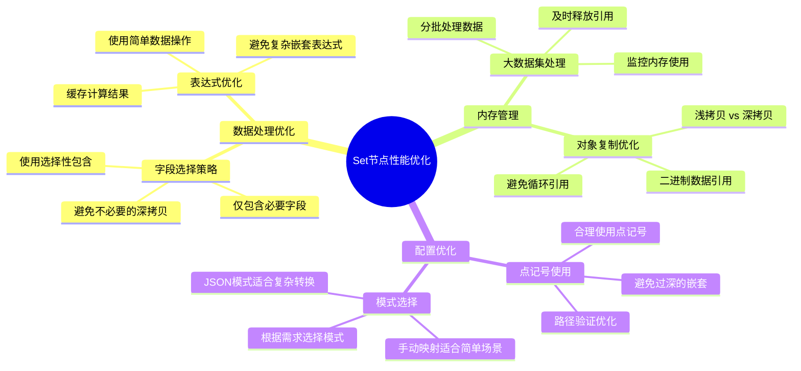
```mermaid
mindmap
  root((Set节点性能优化))
    数据处理优化
      字段选择策略
        仅包含必要字段
        避免不必要的深拷贝
        使用选择性包含
      表达式优化
        缓存计算结果
        避免复杂嵌套表达式
        使用简单数据操作
    内存管理
      大数据集处理
        分批处理数据
        及时释放引用
        监控内存使用
      对象复制优化
        浅拷贝 vs 深拷贝
        二进制数据引用
        避免循环引用
    配置优化
      点记号使用
        合理使用点记号
        避免过深的嵌套
        路径验证优化
      模式选择
        手动映射适合简单场景
        JSON模式适合复杂转换
        根据需求选择模式
```

#### 调试与故障排除

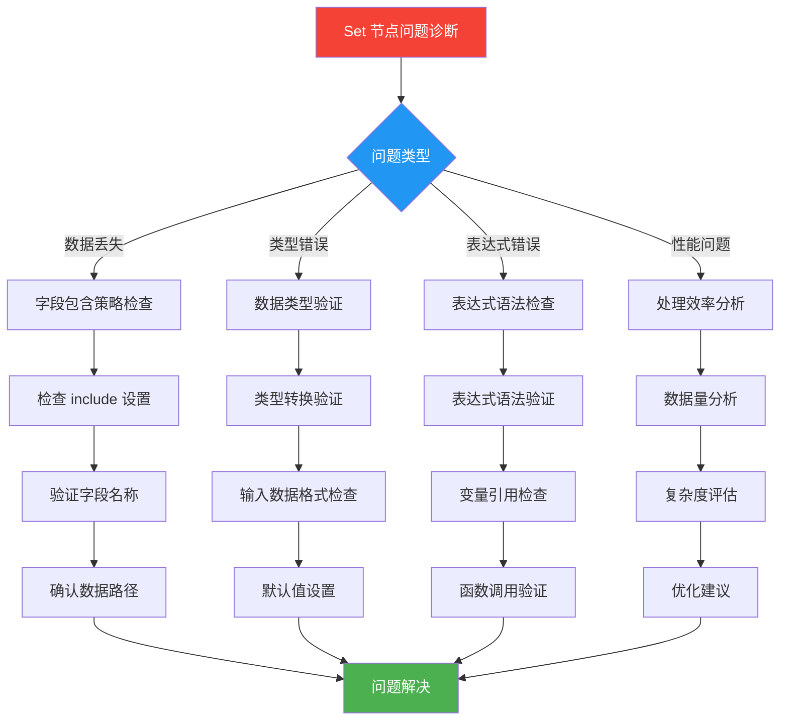
```mermaid
flowchart TD
    A[Set 节点问题诊断] --> B{问题类型}

    B -->|数据丢失| C[字段包含策略检查]
    B -->|类型错误| D[数据类型验证]
    B -->|表达式错误| E[表达式语法检查]
    B -->|性能问题| F[处理效率分析]

    C --> G[检查 include 设置]
    G --> H[验证字段名称]
    H --> I[确认数据路径]

    D --> J[类型转换验证]
    J --> K[输入数据格式检查]
    K --> L[默认值设置]

    E --> M[表达式语法验证]
    M --> N[变量引用检查]
    N --> O[函数调用验证]

    F --> P[数据量分析]
    P --> Q[复杂度评估]
    Q --> R[优化建议]

    I --> S[问题解决]
    L --> S
    O --> S
    R --> S

    style A fill:#f44336,color:#fff
    style B fill:#2196F3,color:#fff
    style S fill:#4CAF50,color:#fff
```

---

## 7. 技术规格总结

### 7.1 节点接口规格

```typescript
interface SetNodeSpecification {
  // 基础信息
  name: "set";
  displayName: "Edit Fields (Set)" | "Set";
  group: ["input"];
  version: 1 | 2 | 3 | 3.1 | 3.2 | 3.3 | 3.4;

  // 连接配置
  inputs: [NodeConnectionTypes.Main];
  outputs: [NodeConnectionTypes.Main];

  // 操作模式
  modes: {
    manual: "Manual Mapping";
    raw: "JSON";
  };

  // 字段类型支持
  supportedTypes: ["stringValue", "numberValue", "booleanValue", "arrayValue", "objectValue"];

  // 包含策略
  includeStrategies: {
    all: "包含所有输入字段";
    none: "仅包含设置字段";
    selected: "包含选定字段";
    except: "排除指定字段";
  };

  // 高级选项
  options: {
    dotNotation: boolean;
    ignoreConversionErrors: boolean;
    includeBinary: boolean;
    stripBinary: boolean;
    duplicateItem: boolean;
    duplicateCount: number;
  };
}
```

### 7.2 版本功能对比矩阵

| 功能特性   | V1          | V2          | V3.0-3.2     | V3.3+                 | 说明                 |
| ---------- | ----------- | ----------- | ------------ | --------------------- | -------------------- |
| 操作模式   | 单一        | 单一        | 双模式       | 双模式                | V3+ 支持 Manual/JSON |
| 字段配置   | 固定集合    | 固定集合    | 固定集合     | Assignment Collection | V3.3+ 更灵活         |
| 包含策略   | keepOnlySet | keepOnlySet | include 选项 | includeOtherFields    | 逐渐简化配置         |
| 类型支持   | 基础类型    | 增强数字    | 完整类型     | 完整类型              | V3+ 支持所有类型     |
| 表达式支持 | 基础        | 基础        | 增强         | 增强                  | V3+ 完整表达式引擎   |
| 错误处理   | 简单        | 改进        | 完善         | 完善                  | V3+ 容错机制         |
| 用户界面   | 基础        | 基础        | 改进         | 优化                  | V3.3+ 最佳体验       |

### 7.3 性能指标与限制

- **处理能力**: 单次可处理大型数据对象（建议 < 10MB）
- **字段数量**: 理论无限制，建议 < 1000 个字段
- **嵌套深度**: 支持任意深度，建议 < 10 层
- **表达式复杂度**: 支持复杂表达式，注意性能影响
- **内存占用**: O(n) 其中 n 为数据项大小
- **处理延迟**: 毫秒级（简单操作）到秒级（复杂转换）

### 7.4 与其他节点的集成模式

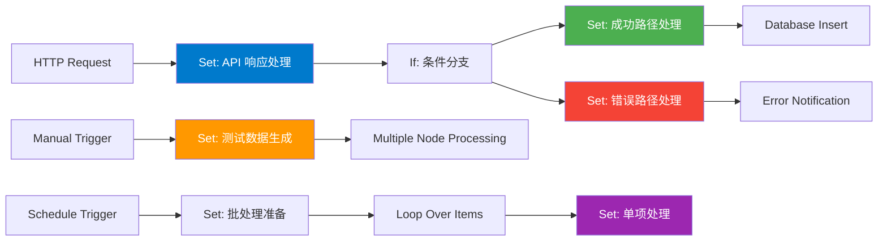
```mermaid
graph LR
    A[HTTP Request] --> B[Set: API 响应处理]
    B --> C[If: 条件分支]

    C --> D[Set: 成功路径处理]
    C --> E[Set: 错误路径处理]

    D --> F[Database Insert]
    E --> G[Error Notification]

    H[Manual Trigger] --> I[Set: 测试数据生成]
    I --> J[Multiple Node Processing]

    K[Schedule Trigger] --> L[Set: 批处理准备]
    L --> M[Loop Over Items]
    M --> N[Set: 单项处理]

    style B fill:#007acc,color:#fff
    style D fill:#4CAF50,color:#fff
    style E fill:#f44336,color:#fff
    style I fill:#FF9800,color:#fff
    style N fill:#9C27B0,color:#fff
```

### 7.5 最佳实践指南

#### 设计原则

1. **明确数据流向**: 清楚定义输入输出数据结构
2. **选择适当模式**: 简单映射用 Manual，复杂转换用 JSON
3. **合理使用包含策略**: 避免不必要的数据复制
4. **优化表达式**: 保持表达式简洁高效
5. **错误处理**: 启用适当的容错机制

#### 避免常见陷阱

1. **过度嵌套**: 避免过深的对象嵌套
2. **不必要的深拷贝**: 合理选择字段包含策略
3. **表达式过度复杂**: 保持表达式可读性
4. **类型转换错误**: 注意数据类型一致性
5. **性能问题**: 大数据集时注意处理效率

Set 节点作为 n8n 中最核心的数据转换工具，提供了强大而灵活的数据操作能力。通过合理的配置和使用，它能够满足各种数据处理需求，是构建高效工作流的重要基石。
