# n8n SplitInBatches (Loop Over Items) 节点深度解析

## 1. 节点架构与基础信息

### 1.1 节点基本信息
- **显示名称**: Loop Over Items (Split in Batches) - V3 | Split In Batches - V1/V2
- **节点名称**: `splitInBatches`
- **图标**: 🔄 (fa:sync) - V3 | 📦 (fa:th-large) - V1/V2
- **图标颜色**: 深绿色 (dark-green)
- **组别**: organization
- **当前版本**: 3 (默认版本)
- **源码路径**: `packages/nodes-base/nodes/SplitInBatches/`

### 1.2 节点描述
SplitInBatches 节点是 n8n 中的循环控制节点，用于将大量数据分割成较小的批次进行逐批处理。它是处理大数据集、避免内存溢出、实现分批操作的核心组件。虽然 n8n 默认对每个输入项运行一次，但在某些场景下（如需要批量 API 调用、分批数据库操作等），此节点提供了必要的批处理控制。

### 1.3 版本历史与演进
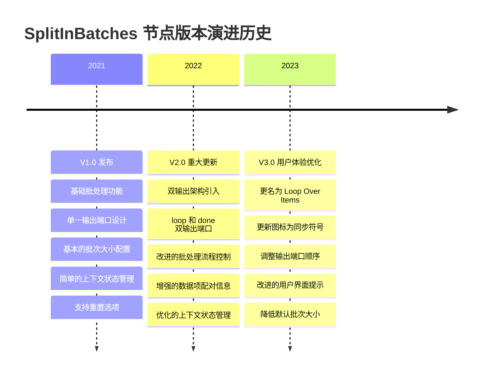
```mermaid
timeline
    title SplitInBatches 节点版本演进历史

    2021    : V1.0 发布
            : 基础批处理功能
            : 单一输出端口设计
            : 基本的批次大小配置
            : 简单的上下文状态管理
            : 支持重置选项

    2022    : V2.0 重大更新
            : 双输出架构引入
            : loop 和 done 双输出端口
            : 改进的批处理流程控制
            : 增强的数据项配对信息
            : 优化的上下文状态管理

    2023    : V3.0 用户体验优化
            : 更名为 Loop Over Items
            : 更新图标为同步符号
            : 调整输出端口顺序
            : 改进的用户界面提示
            : 降低默认批次大小
```

### 1.4 批处理架构与拓扑结构
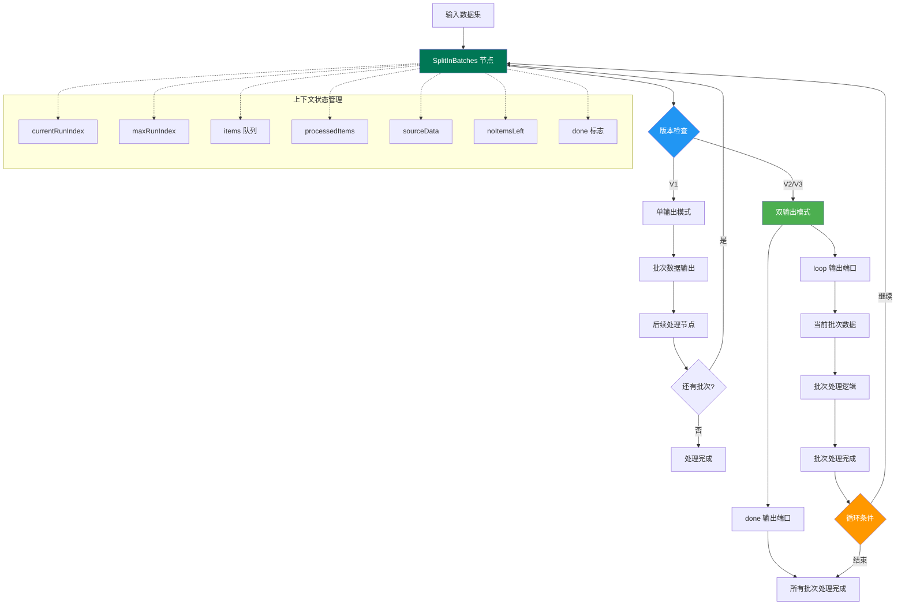
```mermaid
graph TD
    A[输入数据集] --> B[SplitInBatches 节点]
    B --> C{版本检查}

    C -->|V1| D[单输出模式]
    C -->|V2/V3| E[双输出模式]

    D --> F[批次数据输出]
    F --> G[后续处理节点]
    G --> H{还有批次?}
    H -->|是| B
    H -->|否| I[处理完成]

    E --> J[done 输出端口]
    E --> K[loop 输出端口]

    J --> L[所有批次处理完成]
    K --> M[当前批次数据]

    M --> N[批次处理逻辑]
    N --> O[批次处理完成]
    O --> P{循环条件}
    P -->|继续| B
    P -->|结束| L

    subgraph "上下文状态管理"
        Q[currentRunIndex]
        R[maxRunIndex]
        S[items 队列]
        T[processedItems]
        U[sourceData]
        V[noItemsLeft]
        W[done 标志]
    end

    B -.-> Q
    B -.-> R
    B -.-> S
    B -.-> T
    B -.-> U
    B -.-> V
    B -.-> W

    style B fill:#007755,color:#fff
    style C fill:#2196F3,color:#fff
    style E fill:#4CAF50,color:#fff
    style P fill:#FF9800,color:#fff
```

---

## 2. 节点属性配置详解

### 2.1 核心配置属性
```typescript
// 批次大小配置
{
  displayName: 'Batch Size',
  name: 'batchSize',
  type: 'number',
  typeOptions: {
    minValue: 1,
  },
  default: 1,  // V3 默认值 | V1/V2 默认值为 10
  description: 'The number of items to return with each call'
}

// 重置选项配置
{
  displayName: 'Options',
  name: 'options',
  type: 'collection',
  placeholder: 'Add option',
  default: {},
  options: [
    {
      displayName: 'Reset',
      name: 'reset',
      type: 'boolean',
      default: false,
      description: 'Whether the node starts again from the beginning...'
    }
  ]
}
```

### 2.2 输出端口配置演进
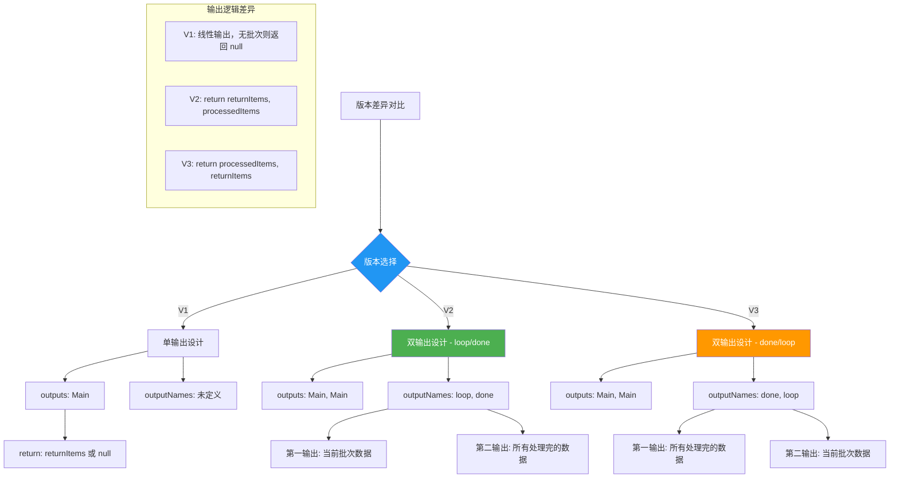
```mermaid
flowchart TD
    A[版本差异对比] --> B{版本选择}
    B -->|V1| C[单输出设计]
    B -->|V2| D[双输出设计 - loop/done]
    B -->|V3| E[双输出设计 - done/loop]

    C --> F["outputs: Main"]
    C --> G["outputNames: 未定义"]

    D --> H["outputs: Main, Main"]
    D --> I["outputNames: loop, done"]

    E --> J["outputs: Main, Main"]
    E --> K["outputNames: done, loop"]

    F --> L["return: returnItems 或 null"]

    I --> M["第一输出: 当前批次数据"]
    I --> N["第二输出: 所有处理完的数据"]

    K --> O["第一输出: 所有处理完的数据"]
    K --> P["第二输出: 当前批次数据"]

    subgraph "输出逻辑差异"
        Q["V1: 线性输出，无批次则返回 null"]
        R["V2: return returnItems, processedItems"]
        S["V3: return processedItems, returnItems"]
    end

    style B fill:#2196F3,color:#fff
    style D fill:#4CAF50,color:#fff
    style E fill:#FF9800,color:#fff
```

### 2.3 配置流程与验证
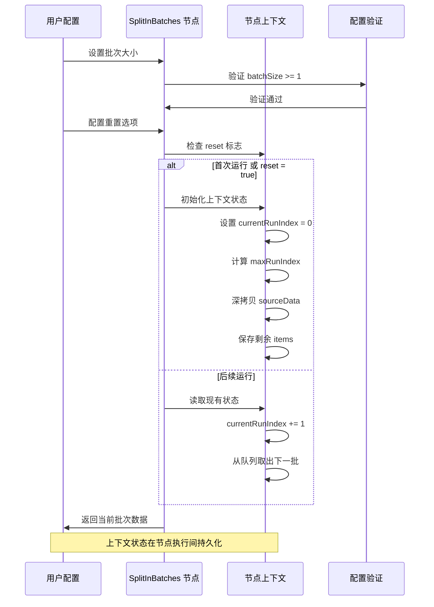
```mermaid
sequenceDiagram
    participant User as 用户配置
    participant Node as SplitInBatches 节点
    participant Context as 节点上下文
    participant Validation as 配置验证

    User->>Node: 设置批次大小
    Node->>Validation: 验证 batchSize >= 1
    Validation->>Node: 验证通过

    User->>Node: 配置重置选项
    Node->>Context: 检查 reset 标志

    alt 首次运行 或 reset = true
        Node->>Context: 初始化上下文状态
        Context->>Context: 设置 currentRunIndex = 0
        Context->>Context: 计算 maxRunIndex
        Context->>Context: 深拷贝 sourceData
        Context->>Context: 保存剩余 items
    else 后续运行
        Node->>Context: 读取现有状态
        Context->>Context: currentRunIndex += 1
        Context->>Context: 从队列取出下一批
    end

    Node->>User: 返回当前批次数据

    Note over User,Context: 上下文状态在节点执行间持久化
```

---

## 3. 批处理机制详细解析

### 3.1 批次分割算法
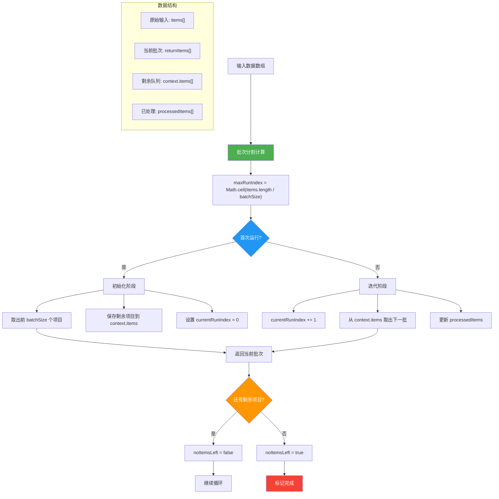
```mermaid
flowchart TD
    A[输入数据数组] --> B[批次分割计算]
    B --> C["maxRunIndex = Math.ceil(items.length / batchSize)"]

    C --> D{首次运行?}
    D -->|是| E[初始化阶段]
    D -->|否| F[迭代阶段]

    E --> G[取出前 batchSize 个项目]
    E --> H[保存剩余项目到 context.items]
    E --> I["设置 currentRunIndex = 0"]

    F --> J["currentRunIndex += 1"]
    F --> K[从 context.items 取出下一批]
    F --> L[更新 processedItems]

    G --> M[返回当前批次]
    K --> M

    M --> N{还有剩余项目?}
    N -->|是| O[noItemsLeft = false]
    N -->|否| P[noItemsLeft = true]

    O --> Q[继续循环]
    P --> R[标记完成]

    subgraph "数据结构"
        S["原始输入: items[]"]
        T["当前批次: returnItems[]"]
        U["剩余队列: context.items[]"]
        V["已处理: processedItems[]"]
    end

    style B fill:#4CAF50,color:#fff
    style D fill:#2196F3,color:#fff
    style N fill:#FF9800,color:#fff
    style R fill:#f44336,color:#fff
```

### 3.2 上下文状态管理
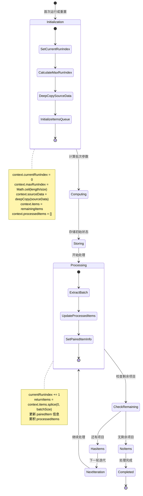
```mermaid
stateDiagram-v2
    [*] --> Initialization: 首次运行或重置

    Initialization --> Computing: 计算批次参数
    Computing --> Storing: 存储初始状态
    Storing --> Processing: 开始处理

    Processing --> CheckRemaining: 检查剩余项目
    CheckRemaining --> HasItems: 还有项目
    CheckRemaining --> NoItems: 无剩余项目

    HasItems --> NextIteration: 下一轮迭代
    NextIteration --> Processing: 继续处理

    NoItems --> Completed: 处理完成
    Completed --> [*]

    state Initialization {
        [*] --> SetCurrentRunIndex
        SetCurrentRunIndex --> CalculateMaxRunIndex
        CalculateMaxRunIndex --> DeepCopySourceData
        DeepCopySourceData --> InitializeItemsQueue
        InitializeItemsQueue --> [*]
    }

    state Processing {
        [*] --> ExtractBatch
        ExtractBatch --> UpdateProcessedItems
        UpdateProcessedItems --> SetPairedItemInfo
        SetPairedItemInfo --> [*]
    }

    note right of Initialization
        context.currentRunIndex = 0
        context.maxRunIndex = Math.ceil(length/size)
        context.sourceData = deepCopy(sourceData)
        context.items = remainingItems
        context.processedItems = []
    end note

    note right of Processing
        currentRunIndex += 1
        returnItems = context.items.splice(0, batchSize)
        更新 pairedItem 信息
        累积 processedItems
    end note
```

### 3.3 数据项配对信息处理
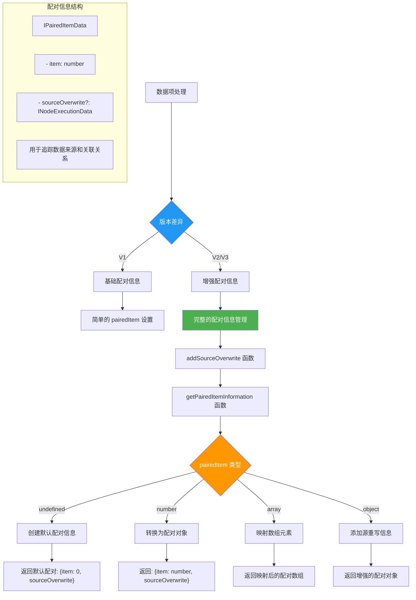
```mermaid
flowchart TD
    A[数据项处理] --> B{版本差异}
    B -->|V1| C[基础配对信息]
    B -->|V2/V3| D[增强配对信息]

    C --> E[简单的 pairedItem 设置]
    D --> F[完整的配对信息管理]

    F --> G[addSourceOverwrite 函数]
    G --> H[getPairedItemInformation 函数]

    H --> I{pairedItem 类型}
    I -->|undefined| J[创建默认配对信息]
    I -->|number| K[转换为配对对象]
    I -->|array| L[映射数组元素]
    I -->|object| M[添加源重写信息]

    J --> N["返回默认配对: {item: 0, sourceOverwrite}"]
    K --> O["返回: {item: number, sourceOverwrite}"]
    L --> P[返回映射后的配对数组]
    M --> Q[返回增强的配对对象]

    subgraph "配对信息结构"
        R[IPairedItemData]
        S["- item: number"]
        T["- sourceOverwrite?: INodeExecutionData"]
        U[用于追踪数据来源和关联关系]
    end

    style B fill:#2196F3,color:#fff
    style F fill:#4CAF50,color:#fff
    style I fill:#FF9800,color:#fff
```

---

## 4. 执行引擎与循环控制

### 4.1 核心执行流程
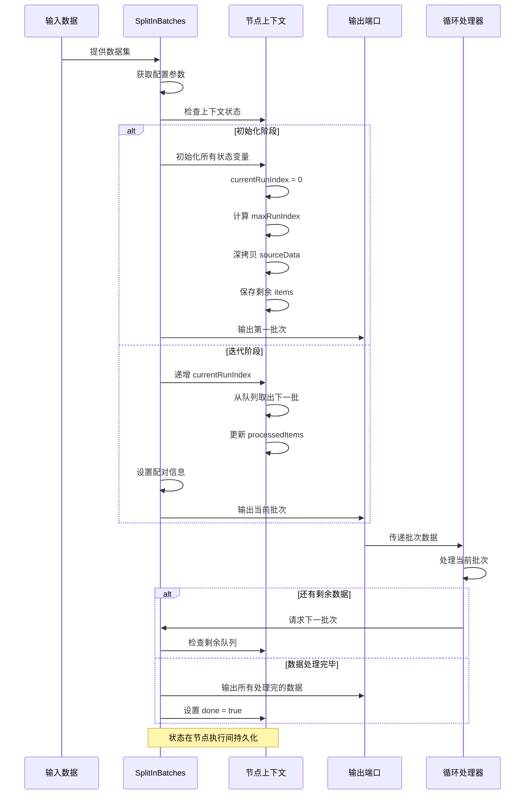
```mermaid
sequenceDiagram
    participant Input as 输入数据
    participant Split as SplitInBatches
    participant Context as 节点上下文
    participant Output as 输出端口
    participant Processor as 循环处理器

    Input->>Split: 提供数据集
    Split->>Split: 获取配置参数
    Split->>Context: 检查上下文状态

    alt 初始化阶段
        Split->>Context: 初始化所有状态变量
        Context->>Context: currentRunIndex = 0
        Context->>Context: 计算 maxRunIndex
        Context->>Context: 深拷贝 sourceData
        Context->>Context: 保存剩余 items
        Split->>Output: 输出第一批次
    else 迭代阶段
        Split->>Context: 递增 currentRunIndex
        Context->>Context: 从队列取出下一批
        Context->>Context: 更新 processedItems
        Split->>Split: 设置配对信息
        Split->>Output: 输出当前批次
    end

    Output->>Processor: 传递批次数据
    Processor->>Processor: 处理当前批次

    alt 还有剩余数据
        Processor->>Split: 请求下一批次
        Split->>Context: 检查剩余队列
    else 数据处理完毕
        Split->>Output: 输出所有处理完的数据
        Split->>Context: 设置 done = true
    end

    Note over Split,Context: 状态在节点执行间持久化
```

### 4.2 版本间执行差异对比
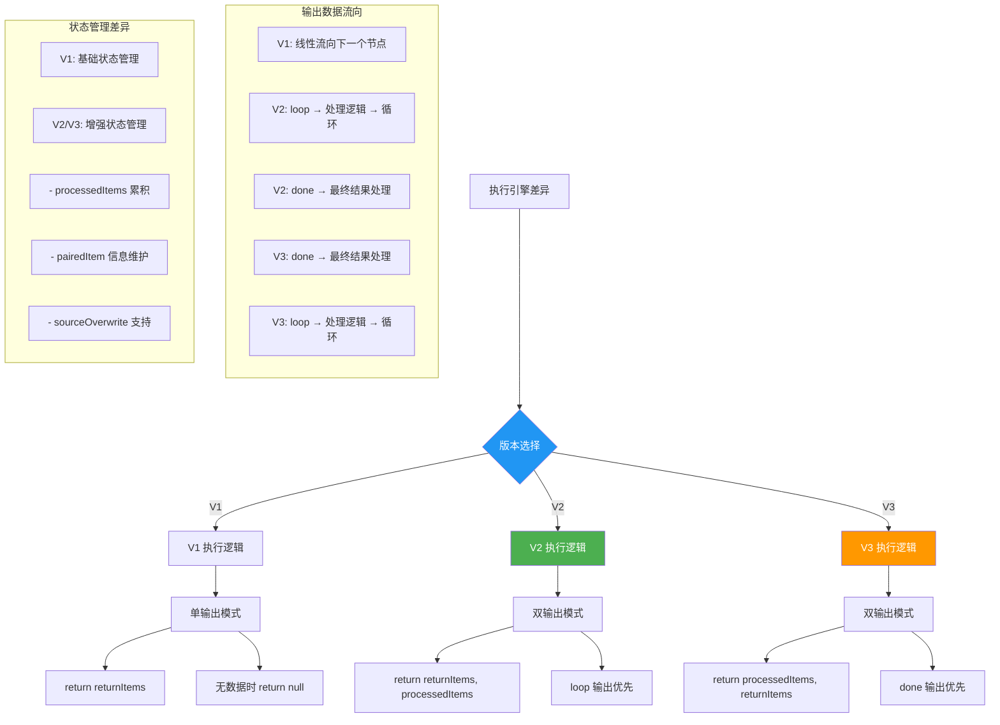
```mermaid
flowchart TD
    A[执行引擎差异] --> B{版本选择}
    B -->|V1| C[V1 执行逻辑]
    B -->|V2| D[V2 执行逻辑]
    B -->|V3| E[V3 执行逻辑]

    C --> F[单输出模式]
    F --> G["return returnItems"]
    F --> H[无数据时 return null]

    D --> I[双输出模式]
    I --> J["return returnItems, processedItems"]
    I --> K[loop 输出优先]

    E --> L[双输出模式]
    L --> M["return processedItems, returnItems"]
    L --> N[done 输出优先]

    subgraph "输出数据流向"
        O["V1: 线性流向下一个节点"]
        P["V2: loop → 处理逻辑 → 循环"]
        Q["V2: done → 最终结果处理"]
        R["V3: done → 最终结果处理"]
        S["V3: loop → 处理逻辑 → 循环"]
    end

    subgraph "状态管理差异"
        T["V1: 基础状态管理"]
        U["V2/V3: 增强状态管理"]
        V["- processedItems 累积"]
        W["- pairedItem 信息维护"]
        X["- sourceOverwrite 支持"]
    end

    style B fill:#2196F3,color:#fff
    style D fill:#4CAF50,color:#fff
    style E fill:#FF9800,color:#fff
```

### 4.3 循环控制与终止条件
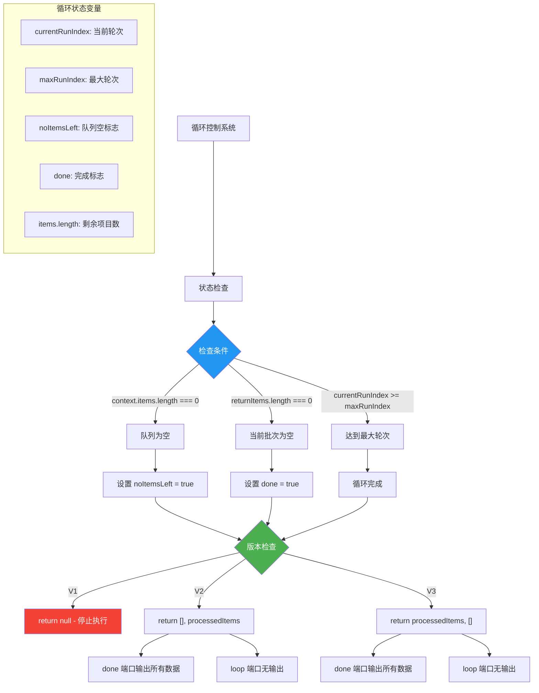
```mermaid
flowchart TD
    A[循环控制系统] --> B[状态检查]
    B --> C{检查条件}

    C -->|"context.items.length === 0"| D[队列为空]
    C -->|"returnItems.length === 0"| E[当前批次为空]
    C -->|"currentRunIndex >= maxRunIndex"| F[达到最大轮次]

    D --> G["设置 noItemsLeft = true"]
    E --> H["设置 done = true"]
    F --> I[循环完成]

    G --> J{版本检查}
    H --> J
    I --> J

    J -->|V1| K["return null - 停止执行"]
    J -->|V2| L["return [], processedItems"]
    J -->|V3| M["return processedItems, []"]

    L --> N[done 端口输出所有数据]
    L --> O[loop 端口无输出]

    M --> P[done 端口输出所有数据]
    M --> Q[loop 端口无输出]

    subgraph "循环状态变量"
        R["currentRunIndex: 当前轮次"]
        S["maxRunIndex: 最大轮次"]
        T["noItemsLeft: 队列空标志"]
        U["done: 完成标志"]
        V["items.length: 剩余项目数"]
    end

    style C fill:#2196F3,color:#fff
    style J fill:#4CAF50,color:#fff
    style K fill:#f44336,color:#fff
```

---

## 5. 高级功能与优化

### 5.1 内存管理与性能优化
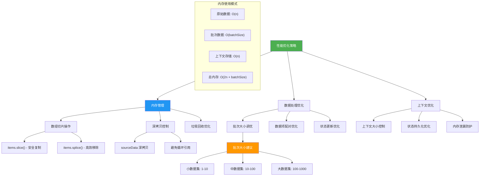
```mermaid
flowchart TD
    A[性能优化策略] --> B[内存管理]
    A --> C[数据处理优化]
    A --> D[上下文优化]

    B --> E[数组切片操作]
    B --> F[深拷贝控制]
    B --> G[垃圾回收优化]

    C --> H[批次大小调优]
    C --> I[数据项配对优化]
    C --> J[状态更新优化]

    D --> K[上下文大小控制]
    D --> L[状态持久化优化]
    D --> M[内存泄漏防护]

    E --> N["items.slice() - 安全复制"]
    E --> O["items.splice() - 高效移除"]

    F --> P[sourceData 深拷贝]
    F --> Q[避免循环引用]

    H --> R[批次大小建议]
    R --> S["小数据集: 1-10"]
    R --> T["中数据集: 10-100"]
    R --> U["大数据集: 100-1000"]

    subgraph "内存使用模式"
        V["原始数据: O(n)"]
        W["批次数据: O(batchSize)"]
        X["上下文存储: O(n)"]
        Y["总内存: O(2n + batchSize)"]
    end

    style A fill:#4CAF50,color:#fff
    style B fill:#2196F3,color:#fff
    style R fill:#FF9800,color:#fff
```

### 5.2 错误处理与边界情况
```typescript
// 边界情况处理示例
interface EdgeCaseHandling {
  // 空输入处理
  emptyInput: {
    condition: 'items.length === 0',
    behavior: 'return early with empty result',
    versionDiff: {
      v1: 'return null',
      v2: 'return [[], []]',
      v3: 'return [[], []]'
    }
  };

  // 批次大小边界
  batchSizeBoundary: {
    minValue: 1,
    validation: 'typeOptions.minValue enforced',
    oversized: 'batchSize > items.length → single batch'
  };

  // 重置操作
  resetOperation: {
    trigger: 'options.reset === true',
    effect: 'reinitialize all context state',
    safetyCheck: 'deep copy source data'
  };

  // 上下文状态恢复
  contextRecovery: {
    corruption: 'context validation and recovery',
    missing: 'graceful reinitialization',
    overflow: 'memory usage monitoring'
  };
}

// 错误处理流程
function handleExecutionError(error: Error, context: IExecuteFunctions) {
  try {
    // 尝试恢复上下文状态
    const nodeContext = context.getContext('node');
    if (!nodeContext.items) {
      // 重新初始化
      return reinitializeContext(context);
    }

    // 记录错误但继续执行
    context.logger?.warn(`SplitInBatches error: ${error.message}`);
    return handleGracefulDegradation(context);

  } catch (criticalError) {
    // 严重错误，停止执行
    throw new NodeOperationError(context.getNode(), criticalError);
  }
}
```

### 5.3 批处理策略与模式
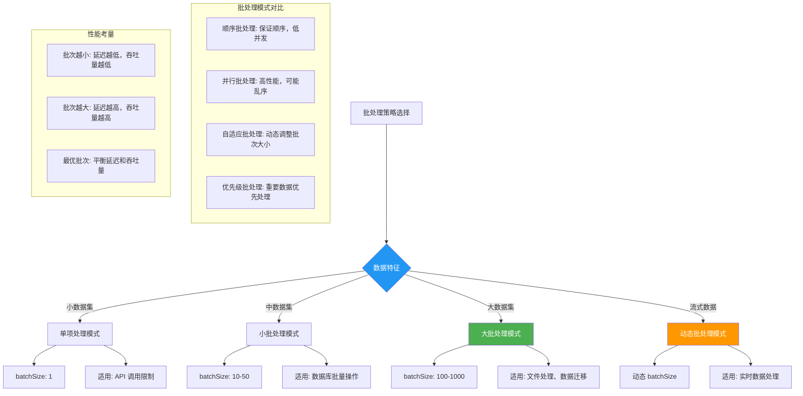
```mermaid
flowchart TD
    A[批处理策略选择] --> B{数据特征}
    B -->|小数据集| C[单项处理模式]
    B -->|中数据集| D[小批处理模式]
    B -->|大数据集| E[大批处理模式]
    B -->|流式数据| F[动态批处理模式]

    C --> G["batchSize: 1"]
    C --> H["适用: API 调用限制"]

    D --> I["batchSize: 10-50"]
    D --> J["适用: 数据库批量操作"]

    E --> K["batchSize: 100-1000"]
    E --> L["适用: 文件处理、数据迁移"]

    F --> M["动态 batchSize"]
    F --> N["适用: 实时数据处理"]

    subgraph "批处理模式对比"
        O["顺序批处理: 保证顺序，低并发"]
        P["并行批处理: 高性能，可能乱序"]
        Q["自适应批处理: 动态调整批次大小"]
        R["优先级批处理: 重要数据优先处理"]
    end

    subgraph "性能考量"
        S["批次越小: 延迟越低，吞吐量越低"]
        T["批次越大: 延迟越高，吞吐量越高"]
        U["最优批次: 平衡延迟和吞吐量"]
    end

    style B fill:#2196F3,color:#fff
    style E fill:#4CAF50,color:#fff
    style F fill:#FF9800,color:#fff
```

---

## 6. 使用示例与最佳实践

### 6.1 常见使用场景

#### 场景1: API 批量调用控制
```javascript
// 避免 API 速率限制的批处理
// 工作流配置示例
{
  "splitInBatchesConfig": {
    "batchSize": 5,
    "options": {
      "reset": false
    }
  },
  "scenario": "每次调用 API 处理 5 个用户记录",
  "rateLimitStrategy": "分批请求避免 429 错误"
}

// 典型工作流结构:
// Manual Trigger → Set (用户列表) → SplitInBatches → HTTP Request (API调用) → Wait (延迟) → loop回到SplitInBatches
```

#### 场景2: 数据库批量操作
```javascript
// 大量数据库插入/更新
{
  "splitInBatchesConfig": {
    "batchSize": 100,
    "options": {
      "reset": false
    }
  },
  "scenario": "批量插入10000条记录，每批100条",
  "benefits": [
    "减少数据库连接开销",
    "避免事务超时",
    "提高插入性能",
    "支持事务回滚"
  ]
}

// 工作流示例:
// HTTP Request (获取数据) → Transform → SplitInBatches → MySQL (批量插入) → loop
```

#### 场景3: 文件处理分批
```javascript
// 大文件批量处理
{
  "splitInBatchesConfig": {
    "batchSize": 50,
    "options": {
      "reset": true  // 每次运行重新开始
    }
  },
  "scenario": "处理1000个图片文件，每批50个",
  "processing": [
    "图片压缩",
    "格式转换",
    "上传到云存储",
    "生成缩略图"
  ]
}
```

### 6.2 工作流设计模式

#### 基础循环模式 (V3)
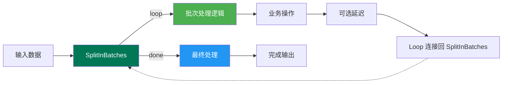
```mermaid
flowchart LR
    A[输入数据] --> B[SplitInBatches]
    B -->|done| C[最终处理]
    B -->|loop| D[批次处理逻辑]
    D --> E[业务操作]
    E --> F[可选延迟]
    F --> G[Loop 连接回 SplitInBatches]

    G -.-> B
    C --> H[完成输出]

    style B fill:#007755,color:#fff
    style D fill:#4CAF50,color:#fff
    style C fill:#2196F3,color:#fff
```

#### 条件批处理模式
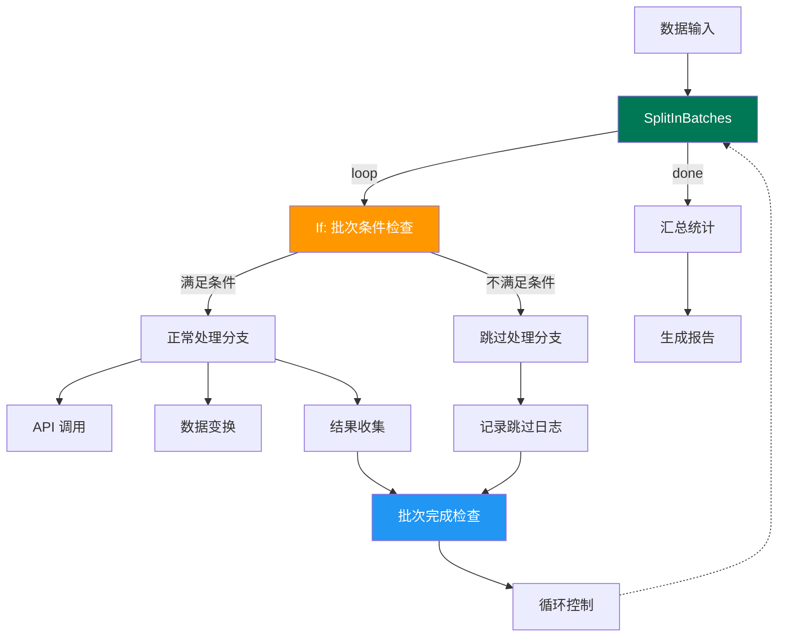
```mermaid
flowchart TD
    A[数据输入] --> B[SplitInBatches]
    B -->|done| C[汇总统计]
    B -->|loop| D["If: 批次条件检查"]

    D -->|满足条件| E[正常处理分支]
    D -->|不满足条件| F[跳过处理分支]

    E --> G[API 调用]
    E --> H[数据变换]
    E --> I[结果收集]

    F --> J[记录跳过日志]

    I --> K[批次完成检查]
    J --> K
    K --> L[循环控制]
    L -.-> B

    C --> M[生成报告]

    style B fill:#007755,color:#fff
    style D fill:#FF9800,color:#fff
    style K fill:#2196F3,color:#fff
```

#### 错误重试模式
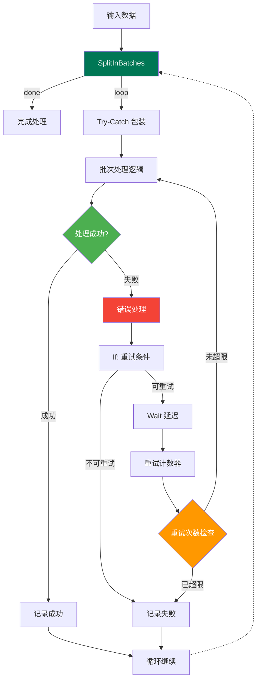
```mermaid
flowchart TD
    A[输入数据] --> B[SplitInBatches]
    B -->|done| C[完成处理]
    B -->|loop| D[Try-Catch 包装]

    D --> E[批次处理逻辑]
    E --> F{处理成功?}

    F -->|成功| G[记录成功]
    F -->|失败| H[错误处理]

    H --> I["If: 重试条件"]
    I -->|可重试| J[Wait 延迟]
    I -->|不可重试| K[记录失败]

    J --> L[重试计数器]
    L --> M{重试次数检查}
    M -->|未超限| E
    M -->|已超限| K

    G --> N[循环继续]
    K --> N
    N -.-> B

    style B fill:#007755,color:#fff
    style F fill:#4CAF50,color:#fff
    style H fill:#f44336,color:#fff
    style M fill:#FF9800,color:#fff
```

### 6.3 性能调优与监控

#### 批次大小调优策略
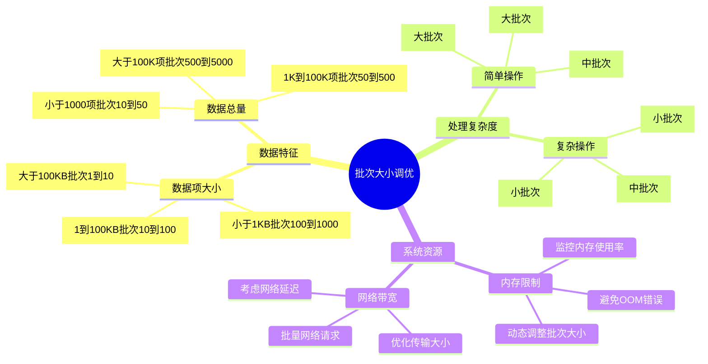
```mermaid
mindmap
  root((批次大小调优))
    数据特征
      数据项大小
        小对象[小于1KB批次100到1000]
        中对象[1到100KB批次10到100]
        大对象[大于100KB批次1到10]
      数据总量
        小数据集[小于1000项批次10到50]
        中数据集[1K到100K项批次50到500]
        大数据集[大于100K项批次500到5000]
    处理复杂度
      简单操作
        数据复制[大批次]
        字段提取[大批次]
        格式转换[中批次]
      复杂操作
        API调用[小批次]
        数据库操作[中批次]
        机器学习[小批次]
    系统资源
      内存限制
        监控内存使用率
        避免OOM错误
        动态调整批次大小
      网络带宽
        考虑网络延迟
        优化传输大小
        批量网络请求
```

### 6.4 调试与故障排除

#### 调试技巧与工具
1. **状态监控**: 使用 Set 节点输出当前批次信息
2. **循环计数**: 监控 `currentRunIndex` 和 `maxRunIndex`
3. **内存使用**: 检查批次大小与系统内存的匹配度
4. **性能分析**: 测量每批次的处理时间

#### 常见问题解决方案
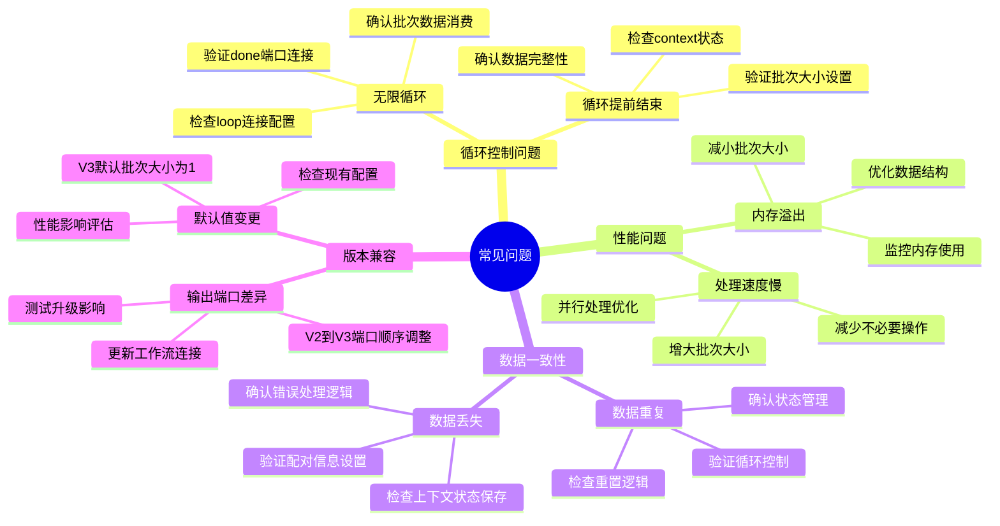
```mermaid
mindmap
  root((常见问题))
    循环控制问题
      无限循环
        检查loop连接配置
        验证done端口连接
        确认批次数据消费
      循环提前结束
        检查context状态
        验证批次大小设置
        确认数据完整性
    性能问题
      内存溢出
        减小批次大小
        监控内存使用
        优化数据结构
      处理速度慢
        增大批次大小
        并行处理优化
        减少不必要操作
    数据一致性
      数据丢失
        验证配对信息设置
        检查上下文状态保存
        确认错误处理逻辑
      数据重复
        检查重置逻辑
        验证循环控制
        确认状态管理
    版本兼容
      输出端口差异
        V2到V3端口顺序调整
        更新工作流连接
        测试升级影响
      默认值变更
        V3默认批次大小为1
        检查现有配置
        性能影响评估
```

---

## 7. 技术规格总结

### 7.1 节点接口规格
```typescript
interface SplitInBatchesNodeSpec {
  // 基础信息
  name: 'splitInBatches';
  displayName: 'Split In Batches' | 'Loop Over Items (Split in Batches)';
  group: ['organization'];
  version: 1 | 2 | 3;

  // 连接配置
  inputs: [NodeConnectionTypes.Main];
  outputs: {
    v1: [NodeConnectionTypes.Main];
    v2: [NodeConnectionTypes.Main, NodeConnectionTypes.Main];
    v3: [NodeConnectionTypes.Main, NodeConnectionTypes.Main];
  };

  // 输出端口名称
  outputNames: {
    v1: undefined;
    v2: ['loop', 'done'];
    v3: ['done', 'loop'];
  };

  // 核心属性
  properties: [
    BatchSizeProperty,
    OptionsCollectionProperty,
    NoticeProperty
  ];

  // 执行方法
  execute(context: IExecuteFunctions): Promise<INodeExecutionData[][] | null>;

  // 上下文状态
  nodeContext: {
    currentRunIndex: number;
    maxRunIndex: number;
    items: INodeExecutionData[];
    processedItems?: INodeExecutionData[];  // V2+ only
    sourceData: INodeExecutionData[];
    noItemsLeft: boolean;
    done: boolean;
  };
}
```

### 7.2 版本功能对比矩阵
| 功能特性 | V1 | V2 | V3 | 说明 |
|----------|----|----|----|----|
| 输出端口数量 | 1 | 2 | 2 | V1单输出，V2/V3双输出 |
| 输出端口顺序 | - | [loop, done] | [done, loop] | V3调整了端口顺序 |
| 默认批次大小 | 10 | 10 | 1 | V3降低默认值 |
| processedItems | ❌ | ✅ | ✅ | V2+支持累积处理项 |
| 增强配对信息 | ❌ | ✅ | ✅ | V2+支持源重写 |
| 显示名称 | Split In Batches | Split In Batches | Loop Over Items | V3更名 |
| 图标 | fa:th-large | fa:th-large | fa:sync | V3更换图标 |
| 完成时返回值 | null | [[], items] | [items, []] | V3调整返回顺序 |

### 7.3 性能指标与限制
- **内存占用**: O(2n + batchSize) where n = 输入数据量
- **处理延迟**: 与批次大小成反比
- **吞吐量**: 与批次大小成正比（有上限）
- **推荐批次大小**:
  - 小数据项 (< 1KB): 100-1000
  - 中数据项 (1-100KB): 10-100
  - 大数据项 (> 100KB): 1-10
- **最大输入限制**: 受系统内存限制
- **上下文大小**: 与输入数据成正比

### 7.4 与其他节点的集成模式
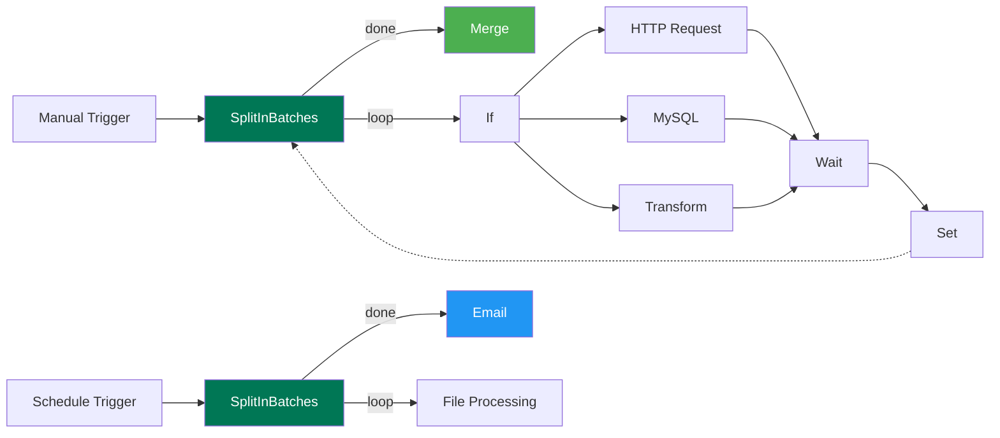
```mermaid
graph LR
    A[Manual Trigger] --> B[SplitInBatches]
    B -->|done| C[Merge]
    B -->|loop| D[If]

    D --> E[HTTP Request]
    D --> F[MySQL]
    D --> G[Transform]

    E --> H[Wait]
    F --> H
    G --> H

    H --> I[Set]
    I -.-> B

    J[Schedule Trigger] --> K[SplitInBatches]
    K -->|done| L[Email]
    K -->|loop| M[File Processing]

    style B fill:#007755,color:#fff
    style K fill:#007755,color:#fff
    style C fill:#4CAF50,color:#fff
    style L fill:#2196F3,color:#fff
```

### 7.5 最佳实践指南

#### 设计原则
1. **选择合适的批次大小**: 平衡性能和资源使用
2. **正确连接输出端口**: 确保 loop 和 done 连接正确
3. **适当的错误处理**: 在批次处理中添加容错机制
4. **监控内存使用**: 避免大批次导致的内存问题
5. **版本选择**: 优先使用 V3，注意端口顺序差异

#### 避免常见陷阱
1. **无限循环**: 确保 done 端口正确连接
2. **内存泄漏**: 监控大数据集的批处理
3. **数据丢失**: 正确处理批次间的状态管理
4. **性能下降**: 避免过小的批次大小
5. **版本升级**: 注意 V2 到 V3 的端口顺序变化

SplitInBatches 节点作为 n8n 中的核心循环控制组件，为大数据集的分批处理提供了强大而灵活的解决方案。通过合理的配置和使用，它能够有效解决内存限制、API 速率限制和性能优化等挑战，是构建高效数据处理工作流的重要工具。
