# n8n Switch（路由控制）节点深度解析

## 1. 节点架构与基础信息

### 1.1 节点基本信息
- **显示名称**: Switch
- **节点名称**: `switch`
- **图标**: 🗺️ (fa:map-signs)
- **图标颜色**: 淡蓝色 (light-blue)
- **组别**: transform
- **当前版本**: 3.2 (默认版本)
- **源码路径**: `packages/nodes-base/nodes/Switch/`

### 1.2 节点描述
Switch 节点是 n8n 中的核心流程控制节点，根据定义的表达式或规则将输入数据路由到不同的输出分支。它类似于编程语言中的 switch-case 语句，提供了基于条件的数据分发功能，是构建复杂工作流逻辑的关键组件。

### 1.3 版本历史与演进
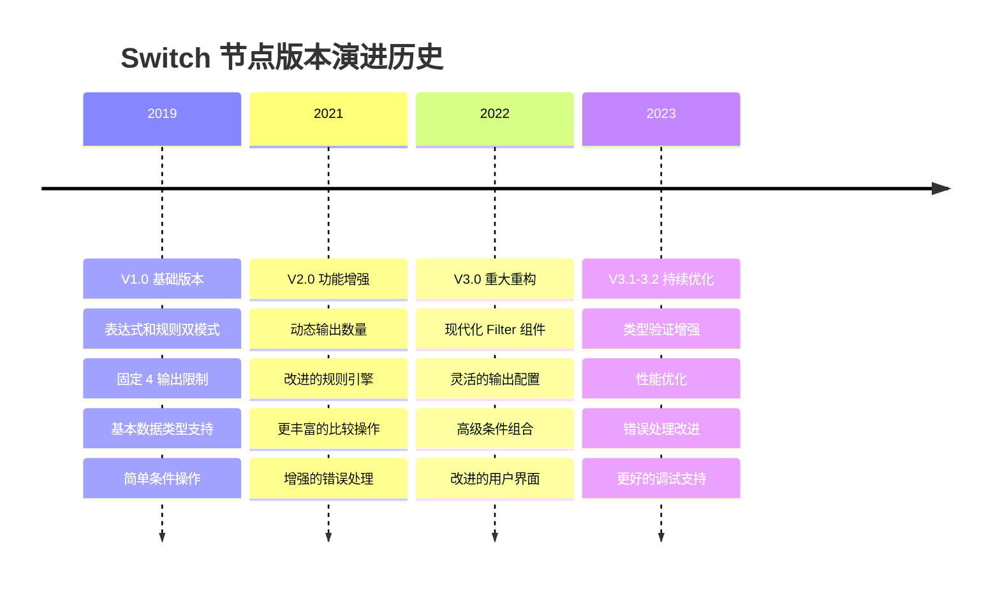
```mermaid
timeline
    title Switch 节点版本演进历史

    2019    : V1.0 基础版本
            : 表达式和规则双模式
            : 固定 4 输出限制
            : 基本数据类型支持
            : 简单条件操作

    2021    : V2.0 功能增强
            : 动态输出数量
            : 改进的规则引擎
            : 更丰富的比较操作
            : 增强的错误处理

    2022    : V3.0 重大重构
            : 现代化 Filter 组件
            : 灵活的输出配置
            : 高级条件组合
            : 改进的用户界面

    2023    : V3.1-3.2 持续优化
            : 类型验证增强
            : 性能优化
            : 错误处理改进
            : 更好的调试支持
```

### 1.4 节点架构与数据流
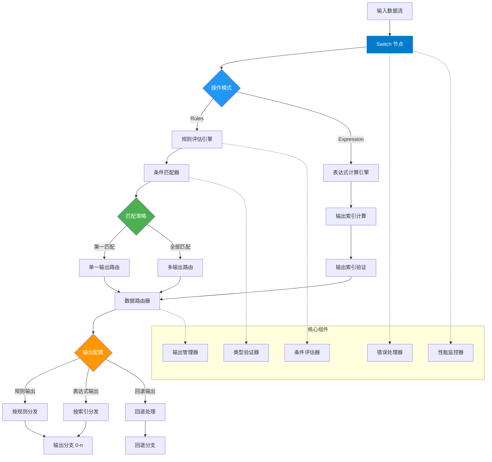
```mermaid
flowchart TD
    A[输入数据流] --> B[Switch 节点]
    B --> C{操作模式}

    C -->|Rules| D[规则评估引擎]
    C -->|Expression| E[表达式计算引擎]

    D --> F[条件匹配器]
    E --> G[输出索引计算]

    F --> H{匹配策略}
    H -->|第一匹配| I[单一输出路由]
    H -->|全部匹配| J[多输出路由]

    G --> K[输出索引验证]

    I --> L[数据路由器]
    J --> L
    K --> L

    L --> M{输出配置}
    M -->|规则输出| N[按规则分发]
    M -->|表达式输出| O[按索引分发]
    M -->|回退输出| P[回退处理]

    N --> Q[输出分支 0-n]
    O --> Q
    P --> R[回退分支]

    subgraph "核心组件"
        S[条件评估器]
        T[类型验证器]
        U[输出管理器]
        V[错误处理器]
        W[性能监控器]
    end

    D -.-> S
    F -.-> T
    L -.-> U
    B -.-> V
    B -.-> W

    style B fill:#007acc,color:#fff
    style C fill:#2196F3,color:#fff
    style H fill:#4CAF50,color:#fff
    style M fill:#FF9800,color:#fff
```

---

## 2. 节点属性配置详解

### 2.1 核心配置属性

#### 模式选择 (Mode)
```typescript
{
  displayName: 'Mode',
  name: 'mode',
  type: 'options',
  noDataExpression: true,
  options: [
    {
      name: 'Rules',
      value: 'rules',
      description: 'Build a matching rule for each output'
    },
    {
      name: 'Expression',
      value: 'expression',
      description: 'Write an expression to return the output index'
    }
  ],
  default: 'rules'
}
```

#### 表达式模式配置
```typescript
// 输出数量配置
{
  displayName: 'Number of Outputs',
  name: 'numberOutputs',
  type: 'number',
  default: 4,
  description: 'How many outputs to create'
}

// 输出索引表达式
{
  displayName: 'Output Index',
  name: 'output',
  type: 'number',
  validateType: 'number',
  default: '={{}}',
  description: 'Expression to calculate output index'
}
```

### 2.2 规则模式详细配置

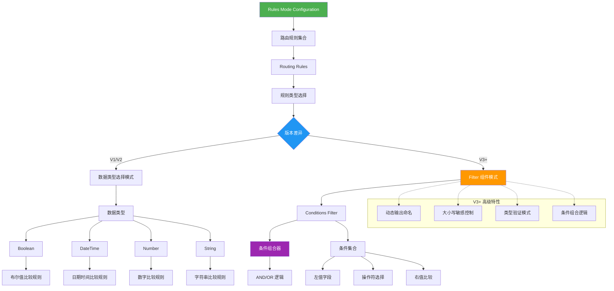
```mermaid
flowchart TD
    A[Rules Mode Configuration] --> B[路由规则集合]

    B --> C[Routing Rules]
    C --> D[规则类型选择]

    D --> E{版本差异}
    E -->|V1/V2| F[数据类型选择模式]
    E -->|V3+| G[Filter 组件模式]

    F --> H[数据类型]
    H --> I[Boolean]
    H --> J[DateTime]
    H --> K[Number]
    H --> L[String]

    I --> M[布尔值比较规则]
    J --> N[日期时间比较规则]
    K --> O[数字比较规则]
    L --> P[字符串比较规则]

    G --> Q[Conditions Filter]
    Q --> R[条件组合器]
    R --> S[AND/OR 逻辑]

    Q --> T[条件集合]
    T --> U[左值字段]
    T --> V[操作符选择]
    T --> W[右值比较]

    subgraph "V3+ 高级特性"
        X[动态输出命名]
        Y[大小写敏感控制]
        Z[类型验证模式]
        AA[条件组合逻辑]
    end

    G -.-> X
    G -.-> Y
    G -.-> Z
    G -.-> AA

    style A fill:#4CAF50,color:#fff
    style E fill:#2196F3,color:#fff
    style G fill:#FF9800,color:#fff
    style R fill:#9C27B0,color:#fff
```

#### V3+ 规则配置结构
```typescript
{
  displayName: 'Routing Rules',
  name: 'rules',
  type: 'fixedCollection',
  typeOptions: {
    multipleValues: true,
    sortable: true
  },
  default: {
    values: [{
      conditions: {
        options: {
          caseSensitive: true,
          leftValue: '',
          typeValidation: 'strict'
        },
        conditions: [{
          leftValue: '',
          rightValue: '',
          operator: {
            type: 'string',
            operation: 'equals'
          }
        }],
        combinator: 'and'
      }
    }]
  }
}
```

### 2.3 高级选项配置

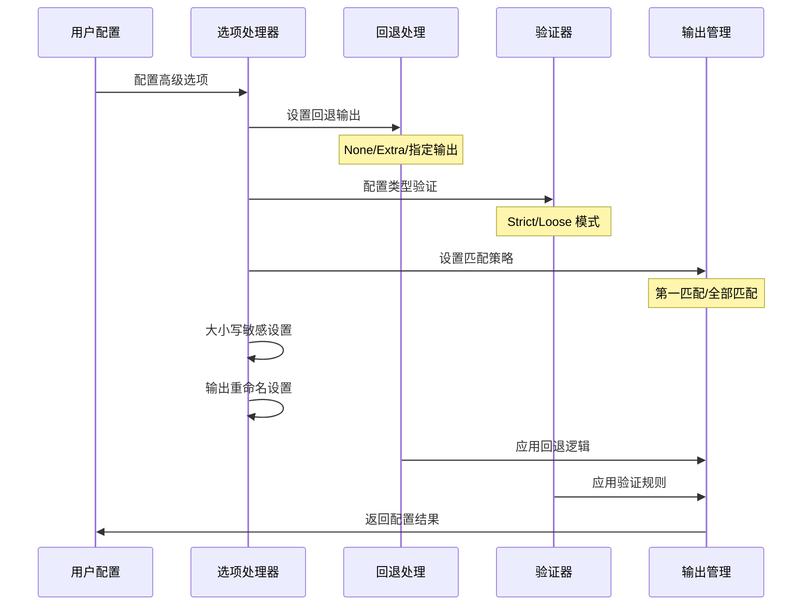
```mermaid
sequenceDiagram
    participant User as 用户配置
    participant Options as 选项处理器
    participant Fallback as 回退处理
    participant Validation as 验证器
    participant Output as 输出管理

    User->>Options: 配置高级选项

    Options->>Fallback: 设置回退输出
    Note over Fallback: None/Extra/指定输出

    Options->>Validation: 配置类型验证
    Note over Validation: Strict/Loose 模式

    Options->>Output: 设置匹配策略
    Note over Output: 第一匹配/全部匹配

    Options->>Options: 大小写敏感设置
    Options->>Options: 输出重命名设置

    Fallback->>Output: 应用回退逻辑
    Validation->>Output: 应用验证规则

    Output->>User: 返回配置结果
```

#### 高级选项详解
```typescript
{
  displayName: 'Options',
  name: 'options',
  type: 'collection',
  options: [
    {
      displayName: 'Fallback Output',
      name: 'fallbackOutput',
      type: 'options', // none/extra/指定输出索引
      default: 'none'
    },
    {
      displayName: 'Ignore Case',
      name: 'ignoreCase',
      type: 'boolean',
      default: true
    },
    {
      displayName: 'Send data to all matching outputs',
      name: 'allMatchingOutputs',
      type: 'boolean',
      default: false
    },
    {
      displayName: 'Rename Fallback Output',
      name: 'renameFallbackOutput',
      type: 'string',
      default: ''
    }
  ]
}
```

---

## 3. 数据处理机制详解

### 3.1 规则评估引擎

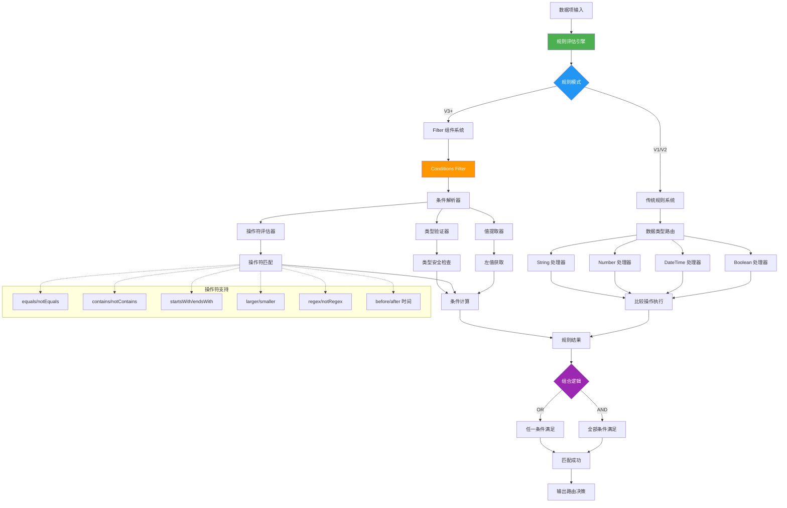
```mermaid
flowchart TD
    A[数据项输入] --> B[规则评估引擎]

    B --> C{规则模式}
    C -->|V1/V2| D[传统规则系统]
    C -->|V3+| E[Filter 组件系统]

    D --> F[数据类型路由]
    F --> G[Boolean 处理器]
    F --> H[DateTime 处理器]
    F --> I[Number 处理器]
    F --> J[String 处理器]

    E --> K[Conditions Filter]
    K --> L[条件解析器]
    L --> M[值提取器]
    L --> N[操作符评估器]
    L --> O[类型验证器]

    G --> P[比较操作执行]
    H --> P
    I --> P
    J --> P

    M --> Q[左值获取]
    N --> R[操作符匹配]
    O --> S[类型安全检查]

    Q --> T[条件计算]
    R --> T
    S --> T

    P --> U[规则结果]
    T --> U

    U --> V{组合逻辑}
    V -->|AND| W[全部条件满足]
    V -->|OR| X[任一条件满足]

    W --> Y[匹配成功]
    X --> Y

    Y --> Z[输出路由决策]

    subgraph "操作符支持"
        AA[equals/notEquals]
        BB[contains/notContains]
        CC[startsWith/endsWith]
        DD[larger/smaller]
        EE[regex/notRegex]
        FF[before/after 时间]
    end

    R -.-> AA
    R -.-> BB
    R -.-> CC
    R -.-> DD
    R -.-> EE
    R -.-> FF

    style B fill:#4CAF50,color:#fff
    style C fill:#2196F3,color:#fff
    style K fill:#FF9800,color:#fff
    style V fill:#9C27B0,color:#fff
```

### 3.2 表达式计算引擎

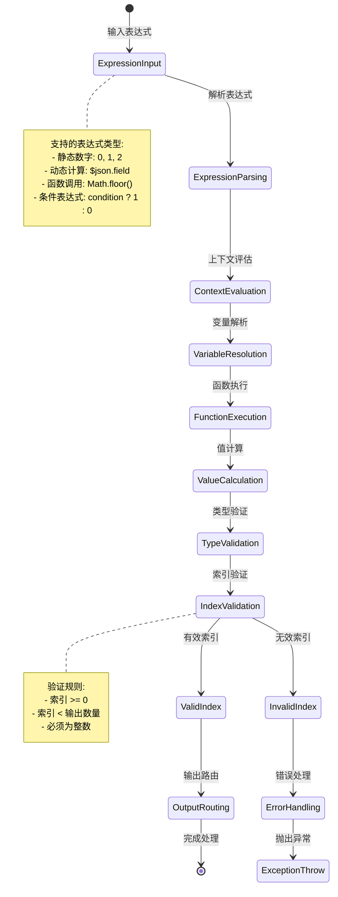
```mermaid
stateDiagram-v2
    [*] --> ExpressionInput: 输入表达式

    ExpressionInput --> ExpressionParsing: 解析表达式
    ExpressionParsing --> ContextEvaluation: 上下文评估

    ContextEvaluation --> VariableResolution: 变量解析
    VariableResolution --> FunctionExecution: 函数执行
    FunctionExecution --> ValueCalculation: 值计算

    ValueCalculation --> TypeValidation: 类型验证
    TypeValidation --> IndexValidation: 索引验证

    IndexValidation --> ValidIndex: 有效索引
    IndexValidation --> InvalidIndex: 无效索引

    InvalidIndex --> ErrorHandling: 错误处理
    ErrorHandling --> ExceptionThrow: 抛出异常

    ValidIndex --> OutputRouting: 输出路由
    OutputRouting --> [*]: 完成处理

    note right of ExpressionInput
        支持的表达式类型:
        - 静态数字: 0, 1, 2
        - 动态计算: $json.field
        - 函数调用: Math.floor()
        - 条件表达式: condition ? 1 : 0
    end note

    note right of IndexValidation
        验证规则:
        - 索引 >= 0
        - 索引 < 输出数量
        - 必须为整数
    end note
```

### 3.3 输出路由与分发机制

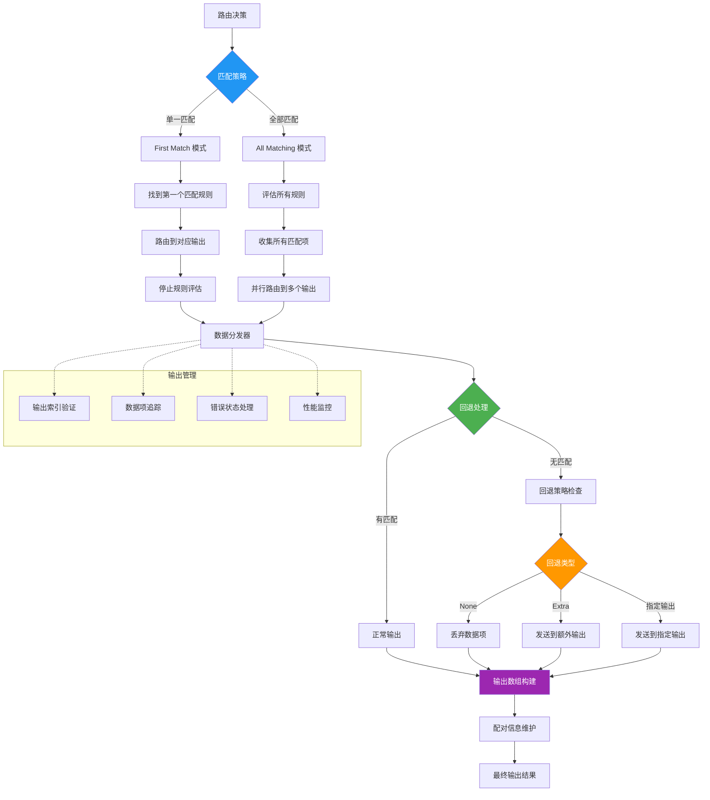
```mermaid
flowchart TD
    A[路由决策] --> B{匹配策略}

    B -->|单一匹配| C[First Match 模式]
    B -->|全部匹配| D[All Matching 模式]

    C --> E[找到第一个匹配规则]
    E --> F[路由到对应输出]
    F --> G[停止规则评估]

    D --> H[评估所有规则]
    H --> I[收集所有匹配项]
    I --> J[并行路由到多个输出]

    G --> K[数据分发器]
    J --> K

    K --> L{回退处理}
    L -->|无匹配| M[回退策略检查]
    L -->|有匹配| N[正常输出]

    M --> O{回退类型}
    O -->|None| P[丢弃数据项]
    O -->|Extra| Q[发送到额外输出]
    O -->|指定输出| R[发送到指定输出]

    N --> S[输出数组构建]
    P --> S
    Q --> S
    R --> S

    S --> T[配对信息维护]
    T --> U[最终输出结果]

    subgraph "输出管理"
        V[输出索引验证]
        W[数据项追踪]
        X[错误状态处理]
        Y[性能监控]
    end

    K -.-> V
    K -.-> W
    K -.-> X
    K -.-> Y

    style B fill:#2196F3,color:#fff
    style L fill:#4CAF50,color:#fff
    style O fill:#FF9800,color:#fff
    style S fill:#9C27B0,color:#fff
```

---

## 4. 执行模式详细分析

### 4.1 规则模式执行流程

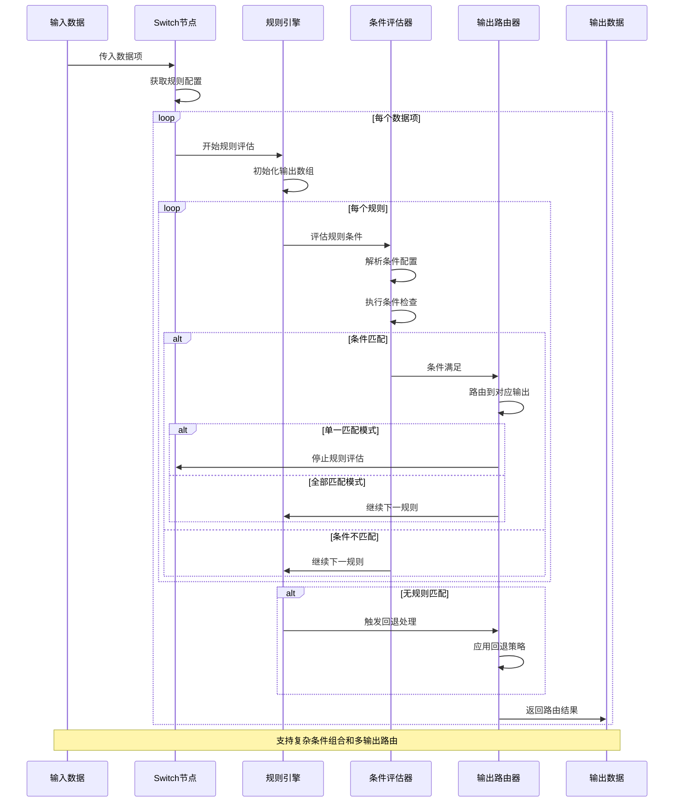
```mermaid
sequenceDiagram
    participant Input as 输入数据
    participant Switch as Switch节点
    participant RuleEngine as 规则引擎
    participant ConditionEvaluator as 条件评估器
    participant OutputRouter as 输出路由器
    participant Output as 输出数据

    Input->>Switch: 传入数据项
    Switch->>Switch: 获取规则配置

    loop 每个数据项
        Switch->>RuleEngine: 开始规则评估
        RuleEngine->>RuleEngine: 初始化输出数组

        loop 每个规则
            RuleEngine->>ConditionEvaluator: 评估规则条件
            ConditionEvaluator->>ConditionEvaluator: 解析条件配置
            ConditionEvaluator->>ConditionEvaluator: 执行条件检查

            alt 条件匹配
                ConditionEvaluator->>OutputRouter: 条件满足
                OutputRouter->>OutputRouter: 路由到对应输出

                alt 单一匹配模式
                    OutputRouter->>Switch: 停止规则评估
                else 全部匹配模式
                    OutputRouter->>RuleEngine: 继续下一规则
                end
            else 条件不匹配
                ConditionEvaluator->>RuleEngine: 继续下一规则
            end
        end

        alt 无规则匹配
            RuleEngine->>OutputRouter: 触发回退处理
            OutputRouter->>OutputRouter: 应用回退策略
        end

        OutputRouter->>Output: 返回路由结果
    end

    Note over Input,Output: 支持复杂条件组合和多输出路由
```

### 4.2 表达式模式执行流程

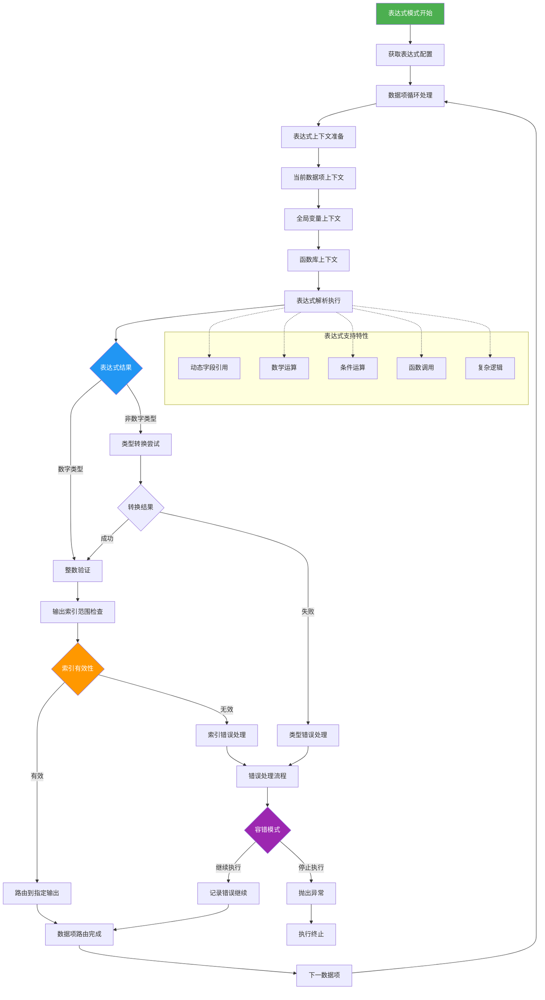
```mermaid
flowchart TD
    A[表达式模式开始] --> B[获取表达式配置]

    B --> C[数据项循环处理]
    C --> D[表达式上下文准备]

    D --> E[当前数据项上下文]
    E --> F[全局变量上下文]
    F --> G[函数库上下文]

    G --> H[表达式解析执行]
    H --> I{表达式结果}

    I -->|数字类型| J[整数验证]
    I -->|非数字类型| K[类型转换尝试]

    K --> L{转换结果}
    L -->|成功| J
    L -->|失败| M[类型错误处理]

    J --> N[输出索引范围检查]
    N --> O{索引有效性}

    O -->|有效| P[路由到指定输出]
    O -->|无效| Q[索引错误处理]

    M --> R[错误处理流程]
    Q --> R

    R --> S{容错模式}
    S -->|继续执行| T[记录错误继续]
    S -->|停止执行| U[抛出异常]

    P --> V[数据项路由完成]
    T --> V

    V --> W[下一数据项]
    W --> C

    U --> X[执行终止]

    subgraph "表达式支持特性"
        Y[动态字段引用]
        Z[数学运算]
        AA[条件运算]
        BB[函数调用]
        CC[复杂逻辑]
    end

    H -.-> Y
    H -.-> Z
    H -.-> AA
    H -.-> BB
    H -.-> CC

    style A fill:#4CAF50,color:#fff
    style I fill:#2196F3,color:#fff
    style O fill:#FF9800,color:#fff
    style S fill:#9C27B0,color:#fff
```

### 4.3 版本差异执行对比

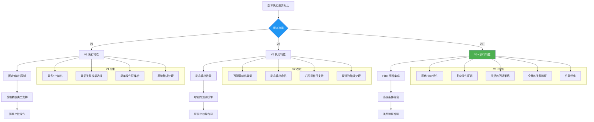
```mermaid
flowchart TD
    A[版本执行差异对比] --> B{版本选择}

    B -->|V1| C[V1 执行特性]
    B -->|V2| D[V2 执行特性]
    B -->|V3+| E[V3+ 执行特性]

    C --> F[固定4输出限制]
    F --> G[基础数据类型支持]
    G --> H[简单比较操作]

    D --> I[动态输出数量]
    I --> J[增强的规则引擎]
    J --> K[更多比较操作符]

    E --> L[Filter 组件集成]
    L --> M[高级条件组合]
    M --> N[类型验证增强]

    subgraph "V1 限制"
        O[最多4个输出]
        P[数据类型枚举选择]
        Q[简单操作符集合]
        R[基础错误处理]
    end

    subgraph "V2 改进"
        S[可配置输出数量]
        T[动态输出命名]
        U[扩展操作符支持]
        V[改进的错误处理]
    end

    subgraph "V3+ 特性"
        W[现代Filter组件]
        X[复杂条件逻辑]
        Y[灵活的回退策略]
        Z[全面的类型验证]
        AA[性能优化]
    end

    C --> O
    C --> P
    C --> Q
    C --> R

    D --> S
    D --> T
    D --> U
    D --> V

    E --> W
    E --> X
    E --> Y
    E --> Z
    E --> AA

    style B fill:#2196F3,color:#fff
    style E fill:#4CAF50,color:#fff
```

---

## 5. 高级功能与配置选项

### 5.1 条件组合与逻辑运算

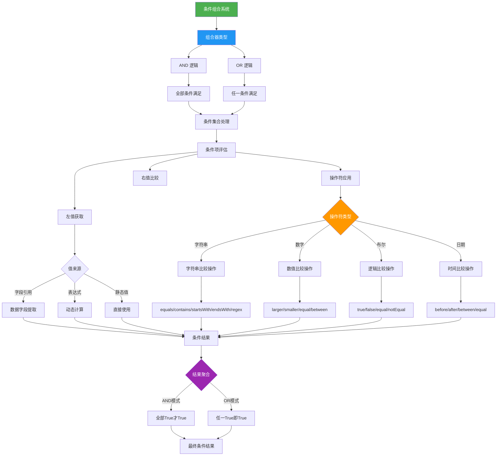
```mermaid
flowchart TD
    A[条件组合系统] --> B[组合器类型]

    B --> C[AND 逻辑]
    B --> D[OR 逻辑]

    C --> E[全部条件满足]
    D --> F[任一条件满足]

    E --> G[条件集合处理]
    F --> G

    G --> H[条件项评估]
    H --> I[左值获取]
    H --> J[操作符应用]
    H --> K[右值比较]

    I --> L{值来源}
    L -->|字段引用| M[数据字段提取]
    L -->|表达式| N[动态计算]
    L -->|静态值| O[直接使用]

    J --> P{操作符类型}
    P -->|字符串| Q[字符串比较操作]
    P -->|数字| R[数值比较操作]
    P -->|布尔| S[逻辑比较操作]
    P -->|日期| T[时间比较操作]

    Q --> U[equals/contains/startsWith/endsWith/regex]
    R --> V[larger/smaller/equal/between]
    S --> W[true/false/equal/notEqual]
    T --> X[before/after/between/equal]

    M --> Y[条件结果]
    N --> Y
    O --> Y
    U --> Y
    V --> Y
    W --> Y
    X --> Y

    Y --> Z{结果聚合}
    Z -->|AND模式| AA[全部True才True]
    Z -->|OR模式| BB[任一True即True]

    AA --> CC[最终条件结果]
    BB --> CC

    style A fill:#4CAF50,color:#fff
    style B fill:#2196F3,color:#fff
    style P fill:#FF9800,color:#fff
    style Z fill:#9C27B0,color:#fff
```

### 5.2 类型验证与转换系统

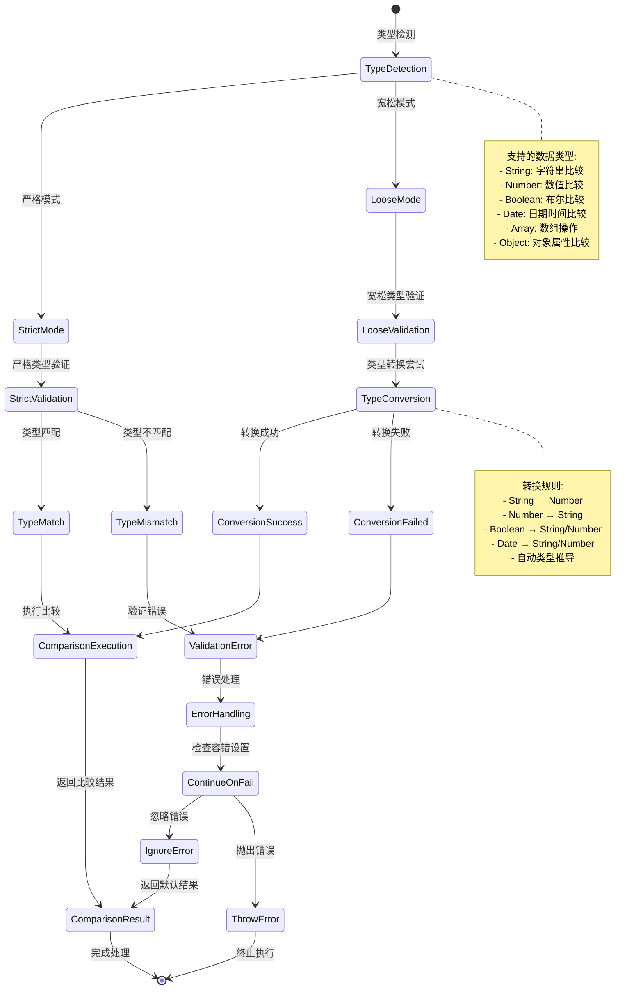
```mermaid
stateDiagram-v2
    [*] --> TypeDetection: 类型检测

    TypeDetection --> StrictMode: 严格模式
    TypeDetection --> LooseMode: 宽松模式

    StrictMode --> StrictValidation: 严格类型验证
    LooseMode --> LooseValidation: 宽松类型验证

    StrictValidation --> TypeMatch: 类型匹配
    StrictValidation --> TypeMismatch: 类型不匹配

    LooseValidation --> TypeConversion: 类型转换尝试
    TypeConversion --> ConversionSuccess: 转换成功
    TypeConversion --> ConversionFailed: 转换失败

    TypeMatch --> ComparisonExecution: 执行比较
    TypeMismatch --> ValidationError: 验证错误

    ConversionSuccess --> ComparisonExecution
    ConversionFailed --> ValidationError

    ValidationError --> ErrorHandling: 错误处理
    ErrorHandling --> ContinueOnFail: 检查容错设置

    ContinueOnFail --> IgnoreError: 忽略错误
    ContinueOnFail --> ThrowError: 抛出错误

    IgnoreError --> ComparisonResult: 返回默认结果
    ThrowError --> [*]: 终止执行

    ComparisonExecution --> ComparisonResult: 返回比较结果
    ComparisonResult --> [*]: 完成处理

    note right of TypeDetection
        支持的数据类型:
        - String: 字符串比较
        - Number: 数值比较
        - Boolean: 布尔比较
        - Date: 日期时间比较
        - Array: 数组操作
        - Object: 对象属性比较
    end note

    note right of TypeConversion
        转换规则:
        - String → Number
        - Number → String
        - Boolean → String/Number
        - Date → String/Number
        - 自动类型推导
    end note
```

### 5.3 回退策略与错误处理

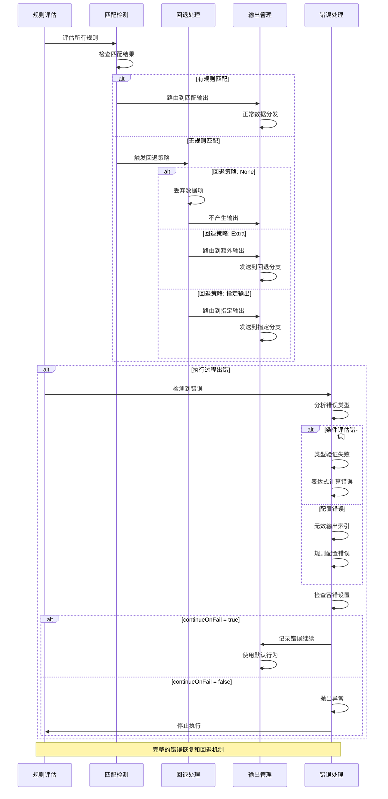
```mermaid
sequenceDiagram
    participant Rule as 规则评估
    participant Match as 匹配检测
    participant Fallback as 回退处理
    participant Output as 输出管理
    participant Error as 错误处理

    Rule->>Match: 评估所有规则
    Match->>Match: 检查匹配结果

    alt 有规则匹配
        Match->>Output: 路由到匹配输出
        Output->>Output: 正常数据分发
    else 无规则匹配
        Match->>Fallback: 触发回退策略

        alt 回退策略: None
            Fallback->>Fallback: 丢弃数据项
            Fallback->>Output: 不产生输出
        else 回退策略: Extra
            Fallback->>Output: 路由到额外输出
            Output->>Output: 发送到回退分支
        else 回退策略: 指定输出
            Fallback->>Output: 路由到指定输出
            Output->>Output: 发送到指定分支
        end
    end

    alt 执行过程出错
        Rule->>Error: 检测到错误
        Error->>Error: 分析错误类型

        alt 条件评估错误
            Error->>Error: 类型验证失败
            Error->>Error: 表达式计算错误
        else 配置错误
            Error->>Error: 无效输出索引
            Error->>Error: 规则配置错误
        end

        Error->>Error: 检查容错设置

        alt continueOnFail = true
            Error->>Output: 记录错误继续
            Output->>Output: 使用默认行为
        else continueOnFail = false
            Error->>Error: 抛出异常
            Error->>Rule: 停止执行
        end
    end

    Note over Rule,Error: 完整的错误恢复和回退机制
```

---

## 6. 实际应用场景与最佳实践

### 6.1 常见使用场景

#### 场景 1: 数据分类路由
```javascript
// 规则模式示例 - 用户状态分类
{
  "mode": "rules",
  "rules": {
    "values": [
      {
        "conditions": {
          "conditions": [
            {
              "leftValue": "={{ $json.status }}",
              "rightValue": "active",
              "operator": {
                "type": "string",
                "operation": "equals"
              }
            }
          ],
          "combinator": "and"
        },
        "outputKey": "Active Users"
      },
      {
        "conditions": {
          "conditions": [
            {
              "leftValue": "={{ $json.status }}",
              "rightValue": "inactive",
              "operator": {
                "type": "string",
                "operation": "equals"
              }
            }
          ],
          "combinator": "and"
        },
        "outputKey": "Inactive Users"
      }
    ]
  },
  "options": {
    "fallbackOutput": "extra",
    "renameFallbackOutput": "Unknown Status"
  }
}
```

#### 场景 2: 动态路由计算
```javascript
// 表达式模式示例 - 基于优先级的路由
{
  "mode": "expression",
  "numberOutputs": 5,
  "output": "={{ $json.priority > 90 ? 0 : $json.priority > 70 ? 1 : $json.priority > 50 ? 2 : $json.priority > 30 ? 3 : 4 }}"
}

// 复杂条件路由
{
  "mode": "expression",
  "numberOutputs": 3,
  "output": "={{ $json.type === 'urgent' ? 0 : ($json.assignee && $json.assignee.length > 0) ? 1 : 2 }}"
}
```

#### 场景 3: 多条件复合判断
```javascript
// 复杂规则组合示例
{
  "mode": "rules",
  "rules": {
    "values": [
      {
        "conditions": {
          "conditions": [
            {
              "leftValue": "={{ $json.amount }}",
              "rightValue": 1000,
              "operator": {
                "type": "number",
                "operation": "largerEqual"
              }
            },
            {
              "leftValue": "={{ $json.customer.tier }}",
              "rightValue": "premium",
              "operator": {
                "type": "string",
                "operation": "equals"
              }
            }
          ],
          "combinator": "and"
        },
        "outputKey": "High Value Premium"
      },
      {
        "conditions": {
          "conditions": [
            {
              "leftValue": "={{ $json.urgent }}",
              "rightValue": true,
              "operator": {
                "type": "boolean",
                "operation": "equals"
              }
            }
          ],
          "combinator": "or"
        },
        "outputKey": "Urgent Processing"
      }
    ]
  },
  "options": {
    "allMatchingOutputs": true,
    "ignoreCase": true
  }
}
```

### 6.2 工作流设计模式

#### 条件分支处理模式
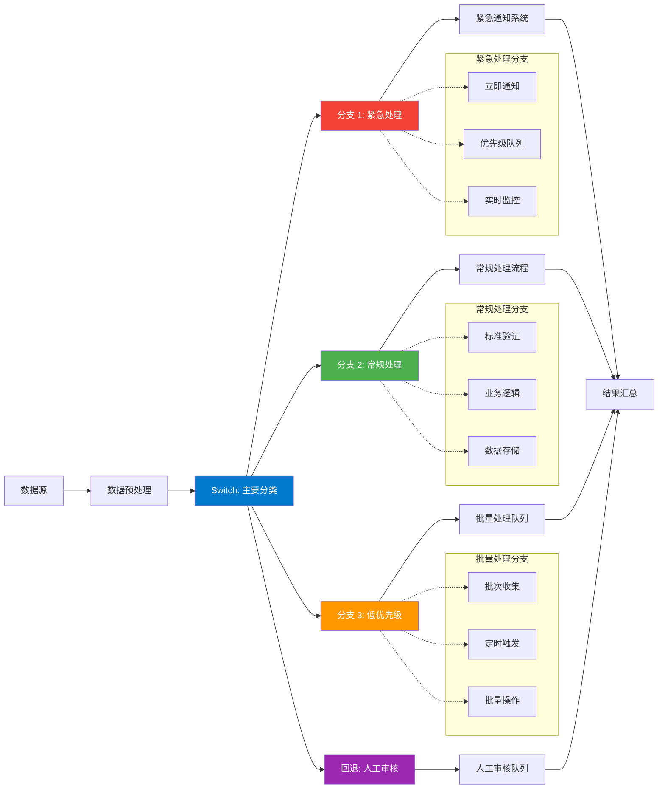
```mermaid
flowchart LR
    A[数据源] --> B[数据预处理]
    B --> C[Switch: 主要分类]

    C --> D[分支 1: 紧急处理]
    C --> E[分支 2: 常规处理]
    C --> F[分支 3: 低优先级]
    C --> G[回退: 人工审核]

    D --> H[紧急通知系统]
    E --> I[常规处理流程]
    F --> J[批量处理队列]
    G --> K[人工审核队列]

    H --> L[结果汇总]
    I --> L
    J --> L
    K --> L

    subgraph "紧急处理分支"
        M[立即通知]
        N[优先级队列]
        O[实时监控]
    end

    subgraph "常规处理分支"
        P[标准验证]
        Q[业务逻辑]
        R[数据存储]
    end

    subgraph "批量处理分支"
        S[批次收集]
        T[定时触发]
        U[批量操作]
    end

    D -.-> M
    D -.-> N
    D -.-> O

    E -.-> P
    E -.-> Q
    E -.-> R

    F -.-> S
    F -.-> T
    F -.-> U

    style C fill:#007acc,color:#fff
    style D fill:#f44336,color:#fff
    style E fill:#4CAF50,color:#fff
    style F fill:#FF9800,color:#fff
    style G fill:#9C27B0,color:#fff
```

#### 多级路由决策模式
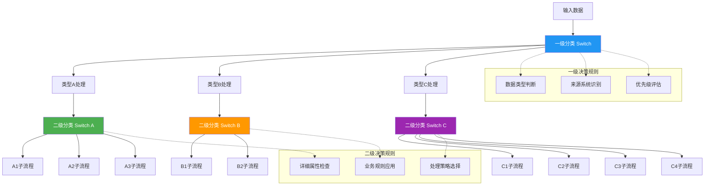
```mermaid
flowchart TD
    A[输入数据] --> B[一级分类 Switch]

    B --> C[类型A处理]
    B --> D[类型B处理]
    B --> E[类型C处理]

    C --> F[二级分类 Switch A]
    D --> G[二级分类 Switch B]
    E --> H[二级分类 Switch C]

    F --> I[A1子流程]
    F --> J[A2子流程]
    F --> K[A3子流程]

    G --> L[B1子流程]
    G --> M[B2子流程]

    H --> N[C1子流程]
    H --> O[C2子流程]
    H --> P[C3子流程]
    H --> Q[C4子流程]

    subgraph "一级决策规则"
        R[数据类型判断]
        S[来源系统识别]
        T[优先级评估]
    end

    subgraph "二级决策规则"
        U[详细属性检查]
        V[业务规则应用]
        W[处理策略选择]
    end

    B -.-> R
    B -.-> S
    B -.-> T

    F -.-> U
    G -.-> V
    H -.-> W

    style B fill:#2196F3,color:#fff
    style F fill:#4CAF50,color:#fff
    style G fill:#FF9800,color:#fff
    style H fill:#9C27B0,color:#fff
```

### 6.3 性能优化与最佳实践

#### 性能优化策略
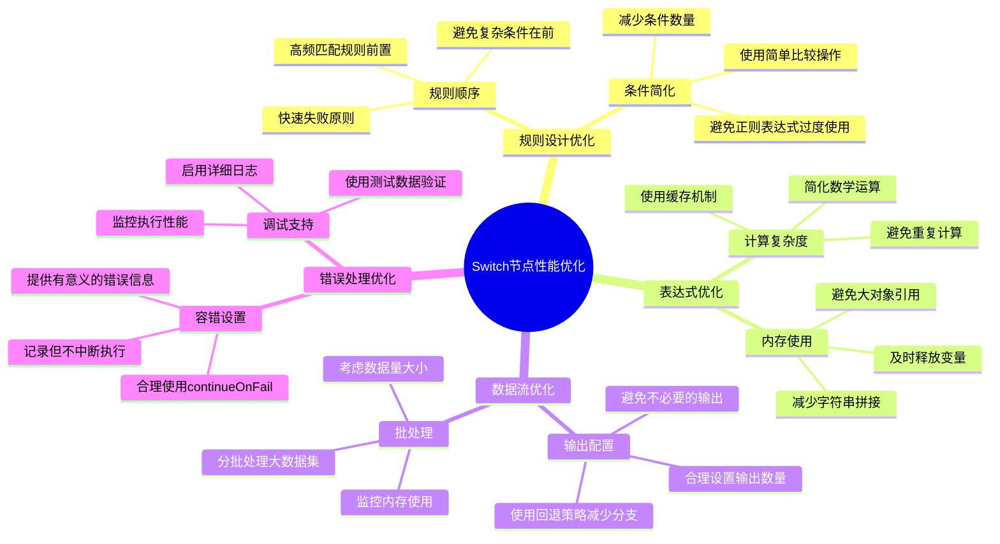
```mermaid
mindmap
  root((Switch节点性能优化))
    规则设计优化
      规则顺序
        高频匹配规则前置
        快速失败原则
        避免复杂条件在前
      条件简化
        减少条件数量
        使用简单比较操作
        避免正则表达式过度使用
    表达式优化
      计算复杂度
        避免重复计算
        使用缓存机制
        简化数学运算
      内存使用
        避免大对象引用
        及时释放变量
        减少字符串拼接
    数据流优化
      输出配置
        合理设置输出数量
        避免不必要的输出
        使用回退策略减少分支
      批处理
        考虑数据量大小
        分批处理大数据集
        监控内存使用
    错误处理优化
      容错设置
        合理使用continueOnFail
        记录但不中断执行
        提供有意义的错误信息
      调试支持
        启用详细日志
        使用测试数据验证
        监控执行性能
```

#### 调试与故障排除指南
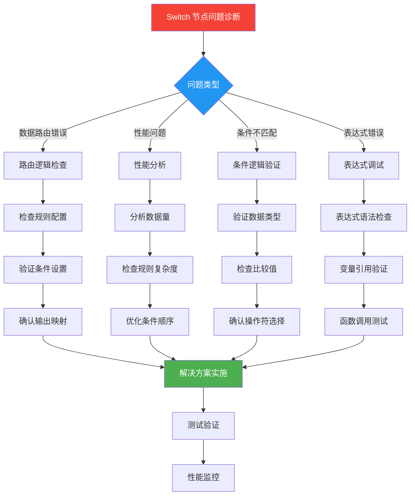
```mermaid
flowchart TD
    A[Switch 节点问题诊断] --> B{问题类型}

    B -->|数据路由错误| C[路由逻辑检查]
    B -->|性能问题| D[性能分析]
    B -->|条件不匹配| E[条件逻辑验证]
    B -->|表达式错误| F[表达式调试]

    C --> G[检查规则配置]
    G --> H[验证条件设置]
    H --> I[确认输出映射]

    D --> J[分析数据量]
    J --> K[检查规则复杂度]
    K --> L[优化条件顺序]

    E --> M[验证数据类型]
    M --> N[检查比较值]
    N --> O[确认操作符选择]

    F --> P[表达式语法检查]
    P --> Q[变量引用验证]
    Q --> R[函数调用测试]

    I --> S[解决方案实施]
    L --> S
    O --> S
    R --> S

    S --> T[测试验证]
    T --> U[性能监控]

    style A fill:#f44336,color:#fff
    style B fill:#2196F3,color:#fff
    style S fill:#4CAF50,color:#fff
```

---

## 7. 技术规格总结

### 7.1 节点接口规格
```typescript
interface SwitchNodeSpecification {
  // 基础信息
  name: 'switch';
  displayName: 'Switch';
  group: ['transform'];
  version: 1 | 2 | 3 | 3.1 | 3.2;

  // 连接配置
  inputs: [NodeConnectionTypes.Main];
  outputs: DynamicOutputConfig; // 基于配置动态生成

  // 操作模式
  modes: {
    rules: 'Rules-based routing';
    expression: 'Expression-based routing';
  };

  // 规则系统
  ruleEngine: {
    v1v2: 'Type-based rule system';
    v3plus: 'Filter component system';
  };

  // 支持的比较操作
  comparisonOperators: [
    'equals', 'notEquals',
    'contains', 'notContains',
    'startsWith', 'endsWith',
    'larger', 'smaller', 'largerEqual', 'smallerEqual',
    'before', 'after',
    'regex', 'notRegex'
  ];

  // 高级特性
  features: {
    multipleMatching: boolean;
    fallbackOutput: 'none' | 'extra' | number;
    caseInsensitive: boolean;
    typeValidation: 'strict' | 'loose';
    dynamicOutputNaming: boolean;
  };
}
```

### 7.2 版本功能对比矩阵

| 功能特性 | V1 | V2 | V3.0+ | 说明 |
|----------|----|----|-------|------|
| 输出数量 | 固定4个 | 动态配置 | 动态配置 | V2+ 支持任意数量输出 |
| 规则系统 | 数据类型枚举 | 数据类型枚举 | Filter组件 | V3+ 现代化条件系统 |
| 条件组合 | 单一条件 | 单一条件 | AND/OR组合 | V3+ 支持复杂逻辑 |
| 输出命名 | 索引编号 | 自定义名称 | 自定义名称 | V2+ 支持输出重命名 |
| 回退策略 | 不支持 | 基础支持 | 完整支持 | V3+ 全面回退机制 |
| 类型验证 | 基础 | 基础 | 严格/宽松 | V3+ 增强类型系统 |
| 多匹配输出 | 不支持 | 不支持 | 支持 | V3+ 独有特性 |
| 错误处理 | 简单 | 改进 | 完善 | 逐步增强 |

### 7.3 性能指标与限制

- **处理能力**: 高效的单遍数据扫描，O(n*m) 复杂度
- **规则数量**: 理论无限制，建议 < 50 个规则
- **输出数量**: V1固定4个，V2+理论无限制，建议 < 20 个
- **条件复杂度**: V3+ 支持复杂嵌套，注意性能影响
- **内存占用**: O(n*k) 其中 n 为数据项数量，k 为输出数量
- **执行延迟**: 毫秒级（简单规则）到秒级（复杂表达式）

### 7.4 与其他节点的集成模式

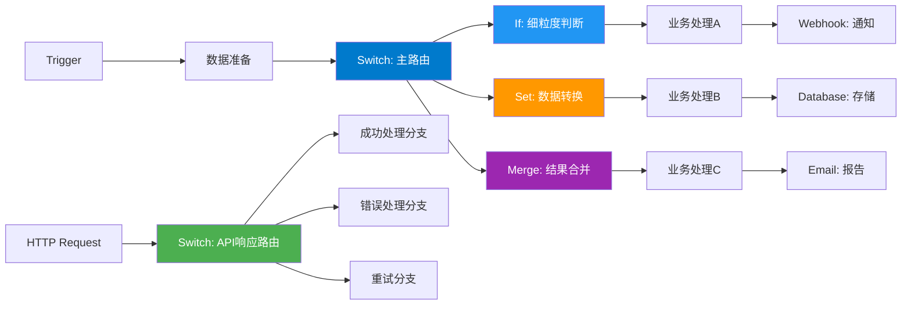
```mermaid
graph LR
    A[Trigger] --> B[数据准备]
    B --> C[Switch: 主路由]

    C --> D[If: 细粒度判断]
    C --> E[Set: 数据转换]
    C --> F[Merge: 结果合并]

    D --> G[业务处理A]
    E --> H[业务处理B]
    F --> I[业务处理C]

    G --> J[Webhook: 通知]
    H --> K[Database: 存储]
    I --> L[Email: 报告]

    M[HTTP Request] --> N[Switch: API响应路由]
    N --> O[成功处理分支]
    N --> P[错误处理分支]
    N --> Q[重试分支]

    style C fill:#007acc,color:#fff
    style N fill:#4CAF50,color:#fff
    style D fill:#2196F3,color:#fff
    style E fill:#FF9800,color:#fff
    style F fill:#9C27B0,color:#fff
```

### 7.5 最佳实践指南

#### 设计原则
1. **清晰的路由逻辑**: 确保规则简洁明了，易于理解和维护
2. **高效的规则顺序**: 将高频匹配的规则放在前面
3. **合理的回退策略**: 为无匹配情况提供适当的处理方案
4. **适当的错误处理**: 启用容错机制避免单点失败
5. **性能考虑**: 平衡功能需求与执行效率

#### 避免常见陷阱
1. **过度复杂的条件**: 避免在单个规则中使用过多条件
2. **忽略数据类型**: 注意类型验证设置，避免意外的类型转换
3. **缺乏回退处理**: 总是为无匹配情况提供处理方案
4. **规则顺序不当**: 避免让低频规则阻塞高频路径
5. **测试不充分**: 确保所有路径都经过充分测试

#### 调试技巧
1. **使用测试数据**: 创建代表性的测试数据验证规则
2. **逐步调试**: 从简单规则开始，逐步增加复杂性
3. **监控输出**: 检查每个输出分支的数据分布
4. **日志记录**: 启用详细日志追踪数据流向
5. **性能监控**: 监控执行时间识别性能瓶颈

Switch 节点作为 n8n 中的核心流程控制组件，提供了强大而灵活的数据路由能力。通过合理的配置和使用，它能够实现复杂的业务逻辑分支，是构建智能工作流的重要工具。
