# n8n Trigger 节点深度解析

## 1. 节点架构与基础信息

### 1.1 节点基本概念
Trigger（触发器）节点是 n8n 工作流的**入口点**和**起始节点**，负责监听外部事件、定时任务或手动操作，自动启动工作流执行。每个工作流必须包含至少一个触发器节点。

### 1.2 触发器分类体系
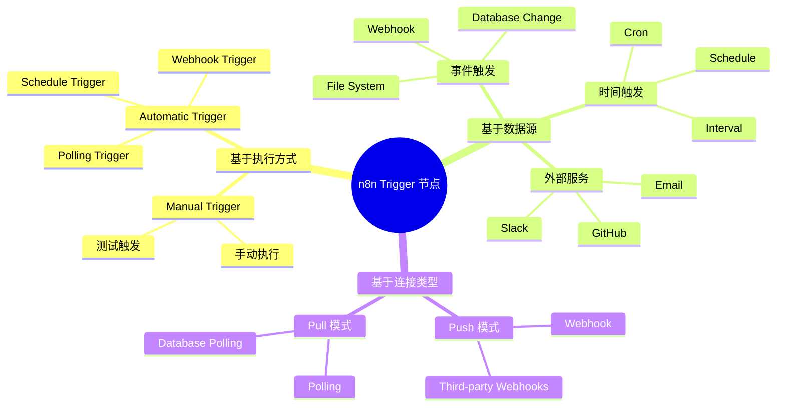

### 1.3 核心接口定义
```typescript
// packages/workflow/src/Interfaces.ts - 触发器核心接口
export interface ITriggerFunctions extends FunctionsBase {
  emit(
    data: INodeExecutionData[][],
    responsePromise?: IDeferredPromise<IExecuteResponsePromiseData>,
    donePromise?: IDeferredPromise<IRun>,
  ): void;
  emitError(error: Error, responsePromise?: IDeferredPromise<IExecuteResponsePromiseData>): void;
  getNodeParameter(parameterName: string, fallbackValue?: any): NodeParameterValueType | object;
  helpers: RequestHelperFunctions &
           BaseHelperFunctions &
           BinaryHelperFunctions &
           SSHTunnelFunctions &
           SchedulingFunctions;
}

export interface ITriggerResponse {
  closeFunction?: CloseFunction;
  manualTriggerFunction?: () => Promise<void>;
  manualTriggerResponse?: Promise<INodeExecutionData[][]>;
}
```

---

## 2. 触发器生命周期与状态管理

### 2.1 触发器生命周期
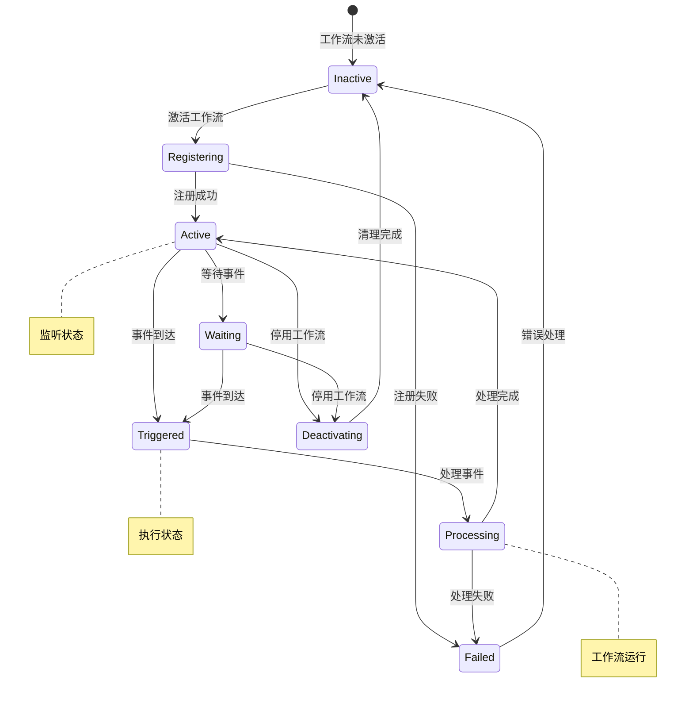

### 2.2 激活与注册流程
```typescript
// packages/core/src/execution-engine/active-workflows.ts - 触发器激活
export class ActiveWorkflows {
  async add(
    workflowId: string,
    workflow: Workflow,
    additionalData: IWorkflowExecuteAdditionalData,
    mode: WorkflowExecuteMode,
    activation: WorkflowActivateMode,
    getTriggerFunctions: IGetExecuteTriggerFunctions,
    getPollFunctions: IGetExecutePollFunctions,
  ) {
    const triggerNodes = workflow.getTriggerNodes();
    const triggerResponses: ITriggerResponse[] = [];

    // 1. 激活所有触发器节点
    for (const triggerNode of triggerNodes) {
      const triggerResponse = await this.triggersAndPollers.runTrigger(
        workflow, triggerNode, getTriggerFunctions, additionalData, mode, activation
      );
      if (triggerResponse !== undefined) {
        triggerResponses.push(triggerResponse);
      }
    }

    // 2. 激活所有轮询节点
    const pollingNodes = workflow.getPollNodes();
    for (const pollNode of pollingNodes) {
      await this.activatePolling(pollNode, workflow, additionalData, getPollFunctions, mode, activation);
    }

    // 3. 保存激活状态
    this.activeWorkflows[workflowId] = { triggerResponses };
  }
}
```

---

## 3. 触发器类型详解

### 3.1 Manual Trigger（手动触发器）

#### 基本信息
- **源码路径**: `packages/nodes-base/nodes/ManualTrigger/ManualTrigger.node.ts`
- **用途**: 手动测试和执行工作流
- **特点**: 无外部依赖，仅响应用户点击

#### 实现分析
```typescript
export class ManualTrigger implements INodeType {
  description: INodeTypeDescription = {
    displayName: 'Manual Trigger',
    name: 'manualTrigger',
    group: ['trigger'],
    maxNodes: 1,  // 每个工作流只能有一个
    inputs: [],
    outputs: [NodeConnectionTypes.Main],
  };

  async trigger(this: ITriggerFunctions): Promise<ITriggerResponse> {
    const manualTriggerFunction = async () => {
      // 发射空的初始数据
      this.emit([this.helpers.returnJsonArray([{}])]);
    };

    return { manualTriggerFunction };
  }
}
```

### 3.2 Webhook Trigger（Webhook 触发器）

#### 架构与组件
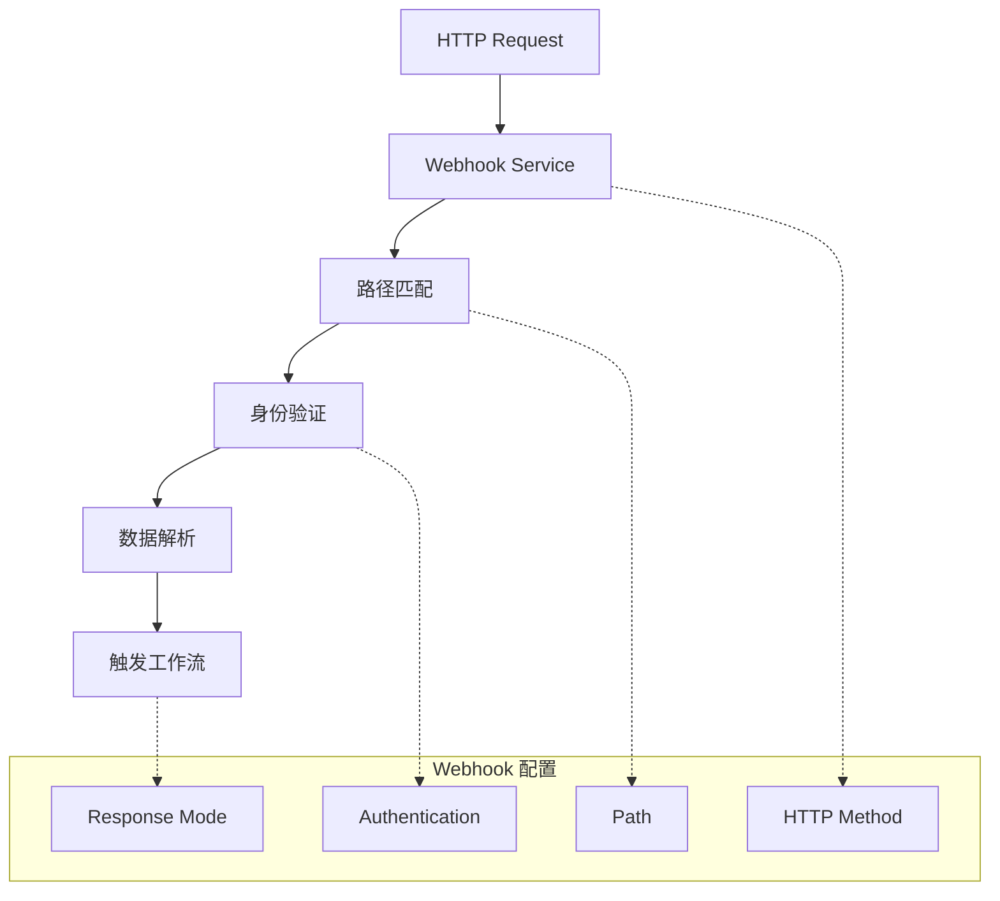

#### 核心实现
```typescript
// packages/nodes-base/nodes/Webhook/Webhook.node.ts
export class Webhook extends Node {
  description: INodeTypeDescription = {
    displayName: 'Webhook',
    name: 'webhook',
    group: ['trigger'],
    supportsCORS: true,
    webhooks: [defaultWebhookDescription],
    properties: [
      {
        displayName: 'Path',
        name: 'path',
        type: 'string',
        required: true,
        description: "The path to listen to, e.g. 'webhook'"
      },
      {
        displayName: 'HTTP Method',
        name: 'httpMethod',
        type: 'options',
        options: ['GET', 'POST', 'PUT', 'DELETE', 'PATCH', 'HEAD'],
        default: 'GET'
      }
    ]
  };

  async webhook(context: IWebhookFunctions): Promise<IWebhookResponseData> {
    const req = context.getRequestObject();
    const resp = context.getResponseObject();

    // 1. IP 白名单检查
    if (!isIpWhitelisted(options.ipWhitelist, req.ips, req.ip)) {
      resp.writeHead(403);
      resp.end('IP is not whitelisted!');
      return { noWebhookResponse: true };
    }

    // 2. 身份验证
    await this.validateAuth(context);

    // 3. 处理不同数据类型
    if (context.getHeaderData()['content-type']?.includes('multipart/form-data')) {
      return await this.handleFormData(context, prepareOutput);
    }

    if (options.binaryData) {
      return await this.handleBinaryData(context, prepareOutput);
    }

    // 4. 标准数据处理
    const bodyData = context.getBodyData();
    const headerData = context.getHeaderData();
    const queryData = context.getQueryData();

    const responseData = { body: bodyData, headers: headerData, query: queryData };
    return { workflowData: [[{ json: responseData }]] };
  }
}
```

### 3.3 Schedule Trigger（定时触发器）

#### Cron 表达式处理
```typescript
// packages/nodes-base/nodes/Schedule/ScheduleTrigger.node.ts
export class ScheduleTrigger implements INodeType {
  async trigger(this: ITriggerFunctions): Promise<ITriggerResponse> {
    const { interval: intervals } = this.getNodeParameter('rule', []) as Rule;
    const timezone = this.getTimezone();

    const executeTrigger = (recurrence: IRecurrenceRule) => {
      const shouldTrigger = recurrenceCheck(recurrence, staticData.recurrenceRules, timezone);
      if (!shouldTrigger) return;

      const momentTz = moment.tz(timezone);
      const resultData = {
        timestamp: momentTz.toISOString(true),
        'Readable date': momentTz.format('MMMM Do YYYY, h:mm:ss a'),
        'Day of week': momentTz.format('dddd'),
        Year: momentTz.format('YYYY'),
        Month: momentTz.format('MMMM'),
        // ... 更多时间字段
      };

      this.emit([this.helpers.returnJsonArray([resultData])]);
    };

    // 注册 Cron 任务
    if (this.getMode() !== 'manual') {
      for (const { cronExpression } of rules) {
        this.helpers.registerCron(cronExpression, () => executeTrigger(recurrence));
      }
      return {};
    }

    // 手动模式立即执行
    return {
      manualTriggerFunction: async () => executeTrigger(rules[0].recurrence)
    };
  }
}
```

#### 定时规则配置
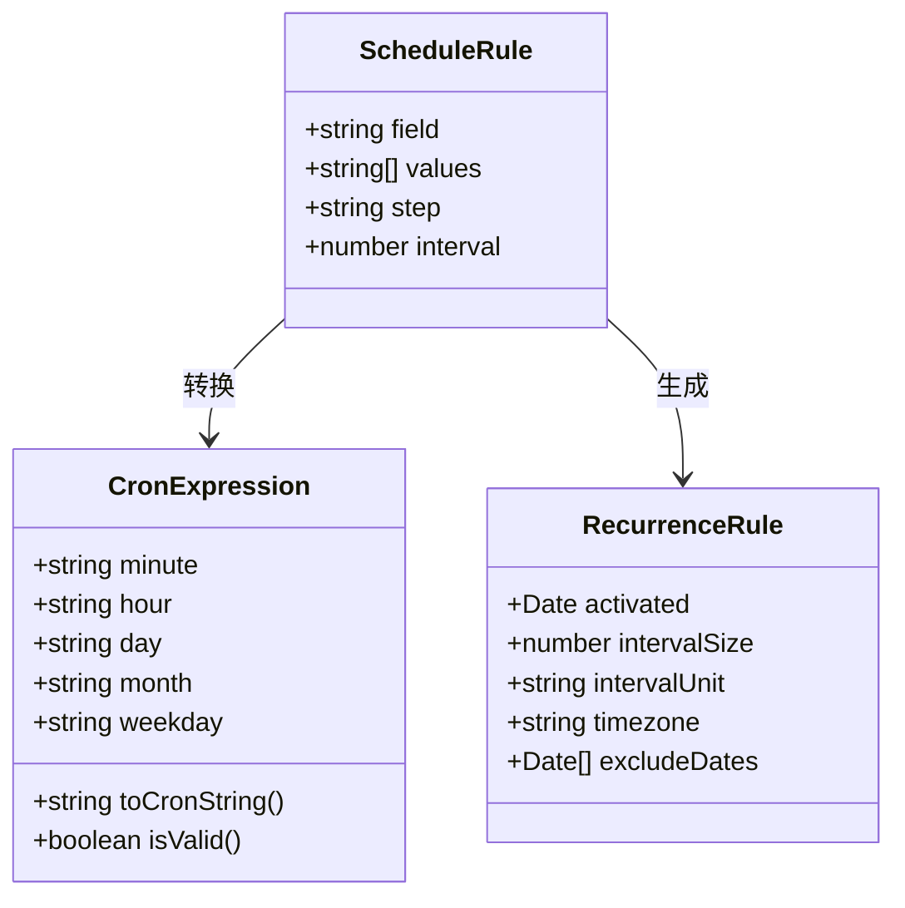

### 3.4 Polling Trigger（轮询触发器）

#### 轮询机制实现
```typescript
// packages/core/src/execution-engine/active-workflows.ts - 轮询激活
private async activatePolling(
  node: INode,
  workflow: Workflow,
  additionalData: IWorkflowExecuteAdditionalData,
  getPollFunctions: IGetExecutePollFunctions,
  mode: WorkflowExecuteMode,
  activation: WorkflowActivateMode,
): Promise<void> {
  const pollFunctions = getPollFunctions(workflow, node, additionalData, mode, activation);

  const pollTimes = pollFunctions.getNodeParameter('pollTimes') as { item: TriggerTime[] };
  const cronTimes = (pollTimes.item || []).map(toCronExpression);

  const executeTrigger = async (testingTrigger = false) => {
    try {
      const pollResponse = await this.triggersAndPollers.runPoll(workflow, node, pollFunctions);
      if (pollResponse !== null) {
        pollFunctions.__emit(pollResponse);
      }
    } catch (error) {
      if (testingTrigger) throw error;
      pollFunctions.__emitError(error as Error);
    }
  };

  // 测试轮询是否工作
  await executeTrigger(true);

  // 注册定时轮询
  for (const cronTime of cronTimes) {
    this.scheduledTaskManager.registerCron(workflow, cronTime, executeTrigger);
  }
}
```

#### 轮询节点示例
```typescript
// 以 Airtable Trigger 为例
export class AirtableTrigger implements INodeType {
  async poll(this: IPollFunctions): Promise<INodeExecutionData[][] | null> {
    const webhookData = this.getWorkflowStaticData('node');
    const triggerField = this.getNodeParameter('triggerField') as string;

    const now = moment().utc().format();
    const startDate = (webhookData.lastTimeChecked as string) || now;
    const endDate = now;

    // 构建查询过滤器
    const qs: IDataObject = {
      filterByFormula: `IS_AFTER({${triggerField}}, DATETIME_PARSE("${startDate}", "YYYY-MM-DD HH:mm:ss"))`
    };

    // 获取变更记录
    const { records } = await apiRequestAllItems.call(this, 'GET', endpoint, {}, qs);

    // 更新检查时间
    webhookData.lastTimeChecked = endDate;

    return Array.isArray(records) && records.length
      ? [this.helpers.returnJsonArray(records)]
      : null;
  }
}
```

### 3.5 第三方服务触发器

#### Webhook 方法系统
```typescript
// 第三方服务触发器通用模式
export class ThirdPartyTrigger implements INodeType {
  webhookMethods = {
    default: {
      // 检查 webhook 是否存在
      async checkExists(this: IHookFunctions): Promise<boolean> {
        const webhookData = this.getWorkflowStaticData('node');
        if (!webhookData.webhookId) return false;

        try {
          await apiRequest.call(this, 'GET', `/webhooks/${webhookData.webhookId}`);
          return true;
        } catch {
          return false;
        }
      },

      // 创建 webhook
      async create(this: IHookFunctions): Promise<boolean> {
        const webhookUrl = this.getNodeWebhookUrl('default');
        const webhookData = this.getWorkflowStaticData('node');
        const events = this.getNodeParameter('events') as string[];

        const body = {
          url: webhookUrl,
          events,
          name: `n8n-webhook:${webhookUrl}`
        };

        const response = await apiRequest.call(this, 'POST', '/webhooks', body);
        webhookData.webhookId = response.id;
        return true;
      },

      // 删除 webhook
      async delete(this: IHookFunctions): Promise<boolean> {
        const webhookData = this.getWorkflowStaticData('node');
        try {
          await apiRequest.call(this, 'DELETE', `/webhooks/${webhookData.webhookId}`);
          delete webhookData.webhookId;
          return true;
        } catch {
          return false;
        }
      }
    }
  };

  async webhook(this: IWebhookFunctions): Promise<IWebhookResponseData> {
    const bodyData = this.getBodyData();
    return {
      workflowData: [this.helpers.returnJsonArray([bodyData])]
    };
  }
}
```

---

## 4. 触发器执行引擎详解

### 4.1 触发器运行流程
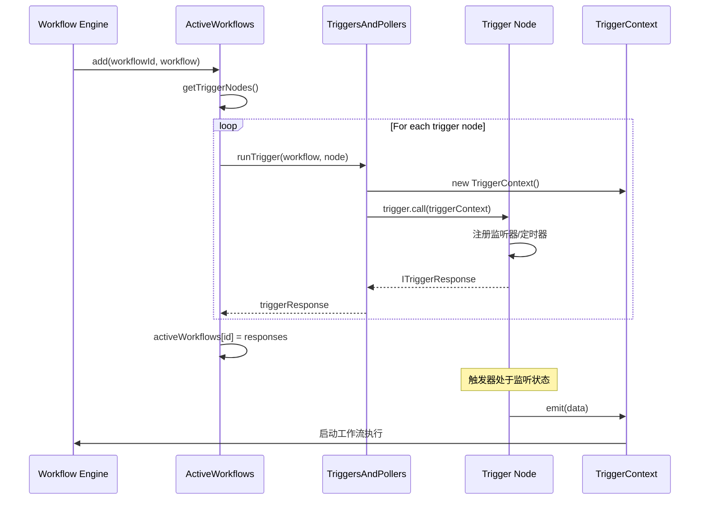

### 4.2 手动模式与自动模式
```typescript
// packages/core/src/execution-engine/triggers-and-pollers.ts
export class TriggersAndPollers {
  async runTrigger(
    workflow: Workflow,
    node: INode,
    getTriggerFunctions: IGetExecuteTriggerFunctions,
    additionalData: IWorkflowExecuteAdditionalData,
    mode: WorkflowExecuteMode,
    activation: WorkflowActivateMode,
  ): Promise<ITriggerResponse | undefined> {
    const triggerFunctions = getTriggerFunctions(workflow, node, additionalData, mode, activation);
    const nodeType = workflow.nodeTypes.getByNameAndVersion(node.type, node.typeVersion);

    if (mode === 'manual') {
      // 手动模式：创建手动触发响应
      const triggerResponse = await nodeType.trigger.call(triggerFunctions);

      triggerResponse!.manualTriggerResponse = new Promise((resolve, reject) => {
        // 重写 emit 和 emitError 函数
        triggerFunctions.emit = (data, responsePromise?, donePromise?) => {
          if (responsePromise) {
            hooks.addHandler('sendResponse', (response) => responsePromise.resolve(response));
          }
          if (donePromise) {
            hooks.addHandler('workflowExecuteAfter', (runData) => donePromise.resolve(runData));
          }
          resolve(data);
        };

        triggerFunctions.emitError = (error, responsePromise?) => {
          if (responsePromise) {
            hooks.addHandler('sendResponse', () => responsePromise.reject(error));
          }
          reject(error);
        };
      });

      return triggerResponse;
    }

    // 自动模式：直接启动触发器
    return await nodeType.trigger.call(triggerFunctions);
  }
}
```

### 4.3 触发器上下文实现
```typescript
// packages/core/src/execution-engine/node-execution-context/trigger-context.ts
export class TriggerContext extends NodeExecutionContext implements ITriggerFunctions {
  constructor(
    workflow: Workflow,
    node: INode,
    additionalData: IWorkflowExecuteAdditionalData,
    mode: WorkflowExecuteMode,
    private readonly activation: WorkflowActivateMode,
    readonly emit: ITriggerFunctions['emit'] = throwOnEmit,
    readonly emitError: ITriggerFunctions['emitError'] = throwOnEmitError,
  ) {
    super(workflow, node, additionalData, mode);

    this.helpers = {
      createDeferredPromise,
      returnJsonArray,
      ...getSSHTunnelFunctions(),
      ...getRequestHelperFunctions(workflow, node, additionalData),
      ...getBinaryHelperFunctions(additionalData, workflow.id),
      ...getSchedulingFunctions(workflow),  // 提供 registerCron 等调度功能
    };
  }

  getActivationMode() {
    return this.activation;  // 'init' | 'create' | 'update' | 'activate'
  }
}
```

---

## 5. 触发器数据流与处理

### 5.1 数据流架构
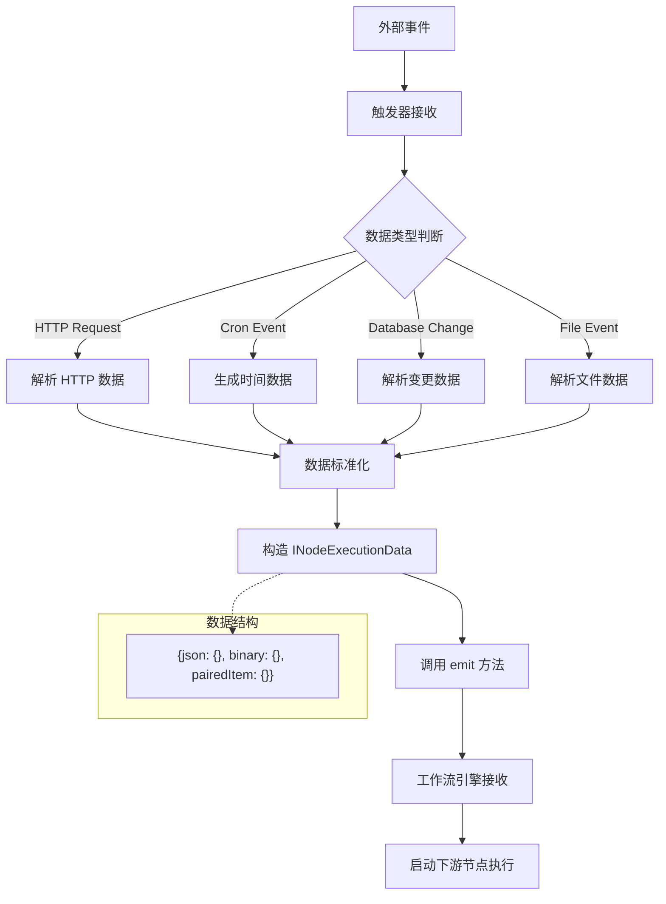

### 5.2 数据标准化处理
```typescript
// 触发器数据标准化模式
interface TriggerDataPattern {
  // 1. HTTP 数据模式
  webhookData: {
    body: IDataObject;
    headers: IncomingHttpHeaders;
    query: IDataObject;
    params: IDataObject;
  };

  // 2. 时间数据模式
  scheduleData: {
    timestamp: string;
    'Readable date': string;
    'Day of week': string;
    Year: string;
    Month: string;
    Hour: string;
    Minute: string;
    Timezone: string;
  };

  // 3. 轮询数据模式
  pollingData: {
    records: IDataObject[];
    lastChecked: string;
    newRecords: number;
  };
}

// 数据构造辅助函数
function constructTriggerData(rawData: any, dataType: 'webhook' | 'schedule' | 'polling'): INodeExecutionData[] {
  switch (dataType) {
    case 'webhook':
      return [{
        json: {
          body: rawData.body,
          headers: rawData.headers,
          query: rawData.query
        },
        binary: rawData.binary || {}
      }];

    case 'schedule':
      return [{
        json: {
          timestamp: new Date().toISOString(),
          timezone: Intl.DateTimeFormat().resolvedOptions().timeZone,
          // ... 其他时间字段
        }
      }];

    case 'polling':
      return rawData.records.map((record: IDataObject) => ({
        json: record,
        pairedItem: { item: 0 }
      }));

    default:
      return [{ json: rawData }];
  }
}
```

---

## 6. 错误处理与容错机制

### 6.1 触发器错误类型
```typescript
// packages/workflow/src/errors/trigger-close.error.ts
export class TriggerCloseError extends ApplicationError {
  constructor(
    readonly node: INode,
    { cause, level }: TriggerCloseErrorOptions,
  ) {
    super('Trigger Close Failed', { cause, extra: { nodeName: node.name } });
    this.level = level;
  }
}

// packages/workflow/src/errors/workflow-activation.error.ts
export class WorkflowActivationError extends ExecutionBaseError {
  constructor(message: string, options: { cause?: Error; node?: INode } = {}) {
    super(message, options);
    this.name = 'WorkflowActivationError';
  }
}
```

### 6.2 错误处理流程
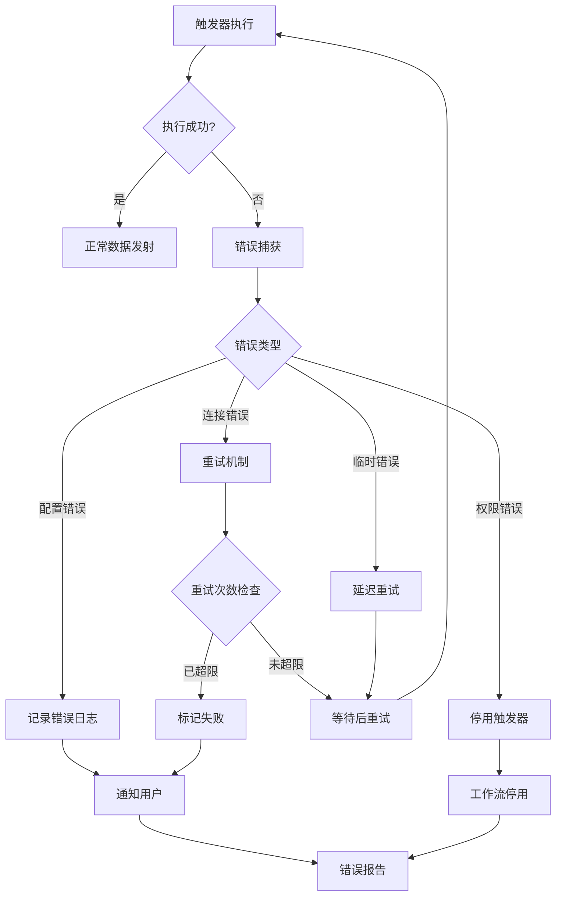

### 6.3 错误处理实现
```typescript
// packages/core/src/execution-engine/active-workflows.ts - 错误处理
private async closeTrigger(response: ITriggerResponse, workflowId: string) {
  if (!response.closeFunction) return;

  try {
    await response.closeFunction();
  } catch (e) {
    if (e instanceof TriggerCloseError) {
      this.logger.error(
        `Problem calling "closeFunction" on "${e.node.name}" in workflow "${workflowId}"`
      );
      this.errorReporter.error(e, { extra: { workflowId } });
      return;
    }

    const error = e instanceof Error ? e : new Error(`${e}`);
    throw new WorkflowDeactivationError(
      `Failed to deactivate trigger of workflow ID "${workflowId}": "${error.message}"`,
      { cause: error, workflowId }
    );
  }
}

// 轮询错误处理
const executeTrigger = async (testingTrigger = false) => {
  try {
    const pollResponse = await this.triggersAndPollers.runPoll(workflow, node, pollFunctions);
    if (pollResponse !== null) {
      pollFunctions.__emit(pollResponse);
    }
  } catch (error) {
    // 测试阶段抛出错误让用户知道问题
    if (testingTrigger) {
      throw error;
    }
    // 运行时记录错误但继续
    pollFunctions.__emitError(error as Error);
  }
};
```

---

## 7. 性能优化与监控

### 7.1 性能优化策略
```typescript
// 触发器性能优化配置
interface TriggerOptimizationConfig {
  // 轮询优化
  polling: {
    minInterval: number;        // 最小轮询间隔（防止过于频繁）
    maxConcurrent: number;      // 最大并发轮询数
    timeout: number;            // 轮询超时时间
    retryDelay: number;         // 重试延迟
  };

  // Webhook 优化
  webhook: {
    requestTimeout: number;     // 请求超时
    bodyLimit: string;          // 请求体大小限制
    ipWhitelist: string[];      // IP 白名单
    rateLimiting: {             // 频率限制
      windowMs: number;
      max: number;
    };
  };

  // 内存优化
  memory: {
    maxExecutionHistory: number;  // 最大执行历史保存数量
    cleanupInterval: number;      // 清理间隔
    staticDataLimit: number;      // 静态数据大小限制
  };
}
```

### 7.2 监控指标收集
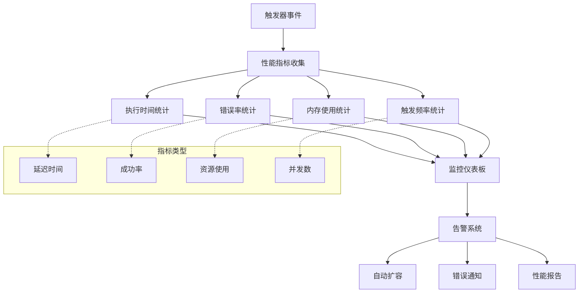

---

## 8. 触发器开发最佳实践

### 8.1 自定义触发器模板
```typescript
export class CustomTrigger implements INodeType {
  description: INodeTypeDescription = {
    displayName: 'Custom Trigger',
    name: 'customTrigger',
    icon: 'file:custom.svg',
    group: ['trigger'],
    version: 1,
    description: 'Custom trigger description',
    defaults: {
      name: 'Custom Trigger',
      color: '#772244'
    },
    inputs: [],
    outputs: [NodeConnectionTypes.Main],
    properties: [
      {
        displayName: 'Trigger Configuration',
        name: 'config',
        type: 'collection',
        default: {},
        options: [
          {
            displayName: 'Event Type',
            name: 'eventType',
            type: 'options',
            options: [
              { name: 'Custom Event', value: 'custom' },
              { name: 'Scheduled Event', value: 'scheduled' }
            ],
            default: 'custom'
          }
        ]
      }
    ]
  };

  async trigger(this: ITriggerFunctions): Promise<ITriggerResponse> {
    const config = this.getNodeParameter('config') as IDataObject;

    if (config.eventType === 'scheduled') {
      return this.setupScheduledTrigger();
    } else {
      return this.setupEventTrigger();
    }
  }

  private setupScheduledTrigger(): ITriggerResponse {
    const cronExpression = '0 */5 * * * *'; // 每5分钟

    const executeTrigger = () => {
      const data = {
        timestamp: new Date().toISOString(),
        eventType: 'scheduled',
        triggerName: this.getNode().name
      };

      this.emit([this.helpers.returnJsonArray([data])]);
    };

    this.helpers.registerCron(cronExpression, executeTrigger);

    return {
      manualTriggerFunction: async () => executeTrigger()
    };
  }

  private setupEventTrigger(): ITriggerResponse {
    // 设置外部事件监听
    const eventListener = (eventData: any) => {
      const processedData = this.processEventData(eventData);
      this.emit([this.helpers.returnJsonArray([processedData])]);
    };

    // 注册清理函数
    const closeFunction = async () => {
      // 清理事件监听器
      console.log('Cleaning up custom trigger');
    };

    return {
      closeFunction,
      manualTriggerFunction: async () => {
        const testData = { test: true, timestamp: new Date().toISOString() };
        this.emit([this.helpers.returnJsonArray([testData])]);
      }
    };
  }

  private processEventData(eventData: any): IDataObject {
    return {
      originalData: eventData,
      processedAt: new Date().toISOString(),
      triggerNode: this.getNode().name
    };
  }
}
```

### 8.2 开发规范与注意事项

#### 设计原则
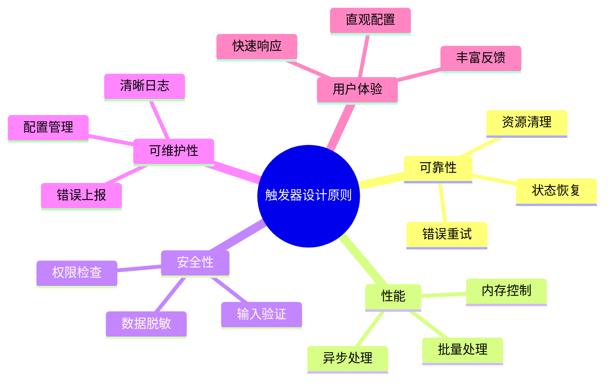

#### 开发检查清单
```typescript
interface TriggerDevelopmentChecklist {
  // 基础功能
  basicFunctionality: {
    implementsTriggerMethod: boolean;
    hasProperNodeDescription: boolean;
    returnsCorrectTriggerResponse: boolean;
    handlesManualExecution: boolean;
  };

  // 错误处理
  errorHandling: {
    implementsCloseFunction: boolean;
    handlesConnectionErrors: boolean;
    providesErrorMessages: boolean;
    hasRetryMechanism: boolean;
  };

  // 性能考虑
  performance: {
    avoidsMemoryLeaks: boolean;
    handlesHighFrequency: boolean;
    optimizesNetworkCalls: boolean;
    limitsResourceUsage: boolean;
  };

  // 安全性
  security: {
    validatesInput: boolean;
    implementsAuthentication: boolean;
    sanitizesOutput: boolean;
    followsSecurityPractices: boolean;
  };

  // 测试覆盖
  testing: {
    hasUnitTests: boolean;
    hasIntegrationTests: boolean;
    hasManualTestInstructions: boolean;
    testedErrorScenarios: boolean;
  };
}
```

---

## 9. 触发器节点完整分类

### 9.1 核心触发器节点 (8个)
| 节点名称 | 类型 | 功能描述 | 源码路径 |
|---------|------|----------|----------|
| **Manual Trigger** | 手动 | 手动执行工作流 | `nodes/ManualTrigger/` |
| **Webhook** | HTTP | 接收 HTTP 请求 | `nodes/Webhook/` |
| **Schedule Trigger** | 定时 | 基于 Cron 表达式定时 | `nodes/Schedule/` |
| **Cron** | 定时 | 简化的定时配置 | `nodes/Cron/` |
| **Workflow Trigger** | 内部 | 工作流生命周期事件 | `nodes/WorkflowTrigger/` |
| **N8n Trigger** | 内部 | n8n 系统事件 | `nodes/N8nTrigger/` |
| **Wait** | 延迟 | 等待指定时间或条件 | `nodes/Wait/` |
| **Start** | 起始 | 工作流起始节点 | `nodes/Start/` |

### 9.2 数据库触发器 (12个)
| 节点名称 | 数据库类型 | 触发方式 | 特色功能 |
|---------|------------|----------|----------|
| **Postgres Trigger** | PostgreSQL | LISTEN/NOTIFY | 实时数据库事件 |
| **MySQL Trigger** | MySQL | 轮询 | 变更检测 |
| **MongoDB Trigger** | MongoDB | Change Streams | 文档变更监听 |
| **Redis Trigger** | Redis | Pub/Sub | 消息订阅 |
| **InfluxDB Trigger** | InfluxDB | 轮询 | 时序数据监控 |
| **QuestDB Trigger** | QuestDB | 轮询 | 高性能时序数据 |
| **Supabase Trigger** | Supabase | 实时监听 | 实时数据库 |
| **Firebase Trigger** | Firebase | 实时监听 | 文档变更 |
| **Airtable Trigger** | Airtable | 轮询 | 记录变更检测 |
| **Google Sheets Trigger** | Google Sheets | 轮询 | 表格数据变更 |
| **Microsoft Excel Trigger** | Excel Online | 轮询 | 表格监控 |
| **Notion Trigger** | Notion | 轮询 | 页面/数据库变更 |

### 9.3 云服务触发器 (45个)

#### Google 生态系统 (8个)
| 节点名称 | 服务类型 | 触发事件 |
|---------|----------|----------|
| **Google Calendar Trigger** | 日历 | 事件创建/更新/开始/结束 |
| **Gmail Trigger** | 邮件 | 新邮件/标签变更 |
| **Google Drive Trigger** | 存储 | 文件变更/共享 |
| **Google Sheets Trigger** | 表格 | 数据变更 |
| **Google Forms Trigger** | 表单 | 新提交 |
| **Google Cloud Functions Trigger** | 计算 | 函数调用 |
| **Google Cloud Storage Trigger** | 存储 | 对象变更 |
| **YouTube Trigger** | 视频 | 频道更新 |

#### Microsoft 生态系统 (6个)
| 节点名称 | 服务类型 | 触发事件 |
|---------|----------|----------|
| **Outlook Trigger** | 邮件 | 新邮件/日历事件 |
| **Microsoft Teams Trigger** | 协作 | 消息/频道事件 |
| **OneDrive Trigger** | 存储 | 文件变更 |
| **SharePoint Trigger** | 协作 | 列表/文档变更 |
| **Power BI Trigger** | 分析 | 数据集更新 |
| **Azure Functions Trigger** | 计算 | 函数触发 |

#### AWS 生态系统 (5个)
| 节点名称 | 服务类型 | 触发事件 |
|---------|----------|----------|
| **S3 Trigger** | 存储 | 对象创建/删除 |
| **Lambda Trigger** | 计算 | 函数调用 |
| **SQS Trigger** | 队列 | 消息到达 |
| **SNS Trigger** | 通知 | 主题消息 |
| **CloudWatch Trigger** | 监控 | 指标告警 |

#### 开发平台 (12个)
| 节点名称 | 平台 | 触发事件 |
|---------|------|----------|
| **GitHub Trigger** | GitHub | Push/PR/Issue 事件 |
| **GitLab Trigger** | GitLab | 代码提交/合并 |
| **Bitbucket Trigger** | Bitbucket | 仓库事件 |
| **Jira Trigger** | Jira | Issue 变更 |
| **Confluence Trigger** | Confluence | 页面更新 |
| **Slack Trigger** | Slack | 消息/频道事件 |
| **Discord Trigger** | Discord | 消息/服务器事件 |
| **Telegram Trigger** | Telegram | 机器人消息 |
| **WhatsApp Trigger** | WhatsApp | 消息接收 |
| **Zoom Trigger** | Zoom | 会议事件 |
| **Cal Trigger** | Cal.com | 预约事件 |
| **Calendly Trigger** | Calendly | 预约安排 |

#### 其他云服务 (14个)
| 节点名称 | 服务类型 | 触发事件 |
|---------|----------|----------|
| **Stripe Trigger** | 支付 | 付款/订阅事件 |
| **PayPal Trigger** | 支付 | 交易事件 |
| **Shopify Trigger** | 电商 | 订单/产品事件 |
| **WooCommerce Trigger** | 电商 | 店铺事件 |
| **Mailchimp Trigger** | 邮件营销 | 订阅/活动事件 |
| **HubSpot Trigger** | CRM | 联系人/交易事件 |
| **Salesforce Trigger** | CRM | 记录变更 |
| **Zendesk Trigger** | 客服 | 工单事件 |
| **Intercom Trigger** | 客服 | 对话事件 |
| **Twilio Trigger** | 通信 | 短信/电话事件 |
| **SendGrid Trigger** | 邮件 | 邮件事件 |
| **Typeform Trigger** | 表单 | 新提交 |
| **Webflow Trigger** | 网站 | 内容更新 |
| **WordPress Trigger** | CMS | 内容变更 |

### 9.4 监控与集成触发器 (15个)
| 节点名称 | 监控类型 | 功能描述 |
|---------|----------|----------|
| **Uptime Robot Trigger** | 网站监控 | 网站状态变更 |
| **Pingdom Trigger** | 性能监控 | 性能指标告警 |
| **New Relic Trigger** | APM | 应用性能事件 |
| **Datadog Trigger** | 监控 | 指标告警 |
| **Sentry Trigger** | 错误监控 | 错误事件 |
| **PagerDuty Trigger** | 事件响应 | 事件触发 |
| **Grafana Trigger** | 可视化 | 告警通知 |
| **Jenkins Trigger** | CI/CD | 构建事件 |
| **CircleCI Trigger** | CI/CD | 管道状态 |
| **Travis CI Trigger** | CI/CD | 构建结果 |
| **Docker Hub Trigger** | 容器 | 镜像更新 |
| **Kubernetes Trigger** | 容器编排 | 集群事件 |
| **Ansible Trigger** | 自动化 | 任务执行 |
| **Terraform Trigger** | 基础设施 | 资源变更 |
| **Nagios Trigger** | 监控 | 服务状态 |

---

## 10. 源码结构与技术架构

### 10.1 核心目录结构
```
packages/
├── workflow/src/
│   ├── Interfaces.ts           # 触发器核心接口定义
│   ├── NodeHelpers.ts          # 节点辅助函数
│   └── errors/
│       └── trigger-close.error.ts
├── core/src/execution-engine/
│   ├── active-workflows.ts     # 活跃工作流管理
│   ├── triggers-and-pollers.ts # 触发器执行器
│   ├── node-execution-context/
│   │   ├── trigger-context.ts  # 触发器上下文
│   │   └── poll-context.ts     # 轮询上下文
│   └── scheduled-task-manager.ts
└── nodes-base/nodes/
    ├── ManualTrigger/          # 手动触发器
    ├── Webhook/                # Webhook 触发器
    ├── Schedule/               # 定时触发器
    └── [各种第三方触发器]/
```

### 10.2 架构交互图
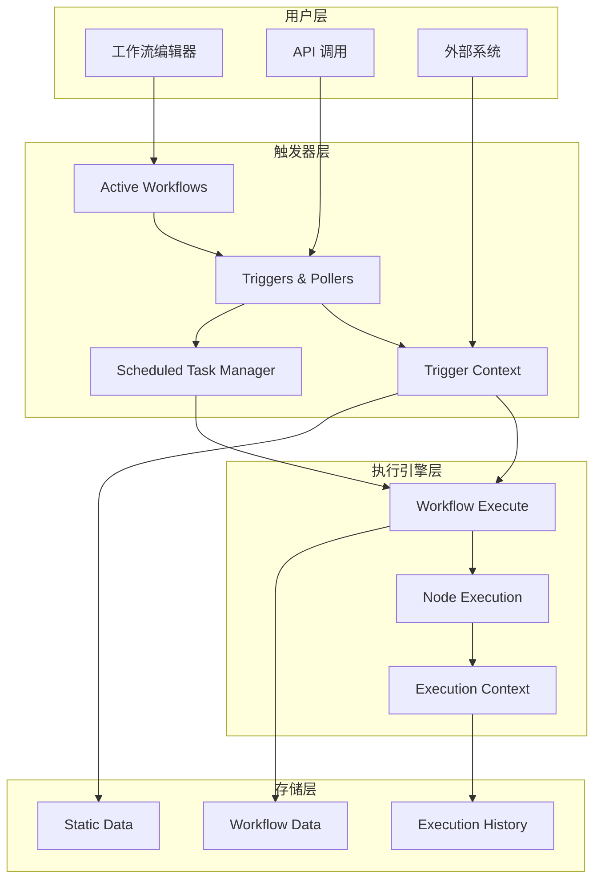

---

## 11. 总结与发展方向

### 11.1 触发器系统特点
1. **高度模块化**: 每种触发器都是独立的节点实现
2. **类型丰富**: 支持手动、定时、事件、轮询等多种触发方式
3. **易于扩展**: 基于统一接口，便于开发自定义触发器
4. **错误容错**: 完善的错误处理和重试机制
5. **性能优化**: 支持批处理、限流等性能优化策略

### 11.2 技术演进趋势
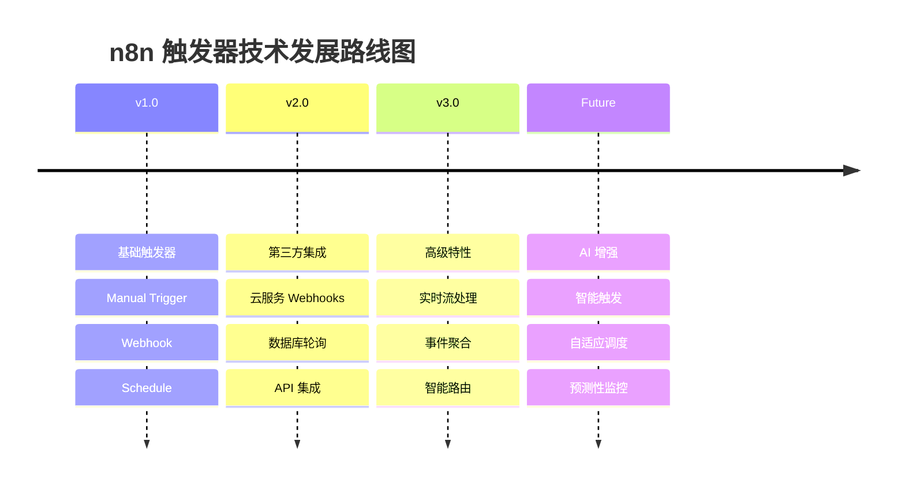

### 11.3 最佳实践总结
- **设计阶段**: 明确触发条件，选择合适的触发器类型
- **配置阶段**: 合理设置轮询间隔，避免频率过高
- **监控阶段**: 关注触发器性能指标，及时发现问题
- **维护阶段**: 定期清理无用的触发器，优化资源使用

> **总结**: n8n 的触发器系统是一个功能强大、架构清晰的事件驱动框架，通过统一的接口设计和丰富的实现类型，为用户提供了灵活可靠的工作流自动化能力。其模块化的设计使得系统具有良好的可扩展性和维护性，是现代工作流自动化平台的典型实现。
