# n8n Wait 节点深度解析

## 1. 节点架构与基础信息

### 1.1 节点基本信息
- **显示名称**: Wait
- **节点名称**: `wait`
- **图标**: ⏸️ (fa:pause-circle)
- **图标颜色**: 深红色 (crimson)
- **组别**: organization
- **当前版本**: 1.1 (默认版本)
- **源码路径**: `packages/nodes-base/nodes/Wait/`
- **继承关系**: 继承自 Webhook 节点

### 1.2 节点描述
Wait 节点是 n8n 中的流程控制节点，用于在工作流执行过程中引入延迟或等待条件。它支持多种等待模式，从简单的时间延迟到复杂的 Webhook 或表单提交响应，是构建交互式工作流和时间敏感流程的重要组件。

### 1.3 版本历史与演进
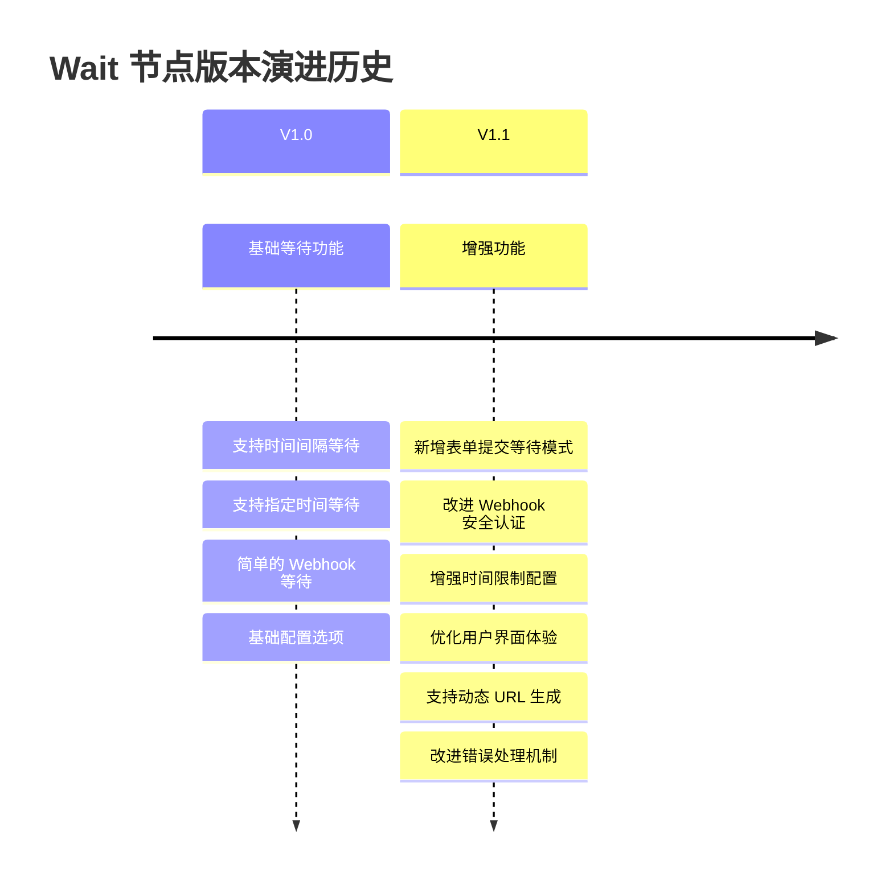
```mermaid
timeline
    title Wait 节点版本演进历史
    section V1.0
        基础等待功能 : 支持时间间隔等待
        : 支持指定时间等待
        : 简单的 Webhook 等待
        : 基础配置选项
    section V1.1
        增强功能 : 新增表单提交等待模式
        : 改进 Webhook 安全认证
        : 增强时间限制配置
        : 优化用户界面体验
        : 支持动态 URL 生成
        : 改进错误处理机制
```

### 1.4 等待模式分类与拓扑结构
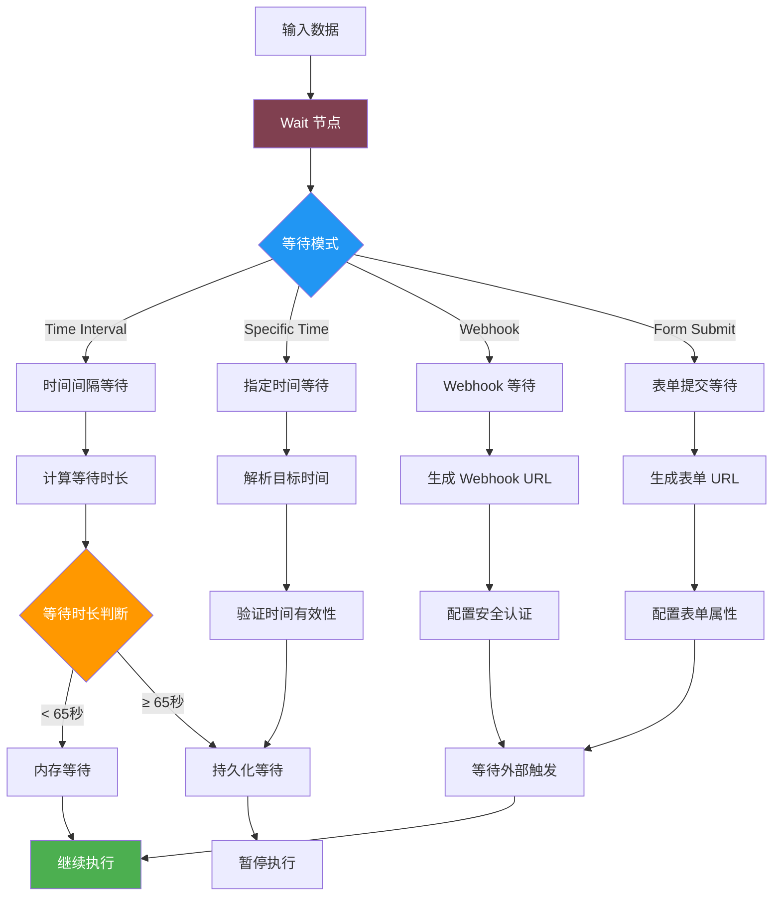
```mermaid
graph TD
    A[输入数据] --> B[Wait 节点]
    B --> C{等待模式}

    C -->|Time Interval| D[时间间隔等待]
    C -->|Specific Time| E[指定时间等待]
    C -->|Webhook| F[Webhook 等待]
    C -->|Form Submit| G[表单提交等待]

    D --> H[计算等待时长]
    E --> I[解析目标时间]
    F --> J[生成 Webhook URL]
    G --> K[生成表单 URL]

    H --> L{等待时长判断}
    L -->|< 65秒| M[内存等待]
    L -->|≥ 65秒| N[持久化等待]

    I --> O[验证时间有效性]
    O --> N

    J --> P[配置安全认证]
    K --> Q[配置表单属性]
    P --> R[等待外部触发]
    Q --> R

    M --> S[继续执行]
    N --> T[暂停执行]
    R --> S

    style B fill:#804050,color:#fff
    style C fill:#2196F3,color:#fff
    style L fill:#FF9800,color:#fff
    style S fill:#4CAF50,color:#fff
```

---

## 2. 节点属性配置详解

### 2.1 核心等待模式配置
```typescript
// 主要等待模式选择配置
{
  displayName: 'Resume',
  name: 'resume',
  type: 'options',
  options: [
    {
      name: 'After Time Interval',
      value: 'timeInterval',
      description: 'Waits for a certain amount of time'
    },
    {
      name: 'At Specified Time',
      value: 'specificTime',
      description: 'Waits until a specific date and time to continue'
    },
    {
      name: 'On Webhook Call',
      value: 'webhook',
      description: 'Waits for a webhook call before continuing'
    },
    {
      name: 'On Form Submitted',
      value: 'form',
      description: 'Waits for a form submission before continuing'
    }
  ],
  default: 'timeInterval'
}
```

### 2.2 等待模式配置流程
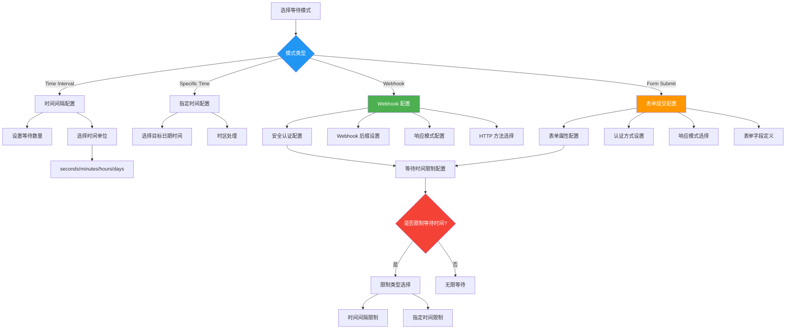
```mermaid
flowchart TD
    A[选择等待模式] --> B{模式类型}
    B -->|Time Interval| C[时间间隔配置]
    B -->|Specific Time| D[指定时间配置]
    B -->|Webhook| E[Webhook 配置]
    B -->|Form Submit| F[表单提交配置]

    C --> C1[设置等待数量]
    C --> C2[选择时间单位]
    C2 --> C3[seconds/minutes/hours/days]

    D --> D1[选择目标日期时间]
    D --> D2[时区处理]

    E --> E1[安全认证配置]
    E --> E2[Webhook 后缀设置]
    E --> E3[响应模式配置]
    E --> E4[HTTP 方法选择]

    F --> F1[表单属性配置]
    F --> F2[认证方式设置]
    F --> F3[响应模式选择]
    F --> F4[表单字段定义]

    E1 --> G[等待时间限制配置]
    F1 --> G

    G --> G1{是否限制等待时间?}
    G1 -->|是| H[限制类型选择]
    G1 -->|否| I[无限等待]

    H --> H1[时间间隔限制]
    H --> H2[指定时间限制]

    style B fill:#2196F3,color:#fff
    style E fill:#4CAF50,color:#fff
    style F fill:#FF9800,color:#fff
    style G1 fill:#f44336,color:#fff
```

### 2.3 动态 URL 生成系统
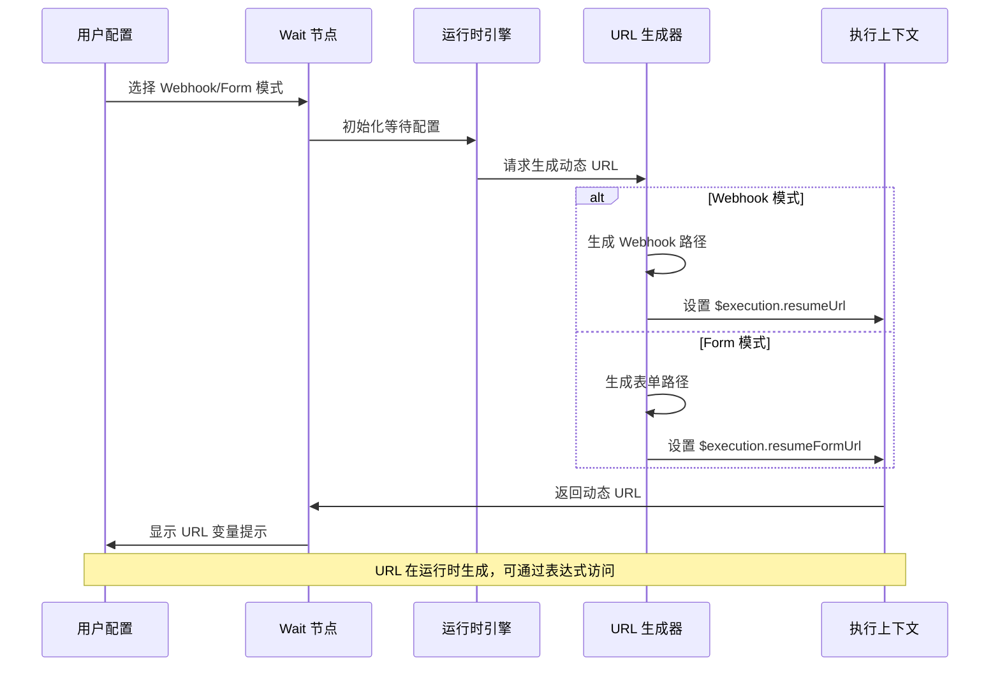
```mermaid
sequenceDiagram
    participant User as 用户配置
    participant Node as Wait 节点
    participant Runtime as 运行时引擎
    participant URL as URL 生成器
    participant Context as 执行上下文

    User->>Node: 选择 Webhook/Form 模式
    Node->>Runtime: 初始化等待配置
    Runtime->>URL: 请求生成动态 URL

    alt Webhook 模式
        URL->>URL: 生成 Webhook 路径
        URL->>Context: 设置 $execution.resumeUrl
    else Form 模式
        URL->>URL: 生成表单路径
        URL->>Context: 设置 $execution.resumeFormUrl
    end

    Context->>Node: 返回动态 URL
    Node->>User: 显示 URL 变量提示

    Note over User,Context: URL 在运行时生成，可通过表达式访问
```

---

## 3. 等待模式详细解析

### 3.1 Time Interval 模式 - 时间间隔等待
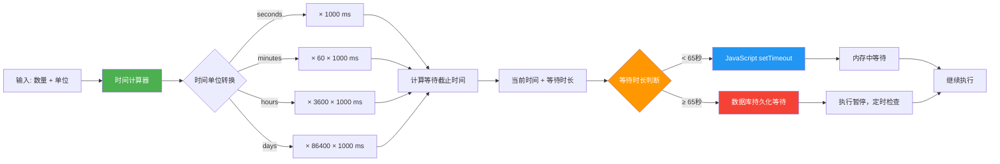
```mermaid
flowchart LR
    A[输入: 数量 + 单位] --> B[时间计算器]
    B --> C{时间单位转换}

    C -->|seconds| D[× 1000 ms]
    C -->|minutes| E[× 60 × 1000 ms]
    C -->|hours| F[× 3600 × 1000 ms]
    C -->|days| G[× 86400 × 1000 ms]

    D --> H[计算等待截止时间]
    E --> H
    F --> H
    G --> H

    H --> I[当前时间 + 等待时长]
    I --> J{等待时长判断}

    J -->|< 65秒| K[JavaScript setTimeout]
    J -->|≥ 65秒| L[数据库持久化等待]

    K --> M[内存中等待]
    L --> N[执行暂停，定时检查]

    M --> O[继续执行]
    N --> O

    style B fill:#4CAF50,color:#fff
    style J fill:#FF9800,color:#fff
    style K fill:#2196F3,color:#fff
    style L fill:#f44336,color:#fff
```

**时间间隔模式配置示例:**
```typescript
// V1.0 配置 (默认 1 小时)
{
  resume: 'timeInterval',
  amount: 1,
  unit: 'hours'
}

// V1.1 配置 (默认 5 秒)
{
  resume: 'timeInterval',
  amount: 5,
  unit: 'seconds'
}
```

### 3.2 Specific Time 模式 - 指定时间等待
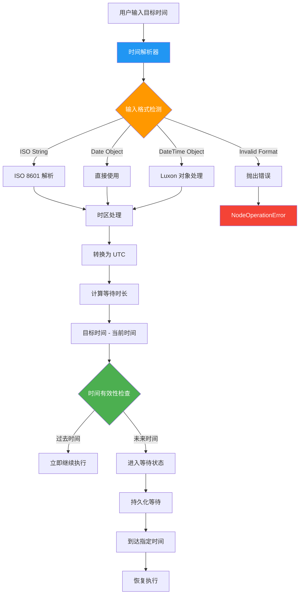
```mermaid
flowchart TD
    A[用户输入目标时间] --> B[时间解析器]
    B --> C{输入格式检测}

    C -->|ISO String| D[ISO 8601 解析]
    C -->|Date Object| E[直接使用]
    C -->|DateTime Object| F[Luxon 对象处理]
    C -->|Invalid Format| G[抛出错误]

    D --> H[时区处理]
    E --> H
    F --> H

    H --> I[转换为 UTC]
    I --> J[计算等待时长]
    J --> K[目标时间 - 当前时间]

    K --> L{时间有效性检查}
    L -->|过去时间| M[立即继续执行]
    L -->|未来时间| N[进入等待状态]

    G --> O[NodeOperationError]
    N --> P[持久化等待]
    P --> Q[到达指定时间]
    Q --> R[恢复执行]

    style B fill:#2196F3,color:#fff
    style C fill:#FF9800,color:#fff
    style L fill:#4CAF50,color:#fff
    style O fill:#f44336,color:#fff
```

**时间格式支持:**
```javascript
// 支持的时间格式示例
const supportedFormats = [
  '2024-12-25T10:00:00Z',           // ISO 8601 UTC
  '2024-12-25T10:00:00+08:00',     // ISO 8601 with timezone
  new Date('2024-12-25T10:00:00'),  // JavaScript Date object
  DateTime.fromISO('2024-12-25T10:00:00'), // Luxon DateTime object
];

// 错误示例
const invalidFormats = [
  'invalid_date',
  '2024-13-45',  // 无效日期
  '',            // 空字符串
];
```

### 3.3 Webhook 模式 - 外部触发等待
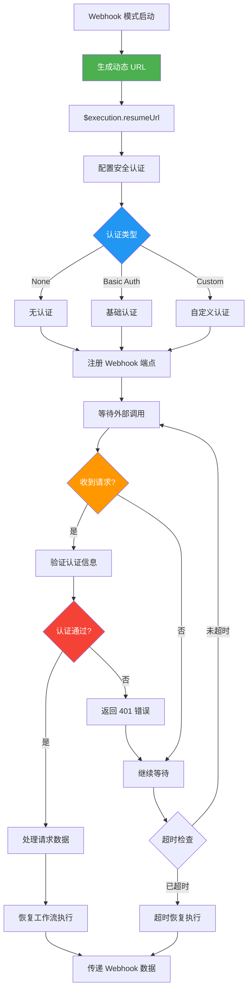
```mermaid
flowchart TD
    A[Webhook 模式启动] --> B[生成动态 URL]
    B --> C[$execution.resumeUrl]
    C --> D[配置安全认证]

    D --> E{认证类型}
    E -->|None| F[无认证]
    E -->|Basic Auth| G[基础认证]
    E -->|Custom| H[自定义认证]

    F --> I[注册 Webhook 端点]
    G --> I
    H --> I

    I --> J[等待外部调用]
    J --> K{收到请求?}

    K -->|是| L[验证认证信息]
    K -->|否| M[继续等待]

    L --> N{认证通过?}
    N -->|是| O[处理请求数据]
    N -->|否| P[返回 401 错误]

    O --> Q[恢复工作流执行]
    P --> M
    M --> R{超时检查}
    R -->|未超时| J
    R -->|已超时| S[超时恢复执行]

    Q --> T[传递 Webhook 数据]
    S --> T

    style B fill:#4CAF50,color:#fff
    style E fill:#2196F3,color:#fff
    style K fill:#FF9800,color:#fff
    style N fill:#f44336,color:#fff
```

**Webhook 配置选项:**
```typescript
// Webhook 安全配置
{
  resume: 'webhook',
  incomingAuthentication: 'basicAuth', // none | basicAuth
  options: {
    webhookSuffix: 'custom-endpoint',  // 自定义后缀
    httpMethod: 'POST',                // GET | POST | PUT | DELETE
    responseMode: 'onReceived',        // onReceived | lastNode | responseNode
    responseData: '{"status": "ok"}'   // 自定义响应数据
  }
}

// 动态 URL 访问
const webhookUrl = '{{ $execution.resumeUrl }}';
// 实际生成: https://your-n8n.com/webhook/abc123-def456/custom-endpoint
```

### 3.4 Form Submit 模式 - 表单提交等待
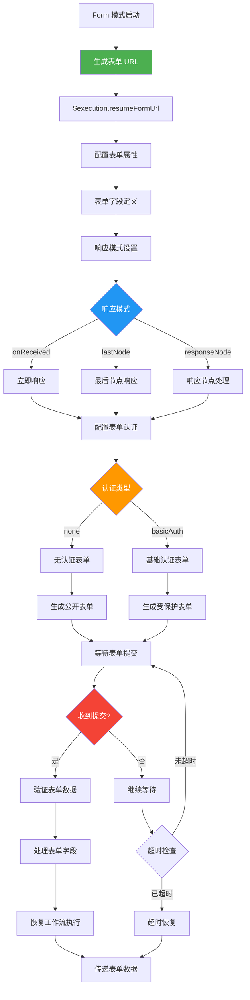
```mermaid
flowchart TD
    A[Form 模式启动] --> B[生成表单 URL]
    B --> C[$execution.resumeFormUrl]
    C --> D[配置表单属性]

    D --> E[表单字段定义]
    E --> F[响应模式设置]
    F --> G{响应模式}

    G -->|onReceived| H[立即响应]
    G -->|lastNode| I[最后节点响应]
    G -->|responseNode| J[响应节点处理]

    H --> K[配置表单认证]
    I --> K
    J --> K

    K --> L{认证类型}
    L -->|none| M[无认证表单]
    L -->|basicAuth| N[基础认证表单]

    M --> O[生成公开表单]
    N --> P[生成受保护表单]

    O --> Q[等待表单提交]
    P --> Q

    Q --> R{收到提交?}
    R -->|是| S[验证表单数据]
    R -->|否| T[继续等待]

    S --> U[处理表单字段]
    U --> V[恢复工作流执行]
    T --> W{超时检查}
    W -->|未超时| Q
    W -->|已超时| X[超时恢复]

    V --> Y[传递表单数据]
    X --> Y

    style B fill:#4CAF50,color:#fff
    style G fill:#2196F3,color:#fff
    style L fill:#FF9800,color:#fff
    style R fill:#f44336,color:#fff
```

**表单配置示例:**
```typescript
// 表单提交配置
{
  resume: 'form',
  formTitle: '审批请求',
  formDescription: '请审批以下请求',
  formFields: {
    values: [
      {
        fieldLabel: '审批结果',
        fieldType: 'select',
        fieldOptions: {
          values: [
            { option: '批准', value: 'approved' },
            { option: '拒绝', value: 'rejected' }
          ]
        },
        requiredField: true
      },
      {
        fieldLabel: '审批意见',
        fieldType: 'textarea',
        requiredField: false
      }
    ]
  },
  responseMode: 'onReceived'
}
```

---

## 4. 执行引擎与等待机制

### 4.1 核心执行流程
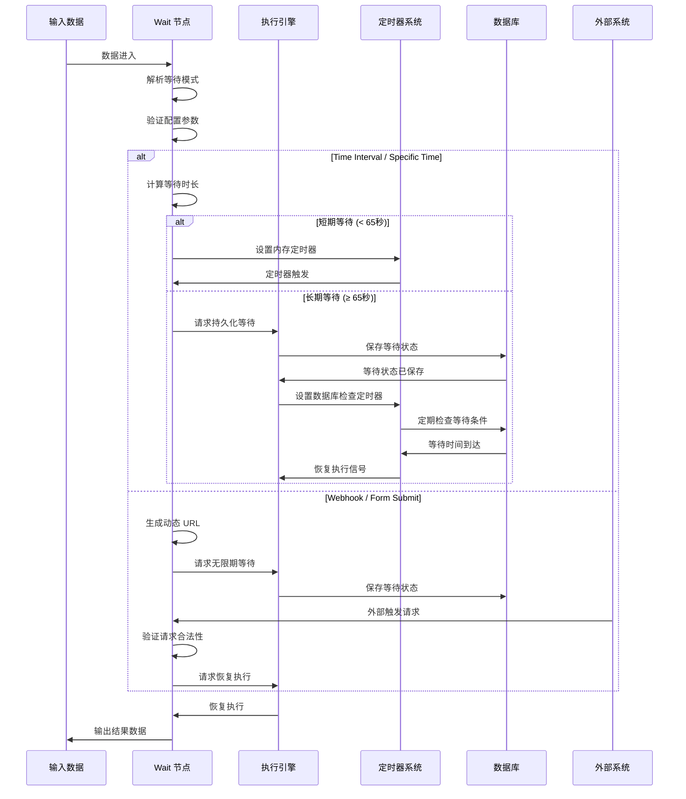
```mermaid
sequenceDiagram
    participant Input as 输入数据
    participant Wait as Wait 节点
    participant Engine as 执行引擎
    participant Timer as 定时器系统
    participant DB as 数据库
    participant External as 外部系统

    Input->>Wait: 数据进入
    Wait->>Wait: 解析等待模式
    Wait->>Wait: 验证配置参数

    alt Time Interval / Specific Time
        Wait->>Wait: 计算等待时长
        alt 短期等待 (< 65秒)
            Wait->>Timer: 设置内存定时器
            Timer->>Wait: 定时器触发
        else 长期等待 (≥ 65秒)
            Wait->>Engine: 请求持久化等待
            Engine->>DB: 保存等待状态
            DB->>Engine: 等待状态已保存
            Engine->>Timer: 设置数据库检查定时器
            Timer->>DB: 定期检查等待条件
            DB->>Timer: 等待时间到达
            Timer->>Engine: 恢复执行信号
        end
    else Webhook / Form Submit
        Wait->>Wait: 生成动态 URL
        Wait->>Engine: 请求无限期等待
        Engine->>DB: 保存等待状态
        External->>Wait: 外部触发请求
        Wait->>Wait: 验证请求合法性
        Wait->>Engine: 请求恢复执行
    end

    Engine->>Wait: 恢复执行
    Wait->>Input: 输出结果数据
```

### 4.2 等待状态管理机制
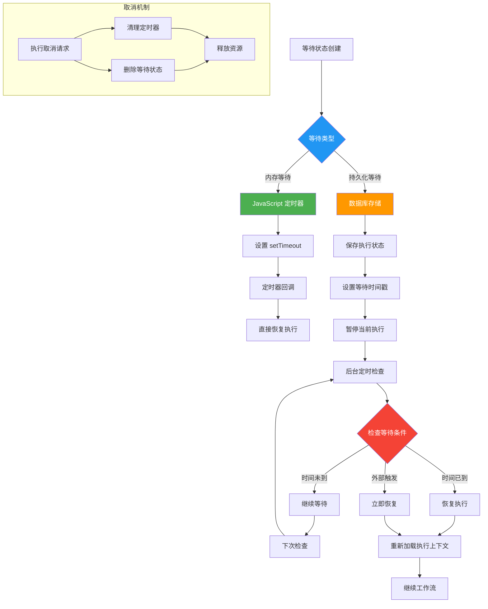
```mermaid
flowchart TD
    A[等待状态创建] --> B{等待类型}
    B -->|内存等待| C[JavaScript 定时器]
    B -->|持久化等待| D[数据库存储]

    C --> E[设置 setTimeout]
    E --> F[定时器回调]
    F --> G[直接恢复执行]

    D --> H[保存执行状态]
    H --> I[设置等待时间戳]
    I --> J[暂停当前执行]

    J --> K[后台定时检查]
    K --> L{检查等待条件}
    L -->|时间未到| M[继续等待]
    L -->|时间已到| N[恢复执行]
    L -->|外部触发| O[立即恢复]

    M --> P[下次检查]
    P --> K
    N --> Q[重新加载执行上下文]
    O --> Q
    Q --> R[继续工作流]

    subgraph "取消机制"
        S[执行取消请求]
        S --> T[清理定时器]
        S --> U[删除等待状态]
        T --> V[释放资源]
        U --> V
    end

    style B fill:#2196F3,color:#fff
    style C fill:#4CAF50,color:#fff
    style D fill:#FF9800,color:#fff
    style L fill:#f44336,color:#fff
```

### 4.3 时间计算与处理算法
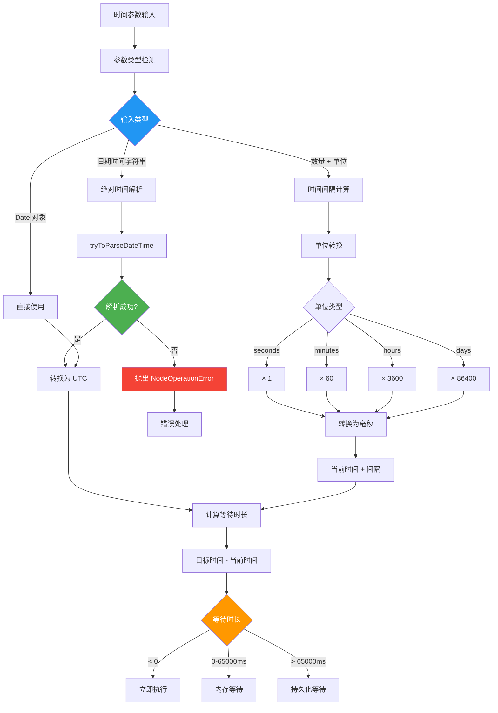
```mermaid
flowchart TD
    A[时间参数输入] --> B[参数类型检测]
    B --> C{输入类型}

    C -->|数量 + 单位| D[时间间隔计算]
    C -->|日期时间字符串| E[绝对时间解析]
    C -->|Date 对象| F[直接使用]

    D --> G[单位转换]
    G --> H{单位类型}
    H -->|seconds| I[× 1]
    H -->|minutes| J[× 60]
    H -->|hours| K[× 3600]
    H -->|days| L[× 86400]

    I --> M[转换为毫秒]
    J --> M
    K --> M
    L --> M

    M --> N[当前时间 + 间隔]

    E --> O[tryToParseDateTime]
    O --> P{解析成功?}
    P -->|是| Q[转换为 UTC]
    P -->|否| R[抛出 NodeOperationError]

    F --> Q
    Q --> S[计算等待时长]
    N --> S

    S --> T[目标时间 - 当前时间]
    T --> U{等待时长}
    U -->|< 0| V[立即执行]
    U -->|0-65000ms| W[内存等待]
    U -->|> 65000ms| X[持久化等待]

    R --> Y[错误处理]

    style C fill:#2196F3,color:#fff
    style P fill:#4CAF50,color:#fff
    style U fill:#FF9800,color:#fff
    style R fill:#f44336,color:#fff
```

---

## 5. 高级功能与配置选项

### 5.1 等待时间限制系统
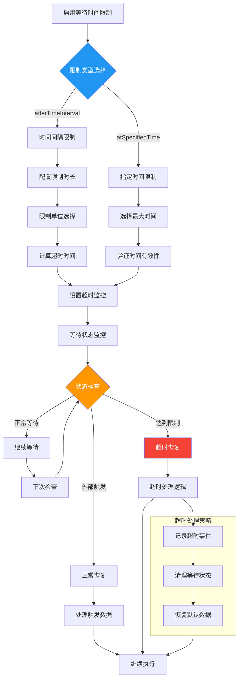
```mermaid
flowchart TD
    A[启用等待时间限制] --> B{限制类型选择}
    B -->|afterTimeInterval| C[时间间隔限制]
    B -->|atSpecifiedTime| D[指定时间限制]

    C --> E[配置限制时长]
    E --> F[限制单位选择]
    F --> G[计算超时时间]

    D --> H[选择最大时间]
    H --> I[验证时间有效性]

    G --> J[设置超时监控]
    I --> J

    J --> K[等待状态监控]
    K --> L{状态检查}

    L -->|正常等待| M[继续等待]
    L -->|外部触发| N[正常恢复]
    L -->|达到限制| O[超时恢复]

    M --> P[下次检查]
    P --> L

    N --> Q[处理触发数据]
    O --> R[超时处理逻辑]

    Q --> S[继续执行]
    R --> S

    subgraph "超时处理策略"
        T[记录超时事件]
        U[清理等待状态]
        V[恢复默认数据]
    end

    R --> T
    T --> U
    U --> V
    V --> S

    style B fill:#2196F3,color:#fff
    style L fill:#FF9800,color:#fff
    style O fill:#f44336,color:#fff
```

### 5.2 安全认证机制
```typescript
// Webhook 认证配置
interface WebhookAuthConfig {
  type: 'none' | 'basicAuth' | 'custom';
  credentials?: {
    username: string;
    password: string;
  };
  customHeaders?: Record<string, string>;
}

// 表单认证配置
interface FormAuthConfig {
  type: 'none' | 'basicAuth';
  credentials?: {
    username: string;
    password: string;
  };
}

// 认证验证流程
async function validateAuthentication(
  request: IncomingRequest,
  authConfig: WebhookAuthConfig | FormAuthConfig
): Promise<boolean> {
  switch (authConfig.type) {
    case 'none':
      return true;

    case 'basicAuth':
      const auth = parseBasicAuth(request.headers.authorization);
      return auth?.username === authConfig.credentials?.username &&
             auth?.password === authConfig.credentials?.password;

    case 'custom':
      return validateCustomHeaders(request.headers, authConfig.customHeaders);

    default:
      return false;
  }
}
```

### 5.3 错误处理与容错机制
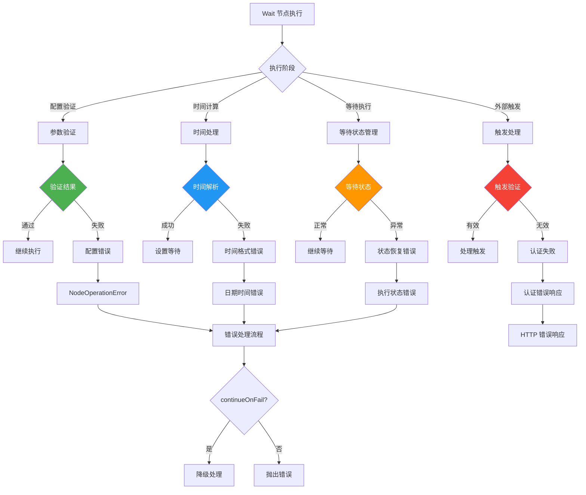
```mermaid
flowchart TD
    A[Wait 节点执行] --> B{执行阶段}
    B -->|配置验证| C[参数验证]
    B -->|时间计算| D[时间处理]
    B -->|等待执行| E[等待状态管理]
    B -->|外部触发| F[触发处理]

    C --> G{验证结果}
    G -->|通过| H[继续执行]
    G -->|失败| I[配置错误]

    D --> J{时间解析}
    J -->|成功| K[设置等待]
    J -->|失败| L[时间格式错误]

    E --> M{等待状态}
    M -->|正常| N[继续等待]
    M -->|异常| O[状态恢复错误]

    F --> P{触发验证}
    P -->|有效| Q[处理触发]
    P -->|无效| R[认证失败]

    I --> S[NodeOperationError]
    L --> T[日期时间错误]
    O --> U[执行状态错误]
    R --> V[认证错误响应]

    S --> W[错误处理流程]
    T --> W
    U --> W
    V --> X[HTTP 错误响应]

    W --> Y{continueOnFail?}
    Y -->|是| Z[降级处理]
    Y -->|否| AA[抛出错误]

    style G fill:#4CAF50,color:#fff
    style J fill:#2196F3,color:#fff
    style M fill:#FF9800,color:#fff
    style P fill:#f44336,color:#fff
```

---

## 6. 使用示例与最佳实践

### 6.1 常见使用场景

#### 场景1: 批处理延迟控制
```javascript
// 避免 API 速率限制的批处理延迟
{
  "resume": "timeInterval",
  "amount": 30,
  "unit": "seconds"
}

// 使用场景：
// HTTP Request → Wait (30秒) → HTTP Request → Wait (30秒) → ...
// 确保不超过 API 调用频率限制
```

#### 场景2: 人工审批流程
```javascript
// 人工审批等待配置
{
  "resume": "form",
  "formTitle": "费用报销审批",
  "formDescription": "请审批以下费用报销申请",
  "formFields": {
    "values": [
      {
        "fieldLabel": "审批决定",
        "fieldType": "select",
        "fieldOptions": {
          "values": [
            { "option": "批准", "value": "approved" },
            { "option": "拒绝", "value": "rejected" },
            { "option": "需要更多信息", "value": "more_info" }
          ]
        },
        "requiredField": true
      },
      {
        "fieldLabel": "审批意见",
        "fieldType": "textarea",
        "placeholder": "请输入审批意见或理由",
        "requiredField": false
      },
      {
        "fieldLabel": "批准金额",
        "fieldType": "number",
        "displayOptions": {
          "show": {
            "审批决定": ["approved"]
          }
        }
      }
    ]
  },
  "limitWaitTime": true,
  "limitType": "afterTimeInterval",
  "resumeAmount": 7,
  "resumeUnit": "days"
}
```

#### 场景3: 外部系统集成
```javascript
// 等待外部系统处理完成
{
  "resume": "webhook",
  "incomingAuthentication": "basicAuth",
  "limitWaitTime": true,
  "limitType": "afterTimeInterval",
  "resumeAmount": 1,
  "resumeUnit": "hours",
  "options": {
    "webhookSuffix": "payment-callback",
    "httpMethod": "POST",
    "responseMode": "onReceived",
    "responseData": "{\"status\": \"received\", \"message\": \"Payment status updated\"}"
  }
}

// 外部调用示例:
// POST https://n8n.example.com/webhook/abc123/payment-callback
// Authorization: Basic dXNlcjpwYXNz
// Content-Type: application/json
// {
//   "payment_id": "pay_123456",
//   "status": "completed",
//   "amount": 99.99
// }
```

### 6.2 工作流设计模式

#### 定时任务模式
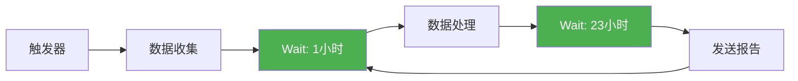
```mermaid
flowchart LR
    A[触发器] --> B[数据收集]
    B --> C[Wait: 1小时]
    C --> D[数据处理]
    D --> E[Wait: 23小时]
    E --> F[发送报告]
    F --> C

    style C fill:#4CAF50,color:#fff
    style E fill:#4CAF50,color:#fff
```

#### 人工干预模式
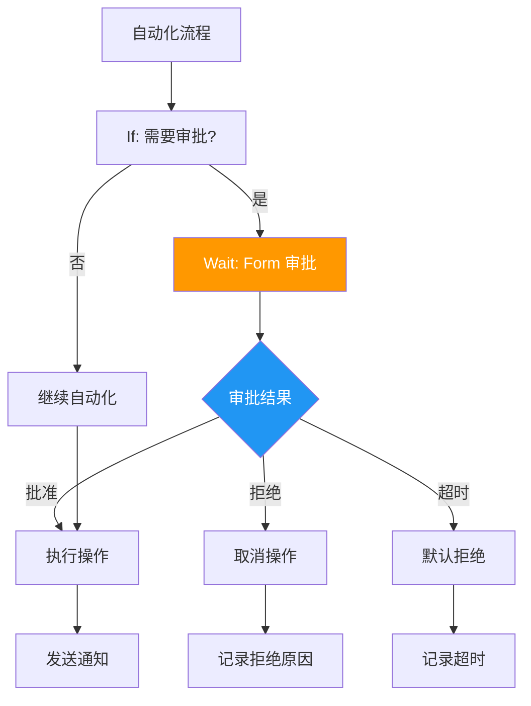
```mermaid
flowchart TD
    A[自动化流程] --> B[If: 需要审批?]
    B -->|是| C[Wait: Form 审批]
    B -->|否| D[继续自动化]

    C --> E{审批结果}
    E -->|批准| F[执行操作]
    E -->|拒绝| G[取消操作]
    E -->|超时| H[默认拒绝]

    D --> F
    F --> I[发送通知]
    G --> J[记录拒绝原因]
    H --> K[记录超时]

    style C fill:#FF9800,color:#fff
    style E fill:#2196F3,color:#fff
```

#### 外部系统同步模式
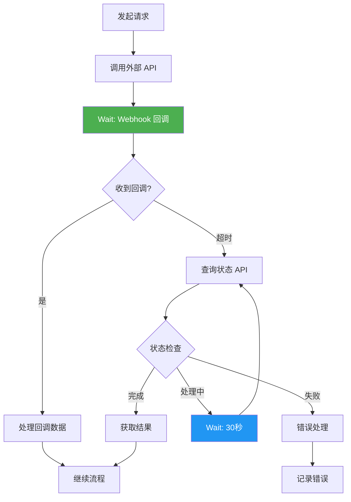
```mermaid
flowchart TD
    A[发起请求] --> B[调用外部 API]
    B --> C[Wait: Webhook 回调]
    C --> D{收到回调?}

    D -->|是| E[处理回调数据]
    D -->|超时| F[查询状态 API]

    F --> G{状态检查}
    G -->|完成| H[获取结果]
    G -->|处理中| I[Wait: 30秒]
    G -->|失败| J[错误处理]

    I --> F
    E --> K[继续流程]
    H --> K
    J --> L[记录错误]

    style C fill:#4CAF50,color:#fff
    style I fill:#2196F3,color:#fff
```

### 6.3 调试与故障排除

#### 调试技巧
1. **等待状态监控**: 在 n8n 执行历史中查看等待状态和恢复时间
2. **URL 测试**: 使用生成的 `$execution.resumeUrl` 进行手动测试
3. **时间验证**: 确认时区设置和时间格式正确性
4. **认证测试**: 验证 Webhook/Form 的认证配置

#### 常见问题解决方案
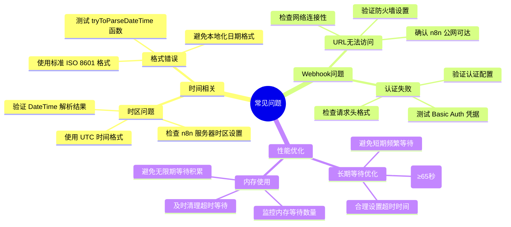
```mermaid
mindmap
  root((常见问题))
    时间相关
      时区问题
        检查 n8n 服务器时区设置
        使用 UTC 时间格式
        验证 DateTime 解析结果
      格式错误
        使用标准 ISO 8601 格式
        避免本地化日期格式
        测试 tryToParseDateTime 函数
    Webhook问题
      URL无法访问
        检查网络连接性
        验证防火墙设置
        确认 n8n 公网可达
      认证失败
        验证认证配置
        测试 Basic Auth 凭据
        检查请求头格式
    性能优化
      长期等待优化
        使用持久化等待(≥65秒)
        避免短期频繁等待
        合理设置超时时间
      内存使用
        监控内存等待数量
        及时清理超时等待
        避免无限期等待积累
```

---

## 7. 技术规格总结

### 7.1 节点接口规格
```typescript
interface WaitNodeSpec extends WebhookNodeSpec {
  // 基础信息
  name: 'wait';
  displayName: 'Wait';
  group: ['organization'];
  version: 1 | 1.1;

  // 继承关系
  extends: WebhookNode;
  authPropertyName: 'incomingAuthentication';

  // 连接配置
  inputs: [NodeConnectionTypes.Main];
  outputs: [NodeConnectionTypes.Main];

  // Webhook 配置
  webhooks: [
    DefaultWebhook,    // 标准 Webhook
    FormGetWebhook,    // 表单 GET 端点
    FormPostWebhook    // 表单 POST 端点
  ];

  // 核心方法
  execute(context: IExecuteFunctions): Promise<INodeExecutionData[][]>;
  webhook(context: IWebhookFunctions): Promise<IWebhookResponseData>;

  // 私有方法
  configureAndPutToWait(context: IExecuteFunctions): Promise<INodeExecutionData[][]>;
  putToWait(context: IExecuteFunctions, waitTill: Date): Promise<INodeExecutionData[][]>;
}
```

### 7.2 等待模式能力矩阵
| 模式 | 精确度 | 可靠性 | 交互性 | 复杂度 | 适用场景 |
|------|--------|--------|--------|--------|----------|
| Time Interval | 🟢 高 | 🟢 高 | 🔴 无 | 🟢 低 | 延迟控制、定时任务 |
| Specific Time | 🟢 高 | 🟢 高 | 🔴 无 | 🟡 中 | 计划任务、定时发布 |
| Webhook | 🟢 高 | 🟡 中 | 🟢 高 | 🟡 中 | 外部系统集成 |
| Form Submit | 🟡 中 | 🟡 中 | 🟢 高 | 🟡 中 | 人工审批、数据收集 |

### 7.3 性能指标
- **内存等待阈值**: 65秒 (setTimeout 限制)
- **持久化等待检查间隔**: 60秒 (数据库轮询)
- **最大等待时间**: 3000-01-01 (WAIT_INDEFINITELY)
- **Webhook 响应时间**: < 100ms (本地处理)
- **表单渲染时间**: < 500ms (静态页面)

### 7.4 版本兼容性与迁移
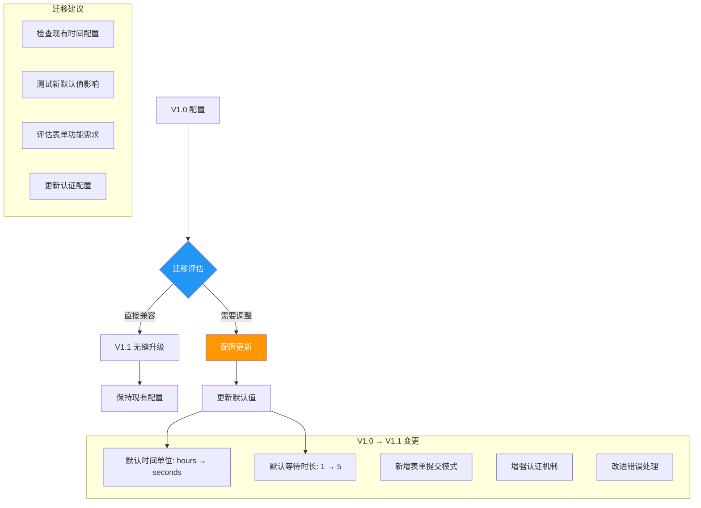
```mermaid
flowchart TD
    A[V1.0 配置] --> B{迁移评估}
    B -->|直接兼容| C[V1.1 无缝升级]
    B -->|需要调整| D[配置更新]

    C --> E[保持现有配置]
    D --> F[更新默认值]

    subgraph "V1.0 → V1.1 变更"
        G[默认时间单位: hours → seconds]
        H[默认等待时长: 1 → 5]
        I[新增表单提交模式]
        J[增强认证机制]
        K[改进错误处理]
    end

    F --> G
    F --> H

    subgraph "迁移建议"
        L[检查现有时间配置]
        M[测试新默认值影响]
        N[评估表单功能需求]
        O[更新认证配置]
    end

    style B fill:#2196F3,color:#fff
    style D fill:#FF9800,color:#fff
```

### 7.5 与其他节点的集成
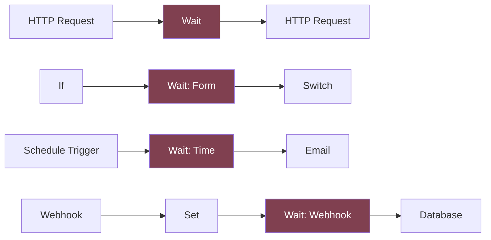
```mermaid
graph LR
    A[HTTP Request] --> B[Wait]
    B --> C[HTTP Request]

    D[If] --> E[Wait: Form]
    E --> F[Switch]

    G[Schedule Trigger] --> H[Wait: Time]
    H --> I[Email]

    J[Webhook] --> K[Set]
    K --> L[Wait: Webhook]
    L --> M[Database]

    style B fill:#804050,color:#fff
    style E fill:#804050,color:#fff
    style H fill:#804050,color:#fff
    style L fill:#804050,color:#fff
```

Wait 节点作为 n8n 工作流中的重要控制组件，提供了灵活的等待和暂停机制。通过四种不同的等待模式，它能够满足从简单延迟到复杂交互的各种需求，是构建健壮、可控工作流的关键基础设施。无论是实现定时任务、人工审批流程，还是外部系统集成，Wait 节点都能提供可靠的执行控制能力。
