# n8n Webhook（HTTP 触发器）节点深度解析

## 1. 节点架构与基础信息

### 1.1 节点基本信息
- **显示名称**: Webhook
- **节点名称**: `webhook`
- **图标**: 🔗 (webhook.svg)
- **图标颜色**: 深蓝色
- **组别**: trigger
- **当前版本**: 2.0 (默认版本)
- **源码路径**: `packages/nodes-base/nodes/Webhook/`

### 1.2 节点描述
Webhook 节点是 n8n 中最重要的触发器节点之一，当接收到 HTTP 请求时启动工作流执行。它提供了灵活的 HTTP 端点配置，支持多种认证方式、请求处理模式和响应策略，是构建 API 集成和事件驱动工作流的核心组件。

### 1.3 版本历史与演进
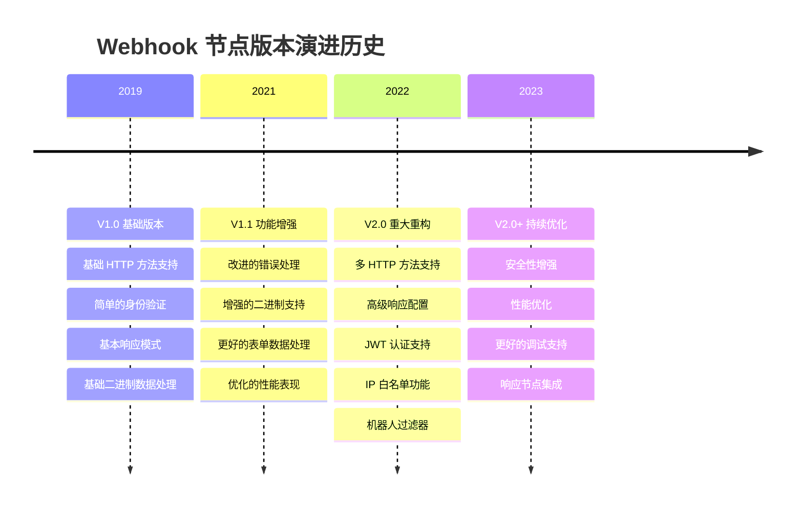
```mermaid
timeline
    title Webhook 节点版本演进历史

    2019    : V1.0 基础版本
            : 基础 HTTP 方法支持
            : 简单的身份验证
            : 基本响应模式
            : 基础二进制数据处理

    2021    : V1.1 功能增强
            : 改进的错误处理
            : 增强的二进制支持
            : 更好的表单数据处理
            : 优化的性能表现

    2022    : V2.0 重大重构
            : 多 HTTP 方法支持
            : 高级响应配置
            : JWT 认证支持
            : IP 白名单功能
            : 机器人过滤器

    2023    : V2.0+ 持续优化
            : 安全性增强
            : 性能优化
            : 更好的调试支持
            : 响应节点集成
```

### 1.4 节点架构与数据流
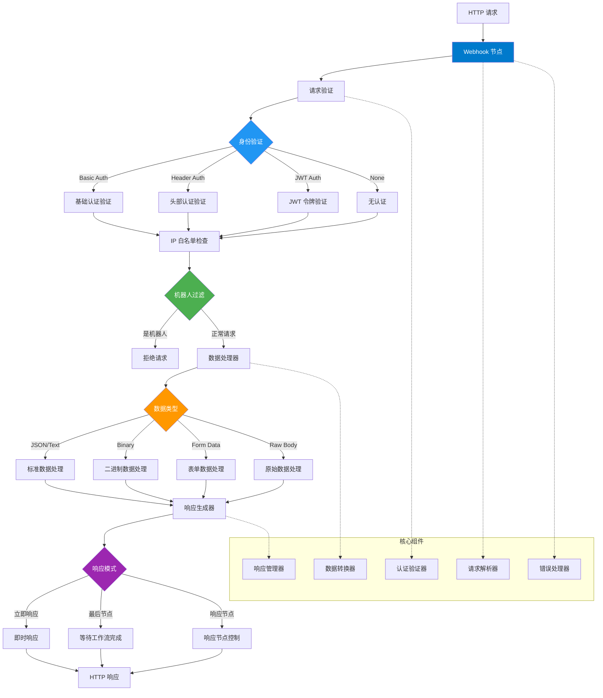
```mermaid
flowchart TD
    A[HTTP 请求] --> B[Webhook 节点]
    B --> C[请求验证]

    C --> D{身份验证}
    D -->|Basic Auth| E[基础认证验证]
    D -->|Header Auth| F[头部认证验证]
    D -->|JWT Auth| G[JWT 令牌验证]
    D -->|None| H[无认证]

    E --> I[IP 白名单检查]
    F --> I
    G --> I
    H --> I

    I --> J{机器人过滤}
    J -->|是机器人| K[拒绝请求]
    J -->|正常请求| L[数据处理器]

    L --> M{数据类型}
    M -->|JSON/Text| N[标准数据处理]
    M -->|Binary| O[二进制数据处理]
    M -->|Form Data| P[表单数据处理]
    M -->|Raw Body| Q[原始数据处理]

    N --> R[响应生成器]
    O --> R
    P --> R
    Q --> R

    R --> S{响应模式}
    S -->|立即响应| T[即时响应]
    S -->|最后节点| U[等待工作流完成]
    S -->|响应节点| V[响应节点控制]

    T --> W[HTTP 响应]
    U --> W
    V --> W

    subgraph "核心组件"
        X[请求解析器]
        Y[认证验证器]
        Z[数据转换器]
        AA[响应管理器]
        BB[错误处理器]
    end

    B -.-> X
    C -.-> Y
    L -.-> Z
    R -.-> AA
    B -.-> BB

    style B fill:#007acc,color:#fff
    style D fill:#2196F3,color:#fff
    style J fill:#4CAF50,color:#fff
    style M fill:#FF9800,color:#fff
    style S fill:#9C27B0,color:#fff
```

---

## 2. 节点属性配置详解

### 2.1 核心配置属性

#### HTTP 方法配置
```typescript
// 单一 HTTP 方法模式
{
  displayName: 'HTTP Method',
  name: 'httpMethod',
  type: 'options',
  options: [
    { name: 'DELETE', value: 'DELETE' },
    { name: 'GET', value: 'GET' },
    { name: 'HEAD', value: 'HEAD' },
    { name: 'PATCH', value: 'PATCH' },
    { name: 'POST', value: 'POST' },
    { name: 'PUT', value: 'PUT' }
  ],
  default: 'GET'
}

// 多 HTTP 方法模式
{
  displayName: 'HTTP Methods',
  name: 'httpMethod',
  type: 'multiOptions',
  options: [/* 同上 */],
  default: ['GET', 'POST']
}
```

#### 路径与端点配置
```typescript
{
  displayName: 'Path',
  name: 'path',
  type: 'string',
  default: '',
  placeholder: 'webhook',
  required: true,
  description: "支持动态值，如 'your-path/:dynamic-value'"
}
```

### 2.2 认证配置系统

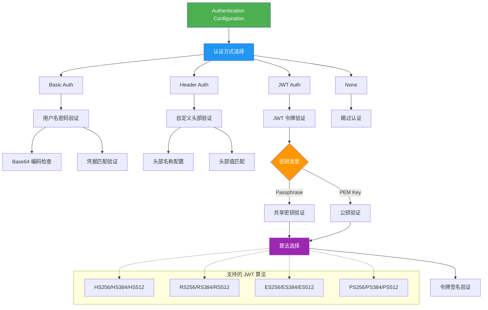
```mermaid
flowchart TD
    A[Authentication Configuration] --> B[认证方式选择]

    B --> C[Basic Auth]
    B --> D[Header Auth]
    B --> E[JWT Auth]
    B --> F[None]

    C --> G[用户名密码验证]
    G --> H[Base64 编码检查]
    G --> I[凭据匹配验证]

    D --> J[自定义头部验证]
    J --> K[头部名称配置]
    J --> L[头部值匹配]

    E --> M[JWT 令牌验证]
    M --> N{密钥类型}
    N -->|Passphrase| O[共享密钥验证]
    N -->|PEM Key| P[公钥验证]

    O --> Q[算法选择]
    P --> Q
    Q --> R[令牌签名验证]

    F --> S[跳过认证]

    subgraph "支持的 JWT 算法"
        T[HS256/HS384/HS512]
        U[RS256/RS384/RS512]
        V[ES256/ES384/ES512]
        W[PS256/PS384/PS512]
    end

    Q -.-> T
    Q -.-> U
    Q -.-> V
    Q -.-> W

    style A fill:#4CAF50,color:#fff
    style B fill:#2196F3,color:#fff
    style N fill:#FF9800,color:#fff
    style Q fill:#9C27B0,color:#fff
```

#### 认证配置详解
```typescript
{
  displayName: 'Authentication',
  name: 'authentication',
  type: 'options',
  options: [
    {
      name: 'Basic Auth',
      value: 'basicAuth',
      description: 'HTTP Basic Authentication'
    },
    {
      name: 'Header Auth',
      value: 'headerAuth',
      description: 'Custom header authentication'
    },
    {
      name: 'JWT Auth',
      value: 'jwtAuth',
      description: 'JSON Web Token authentication'
    },
    {
      name: 'None',
      value: 'none',
      description: 'No authentication required'
    }
  ],
  default: 'none'
}
```

### 2.3 响应模式配置

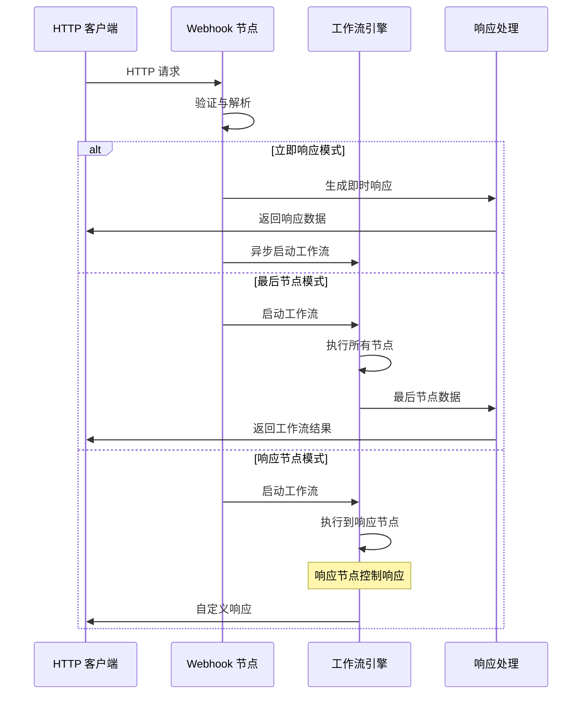
```mermaid
sequenceDiagram
    participant Client as HTTP 客户端
    participant Webhook as Webhook 节点
    participant Workflow as 工作流引擎
    participant Response as 响应处理

    Client->>Webhook: HTTP 请求
    Webhook->>Webhook: 验证与解析

    alt 立即响应模式
        Webhook->>Response: 生成即时响应
        Response->>Client: 返回响应数据
        Webhook->>Workflow: 异步启动工作流
    else 最后节点模式
        Webhook->>Workflow: 启动工作流
        Workflow->>Workflow: 执行所有节点
        Workflow->>Response: 最后节点数据
        Response->>Client: 返回工作流结果
    else 响应节点模式
        Webhook->>Workflow: 启动工作流
        Workflow->>Workflow: 执行到响应节点
        Note over Workflow: 响应节点控制响应
        Workflow->>Client: 自定义响应
    end
```

#### 响应模式属性
```typescript
{
  displayName: 'Respond',
  name: 'responseMode',
  type: 'options',
  options: [
    {
      name: 'Immediately',
      value: 'onReceived',
      description: 'As soon as this node executes'
    },
    {
      name: 'When Last Node Finishes',
      value: 'lastNode',
      description: 'Returns data of the last-executed node'
    },
    {
      name: "Using 'Respond to Webhook' Node",
      value: 'responseNode',
      description: 'Response defined in that node'
    }
  ],
  default: 'onReceived'
}
```

---

## 3. 数据处理机制详解

### 3.1 请求数据解析引擎

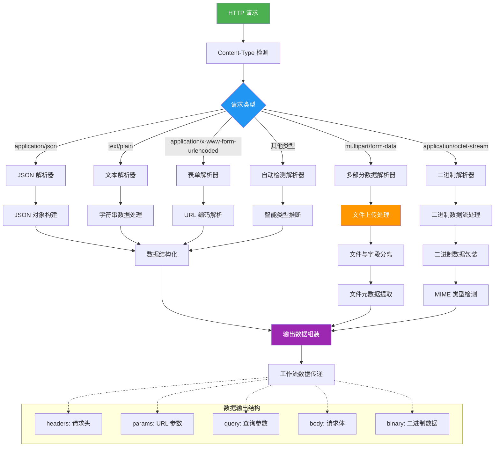
```mermaid
flowchart TD
    A[HTTP 请求] --> B[Content-Type 检测]

    B --> C{请求类型}
    C -->|application/json| D[JSON 解析器]
    C -->|text/plain| E[文本解析器]
    C -->|application/x-www-form-urlencoded| F[表单解析器]
    C -->|multipart/form-data| G[多部分数据解析器]
    C -->|application/octet-stream| H[二进制解析器]
    C -->|其他类型| I[自动检测解析器]

    D --> J[JSON 对象构建]
    E --> K[字符串数据处理]
    F --> L[URL 编码解析]
    G --> M[文件上传处理]
    H --> N[二进制数据流处理]
    I --> O[智能类型推断]

    J --> P[数据结构化]
    K --> P
    L --> P
    M --> Q[文件与字段分离]
    N --> R[二进制数据包装]
    O --> P

    Q --> S[文件元数据提取]
    R --> T[MIME 类型检测]

    P --> U[输出数据组装]
    S --> U
    T --> U

    U --> V[工作流数据传递]

    subgraph "数据输出结构"
        W[headers: 请求头]
        X[params: URL 参数]
        Y[query: 查询参数]
        Z[body: 请求体]
        AA[binary: 二进制数据]
    end

    V -.-> W
    V -.-> X
    V -.-> Y
    V -.-> Z
    V -.-> AA

    style A fill:#4CAF50,color:#fff
    style C fill:#2196F3,color:#fff
    style M fill:#FF9800,color:#fff
    style U fill:#9C27B0,color:#fff
```

### 3.2 二进制数据处理系统

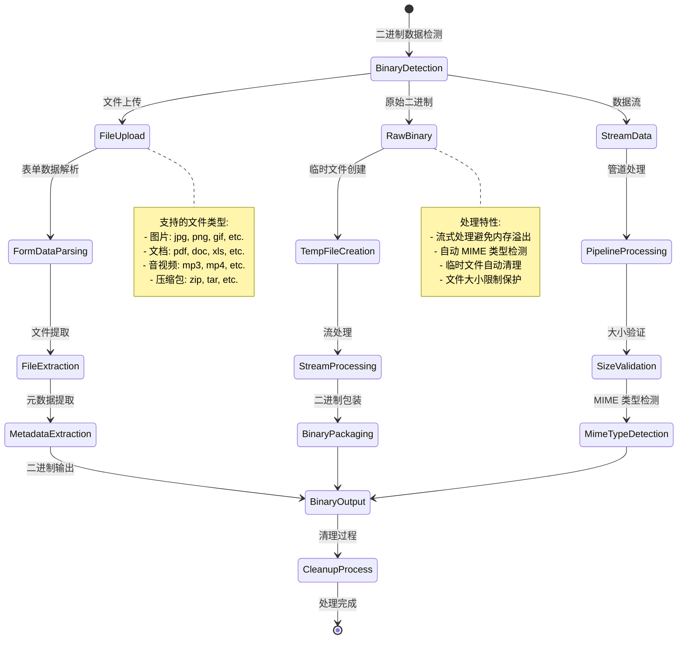
```mermaid
stateDiagram-v2
    [*] --> BinaryDetection: 二进制数据检测

    BinaryDetection --> FileUpload: 文件上传
    BinaryDetection --> RawBinary: 原始二进制
    BinaryDetection --> StreamData: 数据流

    FileUpload --> FormDataParsing: 表单数据解析
    FormDataParsing --> FileExtraction: 文件提取
    FileExtraction --> MetadataExtraction: 元数据提取

    RawBinary --> TempFileCreation: 临时文件创建
    TempFileCreation --> StreamProcessing: 流处理
    StreamProcessing --> BinaryPackaging: 二进制包装

    StreamData --> PipelineProcessing: 管道处理
    PipelineProcessing --> SizeValidation: 大小验证
    SizeValidation --> MimeTypeDetection: MIME 类型检测

    MetadataExtraction --> BinaryOutput: 二进制输出
    BinaryPackaging --> BinaryOutput
    MimeTypeDetection --> BinaryOutput

    BinaryOutput --> CleanupProcess: 清理过程
    CleanupProcess --> [*]: 处理完成

    note right of FileUpload
        支持的文件类型:
        - 图片: jpg, png, gif, etc.
        - 文档: pdf, doc, xls, etc.
        - 音视频: mp3, mp4, etc.
        - 压缩包: zip, tar, etc.
    end note

    note right of RawBinary
        处理特性:
        - 流式处理避免内存溢出
        - 自动 MIME 类型检测
        - 临时文件自动清理
        - 文件大小限制保护
    end note
```

### 3.3 安全验证与过滤系统

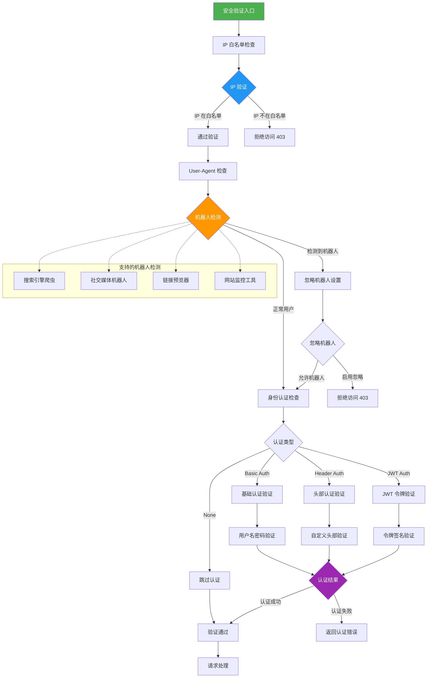
```mermaid
flowchart TD
    A[安全验证入口] --> B[IP 白名单检查]

    B --> C{IP 验证}
    C -->|IP 在白名单| D[通过验证]
    C -->|IP 不在白名单| E[拒绝访问 403]

    D --> F[User-Agent 检查]
    F --> G{机器人检测}
    G -->|检测到机器人| H[忽略机器人设置]
    G -->|正常用户| I[身份认证检查]

    H --> J{忽略机器人}
    J -->|启用忽略| K[拒绝访问 403]
    J -->|允许机器人| I

    I --> L{认证类型}
    L -->|Basic Auth| M[基础认证验证]
    L -->|Header Auth| N[头部认证验证]
    L -->|JWT Auth| O[JWT 令牌验证]
    L -->|None| P[跳过认证]

    M --> Q[用户名密码验证]
    N --> R[自定义头部验证]
    O --> S[令牌签名验证]

    Q --> T{认证结果}
    R --> T
    S --> T
    P --> U[验证通过]

    T -->|认证成功| U
    T -->|认证失败| V[返回认证错误]

    U --> W[请求处理]

    subgraph "支持的机器人检测"
        X[搜索引擎爬虫]
        Y[社交媒体机器人]
        Z[链接预览器]
        AA[网站监控工具]
    end

    G -.-> X
    G -.-> Y
    G -.-> Z
    G -.-> AA

    style A fill:#4CAF50,color:#fff
    style C fill:#2196F3,color:#fff
    style G fill:#FF9800,color:#fff
    style T fill:#9C27B0,color:#fff
```

---

## 4. 执行模式详细分析

### 4.1 测试模式 vs 生产模式

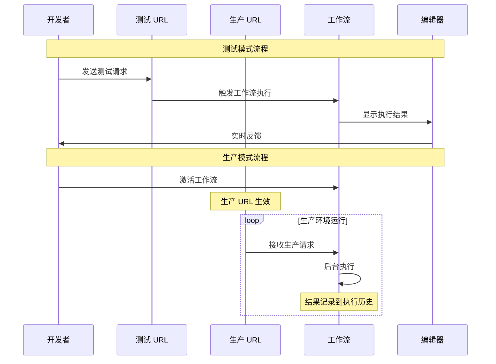
```mermaid
sequenceDiagram
    participant Dev as 开发者
    participant TestURL as 测试 URL
    participant ProdURL as 生产 URL
    participant Workflow as 工作流
    participant Editor as 编辑器

    Note over Dev,Editor: 测试模式流程

    Dev->>TestURL: 发送测试请求
    TestURL->>Workflow: 触发工作流执行
    Workflow->>Editor: 显示执行结果
    Editor->>Dev: 实时反馈

    Note over Dev,Editor: 生产模式流程

    Dev->>Workflow: 激活工作流
    Note over ProdURL: 生产 URL 生效

    loop 生产环境运行
        ProdURL->>Workflow: 接收生产请求
        Workflow->>Workflow: 后台执行
        Note over Workflow: 结果记录到执行历史
    end
```

#### 模式差异对比
```typescript
interface WebhookModes {
  test: {
    urlPattern: '/webhook-test/{workflowId}/{path}';
    execution: 'synchronous';
    resultDisplay: 'editor';
    persistence: 'temporary';
  };
  production: {
    urlPattern: '/webhook/{workflowId}/{path}';
    execution: 'asynchronous';
    resultDisplay: 'execution-list';
    persistence: 'permanent';
  };
}
```

### 4.2 多 HTTP 方法处理

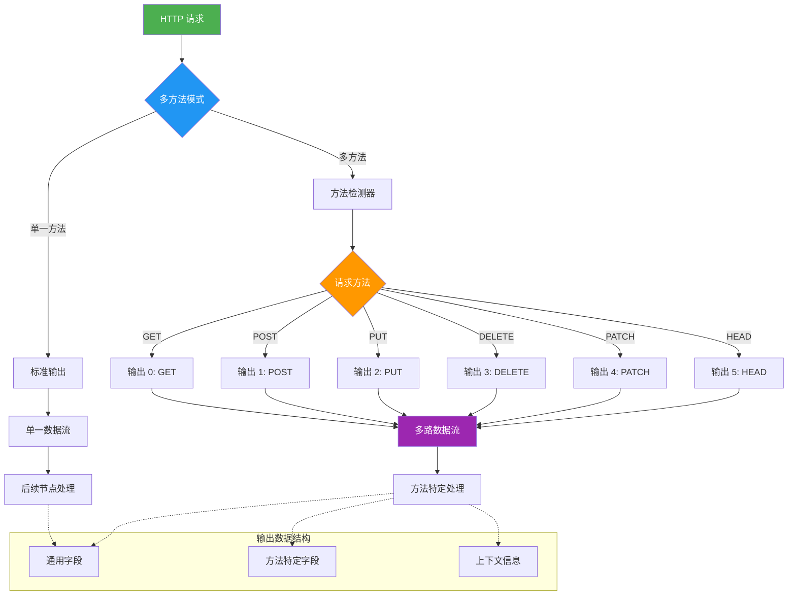
```mermaid
flowchart TD
    A[HTTP 请求] --> B{多方法模式}

    B -->|单一方法| C[标准输出]
    B -->|多方法| D[方法检测器]

    D --> E{请求方法}
    E -->|GET| F[输出 0: GET]
    E -->|POST| G[输出 1: POST]
    E -->|PUT| H[输出 2: PUT]
    E -->|DELETE| I[输出 3: DELETE]
    E -->|PATCH| J[输出 4: PATCH]
    E -->|HEAD| K[输出 5: HEAD]

    C --> L[单一数据流]
    F --> M[多路数据流]
    G --> M
    H --> M
    I --> M
    J --> M
    K --> M

    L --> N[后续节点处理]
    M --> O[方法特定处理]

    subgraph "输出数据结构"
        P[通用字段]
        Q[方法特定字段]
        R[上下文信息]
    end

    N -.-> P
    O -.-> P
    O -.-> Q
    O -.-> R

    style A fill:#4CAF50,color:#fff
    style B fill:#2196F3,color:#fff
    style E fill:#FF9800,color:#fff
    style M fill:#9C27B0,color:#fff
```

### 4.3 错误处理与恢复机制

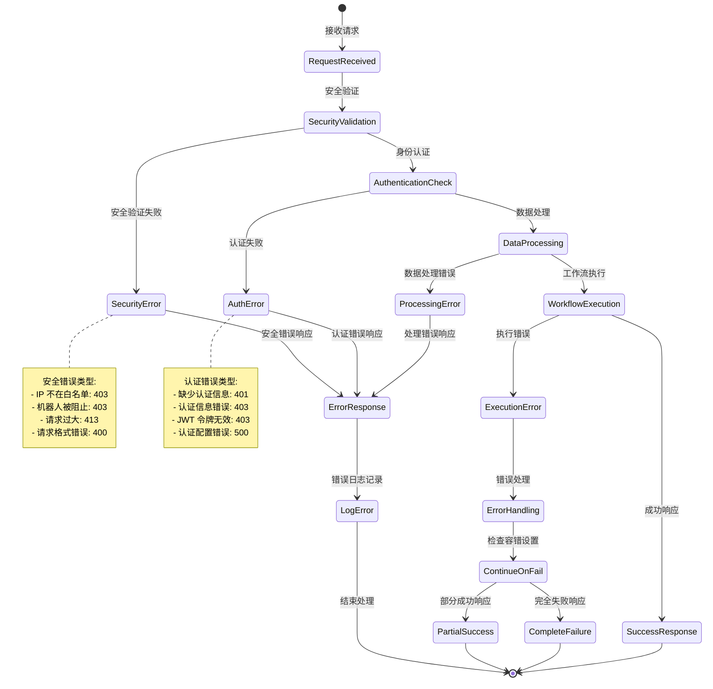
```mermaid
stateDiagram-v2
    [*] --> RequestReceived: 接收请求

    RequestReceived --> SecurityValidation: 安全验证
    SecurityValidation --> AuthenticationCheck: 身份认证
    AuthenticationCheck --> DataProcessing: 数据处理

    SecurityValidation --> SecurityError: 安全验证失败
    AuthenticationCheck --> AuthError: 认证失败
    DataProcessing --> ProcessingError: 数据处理错误

    SecurityError --> ErrorResponse: 安全错误响应
    AuthError --> ErrorResponse: 认证错误响应
    ProcessingError --> ErrorResponse: 处理错误响应

    ErrorResponse --> LogError: 错误日志记录
    LogError --> [*]: 结束处理

    DataProcessing --> WorkflowExecution: 工作流执行
    WorkflowExecution --> ExecutionError: 执行错误
    WorkflowExecution --> SuccessResponse: 成功响应

    ExecutionError --> ErrorHandling: 错误处理
    ErrorHandling --> ContinueOnFail: 检查容错设置

    ContinueOnFail --> PartialSuccess: 部分成功响应
    ContinueOnFail --> CompleteFailure: 完全失败响应

    PartialSuccess --> [*]
    CompleteFailure --> [*]
    SuccessResponse --> [*]

    note right of SecurityError
        安全错误类型:
        - IP 不在白名单: 403
        - 机器人被阻止: 403
        - 请求过大: 413
        - 请求格式错误: 400
    end note

    note right of AuthError
        认证错误类型:
        - 缺少认证信息: 401
        - 认证信息错误: 403
        - JWT 令牌无效: 403
        - 认证配置错误: 500
    end note
```

---

## 5. 高级功能与配置选项

### 5.1 响应自定义与内容协商

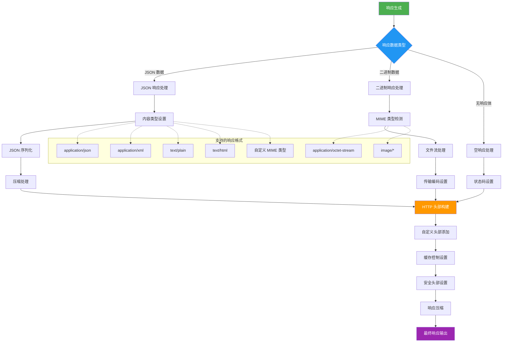
```mermaid
flowchart TD
    A[响应生成] --> B{响应数据类型}

    B -->|JSON 数据| C[JSON 响应处理]
    B -->|二进制数据| D[二进制响应处理]
    B -->|无响应体| E[空响应处理]

    C --> F[内容类型设置]
    F --> G[JSON 序列化]
    G --> H[压缩处理]

    D --> I[MIME 类型检测]
    I --> J[文件流处理]
    J --> K[传输编码设置]

    E --> L[状态码设置]

    H --> M[HTTP 头部构建]
    K --> M
    L --> M

    M --> N[自定义头部添加]
    N --> O[缓存控制设置]
    O --> P[安全头部设置]

    P --> Q[响应压缩]
    Q --> R[最终响应输出]

    subgraph "支持的响应格式"
        S[application/json]
        T[application/xml]
        U[text/plain]
        V[text/html]
        W[application/octet-stream]
        X[image/*]
        Y[自定义 MIME 类型]
    end

    F -.-> S
    F -.-> T
    F -.-> U
    F -.-> V
    I -.-> W
    I -.-> X
    F -.-> Y

    style A fill:#4CAF50,color:#fff
    style B fill:#2196F3,color:#fff
    style M fill:#FF9800,color:#fff
    style R fill:#9C27B0,color:#fff
```

#### 响应配置选项
```typescript
interface ResponseConfiguration {
  responseCode: {
    standard: 200 | 201 | 204 | 400 | 401 | 403 | 404 | 500;
    custom: number; // 100-599
  };
  responseData: {
    mode: 'allEntries' | 'firstEntryJson' | 'firstEntryBinary' | 'noData';
    customData?: string;
  };
  responseHeaders: Array<{
    name: string;
    value: string;
  }>;
  responseContentType?: string;
  responsePropertyName?: string;
}
```

### 5.2 高级选项配置

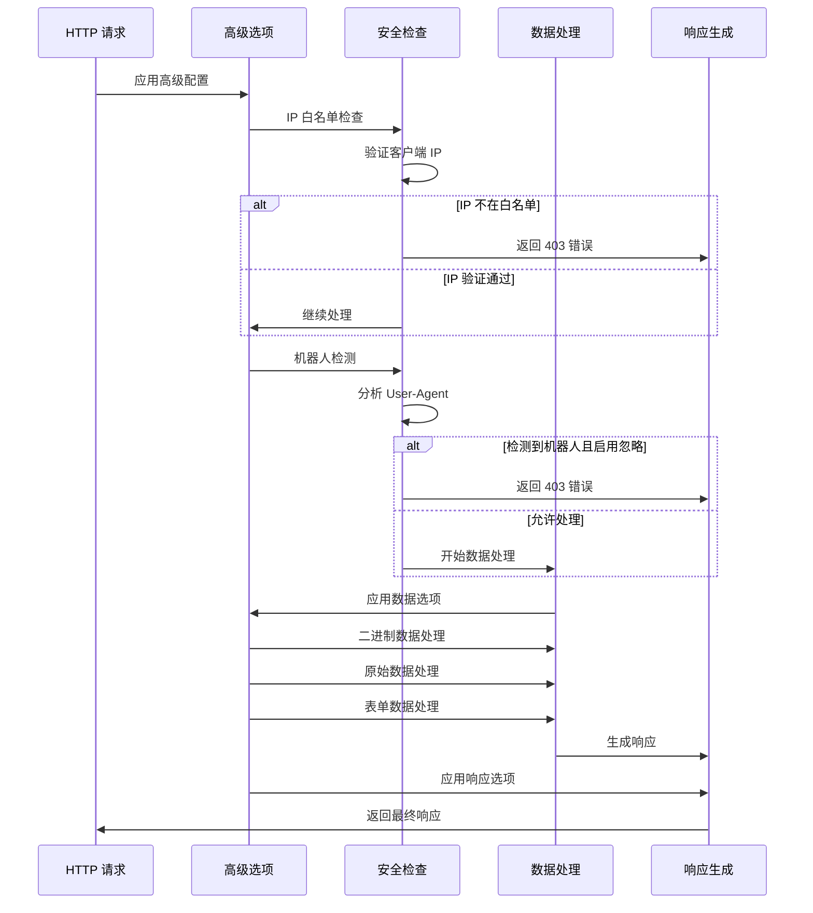
```mermaid
sequenceDiagram
    participant Request as HTTP 请求
    participant Options as 高级选项
    participant Security as 安全检查
    participant Processing as 数据处理
    participant Response as 响应生成

    Request->>Options: 应用高级配置

    Options->>Security: IP 白名单检查
    Security->>Security: 验证客户端 IP

    alt IP 不在白名单
        Security->>Response: 返回 403 错误
    else IP 验证通过
        Security->>Options: 继续处理
    end

    Options->>Security: 机器人检测
    Security->>Security: 分析 User-Agent

    alt 检测到机器人且启用忽略
        Security->>Response: 返回 403 错误
    else 允许处理
        Security->>Processing: 开始数据处理
    end

    Processing->>Options: 应用数据选项
    Options->>Processing: 二进制数据处理
    Options->>Processing: 原始数据处理
    Options->>Processing: 表单数据处理

    Processing->>Response: 生成响应
    Options->>Response: 应用响应选项
    Response->>Request: 返回最终响应
```

#### 高级选项详解
```typescript
interface AdvancedOptions {
  // 数据处理选项
  binaryData: boolean;           // 二进制数据处理
  rawBody: boolean;              // 原始请求体
  binaryPropertyName: string;    // 二进制字段名称

  // 安全选项
  ignoreBots: boolean;           // 忽略机器人
  ipWhitelist: string;           // IP 白名单

  // 响应选项
  noResponseBody: boolean;       // 无响应体
  responseData: string;          // 自定义响应数据
  responseContentType: string;   // 响应内容类型
  responseHeaders: Array<{       // 自定义响应头
    name: string;
    value: string;
  }>;
  responsePropertyName: string;  // 响应属性名称
}
```

### 5.3 与 Respond to Webhook 节点集成

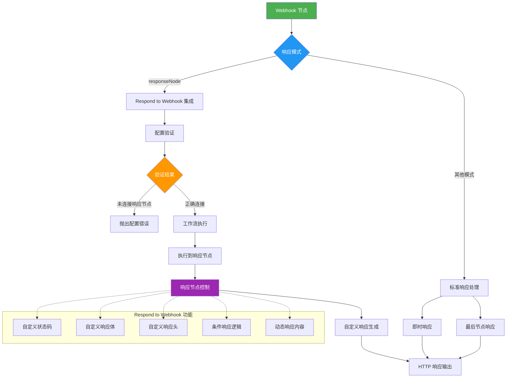
```mermaid
flowchart TD
    A[Webhook 节点] --> B{响应模式}

    B -->|responseNode| C[Respond to Webhook 集成]
    B -->|其他模式| D[标准响应处理]

    C --> E[配置验证]
    E --> F{验证结果}
    F -->|未连接响应节点| G[抛出配置错误]
    F -->|正确连接| H[工作流执行]

    H --> I[执行到响应节点]
    I --> J[响应节点控制]
    J --> K[自定义响应生成]

    D --> L[即时响应]
    D --> M[最后节点响应]

    K --> N[HTTP 响应输出]
    L --> N
    M --> N

    subgraph "Respond to Webhook 功能"
        O[自定义状态码]
        P[自定义响应体]
        Q[自定义响应头]
        R[条件响应逻辑]
        S[动态响应内容]
    end

    J -.-> O
    J -.-> P
    J -.-> Q
    J -.-> R
    J -.-> S

    style A fill:#4CAF50,color:#fff
    style B fill:#2196F3,color:#fff
    style F fill:#FF9800,color:#fff
    style J fill:#9C27B0,color:#fff
```

---

## 6. 实际应用场景与最佳实践

### 6.1 常见使用场景

#### 场景 1: API 端点创建
```javascript
// Webhook 配置示例 - RESTful API 端点
{
  "multipleMethods": true,
  "httpMethod": ["GET", "POST", "PUT", "DELETE"],
  "path": "api/users/:userId",
  "authentication": "jwtAuth",
  "responseMode": "responseNode",
  "options": {
    "ignoreBots": true,
    "responseHeaders": [
      {
        "name": "Access-Control-Allow-Origin",
        "value": "*"
      },
      {
        "name": "Content-Type",
        "value": "application/json"
      }
    ]
  }
}

// 对应的工作流处理逻辑
// GET: 获取用户信息
// POST: 创建新用户
// PUT: 更新用户信息
// DELETE: 删除用户
```

#### 场景 2: 第三方服务 Webhook 接收
```javascript
// GitHub Webhook 接收配置
{
  "httpMethod": "POST",
  "path": "github-webhook",
  "authentication": "headerAuth", // X-Hub-Signature
  "responseMode": "onReceived",
  "options": {
    "responseData": "OK",
    "responseCode": {
      "values": {
        "responseCode": 200
      }
    }
  }
}

// 处理 GitHub 事件的工作流
// 1. 验证 GitHub 签名
// 2. 解析事件类型
// 3. 根据事件执行相应操作
// 4. 发送通知或更新状态
```

#### 场景 3: 文件上传处理
```javascript
// 文件上传 Webhook 配置
{
  "httpMethod": "POST",
  "path": "upload",
  "authentication": "basicAuth",
  "responseMode": "lastNode",
  "responseData": "firstEntryJson",
  "options": {
    "binaryData": true,
    "binaryPropertyName": "uploadedFile",
    "ipWhitelist": "192.168.1.0/24,10.0.0.0/8"
  }
}

// 文件处理工作流
// 1. 接收上传的文件
// 2. 验证文件类型和大小
// 3. 保存到云存储
// 4. 生成缩略图（如果是图片）
// 5. 返回文件 URL 和元数据
```

### 6.2 工作流设计模式

#### API 网关模式
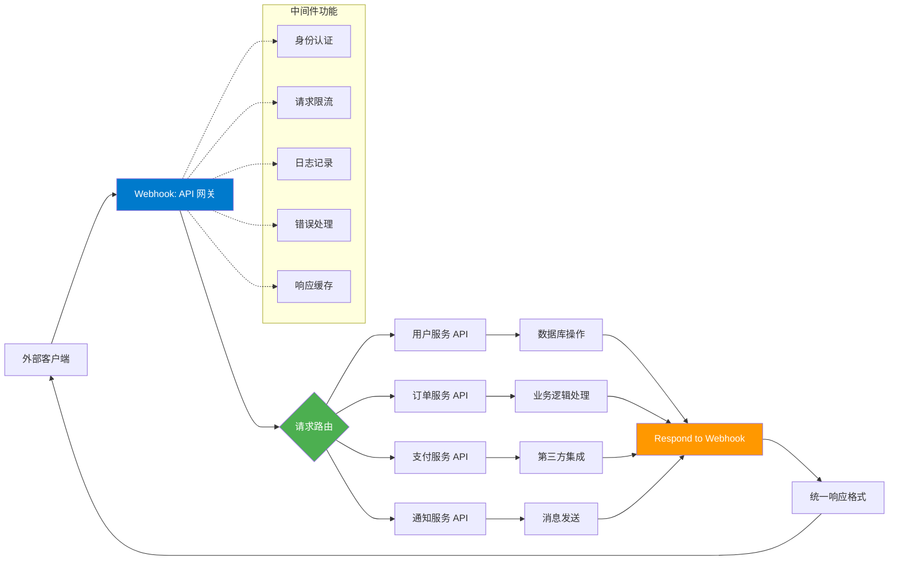
```mermaid
flowchart LR
    A[外部客户端] --> B[Webhook: API 网关]

    B --> C{请求路由}
    C --> D[用户服务 API]
    C --> E[订单服务 API]
    C --> F[支付服务 API]
    C --> G[通知服务 API]

    D --> H[数据库操作]
    E --> I[业务逻辑处理]
    F --> J[第三方集成]
    G --> K[消息发送]

    H --> L[Respond to Webhook]
    I --> L
    J --> L
    K --> L

    L --> M[统一响应格式]
    M --> A

    subgraph "中间件功能"
        N[身份认证]
        O[请求限流]
        P[日志记录]
        Q[错误处理]
        R[响应缓存]
    end

    B -.-> N
    B -.-> O
    B -.-> P
    B -.-> Q
    B -.-> R

    style B fill:#007acc,color:#fff
    style C fill:#4CAF50,color:#fff
    style L fill:#FF9800,color:#fff
```

#### 事件驱动集成模式
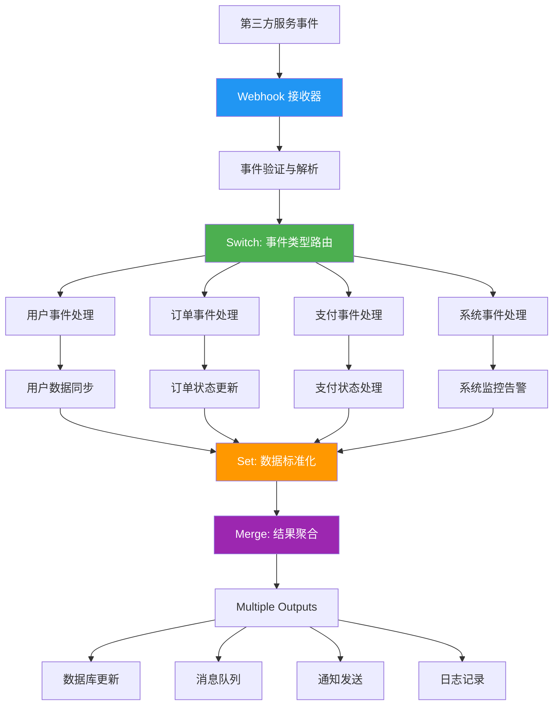
```mermaid
flowchart TD
    A[第三方服务事件] --> B[Webhook 接收器]

    B --> C[事件验证与解析]
    C --> D[Switch: 事件类型路由]

    D --> E[用户事件处理]
    D --> F[订单事件处理]
    D --> G[支付事件处理]
    D --> H[系统事件处理]

    E --> I[用户数据同步]
    F --> J[订单状态更新]
    G --> K[支付状态处理]
    H --> L[系统监控告警]

    I --> M[Set: 数据标准化]
    J --> M
    K --> M
    L --> M

    M --> N[Merge: 结果聚合]
    N --> O[Multiple Outputs]

    O --> P[数据库更新]
    O --> Q[消息队列]
    O --> R[通知发送]
    O --> S[日志记录]

    style B fill:#2196F3,color:#fff
    style D fill:#4CAF50,color:#fff
    style M fill:#FF9800,color:#fff
    style N fill:#9C27B0,color:#fff
```

### 6.3 性能优化与最佳实践

#### 性能优化策略
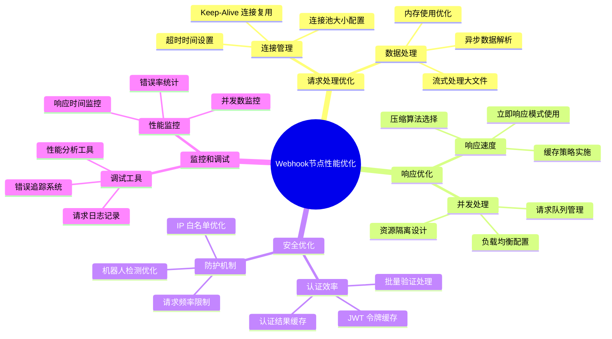
```mermaid
mindmap
  root((Webhook节点性能优化))
    请求处理优化
      连接管理
        Keep-Alive 连接复用
        连接池大小配置
        超时时间设置
      数据处理
        流式处理大文件
        异步数据解析
        内存使用优化
    响应优化
      响应速度
        立即响应模式使用
        缓存策略实施
        压缩算法选择
      并发处理
        请求队列管理
        负载均衡配置
        资源隔离设计
    安全优化
      认证效率
        JWT 令牌缓存
        认证结果缓存
        批量验证处理
      防护机制
        请求频率限制
        IP 白名单优化
        机器人检测优化
    监控和调试
      性能监控
        响应时间监控
        并发数监控
        错误率统计
      调试工具
        请求日志记录
        性能分析工具
        错误追踪系统
```

#### 安全最佳实践
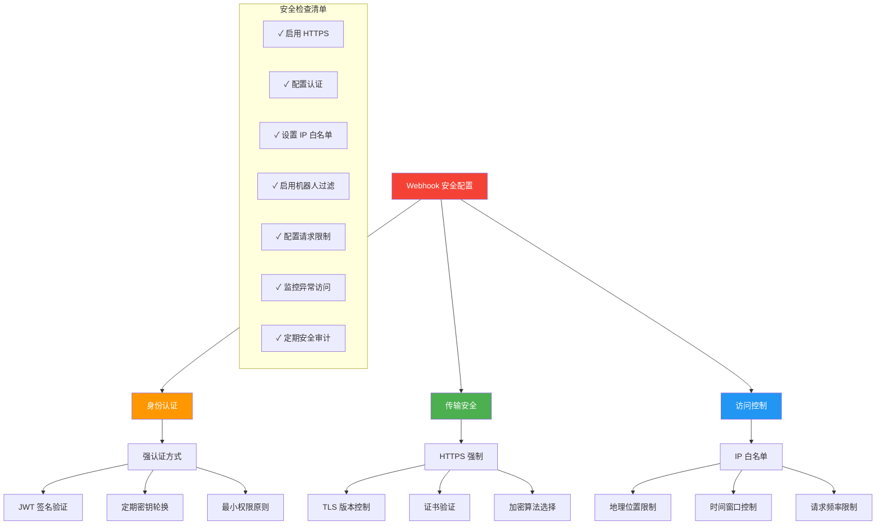
```mermaid
flowchart TD
    A[Webhook 安全配置] --> B[身份认证]
    A --> C[传输安全]
    A --> D[访问控制]

    B --> E[强认证方式]
    E --> F[JWT 签名验证]
    E --> G[定期密钥轮换]
    E --> H[最小权限原则]

    C --> I[HTTPS 强制]
    I --> J[TLS 版本控制]
    I --> K[证书验证]
    I --> L[加密算法选择]

    D --> M[IP 白名单]
    M --> N[地理位置限制]
    M --> O[时间窗口控制]
    M --> P[请求频率限制]

    subgraph "安全检查清单"
        Q[✓ 启用 HTTPS]
        R[✓ 配置认证]
        S[✓ 设置 IP 白名单]
        T[✓ 启用机器人过滤]
        U[✓ 配置请求限制]
        V[✓ 监控异常访问]
        W[✓ 定期安全审计]
    end

    style A fill:#f44336,color:#fff
    style B fill:#FF9800,color:#fff
    style C fill:#4CAF50,color:#fff
    style D fill:#2196F3,color:#fff
```

---

## 7. 技术规格总结

### 7.1 节点接口规格
```typescript
interface WebhookNodeSpecification {
  // 基础信息
  name: 'webhook';
  displayName: 'Webhook';
  group: ['trigger'];
  version: 1 | 1.1 | 2;

  // 触发器特性
  triggerPanel: {
    header: string;
    executionsHelp: {
      inactive: string;
      active: string;
    };
    activationHint: string;
  };

  // HTTP 配置
  supportedMethods: [
    'GET', 'POST', 'PUT', 'DELETE',
    'PATCH', 'HEAD'
  ];

  // 认证方式
  authenticationMethods: {
    none: 'No authentication';
    basicAuth: 'HTTP Basic Authentication';
    headerAuth: 'Custom header authentication';
    jwtAuth: 'JSON Web Token authentication';
  };

  // 响应模式
  responseModes: {
    onReceived: 'Immediate response';
    lastNode: 'Return last node data';
    responseNode: 'Use Respond to Webhook node';
  };

  // 数据处理能力
  dataProcessing: {
    json: boolean;
    formData: boolean;
    binaryData: boolean;
    rawData: boolean;
    multipartForm: boolean;
  };

  // 安全特性
  securityFeatures: {
    ipWhitelist: boolean;
    botFiltering: boolean;
    corsSupport: boolean;
    customHeaders: boolean;
  };
}
```

### 7.2 版本功能对比矩阵

| 功能特性 | V1.0 | V1.1 | V2.0 | 说明 |
|----------|------|------|------|------|
| HTTP 方法支持 | 单一方法 | 单一方法 | 多方法支持 | V2.0 支持同时监听多个方法 |
| 认证方式 | Basic/Header | Basic/Header | Basic/Header/JWT | V2.0 增加 JWT 认证 |
| 响应模式 | 基础模式 | 基础模式 | 响应节点集成 | V2.0 支持响应节点 |
| 二进制处理 | 基础支持 | 改进支持 | 流式处理 | V2.0 优化大文件处理 |
| 安全特性 | 基础认证 | 基础认证 | IP白名单+机器人过滤 | V2.0 增强安全功能 |
| 错误处理 | 简单 | 改进 | 完善 | 逐步增强错误处理 |
| 性能优化 | 基础 | 优化 | 高度优化 | V2.0 显著性能提升 |

### 7.3 性能指标与限制

- **并发处理能力**: 支持高并发请求，建议 < 1000 并发
- **请求大小限制**: 默认 100MB，可配置
- **文件上传支持**: 支持多文件上传，单文件建议 < 50MB
- **响应时间**: 立即响应模式 < 100ms，工作流响应依赖复杂度
- **认证验证**: JWT 验证 < 10ms，Basic Auth < 5ms
- **内存占用**: 流式处理避免大文件内存问题
- **安全防护**: IP 白名单、机器人过滤、认证验证

### 7.4 与其他节点的集成模式

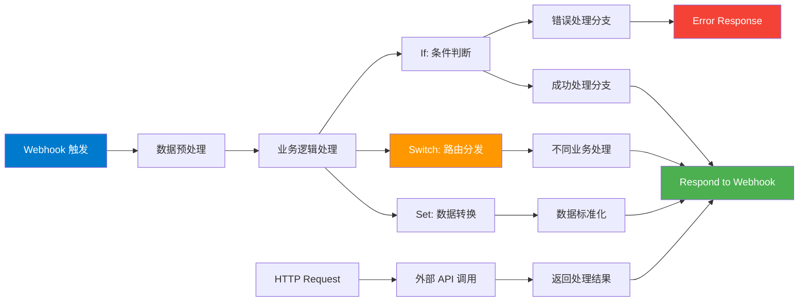
```mermaid
graph LR
    A[Webhook 触发] --> B[数据预处理]
    B --> C[业务逻辑处理]

    C --> D[If: 条件判断]
    C --> E[Switch: 路由分发]
    C --> F[Set: 数据转换]

    D --> G[成功处理分支]
    D --> H[错误处理分支]

    E --> I[不同业务处理]
    F --> J[数据标准化]

    G --> K[Respond to Webhook]
    H --> L[Error Response]
    I --> K
    J --> K

    M[HTTP Request] --> N[外部 API 调用]
    N --> O[返回处理结果]
    O --> K

    style A fill:#007acc,color:#fff
    style K fill:#4CAF50,color:#fff
    style L fill:#f44336,color:#fff
    style E fill:#FF9800,color:#fff
```

### 7.5 最佳实践指南

#### 设计原则
1. **安全第一**: 始终启用适当的认证和访问控制
2. **性能考虑**: 选择合适的响应模式优化性能
3. **错误处理**: 实现完善的错误处理和恢复机制
4. **可维护性**: 使用清晰的路径命名和文档化
5. **监控告警**: 建立完善的监控和告警系统

#### 避免常见陷阱
1. **安全配置不当**: 忽略认证或使用弱认证方式
2. **性能问题**: 在高并发场景下使用同步响应模式
3. **错误处理不足**: 缺乏适当的错误响应和日志记录
4. **资源泄漏**: 大文件处理时内存管理不当
5. **配置错误**: 响应节点配置与响应模式不匹配

#### 监控与调试技巧
1. **请求日志**: 记录所有请求的详细信息
2. **性能监控**: 监控响应时间和并发数
3. **安全审计**: 定期检查安全配置和访问日志
4. **错误追踪**: 建立完善的错误追踪和告警机制
5. **负载测试**: 定期进行负载测试验证性能

Webhook 节点作为 n8n 中最重要的触发器组件，提供了强大而灵活的 HTTP 端点功能。通过合理的配置和使用，它能够构建安全、高性能的 API 服务和事件驱动的集成解决方案。
