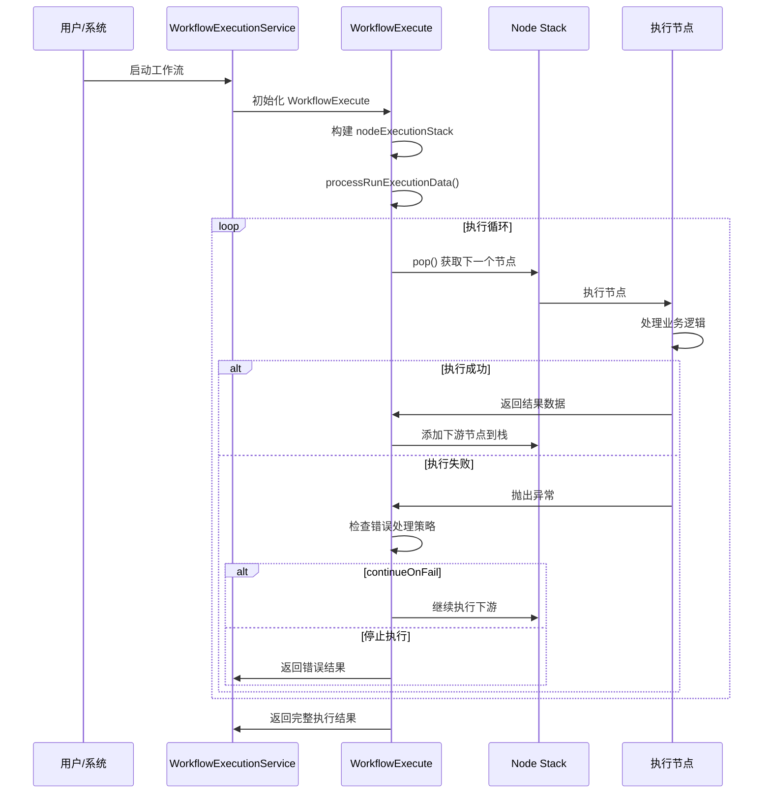
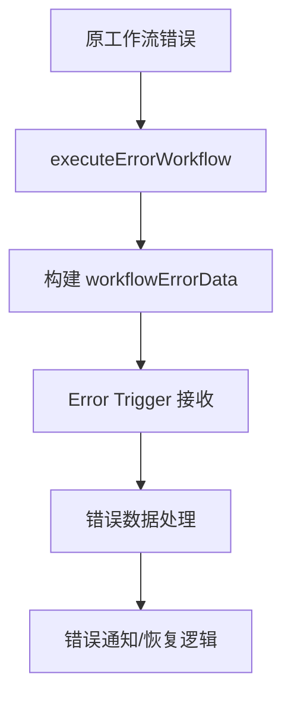
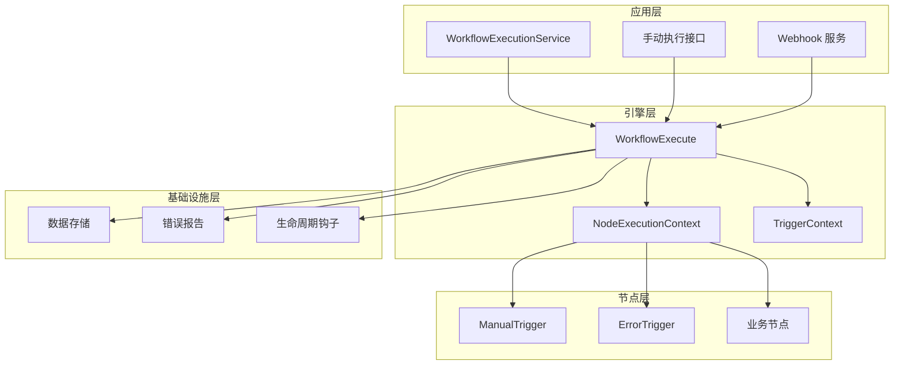
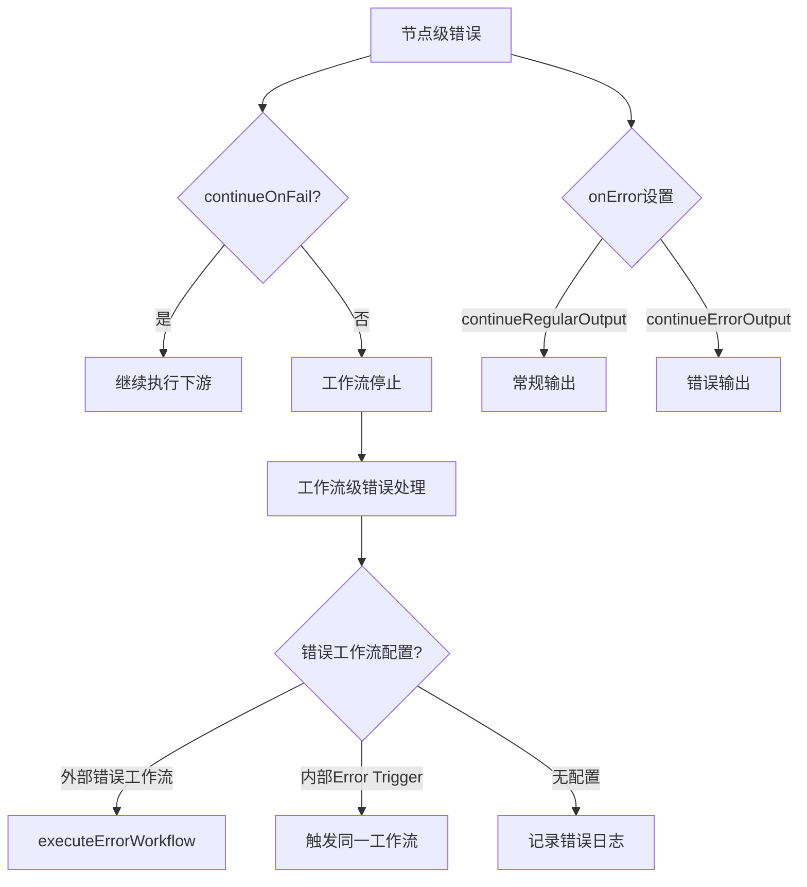

# n8n 工作流引擎技术实现深度分析

## 概述

本文档深入分析 n8n 工作流引擎的技术实现，重点对比正常工作流执行与 Error Trigger Node 工作流执行流程的差异。通过分析源码架构、执行机制和错误处理策略，揭示 n8n 如何实现可靠、高效的工作流自动化。

## 目录

1. [工作流引擎核心架构](#工作流引擎核心架构)
2. [正常工作流执行流程](#正常工作流执行流程)
3. [Error Trigger Node 实现机制](#error-trigger-node-实现机制)
4. [两种执行流程对比分析](#两种执行流程对比分析)
5. [架构设计与技术亮点](#架构设计与技术亮点)
6. [错误处理策略](#错误处理策略)
7. [性能优化与扩展性](#性能优化与扩展性)

## 工作流引擎核心架构

### 1. WorkflowExecute 类

`WorkflowExecute` 是 n8n 工作流引擎的核心类，位于 `packages/core/src/execution-engine/workflow-execute.ts`：

```typescript
export class WorkflowExecute {
  private status: ExecutionStatus = 'new';
  private readonly abortController = new AbortController();
  timedOut: boolean = false;

  constructor(
    private readonly additionalData: IWorkflowExecuteAdditionalData,
    private readonly mode: WorkflowExecuteMode,
    private runExecutionData: IRunExecutionData = {
      startData: {},
      resultData: {
        runData: {},
        pinData: {},
      },
      executionData: {
        contextData: {},
        nodeExecutionStack: [],
        metadata: {},
        waitingExecution: {},
        waitingExecutionSource: {},
      },
    },
  ) {}
}
```

**核心数据结构分析：**

- **status**: 执行状态跟踪 (`'new' | 'running' | 'canceled'`)
- **abortController**: 支持执行取消的控制器
- **runExecutionData**: 完整的执行数据上下文
- **nodeExecutionStack**: 节点执行栈，控制执行顺序
- **waitingExecution**: 处理多输入节点的等待机制

### 2. 执行模式 (WorkflowExecuteMode)

n8n 支持多种执行模式，每种模式有不同的处理逻辑：

```typescript
export type WorkflowExecuteMode =
  | 'cli'          // 命令行执行
  | 'error'        // 错误处理工作流
  | 'integrated'   // 集成执行
  | 'internal'     // 内部执行
  | 'manual'       // 手动执行
  | 'retry'        // 重试执行
  | 'trigger'      // 触发器执行
  | 'webhook'      // Webhook 执行
  | 'evaluation';  // 评估执行
```

### 3. 核心执行方法

#### run() 方法 - 完整工作流执行
```typescript
run(
  workflow: Workflow,
  startNode?: INode,
  destinationNode?: string,
  pinData?: IPinData,
  triggerToStartFrom?: IWorkflowExecutionDataProcess['triggerToStartFrom'],
): PCancelable<IRun>
```

#### runPartialWorkflow2() 方法 - 部分工作流执行
```typescript
runPartialWorkflow2(
  workflow: Workflow,
  runData: IRunData,
  pinData: IPinData = {},
  dirtyNodeNames: string[] = [],
  destinationNodeName: string,
  agentRequest?: AiAgentRequest,
): PCancelable<IRun>
```

## 正常工作流执行流程

### 1. 执行启动流程



### 2. 节点执行核心逻辑

```typescript
// 位于 workflow-execute.ts:1238
async runNode(
  workflow: Workflow,
  executionData: IExecuteData,
  runExecutionData: IRunExecutionData,
  runIndex: number,
  additionalData: IWorkflowExecuteAdditionalData,
  mode: WorkflowExecuteMode,
  abortSignal?: AbortSignal,
  subNodeExecutionResults?: EngineResponse,
): Promise<IRunNodeResponse | EngineRequest> {
  const { node } = executionData;

  // 1. 检查节点是否被禁用
  if (node.disabled === true) {
    return this.handleDisabledNode(inputData);
  }

  // 2. 获取节点类型和自定义操作
  const nodeType = workflow.nodeTypes.getByNameAndVersion(node.type, node.typeVersion);
  const customOperation = this.getCustomOperation(node, nodeType);

  // 3. 准备连接输入数据
  const connectionInputData = this.prepareConnectionInputData(
    workflow, nodeType, customOperation, inputData,
  );

  // 4. 根据节点类型选择执行策略
  if (nodeType.execute || customOperation) {
    return await this.executeNode(...);
  }
  if (nodeType.poll) {
    return await this.executePollNode(...);
  }
  if (nodeType.trigger) {
    return await this.executeTriggerNode(...);
  }

  // 5. 处理声明式节点
  return await this.executeDeclarativeNodeInTest(...);
}
```

### 3. 数据流处理机制

#### 输入数据准备
```typescript
private prepareConnectionInputData(
  workflow: Workflow,
  nodeType: INodeType,
  customOperation: ReturnType<WorkflowExecute['getCustomOperation']>,
  inputData: ITaskDataConnections,
): INodeExecutionData[] | null {
  // 处理执行节点、轮询节点、触发器节点的不同输入需求
  if (nodeType.execute || customOperation) {
    if (!inputData.main?.length) return null;

    let connectionInputData = inputData.main[0];

    // v0 执行模式的兼容性处理
    const forceInputNodeExecution = workflow.settings.executionOrder !== 'v1';
    if (!forceInputNodeExecution) {
      // 寻找第一个包含数据的输入
      for (const mainData of inputData.main) {
        if (mainData?.length) {
          connectionInputData = mainData;
          break;
        }
      }
    }

    return connectionInputData.length === 0 ? null : connectionInputData;
  }

  // 轮询、触发器节点不需要输入数据处理
  return [];
}
```

#### 输出数据分发
```typescript
// 位于 workflow-execute.ts:1966-2070
// 添加下游节点到执行栈
if (Object.hasOwn(workflow.connectionsBySourceNode, executionNode.name)) {
  if (Object.hasOwn(workflow.connectionsBySourceNode[executionNode.name], 'main')) {
    // 遍历所有输出连接
    for (const outputIndex in workflow.connectionsBySourceNode[executionNode.name].main) {
      for (const connectionData of workflow.connectionsBySourceNode[executionNode.name].main[outputIndex] ?? []) {
        if (nodeSuccessData![outputIndex] &&
            (nodeSuccessData![outputIndex].length !== 0 ||
             (connectionData.index > 0 && this.isLegacyExecutionOrder(workflow)))) {
          // 将节点添加到执行队列
          this.addNodeToBeExecuted(
            workflow, connectionData, parseInt(outputIndex, 10),
            executionNode.name, nodeSuccessData!, runIndex,
          );
        }
      }
    }
  }
}
```

## Error Trigger Node 实现机制

### 1. Error Trigger 节点定义

```typescript
// 位于 packages/nodes-base/nodes/ErrorTrigger/ErrorTrigger.node.ts
export class ErrorTrigger implements INodeType {
  description: INodeTypeDescription = {
    displayName: 'Error Trigger',
    name: 'errorTrigger',
    icon: 'fa:bug',
    iconColor: 'blue',
    group: ['trigger'],
    version: 1,
    description: 'Triggers the workflow when another workflow has an error',
    eventTriggerDescription: '',
    mockManualExecution: true,  // 支持手动测试
    maxNodes: 1,
    defaults: {
      name: 'Error Trigger',
      color: '#0000FF',
    },
    inputs: [],
    outputs: [NodeConnectionTypes.Main],
    properties: [
      {
        displayName: 'This node will trigger when there is an error...',
        name: 'notice',
        type: 'notice',
        default: '',
      },
    ],
  };
}
```

**关键特性分析：**
- **mockManualExecution: true**: 支持手动测试模式
- **maxNodes: 1**: 限制每个工作流只能有一个错误触发器
- **无输入连接**: 作为触发器节点，不需要输入

### 2. 执行逻辑实现

```typescript
async execute(this: IExecuteFunctions): Promise<INodeExecutionData[][]> {
  const items = this.getInputData();
  const mode = this.getMode();

  if (
    mode === 'manual' &&
    items.length === 1 &&
    Object.keys(items[0].json).length === 0 &&
    items[0].binary === undefined
  ) {
    // 手动测试模式 - 生成示例错误数据
    const restApiUrl = this.getRestApiUrl();
    const urlParts = restApiUrl.split('/');
    urlParts.pop();
    urlParts.push('execution');

    items[0].json = {
      execution: {
        id: 231,
        url: `${urlParts.join('/')}/workflow/1/231`,
        retryOf: '34',
        error: {
          message: 'Example Error Message',
          stack: 'Stacktrace',
        },
        lastNodeExecuted: 'Node With Error',
        mode: 'manual',
      },
      workflow: {
        id: '1',
        name: 'Example Workflow',
      },
    };
  }

  return [items];
}
```

**执行逻辑特点：**
1. **手动测试支持**: 在手动模式下生成示例错误数据
2. **数据透传**: 在生产模式下直接传递错误数据
3. **标准化输出**: 确保错误数据格式的一致性

### 3. 错误工作流触发机制

```typescript
// 位于 packages/cli/src/execution-lifecycle/execute-error-workflow.ts
export function executeErrorWorkflow(
  workflowData: IWorkflowBase,
  fullRunData: IRun,
  mode: WorkflowExecuteMode,
  executionId?: string,
  retryOf?: string,
): void {
  // 检查是否有错误发生
  if (fullRunData.data.resultData.error !== undefined) {
    const workflowErrorData: IWorkflowErrorData = {
      execution: {
        id: executionId!,
        url: pastExecutionUrl,
        error: fullRunData.data.resultData.error,
        lastNodeExecuted: fullRunData.data.resultData.lastNodeExecuted!,
        mode,
        retryOf,
      },
      workflow: {
        id: workflowData.id,
        name: workflowData.name,
      },
    };

    // 检查错误工作流配置
    const { errorWorkflow } = workflowData.settings ?? {};
    if (errorWorkflow && !(mode === 'error' && workflowData.id && errorWorkflow === workflowData.id)) {
      // 执行外部错误工作流
      Container.get(WorkflowExecutionService).executeErrorWorkflow(
        errorWorkflow, workflowErrorData, project,
      );
    } else if (mode !== 'error' &&
               workflowData.nodes.some((node) => node.type === errorTriggerType)) {
      // 执行内部错误触发器工作流
      Container.get(WorkflowExecutionService).executeErrorWorkflow(
        workflowData.id, workflowErrorData, project,
      );
    }
  }
}
```

**触发策略分析：**
1. **外部错误工作流**: 优先执行配置的专用错误工作流
2. **内部错误触发器**: 回退到包含 Error Trigger 的同一工作流
3. **循环防护**: 防止错误工作流自身的错误触发无限循环

## 两种执行流程对比分析

### 1. 执行触发方式对比

| 方面 | 正常工作流执行 | Error Trigger 工作流执行 |
|------|----------------|-------------------------|
| **触发条件** | 用户手动/定时器/Webhook | 其他工作流发生错误 |
| **执行模式** | 'manual'/'trigger'/'webhook' | 'error' |
| **数据来源** | 触发器生成/外部输入 | 错误上下文数据 |
| **执行上下文** | 全新执行环境 | 错误恢复环境 |

### 2. 数据流对比

#### 正常执行数据流
```mermaid
flowchart TD
    A[用户/系统触发] --> B[ManualTrigger/Webhook]
    B --> C[生成空对象 {}]
    C --> D[下游节点处理]
    D --> E[业务逻辑执行]
    E --> F[结果输出]
```

#### 错误触发数据流


### 3. 错误处理策略对比

#### 正常执行错误处理
```typescript
// 位于 workflow-execute.ts:1852-1883
if (executionError !== undefined) {
  taskData.error = executionError;
  taskData.executionStatus = 'error';

  if (
    executionData.node.continueOnFail === true ||
    ['continueRegularOutput', 'continueErrorOutput'].includes(executionData.node.onError || '')
  ) {
    // 继续执行策略
    if (Object.hasOwn(executionData.data, 'main') && executionData.data.main.length > 0) {
      nodeSuccessData = [executionData.data.main[0]];
    }
  } else {
    // 停止执行策略
    this.runExecutionData.resultData.runData[executionNode.name].push(taskData);
    this.runExecutionData.executionData!.nodeExecutionStack.unshift(executionData);
    break;
  }
}
```

#### 错误触发执行处理
```typescript
// Error Trigger 直接处理传入的错误数据
async execute(this: IExecuteFunctions): Promise<INodeExecutionData[][]> {
  const items = this.getInputData(); // 直接获取错误数据
  // ... 错误数据处理逻辑
  return [items]; // 传递给下游处理
}
```

### 4. 执行环境差异

| 特性 | 正常执行 | 错误触发执行 |
|------|----------|--------------|
| **执行栈** | 从触发器开始构建 | 从 Error Trigger 开始 |
| **数据上下文** | 全新/初始数据 | 继承错误上下文 |
| **重试机制** | 支持节点级重试 | 通常不重试（避免错误循环） |
| **生命周期钩子** | 完整生命周期钩子 | 特殊错误处理钩子 |
| **资源清理** | 正常清理流程 | 可能需要特殊清理 |

## 架构设计与技术亮点

### 1. 分层架构设计



### 2. 状态管理机制

#### 执行状态转换
```typescript
// 执行状态定义
export type ExecutionStatus =
  | 'new'        // 新创建
  | 'running'    // 运行中
  | 'success'    // 成功完成
  | 'error'      // 执行错误
  | 'canceled'   // 已取消
  | 'waiting';   // 等待中

// 状态管理示例
this.status = 'running';
// ... 执行逻辑
if (executionError) {
  this.status = 'error';
} else if (this.runExecutionData.waitTill) {
  this.status = 'waiting';
} else {
  this.status = 'success';
}
```

#### 节点执行栈管理
```typescript
interface IExecuteData {
  node: INode;                    // 要执行的节点
  data: ITaskDataConnections;     // 输入数据
  source: ISourceData[] | null;   // 数据来源
  runIndex?: number;              // 运行索引
  metadata?: ITaskMetadata;       // 元数据
}
```

### 3. 异步执行与取消机制

```typescript
// PCancelable 支持执行取消
return new PCancelable(async (resolve, _reject, onCancel) => {
  onCancel(() => {
    this.status = 'canceled';
    this.updateTaskStatusesToCancelled();
    this.abortController.abort();
  });

  // 执行逻辑...
});
```

### 4. 多输入节点处理

```typescript
// 等待多输入数据的机制
private prepareWaitingToExecution(nodeName: string, numberOfConnections: number, runIndex: number) {
  const executionData = this.runExecutionData.executionData!;

  executionData.waitingExecution ??= {};
  executionData.waitingExecutionSource ??= {};

  const nodeWaiting = (executionData.waitingExecution[nodeName] ??= []);
  nodeWaiting[runIndex] = { main: [] };

  // 为每个连接预留空间
  for (let i = 0; i < numberOfConnections; i++) {
    nodeWaiting[runIndex].main.push(null);
  }
}
```

## 错误处理策略

### 1. 分层错误处理架构



### 2. 错误数据结构标准化

```typescript
export interface IWorkflowErrorData {
  execution?: {
    id: string;
    url: string;
    error: ExecutionBaseError;
    lastNodeExecuted: string;
    mode: WorkflowExecuteMode;
    retryOf?: string;
  };
  trigger?: {
    error: ExecutionBaseError;
    mode: WorkflowExecuteMode;
  };
  workflow: {
    id: string;
    name: string;
  };
}
```

### 3. 循环防护机制

```typescript
// 防止错误工作流自身的错误触发无限循环
const { errorWorkflow } = workflowData.settings ?? {};
if (errorWorkflow &&
    !(mode === 'error' && workflowId && errorWorkflow === workflowId)) {
  // 只有当不是错误工作流自身的错误时才执行
  Container.get(WorkflowExecutionService).executeErrorWorkflow(
    errorWorkflow, workflowErrorData, project,
  );
}
```

### 4. 错误恢复与重试

```typescript
// 节点级重试机制
let maxTries = 1;
if (executionData.node.retryOnFail === true) {
  maxTries = Math.min(5, Math.max(2, executionData.node.maxTries || 3));
}

let waitBetweenTries = 0;
if (executionData.node.retryOnFail === true) {
  waitBetweenTries = Math.min(
    5000,
    Math.max(0, executionData.node.waitBetweenTries || 1000),
  );
}

// 重试执行循环
for (let tryIndex = 0; tryIndex < maxTries; tryIndex++) {
  try {
    // 执行节点
    let runNodeData = await this.runNode(...);
    // 成功则跳出重试循环
    break;
  } catch (error) {
    if (tryIndex < maxTries - 1) {
      await sleep(waitBetweenTries); // 等待后重试
    } else {
      throw error; // 重试次数用完，抛出错误
    }
  }
}
```

## 性能优化与扩展性

### 1. 内存管理优化

#### 数据结构复用
```typescript
// 避免重复创建对象
const newTaskDataConnections: ITaskDataConnections = {};
for (const connectionType of Object.keys(executionData.data)) {
  newTaskDataConnections[connectionType] = executionData.data[connectionType].map(
    (input, inputIndex) => {
      if (input === null) return input;
      return input.map((item, itemIndex) => ({
        ...item,
        pairedItem: {
          item: itemIndex,
          input: inputIndex || undefined,
        },
      }));
    },
  );
}
```

#### 及时清理机制
```typescript
// 执行完成后清理等待数据
delete this.runExecutionData.executionData!.waitingExecution[nodeName][runIndex];
delete this.runExecutionData.executionData!.waitingExecutionSource[nodeName][runIndex];

if (Object.keys(this.runExecutionData.executionData!.waitingExecution[nodeName]).length === 0) {
  delete this.runExecutionData.executionData!.waitingExecution[nodeName];
  delete this.runExecutionData.executionData!.waitingExecutionSource[nodeName];
}
```

### 2. 执行顺序优化

#### v0 vs v1 执行模式
```typescript
// v0 模式：按位置排序执行（从左上到右下）
if (workflow.settings.executionOrder === 'v1') {
  nodesToAdd.sort((a, b) => {
    if (a.position[1] < b.position[1]) return 1;
    if (a.position[1] > b.position[1]) return -1;
    if (a.position[0] > b.position[0]) return -1;
    return 0;
  });
}

// v1 模式：按连接顺序执行
else {
  this.addNodeToBeExecuted(workflow, connectionData, outputIndex, parentNodeName, nodeSuccessData!, runIndex);
}
```

### 3. 并发控制

#### 异步执行支持
```typescript
// 支持 PCancelable 的异步执行
return new PCancelable(async (resolve, _reject, onCancel) => {
  // 设置最大监听器数量，避免警告
  setMaxListeners(Infinity, this.abortController.signal);

  onCancel.shouldReject = false;
  onCancel(() => {
    this.status = 'canceled';
    this.abortController.abort();
  });

  // 异步执行逻辑
  const returnPromise = (async () => {
    // ... 执行逻辑
  })();

  return await returnPromise.then(resolve);
});
```

### 4. 扩展性设计

#### 插件化节点架构
```typescript
// 支持自定义节点类型
export interface INodeType {
  description: INodeTypeDescription;
  execute?(this: IExecuteFunctions): Promise<NodeOutput>;
  poll?(this: IPollFunctions): Promise<INodeExecutionData[][] | null>;
  trigger?(this: ITriggerFunctions): Promise<ITriggerResponse | undefined>;
  webhook?(this: IWebhookFunctions): Promise<IWebhookResponseData>;
  customOperations?: {
    [resource: string]: {
      [operation: string]: (this: IExecuteFunctions) => Promise<NodeOutput>;
    };
  };
}
```

#### 上下文注入机制
```typescript
// 不同类型节点的上下文
export class ExecuteContext extends BaseExecuteContext implements IExecuteFunctions
export class TriggerContext extends NodeExecutionContext implements ITriggerFunctions
export class PollContext extends NodeExecutionContext implements IPollFunctions
export class WebhookContext extends NodeExecutionContext implements IWebhookFunctions
```

## 总结

n8n 工作流引擎展现了优秀的架构设计和技术实现：

### 🔍 核心发现

1. **统一的执行框架**: 无论是正常执行还是错误触发执行，都基于相同的 `WorkflowExecute` 引擎，确保了一致性和可靠性。

2. **灵活的错误处理**: 支持节点级、工作流级的多层次错误处理策略，既保证了系统的稳定性，又提供了足够的灵活性。

3. **高效的内存管理**: 通过对象复用、及时清理等机制，在保证功能完整性的同时优化了性能。

4. **优秀的扩展性**: 插件化的节点架构和上下文注入机制，使得系统易于扩展和维护。

### 🎯 架构优势

1. **模块化设计**: 清晰的分层架构，职责分离明确
2. **异步执行**: 支持取消、超时、重试等高级特性
3. **错误恢复**: 完善的错误处理和恢复机制
4. **性能优化**: 多种性能优化策略，支持大规模工作流执行

### 🚀 技术亮点

- **状态机模式**: 清晰的执行状态管理
- **观察者模式**: 生命周期钩子机制
- **策略模式**: 不同执行模式的处理策略
- **工厂模式**: 节点上下文的创建和管理

这种设计使得 n8n 能够处理复杂的业务流程，同时保持系统的稳定性和可扩展性，为用户提供了强大而可靠的工作流自动化平台。

---

*本文档基于 n8n 项目源码深度分析生成，涵盖了工作流引擎的核心实现机制和最佳实践。*
