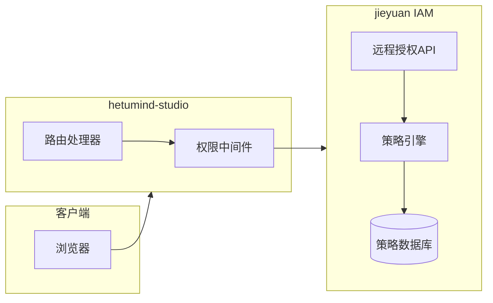

# Hetumind Jieyuan IAM 权限系统整合方案

## 概述

本文档描述了 hetumind-studio 如何集成 jieyuan 的 IAM 权限系统，实现企业级的权限控制。Hetumind 是一个类似于 n8n 的 AI Workflow 和普通 Workflow 平台，支持工作流设计、执行、监控等功能。通过与 jieyuan 的远程授权集成，hetumind-studio 可以实现细粒度的权限控制，包括基于角色的访问控制（RBAC）和资源级别的权限管理。

## 架构概览



## 核心功能

### 1. 双层资源格式支持

支持策略配置和 API 调用的不同格式：

- **策略配置格式**：`jr:hetumind:{tenant_id}:workflow/123`
- **API 调用格式**：`jr:hetumind:workflow/123`（自动注入 tenant_id）

### 2. 远程授权中间件

自动处理权限检查，包括：

- 令牌验证
- 策略评估
- 上下文注入
- 权限拒绝响应

### 3. 路由元数据系统

将权限要求绑定到具体路由：

- 动作定义（如 `hetumind:read`）
- 资源模板（如 `jr:hetumind:workflow/{id}`）
- 参数注入（如路径参数）

## 权限资源命名规范

### 双层格式设计

#### 1. 策略配置格式（完整格式）

- **用途**：策略定义、数据库存储、权限评估
- **格式**：`jr:{service}:{tenant_id}:{type}/{id}`
- **特点**：明确、健壮、无歧义

#### 2. 客户端使用格式（简化格式）

- **用途**：API 调用、代码编写、日常使用
- **格式**：`jr:{service}:{type}/{id}`
- **特点**：简洁、便捷、自动注入

### 资源类型定义

| 使用场景     | 格式类型 | 示例                                                             |
| ------------ | -------- | ---------------------------------------------------------------- |
| **策略配置** | 完整格式 | `jr:hetumind:42:workflow/123e4567-e89b-12d3-a456-426614174000`   |
| **API 调用** | 简化格式 | `jr:hetumind:workflow/123e4567-e89b-12d3-a456-426614174000`      |
| **策略配置** | 完整格式 | `jr:hetumind:42:credential/123e4567-e89b-12d3-a456-426614174000` |
| **API 调用** | 简化格式 | `jr:hetumind:credential/123e4567-e89b-12d3-a456-426614174000`    |
| **策略配置** | 完整格式 | `jr:hetumind:42:execution/123e4567-e89b-12d3-a456-426614174000`  |
| **API 调用** | 简化格式 | `jr:hetumind:execution/123e4567-e89b-12d3-a456-426614174000`     |

## 操作命名规范

遵循 `{service}:{verb}` 格式，所有操作均使用 `hetumind:` 前缀：

### 基础 CRUD 操作

- `hetumind:create` - 创建资源
- `hetumind:read` - 读取资源
- `hetumind:update` - 更新资源
- `hetumind:delete` - 删除资源
- `hetumind:list` - 列出资源

### 特定操作

- `hetumind:execute` - 执行工作流
- `hetumind:validate` - 验证工作流
- `hetumind:activate` - 激活工作流
- `hetumind:deactivate` - 停用工作流
- `hetumind:duplicate` - 复制工作流
- `hetumind:cancel` - 取消执行
- `hetumind:retry` - 重试执行
- `hetumind:share` - 共享资源
- `hetumind:manage` - 管理权限（高级操作）

## 完整资源-操作映射表

### 1. 工作流 (workflow)

| 操作           | API 端点                             | 资源模板                    | 权限要求              |
| -------------- | ------------------------------------ | --------------------------- | --------------------- |
| 创建工作流     | `POST /v1/workflows`                 | `jr:hetumind:workflow/*`    | `hetumind:create`     |
| 查询工作流列表 | `POST /v1/workflows/query`           | `jr:hetumind:workflow/*`    | `hetumind:list`       |
| 获取工作流详情 | `GET /v1/workflows/{id}`             | `jr:hetumind:workflow/{id}` | `hetumind:read`       |
| 更新工作流     | `PUT /v1/workflows/{id}`             | `jr:hetumind:workflow/{id}` | `hetumind:update`     |
| 删除工作流     | `DELETE /v1/workflows/{id}`          | `jr:hetumind:workflow/{id}` | `hetumind:delete`     |
| 验证工作流     | `POST /v1/workflows/validate`        | `jr:hetumind:workflow/*`    | `hetumind:validate`   |
| 执行工作流     | `POST /v1/workflows/{id}/execute`    | `jr:hetumind:workflow/{id}` | `hetumind:execute`    |
| 激活工作流     | `POST /v1/workflows/{id}/activate`   | `jr:hetumind:workflow/{id}` | `hetumind:activate`   |
| 停用工作流     | `POST /v1/workflows/{id}/deactivate` | `jr:hetumind:workflow/{id}` | `hetumind:deactivate` |
| 复制工作流     | `POST /v1/workflows/{id}/duplicate`  | `jr:hetumind:workflow/{id}` | `hetumind:duplicate`  |

### 2. 凭证 (credential)

| 操作         | API 端点                      | 资源模板                      | 权限要求            |
| ------------ | ----------------------------- | ----------------------------- | ------------------- |
| 创建凭证     | `POST /v1/credentials`        | `jr:hetumind:credential/*`    | `hetumind:create`   |
| 查询凭证列表 | `POST /v1/credentials/query`  | `jr:hetumind:credential/*`    | `hetumind:list`     |
| 获取凭证详情 | `GET /v1/credentials/{id}`    | `jr:hetumind:credential/{id}` | `hetumind:read`     |
| 更新凭证     | `PUT /v1/credentials/{id}`    | `jr:hetumind:credential/{id}` | `hetumind:update`   |
| 删除凭证     | `DELETE /v1/credentials/{id}` | `jr:hetumind:credential/{id}` | `hetumind:delete`   |
| 验证凭证     | `POST /v1/credentials/verify` | `jr:hetumind:credential/*`    | `hetumind:validate` |

### 3. 执行记录 (execution)

| 操作         | API 端点                          | 资源模板                     | 权限要求          |
| ------------ | --------------------------------- | ---------------------------- | ----------------- |
| 查询执行记录 | `POST /v1/executions/query`       | `jr:hetumind:execution/*`    | `hetumind:list`   |
| 获取执行详情 | `GET /v1/executions/{id}`         | `jr:hetumind:execution/{id}` | `hetumind:read`   |
| 取消执行     | `POST /v1/executions/{id}/cancel` | `jr:hetumind:execution/{id}` | `hetumind:cancel` |
| 重试执行     | `POST /v1/executions/{id}/retry`  | `jr:hetumind:execution/{id}` | `hetumind:retry`  |

### 4. 项目管理 (project)

| 操作         | 资源模板                   | 权限要求          |
| ------------ | -------------------------- | ----------------- |
| 创建项目     | `jr:hetumind:project/*`    | `hetumind:create` |
| 读取项目     | `jr:hetumind:project/{id}` | `hetumind:read`   |
| 更新项目     | `jr:hetumind:project/{id}` | `hetumind:update` |
| 删除项目     | `jr:hetumind:project/{id}` | `hetumind:delete` |
| 列出项目     | `jr:hetumind:project/*`    | `hetumind:list`   |
| 管理项目成员 | `jr:hetumind:project/{id}` | `hetumind:manage` |

## 角色权限设计

基于最小权限原则，设计以下角色：

### 基础角色

#### `viewer` (查看者)

- `hetumind:read` - 所有资源
- `hetumind:list` - 所有资源

#### `editor` (编辑者)

- 包含 viewer 所有权限
- `hetumind:create` - workflow, credential
- `hetumind:update` - workflow, credential
- `hetumind:delete` - workflow, credential
- `hetumind:validate` - workflow
- `hetumind:execute` - workflow
- `hetumind:activate` - workflow
- `hetumind:deactivate` - workflow
- `hetumind:duplicate` - workflow

#### `admin` (管理员)

- 包含 editor 所有权限
- `hetumind:manage` - 所有资源
- `hetumind:cancel` - execution
- `hetumind:retry` - execution
- `hetumind:update` - user
- `hetumind:create` - project, folder
- `hetumind:delete` - project, folder

## 权限策略示例

### 基础角色策略

```json
{
  "version": "2025-01-01",
  "id": "hetumind-basic-roles",
  "statement": [
    {
      "sid": "viewer_access",
      "effect": "allow",
      "action": ["hetumind:read", "hetumind:list"],
      "resource": ["jr:hetumind:{tenant_id}:*"],
      "condition": {
        "string_equals": {
          "jr:principal_roles": ["viewer", "editor", "admin"]
        }
      }
    },
    {
      "sid": "editor_access",
      "effect": "allow",
      "action": ["hetumind:create", "hetumind:update", "hetumind:execute", "hetumind:duplicate"],
      "resource": ["jr:hetumind:{tenant_id}:workflow/*"],
      "condition": {
        "string_equals": {
          "jr:principal_roles": ["editor", "admin"]
        }
      }
    },
    {
      "sid": "admin_access",
      "effect": "allow",
      "action": ["hetumind:*"],
      "resource": ["jr:hetumind:{tenant_id}:*"],
      "condition": {
        "string_equals": {
          "jr:principal_roles": ["admin"]
        }
      }
    }
  ]
}
```

### 资源级权限策略

```json
{
  "version": "2025-01-01",
  "id": "hetumind-resource-level",
  "statement": [
    {
      "sid": "own_workflow_access",
      "effect": "allow",
      "action": ["hetumind:*"],
      "resource": ["jr:hetumind:{tenant_id}:workflow/*"],
      "condition": {
        "string_equals": {
          "jr:principal_user_id": "{created_by}"
        }
      }
    },
    {
      "sid": "project_member_access",
      "effect": "allow",
      "action": ["hetumind:read", "hetumind:list"],
      "resource": ["jr:hetumind:{tenant_id}:project/{project_id}/*"],
      "condition": {
        "string_equals": {
          "jr:principal_user_id": "{project_member_id}"
        }
      }
    }
  ]
}
```

## 快速开始

### 环境配置

```bash
# 设置 jieyuan 服务地址
export JIEYUAN_BASE_URL="http://localhost:50010"
export JIEYUAN_TIMEOUT_MS="5000"
```

### 基础路由注册

```rust
use hetumind_studio::web::remote_authz_middleware::route_with_authz;

// 简单的权限控制路由
let router = route_with_authz!(
    router,
    axum::routing::get,
    "/api/v1/workflows",
    list_workflows_handler,
    "hetumind:list",           // 权限动作
    "jr:hetumind:workflow/*"  // 资源模板
);
```

### 带参数的路由

```rust
use hetumind_studio::web::remote_authz_middleware::route_with_authz_and_extras;

// 带路径参数的权限控制路由
let router = route_with_authz_and_extras!(
    router,
    axum::routing::get,
    "/api/v1/workflows/:id",
    get_workflow_handler,
    "hetumind:read",
    "jr:hetumind:workflow/{id}",
    HashMap::from([("id".to_string(), "".to_string())])
);
```

### 处理器中获取用户上下文

```rust
use hetumind_studio::web::remote_authz_middleware::CtxPayloadView;

pub async fn get_workflow_handler(
    parts: Parts,
    State(_app): State<Application>,
    Path(workflow_id): Path<Uuid>,
) -> WebResult<Json<Value>> {
    // 获取权限中间件注入的用户上下文
    let ctx = parts.extensions.get::<CtxPayloadView>()
        .ok_or_else(|| WebError::unauthorized("missing user context"))?;

    // 使用用户信息
    let response = json!({
        "workflow_id": workflow_id,
        "user_id": ctx.user_id(),
        "tenant_id": ctx.tenant_id(),
        "roles": ctx.principal_roles
    });

    Ok(Json(response))
}
```

## 高级用法

### 自定义中间件栈

```rust
// 构建复杂的中间件栈
router = router
    .route("/api/v1/workflows/:id/execute", execute_workflow_handler)
    // 步骤1: 注入路径参数
    .route_layer(middleware::from_fn_with_args(
        inject_extras,
        HashMap::from([("workflow_id".to_string(), "".to_string())])
    ))
    // 步骤2: 注入路由元数据
    .route_layer(middleware::from_fn_with_args(
        inject_route_meta,
        "hetumind:execute",
        "jr:hetumind:workflow/{workflow_id}"
    ))
    // 步骤3: 执行权限检查
    .route_layer(middleware::from_fn(remote_authz_guard));
```

### 条件权限检查

```rust
pub async fn sensitive_operation_handler(
    parts: Parts,
    State(_app): State<Application>,
) -> WebResult<Json<Value>> {
    let ctx = get_user_context(&parts)?;

    // 额外的业务逻辑权限检查
    let can_perform = ctx.has_role("admin") ||
        (ctx.has_role("editor") && is_business_hours());

    if !can_perform {
        return Err(WebError::forbidden("权限不足"));
    }

    // 执行敏感操作
    Ok(Json(json!({"message": "操作成功"})))
}
```

## 技术实现参考

核心技术实现已移至 [`iam.md`](./iam.md) 文档，包括：

- **远程授权 API 端点实现** (`jieyuan/jieyuan/src/endpoint/api/v1/iams.rs`)
- **双层格式资源模板渲染** (`jieyuan/jieyuan-core/src/model/iam_api.rs`)
- **客户端远程授权中间件** (`hetumind/hetumind-studio/src/web/remote_authz_middleware.rs`)
- **故障排除与调试工具**
- **部署与配置指南**

## 最佳实践

### 权限设计原则

- **最小权限原则**: 只授予必要的权限
- **基于角色的访问控制**: 使用角色管理权限
- **资源级权限**: 在必要时实施细粒度控制
- **权限审计**: 记录所有权限检查

### 性能优化

- **权限缓存**: 缓存频繁的权限检查结果
- **批量权限检查**: 对相关操作进行批量权限验证
- **异步权限检查**: 避免阻塞主要业务流程

### 安全考虑

- **令牌验证**: 确保令牌的有效性和完整性
- **权限边界**: 防止权限提升攻击
- **租户隔离**: 严格的租户数据隔离
- **审计日志**: 完整的权限操作记录

## 总结

通过集成 jieyuan 的 IAM 权限系统，hetumind-studio 获得了企业级的权限控制能力，包括：

- ✅ 远程权限验证和策略评估
- ✅ 双层资源格式支持（自动 tenant_id 注入）
- ✅ 基于角色的访问控制
- ✅ 细粒度的资源级权限
- ✅ 完整的权限审计和日志
- ✅ 高性能的权限检查中间件

这个集成方案为 hetumind-studio 提供了安全、可扩展且易于维护的权限控制基础设施。

## 代码文件引用

### jieyuan 核心组件

- **资源模板渲染**: `jieyuan/jieyuan-core/src/model/iam_api.rs`
- **路由元数据**: `jieyuan/jieyuan-core/src/web/route_meta.rs`
- **远程授权客户端**: `jieyuan/jieyuan-core/src/web/remote_authz.rs`
- **远程授权 API**: `jieyuan/jieyuan/src/endpoint/api/v1/iams.rs`

### hetumind-studio 集成

- **权限中间件**: `hetumind/hetumind-studio/src/web/remote_authz_middleware.rs`
- **权限示例**: `hetumind/hetumind-studio/src/web/authz_example.rs`
- **工作流示例**: `hetumind/hetumind-studio/src/endpoint/api/workflow_example.rs`
- **集成测试**: `hetumind/hetumind-studio/tests/authz_integration_test.rs`
