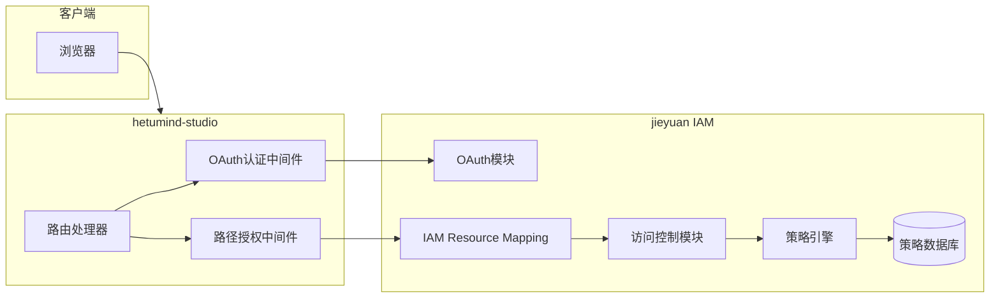

# Hetumind Jieyuan IAM 权限系统整合方案

## 概述

本文档描述了 hetumind-studio 如何集成 jieyuan 的 IAM 权限系统，实现企业级的权限控制。Hetumind 是一个类似于 n8n 的 AI Workflow 和普通 Workflow 平台，支持工作流设计、执行、监控等功能。通过与 jieyuan 的远程授权集成，hetumind-studio 可以实现细粒度的权限控制，包括基于角色的访问控制（RBAC）和资源级别的权限管理。

> **架构更新**: jieyuan 已重构为模块化架构，支持 OAuth 认证模块独立运行和 IAM Resource Mapping 零配置权限管理。

## 架构概览



## 核心功能

### 1. IAM Resource Mapping 零配置权限管理

通过路径映射实现零配置权限控制：

- **路径模式匹配**：`/api/v1/workflows/{id}` → `hetumind:read` / `iam:hetumind:workflow/{id}`
- **自动参数提取**：路径参数自动解析并注入到资源模板
- **集中管理**：所有权限配置集中在 jieyuan 管理后台
- **租户隔离**：支持租户级别的权限隔离

### 2. OAuth 2.0 + PKCE 认证

独立的 OAuth 认证模块提供：

- **Authorization Code + PKCE**：安全的认证流程
- **JWT 令牌管理**：自动令牌验证和刷新
- **用户同步**：实时用户信息同步
- **认证代理**：hetumind 作为认证代理重定向到 jieyuan

### 3. 混合架构资源格式

采用统一的简化策略格式，支持智能租户处理：

- **策略配置格式**：`iam:hetumind:workflow/123`（统一简化格式，不含 tenant_id）
- **运行时智能注入**：根据用户类型自动处理租户隔离或跨租户访问
  - 普通用户：自动注入当前租户ID
  - 平台管理员：根据访问模式处理（当前/全部/特定租户）

### 4. 模块化访问控制

新的访问控制模块提供：

- **统一认证服务**：AuthSvc 集中处理认证逻辑
- **策略服务**：PolicySvc 处理策略评估和授权
- **资源映射服务**：ResourceSvc 管理 IAM Resource Mapping
- **缓存优化**：提高权限检查性能

## 权限资源命名规范

### 混合架构统一格式

#### 统一简化格式

- **用途**：策略定义、API调用、权限评估
- **格式**：`iam:{service}:{type}/{id}`
- **特点**：简化、灵活、智能租户处理
- **租户处理**：运行时根据用户上下文自动注入
  - 普通用户：当前租户ID
  - 平台管理员：根据访问模式处理（当前/全部/特定）

- **用途**：API 调用、代码编写、日常使用
- **格式**：`iam:{service}:{type}/{id}`
- **特点**：简洁、便捷、自动注入

### 资源类型定义

| 资源类型 | 格式示例 | 说明 |
| -------- | -------- | ---- |
| **工作流** | `iam:hetumind:workflow/{id}` | 工作流资源 |
| **凭证** | `iam:hetumind:credential/{id}` | 凭证资源 |
| **执行记录** | `iam:hetumind:execution/{id}` | 执行记录资源 |
| **项目管理** | `iam:hetumind:project/{id}` | 项目资源 |

**智能租户处理**：
- 普通用户：自动注入当前租户ID
- 平台管理员：根据租户访问模式处理（当前/全部/特定）

## 操作命名规范

遵循 `{service}:{verb}` 格式，所有操作均使用 `hetumind:` 前缀：

### 基础 CRUD 操作

- `hetumind:create` - 创建资源
- `hetumind:read` - 读取资源
- `hetumind:update` - 更新资源
- `hetumind:delete` - 删除资源
- `hetumind:list` - 列出资源

### 特定操作

- `hetumind:execute` - 执行工作流
- `hetumind:validate` - 验证工作流
- `hetumind:activate` - 激活工作流
- `hetumind:deactivate` - 停用工作流
- `hetumind:duplicate` - 复制工作流
- `hetumind:cancel` - 取消执行
- `hetumind:retry` - 重试执行
- `hetumind:share` - 共享资源
- `hetumind:manage` - 管理权限（高级操作）

## 完整资源-操作映射表

### 1. 工作流 (workflow)

| 操作           | API 端点                             | 资源模板                     | 权限要求              |
| -------------- | ------------------------------------ | ---------------------------- | --------------------- |
| 创建工作流     | `POST /v1/workflows`                 | `iam:hetumind:workflow/*`    | `hetumind:create`     |
| 查询工作流列表 | `POST /v1/workflows/query`           | `iam:hetumind:workflow/*`    | `hetumind:list`       |
| 获取工作流详情 | `GET /v1/workflows/{id}`             | `iam:hetumind:workflow/{id}` | `hetumind:read`       |
| 更新工作流     | `PUT /v1/workflows/{id}`             | `iam:hetumind:workflow/{id}` | `hetumind:update`     |
| 删除工作流     | `DELETE /v1/workflows/{id}`          | `iam:hetumind:workflow/{id}` | `hetumind:delete`     |
| 验证工作流     | `POST /v1/workflows/validate`        | `iam:hetumind:workflow/*`    | `hetumind:validate`   |
| 执行工作流     | `POST /v1/workflows/{id}/execute`    | `iam:hetumind:workflow/{id}` | `hetumind:execute`    |
| 激活工作流     | `POST /v1/workflows/{id}/activate`   | `iam:hetumind:workflow/{id}` | `hetumind:activate`   |
| 停用工作流     | `POST /v1/workflows/{id}/deactivate` | `iam:hetumind:workflow/{id}` | `hetumind:deactivate` |
| 复制工作流     | `POST /v1/workflows/{id}/duplicate`  | `iam:hetumind:workflow/{id}` | `hetumind:duplicate`  |

### 2. 凭证 (credential)

| 操作         | API 端点                      | 资源模板                       | 权限要求            |
| ------------ | ----------------------------- | ------------------------------ | ------------------- |
| 创建凭证     | `POST /v1/credentials`        | `iam:hetumind:credential/*`    | `hetumind:create`   |
| 查询凭证列表 | `POST /v1/credentials/query`  | `iam:hetumind:credential/*`    | `hetumind:list`     |
| 获取凭证详情 | `GET /v1/credentials/{id}`    | `iam:hetumind:credential/{id}` | `hetumind:read`     |
| 更新凭证     | `PUT /v1/credentials/{id}`    | `iam:hetumind:credential/{id}` | `hetumind:update`   |
| 删除凭证     | `DELETE /v1/credentials/{id}` | `iam:hetumind:credential/{id}` | `hetumind:delete`   |
| 验证凭证     | `POST /v1/credentials/verify` | `iam:hetumind:credential/*`    | `hetumind:validate` |

### 3. 执行记录 (execution)

| 操作         | API 端点                          | 资源模板                      | 权限要求          |
| ------------ | --------------------------------- | ----------------------------- | ----------------- |
| 查询执行记录 | `POST /v1/executions/query`       | `iam:hetumind:execution/*`    | `hetumind:list`   |
| 获取执行详情 | `GET /v1/executions/{id}`         | `iam:hetumind:execution/{id}` | `hetumind:read`   |
| 取消执行     | `POST /v1/executions/{id}/cancel` | `iam:hetumind:execution/{id}` | `hetumind:cancel` |
| 重试执行     | `POST /v1/executions/{id}/retry`  | `iam:hetumind:execution/{id}` | `hetumind:retry`  |

### 4. 项目管理 (project)

| 操作         | 资源模板                    | 权限要求          |
| ------------ | --------------------------- | ----------------- |
| 创建项目     | `iam:hetumind:project/*`    | `hetumind:create` |
| 读取项目     | `iam:hetumind:project/{id}` | `hetumind:read`   |
| 更新项目     | `iam:hetumind:project/{id}` | `hetumind:update` |
| 删除项目     | `iam:hetumind:project/{id}` | `hetumind:delete` |
| 列出项目     | `iam:hetumind:project/*`    | `hetumind:list`   |
| 管理项目成员 | `iam:hetumind:project/{id}` | `hetumind:manage` |

## 角色权限设计

基于最小权限原则，设计以下角色：

### 基础角色

#### `viewer` (查看者)

- `hetumind:read` - 所有资源
- `hetumind:list` - 所有资源

#### `editor` (编辑者)

- 包含 viewer 所有权限
- `hetumind:create` - workflow, credential
- `hetumind:update` - workflow, credential
- `hetumind:delete` - workflow, credential
- `hetumind:validate` - workflow
- `hetumind:execute` - workflow
- `hetumind:activate` - workflow
- `hetumind:deactivate` - workflow
- `hetumind:duplicate` - workflow

#### `admin` (管理员)

- 包含 editor 所有权限
- `hetumind:manage` - 所有资源
- `hetumind:cancel` - execution
- `hetumind:retry` - execution
- `hetumind:update` - user
- `hetumind:create` - project, folder
- `hetumind:delete` - project, folder

## 权限策略示例

### 基础角色策略

```json
{
  "version": "2025-01-01",
  "id": "hetumind-basic-roles",
  "statement": [
    {
      "sid": "viewer_access",
      "effect": "allow",
      "action": ["hetumind:read", "hetumind:list"],
      "resource": ["iam:hetumind:{tenant_id}:*"],
      "condition": {
        "string_equals": {
          "iam:principal_roles": ["viewer", "editor", "admin"]
        }
      }
    },
    {
      "sid": "editor_access",
      "effect": "allow",
      "action": ["hetumind:create", "hetumind:update", "hetumind:execute", "hetumind:duplicate"],
      "resource": ["iam:hetumind:{tenant_id}:workflow/*"],
      "condition": {
        "string_equals": {
          "iam:principal_roles": ["editor", "admin"]
        }
      }
    },
    {
      "sid": "admin_access",
      "effect": "allow",
      "action": ["hetumind:*"],
      "resource": ["iam:hetumind:{tenant_id}:*"],
      "condition": {
        "string_equals": {
          "iam:principal_roles": ["admin"]
        }
      }
    }
  ]
}
```

### 资源级权限策略

```json
{
  "version": "2025-01-01",
  "id": "hetumind-resource-level",
  "statement": [
    {
      "sid": "own_workflow_access",
      "effect": "allow",
      "action": ["hetumind:*"],
      "resource": ["iam:hetumind:{tenant_id}:workflow/*"],
      "condition": {
        "string_equals": {
          "iam:principal_user_id": "{created_by}"
        }
      }
    },
    {
      "sid": "project_member_access",
      "effect": "allow",
      "action": ["hetumind:read", "hetumind:list"],
      "resource": ["iam:hetumind:{tenant_id}:project/{project_id}/*"],
      "condition": {
        "string_equals": {
          "iam:principal_user_id": "{project_member_id}"
        }
      }
    }
  ]
}
```

## 快速开始

### 环境配置

```bash
# 设置 jieyuan 服务地址
export JIEYUAN_BASE_URL="http://localhost:50010"
export JIEYUAN_TIMEOUT_MS="5000"
```

### 基础路由注册

```rust
use hetumind_studio::web::remote_authz_middleware::route_with_authz;

// 简单的权限控制路由
let router = route_with_authz!(
    router,
    axum::routing::get,
    "/api/v1/workflows",
    list_workflows_handler,
    "hetumind:list",           // 权限动作
    "iam:hetumind:workflow/*"  // 资源模板
);
```

### 带参数的路由

```rust
use hetumind_studio::web::remote_authz_middleware::route_with_authz_and_extras;

// 带路径参数的权限控制路由
let router = route_with_authz_and_extras!(
    router,
    axum::routing::get,
    "/api/v1/workflows/:id",
    get_workflow_handler,
    "hetumind:read",
    "iam:hetumind:workflow/{id}",
    HashMap::from([("id".to_string(), "".to_string())])
);
```

### 处理器中获取用户上下文

```rust
use hetumind_studio::web::remote_authz_middleware::CtxPayloadView;

pub async fn get_workflow_handler(
    parts: Parts,
    State(_app): State<Application>,
    Path(workflow_id): Path<Uuid>,
) -> WebResult<Json<Value>> {
    // 获取权限中间件注入的用户上下文
    let ctx = parts.extensions.get::<CtxPayloadView>()
        .ok_or_else(|| WebError::unauthorized("missing user context"))?;

    // 使用用户信息
    let response = json!({
        "workflow_id": workflow_id,
        "user_id": ctx.user_id(),
        "tenant_id": ctx.tenant_id(),
        "roles": ctx.principal_roles
    });

    Ok(Json(response))
}
```

## 高级用法

### 简化的权限中间件配置

使用 Resource-Path 优化方案后，权限配置变得非常简单：

```rust
// 应用级别的权限中间件配置
pub fn app() -> Router {
    Router::new()
        // 所有路由都自动应用权限检查
        .route("/api/v1/workflows", post(create_workflow))
        .route("/api/v1/workflows/:id", get(get_workflow))
        .route("/api/v1/workflows/:id/execute", post(execute_workflow))
        // 统一的权限中间件，无需额外配置
        .layer(middleware::from_fn_with_state(app.clone(), unified_authz_middleware))
}
```

### 条件权限检查

```rust
pub async fn sensitive_operation_handler(
    ctx: CtxPayload,  // 直接从中间件获取用户上下文
) -> WebResult<Json<Value>> {
    // 额外的业务逻辑权限检查
    let can_perform = ctx.has_role("admin") ||
        (ctx.has_role("editor") && is_business_hours());

    if !can_perform {
        return Err(WebError::forbidden("权限不足"));
    }

    // 执行敏感操作
    Ok(Json(json!({"message": "操作成功"})))
}
```

## Resource-Path 优化方案

### 概述

基于混合架构的 IAM 系统，hetumind-studio 可以实现简化的权限控制体验：

- **普通用户**：策略资源格式简化（不包含 tenant_id），自动租户隔离
- **平台管理员**：支持跨租户访问和多种租户访问模式
- **统一集成**：基于路径码的权限管理，零配置开发体验

### IAM Resource Mapping 混合架构集成方案

#### 核心理念

**混合架构权限控制**：
- 普通用户使用简化的策略格式，自动处理租户隔离
- 平台管理员支持灵活的跨租户访问权限配置
- 所有权限配置通过 jieyuan 管理后台的 IAM Resource Mapping 进行

#### 集成步骤

1. **OAuth 认证集成**
```rust
// 文件：hetumind/hetumind-studio/src/endpoint/mod.rs
use jieyuan::oauth::OAuthSvc;

pub async fn init_web(app: Application) -> Result<(), DataError> {
    let oauth_svc = OAuthSvc::new(app.jieyuan_config()?);

    let router = Router::new()
        .nest("/api", api::routes())
        .with_state(app.clone())
        .layer(TraceLayer::new_for_http())
        .layer(CorsLayer::new().allow_methods(cors::Any).allow_origin(cors::Any))
        .layer(SetSensitiveRequestHeadersLayer::new(vec![AUTHORIZATION]))
        .layer(CompressionLayer::new())
        // OAuth 认证中间件
        .layer(axum::middleware::from_fn_with_state(oauth_svc, oauth_middleware))
        // IAM Resource Mapping 权限中间件
        .layer(axum::middleware::from_fn_with_state(app.clone(), path_authz_middleware));

    WebServerBuilder::new(router).build().await
}
```

2. **混合架构权限中间件**
```rust
// 文件：jieyuan/jieyuan-core/src/web/middleware/mixed_authz.rs
use axum::{extract::Request, middleware::Next, response::Response};
use fusion_core::application::Application;

pub async fn mixed_authz_middleware(
    State(app): State<Application>,
    mut req: Request,
    next: Next,
) -> Result<Response, WebError> {
    // 1) 提取认证和请求信息
    let auth_header = extract_auth_header(&req)?;
    let path_code = extract_path_code(&req);
    let request_ip = extract_client_ip(&req);
    let extras = extract_request_extras(&req);
    
    // 2) 调用 jieyuan 权限检查
    let authz_response = app.jieyuan_client()
        .authorize(auth_header, AuthorizeRequest::new(path_code)
            .with_request_ip(request_ip)
            .with_extras(extras))
        .await?;
    
    // 3) 增强用户上下文（平台管理员特殊处理）
    let enhanced_ctx = enhance_context_for_platform_admin(authz_response.ctx, &req).await?;
    
    // 4) 注入增强的上下文和租户过滤器
    req.extensions_mut().insert(enhanced_ctx.clone());
    req.extensions_mut().insert(TenantFilter::new(enhanced_ctx.clone()));
    req.extensions_mut().insert(TenantAccessValidator::new(enhanced_ctx.clone()));
    
    Ok(next.run(req).await)
}
```

### 混合架构开发体验

#### 普通用户 vs 平台管理员

| 方面 | 普通用户 | 平台管理员 |
| --- | --- | --- |
| **策略格式** | 简化（无 tenant_id） | 支持租户访问条件 |
| **租户隔离** | 自动，仅当前租户 | 可配置（当前/全部/特定） |
| **跨租户访问** | 不支持 | 支持 |
| **权限管理** | 基础角色权限 | 高级权限和特权 |
| **开发复杂度** | 简单 | 中等 |
| **配置方式** | 策略驱动 | 配置 + 策略驱动 |

## 技术实现参考

核心技术实现已移至 [`iam.md`](./iam.md) 文档，包括：

- **远程授权 API 端点实现** (`jieyuan/jieyuan/src/endpoint/api/v1/iams.rs`)
- **IAM Resource Mapping 管理机制** (`jieyuan/jieyuan-core/src/model/iam_resource_mapping.rs`)
- **基于路径码的授权** (`jieyuan/jieyuan/src/endpoint/api/v1/iams.rs`)
- **OAuth 认证模块** (`jieyuan/jieyuan/src/oauth/oauth_svc.rs`)
- **访问控制模块** (`jieyuan/jieyuan/src/access_control/`)
- **混合架构资源模板渲染** (`jieyuan/jieyuan-core/src/model/iam_api.rs`)
- **平台管理员服务** (`jieyuan/jieyuan-core/src/service/platform_admin_svc.rs`)
- **租户过滤组件** (`jieyuan/jieyuan-core/src/model/tenant_filter.rs`)
- **故障排除与调试工具**
- **部署与配置指南**

## 最佳实践

### 权限设计原则

- **最小权限原则**: 只授予必要的权限
- **基于角色的访问控制**: 使用角色管理权限
- **资源级权限**: 在必要时实施细粒度控制
- **权限审计**: 记录所有权限检查

### 性能优化

- **权限缓存**: 缓存频繁的权限检查结果
- **批量权限检查**: 对相关操作进行批量权限验证
- **异步权限检查**: 避免阻塞主要业务流程

### 安全考虑

- **令牌验证**: 确保令牌的有效性和完整性
- **权限边界**: 防止权限提升攻击
- **租户隔离**: 严格的租户数据隔离
- **审计日志**: 完整的权限操作记录

## 总结

通过集成 jieyuan 的 IAM 权限系统和 Resource-Path 优化机制，hetumind-studio 获得了企业级的权限控制能力，包括：

- ✅ 远程权限验证和策略评估
- ✅ 双层资源格式支持（自动 tenant_id 注入）
- ✅ 基于角色的访问控制
- ✅ 细粒度的资源级权限
- ✅ 完整的权限审计和日志
- ✅ 高性能的权限检查中间件
- ✅ **零配置权限控制**：通过 Resource-Path 机制实现极简集成
- ✅ **集中权限管理**：通过 jieyuan 管理后台统一配置路径映射
- ✅ **简化的开发体验**：无需在代码中配置权限元数据

这个集成方案为 hetumind-studio 提供了安全、可扩展、易于维护且开发友好的权限控制基础设施。

### 集成方案选择

| 需求场景 | 推荐方案 | 特点 |
|---------|---------|------|
| 新项目 | **IAM Resource Mapping 方案** | 零配置、极简开发、集中管理 |
| 复杂权限需求 | 混合方案 | 基础权限用路径映射，特殊权限用直接模板 |
| 需要 OAuth 集成 | **OAuth + IAM Resource Mapping** | 完整认证授权解决方案 |

---

## 未来优化改进方向

### 1. 智能化权限管理

#### 自适应权限配置
- **AI 辅助配置**: 基于业务模式自动推荐权限策略
- **权限使用分析**: 分析权限使用模式，优化策略配置
- **异常检测**: 自动识别异常权限使用行为

#### 权限可视化
- **权限图谱**: 可视化展示权限关系和依赖
- **影响分析**: 权限变更的影响范围分析
- **合规检查**: 自动化的权限合规性检查

### 2. 生态系统扩展

#### 多租户增强
- **租户隔离优化**: 更细粒度的租户资源隔离
- **跨租户权限**: 安全的跨租户权限协作机制
- **租户模板**: 标准化的租户权限配置模板

#### 第三方集成
- **OAuth Provider 集成**: 支持更多第三方 OAuth 提供商
- **LDAP/AD 集成**: 企业目录服务集成
- **SAML 支持**: 企业级单点登录支持

### 3. 开发体验提升

#### 低代码平台支持
- **可视化工作流**: 拖拽式权限配置工作流
- **模板市场**: 权限配置模板共享市场
- **快速部署**: 一键式权限环境部署

#### API 生态
- **GraphQL 支持**: GraphQL 权限查询接口
- **Webhook 事件**: 权限变更的 Webhook 通知
- **开放 API**: 更丰富的权限管理 API

### 4. 性能与可靠性

#### 高可用架构
- **多活部署**: 权限服务多活部署支持
- **故障恢复**: 自动故障检测和恢复机制
- **降级策略**: 服务降级时的权限保护机制

#### 性能监控
- **实时监控**: 权限检查性能实时监控
- **性能调优**: 基于监控数据的自动性能调优
- **容量规划**: 基于使用模式的容量预测

### 5. 安全合规

#### 隐私保护
- **数据脱敏**: 敏感权限数据的脱敏处理
- **隐私计算**: 支持隐私计算的权限验证
- **数据最小化**: 权限数据的最小化收集和使用

#### 审计与合规
- **实时审计**: 权限操作的实时审计日志
- **合规报告**: 自动化的合规性报告生成
- **取证支持**: 安全事件的数字取证支持

## 代码文件引用

### jieyuan 核心组件

- **资源模板渲染**: `jieyuan/jieyuan-core/src/model/iam_api.rs`
- **路由元数据**: `jieyuan/jieyuan-core/src/web/route_meta.rs`
- **远程授权客户端**: `jieyuan/jieyuan-core/src/web/remote_authz.rs`
- **远程授权 API**: `jieyuan/jieyuan/src/endpoint/api/v1/iams.rs`

### hetumind-studio 集成

- **权限中间件**: `hetumind/hetumind-studio/src/web/remote_authz_middleware.rs`
- **权限示例**: `hetumind/hetumind-studio/src/web/authz_example.rs`
- **工作流示例**: `hetumind/hetumind-studio/src/endpoint/api/workflow_example.rs`
- **集成测试**: `hetumind/hetumind-studio/tests/authz_integration_test.rs`
