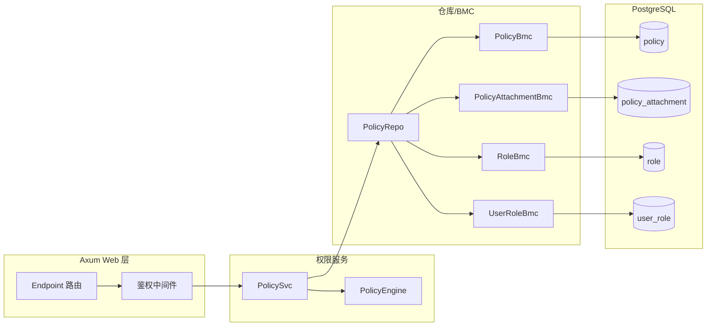
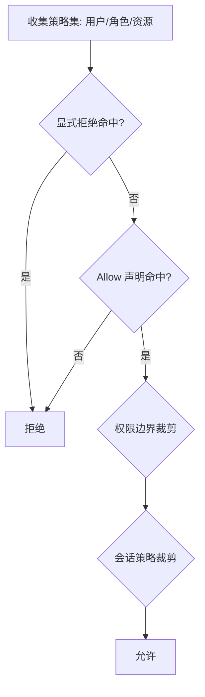

# IAM 策略与权限技术方案（jieyuan）

- 目标：在 `jieyuan` 项目内实现一套可扩展、可维护的 IAM 策略与权限系统，支持租户隔离、平台租户跨租户能力、显式拒绝优先、条件驱动的细粒度授权。
- 约束与约定：
  - 策略配置与结构字段统一使用 `snake_case` 命名；Rust enum 使用 `#[serde(rename_all = "snake_case")]`。
  - 策略评估遵循“显式 deny 优先 → allow 命中 → 边界/会话裁剪”。
  - 时间类型统一使用 `chrono::DateTime<chrono::FixedOffset>`。
  - 数据库访问统一使用 BMC 模式（`fusionsql` 宏），并复用当前项目已有模块与错误处理：`fusion-common`、`fusion-core`、`fusion-db`、`fusion-web`、`fusionsql`、`jieyuan-core`。
  - 错误统一复用：`fusion_core::DataError`、`fusionsql::SqlError`、`fusion_web::WebError`。
  - 并发访问：对外服务对象（如 `PolicySvc`）可便宜 `clone`；内部以 `Arc` 持有仓库与缓存（可结合 `ArcSwap`/`DashMap` 后续拓展）。
  - 统一依赖来自工作区 `Cargo.toml`，不引入未声明的第三方库。若需要的库不存在，则终止任务并显示需要的库列表和原因
  - 不设计审计功能；不考虑历史版本兼容与数据库迁移逻辑（系统尚未发布）。
  - 复用 fusion-xxx 库功能，如： fusion-common, fusion-core, fusion-web, fusion-db, fusionsql 等
  - 复用现有的错误处理模式
  - 遵循当前项目 Rust 编程最佳实践，对参数使用 snake_case 风格命名，对于 serde 序列化使用 `#[serde(rename_all = "snake_case")]` 注解
  - 注意 Arc 的使用以支持并发访问
  - 确保程序正确实现并编译成功

---

## 架构总览



- 路由通过鉴权中间件收集 `AuthContext`，交由 `PolicySvc` 进行授权判断。
- `PolicySvc` 聚合多源策略（用户策略、角色策略、资源策略、权限边界、会话策略），调用 `PolicyEngine` 做匹配与条件求值。
- 仓库层基于 BMC 模式访问数据库表，保持一致风格与高可维护性。

---

## 策略文档结构（snake_case）

- 采用 JSON 文档存储策略，版本化字段便于演进；示例：

```json
{
  "version": "2025-01-01",
  "id": "pol-allow-self-change-password",
  "statement": [
    {
      "sid": "self_change_password",
      "effect": "allow",
      "action": ["user:update_password"],
      "resource": ["jr:user:{tenant_id}:{user_id}"],
      "condition": {
        "string_equals": {
          "jr:principal_user_id": "{user_id}",
          "jr:tenant_id": "{tenant_id}"
        }
      }
    }
  ]
}
```

- 关键字段说明：
  - `effect`: `allow`/`deny`，显式拒绝优先。
  - `action`: 行为集合，支持通配（如 `user:*`）。
  - `resource`: 受保护资源集合，支持通配（如 `jr:user:{tenant_id}:*` 或 `jr:user:*:*`）。
  - `condition`: 条件键与上下文绑定进行求值，常用操作包含 `string_equals`、`string_like`、`numeric_equals`、`bool`、`date_less_than`。

---

## 资源与行为命名规范

- **资源标识格式**：`jr:{service}:{tenant_id}:{type}/{id}`

  - **策略配置**：完整格式，如 `jr:hetumind:42:workflow/123`
  - **API 调用**：简化格式，如 `jr:hetumind:workflow/123`（自动注入 tenant_id）
  - **约定简化**：`jr:user:{tenant_id}:{user_id}`、`jr:role:{tenant_id}:{role_id}`、`jr:policy:{tenant_id}:{policy_id}`

- **行为命名**：`{service}:{verb}`
  - **通用操作**：`create`、`read`、`update`、`delete`、`list`
  - **特定操作**：`execute`、`validate`、`activate`、`deactivate`、`duplicate`、`cancel`、`retry`、`share`、`manage`
  - **示例**：
    - `user:create`、`user:read`、`user:update`、`user:delete`
    - `hetumind:execute`、`hetumind:duplicate`、`hetumind:manage`
    - `role:attach_policy`、`role:detach_policy`、`role:assign_to_user`
    - `policy:create`、`policy:update`、`policy:delete`、`policy:attach`、`policy:detach`

### 双层格式设计

为兼顾健壮性与便捷性，采用双层格式设计：

1. **策略层健壮性** - 策略配置中明确包含 tenant_id，确保权限评估准确性
2. **使用层便捷性** - API 调用时使用简化格式，系统自动注入当前用户的 tenant_id
3. **自动转换机制** - jieyuan 在处理请求时自动将简化格式转换为完整格式
4. **向后兼容** - 支持两种格式，确保现有系统平稳迁移

**实现位置**：`jieyuan/jieyuan-core/src/model/iam_api.rs:181-254`

---

## 条件键与上下文

- 常用条件键（snake_case）：

  - `jr:tenant_id`、`jr:principal_user_id`、`jr:principal_roles`、`jr:is_platform_admin`
  - `jr:request_ip`、`jr:method`、`jr:path`
  - `jr:token_seq`、`jr:auth_level`
  - `jr:target_user_id`、`jr:target_tenant_id`

- 上下文结构（Rust，`Arc` 友好）：

```rust
// 文件：jieyuan/jieyuan/src/access_control/auth_ctx.rs
// 结构定义与投影函数已落地于代码库
use chrono::{DateTime, FixedOffset};
use serde::{Deserialize, Serialize};

/// 授权上下文
#[derive(Debug, Clone, Serialize, Deserialize)]
#[serde(rename_all = "snake_case")]
pub struct AuthContext {
  pub principal_user_id: i64,
  pub principal_tenant_id: i64,
  pub principal_roles: Vec<String>,
  pub is_platform_admin: bool,
  pub token_seq: i32,
  pub request_ip: String,
  pub now: DateTime<FixedOffset>,
  pub method: String,
  pub path: String,
}
```

---

## 授权评估流程



- 顺序：
  - 收集候选声明（动作与资源匹配，含通配）→ 条件求值（绑定 `AuthContext`）。
  - 任何 `deny` 命中即拒绝。
  - 若存在 `allow`，继续受权限边界与会话策略裁剪，未超界则允许；否则拒绝。

---

## 服务与仓库接口设计

- 策略文档类型定义（Rust）：

```rust
use serde::{Deserialize, Serialize};

/// 策略文档
#[derive(Debug, Clone, Serialize, Deserialize)]
#[serde(rename_all = "snake_case")]
pub struct PolicyDocument {
  pub version: String,
  pub id: Option<String>,
  pub statement: Vec<PolicyStatement>,
}

/// 声明
#[derive(Debug, Clone, Serialize, Deserialize)]
#[serde(rename_all = "snake_case")]
pub struct PolicyStatement {
  pub sid: Option<String>,
  pub effect: DecisionEffect,
  pub action: Vec<String>,
  pub resource: Vec<String>,
  pub condition: Option<serde_json::Value>,
}

#[derive(Debug, Clone, Serialize, Deserialize, PartialEq, Eq)]
#[serde(rename_all = "snake_case")]
pub enum DecisionEffect { Allow, Deny }
```

- 服务与仓库骨架（可编译）：

```rust
use std::sync::Arc;
use fusion_core::{Result, DataError};
use jieyuan_core::model::PolicyEntity;

/// 仓库接口（基于 BMC 实现）
/// 接口约束与一致性（开发前需同步）：
/// - 角色表达统一为“字符串编码”（如 `tenant_admin`、`platform_admin`），仓库接口使用 `&[String]`；
///   若需映射数值 ID，由仓库内部完成，服务层不传播数值类型。
/// - AppSetting 获取统一：在 Axum route 层通过 `State<Application>` 获取，再调用
///   `.fusion_setting().app().time_offset()`；业务层由调用方传入所需配置，不直接访问 `Application::global()`。
/// - 占位符来源统一：模板渲染的内置占位符仅来自 `AuthContext`；路由参数统一通过 `extras` 显式注入。
/// - 便捷构建方法统一：使用 `AuthContext::try_from_ctx(ctx, time_offset)` 或 `build_auth_context`；不再提供不含时区的 `TryFrom<&Ctx>`。
/// - 错误分层统一：仓库层返回 `fusion_core::DataError`（内部映射 `SqlError`）；端点/中间件仅使用 `fusion_web::WebError`。
#[derive(Clone)]
pub struct PolicyRepo {
  mm: ModelManager,
}
impl PolicyRepo {
  pub fn list_attached_policies_for_user(&self, tenant_id: i64, user_id: i64) -> Result<Vec<PolicyEntity>> {
    todo!("Implement list_attached_policies_for_user")
  }
  pub fn list_policies_for_roles(&self, tenant_id: i64, role_codes: &[String]) -> Result<Vec<PolicyEntity>> {
    todo!("Implement list_policies_for_roles")
  }
  pub fn list_resource_policies(&self, tenant_id: i64, resource: &str) -> Result<Vec<PolicyEntity>> {
    todo!("Implement list_resource_policies")
  }
  pub fn find_permission_boundary(&self, tenant_id: i64, user_id: i64) -> Result<Option<PolicyEntity>> {
    todo!("Implement find_permission_boundary")
  }
  pub fn find_session_policy(&self, token_id: &str) -> Result<Option<PolicyEntity>> {
    todo!("Implement find_session_policy")
  }
}

/// 决策类型（内部服务层使用，与远程 API DecisionEffect 映射）
/// Decision::Allow ↔ DecisionEffect::allow, Decision::Deny ↔ DecisionEffect::deny
#[derive(Debug, Clone, Copy, PartialEq, Eq)]
pub enum Decision { Allow, Deny }

/// 权限服务（Arc 并发友好，使用 trait object）
#[derive(Clone)]
pub struct PolicySvc {
  pub(crate) repo: PolicyRepo,
}

impl PolicySvc {
  /// 函数级注释：创建权限服务（泛型入参，存储为 trait object）
  pub fn new(repo: PolicyRepo) -> Self {
    Self { repo }
  }

  /// 函数级注释：执行授权判断
  /// 返回 Decision 类型，远程 API 使用 PolicyEffect（snake_case）
  pub fn authorize(&self, ctx: &AuthContext, action: &str, resource: &str) -> Result<Decision> {
    // 1) 聚合策略集
    let mut policies = Vec::new();
    policies.extend(self.repo.list_attached_policies_for_user(ctx.principal_tenant_id, ctx.principal_user_id)?);
    policies.extend(self.repo.list_policies_for_roles(ctx.principal_tenant_id, &ctx.principal_roles)?);
    policies.extend(self.repo.list_resource_policies(ctx.principal_tenant_id, resource)?);

    let boundary = self.repo.find_permission_boundary(ctx.principal_tenant_id, ctx.principal_user_id)?;
    let session = self.repo.find_session_policy("current")?;

    // 2) 求值：显式拒绝优先
    if Self::match_any(&policies, ctx, action, resource, DecisionEffect::Deny) { return Ok(Decision::Deny); }

    let allowed = Self::match_any(&policies, ctx, action, resource, DecisionEffect::Allow);
    if !allowed { return Ok(Decision::Deny); }

    // 3) 边界与会话策略裁剪
    if let Some(pb) = boundary { if !Self::match_policy(&pb, ctx, action, resource, DecisionEffect::Allow) { return Ok(Decision::Deny); } }
    if let Some(sp) = session { if !Self::match_policy(&sp, ctx, action, resource, DecisionEffect::Allow) { return Ok(Decision::Deny); } }

    Ok(Decision::Allow)
  }

  /// 函数级注释：匹配任意策略是否命中指定 effect
  fn match_any(policies: &[PolicyEntity], ctx: &AuthContext, action: &str, resource: &str, effect: DecisionEffect) -> bool {
    policies.iter().any(|p| Self::match_policy(p, ctx, action, resource, effect))
  }

  /// 函数级注释：匹配单个策略文档（Action/Resource 通配与 Condition 求值）
  fn match_policy(_p: &PolicyEntity, _ctx: &AuthContext, _action: &str, _resource: &str, _effect: DecisionEffect) -> bool {
    // 解析 JSON，匹配 Action/Resource（支持通配），并求值 Condition
    // 条件键映射：如 jr:tenant_id -> ctx.principal_tenant_id 等
    // 具体实现留作后续迭代；当前返回 false 保证可编译
    false
  }
}
```

- BMC 层参考实现（延续宏风格）：

```rust
use fusionsql::{base::DbBmc, generate_pg_bmc_common, generate_pg_bmc_filter};
use jieyuan_core::model::{
  PolicyAttachmentEntity,
  PolicyAttachmentFilter,
  PolicyAttachmentForInsert,
  PolicyAttachmentForUpdate,
  TABLE_POLICY_ATTACHMENT,
};

/// 函数级注释：策略附着 BMC
pub struct PolicyAttachmentBmc;
impl DbBmc for PolicyAttachmentBmc { const TABLE: &'static str = TABLE_POLICY_ATTACHMENT; }

generate_pg_bmc_common!(
  Bmc: PolicyAttachmentBmc,
  Entity: PolicyAttachmentEntity,
  ForUpdate: PolicyAttachmentForUpdate,
  ForInsert: PolicyAttachmentForInsert,
);

generate_pg_bmc_filter!(
  Bmc: PolicyAttachmentBmc,
  Entity: PolicyAttachmentEntity,
  Filter: PolicyAttachmentFilter,
);
```

> 以上 BMC 类型需在 `jieyuan-core` 中提供对应 `Entity/Filter/ForCreate/ForUpdate/TABLE_*` 定义，保持与现有 `PolicyBmc` 风格一致。

---

## 中间件与路由集成（Axum + fusion-web）

- 在路由层引入鉴权中间件，统一执行授权：

```rust
use axum::{Router, routing::get};
use fusion_web::auth::{AsyncRequireAuthorizationLayer, WebAuth};
// PolicySvc 可便宜 clone，无需 Arc 包裹

/// 函数级注释：示例路由集成鉴权层（PolicySvc 可便宜 clone，无需 Arc 包裹）
pub fn routes(policy_svc: PolicySvc) -> Router {
  Router::new()
    .route("/users", get(|| async { "ok" }))
    .layer(AsyncRequireAuthorizationLayer::new(WebAuth::default()))
}
```

- 中间件从令牌解析 `user_id`、`tenant_id`、`token_seq`、`roles` 等，构造 `AuthContext` 并交由 `PolicySvc::authorize`；返回 `WebError` 作为拒绝响应。

### 从 Ctx 构建 AuthContext 的投影函数（已落地）

```rust
// 文件：jieyuan/jieyuan/src/access_control/auth_ctx.rs
use chrono::{DateTime, FixedOffset, Utc};
use fusion_core::{DataError, Result};
use fusion_common::ctx::Ctx;

/// 函数级注释：将 Ctx 投影为授权求值视图 AuthContext
pub fn build_auth_context(ctx: &Ctx, time_offset: FixedOffset) -> Result<AuthContext> {
  // 使用 AppSetting.time_offset 指定的时区
  let now = DateTime::<Utc>::from(*ctx.req_time()).with_timezone(&time_offset);

  let roles: Vec<String> = ctx
    .payload()
    .get_strings("principal_roles")
    .unwrap_or_default()
    .into_iter()
    .map(|s| s.to_string())
    .collect();

  Ok(AuthContext {
    principal_user_id: ctx.uid(),
    principal_tenant_id: ctx.tenant_id(),
    principal_roles: roles,
    is_platform_admin: ctx.payload().get_bool("is_platform_admin").unwrap_or(false),
    token_seq: ctx.payload().get_i32("token_seq").unwrap_or(0),
    request_ip: ctx.payload().get_str("request_ip").unwrap_or("").to_string(),
    now,
    method: ctx.payload().get_str("method").unwrap_or("").to_string(),
    path: ctx.payload().get_str("path").unwrap_or("").to_string(),
  })
}

/// 函数级注释：提供从 Ctx 与时区构建 AuthContext 的便捷方法
impl AuthContext {
  pub fn try_from_ctx(ctx: &Ctx, time_offset: FixedOffset) -> Result<Self> {
    build_auth_context(ctx, time_offset)
  }
}
```

### 端点路由示例：从 Ctx 构建 AuthContext 并调用授权

```rust
use axum::{extract::{State, Path}, Json};
use fusion_common::ctx::Ctx;
use fusion_web::WebError;
use fusion_core::application::Application;
use crate::access_control::{auth_ctx::build_auth_context, PolicySvc};

#[derive(serde::Serialize)]
struct OkResp { ok: bool }

/// 函数级注释：端点中从 Ctx 构建 AuthContext，并调用 PolicySvc::authorize
pub async fn update_user_endpoint(
  State(policy_svc): State<PolicySvc>,
  State(app): State<Application>,
  Path(user_id): Path<i64>,
  ctx: Ctx,
) -> Result<Json<OkResp>, WebError> {
  // 构建授权上下文（业务层返回 DataError；在端点层映射成 WebError）
  let ac = build_auth_context(&ctx, *app.fusion_setting().app().time_offset())
    .map_err(|e| WebError::bad_request(e.to_string()))?;

  // 示例动作与资源（此处演示自助更新用户资料的授权检查）
  let action = "user:update";
  // 将端点参数解析后作为 extras 占位符注入
  let mut extras = std::collections::HashMap::new();
  extras.insert("user_id", user_id.to_string());
  let resource = render_resource("jr:user:{tenant_id}:{user_id}", &ac, Some(&extras));

  // 调用授权（业务层返回 DataError；在端点层映射为 WebError::unauthorized）
  policy_svc
    .authorize(&ac, action, &resource)
    .map_err(|e| WebError::unauthorized(e.to_string()))?;

  Ok(Json(OkResp { ok: true }))
}
```

### 最小中间件示例：将 DataError 映射为 WebError

````rust
use axum::{http::Request, middleware::Next, response::Response};
use axum::extract::State;
use fusion_common::ctx::Ctx;
use fusion_web::WebError;
use fusion_core::application::Application;
use fusion_core::model::{auth_ctx::build_auth_context, PolicySvc};

// `jieyuan/jieyuan-core/src/web/middleware/authorization_middleware.rs`
/// 函数级注释：最小授权中间件，将业务层 DataError 映射为 WebError
pub async fn authz_guard<B>(
  State(policy_svc): State<PolicySvc>,
  State(app): State<Application>,
  ctx: Ctx,
  mut req: Request<B>,
  next: Next<B>,
) -> Result<Response, WebError> {
  let ac = build_auth_context(&ctx, *app.fusion_setting().app().time_offset())
    .map_err(|e| WebError::bad_request(e.to_string()))?;
  let action = req.method().as_str().to_lowercase();
  let resource = req.uri().path().to_string();

  policy_svc
    .authorize(&ac, &action, &resource)
    .map_err(|e| WebError::unauthorized(e.to_string()))?;

  Ok(next.run(req).await)
}

### 动作与资源映射规范（推荐做法）

为避免将 HTTP 方法与路径直接作为授权语义，建议在路由层为每个端点绑定“动作”和“资源模板”，并在授权中间件读取该元数据：

```rust
use axum::{Router, routing::put, middleware, extract::State};
use axum::extract::FromRef;
use axum::http::Request;

// `jieyuan/jieyuan-core/src/web/middleware/authorization_middleware.rs`
#[derive(Clone)]
pub struct RouteMeta {
  pub action: &'static str,
  pub resource_tpl: &'static str, // 例如 "jr:user:{tenant_id}:{user_id}"
}

/// 函数级注释：注入路由元数据（动作与资源模板）到请求扩展
async fn inject_route_meta<B>(mut req: Request<B>, next: middleware::Next<B>) -> axum::response::Response {
  req.extensions_mut().insert(RouteMeta {
    action: "user:update_password",
    resource_tpl: "jr:user:{tenant_id}:{user_id}",
  });
  next.run(req).await
}

pub fn routes(policy_svc: PolicySvc) -> Router {
  Router::new()
    .route("/api/v1/users/:user_id/password", put(update_user_endpoint))
    .route_layer(middleware::from_fn(inject_route_meta))
}

/// 函数级注释：在中间件或端点中读取 RouteMeta，并填充资源模板（仅内置占位符）
fn render_resource(tpl: &str, ac: &AuthContext) -> String {
  tpl
    .replace("{tenant_id}", &ac.principal_tenant_id.to_string())
    .replace("{user_id}", &ac.principal_user_id.to_string())
    .replace("{method}", &ac.method)
    .replace("{path}", &ac.path)
    .replace("{token_seq}", &ac.token_seq.to_string())
}

// 在中间件中：
// let meta = req.extensions().get::<RouteMeta>().ok_or_else(|| WebError::bad_request("missing route meta"))?;
// let resource = render_resource(meta.resource_tpl, &ac);
// policy_svc.authorize(&ac, meta.action, &resource)?;

/// 函数级注释：扩展资源模板渲染，支持内置与自定义占位符
/// 统一的 render_resource 函数实现见下文"远程授权 API 合约与实现"章节

规范约束：

- 资源模板占位符统一使用 `{snake_case}`，推荐内置：`{tenant_id}`、`{user_id}`、`{role_id}`、`{policy_id}`、`{resource_id}`。
- 动作统一为 `{service}:{verb}`，例如：`user:update_password`、`policy:attach`。
- 平台租户跨租户权限建议通过策略中条件键 `jr:is_platform_admin` 或资源通配 `jr:user:*:*` 明示。

#### AppSetting 获取方式（统一约定）

在 Axum route 层，通过 `State<Application>` 获取应用实例，再调用 `.fusion_setting().app()` 获得 `&AppSetting`：

```rust
use fusion_core::application::Application;

pub async fn example(State(app): State<Application>, ctx: Ctx) {
  let ac = build_auth_context(&ctx, *app.fusion_setting().app().time_offset()).unwrap();
}
```

业务服务层应由调用方传入所需配置（如 `FixedOffset`），不直接访问 `Application::global()`。

#### 路由元数据绑定的宏化示例

为减少样板代码，可提供宏封装路由注册与元数据注入：

```rust
// 文件：仅为文档示例（宏路径与工程组织可按需调整）
macro_rules! route_with_meta {
  ($router:expr, $method:path, $path:expr, $handler:path, $action:expr, $resource_tpl:expr) => {{
    use axum::{middleware, http::Request};
    use crate::access_control::RouteMeta;

    async fn inject_meta<B>(mut req: Request<B>, next: middleware::Next<B>) -> axum::response::Response {
      req.extensions_mut().insert(RouteMeta { action: $action, resource_tpl: $resource_tpl });
      next.run(req).await
    }

    $router
      .route($path, $method($handler))
      .route_layer(middleware::from_fn(inject_meta))
  }}
}

// 使用示例：
// let router = Router::new();
// let router = route_with_meta!(router, axum::routing::put, "/api/v1/users/:user_id/password", update_user_endpoint, "user:update_password", "jr:user:{tenant_id}:{user_id}");
```

该宏与 `web_auth` 的 `AsyncRequireAuthorizationLayer` 互补：

- `web_auth` 负责令牌提取与基础上下文注入（Ctx）。
- 上述宏为具体端点绑定动作与资源模板，便于授权中间件读取并评估。

#### 模板渲染的扩展占位符支持

为支持更丰富的资源表达，提供统一的模板渲染函数。完整的 `render_resource` 实现已在前面的章节中提供，支持内置与可选的自定义占位符：

- 内置占位符：`{tenant_id}`、`{user_id}`、`{method}`、`{path}`、`{token_seq}`、`{principal_roles}`
- 自定义占位符：通过 `extras` 参数注入（如 `role_id`、`policy_id`、`resource_id` 等）

推荐约定：

- 若模板包含 `{role_id}`、`{policy_id}`、`{resource_id}` 等端点参数，请在端点或中间件解析 URL（如 `:user_id`）后放入 `extras`，再调用渲染函数。
- 内置占位符仅覆盖授权上下文中的字段；避免引入隐式数据源。

#### 路由注册器的模式建议（统一、少样板）

当端点数量较多时，建议集中定义“路由规格（RouteSpec）”并统一装配 Router。路由注册器负责：

- 绑定动作 `action` 与资源模板 `resource_tpl`
- 注入授权所需的元数据（`RouteMeta`）
- 挂载统一的中间件栈（`WebAuth`、授权中间件、日志/追踪等）

示例（文档示意，不作为生产代码直接拷贝）：

```rust
use axum::{Router, middleware, routing::{get, post, put, delete}};
use crate::access_control::RouteMeta;

#[derive(Clone)]
pub struct RouteSpec<H> {
  pub path: &'static str,
  pub method: &'static str, // "GET" | "POST" | "PUT" | "DELETE"
  pub action: &'static str,
  pub resource_tpl: &'static str,
  pub handler: H,
}

/// 函数级注释：将 RouteSpec 列表统一注册到 Router，并为每条路由注入 RouteMeta
pub fn build_router<H>(specs: Vec<RouteSpec<H>>) -> Router
where
  H: Clone + Copy + Send + Sync + 'static,
  // 为简化文档示例，假设所有 handler 符合 axum 的 handler 要求
{
  let mut router = Router::new();
  for spec in specs {
    // 每条路由的专属 meta 注入器
    async fn inject_meta<B>(mut req: axum::http::Request<B>, next: middleware::Next<B>, action: &'static str, tpl: &'static str) -> axum::response::Response {
      req.extensions_mut().insert(RouteMeta { action, resource_tpl: tpl });
      next.run(req).await
    }

    // 绑定 handler 与方法
    router = match spec.method {
      "GET" => router.route(spec.path, get(spec.handler)),
      "POST" => router.route(spec.path, post(spec.handler)),
      "PUT" => router.route(spec.path, put(spec.handler)),
      "DELETE" => router.route(spec.path, delete(spec.handler)),
      _ => router.route(spec.path, get(spec.handler)),
    };

    // 为该路由挂载元数据注入中间件
    let action = spec.action;
    let tpl = spec.resource_tpl;
    router = router.route_layer(middleware::from_fn(move |req, next| inject_meta(req, next, action, tpl)));
  }
  router
}
```

以上注册器将“动作/资源模板绑定”与“中间件注入”集中管理，能显著降低端点分散定义时的样板代码。

#### 占位符对照说明（字段与占位符映射）

- `{tenant_id}` ↔ `AuthContext.principal_tenant_id`
- `{user_id}` ↔ 路由参数 `:user_id`（推荐）或 `AuthContext.principal_user_id`（自助操作场景）
- `{method}` ↔ `AuthContext.method`
- `{path}` ↔ `AuthContext.path`
- `{token_seq}` ↔ `AuthContext.token_seq`
- `{principal_roles}` ↔ `AuthContext.principal_roles`（逗号拼接）
- `{role_id}` ↔ 路由参数 `:role_id`（通过 extras 注入）
- `{policy_id}` ↔ 路由参数 `:policy_id`（通过 extras 注入）
- `{resource_id}` ↔ 路由参数 `:resource_id`（通过 extras 注入）

##### 占位符对照表（简版）

| 占位符              | 字段/来源                                              | 示例值                        | 备注                       |
| ------------------- | ------------------------------------------------------ | ----------------------------- | -------------------------- |
| `{tenant_id}`       | `AuthContext.principal_tenant_id`                      | `42`                          | 必填，用于租户隔离         |
| `{user_id}`         | 路由参数 `:user_id` 或 `AuthContext.principal_user_id` | `1001`                        | 推荐使用路由参数           |
| `{method}`          | `AuthContext.method`                                   | `put`                         | 小写方法名，用于条件匹配   |
| `{path}`            | `AuthContext.path`                                     | `/api/v1/users/1001/password` | 当前请求路径               |
| `{token_seq}`       | `AuthContext.token_seq`                                | `3`                           | 令牌序列用于令牌失效检查   |
| `{principal_roles}` | `AuthContext.principal_roles.join(",")`                | `tenant_admin,ops`            | 角色编码拼接，用于条件匹配 |
| `{role_id}`         | 路由参数 `:role_id`（extras 注入）                     | `2002`                        | 端点参数占位符             |
| `{policy_id}`       | 路由参数 `:policy_id`（extras 注入）                   | `3003`                        | 端点参数占位符             |
| `{resource_id}`     | 路由参数 `:resource_id`（extras 注入）                 | `xyz-001`                     | 端点参数占位符             |

> 规范提示：模板渲染的内置占位符仅来自 `AuthContext`；路由参数统一通过 `extras` 显式注入，避免隐式数据源。

#### 角色编码规范建议

- 编码集合（建议初始集，可扩展）：
  - `tenant_admin`（租户管理员）、`platform_admin`（平台管理员）、`security_admin`（安全管理员）、`ops`（运维）、`auditor`（审计）
- 命名约束：
  - 统一使用小写 `snake_case`，字符集 `[a-z0-9_]`，以字母开头，长度 3–32。
  - 不允许空格与大写字母；避免使用保留前缀（如 `system_`、`reserved_`）。
  - 角色编码在同一租户内唯一；平台角色全局唯一。
- 大小写规则：
  - 角色编码区分大小写；规范要求全部小写，以保持一致性与可读性。
- 作用域约定：
  - 租户角色仅在所属租户内生效；平台角色具备跨租户能力（需策略显式授权）。
- 仓库层映射：
  - 服务层与授权上下文仅使用角色编码（字符串）；如需数值 ID，由仓库实现内部完成编码 ↔ID 映射，避免在服务层传播数值类型。

#### 端点参数解析放入 extras 的进一步示例

在同一路由中携带多个资源 ID 时，将它们解析后统一注入 `extras`：

```rust
use axum::extract::Path;
use std::collections::HashMap;

// 路由：/api/v1/roles/:role_id/policies/:policy_id/attach
pub async fn attach_policy_to_role(Path((role_id, policy_id)): Path<(i64, i64)>, ctx: Ctx) {
  let extras = HashMap::from([
    ("role_id", role_id.to_string()),
    ("policy_id", policy_id.to_string()),
  ]);
  let resource = render_resource("jr:role:{tenant_id}:{role_id}", &ac, Some(&extras));
  // ... 授权评估与业务处理
}
```

规范建议：

- 若端点与资源模板的占位符不一致，应在注册器或中间件中集中完成占位符解析与注入，避免在各个 handler 中分散实现。

---

## 远程授权 API 合约

为满足“jieyuan 作为独立 IAM 微服务，其他项目仅通过远程调用使用”的约束，定义统一的远程授权接口。客户端（hetumind-studio、hetuflow-server）通过该接口完成令牌校验与权限评估，并复用既有数据结构：返回中的 `decision` 使用 `DecisionEffect`（值为 `allow`/`deny`），失败错误信息复用 `fusion_web::WebError`。

### Endpoint

- Method: `POST`
- Path: `/api/v1/iam/authorize`

### Request Headers

- `Authorization: Bearer <token>`（必填）
- `Content-Type: application/json`

### Request Body（snake_case）

```json
{
  "action": "user:update_password",
  "resource_tpl": "jr:user:{tenant_id}:{user_id}",
  "extras": { "user_id": "12345" },
  "method": "put",
  "path": "/api/v1/users/12345/password",
  "request_ip": "203.0.113.3"
}
```

- 字段约束与来源说明：
  - `action`（必填，string）：行为名，格式 `{service}:{verb}`，如 `user:update_password`。
  - `resource_tpl`（必填，string）：资源模板，支持内置占位符（`{tenant_id}`、`{principal_roles}` 等）与路由参数占位符（通过 `extras` 显式注入）。
  - `extras`（可选，object<string,string>）：路由参数或业务参数的显式占位符值，如 `{ "user_id": "12345" }`。
  - `method`（可选，string）：HTTP 方法小写（如 `get`、`post`、`put`、`delete`），可参与策略条件匹配。
  - `path`（可选，string）：当前请求路径（如 `/api/v1/users/12345/password`），可参与策略条件匹配。
  - `request_ip`（可选，string）：客户端 IP（字符串表示），可参与策略条件匹配。

### Response（状态码语义与数据结构）

- 200 OK（权限允许）：

  - 语义：令牌有效，权限评估通过。
  - 结构：包含 `decision` 与 `ctx`，其中 `decision` 复用 `DecisionEffect`（序列化为 `allow`）。
  - 示例：
    ```json
    {
      "decision": "allow",
      "ctx": {
        "tenant_id": 42,
        "sub": 1001,
        "principal_roles": ["tenant_admin", "ops"],
        "is_platform_admin": false,
        "token_seq": 3,
        "method": "put",
        "path": "/api/v1/users/12345/password",
        "request_ip": "203.0.113.3",
        "req_time": "2025-01-01T08:00:01+08:00"
      }
    }
    ```

- 403 Forbidden（权限拒绝）：

  - 语义：令牌有效，但策略评估拒绝。
  - 结构：错误信息复用 `fusion_web::WebError`，并在 `err_detail` 中携带 `decision=deny` 与 `ctx`（便于客户端日志与提示）。
  - 示例：
    ```json
    {
      "err_code": 403,
      "err_msg": "policy deny: user:update_password not allowed on jr:user:42:12345",
      "err_detail": {
        "decision": "deny",
        "ctx": {
          "tenant_id": 42,
          "sub": 1001,
          "principal_roles": ["viewer"],
          "is_platform_admin": false,
          "token_seq": 3,
          "method": "put",
          "path": "/api/v1/users/12345/password",
          "request_ip": "203.0.113.3",
          "req_time": "2025-01-01T08:00:01+08:00"
        }
      }
    }
    ```

- 401 Unauthorized（令牌无效或过期）：

  - 语义：令牌校验失败（签名无效、过期、缺失）。
  - 结构：错误信息复用 `fusion_web::WebError`；不返回 `ctx`（不可用）。
  - 示例：
    ```json
    {
      "err_code": 401,
      "err_msg": "invalid token signature",
      "err_detail": null
    }
    ```

- 字段与类型约束：
  - `decision`：复用 `DecisionEffect`（`allow`/`deny`，`#[serde(rename_all = "snake_case")]`），仅在 200 返回；403 的 `decision` 存于 `err_detail`。
  - `ctx`：为 Ctx 的 JSON 视图（CtxPayload），字段示例：`tenant_id`（i64）、`sub`（i64）、`principal_roles`（Vec<String>，角色编码）、`is_platform_admin`（bool）、`token_seq`（i32）、`method`（string）、`path`（string）、`request_ip`（string）、`req_time`（RFC3339 + 固定时区）。
  - `WebError`：`{ err_code: i32, err_msg: String, err_detail?: Value }`；在 401/403 返回。

### 客户端集成流程清单

#### hetumind-studio（远程令牌校验 + 远程授权）

- 在路由层为受控端点绑定 `RouteMeta { action, resource_tpl }`；将 path 参数解析为 `extras`（如 `{ "user_id": "12345" }`）。
- 在授权中间件中：
  - 读取 `Authorization` 头、`RouteMeta.action/resource_tpl`、`method/path/request_ip`；
  - 调用 jieyuan `POST /api/v1/iam/authorize`；
  - 响应处理：
    - 200：`decision=allow`，将 `ctx` 转为本地 `CtxPayload` 并注入请求上下文；继续 handler。
    - 403：解析 `WebError` 并返回拒绝响应；如需日志，可从 `err_detail.ctx` 读取上下文。
    - 401：直接返回未授权响应（`WebError`）。
- 建议：该中间件可替代当前远程 `WebAuth` 提取流程（授权 API 已包含令牌校验与 Ctx 返回），减少一次额外远程调用。

#### hetuflow-server（本地令牌校验或远程授权二选一）

- 若采用远程授权（统一方案）：流程与 hetumind-studio 相同。
- 若保留本地令牌校验：
  - 仍在受控路由调用远程授权 API 进行策略评估；
  - 将 200 返回的 `ctx` 覆盖或合并到本地 Ctx 用于后续业务。

#### 端到端约束与建议

- 角色统一使用“字符串编码”（如 `tenant_admin`），客户端不传数值 ID；策略条件中按编码匹配。
- 资源模板统一 snake_case，占位符来源显式：内置来自 Ctx，路由参数来自 `extras`。
- 错误分层统一：客户端端点仅用 `WebError` 响应；业务服务内用 `DataError`；数据库访问层用 `SqlError` 并在仓库层转换。
- 时区与时间：服务端返回 `req_time` 为固定偏移（`FixedOffset`）；客户端按 `AppSetting.time_offset` 对齐使用。

#### 远程授权中间件伪代码（Axum）

以下为仅文档用的伪代码，展示在 Axum 中通过“远程授权中间件”调用 `POST /api/v1/iam/authorize` 并按统一约定处理 200/403/401 响应。代码片段不用于直接拷贝到生产环境，需按实际工程组织与类型适配。

```rust
// 文档伪代码：Axum 远程授权中间件
use axum::{
  http::{Request, StatusCode},
  middleware::Next,
  response::Response,
  extract::State,
};
use fusion_core::application::Application;
use fusion_web::WebError;
use serde_json::json;

// 约定：路由层已将 RouteMeta 注入到 req.extensions()
#[derive(Clone)]
pub struct RouteMeta { pub action: &'static str, pub resource_tpl: &'static str }

// 约定：路由参数或业务参数 extras 以 HashMap<String, String> 形式注入到 req.extensions()
type Extras = std::collections::HashMap<String, String>;

/* 函数级注释：远程授权中间件
   - 读取 Authorization 头与 RouteMeta
   - 构造授权请求体（snake_case）
   - 调用远程授权 API 并处理 200/403/401
   - 在 200 allow 时，将 ctx 注入到请求扩展供后续 handler 使用 */
pub async fn remote_authz_guard<B>(
  State(app): State<Application>,
  mut req: Request<B>,
  next: Next<B>,
) -> Result<Response, WebError> {
  // 1) 读取 Authorization 头
  let auth = req
    .headers()
    .get(axum::http::header::AUTHORIZATION)
    .and_then(|v| v.to_str().ok())
    .ok_or_else(|| WebError::unauthorized("missing Authorization header"))?;

  // 2) 读取路由元数据（动作与资源模板）
  let meta = req
    .extensions()
    .get::<RouteMeta>()
    .ok_or_else(|| WebError::bad_request("missing route meta"))?;

  // 3) 组装请求体（snake_case）
  let method = req.method().as_str().to_lowercase();
  let path = req.uri().path().to_string();
  let request_ip = req
    .headers()
    .get("x-forwarded-for")
    .and_then(|v| v.to_str().ok())
    .unwrap_or("");

  // 3.1 可选：读取 extras（路由参数或业务参数），约定由上游注入
  let extras = req
    .extensions()
    .get::<Extras>()
    .cloned()
    .unwrap_or_default();

  let body = json!({
    "action": meta.action,
    "resource_tpl": meta.resource_tpl,
    "extras": extras,
    "method": method,
    "path": path,
    "request_ip": request_ip,
  });

  // 4) 远程调用 Jieyuan 授权 API
  let base = app
    .fusion_setting()
    .service()
    .get("JIEYUAN_BASE_URL")
    .unwrap_or("http://localhost:50010");
  let url = format!("{}/api/v1/iam/authorize", base);
  let client = reqwest::Client::new();
  let resp = client
    .post(&url)
    .header(axum::http::header::AUTHORIZATION, auth)
    .header(axum::http::header::CONTENT_TYPE, "application/json")
    .json(&body)
    .send()
    .await
    .map_err(|e| WebError::bad_gateway(format!("authorize request failed: {}", e)))?;

  // 5) 响应处理（200/403/401）
  let status = resp.status();
  let bytes = resp
    .bytes()
    .await
    .map_err(|e| WebError::bad_gateway(e.to_string()))?;
  match status {
    s if s == StatusCode::OK => {
      // 约定：{ decision: "allow", ctx: {...} }
      let json: serde_json::Value = serde_json::from_slice(&bytes)
        .map_err(|e| WebError::bad_gateway(e.to_string()))?;
      // 决策防御性检查（decision 复用 PolicyEffect，snake_case）
      let decision = json
        .get("decision")
        .and_then(|v| v.as_str())
        .unwrap_or("deny");
      if decision != "allow" {
        return Err(WebError::forbidden("policy deny (unexpected decision)"));
      }
      // 将 ctx 注入请求上下文（伪代码：由应用侧定义 CtxPayload/Ctx 注入方式）
      if let Some(ctx) = json.get("ctx") {
        req.extensions_mut().insert(ctx.clone());
      }
      Ok(next.run(req).await)
    }
    s if s == StatusCode::FORBIDDEN => {
      // 约定：返回 WebError；err_detail 内含 { decision: "deny", ctx: {...} }
      let we: fusion_web::WebError = serde_json::from_slice(&bytes)
        .unwrap_or_else(|_| WebError::forbidden("policy deny"));
      Err(we)
    }
    s if s == StatusCode::UNAUTHORIZED => {
      let we: fusion_web::WebError = serde_json::from_slice(&bytes)
        .unwrap_or_else(|_| WebError::unauthorized("invalid token"));
      Err(we)
    }
    _ => Err(WebError::bad_gateway(format!("unexpected status: {}", status))),
  }
}

/* 函数级注释：extras 注入器（伪代码）
   在具体路由注册时，从路径提取或业务上下文收集参数，并以 HashMap<String,String> 注入扩展 */
pub async fn inject_extras<B>(
  mut req: Request<B>,
  next: Next<B>,
) -> Response {
  let mut map = std::collections::HashMap::new();
  // 示例：/api/v1/users/:user_id -> "user_id" = "12345"
  // 实际项目中通过提取器或路由注册器在进入 handler 前完成解析
  // map.insert("user_id".to_string(), user_id.to_string());
  req.extensions_mut().insert(map);
  next.run(req).await
}

/* 函数级注释：路由挂载示意（省略 handler 与 RouteMeta 注入细节）
Router::new()
  .route("/api/v1/users/:user_id/password", axum::routing::put(update_user))
  .route_layer(axum::middleware::from_fn(inject_route_meta))
  .route_layer(axum::middleware::from_fn(inject_extras))
  .route_layer(axum::middleware::from_fn(remote_authz_guard));
*/
```

#### ctx 注入与本地 CtxPayload 构造（示例）

远端授权 200 响应返回 `{ decision: "allow", ctx: {...} }`，其中 `ctx` 为 Ctx 的 JSON 视图（CtxPayload）。客户端需将其安全地映射为本地 `Ctx`/`CtxPayload` 并在 handler 中读取。以下为仅文档用伪代码，说明常见的注入与读取路径。

```rust
// 文档伪代码：将远端返回的 ctx 映射为本地 CtxPayload 并注入请求上下文
use axum::http::Request;
use fusion_web::WebError;

// 约定：在 remote_authz_guard 中，已将远端返回的 ctx 以 serde_json::Value 形式注入到 req.extensions()
// 可以根据项目类型系统，选择：
// 1) 直接使用 serde_json::Value 并在读取处进行字段访问；
// 2) 定义 CtxPayloadView（本地结构体），从 Value 反序列化；

#[derive(serde::Deserialize, serde::Serialize, Clone)]
#[serde(rename_all = "snake_case")]
pub struct CtxPayloadView {
  pub tenant_id: i64,
  pub sub: i64,
  pub principal_roles: Vec<String>,
  pub is_platform_admin: bool,
  pub token_seq: i32,
  pub method: String,
  pub path: String,
  pub request_ip: String,
  pub req_time: String, // RFC3339 + FixedOffset，字段名统一 snake_case
}

// 注入：在 remote_authz_guard 的 200 OK 分支中反序列化并注入本地类型
pub fn inject_ctx_payload(req: &mut Request<impl Send>) -> Result<(), WebError> {
  let ctx_val = req
    .extensions()
    .get::<serde_json::Value>()
    .ok_or_else(|| WebError::bad_gateway("missing ctx in extensions"))?;

  let view: CtxPayloadView = serde_json::from_value(ctx_val.clone())
    .map_err(|e| WebError::bad_gateway(format!("invalid ctx payload: {}", e)))?;

  // 将本地视图类型注入，以便后续 handler 读取
  req.extensions_mut().insert(view);
  Ok(())
}

// 读取：在具体 handler 中读取 CtxPayloadView 并进行业务处理
pub async fn update_user_handler(mut req: Request<axum::body::Body>) -> Result<axum::response::Response, WebError> {
  let ctx = req
    .extensions()
    .get::<CtxPayloadView>()
    .ok_or_else(|| WebError::bad_request("missing ctx payload"))?;

  // 示例：根据 ctx 构建授权视图或进行审计
  let tenant_id = ctx.tenant_id;
  let principal = ctx.sub;
  let roles = ctx.principal_roles.clone();

  // ... 业务逻辑 ...
  Ok(axum::response::Response::new(axum::body::Body::from("ok")))
}

/* 替代方案：若项目已有 fusion_common::ctx::Ctx / CtxPayload 类型，可在文档示例中将远端 ctx 映射为该类型：
   - 方案 A：定义 CtxPayloadBuilder，从 CtxPayloadView 构造内部键值表示，再通过 Ctx::from_payload(builder) 构建 Ctx。
   - 方案 B：直接将 serde_json::Value 存入 Ctx 的 payload（若类型支持），读取处通过投影函数取字段。

   统一约束：
   - 字段命名统一 snake_case，所有字段均使用 FixedOffset 时区格式；
   - 时间字段 req_time 统一 RFC3339 + FixedOffset 格式，由客户端按 AppSetting.time_offset 对齐；
   - 角色使用字符串编码（如 tenant_admin），避免数值 ID 在客户端泄漏。
*/
```

---

## 配置约定（snake_case）

- 参考 `fusion-core` 配置注入方式，为 IAM 增加简单配置：

```toml
[jieyuan.iam]
# 策略求值缓存的 TTL（秒）
evaluation_cache_ttl_secs = 60
# 是否启用资源策略（默认 true）
enable_resource_policies = true
# 是否启用权限边界（默认 false）
enable_permission_boundary = false
```

- 对应 Rust 配置结构：

```rust
use serde::Deserialize;

/// 函数级注释：IAM 配置结构
#[derive(Debug, Clone, Deserialize)]
#[serde(rename_all = "snake_case")]
pub struct IamConfig {
  pub evaluation_cache_ttl_secs: u64,
  pub enable_resource_policies: bool,
  pub enable_permission_boundary: bool,
}
```

---

## 与用户令牌的关系（会话策略）

- 令牌需携带 `token_seq` 与 `tenant_id`；鉴权阶段比对库中 `token_seq`，不一致即拒绝（令牌已作废）。
- 可选的会话策略可进一步收敛权限（例如临时权限），但不授予权限。

---

## 并发与性能

- `PolicySvc` 实现 `Clone`，并在内部以 `PolicyRepo` 持有仓库，使用时可直接按值传递或 `clone()`，无需再用 `Arc<PolicySvc>` 包裹。
- 仓库查询遵循 BMC 模式与租户隔离；如需要强一致更新可在具体业务中使用 `SELECT ... FOR UPDATE`。

---

## 远程授权 API 合约与实现

### 远程授权 API 端点

**实现位置**：`jieyuan/jieyuan/src/endpoint/api/v1/iams.rs:39-82`

```rust
pub async fn authorize(
    parts: Parts,
    State(app): State<Application>,
    policy_svc: PolicySvc,
    Json(req): Json<AuthorizeRequest>,
) -> WebResult<AuthorizeResponse> {
    // 1) 从请求 extensions 中提取用户上下文
    let ctx: &Ctx = parts.extensions.get()
        .ok_or_else(|| WebError::new_with_code(401, "invalid token"))?;

    // 2) 构建授权上下文 (AuthContext)
    let time_offset = *app.fusion_setting().app().time_offset();
    let ac = build_auth_context_with_timezone(ctx, time_offset)
        .map_err(|e| WebError::new_with_code(401, format!("invalid token: {}", e)))?;

    // 3) 渲染资源模板
    let resource = if let Some(extras) = &req.extras {
        render_resource(&req.resource_tpl, &ac, Some(extras))
    } else {
        render_resource(&req.resource_tpl, &ac)
    };

    // 4) 执行授权检查
    match policy_svc.authorize_ext(&ac, &req.action, &resource).await {
        Ok(Decision::Allow) => {
            let response = AuthorizeResponse::success(CtxPayload::from_ctx(ctx));
            Ok(axum::Json(response))
        }
        Ok(Decision::Deny) => {
            let _detail = jieyuan_core::model::AuthorizeDenyDetail::new(CtxPayload::from_ctx(ctx));
            let error_response = WebError::new(403, format!("policy deny: {} not allowed on {}", req.action, resource), None);
            Err(error_response)
        }
        Err(e) => {
            Err(WebError::new_with_code(401, format!("authorization failed: {}", e)))
        }
    }
}
```

### 双层格式资源模板渲染

**实现位置**：`jieyuan/jieyuan-core/src/model/iam_api.rs:181-254`

```rust
pub fn render_resource(tpl: &str, ac: &AuthContext, extras: Option<&HashMap<String, String>>) -> String {
    let mut s = tpl.to_string();

    // 检查模板是否已包含 tenant_id 占位符
    if s.contains("{tenant_id}") {
        // 完整格式：直接替换占位符
        s = s.replace("{tenant_id}", &ac.principal_tenant_id.to_string());
    } else {
        // 简化格式：自动注入 tenant_id
        if let Some(colon_pos) = s.find(':') {
            if let Some(second_colon_pos) = s[colon_pos + 1..].find(':') {
                let insert_pos = colon_pos + 1 + second_colon_pos + 1;
                s.insert_str(insert_pos, &format!("{}:", ac.principal_tenant_id));
            }
        }
    }

    // 其它内置占位符
    s = s
        .replace("{user_id}", &ac.principal_user_id.to_string())
        .replace("{method}", &ac.method)
        .replace("{path}", &ac.path)
        .replace("{token_seq}", &ac.token_seq.to_string());

    // 角色（拼接为逗号分隔）
    if s.contains("{principal_roles}") {
        let joined = ac.principal_roles.join(",");
        s = s.replace("{principal_roles}", &joined);
    }

    // 其它自定义占位符（如 role_id/policy_id/resource_id 等）
    for (k, v) in extras.iter() {
        let ph = format!("{{{}}}", k);
        if s.contains(&ph) {
            s = s.replace(&ph, v);
        }
    }

    s
}
```

### 客户端远程授权中间件

**实现位置**：`hetumind/hetumind-studio/src/web/remote_authz_middleware.rs:35-132`

```rust
pub async fn remote_authz_guard(
    State(app): State<Application>,
    mut req: Request<axum::body::Body>,
    next: Next,
) -> Result<Response, WebError> {
    // 获取远程授权配置
    let config = get_remote_authz_config(&app);

    // 1) 读取 Authorization 头
    let auth_header = req.headers()
        .get(header::AUTHORIZATION)
        .and_then(|v| v.to_str().ok())
        .ok_or_else(|| WebError::unauthorized("missing Authorization header"))?;

    // 2) 读取路由元数据（动作与资源模板）
    let meta = req.extensions().get::<jieyuan_core::web::route_meta::RouteMeta>()
        .ok_or_else(|| WebError::bad_request("missing route meta"))?;

    // 3) 读取 extras（路由参数或业务参数）
    let extras = req.extensions().get::<HashMap<String, String>>().cloned().unwrap_or_default();

    // 4) 组装请求体（snake_case）
    let method = req.method().to_string().to_lowercase();
    let path = req.uri().path().to_string();
    let request_ip = req
        .headers()
        .get("x-forwarded-for")
        .and_then(|v| v.to_str().ok())
        .or_else(|| req.headers().get("x-real-ip").and_then(|v| v.to_str().ok()))
        .unwrap_or("")
        .to_string();

    let body = serde_json::json!({
        "action": meta.action,
        "resource_tpl": meta.resource_tpl,
        "extras": extras,
        "method": method,
        "path": path,
        "request_ip": request_ip,
    });

    // 5) 远程调用 Jieyuan 授权 API
    let url = format!("{}/api/v1/iam/authorize", config.jieyuan_base_url);
    let client = reqwest::Client::builder()
        .timeout(std::time::Duration::from_millis(config.timeout_ms))
        .build()
        .map_err(|e| WebError::bad_gateway(format!("failed to create HTTP client: {}", e)))?;

    let resp = client
        .post(&url)
        .header(header::AUTHORIZATION, auth_header)
        .header(header::CONTENT_TYPE, "application/json")
        .json(&body)
        .send()
        .await
        .map_err(|e| WebError::bad_gateway(format!("authorize request failed: {}", e)))?;

    // 6) 响应处理（200/403/401）
    let status = resp.status();
    let bytes = resp.bytes().await.map_err(|e| WebError::bad_gateway(e.to_string()))?;

    match status {
        StatusCode::OK => {
            // 约定：{ decision: "allow", ctx: {...} }
            let json: Value = serde_json::from_slice(&bytes).map_err(|e| WebError::bad_gateway(e.to_string()))?;

            // 决策防御性检查
            let decision = json.get("decision").and_then(|v| v.as_str()).unwrap_or("deny");
            if decision != "allow" {
                return Err(WebError::forbidden("policy deny (unexpected decision)"));
            }

            // 将 ctx 注入请求上下文
            if let Some(ctx) = json.get("ctx") {
                // 转换为 CtxPayloadView 并注入
                if let Ok(ctx_view) = CtxPayloadView::from_json(ctx) {
                    req.extensions_mut().insert(ctx_view);
                }
            }

            Ok(next.run(req).await)
        }
        StatusCode::FORBIDDEN => {
            // 约定：返回 JSON 错误响应
            let error_text = String::from_utf8_lossy(&bytes);
            Err(WebError::forbidden(error_text))
        }
        StatusCode::UNAUTHORIZED => {
            let error_text = String::from_utf8_lossy(&bytes);
            Err(WebError::unauthorized(error_text))
        }
        _ => Err(WebError::bad_gateway(format!("unexpected status: {}", status))),
    }
}
```

### API 合约规范

- **Endpoint**: `POST /api/v1/iam/authorize`
- **Headers**: `Authorization: Bearer <token>`, `Content-Type: application/json`
- **Request Body** (snake_case):
  ```json
  {
    "action": "user:update_password",
    "resource_tpl": "jr:user:{tenant_id}:{user_id}",
    "extras": { "user_id": "12345" },
    "method": "put",
    "path": "/api/v1/users/12345/password",
    "request_ip": "203.0.113.3"
  }
  ```
- **Response 200 OK**: `{ "decision": "allow", "ctx": {...} }`
- **Response 403 Forbidden**: WebError with policy deny message
- **Response 401 Unauthorized**: WebError with invalid token message

---

## 故障排除与调试

### 常见错误

#### **错误**: "missing route meta"
- **原因**: 忘记在路由上注入路由元数据
- **解决**: 确保使用 `inject_route_meta` 中间件或相关宏

#### **错误**: "missing Authorization header"
- **原因**: 请求缺少授权头
- **解决**: 确保客户端发送 `Authorization: Bearer <token>` 头

#### **错误**: "policy deny"
- **原因**: 用户权限不足
- **解决**: 检查 jieyuan 中的策略配置和用户角色

### 调试工具

```rust
// 调试中间件 - 记录详细信息
pub async fn debug_middleware(
    req: Request<axum::body::Body>,
    next: Next,
) -> Response {
    log::debug!("请求路径: {}", req.uri().path());
    log::debug!("请求方法: {}", req.method());

    if let Some(meta) = req.extensions().get::<RouteMeta>() {
        log::debug!("权限动作: {}", meta.action);
        log::debug!("资源模板: {}", meta.resource_tpl);
    }

    next.run(req).await
}
```

---

## 部署与配置

### 环境变量

```bash
# jieyuan 服务配置
JIEYUAN_BASE_URL=http://your-jieyuan-server:50010
JIEYUAN_TIMEOUT_MS=5000

# 日志级别
RUST_LOG=debug
```

### 依赖检查

确保 `Cargo.toml` 包含必要的依赖：

```toml
jieyuan-core = { workspace = true, features = ["with-web"] }
fusion-core = { workspace = true, features = ["with-uuid"] }
fusion-web = { workspace = true, features = ["with-uuid"] }
axum = { workspace = true }
reqwest = { workspace = true }
serde_json = { workspace = true }
```

### 健康检查

```rust
// 权限系统健康检查端点
pub async fn authz_health_check() -> impl axum::response::IntoResponse {
    let status = match check_jieyuan_connectivity().await {
        Ok(_) => "healthy",
        Err(e) => {
            log::error!("jieyuan 连接检查失败: {}", e);
            "unhealthy"
        }
    };

    (axum::http::StatusCode::OK, axum::Json(json!({
        "authz_system": status
    })))
}
```

### 配置约定

```toml
[jieyuan.iam]
# 策略求值缓存的 TTL（秒）
evaluation_cache_ttl_secs = 60
# 是否启用资源策略（默认 true）
enable_resource_policies = true
# 是否启用权限边界（默认 false）
enable_permission_boundary = false
```

---

## 错误处理

- 统一错误类型（按层次使用）：

  - 业务服务层统一使用 `fusion_core::DataError`；
  - 数据库访问层统一使用/转换为 `fusionsql::SqlError`；
  - 仅在 Axum 端点函数及中间件中使用 `fusion_web::WebError` 作为响应错误类型。

- 示例：

```rust
use fusion_web::WebError;

/// 函数级注释：授权失败的统一映射
pub fn unauthorized_err(msg: &str) -> WebError {
  WebError::unauthorized(msg)
}
```
````
