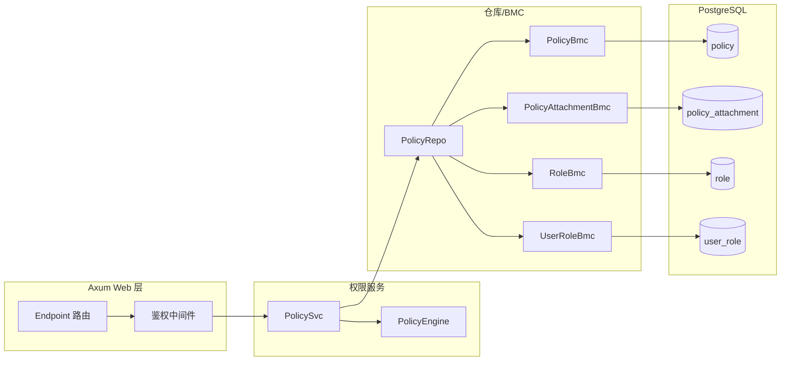
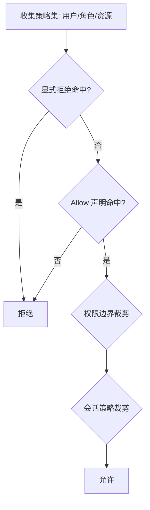

# IAM 策略与权限技术方案（jieyuan）

- 目标：在 `jieyuan` 项目内实现一套可扩展、可维护的 IAM 策略与权限系统，支持租户隔离、平台租户跨租户能力、显式拒绝优先、条件驱动的细粒度授权。
- 约束与约定：
  - 策略配置与结构字段统一使用 `snake_case` 命名；Rust enum 使用 `#[serde(rename_all = "snake_case")]`。
  - 策略评估遵循“显式 deny 优先 → allow 命中 → 边界/会话裁剪”。
  - 时间类型统一使用 `chrono::DateTime<chrono::FixedOffset>`。
  - 数据库访问统一使用 BMC 模式（`fusionsql` 宏），并复用当前项目已有模块与错误处理：`fusion-common`、`fusion-core`、`fusion-db`、`fusion-web`、`fusionsql`、`jieyuan-core`。
  - 错误统一复用：`fusion_core::DataError`、`fusionsql::SqlError`、`fusion_web::WebError`。
  - 并发访问：对外服务对象（如 `PolicySvc`）可便宜 `clone`；内部以 `Arc` 持有仓库与缓存（可结合 `ArcSwap`/`DashMap` 后续拓展）。
  - 统一依赖来自工作区 `Cargo.toml`，不引入未声明的第三方库。
  - 不设计审计功能；不考虑历史版本兼容与数据库迁移逻辑（系统尚未发布）。
  - 复用 fusion-xxx 库功能，如： fusion-common, fusion-core, fusion-web, fusion-db, fusionsql 等
  - 复用现有的错误处理模式
  - 遵循当前项目 Rust 编程最佳实践，对参数使用 snake_case 风格命名，对于 serde 序列化使用 `#[serde(rename_all = "snake_case")]` 注解
  - 注意 Arc 的使用以支持并发访问
  - 确保程序正确实现并编译成功

---

## 架构总览



- 路由通过鉴权中间件收集 `AuthContext`，交由 `PolicySvc` 进行授权判断。
- `PolicySvc` 聚合多源策略（用户策略、角色策略、资源策略、权限边界、会话策略），调用 `PolicyEngine` 做匹配与条件求值。
- 仓库层基于 BMC 模式访问数据库表，保持一致风格与高可维护性。

---

## 策略文档结构（snake_case）

- 采用 JSON 文档存储策略，版本化字段便于演进；示例：

```json
{
  "version": "2025-01-01",
  "id": "pol-allow-self-change-password",
  "statement": [
    {
      "sid": "self_change_password",
      "effect": "allow",
      "action": ["user:update_password"],
      "resource": ["jr:user:{tenant_id}:{user_id}"],
      "condition": {
        "string_equals": {
          "jr:principal_user_id": "{user_id}",
          "jr:tenant_id": "{tenant_id}"
        }
      }
    }
  ]
}
```

- 关键字段说明：
  - `effect`: `allow`/`deny`，显式拒绝优先。
  - `action`: 行为集合，支持通配（如 `user:*`）。
  - `resource`: 受保护资源集合，支持通配（如 `jr:user:{tenant_id}:*` 或 `jr:user:*:*`）。
  - `condition`: 条件键与上下文绑定进行求值，常用操作包含 `string_equals`、`string_like`、`numeric_equals`、`bool`、`date_less_than`。

---

## 资源与行为命名规范

- 资源标识：`jr:{service}:{tenant_id}:{type}/{id}`（约定简化为常用：`jr:user:{tenant_id}:{user_id}`、`jr:role:{tenant_id}:{role_id}`、`jr:policy:{tenant_id}:{policy_id}`）。
- 行为命名：`{service}:{verb}`，示例：
  - `user:create`、`user:read`、`user:update`、`user:delete`
  - `user:update_password`、`user:disable`、`user:enable`
  - `role:attach_policy`、`role:detach_policy`、`role:assign_to_user`
  - `policy:create`、`policy:update`、`policy:delete`、`policy:attach`、`policy:detach`

---

## 条件键与上下文

- 常用条件键（snake_case）：

  - `jr:tenant_id`、`jr:principal_user_id`、`jr:principal_roles`、`jr:is_platform_admin`
  - `jr:request_ip`、`jr:method`、`jr:path`
  - `jr:token_seq`、`jr:auth_level`
  - `jr:target_user_id`、`jr:target_tenant_id`

- 上下文结构（Rust，`Arc` 友好）：

```rust
// 文件：jieyuan/jieyuan/src/access_control/auth_ctx.rs
// 结构定义与投影函数已落地于代码库
use chrono::{DateTime, FixedOffset};
use serde::{Deserialize, Serialize};

/// 授权上下文
#[derive(Debug, Clone, Serialize, Deserialize)]
#[serde(rename_all = "snake_case")]
pub struct AuthContext {
  pub principal_user_id: i64,
  pub principal_tenant_id: i64,
  pub principal_roles: Vec<String>,
  pub is_platform_admin: bool,
  pub token_seq: i32,
  pub request_ip: String,
  pub now: DateTime<FixedOffset>,
  pub method: String,
  pub path: String,
}
```

---

## 授权评估流程



- 顺序：
  - 收集候选声明（动作与资源匹配，含通配）→ 条件求值（绑定 `AuthContext`）。
  - 任何 `deny` 命中即拒绝。
  - 若存在 `allow`，继续受权限边界与会话策略裁剪，未超界则允许；否则拒绝。

---

## 服务与仓库接口设计

- 策略文档类型定义（Rust）：

```rust
use serde::{Deserialize, Serialize};

/// 策略文档
#[derive(Debug, Clone, Serialize, Deserialize)]
#[serde(rename_all = "snake_case")]
pub struct PolicyDocument {
  pub version: String,
  pub id: Option<String>,
  pub statement: Vec<PolicyStatement>,
}

/// 声明
#[derive(Debug, Clone, Serialize, Deserialize)]
#[serde(rename_all = "snake_case")]
pub struct PolicyStatement {
  pub sid: Option<String>,
  pub effect: PolicyEffect,
  pub action: Vec<String>,
  pub resource: Vec<String>,
  pub condition: Option<serde_json::Value>,
}

#[derive(Debug, Clone, Serialize, Deserialize, PartialEq, Eq)]
#[serde(rename_all = "snake_case")]
pub enum PolicyEffect { Allow, Deny }
```

- 服务与仓库骨架（可编译）：

```rust
use std::sync::Arc;
use fusion_core::{Result, DataError};
use jieyuan_core::model::PolicyEntity;

/// 仓库接口（基于 BMC 实现）
/// 接口约束与一致性（开发前需同步）：
/// - 角色表达统一为“字符串编码”（如 `tenant_admin`、`platform_admin`），仓库接口使用 `&[String]`；
///   若需映射数值 ID，由仓库内部完成，服务层不传播数值类型。
/// - AppSetting 获取统一：在 Axum route 层通过 `State<Application>` 获取，再调用
///   `.fusion_setting().app().time_offset()`；业务层由调用方传入所需配置，不直接访问 `Application::global()`。
/// - 占位符来源统一：模板渲染的内置占位符仅来自 `AuthContext`；路由参数统一通过 `extras` 显式注入。
/// - 便捷构建方法统一：使用 `AuthContext::try_from_ctx(ctx, time_offset)` 或 `build_auth_context`；不再提供不含时区的 `TryFrom<&Ctx>`。
/// - 错误分层统一：仓库层返回 `fusion_core::DataError`（内部映射 `SqlError`）；端点/中间件仅使用 `fusion_web::WebError`。
#[derive(Clone)]
pub struct PolicyRepo {
  mm: ModelManager,
}
impl PolicyRepo {
  pub fn list_attached_policies_for_user(&self, tenant_id: i64, user_id: i64) -> Result<Vec<PolicyEntity>> {
    todo!("Implement list_attached_policies_for_user")
  }
  pub fn list_policies_for_roles(&self, tenant_id: i64, role_codes: &[String]) -> Result<Vec<PolicyEntity>> {
    todo!("Implement list_policies_for_roles")
  }
  pub fn list_resource_policies(&self, tenant_id: i64, resource: &str) -> Result<Vec<PolicyEntity>> {
    todo!("Implement list_resource_policies")
  }
  pub fn find_permission_boundary(&self, tenant_id: i64, user_id: i64) -> Result<Option<PolicyEntity>> {
    todo!("Implement find_permission_boundary")
  }
  pub fn find_session_policy(&self, token_id: &str) -> Result<Option<PolicyEntity>> {
    todo!("Implement find_session_policy")
  }
}

#[derive(Debug, Clone, Copy, PartialEq, Eq)]
pub enum Decision { Allow, Deny }

/// 权限服务（Arc 并发友好，使用 trait object）
#[derive(Clone)]
pub struct PolicySvc {
  pub(crate) repo: PolicyRepo,
}

impl PolicySvc {
  /// 函数级注释：创建权限服务（泛型入参，存储为 trait object）
  pub fn new(repo: PolicyRepo) -> Self {
    Self { repo }
  }

  /// 函数级注释：执行授权判断
  pub fn authorize(&self, ctx: &AuthContext, action: &str, resource: &str) -> Result<Decision> {
    // 1) 聚合策略集
    let mut policies = Vec::new();
    policies.extend(self.repo.list_attached_policies_for_user(ctx.principal_tenant_id, ctx.principal_user_id)?);
    policies.extend(self.repo.list_policies_for_roles(ctx.principal_tenant_id, &ctx.principal_roles)?);
    policies.extend(self.repo.list_resource_policies(ctx.principal_tenant_id, resource)?);

    let boundary = self.repo.find_permission_boundary(ctx.principal_tenant_id, ctx.principal_user_id)?;
    let session = self.repo.find_session_policy("current")?;

    // 2) 求值：显式拒绝优先
    if Self::match_any(&policies, ctx, action, resource, PolicyEffect::Deny) { return Ok(Decision::Deny); }

    let allowed = Self::match_any(&policies, ctx, action, resource, PolicyEffect::Allow);
    if !allowed { return Ok(Decision::Deny); }

    // 3) 边界与会话策略裁剪
    if let Some(pb) = boundary { if !Self::match_policy(&pb, ctx, action, resource, PolicyEffect::Allow) { return Ok(Decision::Deny); } }
    if let Some(sp) = session { if !Self::match_policy(&sp, ctx, action, resource, PolicyEffect::Allow) { return Ok(Decision::Deny); } }

    Ok(Decision::Allow)
  }

  /// 函数级注释：匹配任意策略是否命中指定 effect
  fn match_any(policies: &[PolicyEntity], ctx: &AuthContext, action: &str, resource: &str, effect: PolicyEffect) -> bool {
    policies.iter().any(|p| Self::match_policy(p, ctx, action, resource, effect))
  }

  /// 函数级注释：匹配单个策略文档（Action/Resource 通配与 Condition 求值）
  fn match_policy(_p: &PolicyEntity, _ctx: &AuthContext, _action: &str, _resource: &str, _effect: PolicyEffect) -> bool {
    // 解析 JSON，匹配 Action/Resource（支持通配），并求值 Condition
    // 条件键映射：如 jr:tenant_id -> ctx.principal_tenant_id 等
    // 具体实现留作后续迭代；当前返回 false 保证可编译
    false
  }
}
```

- BMC 层参考实现（延续宏风格）：

```rust
use fusionsql::{base::DbBmc, generate_pg_bmc_common, generate_pg_bmc_filter};
use jieyuan_core::model::{
  PolicyAttachmentEntity,
  PolicyAttachmentFilter,
  PolicyAttachmentForInsert,
  PolicyAttachmentForUpdate,
  TABLE_POLICY_ATTACHMENT,
};

/// 函数级注释：策略附着 BMC
pub struct PolicyAttachmentBmc;
impl DbBmc for PolicyAttachmentBmc { const TABLE: &'static str = TABLE_POLICY_ATTACHMENT; }

generate_pg_bmc_common!(
  Bmc: PolicyAttachmentBmc,
  Entity: PolicyAttachmentEntity,
  ForUpdate: PolicyAttachmentForUpdate,
  ForInsert: PolicyAttachmentForInsert,
);

generate_pg_bmc_filter!(
  Bmc: PolicyAttachmentBmc,
  Entity: PolicyAttachmentEntity,
  Filter: PolicyAttachmentFilter,
);
```

> 以上 BMC 类型需在 `jieyuan-core` 中提供对应 `Entity/Filter/ForCreate/ForUpdate/TABLE_*` 定义，保持与现有 `PolicyBmc` 风格一致。

---

## 中间件与路由集成（Axum + fusion-web）

- 在路由层引入鉴权中间件，统一执行授权：

```rust
use axum::{Router, routing::get};
use fusion_web::auth::{AsyncRequireAuthorizationLayer, WebAuth};
// PolicySvc 可便宜 clone，无需 Arc 包裹

/// 函数级注释：示例路由集成鉴权层（PolicySvc 可便宜 clone，无需 Arc 包裹）
pub fn routes(policy_svc: PolicySvc) -> Router {
  Router::new()
    .route("/users", get(|| async { "ok" }))
    .layer(AsyncRequireAuthorizationLayer::new(WebAuth::default()))
}
```

- 中间件从令牌解析 `user_id`、`tenant_id`、`token_seq`、`roles` 等，构造 `AuthContext` 并交由 `PolicySvc::authorize`；返回 `WebError` 作为拒绝响应。

### 从 Ctx 构建 AuthContext 的投影函数（已落地）

```rust
// 文件：jieyuan/jieyuan/src/access_control/auth_ctx.rs
use chrono::{DateTime, FixedOffset, Utc};
use fusion_core::{DataError, Result};
use fusion_common::ctx::Ctx;

/// 函数级注释：将 Ctx 投影为授权求值视图 AuthContext
pub fn build_auth_context(ctx: &Ctx, time_offset: FixedOffset) -> Result<AuthContext> {
  // 使用 AppSetting.time_offset 指定的时区
  let now = DateTime::<Utc>::from(*ctx.req_time()).with_timezone(&time_offset);

  let roles: Vec<String> = ctx
    .payload()
    .get_strings("principal_roles")
    .unwrap_or_default()
    .into_iter()
    .map(|s| s.to_string())
    .collect();

  Ok(AuthContext {
    principal_user_id: ctx.uid(),
    principal_tenant_id: ctx.tenant_id(),
    principal_roles: roles,
    is_platform_admin: ctx.payload().get_bool("is_platform_admin").unwrap_or(false),
    token_seq: ctx.payload().get_i32("token_seq").unwrap_or(0),
    request_ip: ctx.payload().get_str("request_ip").unwrap_or("").to_string(),
    now,
    method: ctx.payload().get_str("method").unwrap_or("").to_string(),
    path: ctx.payload().get_str("path").unwrap_or("").to_string(),
  })
}

/// 函数级注释：提供从 Ctx 与时区构建 AuthContext 的便捷方法
impl AuthContext {
  pub fn try_from_ctx(ctx: &Ctx, time_offset: FixedOffset) -> Result<Self> {
    build_auth_context(ctx, time_offset)
  }
}
```

### 端点路由示例：从 Ctx 构建 AuthContext 并调用授权

```rust
use axum::{extract::{State, Path}, Json};
use fusion_common::ctx::Ctx;
use fusion_web::WebError;
use fusion_core::application::Application;
use crate::access_control::{auth_ctx::build_auth_context, PolicySvc};

#[derive(serde::Serialize)]
struct OkResp { ok: bool }

/// 函数级注释：端点中从 Ctx 构建 AuthContext，并调用 PolicySvc::authorize
pub async fn update_user_endpoint(
  State(policy_svc): State<PolicySvc>,
  State(app): State<Application>,
  Path(user_id): Path<i64>,
  ctx: Ctx,
) -> Result<Json<OkResp>, WebError> {
  // 构建授权上下文（业务层返回 DataError；在端点层映射成 WebError）
  let ac = build_auth_context(&ctx, *app.fusion_setting().app().time_offset())
    .map_err(|e| WebError::bad_request(e.to_string()))?;

  // 示例动作与资源（此处演示自助更新用户资料的授权检查）
  let action = "user:update";
  // 将端点参数解析后作为 extras 占位符注入
  let mut extras = std::collections::HashMap::new();
  extras.insert("user_id", user_id.to_string());
  let resource = render_resource_ext("jr:user:{tenant_id}:{user_id}", &ac, &extras);

  // 调用授权（业务层返回 DataError；在端点层映射为 WebError::unauthorized）
  policy_svc
    .authorize(&ac, action, &resource)
    .map_err(|e| WebError::unauthorized(e.to_string()))?;

  Ok(Json(OkResp { ok: true }))
}
```

### 最小中间件示例：将 DataError 映射为 WebError

````rust
use axum::{http::Request, middleware::Next, response::Response};
use axum::extract::State;
use fusion_common::ctx::Ctx;
use fusion_web::WebError;
use fusion_core::application::Application;
use crate::access_control::{auth_ctx::build_auth_context, PolicySvc};

/// 函数级注释：最小授权中间件，将业务层 DataError 映射为 WebError
pub async fn authz_guard<B>(
  State(policy_svc): State<PolicySvc>,
  State(app): State<Application>,
  ctx: Ctx,
  mut req: Request<B>,
  next: Next<B>,
) -> Result<Response, WebError> {
  let ac = build_auth_context(&ctx, *app.fusion_setting().app().time_offset())
    .map_err(|e| WebError::bad_request(e.to_string()))?;
  let action = req.method().as_str().to_lowercase();
  let resource = req.uri().path().to_string();

  policy_svc
    .authorize(&ac, &action, &resource)
    .map_err(|e| WebError::unauthorized(e.to_string()))?;

  Ok(next.run(req).await)
}

### 动作与资源映射规范（推荐做法）

为避免将 HTTP 方法与路径直接作为授权语义，建议在路由层为每个端点绑定“动作”和“资源模板”，并在授权中间件读取该元数据：

```rust
use axum::{Router, routing::put, middleware, extract::State};
use axum::extract::FromRef;
use axum::http::Request;

#[derive(Clone)]
pub struct RouteMeta {
  pub action: &'static str,
  pub resource_tpl: &'static str, // 例如 "jr:user:{tenant_id}:{user_id}"
}

/// 函数级注释：注入路由元数据（动作与资源模板）到请求扩展
async fn inject_route_meta<B>(mut req: Request<B>, next: middleware::Next<B>) -> axum::response::Response {
  req.extensions_mut().insert(RouteMeta {
    action: "user:update_password",
    resource_tpl: "jr:user:{tenant_id}:{user_id}",
  });
  next.run(req).await
}

pub fn routes(policy_svc: PolicySvc) -> Router {
  Router::new()
    .route("/api/v1/users/:user_id/password", put(update_user_endpoint))
    .route_layer(middleware::from_fn(inject_route_meta))
}

/// 函数级注释：在中间件或端点中读取 RouteMeta，并填充资源模板
fn render_resource(tpl: &str, ac: &AuthContext) -> String {
  tpl
    .replace("{tenant_id}", &ac.principal_tenant_id.to_string())
    .replace("{user_id}", &ac.principal_user_id.to_string())
}

// 在中间件中：
// let meta = req.extensions().get::<RouteMeta>().ok_or_else(|| WebError::bad_request("missing route meta"))?;
// let resource = render_resource(meta.resource_tpl, &ac);
// policy_svc.authorize(&ac, meta.action, &resource)?;
````

规范约束：

- 资源模板占位符统一使用 `{snake_case}`，推荐内置：`{tenant_id}`、`{user_id}`、`{role_id}`、`{policy_id}`、`{resource_id}`。
- 动作统一为 `{service}:{verb}`，例如：`user:update_password`、`policy:attach`。
- 平台租户跨租户权限建议通过策略中条件键 `jr:is_platform_admin` 或资源通配 `jr:user:*:*` 明示。

#### AppSetting 获取方式（统一约定）

在 Axum route 层，通过 `State<Application>` 获取应用实例，再调用 `.fusion_setting().app()` 获得 `&AppSetting`：

```rust
use fusion_core::application::Application;

pub async fn example(State(app): State<Application>, ctx: Ctx) {
  let ac = build_auth_context(&ctx, *app.fusion_setting().app().time_offset()).unwrap();
}
```

业务服务层应由调用方传入所需配置（如 `FixedOffset`），不直接访问 `Application::global()`。

#### 路由元数据绑定的宏化示例

为减少样板代码，可提供宏封装路由注册与元数据注入：

```rust
// 文件：仅为文档示例（宏路径与工程组织可按需调整）
macro_rules! route_with_meta {
  ($router:expr, $method:path, $path:expr, $handler:path, $action:expr, $resource_tpl:expr) => {{
    use axum::{middleware, http::Request};
    use crate::access_control::RouteMeta;

    async fn inject_meta<B>(mut req: Request<B>, next: middleware::Next<B>) -> axum::response::Response {
      req.extensions_mut().insert(RouteMeta { action: $action, resource_tpl: $resource_tpl });
      next.run(req).await
    }

    $router
      .route($path, $method($handler))
      .route_layer(middleware::from_fn(inject_meta))
  }}
}

// 使用示例：
// let router = Router::new();
// let router = route_with_meta!(router, axum::routing::put, "/api/v1/users/:user_id/password", update_user_endpoint, "user:update_password", "jr:user:{tenant_id}:{user_id}");
```

该宏与 `web_auth` 的 `AsyncRequireAuthorizationLayer` 互补：

- `web_auth` 负责令牌提取与基础上下文注入（Ctx）。
- 上述宏为具体端点绑定动作与资源模板，便于授权中间件读取并评估。

#### 模板渲染的扩展占位符支持

为支持更丰富的资源表达，提供扩展模板渲染函数：

```rust
use std::collections::HashMap;

/// 函数级注释：扩展资源模板渲染，支持内置与自定义占位符
pub fn render_resource_ext(tpl: &str, ac: &AuthContext, extras: &HashMap<&str, String>) -> String {
  let mut s = tpl.to_string();
  // 内置占位符
  s = s
    .replace("{tenant_id}", &ac.principal_tenant_id.to_string())
    .replace("{user_id}", &ac.principal_user_id.to_string())
    .replace("{method}", &ac.method)
    .replace("{path}", &ac.path)
    .replace("{token_seq}", &ac.token_seq.to_string());

  // 角色（拼接为逗号分隔）
  if s.contains("{principal_roles}") {
    let joined = ac.principal_roles.join(",");
    s = s.replace("{principal_roles}", &joined);
  }

  // 其它自定义占位符（如 role_id/policy_id/resource_id 等）
  for (k, v) in extras.iter() {
    let ph = format!("{{{}}}", k);
    if s.contains(&ph) { s = s.replace(&ph, v); }
  }

  s
}
```

推荐约定：

- 若模板包含 `{role_id}`、`{policy_id}`、`{resource_id}` 等端点参数，请在端点或中间件解析 URL（如 `:user_id`）后放入 `extras`，再调用渲染函数。
- 内置占位符仅覆盖授权上下文中的字段；避免引入隐式数据源。

#### 路由注册器的模式建议（统一、少样板）

当端点数量较多时，建议集中定义“路由规格（RouteSpec）”并统一装配 Router。路由注册器负责：

- 绑定动作 `action` 与资源模板 `resource_tpl`
- 注入授权所需的元数据（`RouteMeta`）
- 挂载统一的中间件栈（`WebAuth`、授权中间件、日志/追踪等）

示例（文档示意，不作为生产代码直接拷贝）：

```rust
use axum::{Router, middleware, routing::{get, post, put, delete}};
use crate::access_control::RouteMeta;

#[derive(Clone)]
pub struct RouteSpec<H> {
  pub path: &'static str,
  pub method: &'static str, // "GET" | "POST" | "PUT" | "DELETE"
  pub action: &'static str,
  pub resource_tpl: &'static str,
  pub handler: H,
}

/// 函数级注释：将 RouteSpec 列表统一注册到 Router，并为每条路由注入 RouteMeta
pub fn build_router<H>(specs: Vec<RouteSpec<H>>) -> Router
where
  H: Clone + Copy + Send + Sync + 'static,
  // 为简化文档示例，假设所有 handler 符合 axum 的 handler 要求
{
  let mut router = Router::new();
  for spec in specs {
    // 每条路由的专属 meta 注入器
    async fn inject_meta<B>(mut req: axum::http::Request<B>, next: middleware::Next<B>, action: &'static str, tpl: &'static str) -> axum::response::Response {
      req.extensions_mut().insert(RouteMeta { action, resource_tpl: tpl });
      next.run(req).await
    }

    // 绑定 handler 与方法
    router = match spec.method {
      "GET" => router.route(spec.path, get(spec.handler)),
      "POST" => router.route(spec.path, post(spec.handler)),
      "PUT" => router.route(spec.path, put(spec.handler)),
      "DELETE" => router.route(spec.path, delete(spec.handler)),
      _ => router.route(spec.path, get(spec.handler)),
    };

    // 为该路由挂载元数据注入中间件
    let action = spec.action;
    let tpl = spec.resource_tpl;
    router = router.route_layer(middleware::from_fn(move |req, next| inject_meta(req, next, action, tpl)));
  }
  router
}
```

以上注册器将“动作/资源模板绑定”与“中间件注入”集中管理，能显著降低端点分散定义时的样板代码。

#### 占位符对照说明（字段与占位符映射）

- `{tenant_id}` ↔ `AuthContext.principal_tenant_id`
- `{user_id}` ↔ 路由参数 `:user_id`（推荐）或 `AuthContext.principal_user_id`（自助操作场景）
- `{method}` ↔ `AuthContext.method`
- `{path}` ↔ `AuthContext.path`
- `{token_seq}` ↔ `AuthContext.token_seq`
- `{principal_roles}` ↔ `AuthContext.principal_roles`（逗号拼接）
- `{role_id}` ↔ 路由参数 `:role_id`（通过 extras 注入）
- `{policy_id}` ↔ 路由参数 `:policy_id`（通过 extras 注入）
- `{resource_id}` ↔ 路由参数 `:resource_id`（通过 extras 注入）

##### 占位符对照表（简版）

| 占位符              | 字段/来源                                              | 示例值                        | 备注                       |
| ------------------- | ------------------------------------------------------ | ----------------------------- | -------------------------- |
| `{tenant_id}`       | `AuthContext.principal_tenant_id`                      | `42`                          | 必填，用于租户隔离         |
| `{user_id}`         | 路由参数 `:user_id` 或 `AuthContext.principal_user_id` | `1001`                        | 推荐使用路由参数           |
| `{method}`          | `AuthContext.method`                                   | `put`                         | 小写方法名，用于条件匹配   |
| `{path}`            | `AuthContext.path`                                     | `/api/v1/users/1001/password` | 当前请求路径               |
| `{token_seq}`       | `AuthContext.token_seq`                                | `3`                           | 令牌序列用于令牌失效检查   |
| `{principal_roles}` | `AuthContext.principal_roles.join(",")`                | `tenant_admin,ops`            | 角色编码拼接，用于条件匹配 |
| `{role_id}`         | 路由参数 `:role_id`（extras 注入）                     | `2002`                        | 端点参数占位符             |
| `{policy_id}`       | 路由参数 `:policy_id`（extras 注入）                   | `3003`                        | 端点参数占位符             |
| `{resource_id}`     | 路由参数 `:resource_id`（extras 注入）                 | `xyz-001`                     | 端点参数占位符             |

> 规范提示：模板渲染的内置占位符仅来自 `AuthContext`；路由参数统一通过 `extras` 显式注入，避免隐式数据源。

#### 角色编码规范建议

- 编码集合（建议初始集，可扩展）：
  - `tenant_admin`（租户管理员）、`platform_admin`（平台管理员）、`security_admin`（安全管理员）、`ops`（运维）、`auditor`（审计）
- 命名约束：
  - 统一使用小写 `snake_case`，字符集 `[a-z0-9_]`，以字母开头，长度 3–32。
  - 不允许空格与大写字母；避免使用保留前缀（如 `system_`、`reserved_`）。
  - 角色编码在同一租户内唯一；平台角色全局唯一。
- 大小写规则：
  - 角色编码区分大小写；规范要求全部小写，以保持一致性与可读性。
- 作用域约定：
  - 租户角色仅在所属租户内生效；平台角色具备跨租户能力（需策略显式授权）。
- 仓库层映射：
  - 服务层与授权上下文仅使用角色编码（字符串）；如需数值 ID，由仓库实现内部完成编码 ↔ID 映射，避免在服务层传播数值类型。

#### 端点参数解析放入 extras 的进一步示例

在同一路由中携带多个资源 ID 时，将它们解析后统一注入 `extras`：

```rust
use axum::extract::Path;
use std::collections::HashMap;

// 路由：/api/v1/roles/:role_id/policies/:policy_id/attach
pub async fn attach_policy_to_role(Path((role_id, policy_id)): Path<(i64, i64)>, ctx: Ctx) {
  let extras = HashMap::from([
    ("role_id", role_id.to_string()),
    ("policy_id", policy_id.to_string()),
  ]);
  let resource = render_resource_ext("jr:role:{tenant_id}:{role_id}", &ac, &extras);
  // ... 授权评估与业务处理
}
```

规范建议：

- 若端点与资源模板的占位符不一致，应在注册器或中间件中集中完成占位符解析与注入，避免在各个 handler 中分散实现。

````

---

## 配置约定（snake_case）

- 参考 `fusion-core` 配置注入方式，为 IAM 增加简单配置：

```toml
[jieyuan.iam]
# 策略求值缓存的 TTL（秒）
evaluation_cache_ttl_secs = 60
# 是否启用资源策略（默认 true）
enable_resource_policies = true
# 是否启用权限边界（默认 false）
enable_permission_boundary = false
````

- 对应 Rust 配置结构：

```rust
use serde::Deserialize;

/// 函数级注释：IAM 配置结构
#[derive(Debug, Clone, Deserialize)]
#[serde(rename_all = "snake_case")]
pub struct IamConfig {
  pub evaluation_cache_ttl_secs: u64,
  pub enable_resource_policies: bool,
  pub enable_permission_boundary: bool,
}
```

---

## 与用户令牌的关系（会话策略）

- 令牌需携带 `token_seq` 与 `tenant_id`；鉴权阶段比对库中 `token_seq`，不一致即拒绝（令牌已作废）。
- 可选的会话策略可进一步收敛权限（例如临时权限），但不授予权限。

---

## 并发与性能

- `PolicySvc` 实现 `Clone`，并在内部以 `PolicyRepo` 持有仓库，使用时可直接按值传递或 `clone()`，无需再用 `Arc<PolicySvc>` 包裹。
- 仓库查询遵循 BMC 模式与租户隔离；如需要强一致更新可在具体业务中使用 `SELECT ... FOR UPDATE`。

---

## 错误处理

- 统一错误类型（按层次使用）：

  - 业务服务层统一使用 `fusion_core::DataError`；
  - 数据库访问层统一使用/转换为 `fusionsql::SqlError`；
  - 仅在 Axum 端点函数及中间件中使用 `fusion_web::WebError` 作为响应错误类型。

- 示例：

```rust
use fusion_web::WebError;

/// 函数级注释：授权失败的统一映射
pub fn unauthorized_err(msg: &str) -> WebError {
  WebError::unauthorized(msg)
}
```
