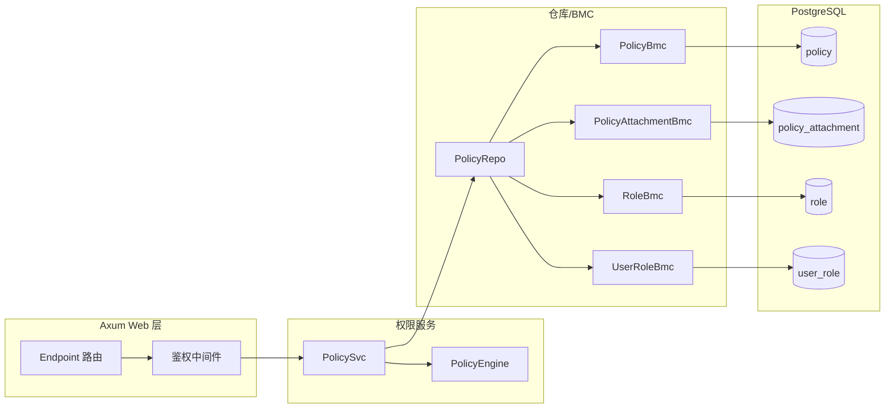

# IAM 策略与权限技术方案（jieyuan）

- 目标：在 `jieyuan` 项目内实现一套可扩展、可维护的 IAM 策略与权限系统，支持租户隔离、平台租户跨租户能力、显式拒绝优先、条件驱动的细粒度授权。
- 约束与约定：
  - 策略配置与结构字段统一使用 `snake_case` 命名；Rust enum 使用 `#[serde(rename_all = "snake_case")]`。
  - 策略评估遵循“显式 deny 优先 → allow 命中 → 边界/会话裁剪”。
  - 时间类型统一使用 `chrono::DateTime<chrono::FixedOffset>`。
  - 数据库访问统一使用 BMC 模式（`fusionsql` 宏），并复用当前项目已有模块与错误处理：`fusion-common`、`fusion-core`、`fusion-db`、`fusion-web`、`fusionsql`、`jieyuan-core`。
  - 错误统一复用：`fusion_core::DataError`、`fusionsql::SqlError`、`fusion_web::WebError`。
  - 并发访问：对外服务对象（如 `PolicySvc`）可便宜 `clone`；内部以 `Arc` 持有仓库与缓存（可结合 `ArcSwap`/`DashMap` 后续拓展）。
  - 统一依赖来自工作区 `Cargo.toml`，不引入未声明的第三方库。若需要的库不存在，则终止任务并显示需要的库列表和原因
  - 不设计审计功能；不考虑历史版本兼容与数据库迁移逻辑（系统尚未发布）。
  - 复用 fusion-xxx 库功能，如： fusion-common, fusion-core, fusion-web, fusion-db, fusionsql 等
  - 复用现有的错误处理模式
  - 遵循当前项目 Rust 编程最佳实践，对参数使用 snake_case 风格命名，对于 serde 序列化使用 `#[serde(rename_all = "snake_case")]` 注解
  - 注意 Arc 的使用以支持并发访问
  - 确保程序正确实现并编译成功

---

## 架构总览



- 路由通过鉴权中间件收集 `Ctx`，交由 `PolicySvc` 进行授权判断。
- `PolicySvc` 聚合多源策略（用户策略、角色策略、资源策略、权限边界、会话策略），调用 `PolicyEngine` 做匹配与条件求值。
- 仓库层基于 BMC 模式访问数据库表，保持一致风格与高可维护性。

---

## 策略文档结构（snake_case）

- 采用 JSON 文档存储策略，版本化字段便于演进；示例：

```json
{
  "version": "2025-01-01",
  "id": "pol-allow-self-change-password",
  "statement": [
    {
      "sid": "self_change_password",
      "effect": "allow",
      "action": ["user:update_password"],
      "resource": ["iam:user:{tenant_id}:{user_id}"],
      "condition": {
        "string_equals": {
          "iam:user_id": "{user_id}",
          "iam:tenant_id": "{tenant_id}"
        }
      }
    }
  ]
}
```

- 关键字段说明：
  - `effect`: `allow`/`deny`，显式拒绝优先。
  - `action`: 行为集合，支持通配（如 `user:*`）。
  - `resource`: 受保护资源集合，支持通配（如 `iam:user:{tenant_id}:*` 或 `iam:user:*:*`）。
  - `condition`: 条件键与上下文绑定进行求值，常用操作包含 `string_equals`、`string_like`、`numeric_equals`、`bool`、`date_less_than`。

---

## IAM Resource Mapping 管理机制

### 概述

IAM Resource Mapping 管理机制通过 jieyuan 管理后台配置 API 路径与权限资源的映射关系，客户端运行时只需提供路径信息，jieyuan 自动查找对应的权限配置，简化客户端集成，提高系统的灵活性和可维护性。

> **架构更新**: 已重构为 `iam_resource_mapping` 表和独立的管理模块，支持租户隔离和映射码查找。

### 资源与行为命名规范

- **资源标识格式**：`iam:{service}:{tenant_id}:{type}/{id}`

  - **策略配置**：完整格式，如 `iam:hetumind:42:workflow/123`
  - **API 调用**：简化格式，如 `iam:hetumind:workflow/123`（自动注入 tenant_id）
  - **约定简化**：`iam:user:{tenant_id}:{user_id}`、`iam:role:{tenant_id}:{role_id}`、`iam:policy:{tenant_id}:{policy_id}`

- **行为命名**：`{service}:{verb}`
  - **通用操作**：`create`、`read`、`update`、`delete`、`list`
  - **特定操作**：`execute`、`validate`、`activate`、`deactivate`、`duplicate`、`cancel`、`retry`、`share`、`manage`
  - **示例**：
    - `user:create`、`user:read`、`user:update`、`user:delete`
    - `hetumind:execute`、`hetumind:duplicate`、`hetumind:manage`
    - `role:attach_policy`、`role:detach_policy`、`role:assign_to_user`
    - `policy:create`、`policy:update`、`policy:delete`、`policy:attach`、`policy:detach`

### 混合架构设计

基于混合架构，采用统一的简化策略格式：

1. **策略简化** - 策略配置中的 resource 不包含 tenant_id，简化策略管理
2. **运行时注入** - 系统在运行时根据用户类型自动注入适当的租户上下文
3. **平台管理员支持** - 支持跨租户访问和多种租户访问模式（当前/全部/特定）
4. **零配置开发** - 开发者无需手动处理租户隔离，系统自动管理

**实现位置**：`jieyuan/jieyuan-core/src/model/iam_api.rs:111-158`

### IAM Resource Mapping 数据库设计

```sql
-- IAM 资源映射表
CREATE TABLE iam_resource_mapping (
    id BIGSERIAL PRIMARY KEY,
    service VARCHAR(50) NOT NULL,
    path_pattern VARCHAR(500) NOT NULL,
    method VARCHAR(10) NOT NULL,
    action VARCHAR(100) NOT NULL,
    resource_tpl VARCHAR(500) NOT NULL,
    mapping_params JSONB,
    mapping_code VARCHAR(100) UNIQUE,
    enabled BOOLEAN DEFAULT true,
    tenant_id BIGINT,
    created_at TIMESTAMP WITH TIME ZONE DEFAULT NOW(),
    updated_at TIMESTAMP WITH TIME ZONE DEFAULT NOW(),
    created_by BIGINT NOT NULL,
    updated_by BIGINT,
    description TEXT,
    UNIQUE(service, path_pattern, method)
);

-- 索引优化（支持租户隔离）
CREATE INDEX idx_iam_resource_lookup ON iam_resource_mapping(service, method, enabled, tenant_id);
CREATE INDEX idx_iam_resource_pattern ON iam_resource_mapping(service, path_pattern);
CREATE INDEX idx_iam_resource_mapping_code ON iam_resource_mapping(mapping_code);
CREATE INDEX idx_iam_resource_updated_at ON iam_resource_mapping(updated_at);
```

### 数据模型

**IAM 资源映射实体**：`jieyuan/jieyuan-core/src/model/iam_resource_mapping.rs`

```rust
/// IAM 资源映射实体
#[derive(Debug, Clone, Serialize, Deserialize)]
#[cfg_attr(feature = "with-openapi", derive(utoipa::ToSchema))]
#[serde(rename_all = "snake_case")]
pub struct IamResourceMappingEntity {
    pub id: i64,
    pub service: String,
    pub path_pattern: String,
    pub method: String,
    pub action: String,
    pub resource_tpl: String,
    pub mapping_params: Vec<MappingParam>,
    pub enabled: bool,
    pub tenant_id: Option<i64>,      // 支持租户隔离
    pub created_at: DateTime<Utc>,
    pub updated_at: DateTime<Utc>,
    pub created_by: i64,
    pub updated_by: Option<i64>,
    pub description: Option<String>,
    pub mapping_code: Option<String>, // 映射码支持
}
```

**基于路径的授权模型**：`jieyuan/jieyuan-core/src/model/path_authz.rs`

```rust
/// 基于路径的授权请求
#[derive(Debug, Clone, Serialize, Deserialize)]
#[cfg_attr(feature = "with-openapi", derive(utoipa::ToSchema))]
#[serde(rename_all = "snake_case")]
pub struct PathBasedAuthzRequest {
    pub service: String,
    pub path: String,
    pub method: String,
    pub request_ip: Option<String>,
}

/// 基于路径的授权响应
#[derive(Debug, Clone, Serialize, Deserialize)]
#[cfg_attr(feature = "with-openapi", derive(utoipa::ToSchema))]
#[serde(rename_all = "snake_case")]
pub struct PathBasedAuthzResponse {
    pub decision: String,
    pub ctx: Option<PathAuthzCtxPayload>,
    pub matched_mapping: Option<MatchedMapping>,
}
```

### 路径查找与缓存机制

```rust
/// 路径查找请求
#[derive(Debug, Clone, Serialize, Deserialize)]
#[cfg_attr(feature = "with-openapi", derive(utoipa::ToSchema))]
#[serde(rename_all = "snake_case")]
pub struct PathLookupRequest {
    pub service: String,
    pub path: String,
    pub method: String,
}

/// 路径查找响应
#[derive(Debug, Clone, Serialize, Deserialize)]
#[cfg_attr(feature = "with-openapi", derive(utoipa::ToSchema))]
#[serde(rename_all = "snake_case")]
pub struct PathLookupResponse {
    pub action: String,
    pub resource_tpl: String,
    pub path_params: HashMap<String, String>,
    pub cache_ttl: Option<u64>,
}
```

### API 端点

**管理端点**：`jieyuan/jieyuan/src/endpoint/api/v1/path_mappings.rs`

- CRUD 操作：`POST /`, `GET /:id`, `PUT /:id`, `DELETE /:id`
- 批量操作：`POST /batch`
- 查询：`POST /query`

**基于路径的授权端点**：`jieyuan/jieyuan/src/endpoint/api/v1/iams.rs`

- 授权检查：`POST /authorize`

### 客户端集成简化

使用 Resource-Path 机制后，客户端集成变得非常简单：

1. **简化路由定义**：无需手动注入 RouteMeta
2. **自动权限查找**：只需提供 service、path、method
3. **统一的响应格式**：包含决策结果和上下文信息

**示例请求**：

```json
{
  "service": "hetumind",
  "path": "/api/v1/workflows/123e4567-e89b-12d3-a456-426614174000",
  "method": "GET",
  "request_ip": "203.0.113.3"
}
```

**示例响应**：

```json
{
  "decision": "allow",
  "ctx": {
    "tenant_id": 42,
    "sub": 1001,
    "roles": ["tenant_admin", "ops"],
    "is_platform_admin": false,
    "token_seq": 3,
    "method": "get",
    "path": "/api/v1/workflows/123e4567-e89b-12d3-a456-426614174000",
    "request_ip": "203.0.113.3",
    "req_time": "2025-01-01T08:00:01+08:00"
  },
  "matched_mapping": {
    "action": "hetumind:read",
    "resource_tpl": "iam:hetumind:workflow/{id}",
    "extracted_params": {
      "id": "123e4567-e89b-12d3-a456-426614174000"
    }
  }
}
```

---

## 条件键与上下文

### 支持的条件键（混合架构）

- **用户身份条件键**：

  - `iam:user_id`: 用户 ID
  - `iam:roles`: 用户角色列表
  - `iam:is_platform_admin`: 是否平台管理员
  - `iam:tenant_access_mode`: 租户访问模式（current/all/specific）
  - `iam:managed_tenant_ids`: 管理的租户 ID 列表

- **请求信息条件键**：

  - `iam:request_ip`: 客户端 IP 地址
  - `iam:method`: HTTP 方法
  - `iam:path`: 请求路径
  - `iam:token_seq`: 令牌序列号

- **时间相关条件键**：
  - `iam:current_time`: 当前时间（RFC3339 格式）

### 上下文数据来源

条件键的数据来源于 `fusion_common::ctx::Ctx` 通过 `CtxExt` trait 提供：

```rust
// 当前实现：直接使用 Ctx 和 CtxExt
use fusion_common::ctx::Ctx;
use crate::model::CtxExt;

// 在策略评估中直接使用
fn evaluate_condition(key: &str, ctx: &Ctx) -> serde_json::Value {
    match key {
        "iam:tenant_id" => serde_json::Value::Number(ctx.tenant_id().into()),
        "iam:user_id" => serde_json::Value::Number(ctx.user_id().into()),
        "iam:roles" => serde_json::Value::Array(
            ctx.roles().iter().map(|r| serde_json::Value::String(r.to_string())).collect()
        ),
        "iam:is_platform_admin" => serde_json::Value::Bool(ctx.is_platform_admin()),
        "iam:tenant_access_mode" => serde_json::Value::String(match ctx.tenant_access_mode() {
            crate::model::policy::TenantAccessMode::Current => "current".to_string(),
            crate::model::policy::TenantAccessMode::All => "all".to_string(),
            crate::model::policy::TenantAccessMode::Specific => "specific".to_string(),
        }),
        "iam:managed_tenant_ids" => serde_json::Value::Array(
            ctx.managed_tenant_ids().iter().map(|id| serde_json::Value::String(id.clone())).collect()
        ),
        "iam:method" => serde_json::Value::String(ctx.request_method().to_string()),
        "iam:path" => serde_json::Value::String(ctx.request_path().to_string()),
        "iam:token_seq" => serde_json::Value::Number(ctx.token_seq().into()),
        "iam:current_time" => serde_json::Value::String(ctx.req_datetime().to_rfc3339()),
        _ => serde_json::Value::Null,
    }
}
```

// 文件：jieyuan/jieyuan/src/access_control/auth_ctx.rs
// 结构定义与投影函数已落地于代码库
use chrono::{DateTime, FixedOffset};
use serde::{Deserialize, Serialize};

/// 授权上下文（从 Ctx 构建） #[derive(Debug, Clone, Serialize, Deserialize)] #[serde(rename_all = "snake_case")]
pub tenant_id: i64,
pub user_id: i64,
pub roles: Vec<String>,
pub is_platform_admin: bool,
pub token_seq: i32,
pub method: String,
pub path: String,
pub request_ip: Option<String>,
pub req_time: DateTime<FixedOffset>,
}

    /// 从 Ctx 构建授权上下文
        Ok(Self {
            tenant_id: ctx.tenant_id(),
            user_id: ctx.user_id(),
            roles: ctx.payload()
                .get_strings("roles")
                .unwrap_or_default()
                .into_iter()
                .map(|s| s.to_string())
                .collect(),
            is_platform_admin: ctx.payload().get_bool("is_platform_admin").unwrap_or(false),
            token_seq: ctx.payload().get_i32("token_seq").unwrap_or(0),
            method: ctx.payload().get_str("method").unwrap_or("").to_string(),
            path: ctx.payload().get_str("path").unwrap_or("").to_string(),
            request_ip: ctx.payload().get_str("request_ip").map(|s| s.to_string()),
            req_time: ctx.now_fixed(time_offset),
        })
    }

}

````

---

## 授权评估流程

```mermaid
flowchart TD
  A[收集策略集: 用户/角色/资源] --> B{显式拒绝命中?}
  B -- 是 --> Z[拒绝]
  B -- 否 --> C{Allow 声明命中?}
  C -- 否 --> Z
  C -- 是 --> D{权限边界裁剪}
  D --> E{会话策略裁剪}
  E --> F[允许]
````

- 顺序：
  - 收集候选声明（动作与资源匹配，含通配）→ 条件求值（绑定 `Ctx`）。
  - 任何 `deny` 命中即拒绝。
  - 若存在 `allow`，继续受权限边界与会话策略裁剪，未超界则允许；否则拒绝。

---

## 服务与仓库接口设计

### 访问控制模块架构

**模块位置**：`jieyuan/jieyuan/src/access_control/`

```
access_control/
├── mod.rs              # 模块导出
├── auth_svc.rs         # 认证服务
├── policy_svc.rs       # 策略服务
├── resource_svc.rs     # IAM Resource Mapping 服务
└── resource_cache.rs   # 资源映射缓存
```

### 策略服务实现

**实现位置**：`jieyuan/jieyuan/src/access_control/policy_svc.rs`

```rust
use std::sync::Arc;
use fusion_core::{Result, DataError};
use jieyuan_core::model::{PolicyEntity, ctx_ext::CtxExt};

/// 策略服务（Arc 并发友好）
#[derive(Clone)]
pub struct PolicySvc {
  pub(crate) repo: PolicyRepo,
  pub(crate) resource_svc: ResourceSvc,
}

impl PolicySvc {
  /// 创建策略服务
  pub fn new(repo: PolicyRepo, resource_svc: ResourceSvc) -> Self {
    Self { repo, resource_svc }
  }

  /// 执行基础授权判断
  pub async fn authorize(&self, ctx: &Ctx, action: &str, resource: &str) -> Result<Decision> {
    // 1) 聚合策略集
    let mut policies = Vec::new();
    policies.extend(self.repo.list_attached_policies_for_user(ctx.tenant_id(), ctx.user_id())?);

    let roles: Vec<String> = ctx
      .payload()
      .get_strings("roles")
      .unwrap_or_default()
      .into_iter()
      .map(|s| s.to_string())
      .collect();

    policies.extend(self.repo.list_policies_for_roles(ctx.tenant_id(), &roles)?);
    policies.extend(self.repo.list_resource_policies(ctx.tenant_id(), resource)?);

    let boundary = self.repo.find_permission_boundary(ctx.tenant_id(), ctx.user_id())?;
    let session = self.repo.find_session_policy("current")?;

    // 2) 求值：显式拒绝优先
    if Self::match_any(&policies, ctx, action, resource, DecisionEffect::Deny) {
      return Ok(Decision::Deny);
    }

    let allowed = Self::match_any(&policies, ctx, action, resource, DecisionEffect::Allow);
    if !allowed {
      return Ok(Decision::Deny);
    }

    // 3) 边界与会话策略裁剪
    if let Some(pb) = boundary {
      if !Self::match_policy(&pb, ctx, action, resource, DecisionEffect::Allow) {
        return Ok(Decision::Deny);
      }
    }
    if let Some(sp) = session {
      if !Self::match_policy(&sp, ctx, action, resource, DecisionEffect::Allow) {
        return Ok(Decision::Deny);
      }
    }

    Ok(Decision::Allow)
  }

  /// 扩展授权方法（支持路径映射）
  pub async fn authorize_ext(&self, ctx: &Ctx, action: &str, resource: &str) -> Result<Decision> {
    // 尝试使用路径映射优化
    if let Some(extracted) = self.resource_svc.extract_from_resource(resource) {
      let service = extracted.get("service").unwrap_or("");
      let path = extracted.get("path").unwrap_or("");
      let method = ctx.payload().get_str("method").unwrap_or("");

      // 使用路径映射进行授权
      return self.authorize_by_path(ctx, service, path, method).await;
    }

    // 回退到传统授权
    self.authorize(ctx, action, resource).await
  }

  /// 基于路径的授权
  pub async fn authorize_by_path(&self, ctx: &Ctx, service: &str, path: &str, method: &str) -> Result<Decision> {
    if let Some(mapping) = self.resource_svc.find_mapping(service, path, method, ctx.tenant_id()).await? {
      let resource = render_resource(&mapping.resource_tpl, ctx, None);
      return self.authorize(ctx, &mapping.action, &resource).await;
    }

    // 未找到映射，拒绝访问
    Ok(Decision::Deny)
  }
}
```

### IAM Resource Mapping 服务

**实现位置**：`jieyuan/jieyuan/src/access_control/resource_svc.rs`

```rust
use std::sync::Arc;
use fusion_core::Result;
use jieyuan_core::model::{iam_resource_mapping::*, path_lookup::*};

/// IAM Resource Mapping 服务
#[derive(Clone)]
pub struct ResourceSvc {
  bmc: IamResourceMappingBmc,
  cache: Arc<ResourceMappingCache>,
}

impl ResourceSvc {
  /// 创建资源映射服务
  pub fn new(bmc: IamResourceMappingBmc) -> Self {
    let cache = Arc::new(ResourceMappingCache::new());
    Self { bmc, cache }
  }

  /// 查找路径映射（带缓存）
  pub async fn find_mapping(&self, service: &str, path: &str, method: &str, tenant_id: i64) -> Result<Option<IamResourceMappingEntity>> {
    // 1) 检查缓存
    let cache_key = format!("{}:{}:{}", service, path, method);
    if let Some(cached) = self.cache.get(&cache_key).await {
      if cached.matches_tenant(tenant_id) {
        return Ok(Some(cached.into_entity()));
      }
    }

    // 2) 数据库查找
    let mapping = self.bmc.find_by_path_pattern(service, path, method, tenant_id)?;

    // 3) 更新缓存
    if let Some(ref m) = mapping {
      self.cache.set(&cache_key, m.clone()).await;
    }

    Ok(mapping)
  }

  /// 提取资源信息
  pub fn extract_from_resource(&self, resource: &str) -> Option<HashMap<String, String>> {
    let parts: Vec<&str> = resource.split(':').collect();
    if parts.len() >= 4 {
      let mut extracted = HashMap::new();
      extracted.insert("service".to_string(), parts[1].to_string());
      extracted.insert("type".to_string(), parts[parts.len()-2].to_string());
      extracted.insert("id".to_string(), parts[parts.len()-1].to_string());
      Some(extracted)
    } else {
      None
    }
  }
}
```

### 策略文档类型定义

```rust
use serde::{Deserialize, Serialize};

/// 策略文档
#[derive(Debug, Clone, Serialize, Deserialize)]
#[serde(rename_all = "snake_case")]
pub struct PolicyDocument {
  pub version: String,
  pub id: Option<String>,
  pub statement: Vec<PolicyStatement>,
}

/// 声明
#[derive(Debug, Clone, Serialize, Deserialize)]
#[serde(rename_all = "snake_case")]
pub struct PolicyStatement {
  pub sid: Option<String>,
  pub effect: DecisionEffect,
  pub action: Vec<String>,
  pub resource: Vec<String>,
  pub condition: Option<serde_json::Value>,
}

#[derive(Debug, Clone, Serialize, Deserialize, PartialEq, Eq)]
#[serde(rename_all = "snake_case")]
pub enum DecisionEffect { Allow, Deny }
```

- 服务与仓库骨架（可编译）：

```rust
use std::sync::Arc;
use fusion_core::{Result, DataError};
use jieyuan_core::model::PolicyEntity;

/// 仓库接口（基于 BMC 实现）
/// 接口约束与一致性（开发前需同步）：
/// - 角色表达统一为“字符串编码”（如 `tenant_admin`、`platform_admin`），仓库接口使用 `&[String]`；
///   若需映射数值 ID，由仓库内部完成，服务层不传播数值类型。
/// - AppSetting 获取统一：在 Axum route 层通过 `State<Application>` 获取，再调用
///   `.fusion_setting().app().time_offset()`；业务层由调用方传入所需配置，不直接访问 `Application::global()`。
/// - 占位符来源统一：模板渲染的内置占位符仅来自 `Ctx`；路由参数统一通过 `extras` 显式注入。
/// - 便捷构建方法统一：直接使用 `fusion_common::ctx::Ctx`，无需额外转换。
/// - 错误分层统一：仓库层返回 `fusion_core::DataError`（内部映射 `SqlError`）；端点/中间件仅使用 `fusion_web::WebError`。
#[derive(Clone)]
pub struct PolicyRepo {
  mm: ModelManager,
}
impl PolicyRepo {
  pub fn list_attached_policies_for_user(&self, tenant_id: i64, user_id: i64) -> Result<Vec<PolicyEntity>> {
    todo!("Implement list_attached_policies_for_user")
  }
  pub fn list_policies_for_roles(&self, tenant_id: i64, role_codes: &[String]) -> Result<Vec<PolicyEntity>> {
    todo!("Implement list_policies_for_roles")
  }
  pub fn list_resource_policies(&self, tenant_id: i64, resource: &str) -> Result<Vec<PolicyEntity>> {
    todo!("Implement list_resource_policies")
  }
  pub fn find_permission_boundary(&self, tenant_id: i64, user_id: i64) -> Result<Option<PolicyEntity>> {
    todo!("Implement find_permission_boundary")
  }
  pub fn find_session_policy(&self, token_id: &str) -> Result<Option<PolicyEntity>> {
    todo!("Implement find_session_policy")
  }
}

/// 决策类型（内部服务层使用，与远程 API DecisionEffect 映射）
/// Decision::Allow ↔ DecisionEffect::allow, Decision::Deny ↔ DecisionEffect::deny
#[derive(Debug, Clone, Copy, PartialEq, Eq)]
pub enum Decision { Allow, Deny }

/// 权限服务（Arc 并发友好，使用 trait object）
#[derive(Clone)]
pub struct PolicySvc {
  pub(crate) repo: PolicyRepo,
}

impl PolicySvc {
  /// 函数级注释：创建权限服务（泛型入参，存储为 trait object）
  pub fn new(repo: PolicyRepo) -> Self {
    Self { repo }
  }

  /// 函数级注释：执行授权判断
  /// 返回 Decision 类型，远程 API 使用 PolicyEffect（snake_case）
  pub fn authorize(&self, ctx: &Ctx, action: &str, resource: &str) -> Result<Decision> {
    // 1) 聚合策略集
    let mut policies = Vec::new();
    policies.extend(self.repo.list_attached_policies_for_user(ctx.tenant_id(), ctx.user_id())?);

    let roles: Vec<String> = ctx
      .payload()
      .get_strings("roles")
      .unwrap_or_default()
      .into_iter()
      .map(|s| s.to_string())
      .collect();

    policies.extend(self.repo.list_policies_for_roles(ctx.tenant_id(), &roles)?);
    policies.extend(self.repo.list_resource_policies(ctx.tenant_id(), resource)?);

    let boundary = self.repo.find_permission_boundary(ctx.tenant_id(), ctx.user_id())?;
    let session = self.repo.find_session_policy("current")?;

    // 2) 求值：显式拒绝优先
    if Self::match_any(&policies, ctx, action, resource, DecisionEffect::Deny) { return Ok(Decision::Deny); }

    let allowed = Self::match_any(&policies, ctx, action, resource, DecisionEffect::Allow);
    if !allowed { return Ok(Decision::Deny); }

    // 3) 边界与会话策略裁剪
    if let Some(pb) = boundary { if !Self::match_policy(&pb, ctx, action, resource, DecisionEffect::Allow) { return Ok(Decision::Deny); } }
    if let Some(sp) = session { if !Self::match_policy(&sp, ctx, action, resource, DecisionEffect::Allow) { return Ok(Decision::Deny); } }

    Ok(Decision::Allow)
  }

  /// 函数级注释：匹配任意策略是否命中指定 effect
  fn match_any(policies: &[PolicyEntity], ctx: &Ctx, action: &str, resource: &str, effect: DecisionEffect) -> bool {
    policies.iter().any(|p| Self::match_policy(p, ctx, action, resource, effect))
  }

  /// 函数级注释：匹配单个策略文档（Action/Resource 通配与 Condition 求值）
  fn match_policy(_p: &PolicyEntity, _ctx: &Ctx, _action: &str, _resource: &str, _effect: DecisionEffect) -> bool {
    // 解析 JSON，匹配 Action/Resource（支持通配），并求值 Condition
    // 条件键映射：如 iam:tenant_id -> ctx.principal_tenant_id 等
    // 具体实现留作后续迭代；当前返回 false 保证可编译
    false
  }
}
```

- BMC 层参考实现（延续宏风格）：

```rust
use fusionsql::{base::DbBmc, generate_pg_bmc_common, generate_pg_bmc_filter};
use jieyuan_core::model::{
  PolicyAttachmentEntity,
  PolicyAttachmentFilter,
  PolicyAttachmentForInsert,
  PolicyAttachmentForUpdate,
  TABLE_POLICY_ATTACHMENT,
};

/// 函数级注释：策略附着 BMC
pub struct PolicyAttachmentBmc;
impl DbBmc for PolicyAttachmentBmc { const TABLE: &'static str = TABLE_POLICY_ATTACHMENT; }

generate_pg_bmc_common!(
  Bmc: PolicyAttachmentBmc,
  Entity: PolicyAttachmentEntity,
  ForUpdate: PolicyAttachmentForUpdate,
  ForInsert: PolicyAttachmentForInsert,
);

generate_pg_bmc_filter!(
  Bmc: PolicyAttachmentBmc,
  Entity: PolicyAttachmentEntity,
  Filter: PolicyAttachmentFilter,
);
```

> 以上 BMC 类型需在 `jieyuan-core` 中提供对应 `Entity/Filter/ForCreate/ForUpdate/TABLE_*` 定义，保持与现有 `PolicyBmc` 风格一致。

---

## 中间件与路由集成（Axum + fusion-web）

- 在路由层引入鉴权中间件，统一执行授权：

```rust
use axum::{Router, routing::get};
use fusion_web::auth::{AsyncRequireAuthorizationLayer, WebAuth};
// PolicySvc 可便宜 clone，无需 Arc 包裹

/// 函数级注释：示例路由集成鉴权层（PolicySvc 可便宜 clone，无需 Arc 包裹）
pub fn routes(policy_svc: PolicySvc) -> Router {
  Router::new()
    .route("/users", get(|| async { "ok" }))
    .layer(AsyncRequireAuthorizationLayer::new(WebAuth::default()))
}
```

- 中间件从令牌解析 `user_id`、`tenant_id`、`token_seq`、`roles` 等，使用 `Ctx` 并交由 `PolicySvc::authorize`；返回 `WebError` 作为拒绝响应。

### 最小中间件示例：将 DataError 映射为 WebError

````rust
use axum::{http::Request, middleware::Next, response::Response};
use axum::extract::State;
use fusion_common::ctx::Ctx;
use fusion_web::WebError;
use fusion_core::application::Application;
use fusion_core::model::{auth_ctx::build_auth_context, PolicySvc};

// `jieyuan/jieyuan-core/src/web/middleware/authorization_middleware.rs`
/// 函数级注释：最小授权中间件，将业务层 DataError 映射为 WebError
pub async fn authz_guard<B>(
  State(policy_svc): State<PolicySvc>,
  State(app): State<Application>,
  ctx: Ctx,
  mut req: Request<B>,
  next: Next<B>,
) -> Result<Response, WebError> {
  let ac = build_auth_context(&ctx, *app.fusion_setting().app().time_offset())
    .map_err(|e| WebError::bad_request(e.to_string()))?;
  let action = req.method().as_str().to_lowercase();
  let resource = req.uri().path().to_string();

  policy_svc
    .authorize(&ac, &action, &resource)
    .map_err(|e| WebError::unauthorized(e.to_string()))?;

  Ok(next.run(req).await)
}

---

## 远程授权 API 合约

为满足“jieyuan 作为独立 IAM 微服务，其他项目仅通过远程调用使用”的约束，定义统一的远程授权接口。客户端（hetumind-studio、hetuflow-server）通过该接口完成令牌校验与权限评估，并复用既有数据结构：返回中的 `decision` 使用 `DecisionEffect`（值为 `allow`/`deny`），失败错误信息复用 `fusion_web::WebError`。

### Endpoint

- Method: `POST`
- Path: `/api/v1/iam/authorize`

### Request Headers

- `Authorization: Bearer <token>`（必填）
- `Content-Type: application/json`

### Request Body（snake_case）

```json
{
  "action": "user:update_password",
  "resource_tpl": "iam:user:{tenant_id}:{user_id}",
  "extras": { "user_id": "12345" },
  "method": "put",
  "path": "/api/v1/users/12345/password",
  "request_ip": "203.0.113.3"
}
````

- 字段约束与来源说明：
  - `action`（必填，string）：行为名，格式 `{service}:{verb}`，如 `user:update_password`。
  - `resource_tpl`（必填，string）：资源模板，支持内置占位符（`{tenant_id}`、`{roles}` 等）与路由参数占位符（通过 `extras` 显式注入）。
  - `extras`（可选，object<string,string>）：路由参数或业务参数的显式占位符值，如 `{ "user_id": "12345" }`。
  - `method`（可选，string）：HTTP 方法小写（如 `get`、`post`、`put`、`delete`），可参与策略条件匹配。
  - `path`（可选，string）：当前请求路径（如 `/api/v1/users/12345/password`），可参与策略条件匹配。
  - `request_ip`（可选，string）：客户端 IP（字符串表示），可参与策略条件匹配。

### Response（状态码语义与数据结构）

- 200 OK（权限允许）：

  - 语义：令牌有效，权限评估通过。
  - 结构：包含 `decision` 与 `ctx`，其中 `decision` 复用 `DecisionEffect`（序列化为 `allow`）。
  - 示例：
    ```json
    {
      "decision": "allow",
      "ctx": {
        "tenant_id": 42,
        "sub": 1001,
        "roles": ["tenant_admin", "ops"],
        "is_platform_admin": false,
        "token_seq": 3,
        "method": "put",
        "path": "/api/v1/users/12345/password",
        "request_ip": "203.0.113.3",
        "req_time": "2025-01-01T08:00:01+08:00"
      }
    }
    ```

- 403 Forbidden（权限拒绝）：

  - 语义：令牌有效，但策略评估拒绝。
  - 结构：错误信息复用 `fusion_web::WebError`，并在 `err_detail` 中携带 `decision=deny` 与 `ctx`（便于客户端日志与提示）。
  - 示例：
    ```json
    {
      "err_code": 403,
      "err_msg": "policy deny: {} not allowed on {}",
      "detail": {
        "decision": "deny",
        "ctx": {
          "tenant_id": 42,
          "sub": 1001,
          "roles": ["viewer"],
          "is_platform_admin": false,
          "token_seq": 3,
          "method": "put",
          "path": "/api/v1/users/12345/password",
          "request_ip": "203.0.113.3",
          "req_time": "2025-01-01T08:00:01+08:00"
        }
      }
    }
    ```

- 401 Unauthorized（令牌无效或过期）：

  - 语义：令牌校验失败（签名无效、过期、缺失）。
  - 结构：错误信息复用 `fusion_web::WebError`；不返回 `ctx`（不可用）。
  - 示例：
    ```json
    {
      "err_code": 401,
      "err_msg": "invalid token signature",
      "err_detail": null
    }
    ```

- 字段与类型约束：
  - `decision`：复用 `DecisionEffect`（`allow`/`deny`，`#[serde(rename_all = "snake_case")]`），仅在 200 返回；403 的 `decision` 存于 `err_detail`。
  - `ctx`：为 Ctx 的 JSON 视图（CtxPayload），字段示例：`tenant_id`（i64）、`sub`（i64）、`roles`（Vec<String>，角色编码）、`is_platform_admin`（bool）、`token_seq`（i32）、`method`（string）、`path`（string）、`request_ip`（string）、`req_time`（RFC3339 + 固定时区）。
  - `WebError`：`{ err_code: i32, err_msg: String, err_detail?: Value }`；在 401/403 返回。

### 客户端集成流程清单

#### hetumind-studio（IAM Resource Mapping 集成）

**推荐方案：基于路径映射的零配置集成**

1. **简化路由定义**：无需手动配置 `RouteMeta`，直接使用路径映射中间件

   ```rust
   // 无需 RouteMeta，使用路径映射中间件
   .route("/workflows/*", workflows_routes())
       .layer(path_authz_middleware())
   ```

2. **路径映射中间件**：自动提取路径信息并调用 jieyuan 授权

   ```rust
   pub async fn path_authz_middleware() -> impl Middleware<Bound> {
       // 1) 提取 service, path, method
       // 2) 调用 POST /api/v1/iam/authorize-by-path
       // 3) 处理响应并注入上下文
   }
   ```

3. **jieyuan 管理后台配置**：
   - 配置路径模式：`/api/v1/workflows/{id}` → `hetumind:read` / `iam:hetumind:workflow/{id}`
   - 支持通配符和正则表达式
   - 租户隔离配置

**优势**：

- 零代码配置：仅需在 jieyuan 管理后台配置路径映射
- 自动参数提取：路径参数自动解析并注入到资源模板
- 统一管理：所有权限配置集中在 jieyuan，便于维护

#### hetuflow-server（本地令牌校验或远程授权二选一）

- 若采用远程授权（统一方案）：流程与 hetumind-studio 相同。
- 若保留本地令牌校验：
  - 仍在受控路由调用远程授权 API 进行策略评估；
  - 将 200 返回的 `ctx` 覆盖或合并到本地 Ctx 用于后续业务。

#### 端到端约束与建议

- 角色统一使用“字符串编码”（如 `tenant_admin`），客户端不传数值 ID；策略条件中按编码匹配。
- 资源模板统一 snake_case，占位符来源显式：内置来自 Ctx，路由参数来自 `extras`。
- 当模板包含 `{namespace_id}` 或 `{project_id}` 等数据维度，占位符渲染需使用严格模式 `render_resource_enhanced`（缺失必须参数直接拒绝），并限制评估/继承在同租户内。
- 错误分层统一：客户端端点仅用 `WebError` 响应；业务服务内用 `DataError`；数据库访问层用 `SqlError` 并在仓库层转换。
- 时区与时间：服务端返回 `req_time` 为固定偏移（`FixedOffset`）；客户端按 `AppSetting.time_offset` 对齐使用。

````

---

## 配置约定（snake_case）

- 参考 `fusion-core` 配置注入方式，为 IAM 增加简单配置：

```toml
[jieyuan.iam]
# 策略求值缓存的 TTL（秒）
evaluation_cache_ttl_secs = 60
# 是否启用资源策略（默认 true）
enable_resource_policies = true
# 是否启用权限边界（默认 false）
enable_permission_boundary = false
````

- 对应 Rust 配置结构：

```rust
use serde::Deserialize;

/// 函数级注释：IAM 配置结构
#[derive(Debug, Clone, Deserialize)]
#[serde(rename_all = "snake_case")]
pub struct IamConfig {
  pub evaluation_cache_ttl_secs: u64,
  pub enable_resource_policies: bool,
  pub enable_permission_boundary: bool,
}
```

---

## 与用户令牌的关系（会话策略）

- 令牌需携带 `token_seq` 与 `tenant_id`；鉴权阶段比对库中 `token_seq`，不一致即拒绝（令牌已作废）。
- 可选的会话策略可进一步收敛权限（例如临时权限），但不授予权限。

---

## 并发与性能

- `PolicySvc` 实现 `Clone`，并在内部以 `PolicyRepo` 持有仓库，使用时可直接按值传递或 `clone()`，无需再用 `Arc<PolicySvc>` 包裹。
- 仓库查询遵循 BMC 模式与租户隔离；如需要强一致更新可在具体业务中使用 `SELECT ... FOR UPDATE`。

---

## 远程授权 API 合约与实现

### 远程授权 API 端点

**实现位置**：`jieyuan/jieyuan/src/endpoint/api/v1/iams.rs`

```rust
/// 远程授权 API
pub async fn authorize(
    parts: Parts,
    State(app): State<Application>,
    policy_svc: PolicySvc,
    Json(req): Json<AuthorizeRequest>,
) -> WebResult<AuthorizeResponse> {
    // 1) 从请求 extensions 中提取用户上下文
    let ctx: &Ctx = parts.extensions.get()
        .ok_or_else(|| WebError::new_with_code(401, "invalid token"))?;

    // 2) 构建授权上下文 (Ctx)
    let time_offset = *app.fusion_setting().app().time_offset();
    let ac = build_auth_context_with_timezone(ctx, time_offset)
        .map_err(|e| WebError::new_with_code(401, format!("invalid token: {}", e)))?;

    // 3) 根据请求类型选择授权方式
    let decision = if let Some(path_code) = &req.path_code {
        // 使用路径映射授权（推荐方式）
        policy_svc.authorize_by_path_code(&ac, path_code, &req.extras).await?
    } else if let Some(resource_tpl) = &req.resource_tpl {
        // 使用传统资源模板授权
        let resource = if let Some(extras) = &req.extras {
            render_resource(resource_tpl, &ac, Some(extras))
        } else {
            render_resource(resource_tpl, &ac, None)
        };
        policy_svc.authorize_ext(&ac, &req.action, &resource).await?
    } else {
        return Err(WebError::new_with_code(400, "missing path_code or resource_tpl"));
    };

    // 4) 构建响应
    match decision {
        Decision::Allow => {
            let response = AuthorizeResponse::success(CtxPayload::from_ctx(ctx));
            Ok(axum::Json(response))
        }
        Decision::Deny => {
            let detail = AuthorizeDenyDetail::new(CtxPayload::from_ctx(ctx));
            let error_response = WebError::new(403, "policy deny".to_string(), Some(detail));
            Err(error_response)
        }
    }
}
```

### 基于路径映射的授权 API

**新增端点**：`POST /api/v1/iam/authorize-by-path`

```rust
/// 基于路径的授权（使用 IAM Resource Mapping）
pub async fn authorize_by_path(
    parts: Parts,
    State(app): State<Application>,
    policy_svc: PolicySvc,
    Json(req): Json<PathBasedAuthzRequest>,
) -> WebResult<PathBasedAuthzResponse> {
    // 1) 提取用户上下文
    let ctx: &Ctx = parts.extensions.get()
        .ok_or_else(|| WebError::new_with_code(401, "invalid token"))?;

    // 2) 构建授权上下文
    let time_offset = *app.fusion_setting().app().time_offset();
    let ac = build_auth_context_with_timezone(ctx, time_offset)
        .map_err(|e| WebError::new_with_code(401, format!("invalid token: {}", e)))?;

    // 3) 查找路径映射
    let mapping = policy_svc.resource_svc()
        .find_mapping(&req.service, &req.path, &req.method, ctx.tenant_id())
        .await
        .map_err(|e| WebError::new_with_code(500, format!("mapping lookup failed: {}", e)))?;

    let mapping = mapping.ok_or_else(|| WebError::new_with_code(404, "path mapping not found"))?;

    // 4) 提取路径参数
    let path_params = extract_path_params(&req.path, &mapping.path_pattern);

    // 5) 渲染资源模板
    let resource = render_resource(&mapping.resource_tpl, &ac, Some(&path_params));

    // 6) 执行授权检查
    let decision = policy_svc.authorize(&ac, &mapping.action, &resource).await
        .map_err(|e| WebError::new_with_code(401, format!("authorization failed: {}", e)))?;

    // 7) 构建响应
    match decision {
        Decision::Allow => {
            let ctx_payload = CtxPayload::from_ctx(ctx);
            let matched_mapping = MatchedMapping {
                action: mapping.action.clone(),
                resource_tpl: mapping.resource_tpl.clone(),
                extracted_params: path_params,
            };

            let response = PathBasedAuthzResponse {
                decision: "allow".to_string(),
                ctx: Some(PathAuthzCtxPayload::from_ctx_payload(ctx_payload)),
                matched_mapping: Some(matched_mapping),
            };
            Ok(axum::Json(response))
        }
        Decision::Deny => {
            let ctx_payload = CtxPayload::from_ctx(ctx);
            let error_response = WebError::new(403, "policy deny".to_string(), Some(ctx_payload));
            Err(error_response)
        }
    }
}
```

### 混合架构资源模板渲染

> 说明：当资源模板涉及 `{namespace_id}` 或 `{project_id}` 等多层级数据维度时，需使用严格模式的 `render_resource_enhanced` 进行渲染；缺失必须参数将返回错误并拒绝评估。单层模板或不含数据维度时可继续使用 `render_resource`。

**实现位置**：`jieyuan/jieyuan-core/src/model/iam_api.rs:181-254`

```rust
pub fn render_resource(tpl: &str, ctx: &Ctx, extras: Option<&HashMap<String, String>>) -> String {
    let mut s = tpl.to_string();

    // 检查模板是否已包含 tenant_id 占位符
    if s.contains("{tenant_id}") {
        // 完整格式：直接替换占位符
        s = s.replace("{tenant_id}", &ctx.tenant_id().to_string());
    } else {
        // 简化格式：自动注入 tenant_id
        if let Some(colon_pos) = s.find(':') {
            if let Some(second_colon_pos) = s[colon_pos + 1..].find(':') {
                let insert_pos = colon_pos + 1 + second_colon_pos + 1;
                s.insert_str(insert_pos, &format!("{}:", ctx.tenant_id()));
            }
        }
    }

    // 其它内置占位符
    s = s
        .replace("{user_id}", &ctx.user_id().to_string())
        .replace("{method}", &ctx.payload().get_str("method").unwrap_or(""))
        .replace("{path}", &ctx.payload().get_str("path").unwrap_or(""))
        .replace("{token_seq}", &ctx.payload().get_i32("token_seq").unwrap_or(0).to_string());

    // 角色（拼接为逗号分隔）
    if s.contains("{roles}") {
        let roles: Vec<String> = ctx
            .payload()
            .get_strings("roles")
            .unwrap_or_default()
            .into_iter()
            .map(|s| s.to_string())
            .collect();
        let joined = roles.join(",");
        s = s.replace("{roles}", &joined);
    }

    // 其它自定义占位符（如 role_id/policy_id/resource_id 等）
    for (k, v) in extras.iter() {
        let ph = format!("{{{}}}", k);
        if s.contains(&ph) {
            s = s.replace(&ph, v);
        }
    }

    s
}
```

### API 合约规范

#### 路径码授权方式（统一接口）

- **Endpoint**: `POST /api/v1/iam/authorize`
- **Headers**: `Authorization: Bearer <token>`, `Content-Type: application/json`
- **Request Body** (snake_case):
  ```json
  {
    "path_code": "workflow_read",
    "extras": {
      "id": "123e4567-e89b-12d3-a456-426614174000",
      "target_tenant_id": "42"
    },
    "method": "get",
    "path": "/api/v1/workflows/123e4567-e89b-12d3-a456-426614174000",
    "request_ip": "203.0.113.3"
  }
  ```
- **Response 200 OK**:
  ```json
  {
    "decision": "allow",
    "ctx": {
      "tenant_id": 42,
      "sub": 1001,
      "roles": ["tenant_admin"],
      "is_platform_admin": false,
      "tenant_access_mode": "current",
      "managed_tenant_ids": [],
      "token_seq": 3,
      "method": "get",
      "path": "/api/v1/workflows/123e4567-e89b-12d3-a456-426614174000",
      "request_ip": "203.0.113.3",
      "req_time": "2025-01-01T08:00:01+08:00"
    },
    "matched_mapping": {
      "action": "hetumind:read",
      "resource_tpl": "iam:hetumind:workflow/{id}",
      "extracted_params": {
        "id": "123e4567-e89b-12d3-a456-426614174000"
      }
    }
  }
  ```

**说明**：

- `path_code`: 路径代码，用于直接查找权限映射
- `extras.target_tenant_id`: 目标租户 ID（可选，用于平台管理员跨租户访问）
- `ctx.tenant_access_mode`: 租户访问模式（current/all/specific）
- `ctx.managed_tenant_ids`: 管理的租户 ID 列表（当模式为 specific 时）

#### 错误响应

- **Response 403 Forbidden**: WebError with policy deny message
- **Response 401 Unauthorized**: WebError with invalid token message
- **Response 404 Not Found**: Path mapping not found (for authorize-by-path)

---

## 故障排除与调试

### 常见错误

#### **错误**: "authorization failed"

- **原因**: Resource-Path 映射未配置或权限不足
- **解决**: 检查 jieyuan 管理后台的路径映射配置和用户策略权限

#### **错误**: "missing Authorization header"

- **原因**: 请求缺少授权头
- **解决**: 确保客户端发送 `Authorization: Bearer <token>` 头

#### **错误**: "policy deny"

- **原因**: 用户权限不足
- **解决**: 检查 jieyuan 中的策略配置和用户角色

### 调试工具

```rust
// 调试中间件 - 记录详细信息
pub async fn debug_middleware(
    req: Request<axum::body::Body>,
    next: Next,
) -> Response {
    log::debug!("请求路径: {}", req.uri().path());
    log::debug!("请求方法: {}", req.method());

    if let Some(meta) = req.extensions().get::<RouteMeta>() {
        log::debug!("权限动作: {}", meta.action);
        log::debug!("资源模板: {}", meta.resource_tpl);
    }

    next.run(req).await
}
```

---

## 部署与配置

### 环境变量

```bash
# jieyuan 服务配置
JIEYUAN_BASE_URL=http://your-jieyuan-server:50010
JIEYUAN_TIMEOUT_MS=5000

# 日志级别
RUST_LOG=debug
```

### 依赖检查

确保 `Cargo.toml` 包含必要的依赖：

```toml
jieyuan-core = { workspace = true, features = ["with-web"] }
fusion-core = { workspace = true, features = ["with-uuid"] }
fusion-web = { workspace = true, features = ["with-uuid"] }
axum = { workspace = true }
reqwest = { workspace = true }
serde_json = { workspace = true }
```

### 健康检查

```rust
// 权限系统健康检查端点
pub async fn authz_health_check() -> impl axum::response::IntoResponse {
    let status = match check_jieyuan_connectivity().await {
        Ok(_) => "healthy",
        Err(e) => {
            log::error!("jieyuan 连接检查失败: {}", e);
            "unhealthy"
        }
    };

    (axum::http::StatusCode::OK, axum::Json(json!({
        "authz_system": status
    })))
}
```

### 配置约定

```toml
[jieyuan.iam]
# 策略求值缓存的 TTL（秒）
evaluation_cache_ttl_secs = 60
# 是否启用资源策略（默认 true）
enable_resource_policies = true
# 是否启用权限边界（默认 false）
enable_permission_boundary = false
```

---

## 未来优化改进方向

### 1. 性能优化

#### 数据库优化

- **读写分离**: 策略读取使用只读副本，写入使用主库
- **索引优化**: 基于实际查询模式优化复合索引
- **分区策略**: 按租户 ID 进行表分区，提升大规模查询性能

### 2. 架构演进

#### 微服务化

- **策略引擎服务**: 独立部署的策略评估微服务
- **认证网关**: 统一的认证和授权网关服务
- **配置中心**: 集中化的权限配置和策略管理服务

#### 事件驱动架构

- **权限变更事件**: 策略变更时实时推送通知
- **审计日志**: 完整的权限操作审计追踪
- **异步处理**: 非关键权限检查异步化，提升响应速度

### 3. 功能扩展

#### 高级权限控制

- **时间基础权限**: 支持时间段限制的权限控制
- **地理位置权限**: 基于 IP 地理位置的访问控制
- **动态权限**: 基于业务数据状态的动态权限评估

#### 策略模板化

- **权限模板**: 预定义的常用权限组合模板
- **策略继承**: 支持策略的继承和覆盖机制
- **条件扩展**: 更丰富的条件操作符和函数支持

### 4. 开发体验优化

#### 管理界面增强

- **可视化策略编辑器**: 拖拽式的权限策略配置界面
- **权限模拟器**: 模拟用户权限检查，辅助配置验证
- **批量操作**: 支持批量权限配置和管理

#### 开发工具完善

- **SDK 多语言支持**: 提供 Go、Python、Java 等 SDK
- **开发插件**: IDE 插件支持权限配置智能提示
- **调试工具**: 权限检查过程的详细调试信息

### 5. 安全增强

#### 零信任架构

- **持续验证**: 每次请求都进行完整的权限验证
- **最小权限原则**: 动态权限最小化，按需分配
- **风险评估**: 基于行为分析的权限风险评估

#### 合规性支持

- **GDPR 合规**: 数据访问权限的 GDPR 合规性支持
- **审计要求**: 满足企业级审计要求的权限日志
- **数据保护**: 敏感数据的访问控制和加密

---

## 错误处理

- 统一错误类型（按层次使用）：

  - 业务服务层统一使用 `fusion_core::DataError`；
  - 数据库访问层统一使用/转换为 `fusionsql::SqlError`；
  - 仅在 Axum 端点函数及中间件中使用 `fusion_web::WebError` 作为响应错误类型。

- 示例：

```rust
use fusion_web::WebError;

/// 授权失败的统一映射
pub fn unauthorized_err(msg: &str) -> WebError {
  WebError::unauthorized(msg)
}
```
