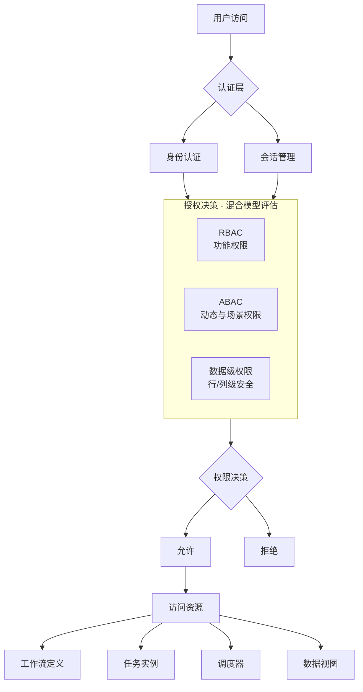

# 集成 n8n 工作流与 Azkaban 任务调度平台的权限管理架构设计

为开发一套集成了类似 n8n 的工作流系统和 Azkaban 的任务调度系统的综合平台，选择合适的权限管理模型至关重要。这需要平衡**安全性、灵活性、易管理性和开发复杂度**。

## 一、系统特征分析

这类**多租户、任务驱动、跨资源的数据与功能编排平台**具有以下特征：

| 模块              | 示例                                 | 权限控制关注点                 |
| ----------------- | ------------------------------------ | ------------------------------ |
| **工作流/任务**   | n8n 工作流、Azkaban Job、DAG 节点    | 谁能创建、编辑、运行、查看任务 |
| **数据资源**      | 数据库连接、表、数据集、API 结果     | 谁能访问或修改数据资源         |
| **计算/执行环境** | 调度节点、算力池、执行器             | 谁能调度/运行在哪个环境上      |
| **系统功能**      | 用户管理、调度配置、监控、触发器管理 | 系统功能模块级权限控制         |

> 权限模型要同时支持 **功能级（UI、API）** + **数据级（对象、行列）** 控制，且要支持跨租户、跨资源。

## 二、权限模型比较与选择

### 主流权限模型对比

| 权限模型 | 核心思想 | 优点 | 缺点 | 在系统中的适用性 |
| :--- | :--- | :--- | :--- | :--- |
| **ACL** | 直接为用户指定权限 | 简单直观 | 管理复杂，难以扩展 | **不适用**：用户和权限多时，管理会变成噩梦 |
| **RBAC** | 权限赋予角色，角色赋予用户 | **易管理、职责清晰、降低复杂度** | 粒度较粗，难以处理动态和临时权限 | **核心基础**：非常适合管理功能权限和静态资源权限 |
| **ABAC** | 基于主体、客体、环境属性动态决策 | **极其灵活、粒度极细** | **实现复杂、策略管理难、可能影响性能** | **重要补充**：用于动态、场景化的精细化控制 |
| **ReBAC** | 基于资源间的关系（如所有者、协作者） | **直观表达业务关系** | 模型复杂，实现难度高 | **可选增强**：如果工作流协作关系复杂则值得考虑 |

**结论**：单一模型难以满足复杂需求，**混合模型是最佳选择**。

### 行业实践参考

- **n8n、Airflow、Azkaban** 这类系统往往采用 **RBAC + ReBAC 混合模型**
- **云平台（AWS、GCP、阿里云）** 采用 **ABAC + RBAC 混合模型**

## 三、推荐架构：RBAC + ABAC + 数据级权限的混合模型

### 架构总览



### 1. RBAC：权限管理的基石

RBAC 作为基础，负责管理**功能权限**和**静态资源访问**。

#### 核心角色定义

| 角色 | 权限范围 | 主要职责 |
|------|----------|----------|
| **系统管理员** | 全权限 | 用户管理、角色管理、系统配置 |
| **工作流开发者** | 工作流管理 | 创建、编辑、发布、删除工作流；查看执行日志 |
| **调度运维员** | 调度管理 | 管理调度计划、手动触发/停止任务、查看系统健康状态 |
| **数据分析师** | 只读权限 | 查看工作流执行结果和报表 |
| **访客** | 有限查看 | 仅能查看有权限的特定仪表盘或报告 |

#### RBAC 设计示例

```
ROLE_ADMIN → 系统管理、用户管理、任务调度
ROLE_DEVELOPER → 创建/编辑工作流、管理任务
ROLE_VIEWER → 查看运行结果、日志
```

**技术实现**：标准 RBAC 表模型

```
user_role(user_id, role_id)
role_permission(role_id, permission_id)
```

#### RBAC 最佳实践

- **角色层级**：支持角色继承，避免重复授权（如"数据分析师"继承"访客"权限）
- **最小权限原则**：每个角色只授予完成其任务所必需的最小权限
- **职责分离**：将高风险的操作分散到不同角色（如"开发者"不能直接手动生产任务）

### 2. ABAC：实现动态与精细化控制

当 RBAC 的静态粒度不足时，ABAC 提供了强大的动态决策能力。

#### ABAC 应用场景

| 场景类型 | 具体应用 | 控制目标 |
|----------|----------|----------|
| **时间限制** | 只允许在工作时间触发高风险工作流 | 基于时间属性的访问控制 |
| **地理位置限制** | 只允许从公司内网或 VPN 管理调度任务 | 基于网络位置的安全控制 |
| **设备安全** | 要求 MFA 才能删除工作流 | 基于设备认证的强化安全 |
| **数据敏感性** | 处理敏感数据时要求高级安全许可 | 基于数据标签的动态权限 |

#### ABAC 属性体系

- **用户属性**：部门、安全级别、职位、认证强度
- **资源属性**：工作流标签（如 `finance`, `sensitive`）、创建者、数据敏感度
- **环境属性**：访问时间、IP 地址、设备类型、网络状态

#### ABAC 策略示例

```json
{
  "effect": "allow",
  "action": ["workflow.execute", "task.schedule"],
  "resource": "workflow:production/*",
  "condition": {
    "and": [
      {"user.department": "== finance"},
      {"time.hour": {">=": 9, "<=": 18}},
      {"network.location": "== corporate"},
      {"resource.sensitivity": "<= user.clearance_level"}
    ]
  }
}
```

### 3. 数据级权限：保护数据本身

对于工作流处理的数据，必须进行隔离和保护。

#### 行级安全性 (RLS)

**应用场景**：销售部门的工作流只能看到销售数据，HR 部门只能看到员工数据

**实现方式**：
- 在数据库层面（如 PostgreSQL、Snowflake）或应用查询层面
- 根据当前用户角色动态添加 `WHERE` 子句过滤数据
- 示例：`WHERE tenant_id = current_tenant_id() AND department_id = user_department_id()`

#### 列级权限/动态数据掩码

**应用场景**：对普通用户掩码手机号、身份证号等敏感列，只有特定角色才能看到明文

**实现方式**：
- 在数据库或应用层实现
- 查询时根据角色返回脱敏后的数据
- 支持多种掩码策略：完全掩码、部分掩码、令牌化

## 四、层次化权限架构

### 分层架构设计

```
┌────────────────────────────┐
│         认证层 (IAM)       │  ← 外部登录、单点登录、OAuth、SAML
└──────────────┬─────────────┘
               │
┌──────────────▼─────────────┐
│     系统功能层 (RBAC)      │  ← 控制功能模块访问（菜单、API）
└──────────────┬─────────────┘
               │
┌──────────────▼─────────────┐
│      资源层 (ABAC)         │  ← 控制动态权限和场景化访问
└──────────────┬─────────────┘
               │
┌──────────────▼─────────────┐
│      数据层 (RLS/掩码)      │  ← 控制行/列级数据访问
└────────────────────────────┘
```

### 各层职责分工

| 层级 | 主要职责 | 技术实现 | 管理复杂度 |
|------|----------|----------|------------|
| **认证层** | 身份验证、会话管理 | OAuth 2.0、JWT、SAML | 低 |
| **RBAC层** | 功能权限、静态资源访问 | 角色表、权限表、中间件 | 中 |
| **ABAC层** | 动态权限、场景化控制 | 策略引擎、属性计算 | 高 |
| **数据层** | 数据隔离、敏感信息保护 | RLS、数据掩码、视图 | 中高 |

## 五、技术选型与实施策略

### 推荐技术栈

| 层级 | 推荐技术 | 说明 |
|------|----------|------|
| **认证层** | Keycloak / Auth0 / AWS Cognito / 阿里云 IDaaS | 提供统一身份认证与 SSO |
| **RBAC层** | Casbin / Oso / 自研框架 | 基于角色的通用控制框架 |
| **ABAC层** | Open Policy Agent (OPA) / 自定义策略引擎 | 属性驱动的动态策略 |
| **数据层** | 数据库 RLS / 应用层过滤器 | 行/列级数据访问控制 |
| **审计** | ELK Stack / 自定义审计系统 | 权限决策和操作审计 |

### 分阶段实施策略

#### 第一阶段：RBAC 基础框架
- [ ] 实现基础的用户、角色、权限管理
- [ ] 覆盖核心功能权限
- [ ] 建立权限管理界面
- [ ] 目标：快速搭建起基础权限框架

#### 第二阶段：ABAC 动态控制
- [ ] 根据业务需求，逐步引入 ABAC 处理特定场景
- [ ] 实现策略引擎和属性计算
- [ ] 建立策略配置和测试环境
- [ ] 目标：处理动态、复杂的场景化权限需求

#### 第三阶段：数据级权限完善
- [ ] 实现数据行级安全控制
- [ ] 添加列级数据掩码功能
- [ ] 建立数据访问审计
- [ ] 目标：确保数据隔离与安全

### 关键实施要点

#### 权限管理界面
- 提供直观、易用的权限管理界面
- 支持角色配置、策略管理、权限关系查看
- 提供权限模拟和测试功能

#### 性能优化
- ABAC 和 RLS 可能引入额外计算开销
- 需要对策略进行缓存和优化
- 避免对高频操作（如任务调度）产生显著影响

#### 审计日志
- **记录所有权限决策和敏感操作**
- 包含：谁、在何时、用何权限、做了什么
- 支持安全审计和问题排查

## 六、最佳实践建议

### 安全原则
1. **最小权限原则**：每个用户只获得完成任务所需的最小权限
2. **职责分离**：高风险操作分散到不同角色
3. **默认拒绝**：未明确允许的访问一律拒绝
4. **定期审计**：定期检查和清理不必要的权限

### 开发实践
1. **权限优先设计**：在功能设计阶段就考虑权限控制
2. **权限测试**：建立完善的权限测试用例
3. **文档化**：详细记录权限模型设计和配置
4. **监控告警**：对权限异常行为进行监控和告警

### 运维管理
1. **权限生命周期管理**：入职、调岗、离职时的权限变更流程
2. **定期权限审查**：定期审查用户权限和角色配置
3. **应急响应**：建立权限安全事件的应急响应流程
4. **合规要求**：满足相关法规和标准的合规要求

## 七、总结建议

| 权限控制目标 | 推荐方案 | 技术实现 | 理由 |
|-------------|----------|----------|------|
| **平台功能权限（UI、API）** | RBAC | 角色表 + 中间件 | 简单易管理，职责清晰 |
| **动态场景化权限** | ABAC | 策略引擎 + 属性计算 | 灵活应对复杂业务场景 |
| **数据行/列级控制** | RLS + 数据掩码 | 数据库过滤器 + 应用层处理 | 保护核心数据资产安全 |
| **身份与 SSO** | 外部 IAM | OAuth 2.0 + JWT | 易于企业集成，提升安全性 |
| **统一策略中心** | OPA + 自定义引擎 | 策略即代码 | 可集中审计与策略决策 |

> ✅ 这套混合权限架构在"多租户 AI 编排平台 / 数据工作流系统 / 调度系统"中都能通用，在安全性、灵活性和可管理性之间取得了良好平衡。

> 权限模型与 Snowflake 的 RBAC/Policy 体系类似，但通过混合架构设计更加灵活、可编程，能够适应复杂的企业级权限管理需求。
