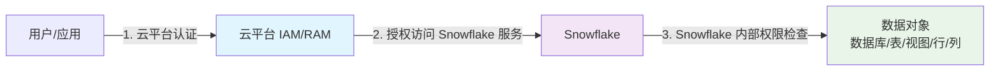

# Snowflake 数据权限管理与云平台 IAM 的对比分析

Snowflake 作为云原生数据仓库，其数据权限管理机制与 AWS IAM、阿里云 RAM 等云平台的通用 IAM 框架有所不同。它更专注于**数据仓库内部的细粒度权限控制**，并与云平台的 IAM 形成互补关系，体现了"数据库内安全边界"和"云平台外安全边界"的分层设计思想。

## 一、核心区别概览

| 特性维度         | Snowflake 数据权限管理                                  | AWS IAM / 阿里云 RAM (通用 IAM)                          |
| :--------------- | :----------------------------------------------------- | :----------------------------------------------------- |
| **核心范围**       | **数据平台内部**：数据库、表、视图、列、行等数据对象              | **云平台全局**：计算、存储、网络、服务等所有云资源                 |
| **核心模型**       | **混合模型**：RBAC + DAC + UBAC                             | **以 RBAC 为主**：基于角色或策略的访问控制                      |
| **权限粒度**       | **极细**：可到行级和列级                                   | **较粗**：通常到 API 操作或资源类型级别，少数服务支持资源级         |
| **策略应用方式**   | **直接附加**：权限直接授予角色或用户，策略直接附加在表/列上         | **评估引擎**：请求时通过策略评估引擎判断是否允许                       |
| **身份集成**       | **深度集成**：支持 SCIM、External OAuth 等与企业身份提供商集成     | **广泛集成**：支持与企业身份提供商联合，是云平台的核心身份认证系统        |
| **主要目标**       | **数据安全与治理**：确保数据访问的合规性、保密性和精细化控制           | **云资源访问控制**：确保对云服务资源的访问安全、合规和最小权限原则        |

## 二、Snowflake 权限管理体系详解

### 权限模型架构

Snowflake 的权限模型是 **以数据库为中心、基于角色的授权体系**，融合了多种访问控制模型：

#### 核心组成要素

| 层级                           | 概念                                                    | 作用                  |
| ------------------------------ | ------------------------------------------------------- | --------------------- |
| **用户（User）**               | Snowflake 中的登录账户                                  | 用于身份认证（AuthN） |
| **角色（Role）**               | 权限的逻辑集合                                          | 用于访问控制（AuthZ） |
| **对象（Object）**             | 数据库对象，如数据库、schema、table、view、warehouse 等 | 授权的目标            |
| **权限（Privilege）**          | 对象可执行的操作，如 `SELECT`、`INSERT`、`USAGE`        | 授权内容              |
| **角色继承（Role Hierarchy）** | 角色之间可以继承权限（父角色拥有子角色的全部权限）      | 便于组织多层访问控制  |
| **上下文角色（Current Role）** | 用户登录后可以切换当前使用的角色                        | 实现多身份访问        |

#### 混合访问控制模型

1.  **基于角色的访问控制 (RBAC)**：这是**最核心和常用**的方式。权限被赋予角色，角色再被赋予用户。通过角色层级（Role Hierarchy）实现权限的继承，极大简化了权限管理。
2.  **自主访问控制 (DAC)**：对象的**所有者**（如表的创建者）拥有对该对象的完全控制权，可以自行决定将访问权限授予其他角色或用户。
3.  **基于用户的访问控制 (UBAC)**：权限也可以**直接授予特定的用户**，但这通常不作为主要管理方式，仅在特定场景下使用。

### 典型实现示例

```sql
-- 创建角色与用户
CREATE ROLE analyst;
CREATE USER alice PASSWORD='***' DEFAULT_ROLE = analyst;

-- 授予角色权限
GRANT SELECT ON DATABASE sales TO ROLE analyst;

-- 将角色授予用户
GRANT ROLE analyst TO USER alice;

-- 用户登录后切换角色
USE ROLE analyst;
```

Snowflake 中角色的层级与数据库对象的层级独立存在，形成非常灵活的权限模型。

### 高级安全功能

#### 🛡️ 精细化的数据访问策略

| 功能                          | 说明                                              | 应用场景 |
| ----------------------------- | ------------------------------------------------- | -------- |
| **Row Access Policy**         | 行级访问控制，根据用户角色过滤数据行              | 区域数据隔离、部门数据分离 |
| **Dynamic Data Masking**      | 对敏感列进行动态脱敏（如隐藏身份证、手机号）      | 个人隐私信息保护 |
| **Secure Views / Secure UDF** | 隐藏底层实现逻辑和原始数据                        | 复杂业务逻辑封装 |
| **External Tokenization**     | 与外部安全网关集成（如 AWS KMS, Hashicorp Vault） | 高级加密需求 |
| **Network Policy**            | 基于 IP、VPN 的访问白名单控制                     | 网络访问控制 |

#### 行级访问策略详解

- 通过定义策略函数，**动态过滤**用户能看到的数据行
- 例如，限制区域经理只能查看其负责区域的数据
- 策略在查询执行时**优先于列掩码**进行评估
- 可以结合**映射表**来管理复杂的权限映射关系

#### 动态数据掩码详解

- 对**敏感列**（如身份证、手机号）的值进行实时脱敏
- 返回掩码后的值（如 `***MASKED***`）
- 支持条件掩码，例如根据用户角色或自身其他列的值决定是否脱敏

### 身份集成机制

Snowflake 支持与企业现有身份提供商深度集成：

| 集成方式 | 功能 | 应用场景 |
|----------|------|----------|
| **SCIM** | 自动同步用户和角色到 Snowflake | 用户生命周期管理 |
| **External OAuth** | 通过第三方 OAuth 服务器访问 Snowflake | 联合身份认证 |
| **SAML SSO** | 单点登录集成 | 企业统一认证 |
| **Okta/Azure AD 集成** | 深度身份管理 | 现代企业身份治理 |

## 三、云平台 IAM/RAM 体系详解

### AWS IAM / 阿里云 RAM 核心特征

AWS IAM 和阿里云 RAM 是**云平台级别的统一访问控制服务**，其核心目标是管理对**整个云平台所有资源**的访问权限。

#### 核心特征

- **核心是 RBAC**：通过将策略附加到身份（用户、组）或角色上来授予权限
- **权限粒度**：通常控制到**API 操作级别**（如 `s3:GetObject`）或**资源类型级别**
- **策略评估**：当主体发起请求时，IAM 系统会**评估所有适用的策略**
- **广泛集成**：是整个云生态的**权限基石**，与几乎所有云服务深度集成

#### 管理范围

| 资源类型 | 示例 | 权限控制级别 |
|----------|------|--------------|
| **计算资源** | EC2、ECS、函数计算 | 实例级别控制 |
| **存储资源** | S3、OSS、块存储 | Bucket/Object 级别控制 |
| **网络资源** | VPC、负载均衡、CDN | 资源级别控制 |
| **数据库服务** | RDS、NoSQL 数据库 | 实例级别控制 |
| **数据仓库** | Snowflake 账户访问 | 服务级别控制 |

## 四、详细对比分析

### 维度对比表

| 维度         | Snowflake RBAC                          | AWS IAM / 阿里云 RAM                           |
| ------------ | --------------------------------------- | ---------------------------------------------- |
| **作用层级** | 数据库内部对象（如表、视图、schema）    | 云资源层（如 EC2、S3、RDS、Snowflake Account） |
| **安全边界** | 数据库租户内部                          | 云账户/租户外部                                |
| **授权方式** | 角色 + 对象 + 权限                      | 用户/角色/策略 + 资源 ARN                      |
| **管理粒度** | 数据行/列级（支持数据屏蔽、行访问策略） | 资源级（通常到 API 调用粒度）                  |
| **典型用途** | 控制谁能查询、修改表中哪些数据          | 控制谁能访问数据库服务、管理账号、执行 API     |
| **身份来源** | 内部用户或外部 IdP 同步                 | 云平台用户体系（IAM、RAM、STS）                |
| **策略语言** | SQL 语句 (GRANT/REVOKE, POLICY)         | JSON 策略 (Policy)                             |
| **整合关系** | 可通过 OAuth/SAML 接入 IAM 用户         | IAM 负责认证后，将身份映射到 Snowflake 用户    |

### 本质区别

| 对比点       | Snowflake 权限模型              | 云平台 IAM / RAM       |
| ------------ | ------------------------------- | ---------------------- |
| **层次**     | 数据库内                        | 云资源层               |
| **作用对象** | 数据表、视图、warehouse、schema | 实例、Bucket、API      |
| **控制模型** | RBAC + 细粒度数据策略           | ABAC（属性型策略）     |
| **执行位置** | SQL 层内执行                    | 云平台控制平面执行     |
| **整合方式** | 可接入 IAM 做身份认证           | 不管理数据库内对象授权 |

## 五、集成协作模式

### 安全边界划分



### 三层安全架构

| 层级                        | 负责方           | 典型机制                                                         |
| --------------------------- | ---------------- | ---------------------------------------------------------------- |
| **账户级（Account-level）** | Snowflake        | 每个账号是逻辑隔离的租户                                         |
| **数据库内部（RBAC）**      | Snowflake        | 通过角色体系控制对象权限                                         |
| **外部身份认证（AuthN）**   | 客户 + Snowflake | 支持 SSO, OAuth, SCIM, SAML, Okta 等                             |
| **外部数据访问控制**        | 客户             | 结合 Data Masking, Row Access Policy, Column-level Security 实现 |

### 典型集成流程

在云上部署 Snowflake（如 AWS 上）时，常见的集成方式如下：

1. **认证（AuthN）交由云 IAM**
   - 用户通过 AWS SSO / Okta 登录 → SAML → Snowflake
   - 登录时映射到 Snowflake 内部的角色（`EXTERNAL_OAUTH`、`SCIM` 自动创建用户）

2. **授权（AuthZ）仍在 Snowflake 内部执行**
   - 登录后切换角色 (`USE ROLE analyst;`) 控制数据访问
   - IAM 不直接控制表、视图、列的访问

3. **跨层访问控制（Hybrid Control）**
   - 结合 IAM 的 API 权限控制谁能访问 Snowflake API
   - 结合 Snowflake 内部 RBAC 控制能看到什么数据

## 六、最佳实践建议

### 场景化权限管理方式

| 场景 | 推荐权限管理方式 | 说明 |
| :--- | :--- | :--- |
| **管理云服务器、存储桶、网络等基础资源** | 使用 **AWS IAM** 或 **阿里云 RAM** | 云平台基础设施权限控制 |
| **控制谁能登录 Snowflake 服务** | 使用 **AWS IAM** 或 **阿里云 RAM** 与 Snowflake 集成 | 服务访问级别控制 |
| **管理 Snowflake 内的数据库、表权限** | 使用 **Snowflake RBAC**（角色 hierarchy） | 数据对象级别控制 |
| **实现行级别数据过滤** | 使用 **Snowflake Row Access Policy** | 行级数据安全 |
| **对敏感列进行动态脱敏** | 使用 **Snowflake Dynamic Data Masking** | 列级数据保护 |
| **统一管理用户生命周期** | 使用 **SCIM** 集成企业 IdP | 身份管理自动化 |

### 安全治理建议

1. **分层安全原则**
   - 云平台 IAM 负责"大门"安全
   - Snowflake RBAC 负责"内部"安全
   - 两者结合形成纵深防御

2. **最小权限原则**
   - IAM 角色：只授予必要的云资源访问权限
   - Snowflake 角色：只授予必要的数据对象访问权限

3. **定期审计**
   - 定期检查 IAM 策略和 Snowflake 权限配置
   - 监控异常访问行为

4. **身份集成优先**
   - 优先使用 SCIM 进行用户同步
   - 配置 SSO 简化用户体验和管理

## 七、总结

### 核心理念

如果用一句话概括：

> **IAM 管控"进不进得来 Snowflake"；
> Snowflake RBAC 管控"进来后能看到什么"。**

### 协同关系

Snowflake 与云平台 IAM 并非替代关系，而是**互补关系**：

- **云平台 IAM** 是"大门的钥匙"，决定能否进入云环境并访问 Snowflake 这个"房间"
- **Snowflake 的权限管理** 是"房间内的柜子钥匙"，决定在房间里能打开哪些柜子、看到柜子里的哪些东西

这种分层设计实现了**外层安全边界**和**内层数据安全**的完美结合，为企业数据仓库提供了完整的安全解决方案。
