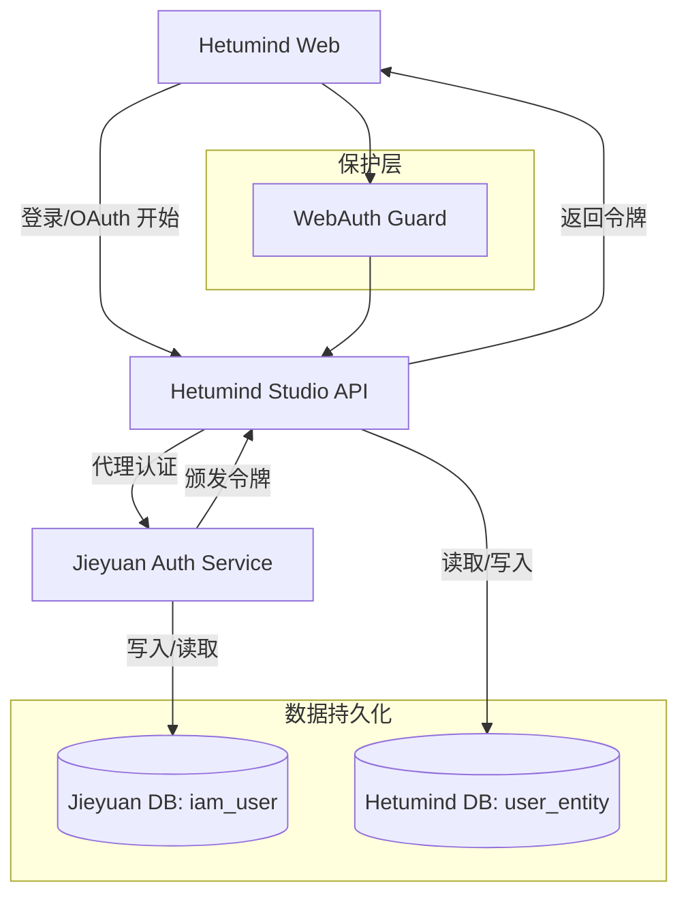
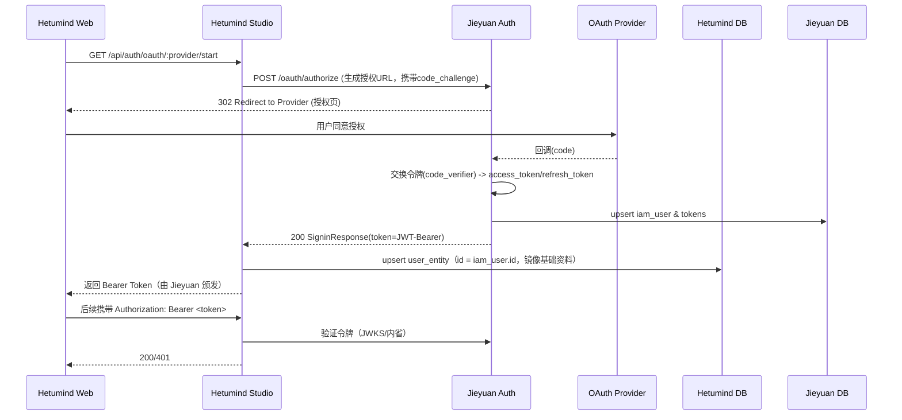

# Hetumind 与 Jieyuan 统一身份认证与授权治理方案（Jieyuan 中心 IAM）

> 目标：由 Jieyuan 提供统一的 IAM（身份认证与授权）能力，Hetumind 统一代理认证并仅信任中心令牌；保留 Hetumind 的 `user_entity` 表，使用 `jieyuan.iam_user.id` 作为 `user_entity.id` 显式插入；统一令牌治理与权限判定由 Jieyuan 负责。

## 系统架构设计



- 认证代理：Hetumind Studio 的 `/api/auth/*` 路由代理到 Jieyuan 的认证服务，令牌颁发与校验由 Jieyuan 负责。
- 用户映射：首次登录时，Hetumind 使用 `jieyuan.iam_user.id` 作为 `user_entity.id`（应用层显式指定插入），不再创建 `oauth_login` 表。
- 令牌验证：Hetumind Studio 的鉴权中间件 `AsyncRequireAuthorizationLayer(WebAuth)` 接入 Jieyuan 的公钥/JWKS 或 Token 内省接口，统一验证 Bearer Token。

## 数据库表结构变更与 DDL 文件说明

- 保留 `user_entity`（id 使用 `bigint`，移除默认自增序列；插入时显式指定为 `iam_user.id`）
- 删除 `oauth_login` 表（Hetumind 不再存储第三方 Provider 关联信息）
- 不扩展 `auth_identity` 的 Provider 字段（第三方 OAuth 集成统一由 `jieyuan` 实现）
- 在 `jieyuan.iam_user` 添加邮箱/手机号唯一索引，由中心统一管理登录用户的 `email/phone`
- 在 Hetumind 关键主表增加 `tenant_id` 字段，基于令牌 `claims.tenant_id` 做行级/项目级数据隔离

文件位置与建议修改：

1. 修改文件：`/Users/yangjing/workspaces/fusion-data/scripts/software/postgres/sqls/hetumind-ddl.sql`

```sql
  -- user_entity.id：移除默认自增序列（保留类型为 bigint）
  alter table if exists user_entity alter column id drop default;
  -- 如存在序列可一并删除（名称可能为 user_entity_id_seq，按实际为准）
  drop sequence if exists user_entity_id_seq;

  -- 删除 oauth_login 表（不再需要）
  drop table if exists oauth_login cascade;

  -- 多租户：在关键主表增加 tenant_id（uuid 类型，由中心令牌 claims 下发）
  alter table if exists project add column if not exists tenant_id uuid not null;
  alter table if exists workflow_entity add column if not exists tenant_id uuid not null;
  alter table if exists execution_entity add column if not exists tenant_id uuid not null;
```

2. 修改文件：`/Users/yangjing/workspaces/fusion-data/scripts/software/postgres/sqls/jieyuan-ddl.sql`

```sql
  -- 统一唯一约束（中心负责）
  create unique index if not exists iam_user_uidx_email on iam_user (email) where email is not null;
  create unique index if not exists iam_user_uidx_phone on iam_user (phone) where phone is not null;
```

说明：

- 令牌落库：为安全起见，Hetumind 不存储 access_token/refresh_token 明文；审计需要可存哈希或到期时间，建议在中心侧完成。
- 外键：两侧位于不同数据库实例/Schema 时无法建立跨库外键，建议由应用层保证 ID 一致性与生命周期镜像（创建、禁用、删除）。

## 事件轮询与幂等（无需外部消息系统）

- 轮询维度：按 `updated_at` 进行增量拉取；接口入参支持时间范围与分页，避免全表扫描。
- 中心接口（建议，POST + JSON 请求）：

```http
  POST /iam/users/changes
```

请求示例：

```json
{
  "page": {
    "page": 1,
    "limit": 100
  },
  "filters": [
    {
      "updated_at": {
        "$gte": "2025-01-01T12:00:00Z",
        "$lt": "2025-01-01T13:00:00Z"
      }
    }
  ]
}
```

响应示例：

```json
{
  "page": {
    "total": 200,
    "has_more": true
  },
  "result": [
    { "id": 123, "status": "disabled", "updated_at": "2025-01-01T12:00:00Z" },
    { "id": 456, "status": "revoked", "updated_at": "2025-01-01T12:10:00Z" }
  ]
}
```

Hetumind 侧处理要点：

- 幂等：按 `id` 与最新 `updated_at` 处理，重复事件不产生副作用。
- 镜像：将禁用/撤销映射到本地 `user_entity.status` 或 `logical_deletion` 等字段。
- 安排：定时任务（如每 1–5 分钟）执行轮询与镜像更新，记录审计日志（批次、成功/失败统计）。

示例代码：

```rust
  /* 函数级注释：轮询中心用户变更，更新本地镜像（幂等） */
  async fn poll_user_changes(app: Application, updated_from: String, updated_to: String) -> Result<(), DataError> {
    let base = app.fusion_setting().service().get("JIEYUAN_BASE_URL").unwrap_or_default();
    let url = format!("{}/iam/users/changes", base);
    let payload = serde_json::json!({
      "page": { "page": 1, "limit": 100 },
      "filters": [{ "updated_at": { "$gte": updated_from, "$lt": updated_to } }]
    });
    let resp = reqwest::Client::new().post(&url).json(&payload).send().await?;
    if !resp.status().is_success() { /* 记录审计并返回错误 */ }
    let body: serde_json::Value = resp.json().await?;
    for item in body["result"].as_array().unwrap_or(&vec![]) {
      let id = item["id"].as_i64().unwrap_or_default();
      let status = item["status"].as_str().unwrap_or("active");
      // TODO: 根据 status 映射到本地字段（禁用/软删除）
      // update user_entity set status = ..., logical_deletion = ... where id = id
    }
    Ok(())
  }
```

## 多租户落地与数据隔离

- 令牌 `claims` 纳入 `tenant_id`（由中心主导签发与治理）。
- Hetumind 在关键主表增加 `tenant_id` 字段，并在访问层按 `tenant_id` 做行级/项目级过滤。
- 审计：在资源访问审计日志中记录 `tenant_id`，提升合规可追溯性。

## 共享库职责边界（jieyuan-core）

- 路径：`/Users/yangjing/workspaces/fusion-data/jieyuan/jieyuan-core/`
- 建议模块：
  - `auth`: `AuthClaims`、`TokenValidationPolicy`、`verify_token`、`map_claims_to_permissions`
  - `model`: `UserPrincipal`、`Role`、`Scope`、`TenantId`
- 使用方式：`hetumind-studio` 仅调用共享库完成令牌校验与授权推导，不实现第三方 Provider 客户端。

## 令牌与上下文复用（SecurityUtils + CtxPayload）

- 工具与数据结构
  - 令牌校验：复用 `fusion_core::security::SecurityUtils`（统一封装 JWKS 验签/内省兜底策略）
  - 请求上下文：复用 `fusion_common::ctx::CtxPayload`（在中间件完成令牌解析后，注入 `user_id/tenant_id/roles/scopes` 等）

示例：在 Handler 中使用 `fusion_web::extract_ctx` 从请求提取 `Ctx`（通过 `payload: Map<String, Value>` 存放上下文字段）

```rust
  use fusion_common::ctx::Ctx;
  use fusion_web::{WebResult, ok_json, extract_ctx};
  use fusion_core::application::Application;
  use http::request::Parts; // 或 axum::http::request::Parts

  /* 函数级注释：在 Handler 中通过 extract_ctx 提取 Ctx 并进行资源层授权判定 */
  async fn secured_handler(
    axum::extract::State(app): axum::extract::State<Application>,
    mut parts: Parts,
  ) -> WebResult<serde_json::Value> {
    // 从请求提取 Ctx（读取 Authorization Bearer 或查询参数 access_token）
    let ctx: Ctx = extract_ctx(&parts, app.fusion_setting().security())?;

    // 示例：检查 scopes（从 ctx.payload() 读取）
    let has_scope = ctx
      .payload()
      .get_strings("scopes")
      .map(|v| v.iter().any(|s| *s == "workflow:write"))
      .unwrap_or(false);
    if !has_scope { return Err(fusion_web::error::WebError::from(fusion_core::DataError::forbidden("insufficient scope"))); }

    ok_json!(serde_json::json!({"ok": true, "uid": ctx.uid()}))
  }

  /* 函数级注释：在 Handler 中读取 CtxPayload，进行资源层授权判定 */
  async fn secured_handler(
    axum::extract::State(app): axum::extract::State<Application>,
    req: axum::http::Request<axum::body::Body>,
  ) -> WebResult<serde_json::Value> {
    let ctx = req.extensions().get::<Ctx>().cloned().ok_or_else(|| DataError::unauthorized("missing context"))?;
    // 示例：检查 scopes（从 ctx.payload() 读取）
    let has_scope = ctx
      .payload()
      .get_strings("scopes")
      .map(|v| v.iter().any(|s| *s == "workflow:write"))
      .unwrap_or(false);
    if !has_scope { return Err(DataError::forbidden("insufficient scope")); }
    ok_json!(serde_json::json!({"ok": true, "uid": ctx.uid()}))
  }
```

说明：

- 通过复用 `fusion_web::extract_ctx` 获取 `Ctx`，可避免在中间件手动注入上下文；`extract_ctx` 会从请求头或查询参数提取令牌，并使用 `SecurityUtils::decrypt_jwt` 生成 `Ctx`（内部包装 `CtxPayload`）。

## SecurityUtils 接口建议与复用

- 现状：`fusion_core::security::SecurityUtils` 已存在类型定义（`pub struct SecurityUtils;`）。为统一各应用的令牌校验与兜底策略，建议锁定以下接口名：
  - `SecurityUtils::verify_jwt(token: &str, jwks_url: &str, expected_iss: &str, expected_aud: &str) -> Result<AuthClaims, DataError>`
  - `SecurityUtils::load_jwks(jwks_url: &str) -> Result<Jwks, DataError>`
  - `SecurityUtils::introspect(token: &str, introspect_url: &str, timeout_ms: u64) -> Result<bool, DataError>`
  - `SecurityUtils::claims_from_token(token: &str) -> Result<AuthClaims, DataError>`（可选：对已验签令牌直接解析 claims）

说明：

- WebAuth 中间件可复用上述接口实现“JWKS 验签优先 + 内省兜底”策略；若部分方法尚未实现，建议在 `fusion-core` 中补充以统一跨应用行为。

## 资源命名规范（jieyuan-core）

- 为避免字符串散落，统一在 `jieyuan-core` 中定义资源/动作常量或枚举：

```rust
  // 建议：字符串常量（易于与 claims/scopes 对齐）
  pub mod permissions {
    pub const WORKFLOW_READ: &str = "workflow:read";
    pub const WORKFLOW_WRITE: &str = "workflow:write";
    pub const EXECUTION_EXECUTE: &str = "execution:execute";
    pub const EXECUTION_CANCEL: &str = "execution:cancel";
    pub const EXECUTION_RETRY: &str = "execution:retry";
  }

  // 可选：强类型枚举（在服务内部使用，提供 as_str() 映射）
  #[derive(Debug, Clone, Copy, PartialEq, Eq, Hash)]
  pub enum ResourceAction {
    WorkflowRead,
    WorkflowWrite,
    ExecutionExecute,
    ExecutionCancel,
    ExecutionRetry,
  }
  impl ResourceAction {
    pub fn as_str(&self) -> &'static str {
      match self {
        ResourceAction::WorkflowRead => permissions::WORKFLOW_READ,
        ResourceAction::WorkflowWrite => permissions::WORKFLOW_WRITE,
        ResourceAction::ExecutionExecute => permissions::EXECUTION_EXECUTE,
        ResourceAction::ExecutionCancel => permissions::EXECUTION_CANCEL,
        ResourceAction::ExecutionRetry => permissions::EXECUTION_RETRY,
      }
    }
  }
```

说明：

- `hetumind-studio` 的资源层授权判定与前端 UI 可统一使用上述字符串常量；服务内部需要更强类型时使用枚举并调用 `as_str()` 与 scopes 对齐。

## 权限与角色集成（复用 jieyuan 模块）

- 复用路径：

  - 角色：`/Users/yangjing/workspaces/fusion-data/jieyuan/jieyuan/src/role/`
  - 权限：`/Users/yangjing/workspaces/fusion-data/jieyuan/jieyuan/src/permission/`
  - 角色-权限模型：`/Users/yangjing/workspaces/fusion-data/jieyuan/jieyuan-core/src/model/role_permission.rs`

- 建议集成方式：
  - 在 `jieyuan-core` 暴露统一的权限判定接口（如 `has_permission(principal, resource, action)`），内部依据 `RolePermission` 进行计算。
  - `hetumind-studio` 在资源访问层调用该接口；`principal` 从 `CtxPayload` 构造。

示例：资源层权限判定（伪代码，使用 Ctx 与 CtxPayload 便捷方法）

```rust
  use fusion_common::ctx::Ctx;
  use jieyuan_core::model::role_permission::RolePermission; // 示例，引入统一模型

  /* 函数级注释：判断用户是否具备某资源某动作的权限 */
  async fn require_permission(
    app: &Application,
    ctx: &Ctx,
    resource: &str,
    action: &str,
  ) -> Result<(), DataError> {
    // 将 Ctx 映射为 UserPrincipal
    let uid = ctx.uid();
    let tenant_id = ctx.payload().get_str("tenant_id").map(|s| s.to_string());
    let roles = ctx.payload().get_strings("roles").unwrap_or_default().into_iter().map(|s| s.to_string()).collect::<Vec<_>>();
    let scopes = ctx.payload().get_strings("scopes").unwrap_or_default().into_iter().map(|s| s.to_string()).collect::<Vec<_>>();
    let principal = UserPrincipal::new(uid, tenant_id, roles, scopes);
    // 复用 jieyuan 的权限服务/计算逻辑（统一在 core 暴露）
    if !jieyuan_core::auth::has_permission(app, &principal, resource, action).await? {
      return Err(DataError::forbidden("permission denied"));
    }
    Ok(())
  }
```

说明：

- 权限模型仍由中心主导；`hetumind` 仅在资源层做判定调用，不重复实现角色/权限计算，避免漂移。

## Service 层统一提取 Ctx（impl FromRequestParts）

> 参考现有 `CredentialSvc` 的模式，在 Service 层统一提取 `Ctx` 并构造依赖，简化 Handler 签名与上下文处理。

```rust
  use axum::extract::FromRequestParts;
  use fusion_core::application::Application;
  use fusion_core::DataError;
  use fusion_db::ModelManager;
  use fusionsql::page::PageResult;
  use fusion_web::{WebError, WebResult, ok_json, extract_ctx};
  use hetumind_core::workflow::Workflow;
  use http::request::Parts;

  /* 函数级注释：示例 Service，统一在构造时提取 Ctx 并注入 ModelManager 等依赖 */
  pub struct WorkflowSvc {
    mm: ModelManager,
  }

  impl FromRequestParts<Application> for WorkflowSvc {
    type Rejection = WebError;

    async fn from_request_parts(parts: &mut Parts, state: &Application) -> core::result::Result<Self, Self::Rejection> {
      // 提取 Ctx（支持 Authorization Bearer 或查询参数 access_token）
      let ctx = extract_ctx(parts, state.fusion_setting().security())?;
      // 按上下文构造依赖（如 ModelManager.with_ctx(ctx)）
      let mm = state.component::<ModelManager>().with_ctx(ctx);
      Ok(WorkflowSvc { mm })
    }
  }

  /* 函数级注释：Handler 签名简化，直接接收 Service 实例 */
  async fn list_workflows(svc: WorkflowSvc) -> WebResult<PageResult<Workflow>> {
    // TODO：使用 svc.mm 执行分页或查询逻辑
    ok_json!(page_result)
  }
```

说明：

- 该模式将令牌解析与 `Ctx` 注入收敛到 Service 构造中；Handler 只关注业务逻辑，有利于复用与测试。

## OAuth 流程实现细节（Authorization Code + PKCE）



- Start：`/api/auth/oauth/:provider/start` 返回授权 URL，前端重定向到 Provider 授权页。
- Callback：Jieyuan 接收 `code` 并换取 token，返回 `SigninResponse { token, token_type: Bearer }` 给 Hetumind Studio。
- 映射：Hetumind Studio 根据 `iam_user_id` 与 Provider subject，创建或更新 `user_entity` 与 `oauth_login`，确保后续业务主体仍以 Hetumind 的 `hm_user_id` 为主键引用。
- 校验：所有 `/api/v1/*` 路由通过 WebAuth 中间件使用 Jieyuan 的 JWKS 或内省接口统一校验 Token。

## 与 Jieyuan 项目的集成方式

- 服务发现与配置

  - 在 Hetumind Studio 配置 Jieyuan Auth 服务地址（如 `JIEYUAN_BASE_URL`），并注入到 `SignSvc` 或专用 `OauthProxySvc`。
  - 使用 `AsyncRequireAuthorizationLayer(WebAuth)` 的自定义验证器，加载 Jieyuan 的 JWKS 公钥或内省端点。

- 代理登录与回调

  - Hetumind Studio 提供开始登录的代理路由 `/api/auth/oauth/:provider/start`。
  - 回调处理由 Jieyuan 完成；Hetumind 在收到 `SigninResponse` 后进行用户与映射维护。

- 用户资料同步
  - 首次登录：用 `iam_user` 的基础资料（email/name/phone）创建或更新 `user_entity`。
  - 资料更新：提供后台任务或定时同步（可选）。

## 代码示例（Hetumind Studio）

> 以下示例展示：
>
> 1. 开始 OAuth 的代理；2) 处理登录响应并写入映射；3) 使用 JWKS 验证 Bearer Token。

```rust
  // src/endpoint/api/auth.rs
  use axum::{Router, routing::get};
  use fusion_core::application::Application;
  use fusion_web::{WebResult, ok_json};

  pub fn auth_routes() -> Router<Application> {
    Router::new()
      .route("/oauth/:provider/start", get(oauth_start))
      // 保留原有 signin/signup（代理或兼容）
  }

  /* 函数级注释：启动 OAuth 流程，返回授权 URL */
  async fn oauth_start(
    app: Application,
    axum::extract::Path(provider): axum::extract::Path<String>,
  ) -> WebResult<serde_json::Value> {
    let base = app.fusion_setting().service().get("JIEYUAN_BASE_URL").unwrap_or("http://localhost:50010");
    // 请求 Jieyuan 构建授权 URL（含 code_challenge）
    let authorize_url = format!("{}/oauth/authorize?provider={}", base, provider);
    ok_json!(serde_json::json!({ "authorize_url": authorize_url }))
  }
```

```rust
  // src/domain/auth/oauth_proxy_svc.rs（示例：处理登录响应并写入映射）
  use fusion_core::{DataError, Result};
  use fusion_db::ModelManager;
  use reqwest::Client;

  #[derive(Clone)]
  pub struct OauthProxySvc {
    mm: ModelManager,
    http: Client,
    jieyuan_base: String,
  }

  impl OauthProxySvc {
    /* 函数级注释：调用 Jieyuan 交换令牌，并在本地维护 user_entity + oauth_login 映射 */
    pub async fn exchange_and_link(
      &self,
      provider: &str,
      code: &str,
    ) -> Result<(String /*token*/, i64 /*hm_user_id*/), DataError> {
      let url = format!("{}/oauth/token", self.jieyuan_base);
      let resp = self.http.post(&url).json(&serde_json::json!({ "provider": provider, "code": code })).send().await?;
      if !resp.status().is_success() { return Err(DataError::unauthorized("OAuth exchange failed")); }
      let body: serde_json::Value = resp.json().await?;
      let token = body.get("token").and_then(|v| v.as_str()).ok_or(DataError::unauthorized("Missing token"))?.to_string();
      let iam_user_id = body.get("iam_user_id").and_then(|v| v.as_i64()).ok_or(DataError::unauthorized("Missing iam_user_id"))?;
      let subject = body.get("subject").and_then(|v| v.as_str()).unwrap_or("");

      // upsert hm_user（user_entity）与 oauth_login（略）
      // 伪代码：根据 email/name 创建或更新 user_entity；建立 oauth_login 映射
      // self.mm.dbx().begin_txn() ...

      // 返回 Jieyuan 的 Bearer Token 与本地 hm_user_id
      Ok((token, 0 /*hm_user_id*/))
    }
  }
```

```rust
  // src/endpoint/api/mod.rs（示例：接入 Jieyuan 的 Token 验证，JWKS）
  use tower_http::auth::AsyncRequireAuthorizationLayer;
  use fusion_web::middleware::web_auth::WebAuth;

  pub fn routes() -> axum::Router<Application> {
    let web_auth = WebAuth::default() // 扩展：加载 Jieyuan JWKS/内省
      .with_jwks_url(std::env::var("JIEYUAN_JWKS_URL").unwrap_or_default());

    axum::Router::new()
      .nest("/v1", v1::v1_routes().layer(AsyncRequireAuthorizationLayer::new(web_auth)))
      .nest("/auth", auth::auth_routes())
  }
```

## 必要的 SQL 语句与示例

- 建表与索引（见“数据库表结构变更与 DDL 文件说明”）
- 常用查询（无第三方 Provider 表）：

```sql
  -- 根据中心用户ID获取本地镜像
  select * from user_entity where id = $1;

  -- 按时间窗口统计禁用用户（用于事件轮询审计）
  select count(1)
  from user_entity
  where status = 99 and updated_at >= $1 and updated_at < $2;

  -- 多租户：按 tenant_id 过滤关键实体（示例）
  select id, name from project where tenant_id = $1;
  select id, name from workflow_entity where tenant_id = $1;
  select id, status from execution_entity where tenant_id = $1;
```

## 分页字段约定（前后端统一）

- 请求：
  - `page.page` 当前页（从 1 开始）
  - `page.limit` 每页数量
  - `filters` 过滤条件列表（例如 `{"updated_at": {"$gte": "...", "$lt": "..."}}`）
- 响应：
  - `page.total` 总条数
  - `page.has_more` 是否还有更多
  - `result` 数据列表（数组）

说明：

- `jieyuan-core` 已提供统一模型以复用：
  - 请求：`ChangeQueryReq { page: PageRequest, filters: Vec<UpdatedAtWrapper> }`
  - 响应：`ChangeQueryResp<T> { page: PageResponse, result: Vec<T> }`

## 错误处理与安全策略

- 错误处理：统一使用 `fusion_core::DataError`（如 `unauthorized/bad_request/server_error`），在代理流程与验证失败时返回一致的 HTTP 状态码与错误体。
- 安全策略：令牌验证由 Jieyuan 统一管理；Hetumind 通过 JWKS/内省进行验签或有效性检查；敏感令牌不在 Hetumind 明文落库。

## 兼容与扩展建议

- 兼容：保留现有 `signin/signup`，在配置开启后走代理；必要时支持本地账号与 OAuth 并存（双栈）。
- 扩展：统一在 `jieyuan-core` 定义资源/动作常量或枚举（例如 `workflow:read`, `workflow:write`, `execution:execute`），避免权限字符串散落；第三方 Provider 集成统一由 `jieyuan` 承担，`hetumind` 不接入。

## 统一令牌治理方案细则

### 目标与原则

- 统一身份事实源与令牌治理：所有登录、令牌签发与撤销均由 `jieyuan` 负责。
- 应用仅信任中心令牌：`hetumind-studio` 不自签应用令牌、不维护独立会话。
- 强一致与可审计：统一登出、全局撤销、集中审计与风控。

### 令牌策略

- 令牌类型与生命周期
  - `Access Token`：短期（如 15–60 分钟），用于资源访问。
  - `Refresh Token`：长期（如 7–30 天，仅中心持有与管理），用于刷新 Access。
- 声明与校验（Claims）
  - 必须校验：`iss`（发行者）、`aud`（受众）、`exp/iat/nbf`（时间）、`sub`（主体）。
  - 授权信息：`scope` / `roles` 由中心在令牌中下发，应用在资源层判定。
  - 算法白名单：`RS256`，通过 `kid` 与 `JWKS` 匹配公钥。
- 撤销与黑名单
  - 登出与撤销由中心处理（列入黑名单/撤销 Refresh）。
  - 应用对 Access 令牌以本地验签为主；对敏感路径可配置“撤销确认”（短期缓存内省结果，避免每次内省）。

### 鉴权中间件配置（WebAuth）

```rust
  // src/endpoint/api/mod.rs
  use axum::Router;
  use fusion_core::application::Application;
  use fusion_web::middleware::web_auth::WebAuth;
  use tower_http::auth::AsyncRequireAuthorizationLayer;

  /* 函数级注释：统一鉴权，JWKS 验签优先，必要时内省兜底 */
  pub fn routes() -> Router<Application> {
    let web_auth = WebAuth::default()
      .with_jwks_url(std::env::var("JIEYUAN_JWKS_URL").unwrap_or_default())
      .with_expected_iss(std::env::var("JIEYUAN_ISS").unwrap_or("https://jieyuan.example.com".to_string()))
      .with_expected_aud("hetumind-studio".to_string())
      .with_allowed_algs(vec!["RS256".to_string()])
      .with_clock_skew_seconds(60)
      .with_jwks_cache_ttl_seconds(600)
      .with_introspection_url(std::env::var("JIEYUAN_INTROSPECT_URL").unwrap_or_default())
      .with_introspection_timeout_ms(500);

    Router::new()
      .nest("/v1", v1::v1_routes().layer(AsyncRequireAuthorizationLayer::new(web_auth)))
      .nest("/auth", auth::auth_routes())
  }
```

### 登录/刷新/登出代理（示例）

```rust
  // src/endpoint/api/auth.rs
  use axum::{Router, routing::post};
  use fusion_core::application::Application;
  use fusion_web::{WebResult, extract::JsonOrForm, ok_json};
  use reqwest::Client;

  /* 函数级注释：登录代理，转发至中心并原样响应令牌 */
  async fn signin(app: Application, JsonOrForm(req): JsonOrForm<SigninRequest>) -> WebResult<SigninResponse> {
    let base = app.fusion_setting().service().get("JIEYUAN_BASE_URL").unwrap_or("");
    let resp = Client::new().post(format!("{}/auth/signin", base)).json(&req).send().await?;
    if !resp.status().is_success() { /* 返回 DataError 映射 */ }
    let body: SigninResponse = resp.json().await?;
    ok_json!(body)
  }

  /* 函数级注释：刷新令牌代理（中心刷新 Access） */
  async fn refresh(app: Application, JsonOrForm(req): JsonOrForm<RefreshRequest>) -> WebResult<SigninResponse> {
    let base = app.fusion_setting().service().get("JIEYUAN_BASE_URL").unwrap_or("");
    let resp = Client::new().post(format!("{}/auth/refresh", base)).json(&req).send().await?;
    let body: SigninResponse = resp.json().await?;
    ok_json!(body)
  }

  /* 函数级注释：登出代理（中心撤销 Refresh Token/加入黑名单） */
  async fn signout(app: Application, JsonOrForm(req): JsonOrForm<SignoutRequest>) -> WebResult<()> {
    let base = app.fusion_setting().service().get("JIEYUAN_BASE_URL").unwrap_or("");
    let _ = Client::new().post(format!("{}/auth/signout", base)).json(&req).send().await?;
    ok_json!()
  }

  pub fn auth_routes() -> Router<Application> {
    Router::new().route("/signin", post(signin)).route("/refresh", post(refresh)).route("/signout", post(signout))
  }
```

### 权限模型集成

- 统一角色/权限：中心令牌内嵌 `roles/scopes`，应用在资源层进行判定（如 Workflow/Node 的 `read/write/execute`）。
- 授权缓存：可在短期内缓存授权推导结果优化 UI，但敏感操作需强制实时校验。

### 统一审计与风控

- 审计：登录/刷新/登出、失败尝试由中心记录；应用记录资源访问审计（请求者、资源、动作、结果）。
- 风控：中心限流与黑名单；应用侧 API 速率限制与异常 IP 检测协同。
- 撤销事件：中心通过回调/消息队列推送撤销事件，应用对后续请求增强校验或拒绝。

### 多应用协同与多租户

- 多应用：各应用统一使用中心令牌；跨应用调用透传中心令牌或进行服务器端 Token Exchange。
- 多租户：在令牌 `claims` 增加 `tenant_id`；应用侧做数据隔离与策略约束。

### 性能与可靠性

- JWKS 验签优先：减少网络依赖与延迟；`kid` 命中公钥，缓存与定期刷新。
- 内省兜底：在撤销疑点或 JWKS 不可用时触发；加入熔断、退避重试与短期结果缓存。
- 近过期优化：前端在过期前主动刷新；后端在敏感路径对“将过期”令牌进行内省确认。

### 配置清单

- `JIEYUAN_BASE_URL`：中心认证服务基地址
- `JIEYUAN_JWKS_URL`：JWKS 公钥地址
- `JIEYUAN_INTROSPECT_URL`：内省端点
- `JIEYUAN_ISS`：发行者（iss）
- `EXPECTED_AUD`：受众标识（aud，建议 `hetumind-studio`）
- 其他：`TIMEOUT_MS`、`RETRY`、`CACHE_TTL`、`CLOCK_SKEW_SECONDS`

### 失败兜底与回退

- 登录不可用：友好错误与重试提示，记录审计事件。
- 鉴权降级：JWKS 缓存可用且未过期情况下继续验签；通知运维。
- 撤销延迟：对敏感路径增加短期内省确认，缩短不一致窗口。

### 兼容性与迁移

- 从本地会话迁移：删除会话逻辑；统一改为中心令牌验证。
- 保留 `user_entity` 与 `oauth_login` 映射，用于业务主键与历史数据关联。
- 灰度：先在非敏感路由启用中心令牌校验，收集延迟与错误，再统一启用。

---

以上方案在不改变 `user_entity` 主键类型的前提下，实现了 Hetumind 与 Jieyuan 的认证代理与用户映射，保证令牌由 Jieyuan 统一签发与验证，Hetumind 保持本地用户主体与业务引用的稳定性。
