# Fusion Docs

基于 mdBook 的 Fusion 项目文档系统。

## 项目简介

Fusion Docs 是一个使用 mdBook 构建的文档系统，用于管理和展示 Fusion 项目的技术文档。该项目支持 Mermaid 图表渲染，提供了现代化的文档阅读体验。

## 功能特性

- 📚 基于 mdBook 的现代化文档系统
- 🎨 支持 Mermaid 图表和流程图
- 🔍 全文搜索功能
- 📱 响应式设计，支持移动端阅读
- 🚀 快速构建和热重载
- 🌐 支持本地预览和在线部署

## 项目结构

```
fusion-docs/
├── Cargo.toml          # Rust 项目配置
├── book.toml           # mdBook 配置文件
├── src/                # 文档源文件
│   ├── SUMMARY.md      # 文档目录结构
│   ├── README.md       # 首页内容
│   └── hetuflow/  # Hetuflow 文档
│       ├── README.md
│       ├── architecture.md
│       ├── core/
│       ├── server/
│       └── agent/
└── book/               # 构建输出目录
```

## 快速开始

### 环境要求

- Rust 1.70+
- mdbook
- mdbook-mermaid 插件

### 安装依赖

```bash
# 安装 mdbook
cargo binstall mdbook

# 安装 mermaid 插件
cargo binstall mdbook-mermaid
```

配置 mdBook 使用 mdbook-mermaid 插件。首次添加 mdbook-mermaid 时，让它添加所需的文件和配置：

```shell
mdbook-mermaid install fusion/fusion-docs
```

这将在你的 book.toml 中添加以下配置：

```toml
[preprocessor.mermaid]
command = "mdbook-mermaid"

[output.html]
additional-js = ["mermaid.min.js", "mermaid-init.js"]
```

### 构建文档

```bash
# 进入项目目录
cd fusion/fusion-docs

# 安装
mdbook-mermaid install

# 构建文档
mdbook build
```

### 本地预览

```bash
# 启动本地服务器
mdbook serve

# 启动服务器并自动打开浏览器
mdbook serve --open
```

文档将在 `http://localhost:3000` 上提供服务。

### 开发模式

在开发模式下，mdBook 会监听文件变化并自动重新构建：

```bash
mdbook serve --open
```

## 文档编写

### 添加新章节

1. 在 `src/` 目录下创建新的 Markdown 文件
2. 在 `src/SUMMARY.md` 中添加章节链接
3. 重新构建文档

### Mermaid 图表

支持在文档中使用 Mermaid 语法绘制图表：

````markdown

```mermaid
graph TD
    A[开始] --> B[处理]
    B --> C[结束]
```

````

### 内部链接

使用相对路径链接到其他文档：

```markdown
[链接文本](./other-doc.md)
[章节链接](./folder/doc.md#section)
```

## 配置说明

### book.toml

主要配置项：

```toml
[book]
title = "Fusion Documentation"
authors = ["Fusion Team"]
language = "zh"

[preprocessor.mermaid]
command = "mdbook-mermaid"

[output.html]
default-theme = "navy"
smart-punctuation = true
```

### Cargo.toml

项目依赖：

```toml
[dependencies]
mdbook = "0.4"
```

## 部署

### 本地部署

构建后的文档位于 `book/` 目录，可以直接部署到任何静态文件服务器。

### GitHub Pages

可以使用 GitHub Actions 自动部署到 GitHub Pages：

```yaml
# .github/workflows/deploy.yml
name: Deploy mdBook
on:
  push:
    branches: [main]
jobs:
  deploy:
    runs-on: ubuntu-latest
    steps:
      - uses: actions/checkout@v2
      - name: Setup mdBook
        uses: peaceiris/actions-mdbook@v1
        with:
          mdbook-version: "latest"
      - name: Build
        run: mdbook build
      - name: Deploy
        uses: peaceiris/actions-gh-pages@v3
        with:
          github_token: ${{ secrets.GITHUB_TOKEN }}
          publish_dir: ./book
```

## 贡献指南

1. Fork 本项目
2. 创建特性分支 (`git checkout -b feature/amazing-feature`)
3. 提交更改 (`git commit -m '添加某个特性'`)
4. 推送到分支 (`git push origin feature/amazing-feature`)
5. 打开 Pull Request

## 许可证

本项目采用 Apache-2.0 许可证。详见 [LICENSE](../../LICENSE.txt) 文件。

## 相关链接

- [mdBook 官方文档](https://rust-lang.github.io/mdBook/)
- [mdbook-mermaid 插件](https://github.com/badboy/mdbook-mermaid)
- [Mermaid 语法文档](https://mermaid-js.github.io/mermaid/)
