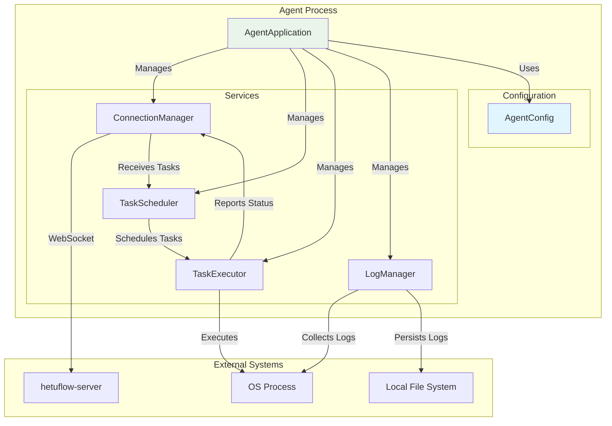
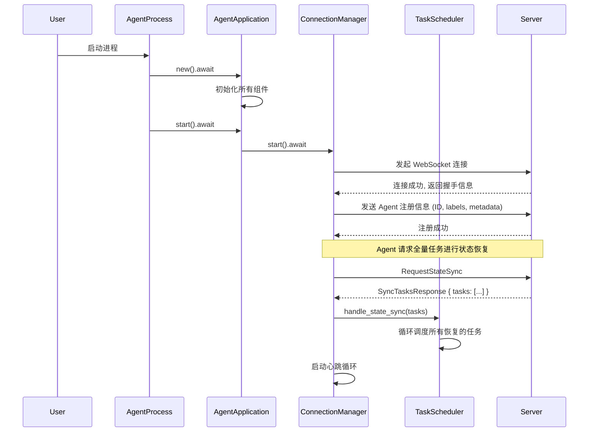
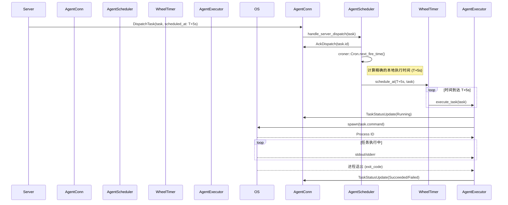

# `hetuflow-agent` 设计文档

## 1. 概述

`hetuflow-agent` (以下简称 Agent) 是 `hetuflow` 的分布式执行单元。它被设计为一个轻量级、高效、可靠的守护进程，负责接收来自 `hetuflow-server` (以下简称 Server) 的任务指令，在本地精确地执行这些任务，并实时上报任务的生命周期状态。

本文档详细描述了 Agent 的核心架构、组件设计、通信协议和关键实现策略。

### 1.1. 核心设计思想

- **两级调度 (Two-Level Scheduling)**: Server 进行“粗调度”，负责根据业务策略提前（如提前 5 秒）将任务分发给 Agent。Agent 进行“精调度”，利用本地高精度定时器（`hierarchical_hash_wheel_timer`）在预定的精确时间点触发任务，从而消除网络延迟对调度精度的影响。
- **状态驱动与可靠通信**: Agent 与 Server 之间通过 WebSocket 建立全双工持久连接。所有关键操作（如任务接收、状态变更）都伴随着明确的状态流转和 ACK 确认机制，确保任务在分布式环境下的“至少一次”或“恰好一次”执行。
- **自治与弹性**: Agent 被设计为无状态（相对于任务调度而言）。它不依赖本地文件系统来保存待处理的任务。在与 Server 断开连接后，它会持续尝试重连。一旦成功重启并重新连接，它将完全从 Server 端同步当前应由它处理的任务列表，从而快速恢复到正确的运行状态。这种设计简化了 Agent 的部署和维护，但对 Server 的可用性提出了更高要求。

### 1.2. 主要功能与特性

- **核心功能**:
  - 包含核心的 `TaskExecutor`（任务执行器）。
  - 通过 WebSocket 与 Server 建立持久连接。
  - 执行具体的任务并实时上报状态。
  - 管理本地任务的生命周期（启动、停止、监控、重启）。
  - 支持多种调度类型：定时任务、一次性任务、守护进程、流程任务。
- **核心特性**:
  - 基于 `hierarchical_hash_wheel_timer` 的高精度定时任务调度。
  - 支持任务并发控制和资源限制。
  - 提供任务执行日志收集和输出管理。
  - 实现 WebSocket 全双工通信与自动重连。
  - 支持任务的动态配置和热更新。
  - 网络穿透友好，支持部署在不同私有网络。

## 2. 核心架构

Agent 遵循 `ultimate-core` 的 `Application` 模式，将所有核心服务和组件统一管理，实现了清晰的依赖注入和生命周期控制。

### 2.1. 组件关系图



### 2.2. 核心组件说明

- **`AgentApplication`**: 应用容器，负责初始化所有组件、管理其生命周期，并处理应用的启动和优雅关闭。
- **`AgentConfig`**: 从 `app.toml` 加载的配置信息，为所有组件提供配置参数。
- **`ConnectionManager`**: 负责与 Server 的 WebSocket 连接，处理消息的收发、心跳维持、自动重连和消息路由。
- **`TaskScheduler`**: **任务调度核心**。包含两个主要组件：`ScheduleTaskRunner`（负责接收和调度任务）和 `PollTaskRunner`（负责轮询请求新任务）。通过 `ProcessManager` 的并发控制机制，确保任务执行不超过配置的最大并发数。所有调度信息均实时来自 Server，不维护任务的持久化状态。
- **`TaskExecutor`**: **任务执行核心**。负责管理任务的实际执行，包括创建子进程、监控运行状态、处理标准输出/错误，并将结果上报。TaskExecutor 从队列中获取调度的任务，通过 `ProcessManager` 控制任务的并发执行数。
- **`LogManager`**: 负责收集任务执行过程中产生的日志，并根据配置进行管理（如输出到控制台、写入文件）。

## 3. 配置文件 (`app.toml`)

Agent 的行为通过 `app.toml`（详细配置见: [/resources/app.toml](../../../fusion/hetuflow-agent/resources/app.toml)） 进行配置，并使用 `ultimate-core` 的 `ConfigRegistry` 机制加载。

## 4. 核心组件实现

以下是核心组件的关键数据结构和函数签名。

### 4.1. `AgentApplication` (应用容器)

`AgentApplication` 作为程序的入口，负责组装和启动所有服务。

```rust
use std::sync::Arc;
use fusion_core::{application::Application, configuration::ConfigRegistry, DataError};

// 从 app.toml 解析的配置结构体
#[derive(Debug, Clone, serde::Deserialize)]
pub struct AgentConfig {
  // ... 字段对应 /resources/app.toml 配置
}

/// Agent 应用容器
#[derive(Clone)]
pub struct AgentApplication {
  pub config: Arc<AgentConfig>,
  pub connection_manager: Arc<ConnectionManager>,
  pub task_scheduler: Arc<TaskScheduler>,
  pub task_executor: Arc<TaskExecutor>,
}

impl AgentApplication {
  /// 创建并初始化一个新的 Agent 应用实例
  pub async fn new() -> Result<Self, DataError> {
    // 1. 使用 ultimate-core ApplicationBuilder 构建基础应用
    let app = Application::builder().build().await?;

    // 2. 加载 AgentConfig
    let config = Arc::new(app.get_config::<AgentConfig>()?);

    // 3. 初始化核心服务
    // ...

    todo!()
  }

  /// 启动 Agent 的所有后台服务
  pub async fn start(&self) -> Result<(), DataError> {
    // 1. 启动 ConnectionManager，开始连接 Server
    // 2. 启动 TaskScheduler，加载持久化任务
    // 3. 启动 TaskExecutor 的资源监控
    todo!()
  }

  /// 优雅关闭 Agent
  pub async fn shutdown(&self) -> Result<(), DataError> {
    // 1. 通知 Server Agent 即将下线
    // 2. 停止接收新任务
    // 3. 等待正在执行的任务完成（或超时）
    todo!()
  }
}
```

### 4.2. `ConnectionManager` (连接管理器)

负责维护与 Server 的生命线。

```rust
// hetuflow-core/src/protocol.rs
use tokio::sync::mpsc;

/// 发往 Server 的消息
pub enum ToServerMessage {
  /// 心跳包
  Heartbeat,
  /// 任务状态更新
  TaskStatusUpdate(TaskStatus),
  /// 确认接收到任务
  AckDispatch { task_id: i64 },
  /// 请求全量任务状态同步
  RequestStateSync,
}

/// 从 Server 接收的消息
pub enum FromServerMessage {
  /// 分发新任务
  DispatchTask(SchedTask),
  /// 强制停止任务
  KillTask { task_id: i64 },
  /// 响应状态同步，一次性发送所有应由该 Agent 执行的任务
  SyncTasksResponse { tasks: Vec<SchedTask> },
}

pub struct ConnectionManager {
  // ...
}

impl ConnectionManager {
  /// 创建一个新的 ConnectionManager
  pub fn new(...) -> Self {
    todo!()
  }

  /// 启动管理器，包含连接、重连、心跳和消息监听循环
  pub async fn start(&self) -> Result<(), Error> {
    todo!()
  }

  /// 向 Server 发送一条消息
  pub async fn send_message(&self, message: ToServerMessage) -> Result<(), Error> {
    todo!()
  }
}
```

### 4.3. `TaskScheduler` (任务调度器)

负责任务调度的核心组件，包含两个主要的运行器：

```rust
use std::sync::Arc;
use tokio::sync::mpsc;
use kanal::{AsyncSender, AsyncReceiver};

/// 调度的任务结构
pub struct ScheduledTask {
  pub task: SchedTask,
  pub scheduled_at: i64,
}

/// 任务调度器主结构
pub struct TaskScheduler {
  setting: Arc<HetuflowAgentSetting>,
  process_manager: Arc<ProcessManager>,
  connection_manager: Arc<ConnectionManager>,
  scheduled_task_tx: AsyncSender<ScheduledTask>,
}

/// 调度任务运行器 - 负责接收和调度任务
struct ScheduleTaskRunner {
  setting: Arc<HetuflowAgentSetting>,
  shutdown_rx: ShutdownRecv,
  connection_manager: Arc<ConnectionManager>,
  scheduled_task_tx: AsyncSender<ScheduledTask>,
}

/// 轮询任务运行器 - 负责请求新任务
struct PollTaskRunner {
  setting: Arc<HetuflowAgentSetting>,
  shutdown_rx: ShutdownRecv,
  process_manager: Arc<ProcessManager>,
  connection_manager: Arc<ConnectionManager>,
}

impl TaskScheduler {
  /// 创建新的任务调度器
  pub fn new(
    setting: Arc<HetuflowAgentSetting>,
    process_manager: Arc<ProcessManager>,
    connection_manager: Arc<ConnectionManager>,
    scheduled_task_tx: AsyncSender<ScheduledTask>,
  ) -> Self {
    Self { setting, process_manager, connection_manager, scheduled_task_tx }
  }

  /// 启动调度器的两个运行器
  pub fn start(&self, shutdown_rx: ShutdownRecv) -> Result<Vec<JoinHandle<()>>, DataError> {
    // 启动调度任务运行器和轮询任务运行器
    // 返回两个 JoinHandle 用于生命周期管理
  }
}

impl PollTaskRunner {
  /// 轮询请求待执行任务循环
  async fn run_loop(&mut self) {
    // 定期检查可用容量并请求新任务
    // 通过 process_manager.available_capacity() 获取当前可用容量
    // 发送 AcquireTaskRequest 到 Server
  }
}
```

实现“精调度”的核心，确保任务在正确的时间被触发。

```rust
use std::sync::{Arc, RwLock};
use std::collections::HashMap;
use hierarchical_hash_wheel_timer::Timer;

/// 代表一个已被 Agent 接收并纳入本地调度的任务
pub struct ScheduledTask {
  pub task_id: i64,
  pub cron_expression: Option<String>,
  pub command: String,
  // ... 其他任务元数据
}

pub struct TaskScheduler {
  timer: Arc<Timer>,
  task_executor: Arc<TaskExecutor>,
  connection_manager: Arc<ConnectionManager>,
  // 内存中维护的待调度任务列表
  tasks: Arc<RwLock<HashMap<i64, ScheduledTask>>>,
}

impl TaskScheduler {
  /// 创建一个新的 TaskScheduler
  pub fn new(...) -> Self {
    todo!()
  }

  /// 启动调度器，并开始处理新任务
  pub async fn start(&self) -> Result<(), Error> {
    // 启动高精度时间轮 `timer.start()`
    todo!()
  }

  /// 处理从 Server 分发来的任务
  pub async fn handle_server_dispatch(&self, task: SchedTask) -> Result<(), Error> {
    // 1. 将 SchedTask 转换为 ScheduledTask
    // 2. 发送 ACK 给 Server
    // 3. 如果是 Cron 任务，使用 `croner::Cron` 解析表达式并计算下一次执行时间
    // 4. 使用 `self.timer.schedule_at` 将任务放入时间轮
    // 5. 将任务信息写入 `self.tasks`
    todo!()
  }
}
```

### 4.4. `TaskExecutor` (任务执行器)

负责任务的最终执行和监控。通过 `ProcessManager` 进行并发控制。

```rust
use std::sync::Arc;
use kanal::AsyncReceiver;

pub struct TaskExecutor {
  setting: Arc<HetuflowAgentSetting>,
  process_manager: Arc<ProcessManager>,
  connection_manager: Arc<ConnectionManager>,
  scheduled_task_rx: AsyncReceiver<ScheduledTask>,
}

impl TaskExecutor {
  /// 创建新的任务执行器
  pub fn new(
    setting: Arc<HetuflowAgentSetting>,
    process_manager: Arc<ProcessManager>,
    connection_manager: Arc<ConnectionManager>,
    scheduled_task_rx: AsyncReceiver<ScheduledTask>,
  ) -> Self {
    Self { setting, process_manager, connection_manager, scheduled_task_rx }
  }

  /// 启动任务执行器
  pub fn start(&self, shutdown_rx: ShutdownRecv) -> Result<Vec<JoinHandle<()>>, DataError> {
    // 启动任务执行循环
    // 从 scheduled_task_rx 接收任务并执行
  }

  /// 执行单个任务
  async fn execute_task(
    setting: Arc<HetuflowAgentSetting>,
    process_manager: Arc<ProcessManager>,
    connection_manager: Arc<ConnectionManager>,
    task: ScheduledTask,
  ) {
    // 1. 通过 ProcessManager 启动进程（自动进行并发控制）
    // 2. 上报任务状态变更
    // 3. 监控进程执行状态
  }
}
```

## 5. 核心流程时序图

### 5.1. Agent 启动与状态恢复



### 5.2. Cron 任务调度与执行


