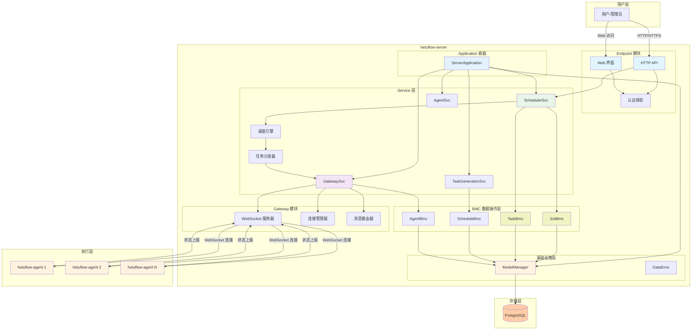
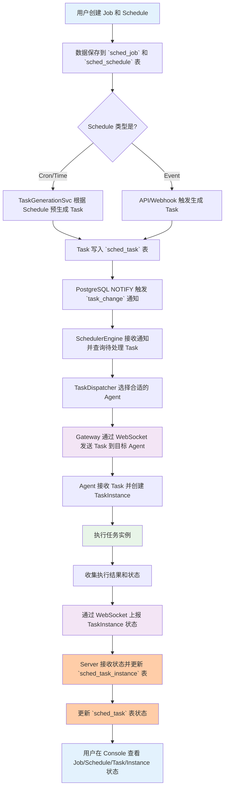
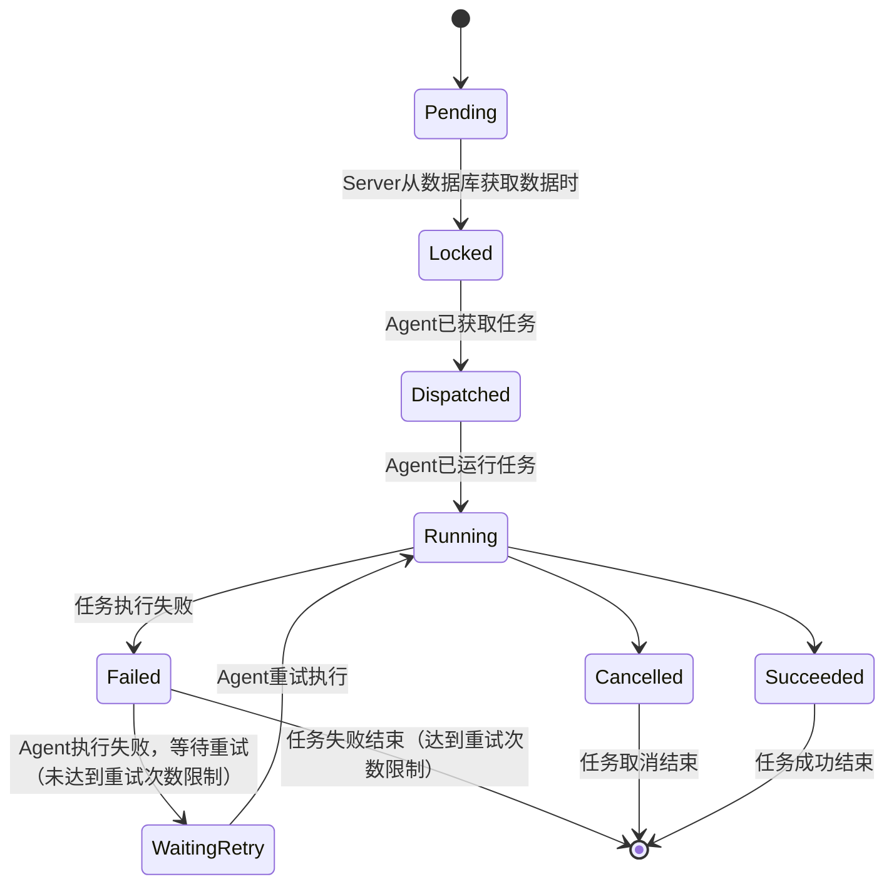
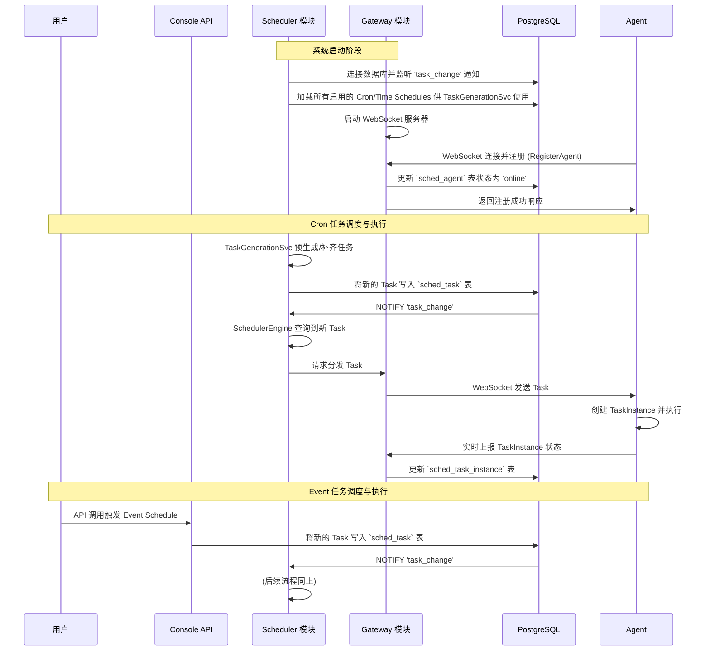

# hetuflow 宏观架构

## 概述

hetuflow 是一个现代化、高性能的分布式任务调度系统。该系统通过简化架构、提升通信效率和统一技术栈，实现了更好的性能和可维护性。hetuflow 由两个核心二进制程序构成：**hetuflow-server**（核心协调节点）和 **hetuflow-agent**（任务执行单元），通过 WebSocket 协议进行全双工通信，使用 PostgreSQL 作为唯一的数据存储。

### 主要模块

- [hetuflow-core](core/core.md)：共享核心库，负责 Agent 与 Server 之间的通信协议定义、任务调度模型（Job/Task/TaskInstance）、消息结构及共享数据类型，确保类型安全、版本兼容和依赖统一。
- [hetuflow-server](server/server.md)：服务端主程序，负责任务编排、分发、状态管理、权限控制、Web 管理界面和 API 服务，实现与 Agent 的 WebSocket 通信和数据库持久化。
- [hetuflow-agent](agent/agent.md)：任务执行单元，部署于各执行节点，负责接收 Server 下发的任务、执行并上报状态，支持任务重试、资源监控和能力声明。

### 主要技术

- 编程语言：Rust
- 数据库：PostgreSQL（简称：PG）
- 队列：使用 PG 数据表模拟实现

## 核心组件详解

### 1. hetuflow-server（核心协调节点）

详细的实现设计和代码示例请见：[hetuflow-server 实现文档](server/server.md)

### 2. hetuflow-agent（任务执行单元）

详细的实现设计和代码示例见： [hetuflow-agent 实现文档](agent/agent.md)

## 架构层次与依赖关系

### 核心设计原则

hetuflow 采用分层架构设计，遵循以下核心原则：

- **单一职责原则**：每个模块专注于特定的功能领域
- **依赖倒置原则**：Server 和 Agent 都依赖抽象的协议定义，而非相互依赖
- **开闭原则**：通过扩展 core 模块来添加新功能，无需修改现有实现

### 依赖层次结构

```
┌─────────────────────────────────────────────────────────┐
│                   应用层 (Applications)                  │
├─────────────────────┬───────────────────────────────────┤
│ hetuflow-   │    hetuflow-agent         │
│ server              │                                   │
│ ├── Application     │    ├── executor/                  │
│ ├── Services        │    ├── client/                    │
│ ├── Infrastructures │    └── monitor/                   │
│     └── BMC         │                                   │
│ ├── gateway/        │                                   │
│ └── scheduler/      │                                   │
├─────────────────────┼───────────────────────────────────┤
│                  基础设施层 (Infrastructure)              │
├─────────────────────┼───────────────────────────────────┤
│ ModelManager +      │    ultimate-core::Application     │
│ modelsql::DbBmc     │    ultimate-core::DataError       │
├─────────────────────┼───────────────────────────────────┤
│                   核心层 (Core)                          │
│            hetuflow-core                        │
│            ├── protocol/  # 通信协议定义                  │
│            ├── models/    # 共享数据模型                  │
│            └── types/     # 基础类型定义                  │
└─────────────────────────────────────────────────────────┘
```

### 模块职责重新定义

- **基础设施层 (Infrastructure)**：

  - **ultimate-core::Application**: 应用程序容器，管理服务依赖关系和生命周期
  - **modelsql::ModelManager**: 数据库连接池管理，提供数据库访问接口
  - **modelsql::base::DbBmc**: 数据库基础操作抽象，提供类型安全的 CRUD 接口
  - **ultimate_core::DataError**: 应用层错误处理，统一错误类型和转换机制

- **hetuflow-core**：

  - 定义所有 WebSocket 通信协议（WebSocketMessage、MessageType 等）
  - 定义任务调度模型（Job、Task、TaskInstance）
  - 提供共享的数据类型和枚举定义
  - 确保 Server 和 Agent 之间的协议一致性

- **hetuflow-server**：

  - **Application 层**: ServerApplication 容器管理所有服务和依赖
  - **Service 层**: SchedulerSvc、GatewaySvc 等业务服务
  - **BMC 层**: JobBmc、TaskBmc、AgentBmc 等数据库操作抽象
  - **Gateway/Scheduler 模块**: 协议处理、连接管理、任务调度等具体实现
  - 提供 Web API 和用户界面

- **hetuflow-agent**：
  - 实现协议消息的客户端处理
  - 执行具体的任务实例
  - 上报任务状态和系统指标

## 组件关系图



## 通信协议

hetuflow 使用 WebSocket 协议进行 Agent 与 Server 之间的通信。WebSocket 协议具有以下优势：

- **全双工通信**：支持 Server 主动推送任务和 Agent 主动拉取任务
- **网络穿透友好**：基于 HTTP/HTTPS，易于穿透防火墙和代理
- **统一端口**：减少网络配置复杂度
- **实时性强**：低延迟的消息传递

### 协议定义来源

所有通信协议定义统一在 `hetuflow-core` 模块中管理：

- **协议规范**：[core.md - 通信协议 (Protocol)](./core/core.md#通信协议-protocol)
- **消息格式**：WebSocketMessage 统一消息包装器
- **数据模型**：Job/Task/TaskInstance 三层任务模型
- **类型定义**：所有枚举类型和结构体定义

### 核心消息类型

通过 `hetuflow-core` 定义的核心消息类型包括：

- **Agent 生命周期**：AgentRegisterRequest/Response、HeartbeatRequest/Response
- **任务调度**：DispatchTaskRequest、TaskInstanceUpdate、TaskControl
- **文件传输**：FileUpload/Download、FileTransferStatus
- **错误处理**：Error、Ack 确认机制

### 使用方式

Server 和 Agent 都通过依赖 `hetuflow-core` 来获得一致的协议定义：

```toml
# Cargo.toml (Server 和 Agent 共同依赖)
[dependencies]
hetuflow-core = { workspace = true }
```

这确保了协议的版本一致性和类型安全。

## 数据库设计

hetuflow 采用基于 **modelsql** ORM 的分层数据模型设计，确保数据库访问的类型安全、错误处理的一致性和代码的可维护性。

### 核心数据模型

- **`SchedJob`**: 存储作业的静态定义（"做什么"），对应数据库表 `sched_job`
- **`Schedule`**: 存储作业的调度策略（"何时做"），对应数据库表 `sched_schedule`
- **`Task`**: 存储根据 `Schedule` 生成的、待执行的计划，对应数据库表 `sched_task`
- **`TaskInstance`**: 存储 `Task` 在 Agent 上的实际执行记录，对应数据库表 `sched_task_instance`

详细的数据模型实现、BMC 定义、Service 层代码示例、错误处理和数据库通知机制等，请参考：[hetuflow-server 实现文档](server/server.md)

## 任务调度流程图



### 任务状态图



## 系统启动与任务执行时序图



## 技术特性总结

### 1. 现代化架构特性

- **Application 容器模式**：使用 `ultimate-core::Application` 统一管理服务依赖和生命周期
- **ModelManager 数据管理**：使用 `modelsql::ModelManager` 统一管理数据库连接和操作
- **DbBmc 抽象层**：使用 `modelsql::base::DbBmc` 提供类型安全的数据库 CRUD 操作
- **分层错误处理**：`modelsql::SqlError →fusion_core::DataError` 的分层错误转换机制
- **组件整合**：将多个组件合并为核心的 Server 和 Agent，减少部署复杂度
- **通信统一**：使用 WebSocket 协议，提供全双工通信和网络穿透能力
- **存储统一**：使用 PostgreSQL 作为唯一存储，简化技术栈

### 2. 性能优化特性

- **WebSocket 全双工通信**：真正的双向实时通信机制
- **数据库通知**：基于 PostgreSQL LISTEN/NOTIFY 的实时队列处理
- **连接复用**：Agent 与服务器保持长连接，减少连接开销
- **批量处理**：支持任务的批量分发和状态更新
- **消息压缩**：启用 WebSocket 消息压缩减少网络传输
- **类型安全查询**：BMC 层提供编译时类型检查，避免运行时 SQL 错误

### 3. 可靠性特性

- **强一致性**：所有状态存储在 PostgreSQL 中，避免数据不一致
- **自动重连**：Agent 支持自动重连和故障恢复
- **任务重试**：支持任务执行失败的自动重试机制
- **事务保证**：利用 PostgreSQL 事务确保操作的原子性
- **统一错误处理**：分层错误处理机制确保错误的正确传播和处理
- **BMC 抽象保护**：数据库操作抽象层防止 SQL 注入和操作错误

### 4. 可扩展性特性

- **水平扩展**：支持多个 Agent 节点的动态添加
- **负载均衡**：智能的任务分发算法
- **命名空间隔离**：支持多租户环境
- **插件化设计**：模块化的内部架构便于功能扩展
- **依赖注入**：Application 容器模式便于服务替换和测试
- **过滤器扩展**：modelsql 过滤器系统支持复杂查询条件

### 5. 开发体验特性

- **类型安全**：全程类型安全的数据库操作，编译时发现错误
- **代码生成**：使用宏自动生成常用的 CRUD 操作代码
- **字段级更新**：支持字段掩码的部分更新操作
- **过滤器 DSL**：提供易用的查询过滤器 DSL
- **错误上下文**：详细的错误信息包含操作上下文和实体信息
- **事务支持**：简化的事务操作 API

## 总结

hetuflow 是一个现代化的分布式任务调度系统，采用了先进的软件架构模式，实现了以下核心特性：

1. **现代化架构设计**：采用 Application 容器模式 + ModelManager + DbBmc 的分层架构
2. **类型安全的数据访问**：全程类型安全的数据库操作，编译时错误检查
3. **统一的错误处理**：分层错误处理机制，从 SqlError 到 DataError 的统一转换
4. **简化的业务逻辑**：Service 层专注业务逻辑，BMC 层处理数据操作
5. **统一技术栈**：使用 PostgreSQL 作为唯一存储，WebSocket 作为通信协议
6. **提升性能**：WebSocket 全双工通信和数据库通知机制提供了更高的通信效率
7. **增强可靠性**：强一致性存储和事务保证确保了系统的可靠性
8. **网络适应性**：WebSocket 协议提供更好的网络穿透能力，支持跨网络部署
9. **优秀的开发体验**：代码生成、过滤器 DSL、字段级更新等特性

整个系统采用现代化的 Rust 生态和最佳实践，通过 `ultimate-core::Application` 实现依赖注入和生命周期管理，通过 `modelsql` 实现类型安全的数据库操作，通过 WebSocket 实现高效的全双工通信，是一个设计优良、性能卓越、类型安全、易于维护的现代化分布式任务调度系统。

### 核心技术优势

- **类型安全架构**：从数据库到业务层的全程类型安全保障
- **现代化依赖管理**：Application 容器模式提供清晰的依赖关系管理
- **抽象层保护**：BMC 层抽象隔离了直接的 SQL 操作，提高安全性和可维护性
- **统一错误处理**：分层错误处理确保错误信息的正确传播和处理
- **WebSocket 通信**：真正的双向实时通信，支持 Server 推送和 Agent 拉取
- **网络穿透友好**：基于 HTTP/HTTPS，易于穿透防火墙和代理
- **强一致性**：基于 PostgreSQL 的事务保证和强一致性存储
- **高可扩展性**：支持水平扩展和多租户环境
- **容错机制**：完善的重试策略和故障恢复机制
- **开发体验优秀**：自动代码生成、类型推导、编译时检查等现代 Rust 特性
