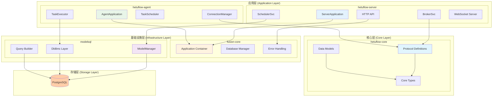
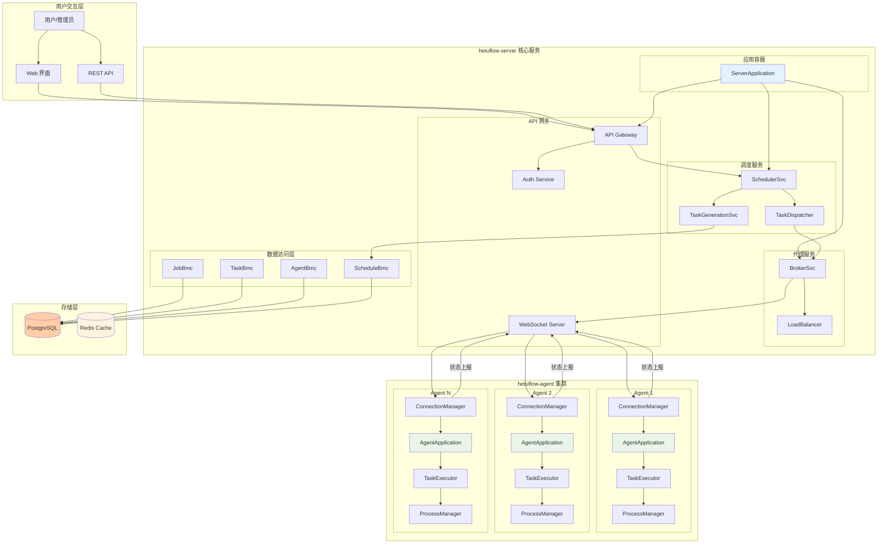
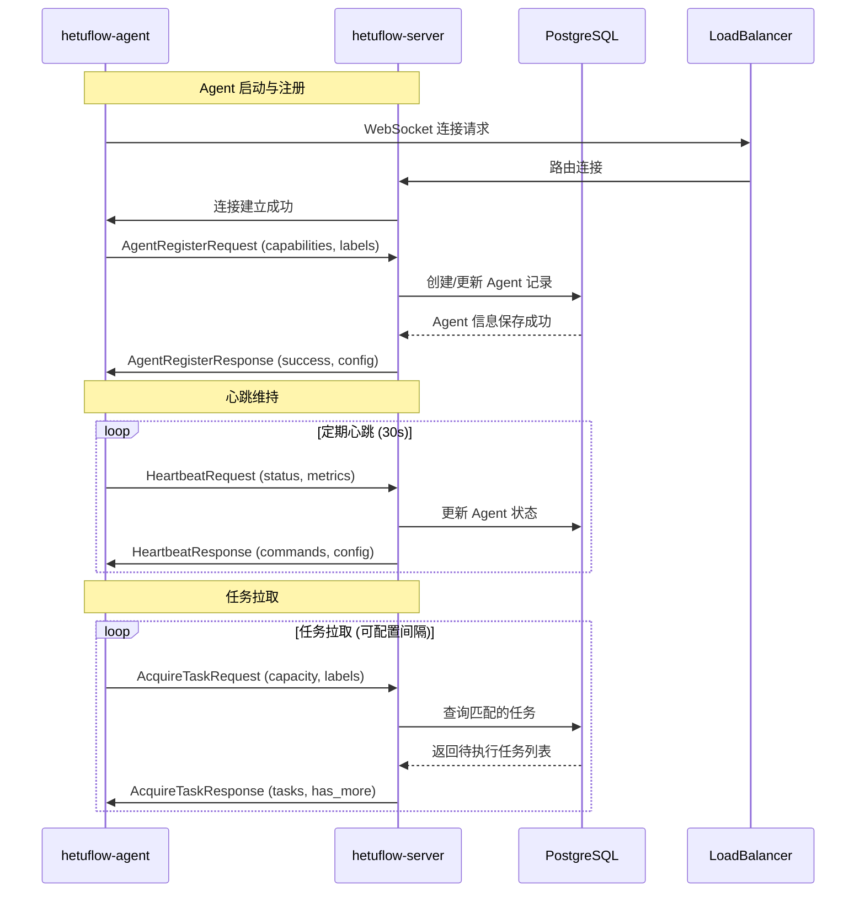
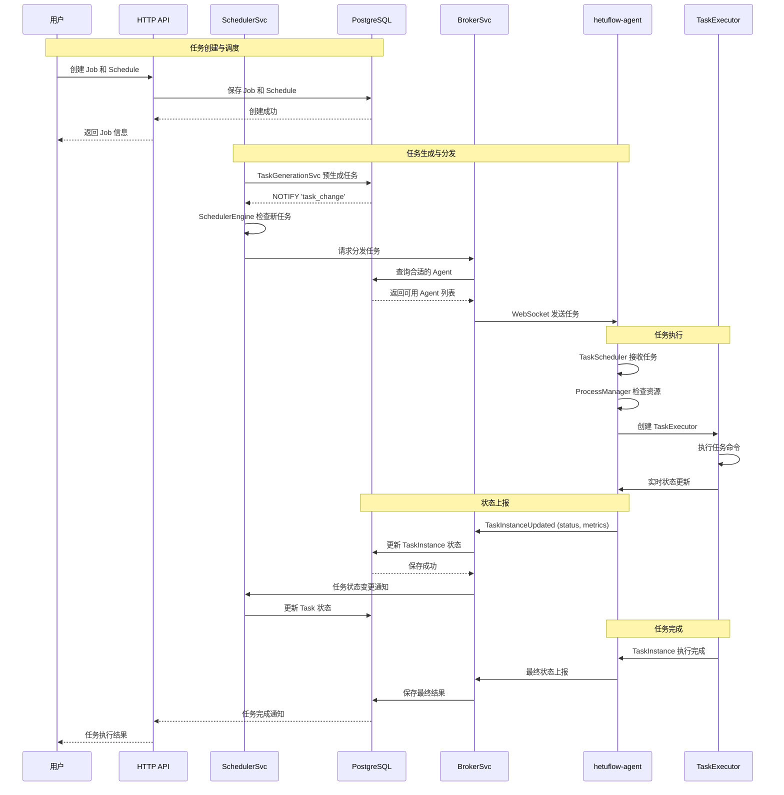
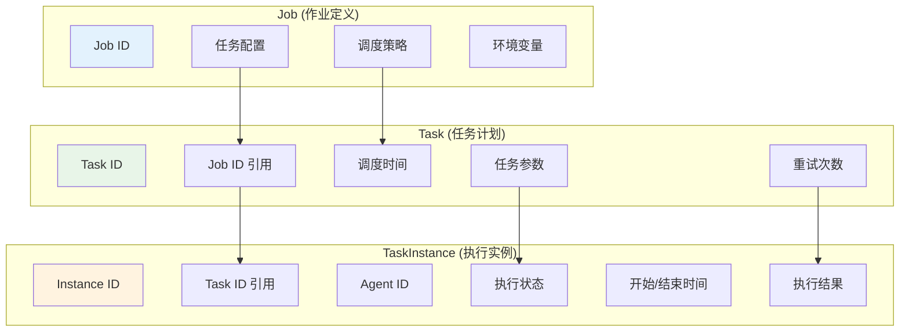
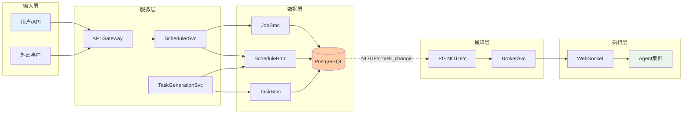
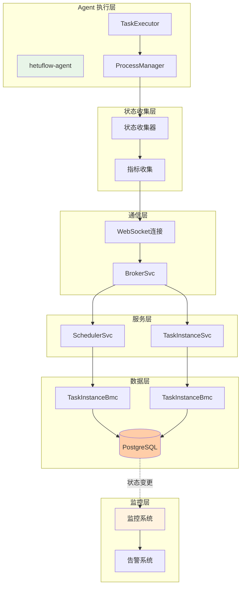
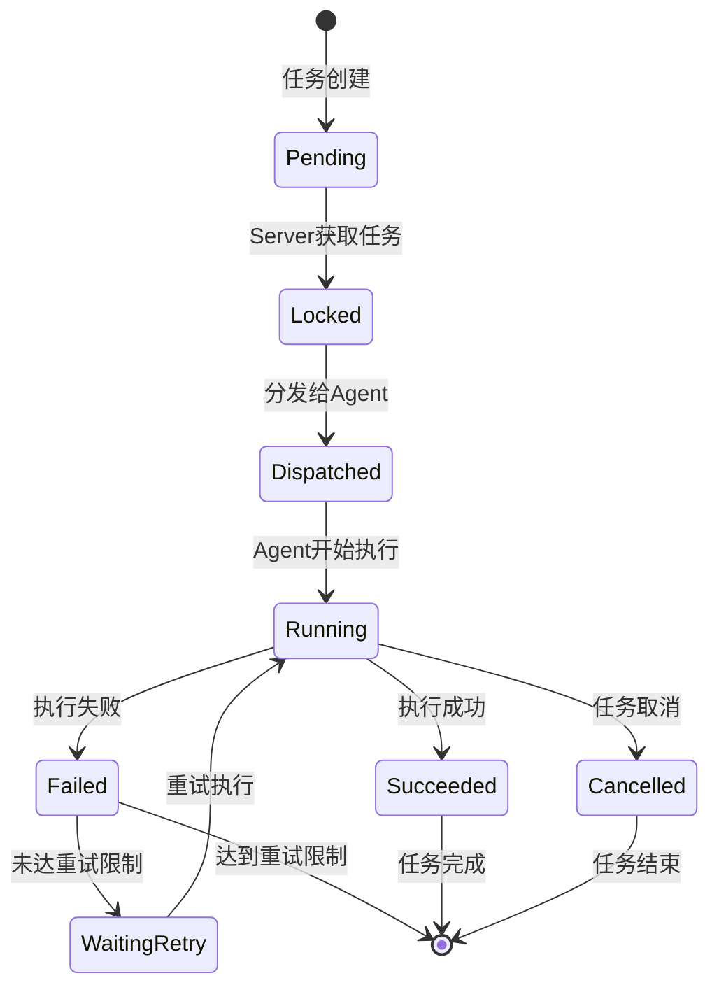
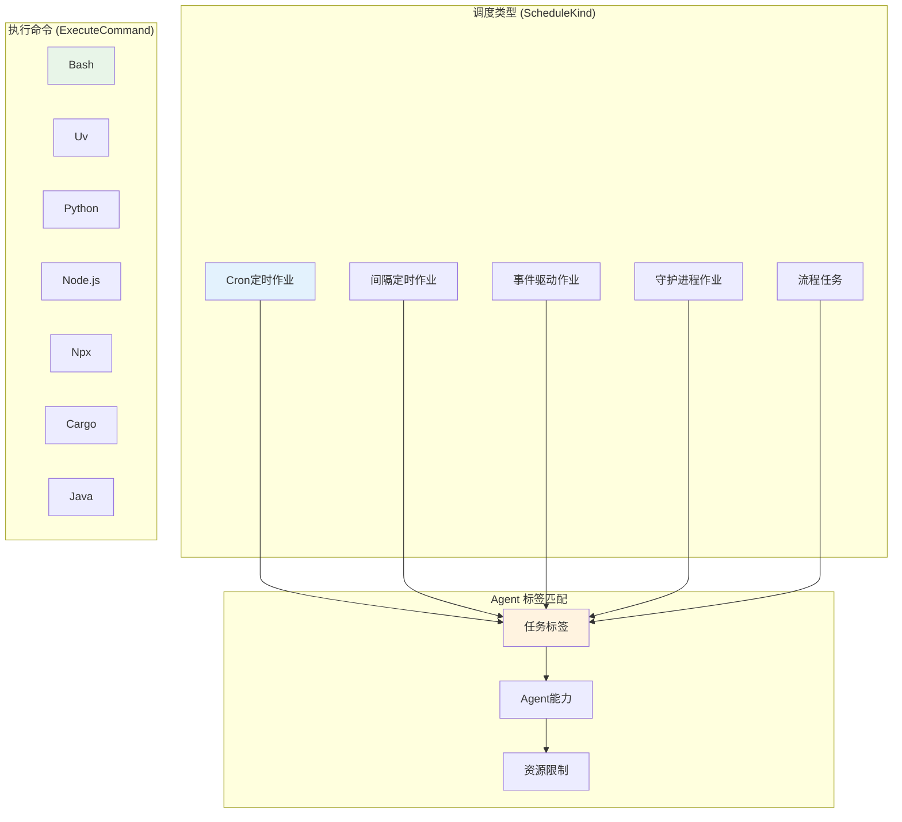

# hetuflow 架构设计文档

## 概述

hetuflow 是一个现代化、高性能的分布式任务调度系统。该系统通过 **WebSocket** 全双工通信、**PostgreSQL** 强一致性存储、**Rust** 类型安全保障，实现了高性能、高可靠性的任务调度能力。系统由两个核心二进制程序构成：**hetuflow-server**（核心协调节点）和 **hetuflow-agent**（任务执行单元）。

### 核心特性

- **WebSocket 全双工通信**：支持 Server 主动推送任务和 Agent 主动上报状态
- **类型安全保障**：全程类型安全的数据库操作和通信协议
- **强一致性存储**：基于 PostgreSQL 事务保证数据一致性
- **现代化架构**：Application 容器模式 + ModelManager + BMC 分层设计
- **网络穿透友好**：基于 HTTP/HTTPS，易于穿透防火墙和代理

## 系统架构概览

### 核心组件

- **hetuflow-core**: [`hetuflow-core/src/`](../../../hetuflow-core/src/) - 共享核心库，定义通信协议和数据模型
- **hetuflow-server**: [`hetuflow-server/src/`](../../../hetuflow-server/src/) - 核心协调节点，负责任务编排和分发
- **hetuflow-agent**: [`hetuflow-agent/src/`](../../../hetuflow-agent/src/) - 任务执行单元，负责具体任务执行

### 核心技术栈

- **编程语言**: Rust 2024 Edition
- **数据库**: PostgreSQL + pgvector 扩展
- **ORM**: modelsql (基于 sea-query + sqlx)
- **通信协议**: WebSocket (全双工)
- **异步运行时**: Tokio
- **序列化**: Serde JSON
- **Web 框架**: Axum
- **认证**: JWE (JSON Web Encryption)

## 详细组件设计

### 1. hetuflow-server（核心协调节点）

**核心职责**:
- 任务调度和分发管理
- Agent 连接和状态管理
- Web API 和管理界面
- 数据持久化和事务处理

**主要模块**:
- `application/`: 应用容器和依赖管理
- `scheduler/`: 任务调度引擎
- `broker/`: 任务分发和负载均衡
- `endpoint/`: HTTP API 端点
- `service/`: 业务逻辑服务层
- `infra/`: 基础设施层（BMC 数据库操作）

### 2. hetuflow-agent（任务执行单元）

**核心职责**:
- 接收并执行 Server 下发的任务
- 任务状态监控和上报
- 资源管理和进程控制
- 自动重连和故障恢复

**主要模块**:
- `application/`: 应用容器
- `connection/`: WebSocket 连接管理
- `executor/`: 任务执行器
- `process/`: 进程管理和资源控制
- `scheduler/`: 任务调度和命令处理

## 系统架构设计

### 分层架构设计

hetuflow 采用现代化的分层架构，遵循单一职责、依赖倒置和开闭原则：



### 模块职责定义

**应用层 (Application Layer)**:
- **hetuflow-server**: 负责任务调度、Agent管理、API服务
- **hetuflow-agent**: 负责任务执行、状态上报、资源管理

**基础设施层 (Infrastructure Layer)**:
- **fusion-core**: 提供 Application 容器、错误处理、配置管理等基础功能
- **modelsql**: 提供 ModelManager、DbBmc、Query Builder 等数据库抽象层

**核心层 (Core Layer)**:
- **hetuflow-core**: 定义通信协议、数据模型、类型规范的共享核心库

**存储层 (Storage Layer)**:
- **PostgreSQL**: 提供 ACID 事务保证的持久化存储

### 组件关系与交互



## 核心组件交互时序

### 1. Agent 注册与连接建立时序



### 2. 任务调度与执行时序



## 通信协议设计

### WebSocket 协议架构

hetuflow 使用 WebSocket 协议实现 Agent 与 Server 之间的全双工通信，具备以下优势：

- **全双工通信**：支持 Server 主动推送任务和 Agent 主动上报状态
- **网络穿透友好**：基于 HTTP/HTTPS，易于穿透防火墙和代理
- **连接复用**：长连接减少握手开销
- **实时性强**：低延迟的消息传递
- **自动重连**：Agent 支持断线重连和故障恢复

### 协议定义来源

所有通信协议定义统一在 [`hetuflow-core/src/protocol/`](../../../hetuflow-core/src/protocol/) 模块中管理：

- **消息格式**：[`event.rs`](../../../hetuflow-core/src/protocol/event.rs) 和 [`command.rs`](../../../hetuflow-core/src/protocol/command.rs)
- **数据模型**：[`models/`](../../../hetuflow-core/src/models/) 中的 Job/Task/TaskInstance 三层任务模型
- **类型定义**：[`types/mod.rs`](../../../hetuflow-core/src/types/mod.rs) 中的状态枚举和配置结构体

### 核心消息类型

基于最新代码实现，核心消息类型包括：

#### Agent -> Server 消息
- **AgentRegisterRequest**: Agent 注册请求 ([`protocol/agent.rs`](../../../hetuflow-core/src/protocol/agent.rs))
- **HeartbeatRequest**: 心跳请求 ([`protocol/heartbeat.rs`](../../../hetuflow-core/src/protocol/heartbeat.rs))
- **AcquireTaskRequest**: 任务拉取请求
- **TaskInstanceUpdated**: 任务实例状态更新

#### Server -> Agent 消息
- **AgentRegisterResponse**: Agent 注册响应
- **HeartbeatResponse**: 心跳响应
- **ScheduledTask**: 分发的任务
- **AgentCommand**: 服务器指令

### 核心消息类型

通过 `hetuflow-core` 定义的核心消息类型包括：

- **Agent 生命周期**：AgentRegisterRequest/Response、HeartbeatRequest
- **任务调度**：ScheduledTask、TaskInstanceUpdated、AcquireTaskRequest/Response
- **WebSocket 通信**：WebSocketEvent、WebSocketCommand
- **错误处理**：ErrorResponse、AckMessage 确认机制

### 使用方式

Server 和 Agent 都通过依赖 `hetuflow-core` 来获得一致的协议定义：

```toml
# Cargo.toml (Server 和 Agent 共同依赖)
[dependencies]
hetuflow-core = { workspace = true }
```

这确保了协议的版本一致性和类型安全。

## 数据模型设计

hetuflow 采用基于 **modelsql** ORM 的分层数据模型设计，确保数据库访问的类型安全、错误处理的一致性和代码的可维护性。

### 三层任务模型



### 核心数据实体

基于最新代码实现 ([`models/mod.rs`](../../../hetuflow-core/src/models/mod.rs))：

- **[`SchedJob`](../../../hetuflow-core/src/models/job.rs)**: 作业静态定义（"做什么"），表 `sched_job`
- **[`SchedTask`](../../../hetuflow-core/src/models/task.rs)**: 待执行的计划（"何时做"），表 `sched_task`
- **[`SchedTaskInstance`](../../../hetuflow-core/src/models/task_instance.rs)**: 实际执行记录，表 `sched_task_instance`
- **[`SchedAgent`](../../../hetuflow-core/src/models/agent.rs)**: Agent 节点信息，表 `sched_agent`

### 关键数据流走向

#### 1. 任务创建与调度数据流



#### 2. 任务执行与状态更新数据流



## 任务状态流转

### 任务状态机

基于最新代码实现 ([`types/mod.rs`](../../../hetuflow-core/src/types/mod.rs#78-93))：



### Agent 能力与标签匹配

基于 [`types/mod.rs`](../../../hetuflow-core/src/types/mod.rs#14-41) 的实现，支持多种任务类型：



## 现代化技术特性

### 1. 架构设计优势

基于最新的代码实现，hetuflow 具备以下现代化架构特性：

- **Application 容器模式**: 使用 [`fusion-core::Application`](../../../crates/libs/fusion-core/src/) 统一管理服务依赖和生命周期
- **类型安全 ORM**: 基于 [`modelsql`](../../../crates/libs/modelsql/) 的全程类型安全数据库操作
- **分层错误处理**: `modelsql::SqlError → fusion_core::DataError` 的分层错误转换机制
- **WebSocket 全双工通信**: 支持服务器推送和 Agent 上报的双向实时通信
- **强一致性存储**: 基于 PostgreSQL 事务保证的 ACID 特性

### 2. 性能优化特性

- **连接复用**: Agent 与 Server 保持长连接，减少握手开销
- **数据库通知**: 基于 PostgreSQL LISTEN/NOTIFY 的实时任务通知机制
- **批量处理**: 支持任务的批量分发和状态更新
- **资源限制**: 支持内存、CPU、执行时间等资源限制 ([`types/mod.rs#ResourceLimits`](../../../hetuflow-core/src/types/mod.rs#218-240))
- **智能调度**: 基于标签匹配和负载均衡的任务分发算法

### 3. 可靠性保障

- **自动重连**: Agent 支持断线重连和故障恢复
- **任务重试**: 支持可配置的重试策略和退避算法
- **状态持久化**: 所有状态信息持久化到 PostgreSQL，避免数据丢失
- **事务保证**: 利用数据库事务确保操作的原子性和一致性
- **监控告警**: 完整的任务执行监控和错误告警机制

### 4. 开发体验优化

- **代码生成**: 使用 [`modelsql::Fields`](../../../crates/libs/modelsql/) 宏自动生成 CRUD 操作
- **字段级更新**: 支持字段掩码的部分更新操作，减少数据传输
- **过滤器 DSL**: 提供类型安全的查询过滤器系统
- **编译时检查**: 全程类型安全，编译时发现错误
- **文档完整**: 完整的 API 文档和代码示例

## 系统总结

hetuflow 是一个基于 Rust 2024 Edition 构建的现代化分布式任务调度系统，通过 WebSocket 全双工通信、PostgreSQL 强一致性存储、modelsql 类型安全 ORM 等现代技术栈，实现了高性能、高可靠性的任务调度能力。

### 核心价值主张

1. **类型安全保障**: 从数据库操作到通信协议的全程类型安全
2. **现代化架构**: Application 容器 + BMC 分层 + WebSocket 通信的统一架构
3. **高性能通信**: WebSocket 全双工通信 + PostgreSQL 实时通知
4. **强一致性存储**: 基于 PostgreSQL ACID 事务的数据一致性保证
5. **网络友好**: 基于 HTTP/HTTPS 的 WebSocket，易于穿透防火墙
6. **开发体验**: 代码生成、编译时检查、完整文档的现代化开发体验

### 技术架构亮点

- **统一的协议定义**: 通过 `hetuflow-core` 确保通信协议的一致性和类型安全
- **三层任务模型**: Job → Task → TaskInstance 的清晰业务模型
- **智能任务分发**: 基于标签匹配和负载均衡的智能调度算法
- **完整的监控体系**: 从任务创建到执行完成的全链路监控
- **灵活的扩展能力**: 支持多种调度类型和执行命令的插件化设计

hetuflow 特别适合需要 **高可靠性**、**强一致性**、**类型安全** 的分布式任务调度场景，是企业级任务调度系统的理想选择。
