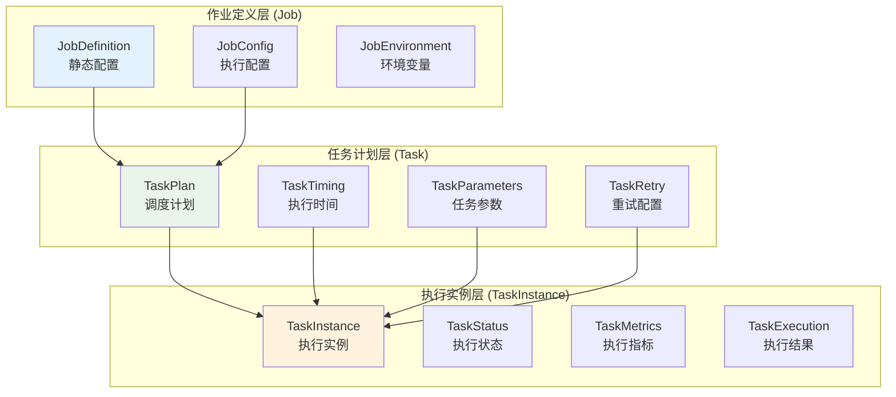
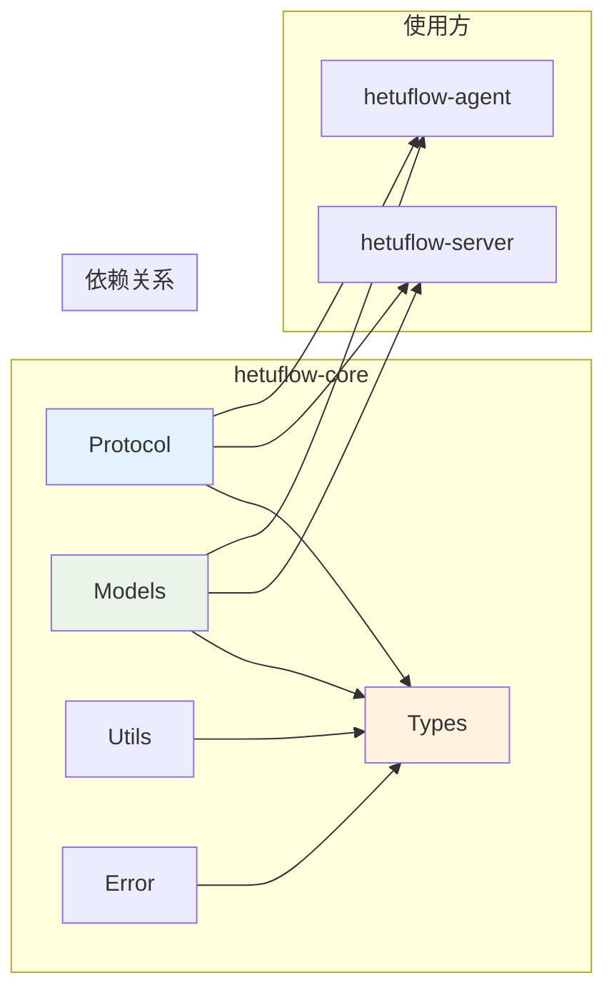

# hetuflow 核心共享库设计

## 概述

[`hetuflow-core`](../../../hetuflow-core/src/) 是 hetuflow 分布式任务调度系统的共享核心库。作为系统的基础设施层，它定义了 Agent 与 Server 之间的通信协议、数据模型和类型规范，确保整个系统的一致性和类型安全。

### 核心职责

- **协议定义**：定义 Agent 与 Server 之间的完整通信协议
- **类型安全**：提供强类型的消息格式和数据结构，确保编译时类型检查
- **版本兼容**：管理协议版本演进，确保向后兼容性
- **数据模型**：定义系统核心业务实体的统一数据模型
- **序列化标准**：规范消息的序列化和反序列化格式

### 模块结构

```
hetuflow-core/
├── lib.rs                 # 库入口，导出所有公共模块
├── error.rs              # 错误类型定义
├── protocol/             # 通信协议定义
│   ├── mod.rs            # 协议模块入口
│   ├── agent.rs          # Agent 相关协议
│   ├── command.rs        # Server 到 Agent 的命令
│   ├── event.rs          # Agent 到 Server 的事件
│   ├── heartbeat.rs      # 心跳协议
│   ├── log.rs            # 日志协议
│   ├── process.rs        # 进程控制协议
│   └── task.rs           # 任务相关协议
├── models/               # 共享数据模型
│   ├── mod.rs            # 模型模块入口
│   ├── _db.rs            # 数据库特性支持
│   ├── job.rs            # Job 数据模型
│   ├── task.rs           # Task 数据模型
│   ├── task_instance.rs  # TaskInstance 数据模型
│   ├── schedule.rs       # Schedule 数据模型
│   ├── agent.rs          # Agent 数据模型
│   ├── server.rs         # Server 数据模型
│   └── file.rs           # 文件处理模型
├── types/                # 基础类型定义
│   ├── mod.rs            # 类型模块入口
│   ├── cli.rs            # CLI 相关类型
│   └── label.rs          # 标签系统
└── utils/                # 工具函数
    ├── mod.rs            # 工具模块入口
    ├── config.rs         # 配置相关
    └── defaults.rs       # 默认值
```

## 核心数据模型

基于最新代码实现 ([`models/mod.rs`](../../../hetuflow-core/src/models/mod.rs))，hetuflow 采用三层任务模型：

### 1. 三层任务模型架构



### 2. 核心实体定义

基于 [`models/`](../../../hetuflow-core/src/models/) 的实现：

- **[`SchedJob`](../../../hetuflow-core/src/models/job.rs)**: 作业静态定义

  - 存储作业的"做什么"（命令、参数、环境）
  - 包含任务配置（超时、重试、资源限制）
  - 对应数据库表：`sched_job`

- **[`SchedTask`](../../../hetuflow-core/src/models/task.rs)**: 任务执行计划

  - 存储根据调度策略生成的具体执行计划
  - 包含调度时间、参数、优先级等信息
  - 对应数据库表：`sched_task`

- **[`SchedTaskInstance`](../../../hetuflow-core/src/models/task_instance.rs)**: 任务执行实例

  - 记录任务在 Agent 上的实际执行情况
  - 包含执行状态、结果、指标等详细信息
  - 对应数据库表：`sched_task_instance`

- **[`SchedAgent`](../../../hetuflow-core/src/models/agent.rs)**: Agent 节点信息
  - 记录 Agent 的状态、能力、标签等信息
  - 对应数据库表：`sched_agent`

### 3. 类型安全的数据访问

基于 `fusionsql` 框架，为每个核心实体提供：

- **数据模型**: 使用 `#[derive(fusionsql::Fields)]` 自动生成 CRUD 操作
- **查询过滤**: 使用 `#[derive(fusionsql::FilterNodes)]` 生成类型安全的查询过滤器
- **数据库集成**: 支持 `sqlx::FromRow` 和 OpenAPI 集成

示例代码见：[`models/job.rs`](../../../hetuflow-core/src/models/job.rs#14-28)

## 通信协议 (Protocol)

### 协议架构设计

hetuflow 的通信协议定义了 Agent 与 Server 之间的数据交换格式。该协议基于三层任务模型：[`Job`](../../../hetuflow-core/src/models/job.rs) → [`Task`](../../../hetuflow-core/src/models/task.rs) → [`TaskInstance`](../../../hetuflow-core/src/models/task_instance.rs)。

- **`Job` (作业)**: 作业的静态定义，包含调度策略、执行命令和配置
- **`Task` (任务)**: 根据调度策略生成的具体执行计划
- **`TaskInstance` (任务实例)**: Task 在 Agent 上的实际执行记录

### WebSocket 协议实现

基于 [`protocol/mod.rs`](../../../hetuflow-core/src/protocol/mod.rs) 的实现，hetuflow 使用 WebSocket 协议进行全双工通信：

#### 核心消息类型

**Agent → Server 消息**:

- **[`AgentRegisterRequest`](../../../hetuflow-core/src/protocol/agent.rs)**: Agent 注册请求
- **[`HeartbeatRequest`](../../../hetuflow-core/src/protocol/heartbeat.rs)**: 心跳请求
- **[`AcquireTaskRequest`](../../../hetuflow-core/src/protocol/task.rs)**: 任务拉取请求
- **[`TaskInstanceUpdated`](../../../hetuflow-core/src/protocol/task.rs)**: 任务状态更新

**Server → Agent 消息**:

- **[`AgentRegisterResponse`](../../../hetuflow-core/src/protocol/agent.rs)**: 注册响应
- **[`HeartbeatResponse`](../../../hetuflow-core/src/protocol/heartbeat.rs)**: 心跳响应
- **[`ScheduledTask`](../../../hetuflow-core/src/protocol/task.rs)**: 分发的任务
- **[`AgentCommand`](../../../hetuflow-core/src/protocol/command.rs)**: 服务器指令

### 状态枚举定义

基于 [`types/mod.rs`](../../../hetuflow-core/src/types/mod.rs) 的实现，系统定义了完整的状态枚举：

```rust
// 调度类型 - 支持多种调度策略
pub enum ScheduleKind {
  Cron = 1,        // Cron 定时作业
  Interval = 2,    // 间隔定时作业
  Daemon = 3,      // 守护进程作业
  Event = 4,       // 事件驱动作业
  Flow = 5,        // 流程任务
}

// 任务状态 - 完整的状态机
pub enum TaskStatus {
  Pending = 1,     // 等待分发
  Doing = 10,      // 进行中
  Failed = 90,     // 错误
  Cancelled = 99,  // 取消完成
  Succeeded = 100, // 成功完成
}

// 任务实例状态 - 详细的执行状态
pub enum TaskInstanceStatus {
  Pending = 1,     // 等待执行
  Dispatched = 5,  // 已分发
  Running = 10,    // 执行中
  Timeout = 20,    // 执行超时
  Failed = 90,     // 执行失败
  Succeeded = 100, // 执行成功
}
```

### 任务配置系统

基于 [`types/mod.rs`](../../../hetuflow-core/src/types/mod.rs#46-68) 的任务配置：

```rust
pub struct TaskConfig {
  pub timeout: u32,                    // 超时时间(秒)
  pub max_retries: u32,                // 最大重试次数
  pub retry_interval: u32,             // 重试间隔(秒)
  pub cmd: ExecuteCommand,             // 执行命令
  pub args: Vec<String>,               // 命令参数
  pub capture_output: bool,            // 是否捕获输出
  pub max_output_size: u64,            // 最大输出大小
  pub labels: Option<Labels>,          // 任务标签
  pub resource_limits: Option<ResourceLimits>, // 资源限制
}
```

### 执行命令支持

系统支持多种执行命令类型 ([`types/mod.rs#14-44`](../../../hetuflow-core/src/types/mod.rs#14-44))：

- **Bash**: Shell 脚本执行
- **Uv**: Python 包管理器
- **Python**: Python 解释器
- **Node/JavaScript**: Node.js 运行时
- **Npx**: Node.js 包执行器
- **Cargo**: Rust 构建工具
- **Java**: Java 运行时

### 资源限制

支持细粒度的资源限制 ([`types/mod.rs#218-240`](../../../hetuflow-core/src/types/mod.rs#218-240))：

```rust
pub struct ResourceLimits {
  pub max_memory_mb: Option<u64>,        // 最大内存使用量 (MB)
  pub max_cpu_percent: Option<f64>,     // 最大CPU使用率 (0.0-1.0)
  pub max_execution_time_secs: Option<u64>, // 最大执行时间 (秒)
  pub max_output_size_bytes: Option<u64>, // 最大输出大小 (字节)
}
```

## 架构优势与设计理念

### 统一协议保障

hetuflow-core 作为整个系统的协议基础，提供了以下关键保障：

- **类型安全**: 所有协议消息都是强类型的 Rust 结构体，编译时即可发现错误
- **版本一致**: Server 和 Agent 使用相同的协议定义，避免兼容性问题
- **易于扩展**: 新增消息类型只需在 core 中定义，无需修改多个模块
- **测试友好**: 协议层可以独立进行单元测试和集成测试

### 现代化技术栈

基于最新代码实现，hetuflow-core 采用了现代化的技术栈：

- **Rust 2024 Edition**: 使用最新的 Rust 语言特性
- **Serde JSON**: 高效的序列化/反序列化
- **UUID v7**: 时间有序的唯一标识符生成
- **Chrono**: 强类型的日期时间处理
- **fusionsql 集成**: 与数据库 ORM 的无缝集成
- **OpenAPI 支持**: 自动生成 API 文档

### 模块化设计



## 核心技术优势

### 1. 协议一致性保障

- **单一数据源**: 所有通信协议和数据模型定义集中在 core 中
- **类型安全**: 编译时确保消息格式的正确性，减少运行时错误
- **版本管理**: 支持协议的渐进式演进和向后兼容

### 2. 开发效率提升

- **代码复用**: 协议定义在 Server 和 Agent 之间完全复用
- **接口一致**: 统一的数据结构减少了理解和维护成本
- **工具支持**: 自动化的序列化、反序列化和验证

### 3. 架构扩展性

- **插件化设计**: 模块化的内部架构便于功能扩展
- **配置驱动**: 支持运行时配置更新和行为调整
- **标签系统**: 灵活的任务标签和 Agent 能力匹配机制

## 总结

[`hetuflow-core`](../../../hetuflow-core/src/) 作为 hetuflow 分布式任务调度系统的基石，通过统一的协议定义和数据模型，为整个系统提供了：

### 核心价值

1. **稳定的通信基础**: 定义了完整的 WebSocket 通信协议规范
2. **一致的数据模型**: Job/Task/TaskInstance 三层模型确保了业务逻辑的清晰性
3. **良好的扩展性**: 模块化设计支持协议的渐进式演进
4. **强类型保障**: Rust 类型系统确保了编译时的正确性检查

### 技术优势

- **类型安全架构**: 从协议定义到数据模型的全程类型安全保障
- **现代化依赖管理**: 清晰的模块依赖关系和版本管理
- **高性能通信**: 基于 WebSocket 的全双工通信机制
- **丰富的特性支持**: 多种调度类型、执行命令和资源限制

### 适用场景

hetuflow-core 特别适合构建需要 **高可靠性**、**强一致性**、**类型安全** 的分布式任务调度系统，是企业级任务调度基础设施的理想选择。
