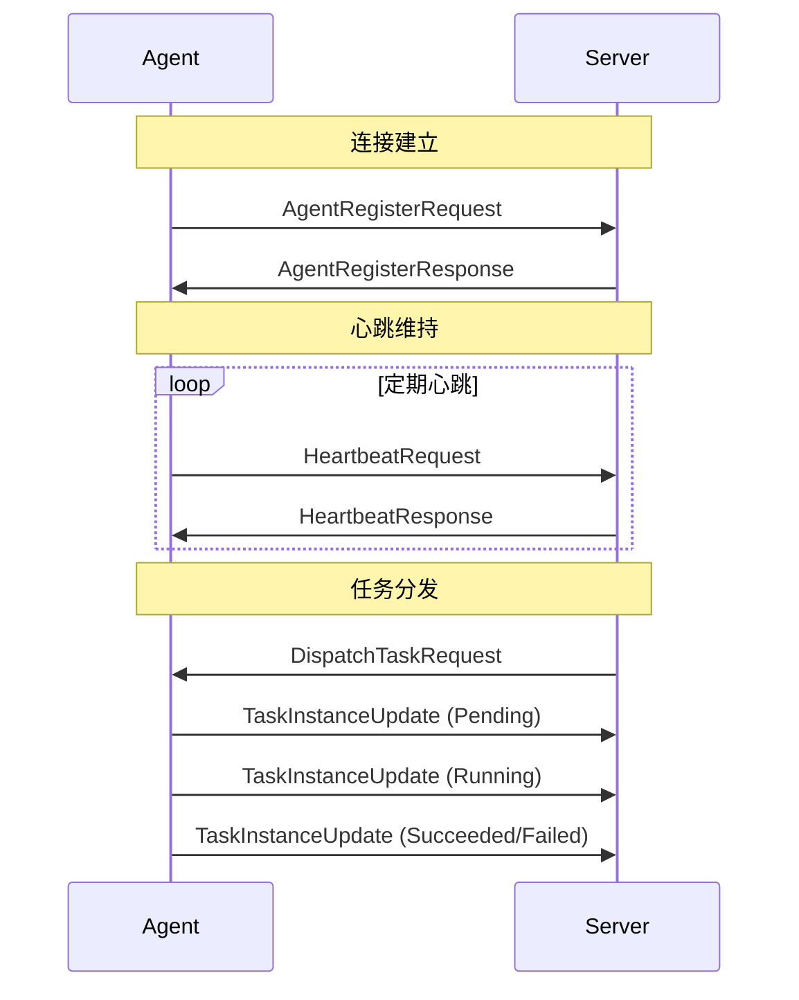

# hetuflow 核心共享库设计

## 概述

`hetuflow-core` 是 hetuflow 分布式任务调度系统的共享核心库。作为系统的基础设施层，它定义了 Agent 与 Server 之间的通信协议、数据模型和类型规范，确保整个系统的一致性和类型安全。

本模块遵循依赖倒置原则，为上层的 Server 和 Agent 应用提供稳定的抽象接口，使得协议扩展和维护更加便捷。

### 命名规范

- **`protocol`**: 通信协议定义模块，包含 WebSocket 消息格式、类型枚举和序列化规范。
  - Server 到 Agent 的消息指令以 `Command` 结尾
  - Agent 到 Server 的消息结果、响应以 `Event` 结尾
  - Agent 到 Server 的消息请求以 `Request` 结尾
  - Server 到 Agent 的消息响应以 `Response` 结尾
- **`models`**: 共享数据模型模块，定义核心业务实体（如 Job、Task、TaskInstance 等）和数据库实体。
- **`types`**: 基础类型定义模块，包含状态枚举、配置结构体和公共数据类型。

## 核心模块概览

- `protocol`: 通信协议定义 - WebSocket 消息格式、类型枚举和序列化规范
- `models`: 共享数据模型 - Job、Task、TaskInstance 等核心业务实体定义，数据库实体定义、实体模型访问层对象
- `types`: 基础类型定义 - 状态枚举、配置结构体和公共数据类型

### 核心数据模型

- **`SchedJob`**: 存储作业的静态定义（"做什么"），对应数据库表 `sched_job`
- **`SchedSchedule`**: 存储作业的调度策略（"何时做"），对应数据库表 `sched_schedule`
- **`SchedTask`**: 存储根据 `SchedSchedule` 生成的、待执行的计划，对应数据库表 `sched_task`
- **`SchedTaskInstance`**: 存储 `SchedTask` 在 Agent 上的实际执行记录，对应数据库表 `sched_task_instance`
- **`SchedAgent`**: 存储 Agent 节点的信息，对应数据库表 `sched_agent`
- **`SchedServer`**: 存储 Server 节点的信息，对应数据库表 `sched_server`

基于 `modelsql` 框架，为每个核心实体实现完整的数据模型（`XxxEntity`）和 `DbBmc` trait：

详细定义见代码: [](../../../fusion/hetuflow-core/src/models/)

注意：不使用 sqlx 的数据迁移功能，人工管理 ddl SQL 脚本和数据库迁移。

### SQL 表结构

详细的 SQL 表结构见: [hetuflow-ddl.sql](../../../scripts/software/postgres/sqls/hetuflow-ddl.sql)

## 通信协议 (Protocol)

hetuflow 的通信协议定义了 Agent 与 Server 之间的数据交换格式。该协议基于一个核心的三层任务模型：`Job` -> `Task` -> `TaskInstance`。

- **`Job` (作业)**: 作业的静态**定义**，由用户创建，包含调度策略（如 Cron）、执行命令和配置。它描述了“什么”和“何时”执行。
- **`Task` (任务)**: 根据 `Job` 的调度策略生成的、一次具体的、待执行的**计划**。它是一个“任务蓝图”，代表一个将被执行的工作单元。
- **`TaskInstance` (任务实例)**: `Task` 在 Agent 上的实际**执行记录**。一个 `Task` 如果重试，会产生多个 `TaskInstance`。

### 核心职责

- **协议定义**：定义 Agent 与 Server 之间的完整通信协议
- **类型安全**：提供强类型的消息格式和数据结构，确保编译时类型检查
- **版本兼容**：管理协议版本演进，确保向后兼容性
- **数据模型**：定义系统核心业务实体的统一数据模型
- **序列化标准**：规范消息的序列化和反序列化格式

### WebSocket 消息架构

Agent 与 Server 之间使用 WebSocket 进行通信，可以支持如下特性：

1. 全双工通信：Server 可以自动向 Agent 下发指令；Agent 可以主动向 Server 上报任务进度和要测数据，也可以主动向 Server 拉取任务请求
2. 网络穿透：agent 支持部署到不同的私有网络，只要能连接上任何一个 Server 即可（比如将 Server 部署在一个公共网络中，同时管理不同私网的 Agents）

```rust
/// WebSocket 事件统一包装器，Agent -> Server
#[derive(Debug, Clone, Serialize, Deserialize)]
pub struct WebSocketEvent {
  /// 消息唯一标识
  pub event_id: Uuid,
  /// 发送时间
  pub timestamp: i64,
  /// 消息类型
  pub kind: EventKind,
  /// 消息载荷
  pub payload: serde_json::Value,
  /// 扩展元数据
  pub metadata: HashMap<String, String>,
}

/// 服务器下发的指令。 Server -> Agent
#[derive(Serialize, Deserialize, Debug, Clone)]
pub struct WebSocketCommand {
  /// 指令ID，全局唯一
  id: Uuid,
  /// 发送时间
  timestamp: i64,
  /// 指令类型
  pub kind: CommandKind,
  /// 指令参数
  pub parameters: serde_json::Value,
  /// 指令超时时间
  pub timeout: Option<u32>,
  /// 指令优先级
  pub priority: Option<u8>,
}

/// WebSocket 消息类型枚举
#[derive(Serialize_repr, Deserialize_repr, Debug, Clone, Copy, PartialEq, Eq)]
#[repr(i32)]
pub enum EventKind {
  /// 确认消息
  Ack = 1,
  /// 未确认消息
  Nack = 2,
  /// Agent 注册
  AgentRegister = 3,
  /// Agent 心跳
  AgentHeartbeat = 4,
  /// Agent 请求 AgentRequest <-> GatewayResponse
  PollTaskRequest = 5,
  /// Agent 事件 AgentEvent
  TaskChangedEvent = 6,
}

/// 从 Server 发向 Agent 的命令类型
#[derive(Serialize_repr, Deserialize_repr, Debug, Clone, Copy, PartialEq, Eq)]
#[repr(i32)]
pub enum CommandKind {
  Shutdown = 1,        // 关闭指令
  UpdateConfig = 2,    // 更新配置
  ClearCache = 3,      // 清理缓存
  FetchMetrics = 4,    // 更新指标
  AgentRegistered = 5, // Agent 注册成功
  DispatchTask = 6,    // 分发任务
  CancelTask = 7,      // 取消任务
}
```

### Agent 注册与管理

```rust
/// Agent 注册请求。Agent 连接上 Server 后发送的第一个请求，用于描述当前 Agent 的能力和元数据
#[derive(Serialize, Deserialize, Debug, Clone)]
pub struct AgentRegisterRequest {
  /// Agent 唯一标识
  pub agent_id: AgentId,
  /// Agent 能力描述
  pub capabilities: AgentCapabilities,
  /// Agent 地址
  pub address: String,
}

/// Agent 注册响应
#[derive(Serialize, Deserialize, Debug, Clone)]
pub struct AgentRegisterResponse {
  /// 注册是否成功
  pub success: bool,
  /// 响应消息
  pub message: String,
  /// Agent 配置
  pub agent: Option<SchedAgent>,
  /// 服务器时间
  pub server_time: i64,
}

/// Agent 能力描述
#[derive(Serialize, Deserialize, Debug, Clone, Default)]
pub struct AgentCapabilities {
  /// 最大并发任务数
  pub max_concurrent_tasks: u32,
  /// 支持的特性列表
  pub features: Vec<String>,
  /// Agent 标签，用于筛选任务。比如某些需要特定资源的任务只能在匹配标签的 Agent 上运行
  pub labels: Labels,
  /// 扩展元数据 (cpu, memory, etc.)
  pub metadata: HashMap<String, String>,
}
```

### 心跳与状态同步

```rust
/// 心跳请求
#[derive(Serialize, Deserialize, Debug, Clone)]
pub struct HeartbeatRequest {
  /// Agent ID
  pub agent_id: AgentId,
  /// 心跳时间戳
  pub timestamp: i64,
  /// Agent 状态
  pub status: AgentStatus,
  /// 运行中的任务状态信息
  pub running_tasks: Vec<TaskStatusInfo>,
  /// Agent 性能指标
  pub metrics: AgentMetrics,
  /// 最后处理的任务ID
  pub last_task_id: Option<String>,
}

/// 心跳响应
#[derive(Serialize, Deserialize, Debug, Clone)]
pub struct HeartbeatResponse {
  /// 响应状态
  pub success: bool,
  /// 服务器时间
  pub server_time: i64,
  /// 服务器指令
  pub commands: Vec<ServerCommand>,
  /// 配置更新
  pub config_updates: Option<AgentConfig>,
}

// Agent 性能指标
#[derive(Serialize, Deserialize, Debug, Clone)]
pub struct AgentMetrics {
  pub cpu_usage: f64,                      // CPU 使用率
  pub memory_usage: f64,                   // 内存使用率
  pub disk_usage: f64,                     // 磁盘使用率
  pub active_tasks: u32,                   // 活跃任务数
  pub total_executed: u64,                 // 累计执行任务数
  pub success_rate: f64,                   // 成功率
  pub avg_execution_time: f64,             // 平均执行时间
  pub uptime: u64,                         // 运行时间
}

// 服务器下发的指令
#[derive(Serialize, Deserialize, Debug, Clone)]
pub struct AgentCommand {
  pub command_id: String,                  // 指令ID
  pub command_type: AgentCommandKind,      // 指令类型
  pub parameters: HashMap<String, JsonValue>, // 指令参数
  pub timeout: Option<u32>,                // 指令超时时间
  pub priority: u8,                        // 指令优先级
}
```

### 任务调度消息

```rust
// 任务分发请求
#[derive(Debug, Clone, Serialize, Deserialize)]
pub struct ScheduledTask {
  pub task_instance: SchedTaskInstance,
  pub task: SchedTask,
}

// 任务配置
#[derive(Serialize, Deserialize, Debug, Clone, Default)]
pub struct TaskConfig {
  /// 超时时间(秒)
  pub timeout: u32,
  /// 最大重试次数
  pub max_retries: u32,
  /// 重试间隔(秒)
  pub retry_interval: u32,
  /// 命令。如： python, uv/uvx, npx, node, bash, sh, cargo, rustc 等
  pub cmd: String,
  /// 命令参数
  pub args: Vec<String>,
  /// 工作目录，不设置则使用默认值
  pub working_directory: Option<String>,
  /// 是否捕获输出
  pub capture_output: bool,
  /// 最大输出大小(字节)
  pub max_output_size: u64,
  /// 任务标签。可用于限制哪些 Agent 允许执行该任务
  pub labels: Labels,
  /// 资源限制
  pub resource_limits: Option<ResourceLimits>,
}

// 任务实例状态更新
#[derive(Debug, Clone, Serialize, Deserialize)]
pub struct TaskInstanceUpdated {
  /// 任务实例 ID
  pub instance_id: Uuid,
  /// Agent ID
  pub agent_id: AgentId,
  /// 执行状态
  pub status: TaskInstanceStatus,
  /// 状态更新时间
  pub timestamp: i64,
  /// 任务数据
  pub data: Option<String>,
  /// 错误信息
  pub error_message: Option<String>,
  /// 执行指标
  pub metrics: Option<TaskMetrics>,
}

/// Task pull request
#[derive(Serialize, Deserialize, Debug, Clone)]
pub struct AcquireTaskRequest {
  pub agent_id: AgentId,     // Agent ID
  pub max_tasks: u32,     // 允许最大并发任务数
  pub labels: Labels,  // 当前 Agent 拥有的标签，用于过滤任务
  pub acquire_count: u32, // 拉取任务数
}

/// Task response, for task pull requests or direct task assignments from Server to Agent
#[derive(Serialize, Deserialize, Debug, Clone)]
pub struct AcquireTaskResponse {
  pub tasks: Vec<ScheduledTask>, // 可执行任务列表
  pub has_more: bool,            // 是否还有更多任务
  pub next_poll_interval: u32,   // 下次拉取间隔(秒)
}

// 任务执行指标
#[derive(Serialize, Deserialize, Debug, Clone)]
pub struct TaskMetrics {
  pub start_time: i64,                     // 开始时间
  pub end_time: Option<i64>,               // 结束时间
  pub cpu_time: f64,                       // CPU 时间
  pub memory_peak: u64,                    // 内存峰值
  pub disk_read: u64,                      // 磁盘读取量
  pub disk_write: u64,                     // 磁盘写入量
  pub network_in: u64,                     // 网络接收量
  pub network_out: u64,                    // 网络发送量
}
```

### 枚举定义

```rust
// 作业类型 (ScheduleKind) - 定义了 Job 的核心调度和行为模式
#[derive(Serialize_repr, Deserialize_repr, Debug, Clone, Copy, PartialEq, Eq, AsRefStr)]
#[cfg_attr(feature = "with-db", derive(sqlx::Type))]
#[repr(i32)]
pub enum ScheduleKind {
  /// Cron 定时作业
  Cron = 1,
  /// 间隔定时作业。可以通过设置最大执行次数为 1 次来表达 Once 执行，可以通过设置 start_time 来设置定时执行时间
  Interval = 2,
  /// 守护进程作业
  Daemon = 3,
  /// 事件驱动作业
  Event = 4,
  /// 流程任务
  Flow = 5,
}

// 任务状态
#[derive(Serialize_repr, Deserialize_repr, Debug, Clone, Copy, PartialEq, Eq)]
#[cfg_attr(feature = "with-db", derive(sqlx::Type))]
#[repr(i32)]
pub enum TaskInstanceStatus {
  /// 已创建
  Created = 1,
  /// 等待执行
  Pending = 10,
  /// 正在执行
  Running = 20,
  /// 已暂停
  Paused = 30,
  /// 已跳过
  Skipped = 40,
  /// 执行失败
  Failed = 90,
  /// 已取消
  Cancelled = 99,
  /// 执行成功
  Succeeded = 100,
}

// Agent 状态
#[derive(Serialize_repr, Deserialize_repr, Debug, Clone, Copy, PartialEq, Eq)]
#[cfg_attr(feature = "with-db", derive(sqlx::Type))]
#[repr(i32)]
pub enum AgentStatus {
  Idle = 10,          // 空闲
  Busy = 20,          // 忙碌
  Connecting = 30,    // 连接中
  Disconnecting = 31, // 断开连接中
  Offline = 90,       // 离线
  Error = 99,         // 错误状态
  Online = 100,       // 在线
}

// Agent 指令类型
#[derive(Serialize_repr, Deserialize_repr, Debug, Clone, Copy, PartialEq)]
#[cfg_attr(feature = "with-db", derive(sqlx::Type))]
#[repr(i32)]
pub enum AgentCommandKind {
  Shutdown = 1,                            // 关闭指令
  Restart = 2,                             // 重启指令
  UpdateConfig = 3,                        // 更新配置
  ClearCache = 4,                          // 清理缓存
  ReloadTasks = 5,                         // 重新加载任务
  HealthCheck = 6,                         // 健康检查
}

// 任务控制类型
#[derive(Serialize_repr, Deserialize_repr, Debug, Clone, Copy, PartialEq, Eq)]
#[cfg_attr(feature = "with-db", derive(sqlx::Type))]
#[repr(i32)]
pub enum TaskControlKind {
  Stop = 1,    // 停止任务
  Pause = 2,   // 暂停任务
  Resume = 3,  // 恢复任务
  Restart = 4, // 重启任务
  Skip = 5,    // 跳过任务
  Kill = 9,    // 强制终止任务
}

#[cfg(feature = "with-db")]
modelsql::generate_enum_i32_to_sea_query_value!(
  Enum: ScheduleKind,
  Enum: TaskStatus,
  Enum: TaskInstanceStatus,
  Enum: AgentStatus,
  Enum: AgentCommandKind,
  Enum: TaskControlKind,
);


// WebSocket 错误类型
#[derive(Debug, Clone, thiserror::Error)]
pub enum WebSocketError {
  #[error("连接错误: {0}")]
  ConnectionError(String),
  #[error("消息错误: {0}")]
  MessageError(String),
  #[error("序列化错误: {0}")]
  SerializationError(String),
  #[error("认证错误: {0}")]
  AuthenticationError(String),
  #[error("超时错误")]
  TimeoutError,
  #[error("未知错误: {0}")]
  UnknownError(String),
}

/// 错误响应
#[derive(Serialize, Deserialize, Debug, Clone)]
pub struct ErrorResponse {
  /// 错误码
  pub err_code: i32,
  /// 错误消息
  pub err_msg: String,
  /// 详细信息
  pub details: Option<serde_json::Value>,
  /// 时间戳
  pub timestamp: Option<i64>,
}

/// 确认消息
#[derive(Serialize, Deserialize, Debug, Clone)]
pub struct AckMessage {
  /// 原始消息ID
  pub message_id: Uuid,
  /// 处理状态
  pub status: String,
  /// 详细信息
  pub details: Option<String>,
}
```

## 协议使用示例

### 基本消息交换流程



## 技术特点

### 1. WebSocket 通信架构

- **全双工通信**：真正的双向实时通信
- **网络穿透友好**：基于 HTTP/HTTPS，易于穿透防火墙和代理
- **连接复用**：单一持久连接减少握手开销
- **消息可靠性**：自定义确认机制保证消息送达
- **自动重连**：连接断开后自动重连，提高系统可用性

### 2. 异步架构

- **基于 Tokio**：高性能异步运行时
- **非阻塞 I/O**：提升系统并发能力
- **协程调度**：轻量级任务调度

### 3. 分布式设计

- **水平扩展**：支持多实例部署
- **状态共享**：通过 Redis 共享状态
- **故障转移**：自动故障检测和恢复

### 4. 安全认证

- **WSS 加密**：基于 TLS 的 WebSocket Secure 加密通信
- **Token 认证**：JWT Token 或 API Key 身份验证
- **权限控制**：细粒度的权限管理和访问控制
- **密钥管理**：安全的密钥存储和轮换
- **连接验证**：连接建立时的身份验证和授权检查

### 5. 容错机制

- **重试策略**：智能重试和退避算法
- **超时控制**：防止任务无限期执行
- **资源限制**：防止资源耗尽

### 6. 灵活调度

- **多种调度策略**：支持不同的调度需求
- **动态配置**：运行时配置更新
- **依赖管理**：任务间依赖关系处理

## 性能优化策略

### 1. WebSocket 连接优化

- **连接复用**：长期保持 WebSocket 连接减少握手开销
- **连接池管理**：智能管理 Agent 连接池
- **负载均衡**：基于 Agent 负载状态智能分发任务
- **断线重连**：自动重连机制保证连接稳定性
- **消息压缩**：启用 WebSocket 消息压缩减少网络传输

### 2. 数据库优化

- **连接池配置**：优化 PostgreSQL 连接池参数
- **查询优化**：使用合适的索引和查询策略
- **批量操作**：批量插入和更新减少数据库压力

### 3. 缓存策略

- **Redis 缓存**：缓存热点数据减少数据库访问
- **本地缓存**：使用内存缓存提升响应速度
- **缓存失效**：合理的缓存失效策略

## 架构优势

作为 hetuflow 的共享核心库，`hetuflow-core` 提供了以下架构优势：

### 1. 依赖统一性

- **单一数据源**：所有通信协议和数据模型定义集中在 core 中
- **版本一致性**：Server 和 Agent 使用相同版本的协议定义，避免兼容性问题
- **类型安全**：编译时确保消息格式的正确性，减少运行时错误

### 2. 可维护性

- **单一职责**：core 专注于协议和数据模型定义，Server/Agent 专注于业务逻辑
- **松耦合设计**：应用层依赖抽象协议，而非具体实现
- **易于扩展**：新增消息类型或数据字段只需修改 core，无需同步修改多个模块

### 3. 开发效率

- **代码复用**：协议定义在 Server 和 Agent 之间完全复用
- **接口一致**：统一的数据结构减少了理解和维护成本
- **测试友好**：协议层可以独立进行单元测试

### 4. 技术特性

- **WebSocket 协议**：基于现代化的 WebSocket 实现真正的双向实时通信
- **类型安全**：使用 Rust 的强类型系统确保协议的正确性
- **序列化优化**：基于 Serde 的高效 JSON 序列化
- **版本管理**：支持协议的渐进式演进和向后兼容

## 总结

`hetuflow-core` 作为分布式任务调度系统的基石，通过统一的协议定义和数据模型，为整个系统提供了：

1. **稳定的通信基础**：定义了完整的 WebSocket 通信协议规范
2. **一致的数据模型**：Job/Task/TaskInstance 三层模型确保了业务逻辑的清晰性
3. **良好的扩展性**：模块化设计支持协议的渐进式演进
4. **强类型保障**：Rust 类型系统确保了编译时的正确性检查

这种分层架构设计遵循了现代软件工程的最佳实践，为 hetuflow 提供了坚实的技术基础，特别适合构建大规模、高可靠的分布式任务调度系统。
