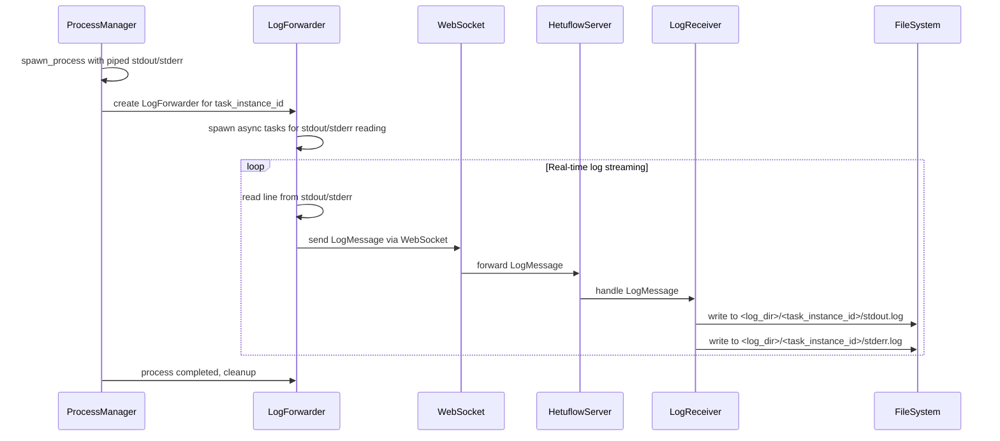

#### 任务进程日志收集功能技术方案

**需求概述：**
当通过 ProcessManager.spawn_process 函数创建进程时，需要实现以下日志收集机制：

1. 将进程的标准输出(stdout)和标准错误(stderr)实时转发至 Server
2. Server 端按照 SchedTaskInstance.id 创建独立的日志目录结构
3. 日志目录路径中的<配置目录>应支持通过配置文件进行设置

**架构设计：**



**核心组件设计：**

1. **Agent 端 - LogForwarder 组件**

   - 位置：`hetuflow-agent/src/service/log_forwarder.rs`
   - 职责：捕获进程 stdout/stderr，实时转发至 Server
   - 关键特性：
     - 异步非阻塞读取
     - 按行缓冲，避免日志截断
     - 支持大日志量的背压控制
     - 进程结束时确保所有日志已转发

2. **协议扩展 - LogMessage**

   - 位置：`hetuflow-core/src/protocol/log.rs`
   - 结构：
     ```rust
     #[derive(Debug, Clone, Serialize, Deserialize)]
     pub struct LogMessage {
       pub task_instance_id: Uuid,
       pub log_type: LogType, // Stdout | Stderr
       pub content: String,
       pub timestamp: OffsetDateTime,
       pub sequence: u64, // 确保日志顺序
     }
     ```

3. **Server 端 - LogReceiver 组件**
   - 位置：`hetuflow-server/src/service/log_receiver.rs`
   - 职责：接收 Agent 转发的日志，写入文件系统
   - 目录结构：`<log_base_dir>/<task_instance_id>/stdout.log`
   - 特性：
     - 异步文件写入
     - 目录自动创建
     - 日志轮转支持
     - 并发写入安全

**配置扩展：**

1. **Agent 端配置** (`hetuflow-agent/src/setting.rs`):

   ```rust
   #[derive(Serialize, Deserialize, Debug, Clone)]
   pub struct ProcessConfig {
     // ... 现有字段 ...
     /// 启用日志转发
     pub enable_log_forwarding: bool,
     /// 日志缓冲区大小
     pub log_buffer_size: usize,
     /// 日志转发批次大小
     pub log_batch_size: usize,
   }
   ```

2. **Server 端配置** (`hetuflow-server/src/setting.rs`):

   ```rust
   #[derive(Debug, Clone, Serialize, Deserialize)]
   pub struct HetuflowServerSetting {
     // ... 现有字段 ...
     /// 任务日志存储配置
     pub task_logs: Option<TaskLogConfig>,
   }

   #[derive(Debug, Clone, Serialize, Deserialize)]
   pub struct TaskLogConfig {
     /// 日志基础目录
     pub base_dir: String,
     /// 单个日志文件最大大小
     pub max_file_size: u64,
     /// 日志保留天数
     pub retention_days: u32,
   }
   ```

**实现步骤：**

1. **第一阶段：基础架构**

   - 扩展 ProcessConfig 和 HetuflowServerSetting 配置
   - 定义 LogMessage 协议结构
   - 修改 ProcessManager.spawn_process，支持 stdout/stderr 捕获

2. **第二阶段：日志转发**

   - 实现 LogForwarder 组件
   - 集成 WebSocket 日志消息发送
   - 实现 Server 端 LogReceiver 组件

3. **第三阶段：优化与监控**
   - 添加日志转发性能监控
   - 实现日志文件轮转
   - 添加错误处理和重试机制

**技术考虑：**

- **性能**：使用 tokio::io::BufReader 按行读取，避免频繁系统调用
- **可靠性**：实现日志序列号机制，确保日志不丢失不重复
- **背压控制**：当网络拥塞时，实现本地缓冲和流控
- **资源管理**：及时清理已完成任务的日志转发器
- **错误处理**：网络断开时缓存日志，重连后补发

**日志顺序保证机制：**

当前方案通过以下机制确保日志行的严格有序性：

1. **序列号机制**：
   - 每个 `LogMessage` 包含 `sequence: u64` 字段
   - Agent 端为每个 task_instance_id 维护独立的序列号计数器
   - stdout 和 stderr 使用不同的序列号空间，避免混淆

2. **单线程读取**：
   - 每个进程的 stdout/stderr 分别由单独的异步任务按行顺序读取
   - 使用 `tokio::io::BufReader::read_line()` 确保按行边界读取
   - 读取后立即分配序列号，保证时序正确性

3. **Server 端有序写入**：
   - LogReceiver 按 sequence 字段对接收到的日志消息进行排序
   - 使用滑动窗口机制处理乱序到达的消息
   - 实现超时机制，避免因丢失消息导致的无限等待

4. **具体实现策略**：
   ```rust
   // Agent 端序列号生成
   struct LogForwarder {
     task_instance_id: Uuid,
     stdout_sequence: AtomicU64,
     stderr_sequence: AtomicU64,
   }
   
   // Server 端有序写入缓冲区
   struct LogBuffer {
     expected_sequence: u64,
     pending_messages: BTreeMap<u64, LogMessage>,
     max_window_size: usize,
     timeout_duration: Duration,
   }
   ```

5. **异常处理**：
   - **网络重传**：重连后补发缓存的日志，序列号保持连续
   - **消息丢失**：超时后记录警告，跳过丢失的序列号继续处理
   - **重复消息**：通过序列号去重，避免重复写入

6. **性能优化**：
   - 批量发送：将连续的日志行打包发送，减少网络开销
   - 异步写入：Server 端使用异步文件写入，避免阻塞
   - 内存控制：限制缓冲区大小，防止内存溢出

通过以上机制，可以确保即使在网络抖动、消息乱序的情况下，最终写入文件的日志仍然保持严格的行序顺序，不会出现第20行日志写到第15行或第30行的情况。
