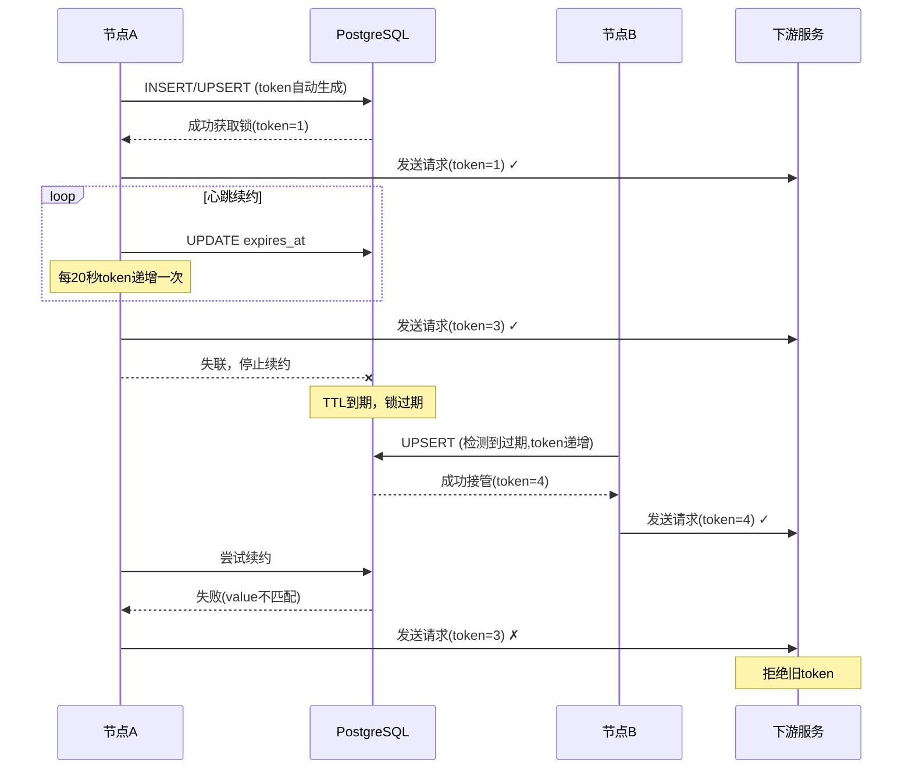

# 基于 PostgreSQL 的分布式锁设计

## 1. 背景与目标

在分布式系统中，多个节点竞争同一任务的执行权时，需要一种**可续约、可接管、可防止旧主干扰**的锁机制。

**设计目标**：

- 支持高频心跳（1-10 秒），快速检测锁失效
- 避免 token 每次心跳都递增，减少下游校验压力
- 通过围栏令牌（fencing token）防止旧主在失效后继续操作
- 保证强一致性和故障恢复时的安全性

---

## 2. 表结构设计

```sql
create table if not exists distributed_lock (
  id varchar(255) primary key, -- 锁标识
  value varchar(255) not null, -- 锁的值（可用于表示锁的持有者，比如使用：节点ID）
  locked_at timestamptz not null default now(), -- 锁获取时间
  expires_at timestamptz not null default now() + interval '60 seconds', -- 锁过期时间
  token bigserial, -- 独立序列
  constraint chk_distributed_lock_expires_at check (expires_at >= locked_at) -- 过期时间必须大于锁的时间
);
```

**字段说明**：

- `id`: 锁的唯一标识符
- `value`: 锁持有者标识，用于区分不同节点
- `locked_at`: 锁获取或 token 递增的时间戳
- `expires_at`: 锁的过期时间，用于 TTL 控制
- `token`: 围栏令牌，防止旧主干扰的关键机制

---

## 3. 核心实现机制

### 3.1 高频心跳 + 低频 token 递增

**参数配置示例**：

- TTL = 60 秒（锁有效期）
- token 递增周期 = 20 秒（两次 token 增加的最小间隔）
- 心跳频率 = 10 秒

### 3.2 核心 SQL 实现

```sql
insert into distributed_lock (id, value, locked_at, expires_at)
values ('sched_server_leader', 'sched-server-1', now(), now() + interval '60 seconds')
on conflict (id) do update
set value      = excluded.value,
    expires_at = excluded.expires_at,
    -- token递增条件：锁过期、节点变更、或超过递增周期
    token      = case
                   when distributed_lock.expires_at < now()
                        or distributed_lock.value <> excluded.value
                        or now() - distributed_lock.locked_at > interval '20 seconds'
                   then distributed_lock.token + 1
                   else distributed_lock.token
                 end,
    -- token变化时更新locked_at
    locked_at  = case
                   when distributed_lock.expires_at < now()
                        or distributed_lock.value <> excluded.value
                        or now() - distributed_lock.locked_at > interval '20 seconds'
                   then now()
                   else distributed_lock.locked_at
                 end
where distributed_lock.expires_at < now()
   or distributed_lock.value = excluded.value
returning *;
```

**注意**：INSERT 时不指定 token 字段，由 bigserial 序列自动生成，确保新记录的 token 值大于表中现有的 token 值。

**执行逻辑**：

1. **首次获取**：插入新记录，token 由 bigserial 序列自动生成
2. **正常续约**：仅更新 expires_at，token 不变
3. **定期递增**：超过递增周期时，token+1 并更新 locked_at
4. **锁接管**：锁过期或节点变更时，token+1
5. **返回判断**：有返回行表示成功，无返回表示未获得锁

---

## 4. 工作流程与时序

### 4.1 正常工作流程



### 4.2 关键场景说明

1. **首次获取**：节点直接 INSERT，生成初始 token
2. **高频心跳**：每秒刷新 expires_at，保证锁不过期
3. **定期递增**：每隔 token 周期递增 token，更新 locked_at
4. **故障接管**：检测到锁过期时，新节点获得更大的 token
5. **旧主恢复**：因 value 不匹配无法续约，下游拒绝旧 token

---

## 5. 参数配置与安全保证

### 5.1 关键参数关系

**核心约束**：`TTL > token递增周期`

**安全公式**：`TTL ≥ 2 × token递增周期`

### 5.2 为什么 TTL 必须大于 token 递增周期

围栏令牌的安全保证依赖于：**新主的 token 必须始终大于旧主的 token**

**正确配置示例**（TTL=60s, token 周期=20s）：

- 旧主在 TTL 内至少递增 2-3 次 token
- 新主接管时 token 必然大于旧主
- 即使旧主恢复也无法追平新主 token

**错误配置风险**（TTL=20s, token 周期=60s）：

- 旧主在 TTL 内 token 不变
- 新主接管后 token 仅+1
- 旧主恢复时可能追平新主 token，导致冲突

### 5.3 参数建议

- **TTL**：30-60 秒，平衡故障检测速度与系统稳定性
- **token 递增周期**：TTL 的 1/3 到 1/2，如 10-20 秒
- **心跳频率**：1-10 秒，过高增加数据库压力
- **接管延迟**：约等于 TTL + 心跳检测周期

---

## 6. token 字段的必要性分析

### 6.1 核心作用

**token 字段实现围栏令牌（Fencing Token）机制**，解决分布式系统中的关键问题：

1. **防止脑裂**：网络分区恢复后，确保旧 Leader 无法继续操作
2. **单调递增保证**：新 Leader 的 token 始终大于旧 Leader
3. **时间维度版本控制**：下游服务可识别指令的新旧
4. **序列保证**：bigserial 类型确保 INSERT 时自动生成的 token 值大于表中现有的 token 值

### 6.2 危险场景分析

**没有 token 的风险**：

1. Server A 获得 Leader 锁
2. 网络分区，A 失联但自己不知道
3. 锁过期，Server B 接管
4. A 网络恢复，续约被拒绝（value 不匹配）
5. **关键问题**：A 可能仍认为自己是 Leader，继续向下游发送指令

**有 token 的保护**：

- B 的请求携带更大的 token
- A 的请求携带旧 token
- 下游服务拒绝旧 token，确保只接受新 Leader 指令

### 6.3 设计优势

1. **原子性**：token 递增与锁更新在同一事务中完成
2. **高效性**：不是每次心跳都递增 token，按周期递增
3. **强一致性**：复杂网络分区场景下仍能保证安全
4. **简单校验**：下游服务只需比较 token 大小

---

## 7. 实施注意事项

### 7.1 数据库配置

- 使用`bigserial`自动生成 token，INSERT 时不指定 token 字段，确保序列值大于现有 token
- 设置合适的连接池大小，支持高频心跳
- 考虑数据库性能监控，避免锁表成为瓶颈

### 7.2 应用层实现

- **下游服务**：必须拒绝`token <= last_seen_token`的请求
- **错误处理**：续约失败时应立即停止 Leader 行为
- **监控告警**：锁获取失败、token 跳跃等异常情况

### 7.3 运维建议

- 定期清理过期的锁记录（可选）
- 监控锁的持有时间和切换频率
- 在故障演练中验证锁机制的有效性

---

## 8. 总结

本设计通过 PostgreSQL 实现了一个**高可用、强一致性**的分布式锁机制：

**核心特性**：

- 高频心跳保证快速故障检测
- 低频 token 递增减少下游压力
- 围栏令牌防止旧主干扰
- 参数可配置，适应不同业务场景

**安全保证**：

- 数据库事务保证操作原子性
- token 单调递增保证时序正确性
- TTL 机制保证故障快速恢复
- 下游校验保证指令有效性

**适用场景**：

- 分布式任务调度系统的 Leader 选举
- 微服务集群中的主节点选择
- 需要强一致性保证的分布式协调场景

这种设计在保证安全性的同时，提供了良好的性能和可维护性，是分布式系统中可靠的锁实现方案。
