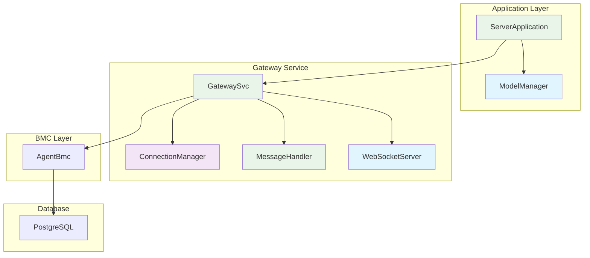
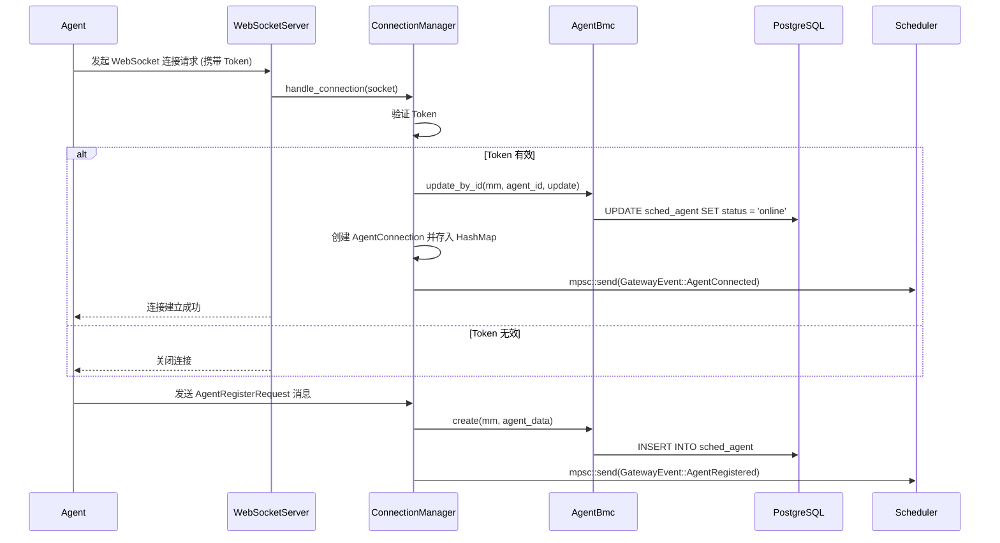
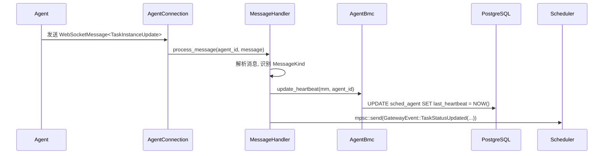
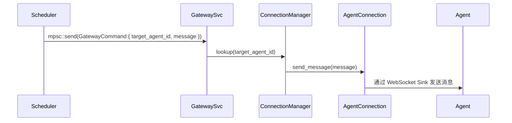

# `hetuflow-server` 服务端网关 (Gateway) 设计

## 1. 概述

网关 (`Gateway`) 是 `hetuflow-server` 的网络通信接入层。它负责管理所有来自 `Agent` 的 WebSocket 连接，并作为 `Scheduler` 模块与 `Agent` 之间的双向消息代理。

其核心职责包括：

- **连接管理**: 监听指定端口，接收和维护所有 `Agent` 的 WebSocket 持久连接。
- **认证与授权**: 在连接建立时，验证 `Agent` 提供的 `Token`，确保只有合法的 `Agent` 才能接入系统。
- **消息路由**:
  - **上行**: 解析来自 `Agent` 的 `WebSocketMessage`，并根据消息类型将其路由到 `Scheduler` 模块进行处理。
  - **下行**: 接收来自 `Scheduler` 模块的指令（如任务分发），并将其准确地发送给目标 `Agent`。
- **会话管理**: 维护每个已连接 `Agent` 的会话信息，包括 `agent_id`、连接状态和 WebSocket 发送句柄。

`Gateway` 的设计目标是成为一个高性能、可扩展且与核心调度逻辑解耦的纯粹通信层。

## 2. 核心组件设计

网关作为 `ServerApplication` 的组件，其核心组件包括 `GatewaySvc`、`ConnectionManager` 和 `MessageHandler`。这些组件由 `ServerApplication` 统一管理和初始化。

### 组件依赖关系

```rust
use fusion_core::DataError;
use modelsql::ModelManager;
use std::sync::Arc;
use tokio::sync::{mpsc, RwLock, Mutex};
use std::collections::HashMap;

// 网关组件在 ServerApplication 中的集成方式
// 详细的应用容器实现请参考 server.md 中的 ServerApplication
```

**注意**: 网关不再作为独立的应用容器存在，而是作为 `ServerApplication` 的组件。所有网关相关的初始化、启动和生命周期管理都由 `ServerApplication` 负责。

#### GatewaySvc

```rust
// src/gateway/gateway_svc.rs
use tokio::sync::{mpsc, Mutex};
use tracing::{info, error};
use fusion_core::DataError;
use modelsql::ModelManager;
use std::sync::Arc;
use super::{ConnectionManager, MessageHandler};

/// 网关服务
pub struct GatewaySvc {
  mm: ModelManager,
  connection_manager: Arc<ConnectionManager>,
  message_handler: Arc<MessageHandler>,
  command_receiver: Arc<Mutex<mpsc::UnboundedReceiver<GatewayCommand>>>,
  event_receiver: Arc<Mutex<mpsc::UnboundedReceiver<GatewayEvent>>>,
}

impl GatewaySvc {
  pub fn new(
    mm: ModelManager,
    connection_manager: Arc<ConnectionManager>,
    message_handler: Arc<MessageHandler>,
    command_receiver: mpsc::UnboundedReceiver<GatewayCommand>,
    event_receiver: mpsc::UnboundedReceiver<GatewayEvent>,
  ) -> Self {
    Self {
      mm,
      connection_manager,
      message_handler,
      command_receiver: Arc::new(Mutex::new(command_receiver)),
      event_receiver: Arc::new(Mutex::new(event_receiver)),
    }
  }

  // 启动网关服务
  pub async fn start(&self) -> Result<(), DataError> {
    info!("Starting Gateway Service");

    // 启动 WebSocket 服务器
    self.start_websocket_server().await?;

    // 启动命令处理循环
    self.start_command_loop().await?;

    // 启动事件处理循环
    self.start_event_loop().await?;

    Ok(())
  }

  // 启动 WebSocket 服务器
  async fn start_websocket_server(&self) -> Result<(), DataError> {
    let connection_manager = self.connection_manager.clone();
    let message_handler = self.message_handler.clone();

    tokio::spawn(async move {
      // 在这里实现 WebSocket 服务器逻辑
      // 监听端口，处理连接建立和断开
      info!("WebSocket server started");
    });

    Ok(())
  }

  // 启动命令处理循环
  async fn start_command_loop(&self) -> Result<(), DataError> {
    let command_receiver = self.command_receiver.clone();
    let connection_manager = self.connection_manager.clone();

    tokio::spawn(async move {
      let mut receiver = command_receiver.lock().await;
      while let Some(command) = receiver.recv().await {
        if let Err(e) = Self::handle_gateway_command(&connection_manager, command).await {
          error!("Failed to handle gateway command: {:?}", e);
        }
      }
    });

    Ok(())
  }

  // 启动事件处理循环
  async fn start_event_loop(&self) -> Result<(), DataError> {
    let event_receiver = self.event_receiver.clone();

    tokio::spawn(async move {
      let mut receiver = event_receiver.lock().await;
      while let Some(event) = receiver.recv().await {
        if let Err(e) = Self::handle_gateway_event(event).await {
          error!("Failed to handle gateway event: {:?}", e);
        }
      }
    });

    Ok(())
  }

  // 处理来自 Scheduler 的命令
  async fn handle_gateway_command(
    connection_manager: &ConnectionManager,
    command: GatewayCommand
  ) -> Result<(), DataError> {
    connection_manager.send_message_to_agent(
      &command.target_agent_id,
      command.message
    ).await
  }

  // 处理网关事件
  async fn handle_gateway_event(event: GatewayEvent) -> Result<(), DataError> {
    match event {
      GatewayEvent::AgentConnected { agent_id } => {
        info!("Agent {} connected", agent_id);
      },
      GatewayEvent::AgentDisconnected { agent_id, reason } => {
        info!("Agent {} disconnected: {}", agent_id, reason);
      },
      _ => {
        debug!("Handled gateway event: {:?}", event);
      }
    }
    Ok(())
  }
}
```

### 数据模型与 BMC 层

Gateway 服务依赖 `server-types-entities.md` 中定义的 `AgentEntity` 及其相关的 `AgentBmc`。这里不再重复定义，仅展示其在 Gateway 中的典型用法。

Agent 的连接、断开和心跳等事件将直接通过日志系统记录，不再使用独立的 `AgentLog` 数据实体。

```rust
// 引用在 server-types-entities.md 中定义的 AgentEntity 和 AgentBmc
use crate::bmc::{AgentBmc, AgentEntity, AgentForUpdate, AgentFilter};
use fusion_core::DataError;
use modelsql::{ModelManager, SqlError};
impl AgentBmc {
  /// 查找在线的 Agent
  pub async fn find_online_agents(mm: &ModelManager) -> Result<Vec<AgentEntity>, SqlError> {
    let filter = AgentFilter {
      status: Some("online".to_string().into()),
      ..Default::default()
    };
    Self::find_many(mm, vec![filter], None).await
  }

  /// 更新 Agent 心跳时间
  pub async fn update_heartbeat(mm: &ModelManager, agent_id: &str) -> Result<(), SqlError> {
    let update = AgentForUpdate {
      last_heartbeat: Some(now_offset()),
      ..Default::default()
    };
    Self::update_by_id(mm, agent_id, update).await.map(|_| ())
  }

  /// 更新 Agent 状态
  pub async fn update_status(mm: &ModelManager, agent_id: &str, status: &str) -> Result<(), SqlError> {
    let update = AgentForUpdate {
      status: Some(status.to_string()),
      ..Default::default()
    };
    Self::update_by_id(mm, agent_id, update).await.map(|_| ())
  }
}
```

## 3. 核心组件架构

`Gateway` 模块主要由以下几个组件构成：



- **`GatewaySvc` (网关服务)**: 网关的核心服务，管理所有连接和消息路由。
- **`ConnectionManager` (连接管理器)**: 线程安全的管理器，负责维护所有已认证 `Agent` 的连接状态。
- **`MessageHandler` (消息路由器)**: 负责处理从 `AgentConnection` 读取到的每一条上行消息。
- **`WebSocketServer` (WebSocket 服务器)**: 基于 `axum` 和 `tokio-tungstenite` 实现，作为系统的网络入口。
- **`AgentBmc` (Agent 数据访问)**: 管理 Agent 信息的数据库操作。

## 4. 服务层实现

### ConnectionManager

`ConnectionManager` 基于内存计算，不直接访问数据库。当相关操作完成时将发出 `AgentEvent` 事件，而 `AgentManager` 将注册事件处理函数，当 `AgentEvent` 事件发生时，`AgentManager` 会持久化 Agent 状态到数据。主要职责：

- WebSocket 连接管理 ：负责管理与所有 Agent 的 WebSocket 连接
- 连接生命周期控制 ：处理连接的建立、维护、断开和重连
- 连接状态监控 ：跟踪每个 Agent 的连接状态和健康状况
- 连接池管理 ：维护活跃连接池，优化资源使用
- [ ] TODO: 身份验证和授权 ：验证 Agent 的身份和权限

```rust
use fusion_core::DataError;
use modelsql::page::{PageResult, Page};

pub struct ConnectionManager {
  mm: Arc<ModelManager>,
  connections: Arc<RwLock<HashMap<String, AgentConnection>>>,
}

impl ConnectionManager {
  pub fn new(mm: Arc<ModelManager>) -> Self {
    Self {
      mm,
      connections: Arc::new(RwLock::new(HashMap::default())),
    }
  }

  // 添加一个新连接
  pub async fn add_connection(&self, agent_id: Uuid, connection: AgentConnection) -> Result<(), DataError> {
    // 记录连接日志
    info!("Agent {} connected successfully", agent_id);

    // 添加到内存连接池
    let mut connections = self.connections.write().await;
    connections.insert(agent_id.clone(), connection);

    info!("Agent {} connected and registered", agent_id);
    Ok(())
  }

  // 移除一个连接
  pub async fn remove_connection(&self, agent_id: &Uuid, reason: &str) -> Result<(), DataError> {
    // 更新数据库中的 Agent 状态
    let update = AgentForUpdate {
      status: Some("offline".to_string()),
      update_mask: Some(FieldMask::new(vec!["status".to_string(), "updated_at".to_string()])),
      ..Default::default()
    };

    AgentBmc::update_by_id(&self.mm, agent_id, update)
      .await
      .map_err(DataError::from)?;

    // 记录断开连接日志
    info!("Agent {} disconnected: {}", agent_id, reason);

    // 从内存连接池移除
    let mut connections = self.connections.write().await;
    connections.remove(agent_id);

    info!("Agent {} disconnected: {}", agent_id, reason);
    Ok(())
  }

  // 获取所有在线 Agent
  pub async fn get_online_agents(&self) -> Result<Vec<Uuid>, DataError> {
    AgentBmc::find_online_agents(&self.mm)
      .await
      .map_err(DataError::from)
  }

  // 发送消息给指定 Agent
  pub async fn send_message_to_agent(
    &self,
    agent_id: &Uuid,
    message: WebSocketMessage
  ) -> Result<(), DataError> {
    let connections = self.connections.read().await;
    if let Some(connection) = connections.get(agent_id) {
      connection.send_message(message).await
    } else {
      Err(DataError::not_found(&format!("Agent {} not connected", agent_id)))
    }
  }

  // 广播消息给所有在线 Agent
  pub async fn broadcast_message(&self, message: WebSocketMessage) -> Result<(), DataError> {
    let connections = self.connections.read().await;
    let mut failed_agents = Vec::new();

    for (agent_id, connection) in connections.iter() {
      if let Err(e) = connection.send_message(message.clone()).await {
        error!("Failed to send message to agent {}: {:?}", agent_id, e);
        failed_agents.push(agent_id.clone());
      }
    }

    // 记录失败的 Agent 连接
    for agent_id in failed_agents {
      self.remove_connection(&agent_id, "Message send failed").await?;
    }

    Ok(())
  }

  // 获取连接统计信息
  pub async fn get_connection_stats(&self) -> Result<ConnectionStats, DataError> {
    let connections = self.connections.read().await;
    let online_count = connections.len();

    let total_agents = AgentBmc::count(&self.mm)
      .await
      .map_err(DataError::from)?;

    Ok(ConnectionStats {
      total_agents,
      online_agents: online_count as i64,
      offline_agents: total_agents - online_count as i64,
    })
  }

  // 清理过期连接
  pub async fn cleanup_stale_connections(&self) -> Result<(), DataError> {
    let stale_threshold = now_offset() - chrono::Duration::minutes(5);

    let filter = AgentFilter {
      status: Some(OpValString::Eq("online").into()),
      last_heartbeat: Some(OpValsDateTime::lt(stale_threshold)),
      ..Default::default()
    };

    let stale_agents: Vec<AgentEntity> = AgentBmc::list(&self.mm, vec![filter])
      .await
      .map_err(DataError::from)?;

    for agent in stale_agents {
      self.remove_connection(&agent.id, "Heartbeat timeout").await?;
    }

    Ok(())
  }
}

// 连接统计信息
#[derive(Debug, Clone, Serialize)]
pub struct ConnectionStats {
  pub total_agents: i64,
  pub online_agents: i64,
  pub offline_agents: i64,
}
```

### MessageHandler

主要职责：

- 消息路由分发 ：根据消息类型和目标将消息路由到正确的处理器
- 事件转发 ：在不同服务组件之间转发事件和命令
- 消息协议处理 ：处理 WebSocket 消息的序列化和反序列化
- 负载均衡 ：在多个可用 Agent 之间分发任务
- 消息队列管理 ：管理待发送和待处理的消息队列

```rust
use hetuflow_core::protocol::{
  WebSocketMessage, MessageKind, AgentRegisterRequest, HeartbeatRequest,
  TaskInstanceUpdate, AgentCapabilities, AgentMetrics
};
use fusion_core::DataError;

pub struct MessageHandler {
  connection_manager: Arc<ConnectionManager>,
  event_sender: mpsc::UnboundedSender<GatewayEvent>,
}

impl MessageHandler {
  pub fn new(
    connection_manager: Arc<ConnectionManager>,
    event_sender: mpsc::UnboundedSender<GatewayEvent>,
  ) -> Self {
    Self {
      connection_manager,
      event_sender,
    }
  }

  // 处理来自 Agent 的消息
  pub async fn process_message(&self, agent_id: &Uuid, message: WebSocketMessage) -> Result<(), DataError> {
    match message.message_kind {
      MessageKind::AgentRegister => {
        let request: AgentRegisterRequest = serde_json::from_value(message.payload)
          .map_err(|e| DataError::bad_request(&format!("Invalid register request: {}", e)))?;
        self.handle_agent_register(agent_id, request).await
      },
      MessageKind::AgentHeartbeat => {
        let request: HeartbeatRequest = serde_json::from_value(message.payload)
          .map_err(|e| DataError::bad_request(&format!("Invalid heartbeat request: {}", e)))?;
        self.handle_heartbeat(agent_id, request).await
      },
      MessageKind::TaskInstanceUpdate => {
        let update: TaskInstanceUpdate = serde_json::from_value(message.payload)
          .map_err(|e| DataError::bad_request(&format!("Invalid status update: {}", e)))?;
        self.handle_task_status_update(agent_id, update).await
      },
      _ => {
        warn!("Unhandled message type: {:?}", message.message_kind);
        Ok(())
      }
    }
  }

  // 处理 Agent 注册
  async fn handle_agent_register(&self, agent_id: &Uuid, request: AgentRegisterRequest) -> Result<(), DataError> {
    // 创建或更新 Agent 记录
    let agent_data = AgentForCreate {
      id: agent_id.to_string(),
      namespace_id: request.namespace_id.unwrap_or_else(|| "default".to_string()),
      capabilities: request.capabilities.map(|c| serde_json::to_value(c).unwrap()),
      metadata: request.metadata,
      status: "online".to_string(),
      last_heartbeat: Some(now_offset()),
      registered_at: Some(now_offset()),
      updated_at: Some(now_offset()),
      ..Default::default()
    };

    // 尝试创建，如果已存在则更新
    match AgentBmc::create(self.connection_manager.mm.as_ref(), agent_data).await {
      Ok(_) => {},
      Err(_) => {
        // Agent 已存在，更新状态
        let update = AgentForUpdate {
          status: Some("online".to_string()),
          capabilities: request.capabilities.map(|c| serde_json::to_value(c).unwrap()),
          metadata: request.metadata,
          last_heartbeat: Some(now_offset()),
          updated_at: Some(now_offset()),
          ..Default::default()
        };
        AgentBmc::update_by_id(self.connection_manager.mm.as_ref(), agent_id, update)
          .await
          .map_err(DataError::from)?;
      }
    }

    // 发送注册成功事件
    let event = GatewayEvent::AgentRegistered(request);
    self.event_sender.send(event)
      .map_err(|e| DataError::internal_error(&format!("Failed to send event: {}", e)))?;

    Ok(())
  }

  // 处理 Agent 心跳
  async fn handle_heartbeat(&self, agent_id: &Uuid, request: HeartbeatRequest) -> Result<(), DataError> {
    // 更新心跳时间
    self.connection_manager.update_heartbeat(agent_id).await?;

    // 发送心跳事件
    let event = GatewayEvent::AgentHeartbeat(request);
    self.event_sender.send(event)
      .map_err(|e| DataError::internal_error(&format!("Failed to send event: {}", e)))?;

    Ok(())
  }

  // 处理任务状态更新
  async fn handle_task_status_update(&self, agent_id: &Uuid, update: TaskInstanceUpdate) -> Result<(), DataError> {
    // 发送状态更新事件
    let event = GatewayEvent::TaskStatusUpdated(update);
    self.event_sender.send(event)
      .map_err(|e| DataError::internal_error(&format!("Failed to send event: {}", e)))?;

    Ok(())
  }
}
```

## 5. 核心工作流程

### a. Agent 连接与注册流程



1.  `Agent` 使用其 `token` 发起一个标准的 WebSocket (WSS) 连接请求。
2.  `WebSocketServer` 接收到请求，将其交给 `ConnectionManager`。
3.  `ConnectionManager` 验证 `token` 的合法性。
4.  如果 `token` 有效，`ConnectionManager` 会更新数据库中的 Agent 状态，为该 `Agent` 创建一个 `AgentConnection` 实例，将其存储在内部的 `HashMap` 中，并立即启动一个独立的 `task` 来监听来自该 `Agent` 的消息。同时，它通过通道向 `Scheduler` 发送一个 `AgentConnected` 事件。
5.  `Agent` 在连接建立后，应立即发送第一条消息 `AgentRegisterRequest`，以完成注册。

### b. 上行消息处理 (Agent -> Scheduler)



1.  `AgentConnection` 的监听 `task` 从 WebSocket `Stream` 中读取到一条消息。
2.  消息被传递给 `MessageHandler`。
3.  `MessageHandler` 将其反序列化为 `WebSocketMessage`，并检查其 `message_kind` 字段。
4.  根据 `message_kind`（例如 `TaskInstanceUpdate`），`Router` 将 `payload` 和元数据封装成一个具体的 `GatewayEvent` 枚举变体。
5.  这个 `GatewayEvent` 被发送到 `gateway_event_tx` 通道，由 `Scheduler` 模块的 `SchedulerSvc` 接收和处理。

### c. 下行消息处理 (Scheduler -> Agent)



1.  `Scheduler` 的 `SchedulerSvc` 决定向某个 `Agent` 分发任务，于是创建一个 `GatewayCommand`。
2.  该 `Command` 被发送到 `gateway_command_rx` 通道，由 `GatewaySvc` 的一个专门的监听 `task` 接收。
3.  `ConnectionManager` 从 `HashMap` 中查找 `target_agent_id` 对应的 `AgentConnection`。
4.  如果找到，它调用该 `AgentConnection` 内部的发送方法，将 `WebSocketMessage` 推入其发送队列。
5.  `AgentConnection` 的发送 `task` 从队列中取出消息，序列化后写入 WebSocket `Sink`，完成向 `Agent` 的发送。

## 6. 核心数据结构

Gateway 模块的核心数据结构设计基于 `hetuflow-core` 中定义的协议类型，并添加了服务端特有的连接管理和消息路由功能。

```rust
use std::collections::HashMap;
use std::sync::Arc;
use std::time::{Duration, Instant};
use tokio::sync::{mpsc, RwLock, Mutex};
use futures_util::{sink::SinkExt, stream::StreamExt};
use tokio_tungstenite::{tungstenite::Message, WebSocketStream};
use hetuflow_core::protocol::*; // 使用 core 中定义的协议类型
// 从 Scheduler 接收的指令
pub struct GatewayCommand {
  pub target_agent_id: Uuid,
  pub message: WebSocketMessage, // 来自 core
}

// 发送给 Scheduler 的事件
#[derive(Debug)]
pub enum GatewayEvent {
  AgentConnected { agent_id: Uuid },
  AgentRegistered(AgentRegisterRequest), // 来自 core
  AgentHeartbeat(HeartbeatRequest),      // 来自 core
  TaskStatusUpdated(TaskInstanceUpdate),   // 来自 core
  AgentDisconnected { agent_id: Uuid, reason: String },
}

// Agent 连接信息（扩展版本）
pub struct AgentConnection {
  pub agent_id: Uuid,
  pub websocket: Arc<Mutex<WebSocketStream<tokio::net::TcpStream>>>,
  pub last_heartbeat: Instant,
  pub capabilities: AgentCapabilities, // 来自 core
  pub status: AgentStatus,             // 来自 core
  // 用于向该 Agent 的 WebSocket Sink 发送消息
  pub sender: mpsc::UnboundedSender<Message>,
}

impl AgentConnection {
  // 向 Agent 发送消息
  pub async fn send_message(&self, message: WebSocketMessage) -> Result<(), DataError> {
    let message_bytes = serde_json::to_vec(&message)
      .map_err(|e| DataError::internal_error(&format!("Failed to serialize message: {}", e)))?;

    let ws_message = Message::Binary(message_bytes);
    self.sender.send(ws_message)
      .map_err(|e| DataError::internal_error(&format!("Failed to send message: {}", e)))?;

    Ok(())
  }
}

// 连接事件
#[derive(Debug, Clone)]
pub enum ConnectionEvent {
  AgentConnected { agent_id: Uuid, capabilities: AgentCapabilities },
  AgentDisconnected { agent_id: Uuid, reason: String },
  AgentHeartbeat { agent_id: Uuid, metrics: AgentMetrics },
  MessageReceived { agent_id: Uuid, message: WebSocketMessage },
  MessageSent { agent_id: Uuid, message_id: String },
  ConnectionError { agent_id: Uuid, error: WebSocketError },
}
```

## 7. 协议处理与类型转换

Gateway 作为 Server 端的协议处理器，需要处理来自 `hetuflow-core` 定义的各种消息类型：

```rust
use hetuflow_core::protocol::{
  WebSocketMessage, MessageKind, AgentRegisterRequest, HeartbeatRequest,
  TaskInstanceUpdate, AgentCapabilities, AgentMetrics
};

impl MessageHandler {
  // 处理来自 Agent 的消息
  pub async fn process_message(&self, message: WebSocketMessage) -> Result<(), GatewayError> {
    match message.message_kind {
      MessageKind::AgentRegister => {
        let request: AgentRegisterRequest = serde_json::from_value(message.payload)?;
        self.handle_agent_register(request).await
      },
      MessageKind::AgentHeartbeat => {
        let request: HeartbeatRequest = serde_json::from_value(message.payload)?;
        self.handle_heartbeat(request).await
      },
      MessageKind::TaskInstanceUpdate => {
        let update: TaskInstanceUpdate = serde_json::from_value(message.payload)?;
        self.handle_task_status_update(update).await
      },
      _ => {
        warn!("Unhandled message type: {:?}", message.message_kind);
        Ok(())
      }
    }
  }
}
```

## 8. 错误处理策略

Gateway 模块的错误处理采用分层策略，不同类型的错误使用不同的错误类型：

```rust
use thiserror::Error;
#[derive(Debug, Error)]
pub enum GatewayError {
  #[error("WebSocket error: {0}")]
  WebSocket(#[from] tokio_tungstenite::tungstenite::Error),

  #[error("Serialization error: {0}")]
  Serialization(#[from] serde_json::Error),

  #[error("Database error: {0}")]
  Database(#[from]fusion_core::DataError),

  #[error("Connection not found: {agent_id}")]
  ConnectionNotFound { agent_id: Uuid },

  #[error("Authentication failed: {reason}")]
  AuthenticationFailed { reason: String },

  #[error("Message routing failed: {reason}")]
  MessageRoutingFailed { reason: String },
}

impl GatewayError {
  // 转换为 HTTP 状态码
  pub fn to_http_status(&self) -> u16 {
    match self {
      GatewayError::AuthenticationFailed { .. } => 401,
      GatewayError::ConnectionNotFound { .. } => 404,
      GatewayError::Database(_) => 500,
      GatewayError::WebSocket(_) => 500,
      GatewayError::Serialization(_) => 400,
      GatewayError::MessageRoutingFailed { .. } => 500,
    }
  }

  // 记录错误日志
  pub fn log_error(&self) {
    match self {
      GatewayError::Database(data_error) => {
        error!("Database error in Gateway: {:?}", data_error);
      },
      GatewayError::WebSocket(ws_error) => {
        warn!("WebSocket error in Gateway: {:?}", ws_error);
      },
      GatewayError::AuthenticationFailed { reason } => {
        warn!("Authentication failed: {}", reason);
      },
      _ => {
        error!("Gateway error: {:?}", self);
      }
    }
  }
}
```

## 9. API 实现设计

API 实现设计详见： [server-gateway-api](server-gateway-api.md)

## 总结

`Gateway` 模块作为 `hetuflow-server` 的网络通信接入层，通过以下设计特点确保了系统的高性能和可靠性：

1. **统一架构**：采用 `Application` + `ModelManager` + `DbBmc` 的现代化架构模式
2. **职责单一**：专注于网络连接管理和消息路由，与业务逻辑完全解耦
3. **协议统一**：基于 `hetuflow-core` 的协议定义，确保类型安全和版本一致
4. **高性能架构**：异步 I/O、连接复用、消息压缩等优化措施
5. **可靠性保障**：自动重连、容错机制、健康检查等功能
6. **安全防护**：多层次的身份验证和权限控制机制
7. **错误处理**：使用 `ultimate_core::DataError` 进行统一的数据库错误处理

这种设计为整个分布式任务调度系统提供了稳定、高效的通信基础设施。
