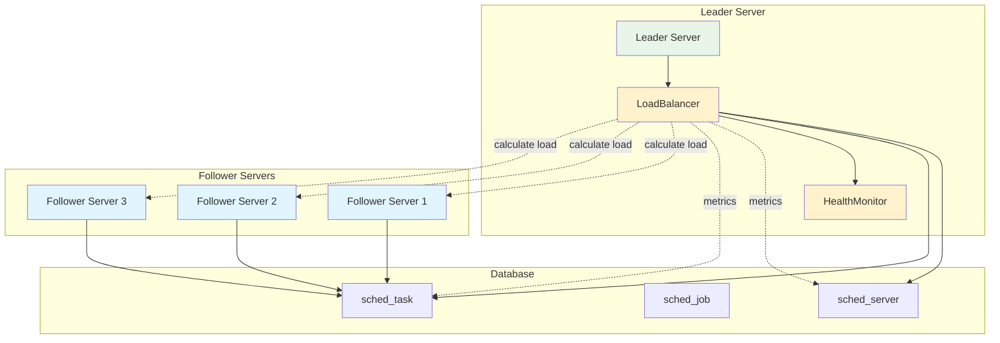

# hetuflow-server 负载均衡设计

## 1. 概述

`hetuflow-server` 的负载均衡机制基于服务器负载进行 namespace 与 Server 的动态关联，每个 namespace 只能关联一个 server，通过 **leader server** 自动管理 namespace 的智能分配和负载均衡。

### 核心特性

- **基于服务器负载的 Namespace 关联**: 每个 server 根据负载情况处理任务
- **leader server 自动平衡**: 由 leader 节点动态管理负载均衡
- **动态重平衡**: 当 server 节点变化时，自动重新分配 namespace 以保持负载均衡
- **故障转移**: 当 server 节点下线时，自动将其负责的 namespace 转移到其他节点

## 2. 数据模型设计

数据表 `sched_server` 的 SQL 定义见 [hetuflow-ddl.sql](../../../scripts/software/postgres/sqls/hetuflow-ddl.sql)

## 3. 负载均衡架构

### 3.1 整体架构图

### 3.2 核心组件

- **LoadBalancer**: 负载均衡器，负责基于服务器负载（活跃任务数、Agent 数量）的任务分发与重平衡策略的制定和执行
