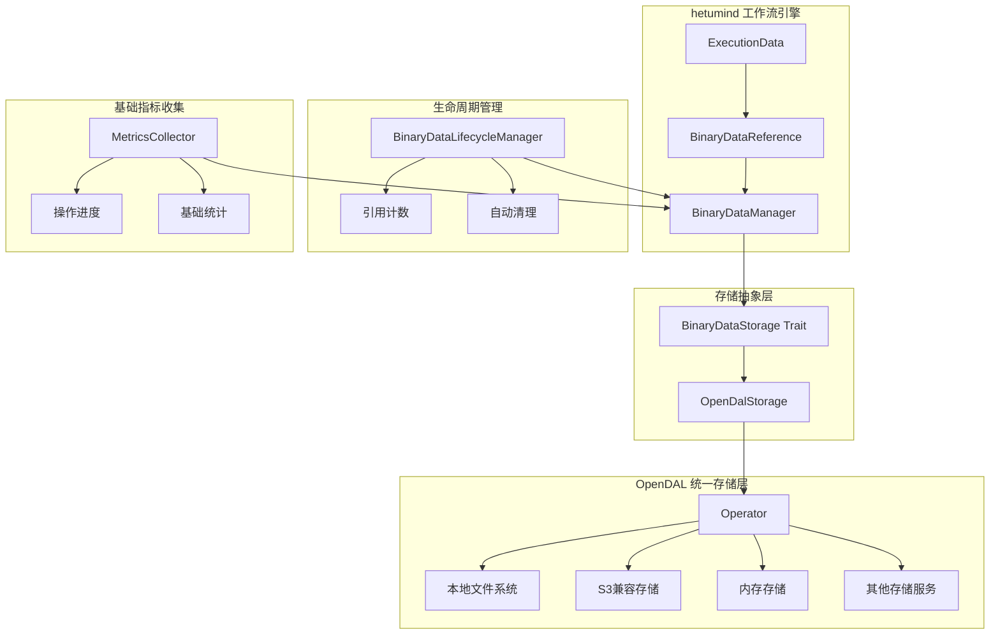

# 基于 opendal 的 BinaryDataReference 技术实现方案

## 1. 方案概述

本方案基于 opendal 构建了一个高效、可扩展的二进制数据引用系统，完美契合 hetumind 技术架构。该方案通过抽象存储层和生命周期管理，实现了内存高效的二进制数据处理，为各类节点提供了强大的技术支撑。

## 2. 核心架构设计



## 3. 技术优势

### 3.1 内存效率优化

- **轻量级引用**: 使用 `BinaryDataReference` 替代直接传递文件内容，大幅降低内存占用
- **按需加载**: 只在实际需要时才加载二进制数据内容
- **智能缓存**: 基于文件大小和访问模式的智能缓存策略

### 3.2 存储抽象与可扩展性

- **统一接口**: 通过 `BinaryDataStorage` trait 提供统一的存储接口
- **多后端支持**: 基于 opendal 支持本地文件系统、S3、内存存储等多种后端
- **热插拔**: 存储后端可动态切换，无需修改业务代码

### 3.3 生命周期管理

- **引用计数**: 自动跟踪二进制数据的引用情况
- **自动清理**: 基于引用计数和时间的自动清理机制
- **资源优化**: 避免资源泄漏，确保系统稳定运行

### 3.4 节点友好设计

- **简单 API**: 提供适合节点调用的简洁接口
- **进度反馈**: 支持操作进度的实时反馈
- **错误处理**: 清晰的错误信息和处理机制

## 4. 核心组件设计

### 4.1 二进制数据存储抽象层

```rust
use std::sync::Arc;
use async_trait::async_trait;
use opendal::{Operator, Scheme};
use serde::{Deserialize, Serialize};
use thiserror::Error;

/// 二进制数据存储错误类型
#[derive(Debug, Error)]
pub enum BinaryStorageError {
    #[error("存储配置错误: {0}")]
    ConfigError(String),
    #[error("存储操作错误: {0}")]
    OperationError(String),
    #[error("文件不存在: {0}")]
    FileNotFound(String),
    #[error("权限不足: {0}")]
    PermissionDenied(String),
    #[error("IO错误: {0}")]
    IoError(#[from] std::io::Error),
    #[error("OpenDAL错误: {0}")]
    OpenDalError(#[from] opendal::Error),
}

/// 二进制数据存储配置
#[derive(Debug, Clone, Serialize, Deserialize)]
pub struct BinaryStorageConfig {
    /// 存储类型
    pub storage_type: StorageType,
    /// 根路径/桶名
    pub root: String,
    /// 存储特定配置
    pub config: serde_json::Value,
}

/// 支持的存储类型
#[derive(Debug, Clone, Serialize, Deserialize)]
#[serde(rename_all = "lowercase")]
pub enum StorageType {
    /// 本地文件系统
    Fs,
    /// S3兼容存储
    S3,
    /// 内存存储（主要用于测试）
    Memory,
    /// Redis存储
    Redis,
}

/// 二进制数据存储抽象
#[async_trait]
pub trait BinaryDataStorage: Send + Sync {
    /// 存储二进制数据并返回引用
    async fn store(&self, data: Vec<u8>, metadata: &BinaryDataMetadata) -> Result<String, BinaryStorageError>;

    /// 根据引用获取二进制数据
    async fn retrieve(&self, key: &str) -> Result<Vec<u8>, BinaryStorageError>;

    /// 获取文件元数据
    async fn get_metadata(&self, key: &str) -> Result<BinaryDataMetadata, BinaryStorageError>;

    /// 删除二进制数据
    async fn delete(&self, key: &str) -> Result<(), BinaryStorageError>;

    /// 检查二进制数据是否存在
    async fn exists(&self, key: &str) -> Result<bool, BinaryStorageError>;
}

/// 二进制数据元数据
#[derive(Debug, Clone, Serialize, Deserialize)]
pub struct BinaryDataMetadata {
    /// 文件名
    pub file_name: Option<String>,
    /// MIME类型
    pub mime_type: String,
    /// 文件大小
    pub file_size: u64,
    /// 最后修改时间
    pub last_modified: Option<i64>,
}

/// 基于 opendal 的存储实现
pub struct OpenDalStorage {
    operator: Operator,
    storage_type: StorageType,
}

impl OpenDalStorage {
    /// 创建新的存储实例
    pub async fn new(config: BinaryStorageConfig) -> Result<Self, BinaryStorageError> {
        let operator = match config.storage_type {
            StorageType::Fs => {
                let mut builder = opendal::services::Fs::default();
                builder.root(&config.root);

                // 应用额外配置
                if let Some(extra_config) = config.config.as_object() {
                    for (key, value) in extra_config {
                        match key.as_str() {
                            // 可以根据需要添加更多配置选项
                            _ => {}
                        }
                    }
                }

                Operator::new(builder).map_err(|e| BinaryStorageError::ConfigError(e.to_string()))?
            }
            StorageType::S3 => {
                let mut builder = opendal::services::S3::default();

                // 从配置中提取S3相关参数
                if let Some(extra_config) = config.config.as_object() {
                    if let Some(bucket) = extra_config.get("bucket").and_then(|v| v.as_str()) {
                        builder.bucket(bucket);
                    }
                    if let Some(region) = extra_config.get("region").and_then(|v| v.as_str()) {
                        builder.region(region);
                    }
                    if let Some(endpoint) = extra_config.get("endpoint").and_then(|v| v.as_str()) {
                        builder.endpoint(endpoint);
                    }
                    if let Some(access_key) = extra_config.get("access_key").and_then(|v| v.as_str()) {
                        builder.access_key_id(access_key);
                    }
                    if let Some(secret_key) = extra_config.get("secret_key").and_then(|v| v.as_str()) {
                        builder.secret_access_key(secret_key);
                    }
                }

                Operator::new(builder).map_err(|e| BinaryStorageError::ConfigError(e.to_string()))?
            }
            StorageType::Memory => {
                let builder = opendal::services::Memory::default();
                Operator::new(builder).map_err(|e| BinaryStorageError::ConfigError(e.to_string()))?
            }
            StorageType::Redis => {
                let mut builder = opendal::services::Redis::default();

                // 从配置中提取Redis相关参数
                if let Some(extra_config) = config.config.as_object() {
                    if let Some(endpoint) = extra_config.get("endpoint").and_then(|v| v.as_str()) {
                        builder.endpoint(endpoint);
                    }
                    if let Some(db) = extra_config.get("db").and_then(|v| v.as_i64()) {
                        builder.db(db as i64);
                    }
                }

                Operator::new(builder).map_err(|e| BinaryStorageError::ConfigError(e.to_string()))?
            }
        };

        Ok(Self {
            operator,
            storage_type: config.storage_type,
        })
    }

    /// 生成唯一文件键
    fn generate_file_key(&self, metadata: &BinaryDataMetadata) -> String {
        use std::collections::hash_map::DefaultHasher;
        use std::hash::{Hash, Hasher};
        use uuid::Uuid;

        // 使用UUID + 文件名哈希生成唯一键
        let uuid = Uuid::new_v4().to_string();
        let mut hasher = DefaultHasher::new();

        if let Some(name) = &metadata.file_name {
            name.hash(&mut hasher);
        }

        let hash = hasher.finish();
        format!("{}_{:x}_{}",
            chrono::Utc::now().format("%Y%m%d_%H%M%S"),
            hash,
            metadata.file_name.as_deref().unwrap_or("bin")
        )
    }
}

#[async_trait]
impl BinaryDataStorage for OpenDalStorage {
    async fn store(&self, data: Vec<u8>, metadata: &BinaryDataMetadata) -> Result<String, BinaryStorageError> {
        let key = self.generate_file_key(metadata);

        // 使用 opendal 写入数据
        self.operator.write(&key, data).await
            .map_err(|e| BinaryStorageError::OperationError(e.to_string()))?;

        Ok(key)
    }

    async fn retrieve(&self, key: &str) -> Result<Vec<u8>, BinaryStorageError> {
        self.operator.read(key).await
            .map_err(|e| BinaryStorageError::OperationError(e.to_string()))
    }

    async fn get_metadata(&self, key: &str) -> Result<BinaryDataMetadata, BinaryStorageError> {
        let meta = self.operator.stat(key).await
            .map_err(|e| BinaryStorageError::OperationError(e.to_string()))?;

        Ok(BinaryDataMetadata {
            file_name: Some(key.split('/').last().unwrap_or(key).to_string()),
            mime_type: meta.content_type().unwrap_or("application/octet-stream").to_string(),
            file_size: meta.content_length() as u64,
            last_modified: meta.last_modified().map(|dt| dt.timestamp()),
        })
    }

    async fn delete(&self, key: &str) -> Result<(), BinaryStorageError> {
        self.operator.delete(key).await
            .map_err(|e| BinaryStorageError::OperationError(e.to_string()))
    }

    async fn exists(&self, key: &str) -> Result<bool, BinaryStorageError> {
        match self.operator.stat(key).await {
            Ok(_) => Ok(true),
            Err(opendal::Error::ObjectNotFound(_)) => Ok(false),
            Err(e) => Err(BinaryStorageError::OperationError(e.to_string())),
        }
    }
}
```

### 4.2 二进制数据管理器

```rust
use std::sync::Arc;
use tokio::sync::RwLock;
use ahash::HashMap;

/// 二进制数据管理器
pub struct BinaryDataManager {
    /// 存储实现
    storage: Arc<dyn BinaryDataStorage>,
    /// 缓存 (可选)
    cache: Arc<RwLock<HashMap<String, Vec<u8>>>>,
    /// 缓存大小限制
    cache_limit: usize,
    /// 存储类型
    storage_type: StorageType,
    /// 指标收集器
    metrics_collector: Arc<BasicMetricsCollector>,
}

impl BinaryDataManager {
    /// 创建新的二进制数据管理器
    pub async fn new(config: BinaryStorageConfig) -> Result<Self, BinaryStorageError> {
        let storage = Arc::new(OpenDalStorage::new(config).await?);

        Ok(Self {
            storage,
            cache: Arc::new(RwLock::new(HashMap::new())),
            cache_limit: 100 * 1024 * 1024, // 100MB缓存限制
            storage_type: config.storage_type,
            metrics_collector: Arc::new(BasicMetricsCollector::new()),
        })
    }

    /// 存储二进制数据并创建引用
    pub async fn store_data(&self, data: Vec<u8>, metadata: BinaryDataMetadata) -> Result<BinaryDataReference, BinaryStorageError> {
        let operation_id = self.metrics_collector.start_operation("store", data.len());

        let key = self.storage.store(data.clone(), &metadata).await?;

        // 更新缓存（如果启用）
        if self.should_cache(&data) {
            let mut cache = self.cache.write().await;
            cache.insert(key.clone(), data);
        }

        // 创建二进制数据引用
        let reference = BinaryDataReference {
            file_key: key,
            mime_kind: metadata.mime_type,
            file_size: metadata.file_size,
            file_name: metadata.file_name,
            file_kind: self.determine_file_kind(&metadata.mime_type),
            file_extension: metadata.file_name.as_ref()
                .and_then(|name| std::path::Path::new(name).extension())
                .and_then(|ext| ext.to_str())
                .map(|ext| ext.to_string()),
            directory: metadata.file_name.as_ref()
                .and_then(|name| std::path::Path::new(name).parent())
                .and_then(|parent| parent.to_str())
                .map(|path| path.to_string()),
        };

        self.metrics_collector.complete_operation(operation_id, true);
        Ok(reference)
    }

    /// 获取二进制数据
    pub async fn get_data(&self, key: &str) -> Result<Vec<u8>, BinaryStorageError> {
        let operation_id = self.metrics_collector.start_operation("retrieve", 0);

        // 先检查缓存
        {
            let cache = self.cache.read().await;
            if let Some(data) = cache.get(key) {
                self.metrics_collector.complete_operation(operation_id, true);
                return Ok(data.clone());
            }
        }

        // 从存储获取
        let data = self.storage.retrieve(key).await?;

        // 更新缓存
        if self.should_cache(&data) {
            let mut cache = self.cache.write().await;
            cache.insert(key.to_string(), data.clone());
        }

        self.metrics_collector.complete_operation(operation_id, true);
        Ok(data)
    }

    /// 删除二进制数据
    pub async fn delete_data(&self, key: &str) -> Result<(), BinaryStorageError> {
        let operation_id = self.metrics_collector.start_operation("delete", 0);

        // 从缓存删除
        {
            let mut cache = self.cache.write().await;
            cache.remove(key);
        }

        // 从存储删除
        let result = self.storage.delete(key).await;
        self.metrics_collector.complete_operation(operation_id, result.is_ok());
        result
    }

    /// 检查数据是否存在
    pub async fn data_exists(&self, key: &str) -> Result<bool, BinaryStorageError> {
        self.storage.exists(key).await
    }

    /// 获取操作进度
    pub async fn get_operation_progress(&self, operation_id: &str) -> Option<OperationProgress> {
        self.metrics_collector.get_progress(operation_id)
    }

    /// 确定是否应该缓存数据
    fn should_cache(&self, data: &[u8]) -> bool {
        // 只缓存小文件和内存存储
        match self.storage_type {
            StorageType::Memory => false, // 内存存储不需要缓存
            _ => data.len() < 10 * 1024 * 1024, // 只缓存小于10MB的文件
        }
    }

    /// 根据MIME类型确定文件类型
    fn determine_file_kind(&self, mime_type: &str) -> Option<BinaryFileKind> {
        match mime_type {
            t if t.starts_with("text/") => Some(BinaryFileKind::Text),
            "application/json" => Some(BinaryFileKind::Json),
            t if t.starts_with("image/") => Some(BinaryFileKind::Image),
            t if t.starts_with("video/") => Some(BinaryFileKind::Video),
            t if t.starts_with("audio/") => Some(BinaryFileKind::Audio),
            "application/pdf" => Some(BinaryFileKind::Pdf),
            "text/html" => Some(BinaryFileKind::Html),
            t if t.contains("sheet") || t.contains("excel") => Some(BinaryFileKind::Excel),
            t if t.contains("word") || t.contains("document") => Some(BinaryFileKind::Word),
            t if t.contains("presentation") || t.contains("powerpoint") => Some(BinaryFileKind::Ppt),
            _ => Some(BinaryFileKind::Text),
        }
    }
}
```

### 4.3 二进制数据引用的生命周期管理

```rust
use std::sync::Arc;
use std::time::{Duration, Instant};
use tokio::sync::RwLock;
use tokio::time::interval;
use ahash::HashMap;
use log::{debug, info, warn};

/// 二进制数据生命周期管理器
pub struct BinaryDataLifecycleManager {
    /// 二进制数据管理器
    data_manager: Arc<BinaryDataManager>,
    /// 引用计数
    reference_counts: Arc<RwLock<HashMap<String, usize>>>,
    /// 创建时间记录
    creation_times: Arc<RwLock<HashMap<String, Instant>>>,
    /// 最后访问时间记录
    last_access_times: Arc<RwLock<HashMap<String, Instant>>>,
    /// 清理配置
    cleanup_config: LifecycleCleanupConfig,
}

/// 生命周期清理配置
#[derive(Debug, Clone)]
pub struct LifecycleCleanupConfig {
    /// 引用计数为0后保留时间
    pub zero_ref_retention: Duration,
    /// 最大保留时间（无论引用计数）
    pub max_retention: Duration,
    /// 清理检查间隔
    pub cleanup_interval: Duration,
    /// 是否启用自动清理
    pub auto_cleanup: bool,
}

impl Default for LifecycleCleanupConfig {
    fn default() -> Self {
        Self {
            zero_ref_retention: Duration::from_secs(3600), // 1小时
            max_retention: Duration::from_secs(86400 * 7), // 7天
            cleanup_interval: Duration::from_secs(300), // 5分钟
            auto_cleanup: true,
        }
    }
}

impl BinaryDataLifecycleManager {
    /// 创建新的生命周期管理器
    pub fn new(
        data_manager: Arc<BinaryDataManager>,
        cleanup_config: LifecycleCleanupConfig,
    ) -> Self {
        Self {
            data_manager,
            reference_counts: Arc::new(RwLock::new(HashMap::new())),
            creation_times: Arc::new(RwLock::new(HashMap::new())),
            last_access_times: Arc::new(RwLock::new(HashMap::new())),
            cleanup_config,
        }
    }

    /// 注册新的二进制数据引用
    pub async fn register_reference(&self, key: &str) -> Result<(), BinaryStorageError> {
        let now = Instant::now();

        // 更新引用计数
        {
            let mut ref_counts = self.reference_counts.write().await;
            *ref_counts.entry(key.to_string()).or_insert(0) += 1;
        }

        // 记录创建时间（如果是新键）
        {
            let mut creation_times = self.creation_times.write().await;
            if !creation_times.contains_key(key) {
                creation_times.insert(key.to_string(), now);
                debug!("注册新的二进制数据引用: {}", key);
            }
        }

        // 更新最后访问时间
        {
            let mut access_times = self.last_access_times.write().await;
            access_times.insert(key.to_string(), now);
        }

        Ok(())
    }

    /// 释放二进制数据引用
    pub async fn release_reference(&self, key: &str) -> Result<(), BinaryStorageError> {
        let now = Instant::now();

        // 更新引用计数
        let should_remove = {
            let mut ref_counts = self.reference_counts.write().await;
            if let Some(count) = ref_counts.get_mut(key) {
                *count = count.saturating_sub(1);
                if *count == 0 {
                    debug!("二进制数据引用计数归零: {}", key);
                    true
                } else {
                    false
                }
            } else {
                warn!("尝试释放不存在的引用: {}", key);
                false
            }
        };

        // 更新最后访问时间
        {
            let mut access_times = self.last_access_times.write().await;
            access_times.insert(key.to_string(), now);
        }

        // 如果引用计数为0且配置为立即清理，则执行清理
        if should_remove && self.cleanup_config.zero_ref_retention.is_zero() {
            self.cleanup_data(key).await?;
        }

        Ok(())
    }

    /// 获取二进制数据（自动更新访问时间）
    pub async fn get_data(&self, key: &str) -> Result<Vec<u8>, BinaryStorageError> {
        // 更新访问时间
        {
            let mut access_times = self.last_access_times.write().await;
            access_times.insert(key.to_string(), Instant::now());
        }

        // 获取数据
        self.data_manager.get_data(key).await
    }

    /// 存储二进制数据（自动注册引用）
    pub async fn store_data(
        &self,
        data: Vec<u8>,
        metadata: BinaryDataMetadata,
    ) -> Result<BinaryDataReference, BinaryStorageError> {
        // 存储数据
        let reference = self.data_manager.store_data(data, metadata).await?;

        // 注册引用
        self.register_reference(&reference.file_key).await?;

        Ok(reference)
    }

    /// 手动清理指定数据
    pub async fn cleanup_data(&self, key: &str) -> Result<(), BinaryStorageError> {
        info!("清理二进制数据: {}", key);

        // 检查引用计数
        let should_delete = {
            let ref_counts = self.reference_counts.read().await;
            ref_counts.get(key).map_or(true, |count| *count == 0)
        };

        if should_delete {
            // 删除数据
            self.data_manager.delete_data(key).await?;

            // 清理元数据
            {
                let mut ref_counts = self.reference_counts.write().await;
                ref_counts.remove(key);
            }
            {
                let mut creation_times = self.creation_times.write().await;
                creation_times.remove(key);
            }
            {
                let mut access_times = self.last_access_times.write().await;
                access_times.remove(key);
            }

            info!("已清理二进制数据: {}", key);
        } else {
            debug!("跳过清理，数据仍有引用: {}", key);
        }

        Ok(())
    }

    /// 启动自动清理任务
    pub async fn start_cleanup_task(&self) -> Result<(), BinaryStorageError> {
        if !self.cleanup_config.auto_cleanup {
            return Ok(());
        }

        let cleanup_config = self.cleanup_config.clone();
        let reference_counts = self.reference_counts.clone();
        let creation_times = self.creation_times.clone();
        let last_access_times = self.last_access_times.clone();
        let data_manager = self.data_manager.clone();

        tokio::spawn(async move {
            let mut interval = interval(cleanup_config.cleanup_interval);

            loop {
                interval.tick().await;

                let now = Instant::now();
                let mut keys_to_cleanup = Vec::new();

                // 收集需要清理的键
                {
                    let ref_counts = reference_counts.read().await;
                    let creation_times = creation_times.read().await;
                    let last_access_times = last_access_times.read().await;

                    for (key, &count) in ref_counts.iter() {
                        let should_cleanup = if count == 0 {
                            // 引用计数为0，检查零引用保留时间
                            if let Some(last_access) = last_access_times.get(key) {
                                now.duration_since(*last_access) > cleanup_config.zero_ref_retention
                            } else {
                                true
                            }
                        } else {
                            // 检查最大保留时间
                            if let Some(creation_time) = creation_times.get(key) {
                                now.duration_since(*creation_time) > cleanup_config.max_retention
                            } else {
                                true
                            }
                        };

                        if should_cleanup {
                            keys_to_cleanup.push(key.clone());
                        }
                    }
                }

                // 执行清理
                for key in keys_to_cleanup {
                    if let Err(e) = data_manager.delete_data(&key).await {
                        warn!("清理二进制数据失败 {} {}: {}", key, e);
                    }

                    // 清理元数据
                    {
                        let mut ref_counts = reference_counts.write().await;
                        ref_counts.remove(&key);
                    }
                    {
                        let mut creation_times = creation_times.write().await;
                        creation_times.remove(&key);
                    }
                    {
                        let mut last_access_times = last_access_times.write().await;
                        last_access_times.remove(&key);
                    }

                    info!("自动清理二进制数据: {}", key);
                }
            }
        });

        info!("已启动二进制数据自动清理任务");
        Ok(())
    }
}
```

### 4.4 基础指标收集

```rust
use std::sync::Arc;
use std::collections::HashMap;
use std::time::{Duration, Instant};
use tokio::sync::RwLock;
use uuid::Uuid;

/// 操作进度
#[derive(Debug, Clone)]
pub struct OperationProgress {
    /// 操作ID
    pub operation_id: String,
    /// 操作类型
    pub operation_type: String,
    /// 总字节数
    pub total_bytes: u64,
    /// 已处理字节数
    pub processed_bytes: u64,
    /// 开始时间
    pub start_time: Instant,
    /// 是否完成
    pub is_completed: bool,
    /// 错误信息
    pub error: Option<String>,
}

impl OperationProgress {
    /// 完成百分比
    pub fn completion_percentage(&self) -> f64 {
        if self.total_bytes == 0 {
            0.0
        } else {
            (self.processed_bytes as f64 / self.total_bytes as f64) * 100.0
        }
    }

    /// 已用时间
    pub fn elapsed_time(&self) -> Duration {
        self.start_time.elapsed()
    }

    /// 预估剩余时间（简单估算）
    pub fn estimated_remaining_time(&self) -> Option<Duration> {
        if self.processed_bytes == 0 || self.is_completed {
            return None;
        }

        let elapsed = self.elapsed_time();
        let rate = self.processed_bytes as f64 / elapsed.as_secs_f64();
        let remaining_bytes = self.total_bytes.saturating_sub(self.processed_bytes) as f64;

        if rate > 0.0 {
            Some(Duration::from_secs_f64(remaining_bytes / rate))
        } else {
            None
        }
    }
}

/// 基础指标收集器
pub struct BasicMetricsCollector {
    /// 当前操作
    operations: Arc<RwLock<HashMap<String, OperationProgress>>>,
    /// 统计信息
    stats: Arc<RwLock<BasicStats>>,
}

/// 基础统计信息
#[derive(Debug, Default, Clone)]
pub struct BasicStats {
    /// 总操作数
    pub total_operations: u64,
    /// 成功操作数
    pub successful_operations: u64,
    /// 失败操作数
    pub failed_operations: u64,
    /// 总处理字节数
    pub total_bytes_processed: u64,
}

impl BasicMetricsCollector {
    /// 创建新的指标收集器
    pub fn new() -> Self {
        Self {
            operations: Arc::new(RwLock::new(HashMap::new())),
            stats: Arc::new(RwLock::new(BasicStats::default())),
        }
    }

    /// 开始操作
    pub fn start_operation(&self, operation_type: &str, total_bytes: usize) -> String {
        let operation_id = Uuid::new_v4().to_string();
        let progress = OperationProgress {
            operation_id: operation_id.clone(),
            operation_type: operation_type.to_string(),
            total_bytes: total_bytes as u64,
            processed_bytes: 0,
            start_time: Instant::now(),
            is_completed: false,
            error: None,
        };

        // 添加到操作列表
        let mut operations = self.operations.blocking_write();
        operations.insert(operation_id.clone(), progress);

        // 更新统计
        let mut stats = self.stats.blocking_write();
        stats.total_operations += 1;

        operation_id
    }

    /// 更新操作进度
    pub async fn update_progress(&self, operation_id: &str, processed_bytes: u64) {
        let mut operations = self.operations.write().await;
        if let Some(progress) = operations.get_mut(operation_id) {
            progress.processed_bytes = processed_bytes;
        }
    }

    /// 完成操作
    pub async fn complete_operation(&self, operation_id: &str, success: bool) {
        let mut operations = self.operations.write().await;
        if let Some(progress) = operations.get_mut(operation_id) {
            progress.is_completed = true;
            if !success {
                progress.error = Some("操作失败".to_string());
            }

            // 更新统计
            let mut stats = self.stats.write().await;
            if success {
                stats.successful_operations += 1;
            } else {
                stats.failed_operations += 1;
            }
            stats.total_bytes_processed += progress.processed_bytes;
        }
    }

    /// 获取操作进度
    pub async fn get_progress(&self, operation_id: &str) -> Option<OperationProgress> {
        let operations = self.operations.read().await;
        operations.get(operation_id).cloned()
    }

    /// 获取所有当前操作
    pub async fn get_all_operations(&self) -> Vec<OperationProgress> {
        let operations = self.operations.read().await;
        operations.values().cloned().collect()
    }

    /// 获取统计信息
    pub async fn get_stats(&self) -> BasicStats {
        let stats = self.stats.read().await;
        stats.clone()
    }

    /// 清理已完成的操作（保留最近的一些记录）
    pub async fn cleanup_completed_operations(&self, keep_count: usize) {
        let mut operations = self.operations.write().await;

        // 收集已完成的操作
        let mut completed_operations: Vec<_> = operations
            .iter()
            .filter(|(_, progress)| progress.is_completed)
            .collect();

        // 按开始时间排序，保留最新的keep_count个
        completed_operations.sort_by(|a, b| b.1.start_time.cmp(&a.1.start_time));

        // 删除多余的已完成操作
        for (operation_id, _) in completed_operations.iter().skip(keep_count) {
            operations.remove(*operation_id);
        }
    }
}
```

## 5. 配置示例

```rust
// 存储配置
let storage_config = BinaryStorageConfig {
    storage_type: StorageType::S3,
    root: "hetumind-binary-data".to_string(),
    config: json!({
        "bucket": "my-bucket",
        "region": "us-west-2",
        "access_key": "your-access-key",
        "secret_key": "your-secret-key"
    }),
};

// 生命周期配置
let lifecycle_config = LifecycleCleanupConfig {
    zero_ref_retention: Duration::from_secs(3600), // 1小时
    max_retention: Duration::from_secs(86400 * 7), // 7天
    cleanup_interval: Duration::from_secs(300), // 5分钟
    auto_cleanup: true,
};
```

## 6. 节点调用示例

```rust
// 创建管理器
let data_manager = Arc::new(BinaryDataManager::new(storage_config).await?);
let lifecycle_manager = Arc::new(BinaryDataLifecycleManager::new(
    data_manager.clone(),
    lifecycle_config,
));

// 启动自动清理
lifecycle_manager.start_cleanup_task().await?;

// 节点中存储数据
let metadata = BinaryDataMetadata {
    file_name: Some("example.pdf".to_string()),
    mime_type: "application/pdf".to_string(),
    file_size: data.len() as u64,
    last_modified: None,
};

let binary_ref = lifecycle_manager.store_data(data, metadata).await?;

// 获取操作进度（用于UI显示）
let operation_id = binary_ref.file_key.clone(); // 实际应该从操作中获取
if let Some(progress) = data_manager.get_operation_progress(&operation_id).await {
    println!("操作进度: {:.1}%", progress.completion_percentage());
    if let Some(remaining) = progress.estimated_remaining_time() {
        println!("预估剩余时间: {:?}", remaining);
    }
}

// 获取数据
let retrieved_data = lifecycle_manager.get_data(&binary_ref.file_key).await?;

// 创建执行数据
let execution_data = ExecutionData::new_binary(
    binary_ref,
    Some(DataSource {
        node_name: "files_node".to_string(),
        output_port: ConnectionKind::Main,
        output_index: 0,
    }),
);
```

## 7. 与 hetumind 架构的集成

该方案完美融入 hetumind 现有架构：

1. **兼容性**: 保持与现有 `BinaryDataReference` 结构的完全兼容
2. **扩展性**: 不影响现有节点，可逐步迁移到新系统
3. **一致性**: 遵循 hetumind 的错误处理和日志记录模式
4. **节点友好**: 提供简单的 API 和进度反馈机制

## 8. 部署建议

1. **渐进式迁移**: 先在新功能中使用，逐步迁移现有节点
2. **配置管理**: 通过配置文件管理不同环境的存储配置
3. **基础监控**: 利用内置的指标收集器提供基本的操作监控
4. **容量规划**: 根据业务需求规划存储容量和生命周期参数

## 9. 总结

本方案通过 opendal 构建了一个高效、可扩展的二进制数据引用系统，实现了以下核心价值：

1. **内存效率**: 避免大文件的内存复制，降低内存占用
2. **存储灵活性**: 支持多种存储后端，适应不同部署环境
3. **自动化管理**: 通过生命周期管理确保资源的合理使用
4. **节点友好**: 提供适合节点调用的简洁接口和进度反馈
5. **基础监控**: 提供必要的指标收集，支持 UI 显示操作进度

该方案为 hetumind 平台的二进制数据处理能力提供了坚实基础，特别适合各类节点对文件操作的需求。
