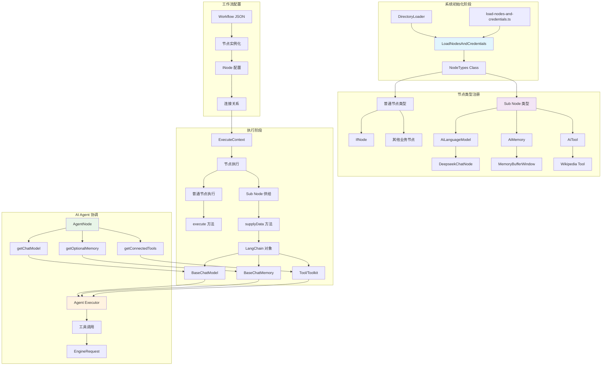
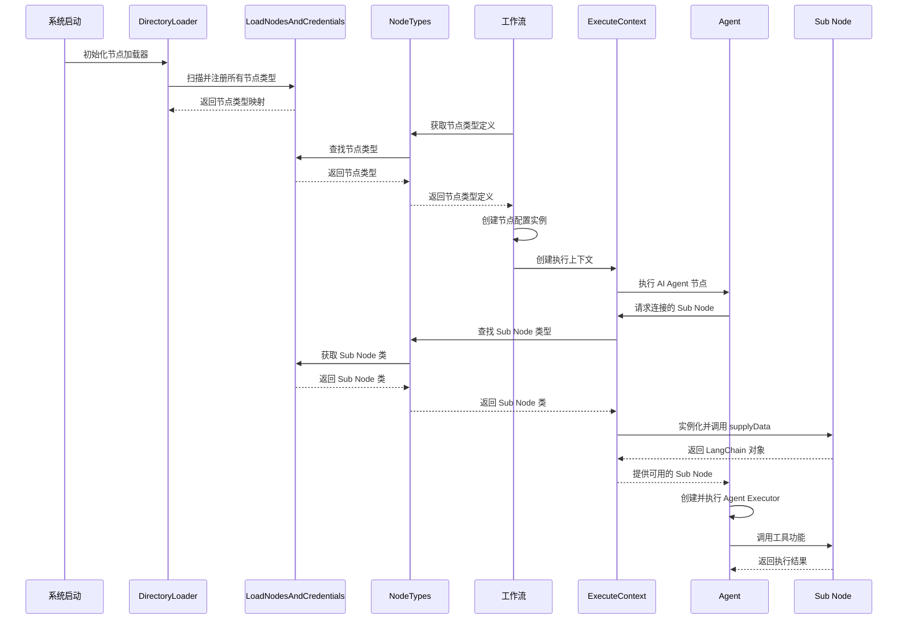
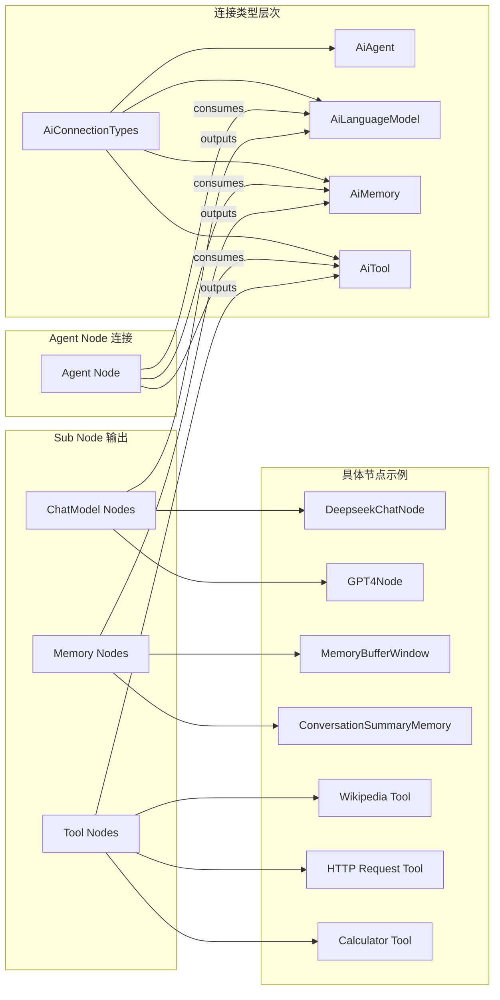
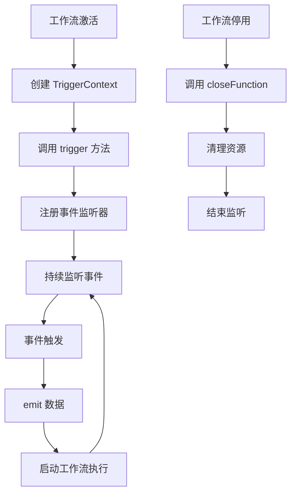
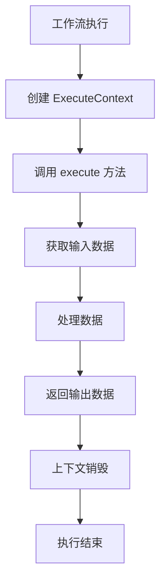
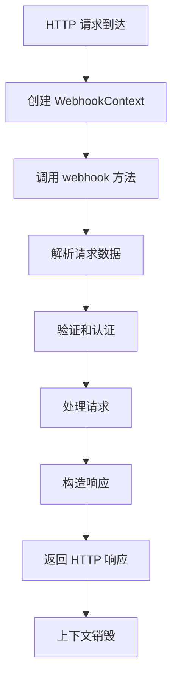

# n8n Node 架构设计分析报告

## 概述

n8n 是一个基于 TypeScript 的工作流自动化平台，采用了独特的节点架构设计。本文档详细分析了 n8n 中 Node 的创建流程、Sub Node 的注册和创建机制，以及它们之间的关系。

## 1. n8n 的 Node 创建流程

### 1.1 **没有使用传统的工厂模式**

n8n 并没有使用经典的工厂设计模式来创建 Node。相反，它采用了一种**基于类的实例化模式**结合**动态加载和注册系统**。

### 1.2 **Node 创建机制**

#### 加载和注册阶段
- **文件**: `packages/cli/src/load-nodes-and-credentials.ts`
- **文件**: `packages/core/src/nodes-loader/directory-loader.ts`

```typescript
// 节点从文件动态加载
loadNodeFromFile(filePath: string) {
    const tempNode = this.loadClass<INodeType | IVersionedNodeType>(filePath);
    this.nodeTypes[nodeType] = {
        type: tempNode,
        sourcePath: filePath,
    };
}
```

#### 类型解析阶段
- **文件**: `packages/cli/src/node-types.ts`

```typescript
getByNameAndVersion(nodeType: string, version?: number): INodeType {
    const node = this.loadNodesAndCredentials.getNode(nodeType);
    const versionedNodeType = NodeHelpers.getVersionedNodeType(node.type, version);
    return versionedNodeType;
}
```

### 1.3 **工作流执行过程中的 Node 创建**

#### 执行栈创建
- **文件**: `packages/core/src/execution-engine/workflow-execute.ts`

```typescript
// 工作流执行时，节点从配置数据创建
const nodeExecutionStack: IExecuteData[] = [
    {
        node: startNode,  // 来自工作流配置的 INode 实例
        data: triggerData,
        source: null,
    },
];
```

#### 执行上下文创建
- **文件**: `packages/core/src/execution-engine/node-execution-context/execute-context.ts`

```typescript
export class ExecuteContext extends BaseExecuteContext implements IExecuteFunctions {
    constructor(
        workflow: Workflow,
        node: INode,  // 要执行的节点实例
        additionalData: IWorkflowExecuteAdditionalData,
        // ...
    ) {
        super(...);
        // 初始化执行上下文
    }
}
```

### 1.4 **具体示例：IfNode 和 AgentNode**

#### IfNode 实现
- **文件**: `packages/nodes-base/nodes/If/V2/IfV2.node.ts`

```typescript
export class IfV2 implements INodeType {
    description: INodeTypeDescription;

    constructor(baseDescription: INodeTypeBaseDescription) {
        this.description = {
            ...baseDescription,
            version: [2, 2.1, 2.2],
            // ... 配置信息
        };
    }

    async execute(this: IExecuteFunctions): Promise<INodeExecutionData[][]> {
        // 条件判断逻辑
        const trueItems: INodeExecutionData[] = [];
        const falseItems: INodeExecutionData[] = [];

        // 处理条件并路由数据
        return [trueItems, falseItems];
    }
}
```

#### AgentNode 实现
- **文件**: `packages/@n8n/nodes-langchain/nodes/agents/Agent/V3/AgentV3.node.ts`

```typescript
export class AgentV3 implements INodeType {
    description: INodeTypeDescription;

    constructor(baseDescription: INodeTypeBaseDescription) {
        this.description = {
            ...baseDescription,
            version: [3],
            // ... AI 特定配置
        };
    }

    async execute(
        this: IExecuteFunctions,
        response?: EngineResponse<RequestResponseMetadata>
    ): Promise<INodeExecutionData[][] | EngineRequest<RequestResponseMetadata>> {
        return await toolsAgentExecute.call(this, response);
    }
}
```

### 1.5 **动态方法分配**

某些节点会动态分配执行方法：
- **文件**: `packages/cli/src/node-types.ts`

```typescript
if (shouldAssignExecuteMethod(versionedNodeType)) {
    versionedNodeType.execute = async function (this: ExecuteContext) {
        const routingNode = new RoutingNode(this, versionedNodeType);
        const data = await routingNode.runNode();
        return data ?? [];
    };
}
```

## 2. Sub Node 的注册和创建机制

### 2.1 **基于连接类型的发现系统**

n8n 使用专门的连接类型来管理 AI 组件之间的关系：

```typescript
// 核心连接类型定义
NodeConnectionTypes.AiLanguageModel  // Chat Model 节点
NodeConnectionTypes.AiMemory        // Memory 节点
NodeConnectionTypes.AiTool          // Tool 节点
NodeConnectionTypes.AiAgent         // Agent 节点
```

### 2.2 **Chat Model 节点示例：DeepSeekChatNode**

#### 注册实现
- **文件**: `packages/@n8n/nodes-langchain/nodes/llms/LmChatDeepSeek/LmChatDeepSeek.node.ts`

```typescript
export class LmChatDeepSeek implements INodeType {
    description: INodeTypeDescription = {
        displayName: 'DeepSeek Chat Model',
        name: 'lmChatDeepSeek',
        outputs: [NodeConnectionTypes.AiLanguageModel],  // 声明输出类型
        outputNames: ['Model'],
        // ... 其他配置
    };

    async supplyData(this: ISupplyDataFunctions): Promise<SupplyData> {
        // 创建 LangChain 兼容的 ChatOpenAI 实例
        const model = new ChatOpenAI({
            apiKey: credentials.apiKey,
            model: modelName,
            ...options,
            callbacks: [new N8nLlmTracing(this)],
        });

        return {
            response: model,  // 返回模型实例
        };
    }
}
```

#### Agent 中的发现和创建
- **文件**: `packages/@n8n/nodes-langchain/nodes/agents/Agent/agents/ToolsAgent/common.ts`

```typescript
export async function getChatModel(
    ctx: IExecuteFunctions | ISupplyDataFunctions,
    index: number = 0,
): Promise<BaseChatModel | undefined> {
    // 通过连接类型获取连接的模型
    const connectedModels = await ctx.getInputConnectionData(
        NodeConnectionTypes.AiLanguageModel, 0
    );

    let model;
    if (Array.isArray(connectedModels) && index !== undefined) {
        // 模型按工作流连接的相反顺序检索
        // index 参数用于选择第几个模型（0 = 最后连接的模型）
        const reversedModels = [...connectedModels].reverse();
        model = reversedModels[index] as BaseChatModel;
    }

    // 验证模型是否支持工具调用
    if (!isChatInstance(model) || !model.bindTools) {
        throw new NodeOperationError(
            ctx.getNode(),
            'Tools Agent requires Chat Model which supports Tools calling',
        );
    }
    return model;
}
```

#### 参数说明
- `ctx`: 执行上下文，提供访问节点连接和工具的接口
- `index`: 模型索引，默认为 0（选择最后连接的模型）。当有多个模型连接时，可以通过此参数指定使用第几个模型

### 2.3 **Memory 节点示例：MemoryBufferWindow**

#### 注册实现
- **文件**: `packages/@n8n/nodes-langchain/nodes/memory/MemoryBufferWindow/MemoryBufferWindow.node.ts`

```typescript
export class MemoryBufferWindow implements INodeType {
    description: INodeTypeDescription = {
        displayName: 'Simple Memory',
        name: 'memoryBufferWindow',
        outputs: [NodeConnectionTypes.AiMemory],  // 声明输出类型
        outputNames: ['Memory'],
    };

    async supplyData(this: ISupplyDataFunctions): Promise<SupplyData> {
        const contextWindowLength = this.getNodeParameter('contextWindowLength', itemIndex) as number;
        const workflowId = this.getWorkflow().id;
        const memoryInstance = MemoryChatBufferSingleton.getInstance();

        const sessionId = getSessionId(this, itemIndex);
        const memory = await memoryInstance.getMemory(`${workflowId}__${sessionId}`, {
            k: contextWindowLength,
            inputKey: 'input',
            memoryKey: 'chat_history',
            outputKey: 'output',
            returnMessages: true,
        });

        return {
            response: logWrapper(memory, this),  // 返回内存实例
        };
    }
}
```

#### 单例模式管理
```typescript
class MemoryChatBufferSingleton {
    private static instance: MemoryChatBufferSingleton;
    private memoryBuffer: Map<string, {
        buffer: BufferWindowMemory;
        created: Date;
        last_accessed: Date;
    }>;

    static getInstance(): MemoryChatBufferSingleton {
        if (!MemoryChatBufferSingleton.instance) {
            MemoryChatBufferSingleton.instance = new MemoryChatBufferSingleton();
        }
        return MemoryChatBufferSingleton.instance;
    }

    async getMemory(sessionKey: string, memoryParams: BufferWindowMemoryInput): Promise<BufferWindowMemory> {
        // 清理1小时前的旧实例
        await this.cleanupStaleBuffers();

        let memoryInstance = this.memoryBuffer.get(sessionKey);
        if (memoryInstance) {
            memoryInstance.last_accessed = new Date();
        } else {
            const newMemory = new BufferWindowMemory(memoryParams);
            this.memoryBuffer.set(sessionKey, {
                buffer: newMemory,
                created: new Date(),
                last_accessed: new Date(),
            });
        }
        return memoryInstance.buffer;
    }
}
```

### 2.4 **Tool 节点示例：Wikipedia Tool**

#### 注册实现
- **文件**: `packages/@n8n/nodes-langchain/nodes/tools/ToolWikipedia/ToolWikipedia.node.ts`

```typescript
export class ToolWikipedia implements INodeType {
    description: INodeTypeDescription = {
        displayName: 'Wikipedia',
        name: 'toolWikipedia',
        outputs: [NodeConnectionTypes.AiTool],  // 声明输出类型
        outputNames: ['Tool'],
    };

    async supplyData(this: ISupplyDataFunctions): Promise<SupplyData> {
        return {
            response: logWrapper(getTool(this), this),  // 返回工具实例
        };
    }

    async execute(this: IExecuteFunctions): Promise<INodeExecutionData[][]> {
        const WikiTool = getTool(this);
        const items = this.getInputData();

        const response: INodeExecutionData[] = [];
        for (let itemIndex = 0; itemIndex < items.length; itemIndex++) {
            const item = items[itemIndex];
            const result = await WikiTool.invoke(item.json);
            response.push({
                json: { response: result },
                pairedItem: { item: itemIndex },
            });
        }
        return [response];
    }
}

function getTool(ctx: ISupplyDataFunctions | IExecuteFunctions): WikipediaQueryRun {
    const WikiTool = new WikipediaQueryRun();
    WikiTool.name = ctx.getNode().name;
    WikiTool.description = 'A tool for interacting with and fetching data from the Wikipedia API. The input should always be a string query.';
    return WikiTool;
}
```

### 2.5 **Tool 发现和管理机制**

#### 工具发现函数
- **文件**: `packages/@n8n/nodes-langchain/utils/helpers.ts`

```typescript
export const getConnectedTools = async (
    ctx: IExecuteFunctions | IWebhookFunctions | ISupplyDataFunctions,
    enforceUniqueNames: boolean,
    convertStructuredTool: boolean = true,
    escapeCurlyBrackets: boolean = false,
) => {
    // 获取所有连接的工具
    const connectedTools = (
        ((await ctx.getInputConnectionData(NodeConnectionTypes.AiTool, 0)) as Array<Toolkit | Tool>) ??
        []
    ).flatMap((toolOrToolkit) => {
        if (toolOrToolkit instanceof Toolkit) {
            return toolOrToolkit.getTools() as Tool[];
        }
        return toolOrToolkit;
    });

    // 强制工具名称唯一性检查
    if (!enforceUniqueNames) return connectedTools;

    const seenNames = new Set<string>();
    const finalTools: Tool[] = [];

    for (const tool of connectedTools) {
        const { name } = tool;
        if (seenNames.has(name)) {
            throw new NodeOperationError(
                ctx.getNode(),
                `You have multiple tools with the same name: '${name}', please rename them to avoid conflicts`,
            );
        }
        seenNames.add(name);

        if (convertStructuredTool && tool instanceof N8nTool) {
            finalTools.push(tool.asDynamicTool());
        } else {
            finalTools.push(tool);
        }
    }

    return finalTools;
};
```

### 2.6 **动态工具创建机制**

#### 节点转换为工具
- **文件**: `packages/core/src/execution-engine/node-execution-context/utils/create-node-as-tool.ts`

```typescript
/**
 * 将 n8n 节点转换为 AI 可用的工具
 * 这是实现任意节点转工具功能的核心函数
 */
export function createNodeAsTool(options: CreateNodeAsToolOptions) {
    return { response: createTool(options) };
}

/**
 * 创建 LangChain 兼容的动态工具
 * 从节点配置中提取参数、描述等信息，构建工具实例
 */
function createTool(options: CreateNodeAsToolOptions) {
    const { node, nodeType, handleToolInvocation } = options;

    // 从节点参数中提取标记为 $fromAI 的参数，生成 Zod 验证模式
    const schema = getSchema(node);
    // 获取节点的工具描述信息
    const description = NodeHelpers.getToolDescriptionForNode(node, nodeType);
    // 将节点名称转换为有效的工具名称（移除特殊字符）
    const nodeName = nodeNameToToolName(node);
    const name = nodeName || nodeType.description.name;

    // 创建 LangChain 的动态结构化工具
    return new DynamicStructuredTool({
        name,
        description,
        schema, // Zod 模式用于参数验证
        func: async (toolArgs: z.infer<typeof schema>) => await handleToolInvocation(toolArgs),
    });
}
```

#### 关键参数说明
- `node`: 要转换的 n8n 节点配置实例
- `nodeType`: 节点的类型定义，包含描述信息
- `handleToolInvocation`: 处理工具调用的回调函数

#### 转换过程
1. **参数提取**: 扫描节点参数，提取标记为 `$fromAI` 的参数
2. **模式生成**: 基于提取的参数生成 Zod 验证模式
3. **名称转换**: 将节点名称转换为符合工具命名规范的标识符
4. **工具创建**: 创建 LangChain 兼容的动态工具实例

// 将节点名称转换为有效的工具名称
export function nodeNameToToolName(nodeOrName: INode | string): string {
    const name = typeof nodeOrName === 'string' ? nodeOrName : nodeOrName.name;
    return name.replace(/[^a-zA-Z0-9_-]+/g, '_');
}
```

#### 模式生成
```typescript
function getSchema(node: INode) {
    const collectedArguments: FromAIArgument[] = [];
    try {
        // 遍历节点参数，收集标记为 $fromAI 的参数
        traverseNodeParameters(node.parameters, collectedArguments);
    } catch (error) {
        throw new NodeOperationError(node, error as Error);
    }

    // 验证和去重参数
    const nameValidationRegex = /^[a-zA-Z0-9_-]{1,64}$/;
    const keyMap = new Map<string, FromAIArgument>();

    for (const argument of collectedArguments) {
        if (argument.key.length === 0 || !nameValidationRegex.test(argument.key)) {
            throw new NodeOperationError(node, `Parameter key \`${argument.key}\` is invalid`);
        }
        // ... 验证逻辑
    }

    // 从验证过的参数生成 Zod 模式
    const schemaObj = uniqueArguments.reduce((acc: Record<string, z.ZodTypeAny>, placeholder) => {
        acc[placeholder.key] = generateZodSchema(placeholder);
        return acc;
    }, {});

    return z.object(schemaObj).required();
}
```

### 2.7 **Agent 执行流程中的工具调用**

#### 工具调用请求创建
- **文件**: `packages/@n8n/nodes-langchain/nodes/agents/Agent/agents/ToolsAgent/V3/execute.ts`

```typescript
// 为工具调用创建引擎请求
// 此函数负责将 AI Agent 的工具调用转换为 n8n 可执行的引擎请求
function createEngineRequests(
    ctx: IExecuteFunctions | ISupplyDataFunctions,
    toolCalls: ToolCallRequest[],
    itemIndex: number,
) {
    // 获取连接到当前 Agent 节点的所有工具子节点
    const connectedSubnodes = ctx.getParentNodes(ctx.getNode().name, {
        connectionType: NodeConnectionTypes.AiTool,
        depth: 1,
    });

    // 将每个工具调用映射为引擎请求
    return toolCalls.map((toolCall) => ({
        // 通过节点名称映射找到对应的工具节点
        nodeName: connectedSubnodes.find(
            (node: { name: string }) => nodeNameToToolName(node.name) === toolCall.tool,
        )?.name ?? toolCall.tool,
        input: toolCall.toolInput,
        type: NodeConnectionTypes.AiTool,
        id: toolCall.toolCallId,
        metadata: { itemIndex },
    }));
}
```

#### 函数说明
- `ctx`: 执行上下文，用于访问节点连接信息
- `toolCalls`: AI Agent 生成的工具调用请求数组
- `itemIndex`: 当前处理的数据项索引，用于跟踪执行上下文

#### 返回值
返回引擎请求数组，每个请求包含：
- `nodeName`: 要执行的工具节点名称
- `input`: 传递给工具的输入数据
- `type`: 连接类型（AiTool）
- `id`: 工具调用的唯一标识符
- `metadata`: 执行元数据

// 主要的代理执行流程
export async function toolsAgentExecute(
    this: IExecuteFunctions | ISupplyDataFunctions,
    response?: EngineResponse<RequestResponseMetadata>,
): Promise<INodeExecutionData[][] | EngineRequest<RequestResponseMetadata>> {
    // 获取必需的组件
    const memory = await getOptionalMemory(this);
    const model = await getChatModel(this, 0);
    const tools = await getTools(this, outputParser);

    // 创建代理执行器
    const executor = createAgentSequence(
        model,
        tools,
        prompt,
        options,
        outputParser,
        memory,
        fallbackModel,
    );

    // 执行代理
    const result = await executor.invoke({
        input,
        steps,
        system_message: options.systemMessage,
        formatting_instructions: formattingInstructions,
    });

    // 通过返回引擎请求处理工具调用
    if ('actions' in response) {
        return {
            actions: response.actions,
            metadata: response.metadata,
        };
    }

    return [returnData];
}
```

### 2.8 **N8nTool 包装器**

#### 工具包装和执行
- **文件**: `packages/@n8n/nodes-langchain/utils/N8nTool.ts`

```typescript
export class N8nTool extends DynamicStructuredTool<ZodObjectAny> {
    constructor(
        private context: ISupplyDataFunctions,
        fields: DynamicStructuredToolInput<ZodObjectAny>,
    ) {
        super(fields);
    }

    asDynamicTool(): DynamicTool {
        const { name, func, schema, context, description } = this;
        const parser = new StructuredOutputParser(schema);

        const wrappedFunc = async function (query: string) {
            let parsedQuery: object;

            try {
                // 尝试使用结构化解析器解析查询
                parsedQuery = await parser.parse(query);
            } catch (e) {
                // 回退解析机制
                try {
                    dataFromModel = jsonParse<IDataObject>(query, { acceptJSObject: true });
                } catch (error) {
                    // 处理单参数情况
                    if (Object.keys(schema.shape).length === 1) {
                        const parameterName = Object.keys(schema.shape)[0];
                        dataFromModel = { [parameterName]: query };
                    } else {
                        throw new NodeOperationError(
                            context.getNode(),
                            `Input is not a valid JSON: ${error.message}`,
                        );
                    }
                }
                parsedQuery = schema.parse(dataFromModel);
            }

            try {
                const result = await func(parsedQuery);
                return result;
            } catch (e) {
                // 处理工具执行错误
                const { index } = context.addInputData(NodeConnectionTypes.AiTool, [[{ json: { query } }]]);
                void context.addOutputData(NodeConnectionTypes.AiTool, index, e);
                return e.toString();
            }
        };

        return new DynamicTool({
            name,
            description: prepareFallbackToolDescription(description, schema),
            func: wrappedFunc,
        });
    }
}
```

## 3. 节点管理系统、普通 Node 和 Sub Node 的关系

### 3.1 **架构关系图**



### 3.2 **节点生命周期图**



### 3.3 **连接类型和节点关系图**



## 4. 关键实现模式总结

### 4.1 **Node 创建流程**

1. **系统初始化时**：从文件系统动态加载所有 Node 类定义
2. **加载阶段**：`LoadNodesAndCredentials` 扫描并加载节点类型到内存
3. **类型管理**：`NodeTypes` 类提供节点类型的查询和管理接口
4. **工作流执行时**：从 JSON 配置创建 Node 实例
5. **执行上下文包装**：为每个 Node 执行创建专门的上下文对象
6. **调用执行方法**：在适当的上下文中调用 Node 的 execute 方法，部分节点会动态分配执行方法

### 4.2 **Sub Node 注册和创建流程**

1. **声明阶段**：每个 Sub Node 通过 `outputs` 和 `outputNames` 声明其提供的连接类型
2. **实现阶段**：通过 `supplyData` 方法提供 LangChain 兼容的对象实例
3. **发现阶段**：Agent 通过 `getInputConnectionData` 和连接类型发现可用的 Sub Node
4. **验证阶段**：系统验证 Sub Node 的兼容性和功能完整性
5. **集成阶段**：Sub Node 被集成到 Agent 的执行上下文中
6. **执行阶段**：Agent 在执行时动态调用 Sub Node 的功能

### 4.3 **核心设计原则**

1. **分层加载架构**：使用 `LoadNodesAndCredentials` → `NodeTypes` → `ExecuteContext` 的分层管理
2. **基于类的实例化**：避免工厂模式的复杂性，使用直接的类实例化
3. **连接类型驱动**：通过标准化的连接类型实现组件间的松耦合
4. **延迟加载**：按需加载和创建节点实例，提高系统性能
5. **动态方法分配**：为特定类型的节点动态分配执行方法
6. **类型安全**：使用 TypeScript 接口确保组件间的类型兼容性
7. **错误处理**：完善的错误处理和验证机制
8. **扩展性**：通过标准接口支持自定义节点和工具的开发

### 4.4 **技术栈集成**

- **LangChain 深度集成**：所有 AI 组件都基于 LangChain 的标准接口
- **动态工具创建**：支持将任意节点转换为 AI 可用的工具
- **内存管理**：使用单例模式管理内存状态，支持会话持久化
- **并发执行**：支持工具的并发调用和结果聚合

这种架构设计使得 n8n 能够灵活地支持各种自动化工作流，特别是在 AI 领域提供了强大的组件化能力，让用户可以轻松构建复杂的 AI Agent 系统。

## 5. Trigger 和 Webhook 节点执行机制

### 5.1 **概述**

n8n 作为工作流自动化平台，其核心能力来自于各类触发器节点和 Webhook 节点。这些特殊节点与普通数据处理节点（如 If、Agent 等）在执行机制、生命周期和数据流方面存在根本差异。

### 5.2 **Trigger 节点类型详解**

#### 5.2.1 手动触发器 (Manual Trigger)
- **文件位置**: `packages/nodes-base/nodes/ManualTrigger/ManualTrigger.node.ts`
- **功能**: 最简单的触发器，仅支持用户手动点击触发
- **特点**:
  - 没有自动触发机制
  - 作为工作流的起始点
  - 支持手动测试

```typescript
export class ManualTrigger implements INodeType {
    description: INodeTypeDescription = {
        displayName: 'Manual Trigger',
        name: 'manualTrigger',
        group: ['trigger'],  // 标识为触发器
        version: 1,
        description: 'Runs the flow on clicking a button in n8n',
        inputs: [],
        outputs: [NodeConnectionTypes.Main],
    };

    async trigger(this: ITriggerFunctions): Promise<ITriggerResponse> {
        const manualTriggerFunction = async () => {
            this.emit([this.helpers.returnJsonArray([{}])]);
        };
        return { manualTriggerFunction };
    }
}
```

#### 5.2.2 定时触发器 (Schedule Trigger)
- **文件位置**: `packages/nodes-base/nodes/Schedule/ScheduleTrigger.node.ts`
- **功能**: 支持复杂的时间调度规则
- **特点**:
  - 支持多种时间间隔（秒、分、小时、天、周、月）
  - 支持 Cron 表达式
  - 支持时区处理
  - 包含防重复触发机制

```typescript
async trigger(this: ITriggerFunctions): Promise<ITriggerResponse> {
    const { interval: intervals } = this.getNodeParameter('rule', []) as Rule;
    const timezone = this.getTimezone();
    const staticData = this.getWorkflowStaticData('node') as {
        recurrenceRules: number[];
    };

    const executeTrigger = (recurrence: IRecurrenceRule) => {
        const shouldTrigger = recurrenceCheck(recurrence, staticData.recurrenceRules, timezone);
        if (!shouldTrigger) return;

        const momentTz = moment.tz(timezone);
        const resultData = {
            timestamp: momentTz.toISOString(true),
            'Readable date': momentTz.format('MMMM Do YYYY, h:mm:ss a'),
        };
        this.emit([this.helpers.returnJsonArray([resultData])]);
    };

    // 注册定时任务
    const rules = intervals.map((interval, i) => ({
        interval,
        cronExpression: toCronExpression(interval),
        recurrence: intervalToRecurrence(interval, i),
    }));

    for (const { interval, cronExpression, recurrence } of rules) {
        this.helpers.registerCron({ expression: cronExpression, recurrence },
                                () => executeTrigger(recurrence));
    }
}
```

#### 5.2.3 间隔触发器 (Interval Trigger)
- **文件位置**: `packages/nodes-base/nodes/Interval/Interval.node.ts`
- **功能**: 简单的时间间隔触发
- **特点**:
  - 支持秒、分、小时单位
  - 提供 `closeFunction` 清理定时器
  - 支持手动触发

```typescript
async trigger(this: ITriggerFunctions): Promise<ITriggerResponse> {
    const interval = this.getNodeParameter('interval') as number;
    const unit = this.getNodeParameter('unit') as string;

    if (interval <= 0) {
        throw new NodeOperationError(
            this.getNode(),
            'The interval has to be set to at least 1 or higher!',
        );
    }

    const executeTrigger = () => {
        this.emit([this.helpers.returnJsonArray([{}])]);
    };

    let intervalValue = interval;
    if (unit === 'minutes') {
        intervalValue *= 60;
    }
    if (unit === 'hours') {
        intervalValue *= 60 * 60;
    }

    intervalValue *= 1000;
    const intervalObj = setInterval(executeTrigger, intervalValue);

    return {
        closeFunction: () => clearInterval(intervalObj),
        manualTriggerFunction: executeTrigger,
    };
}
```

#### 5.2.4 Cron 触发器 (Cron Trigger)
- **文件位置**: `packages/nodes-base/nodes/Cron/Cron.node.ts`
- **功能**: 专注于 Cron 表达式解析
- **特点**:
  - 支持多个 Cron 表达式
  - 简化的时间触发实现

```typescript
async trigger(this: ITriggerFunctions): Promise<ITriggerResponse> {
    const triggerTimes = this.getNodeParameter('triggerTimes') as unknown as {
        item: TriggerTime[];
    };

    // 获取所有触发时间的表达式
    const expressions = (triggerTimes.item || []).map(toCronExpression);

    // 触发函数
    const executeTrigger = () => {
        this.emit([this.helpers.returnJsonArray([{}])]);
    };

    // 注册定时任务
    expressions.forEach((expression) =>
        this.helpers.registerCron({ expression }, executeTrigger)
    );

    return {
        manualTriggerFunction: async () => executeTrigger(),
    };
}
```

#### 5.2.5 错误触发器 (Error Trigger)
- **文件位置**: `packages/nodes-base/nodes/ErrorTrigger/ErrorTrigger.node.ts`
- **功能**: 作为错误处理工作流的入口点
- **特点**:
  - 通过 `execute` 方法而非 `trigger` 方法
  - 接收来自其他工作流的错误数据
  - 支持手动测试模式

```typescript
async execute(this: IExecuteFunctions): Promise<INodeExecutionData[][]> {
    const items = this.getInputData();
    const mode = this.getMode();

    if (mode === 'manual' && items.length === 1 &&
        Object.keys(items[0].json).length === 0 && items[0].binary === undefined) {
        // 手动模式时返回示例数据用于测试
        items[0].json = {
            execution: {
                id: 231,
                url: 'https://example.com/webhook',
                error: {
                    message: 'Example Error Message',
                    stack: 'Stacktrace',
                },
                lastNodeExecuted: 'Node With Error',
                mode: 'manual',
            },
            workflow: {
                id: '1',
                name: 'Example Workflow',
            },
        };
    }

    return [items];
}
```

### 5.3 **Webhook 节点详解**

#### 5.3.1 Webhook 触发器
- **文件位置**: `packages/nodes-base/nodes/Webhook/Webhook.node.ts`
- **功能**: 响应外部 HTTP 请求
- **特点**:
  - 支持 HTTP/HTTPS 请求
  - 支持多种响应模式（onReceived、responseNode、streaming）
  - 支持文件上传和二进制数据处理
  - 支持多种认证方式
  - 支持 IP 白名单和 Bot 过滤

```typescript
async webhook(context: IWebhookFunctions): Promise<IWebhookResponseData> {
    const { typeVersion: nodeVersion, type: nodeType } = context.getNode();
    const responseMode = context.getNodeParameter('responseMode', 'onReceived') as string;

    const options = context.getNodeParameter('options', {}) as {
        binaryData: boolean;
        ignoreBots: boolean;
        rawBody: boolean;
        responseData?: string;
        ipWhitelist?: string;
    };

    const req = context.getRequestObject();
    const resp = context.getResponseObject();
    const requestMethod = context.getRequestObject().method;

    // IP 白名单检查
    if (!isIpWhitelisted(options.ipWhitelist, req.ips, req.ip)) {
        resp.writeHead(403);
        resp.end('IP is not whitelisted to access the webhook!');
        return { noWebhookResponse: true };
    }

    // 认证验证
    let validationData: IDataObject | undefined;
    try {
        if (options.ignoreBots && isbot(req.headers['user-agent']))
            throw new WebhookAuthorizationError(403);
        validationData = await this.validateAuth(context);
    } catch (error) {
        if (error instanceof WebhookAuthorizationError) {
            resp.writeHead(error.responseCode, { 'WWW-Authenticate': 'Basic realm="Webhook"' });
            resp.end(error.message);
            return { noWebhookResponse: true };
        }
        throw error;
    }

    // 构造响应数据
    const response: INodeExecutionData = {
        json: {
            headers: req.headers,
            params: req.params,
            query: req.query,
            body: req.body,
        },
        binary: options.rawBody ? {
            data: {
                data: (req.rawBody ?? '').toString(BINARY_ENCODING),
                mimeType: req.contentType ?? 'application/json',
            },
        } : undefined,
    };

    if (responseMode === 'streaming') {
        // 流式响应处理
        const res = context.getResponseObject();
        res.writeHead(200, {
            'Content-Type': 'application/json; charset=utf-8',
            'Transfer-Encoding': 'chunked',
            'Cache-Control': 'no-cache',
            Connection: 'keep-alive',
        });
        res.flushHeaders();

        return {
            noWebhookResponse: true,
            workflowData: [response],
        };
    }

    return {
        webhookResponse: options.responseData,
        workflowData: [response],
    };
}
```

### 5.4 **执行机制差异分析**

#### 5.4.1 执行时机差异

**Trigger 节点的主动监听模式**:
- **启动方式**: 通过 `trigger()` 方法启动工作流，持续监听外部事件
- **激活时机**: 在工作流激活时初始化，通过 `ActiveWorkflows.add()` 调用
- **事件驱动**: 通过 `emit()` 方法产生数据启动工作流执行
- **持续运行**: 激活后持续运行，直到工作流停用

**普通节点的被动执行模式**:
- **启动方式**: 通过 `execute()` 方法响应工作流引擎调用
- **激活时机**: 在工作流执行时按顺序调用
- **数据流驱动**: 依赖上游节点的输出数据作为输入
- **临时执行**: 每次调用时执行，完成后即结束

**Webhook 节点的请求响应模式**:
- **启动方式**: 通过 `webhook()` 方法响应 HTTP 请求
- **激活时机**: 当外部 HTTP 请求到达时被调用
- **即时处理**: 立即处理请求并返回响应
- **事件驱动**: 由外部 HTTP 请求触发

#### 5.4.2 执行上下文差异

**TriggerContext 特性**:
```typescript
export class TriggerContext extends NodeExecutionContext implements ITriggerFunctions {
    readonly emit: ITriggerFunctions['emit'];
    readonly emitError: ITriggerFunctions['emitError'];

    getActivationMode() {
        return this.activation;
    }
}
```

**关键特性**:
- **必须实现 emit/emitError**: 用于向工作流引擎发送数据和错误
- **激活模式支持**: 提供 `getActivationMode()` 方法
- **调度功能**: 包含调度相关的辅助函数

**ExecuteContext 特性**:
```typescript
export class ExecuteContext extends BaseExecuteContext implements IExecuteFunctions {
    getInputData(inputIndex = 0, connectionType = NodeConnectionTypes.Main) {
        return super.getInputItems(inputIndex, connectionType) ?? [];
    }

    executeWorkflow(workflowData: IWorkflowExecuteAdditionalData, ...) {
        // 支持子工作流执行
    }
}
```

**关键特性**:
- **输入数据获取**: 提供 `getInputData()` 获取上游数据
- **参数访问**: 提供 `getNodeParameter()` 访问节点参数
- **工作流执行**: 支持子工作流执行
- **流式处理**: 支持流式数据处理

**WebhookContext 特性**:
```typescript
export class WebhookContext extends NodeExecutionContext implements IWebhookFunctions {
    getBodyData() { return this.assertHttpRequest().body; }
    getHeaderData() { return this.assertHttpRequest().headers; }
    getRequestObject(): Request { return this.assertHttpRequest(); }
    getResponseObject(): Response { return this.additionalData.httpResponse; }
}
```

**关键特性**:
- **HTTP 请求访问**: 提供完整的 HTTP 请求对象
- **响应对象控制**: 提供 HTTP 响应对象
- **请求数据提取**: 提供 `getBodyData()`、`getHeaderData()` 等方法
- **Webhook URL 生成**: 提供 `getNodeWebhookUrl()` 生成 URL

#### 5.4.3 生命周期差异

**触发器的持久化生命周期**:


**普通节点的临时生命周期**:


**Webhook 节点的事件驱动生命周期**:


### 5.5 **注册和发现机制**

#### 5.5.1 触发器节点识别机制

**分组标识**:
触发器节点通过 `group` 属性进行标识：

```typescript
export class ScheduleTrigger implements INodeType {
    description: INodeTypeDescription = {
        displayName: 'Schedule Trigger',
        name: 'scheduleTrigger',
        group: ['trigger', 'schedule'],  // 多维度分类
        version: 1,
        // ...
    };
}
```

**方法定义**:
不同类型的触发器实现不同的方法：

```typescript
interface INodeType {
    execute?(context: IExecuteFunctions): Promise<INodeExecutionData[][]>;
    trigger?(context: ITriggerFunctions): Promise<ITriggerResponse>;
    poll?(context: IPollFunctions): Promise<INodeExecutionData[][] | null>;
    webhook?(context: IWebhookFunctions): Promise<IWebhookResponseData>;
}
```

#### 5.5.2 节点发现和加载流程

**LoadNodesAndCredentials 类**:
负责发现和加载所有可用节点：

```typescript
export class LoadNodesAndCredentials {
    async init() {
        // 1. 加载基础节点包
        await this.loadNodesFromNodeModules(nodeModulesDir, 'n8n-nodes-base');
        await this.loadNodesFromNodeModules(nodeModulesDir, '@n8n/n8n-nodes-langchain');

        // 2. 加载模块注册目录中的节点
        for (const dir of this.moduleRegistry.loadDirs) {
            await this.loadNodesFromNodeModules(dir);
        }

        // 3. 加载自定义节点
        await this.loadNodesFromCustomDirectories();
    }
}
```

**节点识别流程**:
1. **扫描 node_modules**: 查找以 `n8n-nodes-` 开头的包
2. **读取 package.json**: 解析 `n8n.nodes` 字段
3. **加载节点类**: 通过 `loadClassInIsolation` 加载实现
4. **构建节点列表**: 维护已知节点和已加载节点

#### 5.5.3 触发器节点发现机制

**工作流触发器识别**:
```typescript
// Workflow 类中的触发器识别
getTriggerNodes(): INode[] {
    return this.queryNodes((nodeType: INodeType) => !!nodeType.trigger);
}

getPollNodes(): INode[] {
    return this.queryNodes((nodeType: INodeType) => !!nodeType.poll);
}
```

**触发器类型验证**:
```typescript
// TriggersAndPollers 类中的方法检查
async runTrigger(workflow: Workflow, node: INode, ...) {
    const nodeType = workflow.nodeTypes.getByNameAndVersion(node.type, node.typeVersion);

    if (!nodeType.trigger) {
        throw new ApplicationError('Node type does not have a trigger function defined', {
            extra: { nodeName: node.name },
            tags: { nodeType: node.type }
        });
    }
}
```

### 5.6 **核心差异总结**

| 维度 | Trigger 节点 | Webhook 节点 | 普通节点 |
|------|-------------|-------------|---------|
| **执行模式** | 主动监听式 | 请求响应式 | 被动执行式 |
| **生命周期** | 持久化运行 | 事件驱动 | 临时执行 |
| **数据源** | 外部事件 | HTTP 请求 | 上游节点 |
| **上下文** | TriggerContext | WebhookContext | ExecuteContext |
| **状态管理** | 复杂状态管理 | 连接状态管理 | 简单执行状态 |
| **错误处理** | 激活错误+运行时错误 | HTTP 错误响应 | continueOnFail 机制 |

### 5.7 **设计优势和应用场景**

#### 5.7.1 设计优势
1. **灵活性**: 支持多种触发模式，适应不同自动化场景
2. **可扩展性**: 通过标准接口支持自定义触发器开发
3. **类型安全**: TypeScript 接口确保类型安全
4. **状态管理**: 完善的激活/停用机制
5. **错误处理**: 针对性的错误处理机制
6. **性能优化**: 持久化触发器避免重复初始化

#### 5.7.2 应用场景
- **Trigger 节点**: 定时任务、事件监听、文件监控等
- **Webhook 节点**: API 集成、第三方服务回调、实时数据处理等
- **普通节点**: 数据转换、条件判断、AI 处理、外部系统集成等

这种分层设计使得 n8n 能够灵活支持各种自动化工作流，从简单的数据处理到复杂的事件驱动架构，为用户提供了强大而灵活的工作流自动化能力。
