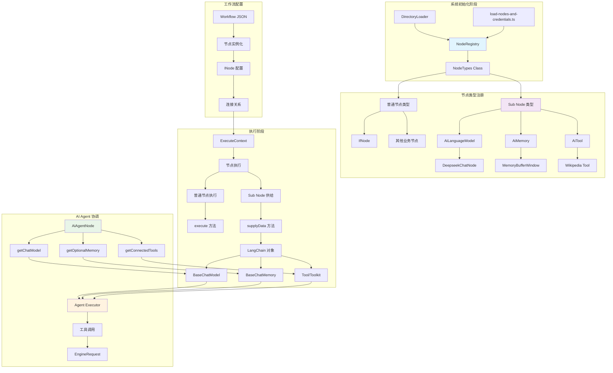
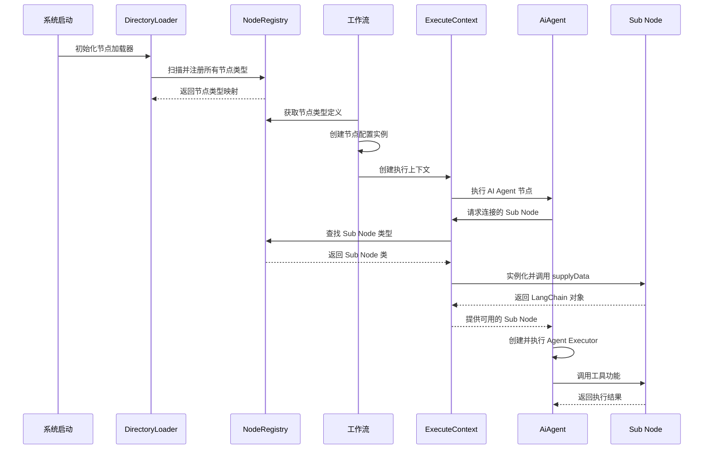
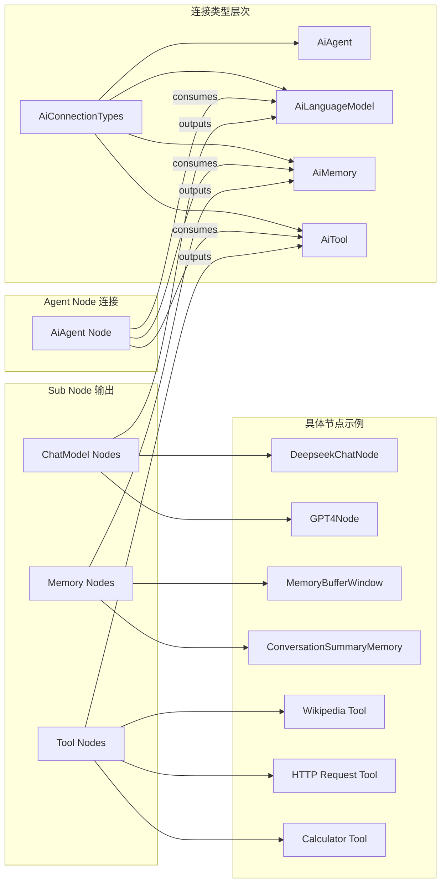

# n8n Node 设计架构分析报告

## 概述

n8n 是一个基于 TypeScript 的工作流自动化平台，采用了独特的节点架构设计。本文档详细分析了 n8n 中 Node 的创建流程、Sub Node 的注册和创建机制，以及它们之间的关系。

## 1. n8n 的 Node 创建流程

### 1.1 **没有使用传统的工厂模式**

n8n 并没有使用经典的工厂设计模式来创建 Node。相反，它采用了一种**基于类的实例化模式**结合**动态加载和注册系统**。

### 1.2 **Node 创建机制**

#### 加载和注册阶段

- **文件**: `/Users/yangjing/opensource/n8n/packages/cli/src/load-nodes-and-credentials.ts`
- **文件**: `/Users/yangjing/opensource/n8n/packages/core/src/nodes-loader/directory-loader.ts`

```typescript
// 节点从文件动态加载
loadNodeFromFile(filePath: string) {
    const tempNode = this.loadClass<INodeType | IVersionedNodeType>(filePath);
    this.nodeTypes[nodeType] = {
        type: tempNode,
        sourcePath: filePath,
    };
}
```

#### 类型解析阶段

- **文件**: `/Users/yangjing/opensource/n8n/packages/cli/src/node-types.ts`

```typescript
getByNameAndVersion(nodeType: string, version?: number): INodeType {
    const node = this.loadNodesAndCredentials.getNode(nodeType);
    const versionedNodeType = NodeHelpers.getVersionedNodeType(node.type, version);
    return versionedNodeType;
}
```

### 1.3 **工作流执行过程中的 Node 创建**

#### 执行栈创建

- **文件**: `/Users/yangjing/opensource/n8n/packages/core/src/execution-engine/workflow-execute.ts`

```typescript
// 工作流执行时，节点从配置数据创建
const nodeExecutionStack: IExecuteData[] = [
  {
    node: startNode, // 来自工作流配置的 INode 实例
    data: triggerData,
    source: null,
  },
];
```

#### 执行上下文创建

- **文件**: `/Users/yangjing/opensource/n8n/packages/core/src/execution-engine/node-execution-context/execute-context.ts`

```typescript
export class ExecuteContext extends BaseExecuteContext implements IExecuteFunctions {
    constructor(
        workflow: Workflow,
        node: INode,  // 要执行的节点实例
        additionalData: IWorkflowExecuteAdditionalData,
        // ...
    ) {
        super(...);
        // 初始化执行上下文
    }
}
```

### 1.4 **具体示例：IfNode 和 AiAgentNode**

#### IfNode 实现

- **文件**: `/Users/yangjing/opensource/n8n/packages/nodes-base/nodes/If/V2/IfV2.node.ts`

```typescript
export class IfV2 implements INodeType {
  description: INodeTypeDescription;

  constructor(baseDescription: INodeTypeBaseDescription) {
    this.description = {
      ...baseDescription,
      version: [2, 2.1, 2.2],
      // ... 配置信息
    };
  }

  async execute(this: IExecuteFunctions): Promise<INodeExecutionData[][]> {
    // 条件判断逻辑
    const trueItems: INodeExecutionData[] = [];
    const falseItems: INodeExecutionData[] = [];

    // 处理条件并路由数据
    return [trueItems, falseItems];
  }
}
```

#### AiAgentNode 实现

- **文件**: `/Users/yangjing/opensource/n8n/packages/@n8n/nodes-langchain/nodes/agents/Agent/V3/AgentV3.node.ts`

```typescript
export class AgentV3 implements INodeType {
  description: INodeTypeDescription;

  constructor(baseDescription: INodeTypeBaseDescription) {
    this.description = {
      ...baseDescription,
      version: [3],
      // ... AI 特定配置
    };
  }

  async execute(
    this: IExecuteFunctions,
    response?: EngineResponse<RequestResponseMetadata>
  ): Promise<INodeExecutionData[][] | EngineRequest<RequestResponseMetadata>> {
    return await toolsAgentExecute.call(this, response);
  }
}
```

### 1.5 **动态方法分配**

某些节点会动态分配执行方法：

- **文件**: `/Users/yangjing/opensource/n8n/packages/cli/src/node-types.ts`

```typescript
if (shouldAssignExecuteMethod(versionedNodeType)) {
  versionedNodeType.execute = async function (this: ExecuteContext) {
    const routingNode = new RoutingNode(this, versionedNodeType);
    const data = await routingNode.runNode();
    return data ?? [];
  };
}
```

## 2. Sub Node 的注册和创建机制

### 2.1 **基于连接类型的发现系统**

n8n 使用专门的连接类型来管理 AI 组件之间的关系：

```typescript
// 核心连接类型定义
NodeConnectionTypes.AiLanguageModel; // Chat Model 节点
NodeConnectionTypes.AiMemory; // Memory 节点
NodeConnectionTypes.AiTool; // Tool 节点
NodeConnectionTypes.AiAgent; // Agent 节点
```

### 2.2 **Chat Model 节点示例：DeepSeekChatNode**

#### 注册实现

- **文件**: `/Users/yangjing/opensource/n8n/packages/@n8n/nodes-langchain/nodes/llms/LmChatDeepSeek/LmChatDeepSeek.node.ts`

```typescript
export class LmChatDeepSeek implements INodeType {
  description: INodeTypeDescription = {
    displayName: 'DeepSeek Chat Model',
    name: 'lmChatDeepSeek',
    outputs: [NodeConnectionTypes.AiLanguageModel], // 声明输出类型
    outputNames: ['Model'],
    // ... 其他配置
  };

  async supplyData(this: ISupplyDataFunctions): Promise<SupplyData> {
    // 创建 LangChain 兼容的 ChatOpenAI 实例
    const model = new ChatOpenAI({
      apiKey: credentials.apiKey,
      model: modelName,
      ...options,
      callbacks: [new N8nLlmTracing(this)],
    });

    return {
      response: model, // 返回模型实例
    };
  }
}
```

#### Agent 中的发现和创建

- **文件**: `/Users/yangjing/opensource/n8n/packages/@n8n/nodes-langchain/nodes/agents/Agent/agents/ToolsAgent/common.ts`

```typescript
export async function getChatModel(
  ctx: IExecuteFunctions | ISupplyDataFunctions,
  index: number = 0
): Promise<BaseChatModel | undefined> {
  // 通过连接类型获取连接的模型
  const connectedModels = await ctx.getInputConnectionData(NodeConnectionTypes.AiLanguageModel, 0);

  let model;
  if (Array.isArray(connectedModels) && index !== undefined) {
    // 模型按工作流连接的相反顺序检索
    const reversedModels = [...connectedModels].reverse();
    model = reversedModels[index] as BaseChatModel;
  }

  // 验证模型是否支持工具调用
  if (!isChatInstance(model) || !model.bindTools) {
    throw new NodeOperationError(ctx.getNode(), 'Tools Agent requires Chat Model which supports Tools calling');
  }
  return model;
}
```

### 2.3 **Memory 节点示例：MemoryBufferWindow**

#### 注册实现

- **文件**: `/Users/yangjing/opensource/n8n/packages/@n8n/nodes-langchain/nodes/memory/MemoryBufferWindow/MemoryBufferWindow.node.ts`

```typescript
export class MemoryBufferWindow implements INodeType {
  description: INodeTypeDescription = {
    displayName: 'Simple Memory',
    name: 'memoryBufferWindow',
    outputs: [NodeConnectionTypes.AiMemory], // 声明输出类型
    outputNames: ['Memory'],
  };

  async supplyData(this: ISupplyDataFunctions): Promise<SupplyData> {
    const contextWindowLength = this.getNodeParameter('contextWindowLength', itemIndex) as number;
    const workflowId = this.getWorkflow().id;
    const memoryInstance = MemoryChatBufferSingleton.getInstance();

    const sessionId = getSessionId(this, itemIndex);
    const memory = await memoryInstance.getMemory(`${workflowId}__${sessionId}`, {
      k: contextWindowLength,
      inputKey: 'input',
      memoryKey: 'chat_history',
      outputKey: 'output',
      returnMessages: true,
    });

    return {
      response: logWrapper(memory, this), // 返回内存实例
    };
  }
}
```

#### 单例模式管理

```typescript
class MemoryChatBufferSingleton {
  private static instance: MemoryChatBufferSingleton;
  private memoryBuffer: Map<
    string,
    {
      buffer: BufferWindowMemory;
      created: Date;
      last_accessed: Date;
    }
  >;

  static getInstance(): MemoryChatBufferSingleton {
    if (!MemoryChatBufferSingleton.instance) {
      MemoryChatBufferSingleton.instance = new MemoryChatBufferSingleton();
    }
    return MemoryChatBufferSingleton.instance;
  }

  async getMemory(sessionKey: string, memoryParams: BufferWindowMemoryInput): Promise<BufferWindowMemory> {
    // 清理1小时前的旧实例
    await this.cleanupStaleBuffers();

    let memoryInstance = this.memoryBuffer.get(sessionKey);
    if (memoryInstance) {
      memoryInstance.last_accessed = new Date();
    } else {
      const newMemory = new BufferWindowMemory(memoryParams);
      this.memoryBuffer.set(sessionKey, {
        buffer: newMemory,
        created: new Date(),
        last_accessed: new Date(),
      });
    }
    return memoryInstance.buffer;
  }
}
```

### 2.4 **Tool 节点示例：Wikipedia Tool**

#### 注册实现

- **文件**: `/Users/yangjing/opensource/n8n/packages/@n8n/nodes-langchain/nodes/tools/ToolWikipedia/ToolWikipedia.node.ts`

```typescript
export class ToolWikipedia implements INodeType {
  description: INodeTypeDescription = {
    displayName: 'Wikipedia',
    name: 'toolWikipedia',
    outputs: [NodeConnectionTypes.AiTool], // 声明输出类型
    outputNames: ['Tool'],
  };

  async supplyData(this: ISupplyDataFunctions): Promise<SupplyData> {
    return {
      response: logWrapper(getTool(this), this), // 返回工具实例
    };
  }

  async execute(this: IExecuteFunctions): Promise<INodeExecutionData[][]> {
    const WikiTool = getTool(this);
    const items = this.getInputData();

    const response: INodeExecutionData[] = [];
    for (let itemIndex = 0; itemIndex < items.length; itemIndex++) {
      const item = items[itemIndex];
      const result = await WikiTool.invoke(item.json);
      response.push({
        json: { response: result },
        pairedItem: { item: itemIndex },
      });
    }
    return [response];
  }
}

function getTool(ctx: ISupplyDataFunctions | IExecuteFunctions): WikipediaQueryRun {
  const WikiTool = new WikipediaQueryRun();
  WikiTool.name = ctx.getNode().name;
  WikiTool.description =
    'A tool for interacting with and fetching data from the Wikipedia API. The input should always be a string query.';
  return WikiTool;
}
```

### 2.5 **Tool 发现和管理机制**

#### 工具发现函数

- **文件**: `/Users/yangjing/opensource/n8n/packages/@n8n/nodes-langchain/utils/helpers.ts`

```typescript
export const getConnectedTools = async (
  ctx: IExecuteFunctions | IWebhookFunctions | ISupplyDataFunctions,
  enforceUniqueNames: boolean,
  convertStructuredTool: boolean = true,
  escapeCurlyBrackets: boolean = false
) => {
  // 获取所有连接的工具
  const connectedTools = (
    ((await ctx.getInputConnectionData(NodeConnectionTypes.AiTool, 0)) as Array<Toolkit | Tool>) ?? []
  ).flatMap(toolOrToolkit => {
    if (toolOrToolkit instanceof Toolkit) {
      return toolOrToolkit.getTools() as Tool[];
    }
    return toolOrToolkit;
  });

  // 强制工具名称唯一性检查
  if (!enforceUniqueNames) return connectedTools;

  const seenNames = new Set<string>();
  const finalTools: Tool[] = [];

  for (const tool of connectedTools) {
    const { name } = tool;
    if (seenNames.has(name)) {
      throw new NodeOperationError(
        ctx.getNode(),
        `You have multiple tools with the same name: '${name}', please rename them to avoid conflicts`
      );
    }
    seenNames.add(name);

    if (convertStructuredTool && tool instanceof N8nTool) {
      finalTools.push(tool.asDynamicTool());
    } else {
      finalTools.push(tool);
    }
  }

  return finalTools;
};
```

### 2.6 **动态工具创建机制**

#### 节点转换为工具

- **文件**: `/Users/yangjing/opensource/n8n/packages/core/src/execution-engine/node-execution-context/utils/create-node-as-tool.ts`

```typescript
export function createNodeAsTool(options: CreateNodeAsToolOptions) {
  return { response: createTool(options) };
}

function createTool(options: CreateNodeAsToolOptions) {
  const { node, nodeType, handleToolInvocation } = options;

  // 从节点参数生成模式
  const schema = getSchema(node);
  const description = NodeHelpers.getToolDescriptionForNode(node, nodeType);
  const nodeName = nodeNameToToolName(node);
  const name = nodeName || nodeType.description.name;

  return new DynamicStructuredTool({
    name,
    description,
    schema,
    func: async (toolArgs: z.infer<typeof schema>) => await handleToolInvocation(toolArgs),
  });
}

// 将节点名称转换为有效的工具名称
export function nodeNameToToolName(nodeOrName: INode | string): string {
  const name = typeof nodeOrName === 'string' ? nodeOrName : nodeOrName.name;
  return name.replace(/[^a-zA-Z0-9_-]+/g, '_');
}
```

#### 模式生成

```typescript
function getSchema(node: INode) {
  const collectedArguments: FromAIArgument[] = [];
  try {
    // 遍历节点参数，收集标记为 $fromAI 的参数
    traverseNodeParameters(node.parameters, collectedArguments);
  } catch (error) {
    throw new NodeOperationError(node, error as Error);
  }

  // 验证和去重参数
  const nameValidationRegex = /^[a-zA-Z0-9_-]{1,64}$/;
  const keyMap = new Map<string, FromAIArgument>();

  for (const argument of collectedArguments) {
    if (argument.key.length === 0 || !nameValidationRegex.test(argument.key)) {
      throw new NodeOperationError(node, `Parameter key \`${argument.key}\` is invalid`);
    }
    // ... 验证逻辑
  }

  // 从验证过的参数生成 Zod 模式
  const schemaObj = uniqueArguments.reduce((acc: Record<string, z.ZodTypeAny>, placeholder) => {
    acc[placeholder.key] = generateZodSchema(placeholder);
    return acc;
  }, {});

  return z.object(schemaObj).required();
}
```

### 2.7 **Agent 执行流程中的工具调用**

#### 工具调用请求创建

- **文件**: `/Users/yangjing/opensource/n8n/packages/@n8n/nodes-langchain/nodes/agents/Agent/agents/ToolsAgent/V3/execute.ts`

```typescript
// 为工具调用创建引擎请求
function createEngineRequests(
  ctx: IExecuteFunctions | ISupplyDataFunctions,
  toolCalls: ToolCallRequest[],
  itemIndex: number
) {
  // 获取连接的子节点
  const connectedSubnodes = ctx.getParentNodes(ctx.getNode().name, {
    connectionType: NodeConnectionTypes.AiTool,
    depth: 1,
  });

  return toolCalls.map(toolCall => ({
    nodeName:
      connectedSubnodes.find((node: { name: string }) => nodeNameToToolName(node.name) === toolCall.tool)?.name ??
      toolCall.tool,
    input: toolCall.toolInput,
    type: NodeConnectionTypes.AiTool,
    id: toolCall.toolCallId,
    metadata: { itemIndex },
  }));
}

// 主要的代理执行流程
export async function toolsAgentExecute(
  this: IExecuteFunctions | ISupplyDataFunctions,
  response?: EngineResponse<RequestResponseMetadata>
): Promise<INodeExecutionData[][] | EngineRequest<RequestResponseMetadata>> {
  // 获取必需的组件
  const memory = await getOptionalMemory(this);
  const model = await getChatModel(this, 0);
  const tools = await getTools(this, outputParser);

  // 创建代理执行器
  const executor = createAgentSequence(model, tools, prompt, options, outputParser, memory, fallbackModel);

  // 执行代理
  const result = await executor.invoke({
    input,
    steps,
    system_message: options.systemMessage,
    formatting_instructions: formattingInstructions,
  });

  // 通过返回引擎请求处理工具调用
  if ('actions' in response) {
    return {
      actions: response.actions,
      metadata: response.metadata,
    };
  }

  return [returnData];
}
```

### 2.8 **N8nTool 包装器**

#### 工具包装和执行

- **文件**: `/Users/yangjing/opensource/n8n/packages/@n8n/nodes-langchain/utils/N8nTool.ts`

```typescript
export class N8nTool extends DynamicStructuredTool<ZodObjectAny> {
  constructor(private context: ISupplyDataFunctions, fields: DynamicStructuredToolInput<ZodObjectAny>) {
    super(fields);
  }

  asDynamicTool(): DynamicTool {
    const { name, func, schema, context, description } = this;
    const parser = new StructuredOutputParser(schema);

    const wrappedFunc = async function (query: string) {
      let parsedQuery: object;

      try {
        // 尝试使用结构化解析器解析查询
        parsedQuery = await parser.parse(query);
      } catch (e) {
        // 回退解析机制
        try {
          dataFromModel = jsonParse<IDataObject>(query, { acceptJSObject: true });
        } catch (error) {
          // 处理单参数情况
          if (Object.keys(schema.shape).length === 1) {
            const parameterName = Object.keys(schema.shape)[0];
            dataFromModel = { [parameterName]: query };
          } else {
            throw new NodeOperationError(context.getNode(), `Input is not a valid JSON: ${error.message}`);
          }
        }
        parsedQuery = schema.parse(dataFromModel);
      }

      try {
        const result = await func(parsedQuery);
        return result;
      } catch (e) {
        // 处理工具执行错误
        const { index } = context.addInputData(NodeConnectionTypes.AiTool, [[{ json: { query } }]]);
        void context.addOutputData(NodeConnectionTypes.AiTool, index, e);
        return e.toString();
      }
    };

    return new DynamicTool({
      name,
      description: prepareFallbackToolDescription(description, schema),
      func: wrappedFunc,
    });
  }
}
```

## 3. NodeRegistry、普通 Node 和 Sub Node 的关系

### 3.1 **架构关系图**



### 3.2 **节点生命周期图**



### 3.3 **连接类型和节点关系图**



## 4. 关键实现模式总结

### 4.1 **Node 创建流程**

1. **系统初始化时**：从文件系统加载所有 Node 类定义
2. **注册阶段**：将 Node 类型注册到中央注册表
3. **工作流执行时**：从 JSON 配置创建 Node 实例
4. **执行上下文包装**：为每个 Node 执行创建专门的上下文对象
5. **调用执行方法**：在适当的上下文中调用 Node 的 execute 方法

### 4.2 **Sub Node 注册和创建流程**

1. **声明阶段**：每个 Sub Node 通过 `outputs` 和 `outputNames` 声明其提供的连接类型
2. **实现阶段**：通过 `supplyData` 方法提供 LangChain 兼容的对象实例
3. **发现阶段**：Agent 通过 `getInputConnectionData` 和连接类型发现可用的 Sub Node
4. **验证阶段**：系统验证 Sub Node 的兼容性和功能完整性
5. **集成阶段**：Sub Node 被集成到 Agent 的执行上下文中
6. **执行阶段**：Agent 在执行时动态调用 Sub Node 的功能

### 4.3 **核心设计原则**

1. **基于类的实例化**：避免工厂模式的复杂性，使用直接的类实例化
2. **连接类型驱动**：通过标准化的连接类型实现组件间的松耦合
3. **延迟加载**：按需加载和创建节点实例，提高系统性能
4. **类型安全**：使用 TypeScript 接口确保组件间的类型兼容性
5. **错误处理**：完善的错误处理和验证机制
6. **扩展性**：通过标准接口支持自定义节点和工具的开发

### 4.4 **技术栈集成**

- **LangChain 深度集成**：所有 AI 组件都基于 LangChain 的标准接口
- **动态工具创建**：支持将任意节点转换为 AI 可用的工具
- **内存管理**：使用单例模式管理内存状态，支持会话持久化
- **并发执行**：支持工具的并发调用和结果聚合

这种架构设计使得 n8n 能够灵活地支持各种自动化工作流，特别是在 AI 领域提供了强大的组件化能力，让用户可以轻松构建复杂的 AI Agent 系统。
