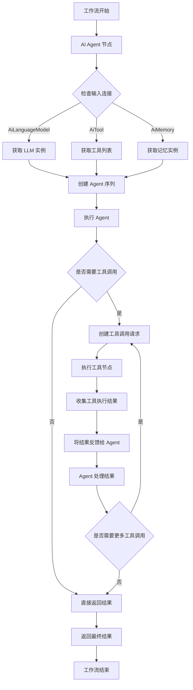

# n8n 中 AI Agent 与 LLM 节点数据流转分析

## 概述

本文档分析了 n8n 中 AI Agent 节点调用 LLM 节点时的数据流转机制，包括主要的技术架构、实现方式以及节点间的数据流转过程。

## 1. 技术架构概述

### 1.1 节点连接类型

n8n 使用不同的连接类型来区分节点间的数据流：

- `NodeConnectionTypes.AiLanguageModel` - 用于连接语言模型
- `NodeConnectionTypes.AiTool` - 用于连接工具
- `NodeConnectionTypes.AiMemory` - 用于连接记忆组件
- `NodeConnectionTypes.Main` - 主要数据流连接

### 1.2 执行引擎架构

n8n 的工作流执行引擎基于以下核心组件：

- **WorkflowExecute**: 负责整个工作流的执行协调
- **RoutingNode**: 处理节点的具体执行逻辑
- **ExecuteContext**: 提供节点执行时的上下文和环境

### 1.3 AI Agent 架构

AI Agent 节点基于 LangChain 的 Tools Agent 实现，主要组件包括：

- **AgentV3**: AI Agent 的主要实现类
- **ToolsAgent**: 工具调用代理的核心逻辑
- **createToolCallingAgent**: 创建支持工具调用的代理

## 2. AI Agent 与 LLM 节点之间的数据流转

### 2.1 整体数据流转图



### 2.2 详细数据流转过程

#### 2.2.1 AI Agent 获取 LLM 实例

AI Agent 通过 `getChatModel` 函数获取连接的 LLM 实例：

```typescript
// packages/@n8n/nodes-langchain/nodes/agents/Agent/agents/ToolsAgent/common.ts
export async function getChatModel(
  ctx: IExecuteFunctions | ISupplyDataFunctions,
  index: number = 0,
): Promise<BaseChatModel | undefined> {
  const connectedModels = await ctx.getInputConnectionData(NodeConnectionTypes.AiLanguageModel, 0);

  let model;

  if (Array.isArray(connectedModels) && index !== undefined) {
    if (connectedModels.length <= index) {
      return undefined;
    }
    // We get the models in reversed order from the workflow so we need to reverse them to match the right index
    const reversedModels = [...connectedModels].reverse();
    model = reversedModels[index] as BaseChatModel;
  } else {
    model = connectedModels as BaseChatModel;
  }

  if (!isChatInstance(model) || !model.bindTools) {
    throw new NodeOperationError(
      ctx.getNode(),
      'Tools Agent requires Chat Model which supports Tools calling',
    );
  }
  return model;
}
```

#### 2.2.2 LLM 节点提供模型实例

LLM 节点通过 `supplyData` 方法提供模型实例给 AI Agent：

```typescript
// packages/@n8n/nodes-langchain/nodes/chains/ChainLLM/methods/processItem.ts
async function getChatModel(
  ctx: IExecuteFunctions,
  index: number = 0,
): Promise<BaseLanguageModel | undefined> {
  const connectedModels = await ctx.getInputConnectionData(NodeConnectionTypes.AiLanguageModel, 0);

  let model;

  if (Array.isArray(connectedModels) && index !== undefined) {
    if (connectedModels.length <= index) {
      return undefined;
    }
    // We get the models in reversed order from the workflow so we need to reverse them again to match the right index
    const reversedModels = [...connectedModels].reverse();
    model = reversedModels[index] as BaseChatModel;
  } else {
    model = connectedModels as BaseLanguageModel;
  }

  return model;
}
```

#### 2.2.3 AI Agent 执行流程

AI Agent 的执行流程在 `toolsAgentExecute` 函数中实现：

```typescript
// packages/@n8n/nodes-langchain/nodes/agents/Agent/agents/ToolsAgent/V3/execute.ts
export async function toolsAgentExecute(
  this: IExecuteFunctions | ISupplyDataFunctions,
  response?: EngineResponse<RequestResponseMetadata>,
): Promise<INodeExecutionData[][] | EngineRequest<RequestResponseMetadata>> {
  // 获取输入数据
  const items = this.getInputData();

  // 获取连接的 LLM 实例
  const model = await getChatModel(this, 0);
  assert(model, 'Please connect a model to the Chat Model input');

  // 获取连接的工具
  const tools = await getTools(this, outputParser);

  // 创建 Agent 序列
  const executor = createAgentSequence(
    model,
    tools,
    prompt,
    options,
    outputParser,
    memory,
    fallbackModel,
  );

  // 执行 Agent
  const response = await executor.invoke({
    ...invokeParams,
    chat_history: chatHistory,
  });

  // 处理响应
  if ('returnValues' in response) {
    // 处理返回值
    return response.returnValues;
  }

  // 如果响应包含工具调用，创建请求对象
  const actions = createEngineRequests(this, response, itemIndex);

  return {
    actions,
    metadata: { previousRequests: buildSteps(response, itemIndex) },
  };
}
```

#### 2.2.4 工作流执行引擎处理节点间数据流转

工作流执行引擎通过 `WorkflowExecute` 类协调节点间的数据流转：

```typescript
// packages/core/src/execution-engine/workflow-execute.ts
private async executeNode(
  workflow: Workflow,
  node: INode,
  nodeType: INodeType,
  customOperation: ReturnType<WorkflowExecute['getCustomOperation']>,
  additionalData: IWorkflowExecuteAdditionalData,
  mode: WorkflowExecuteMode,
  runExecutionData: IRunExecutionData,
  runIndex: number,
  connectionInputData: INodeExecutionData[],
  inputData: ITaskDataConnections,
  executionData: IExecuteData,
  abortSignal?: AbortSignal,
  subNodeExecutionResults?: EngineResponse,
): Promise<IRunNodeResponse | EngineRequest> {
  // 创建执行上下文
  const context = new ExecuteContext(
    workflow,
    node,
    additionalData,
    mode,
    runExecutionData,
    runIndex,
    connectionInputData,
    inputData,
    executionData,
    closeFunctions,
    abortSignal,
    subNodeExecutionResults,
  );

  // 执行节点
  let data: INodeExecutionData[][] | EngineRequest | null;

  if (customOperation) {
    data = await customOperation.call(context);
  } else if (nodeType.execute) {
    data =
      nodeType instanceof Node
        ? await nodeType.execute(context, subNodeExecutionResults)
        : await nodeType.execute.call(context, subNodeExecutionResults);
  }

  // 处理引擎请求
  if (isEngineRequest(data)) {
    return data;
  }

  return { data, hints: context.hints };
}
```

### 2.3 数据流转的关键步骤

1. **初始化阶段**:
   - AI Agent 节点检查输入连接
   - 通过 `getInputConnectionData` 获取连接的 LLM 实例
   - 获取连接的工具和记忆组件

2. **执行准备阶段**:
   - 创建 Agent 序列 (`createAgentSequence`)
   - 准备提示消息 (`prepareMessages`)
   - 创建提示模板 (`preparePrompt`)

3. **执行阶段**:
   - 调用 Agent 执行 (`executor.invoke`)
   - 处理流式响应或常规响应
   - 捕获工具调用请求

4. **工具调用阶段**:
   - 创建引擎请求 (`createEngineRequests`)
   - 执行工具节点
   - 收集工具执行结果

5. **结果处理阶段**:
   - 将工具执行结果反馈给 Agent
   - Agent 处理结果并决定是否需要更多工具调用
   - 返回最终结果

## 3. 关键实现细节

### 3.1 连接数据获取

AI Agent 通过 `getInputConnectionData` 方法获取连接的 LLM 实例：

```typescript
const connectedModels = await ctx.getInputConnectionData(NodeConnectionTypes.AiLanguageModel, 0);
```

这个方法由 n8n 的执行引擎提供，负责从工作流连接中获取实际的模型实例。

### 3.2 工具调用处理

当 AI Agent 需要调用工具时，它会创建一个 `EngineRequest` 对象：

```typescript
function createEngineRequests(
  ctx: IExecuteFunctions | ISupplyDataFunctions,
  toolCalls: ToolCallRequest[],
  itemIndex: number,
) {
  const connectedSubnodes = ctx.getParentNodes(ctx.getNode().name, {
    connectionType: NodeConnectionTypes.AiTool,
    depth: 1,
  });
  return toolCalls.map((toolCall) => ({
    nodeName:
      connectedSubnodes.find(
        (node: { name: string }) => nodeNameToToolName(node.name) === toolCall.tool,
      )?.name ?? toolCall.tool,
    input: toolCall.toolInput,
    type: NodeConnectionTypes.AiTool,
    id: toolCall.toolCallId,
    metadata: {
      itemIndex,
    },
  }));
}
```

工作流执行引擎会处理这些请求，执行相应的工具节点，并将结果返回给 AI Agent。

### 3.3 流式响应处理

对于支持流式响应的 LLM，AI Agent 可以处理实时令牌流：

```typescript
const eventStream = executor.streamEvents(
  {
    ...invokeParams,
    chat_history: chatHistory,
  },
  {
    version: 'v2',
    ...executeOptions,
  },
);

const result = await processEventStream(
  this,
  eventStream,
  itemIndex,
  options.returnIntermediateSteps,
  memory,
  input,
);
```

## 4. 总结

n8n 中 AI Agent 与 LLM 节点之间的数据流转基于以下核心机制：

1. **连接类型区分**: 通过不同的连接类型（AiLanguageModel、AiTool、AiMemory）区分不同类型的数据流
2. **实例获取**: AI Agent 通过 `getInputConnectionData` 获取连接的 LLM 实例
3. **执行协调**: 工作流执行引擎协调节点间的执行和数据传递
4. **工具调用**: 通过 EngineRequest 机制实现 AI Agent 对工具的调用
5. **结果反馈**: 工具执行结果通过 EngineResponse 返回给 AI Agent

这种设计使得 AI Agent 可以灵活地与各种 LLM 和工具节点集成，实现复杂的 AI 工作流。
