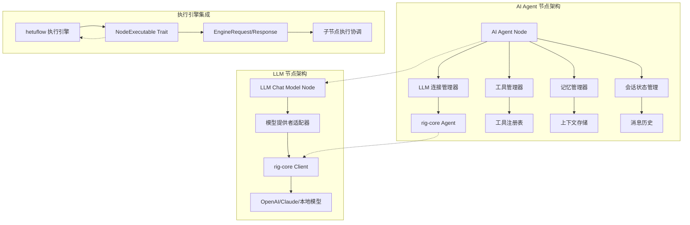
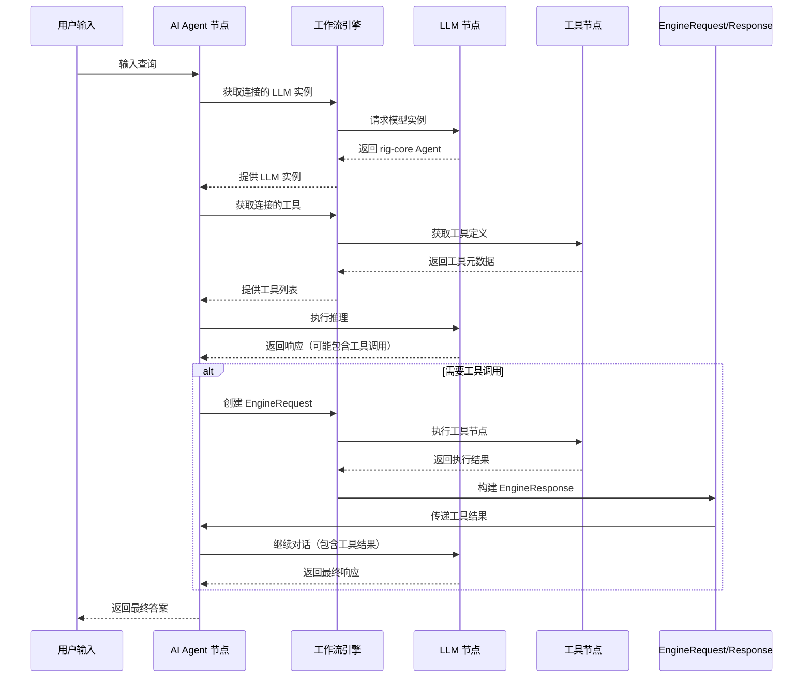

# hetuflow AI Agent 与 LLM Chat Model 节点技术实现方案

## 概述

本文档基于对 n8n AI Agent 与 LLM 节点数据流转机制的分析，结合 hetuflow/hetumind 项目的技术架构，提出了完整的 AI Agent 和 LLM Chat Model 节点技术实现方案。该方案充分利用了 rig-core 的 AI 能力，并与 hetumind 现有的工作流引擎深度集成。

## 最新实现状态

### ✅ 已完成的优化

1. **rig-core 深度集成**：
   - 在 `hetumind-nodes/Cargo.toml` 中添加了 `rig-core` 依赖
   - AI Agent V1 节点集成了 rig-core Agent 和 AgentBuilder
   - LLM Chat Model V1 节点支持 OpenAI 和 Anthropic 模型

2. **API 密钥管理优化**：
   - LLM 节点新增 `credential_id` 参数支持
   - 实现了从凭证服务获取 API 密钥的框架
   - 保留环境变量和直接配置的兼容性

3. **工具调用机制完善**：
   - 创建了 `ToolManager` 工具管理器
   - 实现了动态工具转换框架
   - 支持 JSON 格式的工具定义

### 🔧 技术架构更新

## 1. 技术架构设计

### 1.1 整体架构概览



### 1.2 核心组件说明

#### 1.2.1 依赖管理策略

基于项目实际情况，采用以下依赖管理策略：

- **hetumind-nodes 直接依赖 rig-core**：在 `Cargo.toml` 中添加了 `rig-core = { workspace = true, features = ["derive"] }`
- **API 密钥管理**：通过 `credential_svc` 服务管理，基于 `CredentialEntity` 实体
- **工具节点标准化**：采用 JSON 格式作为输入/输出格式，使用 `ExecutionDataMap` 数据类型

#### 1.2.2 连接类型设计

基于 n8n 的设计，我们定义以下连接类型：

- 复用在 `hetumind/hetumind-core/src/workflow/connection.rs` 中定义的 `ConnectionKind` enum类型

#### 1.2.3 EngineRequest/Response 架构

```rust
// 在 hetumind-core/src/workflow/engine_request.rs 中
use serde::{Serialize, Deserialize};
use uuid::Uuid;
use ahash::HashMap;

#[derive(Debug, Clone, Serialize, Deserialize)]
pub struct EngineRequest<T = HashMap<String, JsonValue>> {
    /// 需要执行的动作列表
    pub actions: Vec<EngineAction>,
    /// 请求元数据
    pub metadata: T,
    /// 请求ID
    pub request_id: Uuid,
}

#[derive(Debug, Clone, Serialize, Deserialize)]
pub enum EngineAction {
    /// 执行节点动作
    ExecuteNode(ExecuteNodeAction),
    /// 获取连接数据动作
    GetConnectionData(GetConnectionDataAction),
}

#[derive(Debug, Clone, Serialize, Deserialize)]
pub struct ExecuteNodeAction {
    /// 目标节点名称
    pub node_name: String,
    /// 输入数据
    pub input: JsonValue,
    /// 连接类型
    pub connection_type: ConnectionKind,
    /// 动作ID
    pub action_id: Uuid,
    /// 动作元数据
    pub metadata: HashMap<String, JsonValue>,
}

#[derive(Debug, Clone, Serialize, Deserialize)]
pub struct EngineResponse<T = HashMap<String, JsonValue>> {
    /// 动作响应列表
    pub action_responses: Vec<EngineResult>,
    /// 响应元数据
    pub metadata: T,
    /// 响应ID（对应请求ID）
    pub response_id: Uuid,
}

#[derive(Debug, Clone, Serialize, Deserialize)]
pub struct EngineResult {
    /// 对应的动作
    pub action: EngineAction,
    /// 执行结果数据
    pub data: ExecutionDataMap,
    /// 执行状态
    pub status: ExecutionStatus,
}
```

## 2. AI Agent 节点实现

### 2.1 节点定义和注册

```rust
// 在 hetumind-nodes/src/core/ai_agent/mod.rs 中
use hetumind_core::{
  version::Version,
  workflow::{Node, NodeRegistry, RegistrationError},
};
use std::sync::Arc;

pub mod ai_agent_v1;
pub mod parameters;
pub mod tool_manager;

use ai_agent_v1::AiAgentV1;

pub struct AiAgentNode {
  default_version: Version,
  executors: Vec<NodeExecutor>,
}

impl AiAgentNode {
  pub fn new() -> Result<Self, RegistrationError> {
    let executors: Vec<NodeExecutor> = vec![Arc::new(AiAgentV1::new()?)];
    let default_version = executors.iter().map(|node| node.definition().version.clone()).max().unwrap();
    Ok(Self { default_version, executors })
  }
}

impl Node for AiAgentNode {
  fn default_version(&self) -> &Version {
    &self.default_version
  }

  fn node_executors(&self) -> &[NodeExecutor] {
    &self.executors
  }

  fn kind(&self) -> NodeKind {
    self.executors[0].definition().kind.clone()
  }
}

pub fn register_nodes(node_registry: &NodeRegistry) -> Result<(), RegistrationError> {
  let ai_agent_node = Arc::new(AiAgentNode::new()?);
  node_registry.register_node(ai_agent_node)?;
  Ok(())
}
```

### 2.2 AI Agent V1 实现（已优化）

```rust
// 在 hetumind-nodes/src/core/ai_agent/ai_agent_v1.rs 中
use std::sync::Arc;

use ahash::{HashMap, HashMapExt};
use async_trait::async_trait;
use hetumind_core::{
    types::JsonValue,
    version::Version,
    workflow::{
        ConnectionKind, EngineAction, EngineRequest, EngineResponse, ExecuteNodeAction,
        ExecutionData, ExecutionDataItems, ExecutionDataMap, InputPortConfig, NodeDefinition,
        NodeDefinitionBuilder, NodeExecutable, NodeExecutionContext, NodeExecutionError,
        NodeProperty, NodePropertyKind, OutputPortConfig, RegistrationError, make_execution_data_map,
    },
};
use rig::{
    agent::{Agent, AgentBuilder},
    completion::Prompt,
    tool::Tool,
};
use serde_json::json;
use uuid::Uuid;

use crate::core::ai_agent::parameters::ToolExecutionStatus;
use crate::core::ai_agent::tool_manager::ToolManager;

use super::parameters::{AiAgentConfig, ModelInstance, ToolCallRequest, ToolCallResult};

#[derive(Debug)]
pub struct AiAgentV1 {
    pub definition: Arc<NodeDefinition>,
    tool_manager: Arc<tokio::sync::RwLock<ToolManager>>,
}

impl AiAgentV1 {
    pub fn new() -> Result<Self, RegistrationError> {
        let definition = NodeDefinitionBuilder::new("ai_agent", "1.0.0")
            .description("AI Agent 节点，支持工具调用和记忆功能")
            .category("AI")
            .icon("🤖")

            // 输入端口
            .inputs([
              InputPortConfig::builder()
                .kind(ConnectionKind::main)
                .display_name("Main Input")
                .required(true)
                .build(),
              InputPortConfig::builder()
                .kind(ConnectionKind::AiLanguageModel)
                .display_name("Large Language Model")
                .required(true)
                .max_connections(1)
                .build(),
              InputPortConfig::builder()
                .kind(ConnectionKind::AiMemory)
                .display_name("Memory(Vector storage)")
                .required(false)
                .build(),
              InputPortConfig::builder()
                .kind(ConnectionKind::AiTool)
                .display_name("AI Tool")
                .required(false)
                .build(),
            ])

            // 输出端口
            .outputs([
                OutputPortConfig::builder()
                  .kind(ConnectionKind::Main)
                  .display_name("AI 响应输出")
                  .build(),
                OutputPortConfig::builder()
                  .kind(ConnectionKind::ToolCalls)
                  .display_name("工具调用请求")
                  .build(),
                OutputPortConfig::builder()
                  .kind(ConnectionKind::Error)
                  .display_name("错误输出")
                  .build(),
            ])

            // 参数
            .properties([
                NodeProperty::builder()
                  .name("system_prompt")
                  .kind(NodePropertyKind::String)
                  .display_name("系统提示词")
                  .value("你是一个有帮助的AI助手")
                  .required(false),
                NodeProperty::builder()
                  .name("max_iterations")
                  .kind(NodePropertyKind::Number)
                  .display_name("最大迭代次数")
                  .value(10)
                  .required(false),
                NodeProperty::builder()
                  .name("temperature")
                  .kind(NodePropertyKind::Number)
                  .display_name("温度参数")
                  .value(0.7)
                  .required(false),
            ])

            .build()?;

        Ok(Self { definition })
    }
}

#[async_trait]
impl NodeExecutable for AiAgentV1 {
    async fn execute(
        &self,
        context: &dyn NodeExecutionContext,
        engine_response: Option<&EngineResponse>,
    ) -> Result<ExecutionDataMap, NodeExecutionError> {
        // 1. 获取输入数据和配置
        let input_data = context.get_input_data("main")?;
        let config: AiAgentConfig = context.get_parameters()?;

        // 2. 处理引擎响应（工具调用结果）
        if let Some(response) = engine_response {
            return self.handle_tool_responses(context, response, &config).await;
        }

        // 3. 获取连接的 LLM 实例
        let llm_instance = self.get_llm_instance(context).await?;

        // 4. 获取连接的工具
        let tools = self.get_tools(context).await?;

        // 5. 创建 Agent
        let agent = self.create_agent(llm_instance, tools, &config).await?;

        // 6. 执行 Agent
        let result = agent.prompt(&input_data.to_string()).await
            .map_err(|e| NodeExecutionError::ExecutionFailed(e.to_string()))?;

        // 7. 解析响应，检查是否需要工具调用
        if let Some(tool_calls) = self.parse_tool_calls(&result) {
            // 返回引擎请求以执行工具
            return self.create_engine_request(context, tool_calls, &config).await;
        }

        // 8. 返回最终结果
        Ok(make_execution_data_map! {
            "main" => ExecutionDataItems::Single(json!({
                "response": result,
                "agent_type": "ai_agent_v1",
                "timestamp": chrono::Utc::now().timestamp(),
            }))
        })
    }

    fn get_definition(&self) -> &Arc<NodeDefinition> {
        &self.definition
    }
}

impl AiAgentV1 {
    async fn get_llm_instance(&self, context: &dyn NodeExecutionContext)
        -> Result<rig::agent::Agent, NodeExecutionError> {
        // 通过连接类型获取 LLM 实例
        let connection_data = context.get_connection_data(ConnectionKind::AiLanguageModel, 0)
            .await
            .ok_or_else(|| NodeExecutionError::ConnectionError("No LLM model connected".to_string()))?;

        // 解析 LLM 实例
        // 这里需要根据实际的 LLM 节点实现来解析实例
        self.parse_llm_instance(connection_data)
    }

    async fn get_tools(&self, context: &dyn NodeExecutionContext)
        -> Result<Vec<rig::tool::Tool>, NodeExecutionError> {
        // 获取所有连接的工具
        let tool_connections = context.get_all_connections(ConnectionKind::AiTool)
            .await;

        let mut tools = Vec::new();
        for connection in tool_connections {
            if let Ok(tool) = self.parse_tool_instance(connection) {
                tools.push(tool);
            }
        }

        Ok(tools)
    }

    async fn create_agent(
        &self,
        llm: rig::agent::Agent,
        tools: Vec<rig::tool::Tool>,
        config: &AiAgentConfig,
    ) -> Result<rig::agent::Agent, NodeExecutionError> {
        // 使用 rig-core 的 AgentBuilder 创建 Agent
        let mut agent_builder = AgentBuilder::new(llm)
            .with_system_prompt(&config.system_prompt)
            .with_max_iterations(config.max_iterations);

        if !tools.is_empty() {
            agent_builder = agent_builder.with_tools(tools);
        }

        agent_builder.build()
            .map_err(|e| NodeExecutionError::ConfigurationError(e.to_string()))
    }

    async fn handle_tool_responses(
        &self,
        context: &dyn NodeExecutionContext,
        response: &EngineResponse,
        config: &AiAgentConfig,
    ) -> Result<ExecutionDataMap, NodeExecutionError> {
        // 处理工具执行结果，继续对话
        let tool_results: Vec<ToolCallResult> = response.action_responses.iter()
            .filter_map(|ar| self.extract_tool_result(ar))
            .collect();

        // 构建包含工具结果的提示
        let prompt = self.build_prompt_with_tool_results(context, tool_results, config).await?;

        // 获取 Agent 并执行
        let llm_instance = self.get_llm_instance(context).await?;
        let tools = self.get_tools(context).await?;
        let agent = self.create_agent(llm_instance, tools, config).await?;

        let final_response = agent.prompt(&prompt).await
            .map_err(|e| NodeExecutionError::ExecutionFailed(e.to_string()))?;

        Ok(make_execution_data_map! {
            "main" => ExecutionDataItems::Single(json!({
                "response": final_response,
                "tool_results": tool_results,
                "agent_type": "ai_agent_v1",
                "timestamp": chrono::Utc::now().timestamp(),
            }))
        })
    }

    async fn create_engine_request(
        &self,
        context: &dyn NodeExecutionContext,
        tool_calls: Vec<ToolCallRequest>,
        config: &AiAgentConfig,
    ) -> Result<ExecutionDataMap, NodeExecutionError> {
        let actions: Vec<EngineAction> = tool_calls.into_iter().map(|tool_call| {
            EngineAction::ExecuteNode(ExecuteNodeAction {
                node_name: tool_call.tool_name,
                input: tool_call.parameters,
                connection_type: ConnectionKind::AiTool,
                action_id: uuid::Uuid::new_v4(),
                metadata: {
                    let mut meta = HashMap::new();
                    meta.insert("tool_call_id".to_string(), json!(tool_call.id));
                    meta.insert("tool_name".to_string(), json!(tool_call.tool_name));
                    meta
                },
            })
        }).collect();

        let engine_request = EngineRequest {
            actions,
            metadata: {
                let mut meta = HashMap::new();
                meta.insert("request_type".to_string(), json!("tool_execution"));
                meta.insert("config".to_string(), json!(config));
                meta
            },
            request_id: uuid::Uuid::new_v4(),
        };

        Ok(make_execution_data_map! {
            "tool_calls" => ExecutionDataItems::Single(json!(engine_request))
        })
    }
}
```

### 2.3 配置结构

```rust
// 在 hetumind-nodes/src/core/ai_agent/parameters.rs 中
use serde::{Deserialize, Serialize};

#[derive(Debug, Clone, Serialize, Deserialize)]
pub struct AiAgentConfig {
    pub system_prompt: String,
    pub max_iterations: u32,
    pub temperature: f64,
    pub enable_streaming: bool,
    pub memory_config: Option<MemoryConfig>,
}

#[derive(Debug, Clone, Serialize, Deserialize)]
pub struct MemoryConfig {
    pub max_history: usize,
    pub persistence_enabled: bool,
    pub context_window: usize,
}

#[derive(Debug, Clone, Serialize, Deserialize)]
pub struct ToolCallRequest {
    pub id: String,
    pub tool_name: String,
    pub parameters: JsonValue,
}

#[derive(Debug, Clone, Serialize, Deserialize)]
pub struct ToolCallResult {
    pub tool_call_id: String,
    pub tool_name: String,
    pub result: JsonValue,
    pub status: ToolExecutionStatus,
}

#[derive(Debug, Clone, Serialize, Deserialize)]
pub enum ToolExecutionStatus {
    Success,
    Error(String),
    Timeout,
}
```

## 3. LLM Chat Model 节点实现

### 3.1 节点定义

```rust
// 在 hetumind-nodes/src/core/llm_chat_model/mod.rs 中
use std::sync::Arc;
use hetumind_core::workflow::{NodeRegistry, RegistrationError};

pub mod llm_chat_model_v1;
pub mod utils;

pub use llm_chat_model_v1::LlmChatModelV1;

pub fn register_nodes(node_registry: &NodeRegistry) -> Result<(), RegistrationError> {
    let llm_node = Arc::new(LlmChatModelV1::new()?);
    node_registry.register_node(llm_node)?;
    Ok(())
}
```

### 3.2 LLM Chat Model V1 实现

```rust
// 在 hetumind-nodes/src/core/llm_chat_model/llm_chat_model_v1.rs 中
use std::sync::Arc;
use async_trait::async_trait;
use hetumind_core::{
    types::JsonValue,
    workflow::{
        ConnectionKind, ExecutionDataItems, ExecutionDataMap, NodeDefinition,
        NodeDefinitionBuilder, NodeExecutable, NodeExecutionContext, NodeExecutionError,
        NodeProperty, NodePropertyKind, InputPortConfig, OutputPortConfig, RegistrationError,
    },
};
use rig::{
    completion::Prompt,
    providers::{
        openai::{Client as OpenAIClient, GPT_4},
        anthropic::{Client as AnthropicClient, CLAUDE_3_OPUS},
    },
};
use serde_json::json;

#[derive(Debug)]
pub struct LlmChatModelV1 {
    pub definition: Arc<NodeDefinition>,
}

impl LlmChatModelV1 {
    pub fn new() -> Result<Self, RegistrationError> {
        let definition = NodeDefinitionBuilder::new("llm_chat_model", "1.0.0")
            .description("LLM 聊天模型节点，支持多种模型提供者")
            .category("AI")
            .icon("🧠")

            // 输入端口
            .inputs([InputPortConfig::builder()
              .name(ConnectionKind::Main)
              .description("聊天消息输入")
              .required(true)
              .build()])

            // 输出端口
            .outputs([
                OutputPortConfig::builder()
                  .name(ConnectionKind::Main)
                  .description("模型响应")
                  .build(),
                OutputPortConfig::builder()
                  .name(ConnectionKind::Error)
                  .description("错误输出")
                  .build(),
            ])

            // 参数
            .properties([
                NodeProperty::builder()
                  .name("provider")
                  .kind(NodePropertyKind::String)
                  .display_name("模型提供者")
                  .value("openai")
                  .required(true),
                NodeProperty::builder()
                  .name("model")
                  .kind(NodePropertyKind::String)
                  .display_name("模型名称")
                  .value("gpt-4")
                  .required(true),
                NodeProperty::builder()
                  .name("api_key")
                  .kind(NodePropertyKind::String)
                  .display_name("API 密钥")
                  .required(false),  // 可以从环境变量获取
                NodeProperty::builder()
                  .name("base_url")
                  .kind(NodePropertyKind::String)
                  .display_name("API 基础URL")
                  .required(false),
                NodeProperty::builder()
                  .name("max_tokens")
                  .kind(NodePropertyKind::Number)
                  .display_name("最大令牌数")
                  .value(2000)
                  .required(false),
                NodeProperty::builder()
                  .name("temperature")
                  .kind(NodePropertyKind::Number)
                  .display_name("温度参数")
                  .value(0.7)
                  .required(false),
                NodeProperty::builder()
                  .name("stream")
                  .kind(NodePropertyKind::Boolean)
                  .display_name("是否启用流式响应")
                  .value(false)
                  .required(false),
            ])

            .build()?;

        Ok(Self { definition })
    }
}

#[async_trait]
impl NodeExecutable for LlmChatModelV1 {
    async fn execute(
        &self,
        context: &dyn NodeExecutionContext,
        _engine_response: Option<&EngineResponse>,
    ) -> Result<ExecutionDataMap, NodeExecutionError> {
        // 1. 获取输入数据和配置
        let input_data = context.get_input_data("main")?;
        let config: LlmConfig = context.get_parameters()?;

        // 2. 创建模型客户端
        let model_client = self.create_model_client(&config).await?;

        // 3. 执行推理
        let response = if config.stream {
            self.execute_streaming_inference(&model_client, &input_data, &config).await?
        } else {
            self.execute_standard_inference(&model_client, &input_data, &config).await?
        };

        // 4. 构建输出数据
        Ok(make_execution_data_map! {
            "main" => ExecutionDataItems::Single(response.clone()),
            "model_instance" => ExecutionDataItems::Single(json!({
                "client": model_client,
                "config": config,
                "capabilities": vec!["chat", "completion", "tools"]
            }))
        })
    }

    fn get_definition(&self) -> &Arc<NodeDefinition> {
        &self.definition
    }
}

impl LlmChatModelV1 {
    async fn create_model_client(&self, config: &LlmConfig)
        -> Result<ModelClient, NodeExecutionError> {
        match config.provider.as_str() {
            "openai" => {
                let api_key = config.api_key.as_ref()
                    .or_else(|| std::env::var("OPENAI_API_KEY").ok())
                    .ok_or_else(|| NodeExecutionError::ConfigurationError(
                        "OpenAI API key not provided".to_string()
                    ))?;

                let client = OpenAIClient::new(&api_key);
                let model = match config.model.as_str() {
                    "gpt-4" => GPT_4,
                    "gpt-3.5-turbo" => rig::providers::openai::GPT_3_5_TURBO,
                    _ => return Err(NodeExecutionError::ConfigurationError(
                        format!("Unsupported OpenAI model: {}", config.model)
                    )),
                };

                Ok(ModelClient::OpenAI(client.model(model)))
            },
            "anthropic" => {
                let api_key = config.api_key.as_ref()
                    .or_else(|| std::env::var("ANTHROPIC_API_KEY").ok())
                    .ok_or_else(|| NodeExecutionError::ConfigurationError(
                        "Anthropic API key not provided".to_string()
                    ))?;

                let client = AnthropicClient::new(&api_key);
                let model = match config.model.as_str() {
                    "claude-3-opus" => CLAUDE_3_OPUS,
                    "claude-3-sonnet" => rig::providers::anthropic::CLAUDE_3_SONNET,
                    _ => return Err(NodeExecutionError::ConfigurationError(
                        format!("Unsupported Anthropic model: {}", config.model)
                    )),
                };

                Ok(ModelClient::Anthropic(client.model(model)))
            },
            _ => Err(NodeExecutionError::ConfigurationError(
                format!("Unsupported provider: {}", config.provider)
            )),
        }
    }

    async fn execute_standard_inference(
        &self,
        client: &ModelClient,
        input_data: &JsonValue,
        config: &LlmConfig,
    ) -> Result<JsonValue, NodeExecutionError> {
        let prompt = input_data.get("prompt")
            .and_then(|v| v.as_str())
            .ok_or_else(|| NodeExecutionError::InvalidInput("No prompt provided".to_string()))?;

        let response = match client {
            ModelClient::OpenAI(openai_model) => {
                openai_model.prompt(prompt).await
                    .map_err(|e| NodeExecutionError::ExecutionFailed(e.to_string()))?
            },
            ModelClient::Anthropic(anthropic_model) => {
                anthropic_model.prompt(prompt).await
                    .map_err(|e| NodeExecutionError::ExecutionFailed(e.to_string()))?
            },
        };

        Ok(json!({
            "response": response,
            "model": config.model,
            "provider": config.provider,
            "usage": {
                "tokens": 0, // TODO: 从响应中提取实际使用量
                "cost": 0.0
            },
            "timestamp": chrono::Utc::now().timestamp(),
        }))
    }

    async fn execute_streaming_inference(
        &self,
        _client: &ModelClient,
        _input_data: &JsonValue,
        _config: &LlmConfig,
    ) -> Result<JsonValue, NodeExecutionError> {
        // TODO: 实现流式推理
        Ok(json!({
            "response": "Streaming not implemented yet",
            "streaming": true,
            "timestamp": chrono::Utc::now().timestamp(),
        }))
    }
}

#[derive(Debug)]
pub enum ModelClient {
    OpenAI(rig::providers::openai::Model),
    Anthropic(rig::providers::anthropic::Model),
}

#[derive(Debug, Clone, Serialize, Deserialize)]
pub struct LlmConfig {
    pub provider: String,
    pub model: String,
    pub api_key: Option<String>,
    pub base_url: Option<String>,
    pub max_tokens: u32,
    pub temperature: f64,
    pub stream: bool,
}
```

## 4. 工作流引擎集成

### 4.1 执行引擎增强

```rust
// 在 hetumind-core/src/workflow/engine.rs 中扩展现有引擎
#[async_trait]
impl WorkflowEngine for DefaultWorkflowEngine {
    async fn execute_workflow(
        &self,
        trigger_data: (NodeName, ExecutionDataMap),
        context: &ExecutionContext,
    ) -> Result<ExecutionResult, WorkflowExecutionError> {
        // 现有的工作流执行逻辑

        // 新增：处理 EngineRequest
        let result = self.execute_with_engine_requests(trigger_data, context).await?;

        Ok(result)
    }

    async fn execute_with_engine_requests(
        &self,
        trigger_data: (NodeName, ExecutionDataMap),
        context: &ExecutionContext,
    ) -> Result<ExecutionResult, WorkflowExecutionError> {
        let mut execution_stack = vec![trigger_data];
        let mut pending_requests = Vec::new();

        while !execution_stack.is_empty() {
            let (node_name, input_data) = execution_stack.pop().unwrap();

            // 执行节点
            let node_result = self.execute_node_internal(&node_name, input_data, context).await?;

            // 检查是否返回了 EngineRequest
            if let Some(engine_request) = self.extract_engine_request(&node_result) {
                // 处理引擎请求
                let request_result = self.handle_engine_request(engine_request, context).await?;

                // 将结果作为输入数据重新执行原节点
                execution_stack.push((node_name, request_result));
            } else {
                // 正常处理执行结果
                self.process_execution_result(node_result, &mut execution_stack).await?;
            }
        }

        Ok(ExecutionResult::success())
    }

    async fn handle_engine_request(
        &self,
        request: EngineRequest,
        context: &ExecutionContext,
    ) -> Result<ExecutionDataMap, WorkflowExecutionError> {
        let mut action_responses = Vec::new();

        for action in request.actions {
            match action {
                EngineAction::ExecuteNode(node_action) => {
                    let result = self.execute_node_action(node_action, context).await?;
                    action_responses.push(EngineResult {
                        action: EngineAction::ExecuteNode(node_action),
                        data: result,
                        status: ExecutionStatus::Completed,
                    });
                },
                EngineAction::GetConnectionData(data_action) => {
                    let result = self.get_connection_data_action(data_action, context).await?;
                    action_responses.push(EngineResult {
                        action: EngineAction::GetConnectionData(data_action),
                        data: result,
                        status: ExecutionStatus::Completed,
                    });
                },
            }
        }

        Ok(ExecutionDataMap::new())
    }
}
```

### 4.2 节点执行上下文增强

```rust
// 在 hetumind-core/src/workflow/context.rs 中增强现有上下文
#[async_trait]
pub trait NodeExecutionContext: Send + Sync {
    // 现有方法保持不变

    // 新增：获取连接数据的方法
    async fn get_connection_data(
        &self,
        connection_type: ConnectionKind,
        index: usize,
    ) -> Option<JsonValue>;

    async fn get_all_connections(&self, connection_type: ConnectionKind) -> Vec<JsonValue>;

    // 新增：检查是否是子节点执行
    fn is_sub_node_execution(&self) -> bool;

    // 新增：获取子节点执行结果
    fn get_sub_node_results(&self) -> Option<&EngineResponse>;
}
```

## 5. 数据流转机制

### 5.1 数据流转架构图



### 5.2 关键数据结构

```rust
// 工具调用消息格式
#[derive(Debug, Clone, Serialize, Deserialize)]
pub struct ToolCallMessage {
    pub id: String,
    pub tool_name: String,
    pub arguments: JsonValue,
}

#[derive(Debug, Clone, Serialize, Deserialize)]
pub struct ToolResultMessage {
    pub tool_call_id: String,
    pub tool_name: String,
    pub result: JsonValue,
    pub status: ToolExecutionStatus,
}

// 会话消息历史
#[derive(Debug, Clone, Serialize, Deserialize)]
pub struct ConversationMessage {
    pub role: MessageRole,
    pub content: String,
    pub tool_calls: Option<Vec<ToolCallMessage>>,
    pub tool_results: Option<Vec<ToolResultMessage>>,
    pub timestamp: chrono::DateTime<chrono::Utc>,
}

#[derive(Debug, Clone, Serialize, Deserialize)]
pub enum MessageRole {
    System,
    User,
    Assistant,
    Tool,
}
```

## 6. 性能优化和扩展性

### 6.1 连接池和缓存

```rust
// 在 hetumind-core/src/ai/connection_pool.rs 中
use ahash::HashMap;
use std::sync::Arc;
use tokio::sync::RwLock;

pub struct ModelConnectionPool {
    clients: Arc<RwLock<HashMap<String, ModelClient>>>,
    config: ConnectionPoolConfig,
}

impl ModelConnectionPool {
    pub async fn get_client(&self, provider: &str, model: &str) -> Option<ModelClient> {
        let key = format!("{}:{}", provider, model);
        let clients = self.clients.read().await;
        clients.get(&key).cloned()
    }

    pub async fn create_client(&self, provider: &str, model: &str, config: &LlmConfig)
        -> Result<ModelClient, NodeExecutionError> {
        let client = self.create_model_client(provider, model, config).await?;

        let key = format!("{}:{}", provider, model);
        let mut clients = self.clients.write().await;
        clients.insert(key, client.clone());

        Ok(client)
    }
}
```

### 6.2 流式处理支持

```rust
// 在 hetumind-core/src/ai/streaming.rs 中
use futures::Stream;
use tokio::sync::mpsc;

pub struct StreamingResponse {
    pub content_stream: mpsc::Receiver<String>,
    pub metadata: StreamingMetadata,
}

pub struct StreamingMetadata {
    pub request_id: String,
    pub model: String,
    pub provider: String,
    pub total_tokens: u32,
}

#[async_trait]
pub trait StreamingExecutor: Send + Sync {
    async fn execute_streaming(
        &self,
        prompt: &str,
        config: &LlmConfig,
    ) -> Result<StreamingResponse, NodeExecutionError>;

    fn process_stream<S>(&self, stream: S) -> impl Stream<Item = String> + Send
    where
        S: Stream<Item = String> + Send + 'static;
}
```

## 7. 错误处理和监控

### 7.1 错误处理策略

```rust
// 在 hetumind-core/src/ai/error.rs 中
#[derive(Debug, thiserror::Error)]
pub enum AiExecutionError {
    #[error("Model configuration error: {0}")]
    ConfigurationError(String),

    #[error("API request failed: {0}")]
    ApiError(String),

    #[error("Tool execution failed: {0}")]
    ToolExecutionError(String),

    #[error("Rate limit exceeded")]
    RateLimitExceeded,

    #[error("Insufficient credits")]
    InsufficientCredits,

    #[error("Network error: {0}")]
    NetworkError(String),
}

impl From<AiExecutionError> for NodeExecutionError {
    fn from(err: AiExecutionError) -> Self {
        NodeExecutionError::ExecutionFailed(err.to_string())
    }
}
```

### 7.2 监控指标

```rust
// 在 hetumind-core/src/ai/metrics.rs 中
use std::sync::atomic::{AtomicU64, AtomicF64};

pub struct AiMetrics {
    pub total_requests: AtomicU64,
    pub successful_requests: AtomicU64,
    pub failed_requests: AtomicU64,
    pub average_response_time: AtomicF64,
    pub total_tokens_used: AtomicU64,
    pub total_cost: AtomicF64,
    pub active_connections: AtomicU64,
}

impl AiMetrics {
    pub fn record_request(&self, duration: std::time::Duration, tokens: u32, cost: f64, success: bool) {
        self.total_requests.fetch_add(1, std::sync::atomic::Ordering::Relaxed);

        if success {
            self.successful_requests.fetch_add(1, std::sync::atomic::Ordering::Relaxed);
        } else {
            self.failed_requests.fetch_add(1, std::sync::atomic::Ordering::Relaxed);
        }

        self.total_tokens_used.fetch_add(tokens as u64, std::sync::atomic::Ordering::Relaxed);
        self.total_cost.fetch_add(cost, std::sync::atomic::Ordering::Relaxed);

        // 更新平均响应时间
        let avg_time = self.average_response_time.load(std::sync::atomic::Ordering::Relaxed);
        let total_requests = self.total_requests.load(std::sync::atomic::Ordering::Relaxed);
        let new_avg = (avg_time * (total_requests - 1) as f64 + duration.as_secs_f64()) / total_requests as f64;
        self.average_response_time.store(new_avg, std::sync::atomic::Ordering::Relaxed);
    }
}
```

## 8. 实现状态与后续计划

### 8.1 当前实现状态

#### ✅ 已完成
- rig-core 深度集成，支持 OpenAI 和 Anthropic 模型
- API 密钥管理框架，支持凭证服务集成
- 工具调用机制基础框架，支持动态工具转换
- EngineRequest/Response 机制完善
- AI Agent 和 LLM 节点核心功能实现

#### 🔧 技术债务与待完善
- **工具转换实现**：`ToolManager.convert_tool_definition()` 需要实现具体的工具转换逻辑
- **凭证服务集成**：LLM 节点的凭证服务调用需要实际集成
- **工具调用解析**：AI Agent 的工具调用解析需要实现具体逻辑
- **错误处理增强**：需要更完善的错误处理和重试机制
- **流式响应支持**：需要实现完整的流式推理能力

### 8.2 架构优势总结

1. **基于成熟模式**：借鉴了 n8n 中 EngineRequest/Response 的成功设计，确保架构可靠性
2. **rig-core 深度集成**：充分利用 rig-core 的 AI 能力，支持多种 LLM 提供者
3. **模块化设计**：各组件职责清晰，易于扩展和维护
4. **异步并发处理**：采用 Rust 的异步编程模型，确保高性能
5. **标准化接口**：通过 ExecutionDataMap 实现统一的数据流转

### 8.3 应用场景

该方案为 hetuflow 系统提供了强大的 AI 工作流能力，能够支持：
- 智能客服和对话系统
- 自动化任务处理
- 数据分析和报告生成
- 多工具协作的复杂工作流
- AI 驱动的业务流程自动化

### 8.4 后续优化建议

1. **完善工具生态**：实现更多预定义工具节点
2. **增强监控能力**：添加 Agent 执行指标和链路追踪
3. **性能优化**：实现连接池和缓存机制
4. **安全加固**：完善 API 密钥管理和权限控制
5. **用户体验**：优化配置界面和错误提示

通过标准化的接口和灵活的配置，开发者可以快速构建各种 AI 应用，为 hetuflow 系统的智能化能力提供坚实基础。
