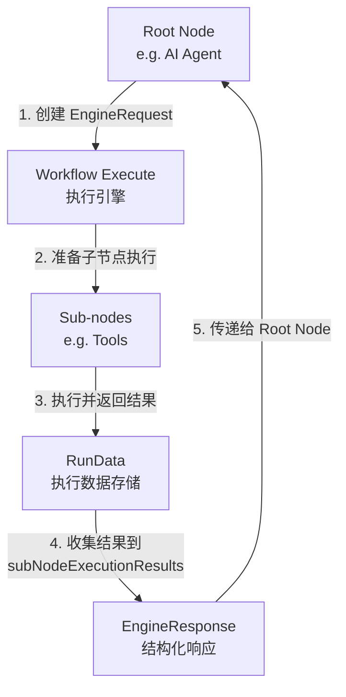

# n8n 中 Sub-nodes 结果回传给 Root Node 的技术架构分析

## 概述

在 n8n 中，Sub-nodes（如 AI Agent 中的工具节点）处理完任务后，需要将结果结构化地回传给 Root Node（如 AI Agent），以便 Agent 进行下一步决策或生成最终响应。本文档分析了 n8n 中实现这一机制的技术架构和实现方式。

## 1. 核心技术架构

### 1.1 关键组件

n8n 中 Sub-nodes 结果回传机制主要依赖以下核心组件：

1. **EngineRequest** - 节点请求执行子节点的数据结构
2. **EngineResponse** - 包含子节点执行结果的数据结构
3. **subNodeExecutionResults** - 执行引擎中存储子节点结果的变量
4. **WorkflowExecute** - 工作流执行引擎，负责协调节点间的执行和数据传递
5. **ExecuteContext** - 执行上下文，提供节点执行时的环境和数据访问

### 1.2 数据流转架构



## 2. 技术实现详解

### 2.1 EngineRequest 和 EngineResponse 结构

**EngineRequest** 是 Root Node 请求执行 Sub-nodes 的数据结构：

```typescript
type EngineRequest<T = object> = {
  /** Array of actions that the requesting node wants the engine to fulfill */
  actions: Array<EngineAction<T>>;
  /** Metadata associated with this request */
  metadata: T;
};

type ExecuteNodeAction<T> = {
  /** The type identifier for this action */
  actionType: 'ExecutionNodeAction';
  /** The name of the node to be executed */
  nodeName: string;
  /** Input data to be passed to the node for execution */
  input: IDataObject;
  /** The type of connection this execution request uses */
  type: NodeConnectionType;
  /** Unique identifier for this execution request */
  id: string;
  /** Additional metadata for this execution request */
  metadata: T;
};
```

**EngineResponse** 是包含 Sub-nodes 执行结果的数据结构：

```typescript
export type EngineResponse<T = unknown> = {
  /** Array of results from each executed action */
  actionResponses: Array<EngineResult<T>>;
  /** Metadata associated with this response */
  metadata: T;
};

export type ExecuteNodeResult<T = unknown> = {
  /** The action that was executed */
  action: ExecuteNodeAction<T>;
  /** The resulting task data from the execution */
  data: ITaskData;
};
```

### 2.2 执行引擎处理流程

执行引擎（WorkflowExecute）负责协调 Sub-nodes 的执行和结果收集：

1. **请求处理** - 当 Root Node 返回 EngineRequest 时，执行引擎会解析请求并准备 Sub-nodes 的执行

```typescript
// packages/core/src/execution-engine/requests-response.ts
export function handleRequest({
  workflow,
  currentNode,
  request,
  runIndex,
  executionData,
  runData,
}: {
  workflow: Workflow;
  currentNode: INode;
  request: EngineRequest;
  runIndex: number;
  executionData: IExecuteData;
  runData: IRunData;
}): {
  nodesToBeExecuted: NodeToBeExecuted[];
} {
  // 1. collect nodes to be put on the stack
  const { nodesToBeExecuted, subNodeExecutionData } = prepareRequestedNodesForExecution(
    workflow,
    currentNode,
    request,
    runIndex,
    runData,
  );

  // 2. create metadata for current node
  const result = prepareRequestingNodeForResuming(workflow, request, executionData);
  if (!result) {
    return { nodesToBeExecuted: [] };
  }

  // 3. add current node back to the bottom of the stack
  nodesToBeExecuted.unshift({
    inputConnectionData: result.connectionData,
    parentOutputIndex: 0,
    parentNode: result.parentNode,
    parentOutputData: executionData.data.main as INodeExecutionData[][],
    runIndex,
    nodeRunIndex: runIndex,
    metadata: { subNodeExecutionData },
  });

  return { nodesToBeExecuted };
}
```

2. **结果收集** - Sub-nodes 执行完成后，执行引擎会收集结果并构建 EngineResponse

```typescript
// packages/core/src/execution-engine/workflow-execute.ts
// 在 processRunExecutionData 方法中
if (executionData.metadata?.subNodeExecutionData) {
  subNodeExecutionResults.metadata =
    executionData.metadata.subNodeExecutionData.metadata;
  for (const subNode of executionData.metadata.subNodeExecutionData.actions) {
    const nodeRunData = this.runExecutionData.resultData.runData[subNode.nodeName];
    if (nodeRunData && nodeRunData[subNode.runIndex]) {
      const data = nodeRunData[subNode.runIndex];
      subNodeExecutionResults.actionResponses.push({
        data,
        action: subNode.action,
      });
    }
  }
}
```

3. **结果传递** - EngineResponse 被传递回 Root Node，供其处理和使用

```typescript
// packages/core/src/execution-engine/workflow-execute.ts
// 在 executeNode 方法中
data =
  nodeType instanceof Node
    ? await nodeType.execute(context, subNodeExecutionResults)
    : await nodeType.execute.call(context, subNodeExecutionResults);
```

### 2.3 AI Agent 中的实际应用

在 AI Agent 中，这种机制被用于调用工具并处理工具返回的结果：

```typescript
// packages/@n8n/nodes-langchain/nodes/agents/Agent/agents/ToolsAgent/V3/execute.ts
async function toolsAgentExecute(
  this: IExecuteFunctions,
  agentInput: AgentInput,
  model: BaseLanguageModelInterface,
  tools: Tool[],
  signal?: AbortSignal,
  options?: AgentExecutorOptions,
  response?: EngineResponse<RequestResponseMetadata>,
): Promise<INodeExecutionData[][] | EngineRequest<RequestResponseMetadata>> {
  // 处理工具调用结果
  if (response && response.actionResponses.length > 0) {
    const toolResponses = response.actionResponses.map((toolResponse) => {
      return {
        tool: toolResponse.action.metadata.toolName as string,
        toolInput: toolResponse.action.input as Record<string, unknown>,
        output: JSON.stringify(toolResponse.data.data?.[0]?.json ?? ''),
        toolCallId: toolResponse.action.id,
      };
    });

    // 将工具结果添加到消息历史
    for (const toolResponse of toolResponses) {
      messages.push(new AIMessage({
        content: '',
        additional_kwargs: {
          tool_calls: [{
            id: toolResponse.toolCallId,
            name: toolResponse.tool,
            args: toolResponse.toolInput,
          }],
        },
      }));

      messages.push(new ToolMessage({
        content: toolResponse.output,
        name: toolResponse.tool,
        tool_call_id: toolResponse.toolCallId,
      }));
    }
  }

  // 继续处理或生成最终响应
  // ...
}
```

## 3. 数据格式和结构化

### 3.1 标准化数据格式

Sub-nodes 返回的数据采用标准化格式，确保 Root Node 能够清晰解析：

```typescript
// 工具调用结果的标准格式
interface ToolResult {
  tool: string;           // 工具名称
  toolInput: object;      // 工具输入参数
  output: string;         // 工具输出（JSON 字符串）
  toolCallId: string;     // 工具调用 ID
}
```

### 3.2 元数据传递

除了实际数据外，元数据也通过 EngineResponse 传递：

```typescript
// 元数据结构
interface RequestResponseMetadata {
  toolName: string;       // 工具名称
  requestId: string;      // 请求 ID
  timestamp: number;      // 时间戳
  // 其他自定义元数据
}
```

## 4. Memory 的特殊回传机制

对于需要持久化的 Memory 数据，n8n 使用了特殊的回传机制：

1. **Memory 节点**将数据保存到外部存储（如数据库）
2. **引用传递** - Memory 节点返回的是引用而非实际数据
3. **按需加载** - Root Node 根据需要从外部存储加载 Memory 数据

```typescript
// Memory 节点示例
async function execute(this: IExecuteFunctions): Promise<INodeExecutionData[][]> {
  // 保存数据到外部存储
  const memoryId = await saveToExternalStore(inputData);

  // 返回引用而非实际数据
  return [{
    json: {
      memoryId,
      type: 'memory_reference',
      // 其他元数据
    }
  }];
}
```

## 5. 实现代码示例

### 5.1 自定义工具节点实现

```typescript
import { IExecuteFunctions, INodeExecutionData, EngineRequest } from 'n8n-workflow';

export class CustomToolNode {
  async execute(this: IExecuteFunctions): Promise<INodeExecutionData[][]> {
    const items = this.getInputData();
    const results: INodeExecutionData[] = [];

    for (const item of items) {
      // 处理输入数据
      const input = item.json;

      // 执行工具逻辑
      const output = await processToolLogic(input);

      // 构建标准化的输出
      results.push({
        json: {
          success: true,
          result: output,
          toolName: 'customTool',
          timestamp: Date.now(),
        },
      });
    }

    return [results];
  }
}

async function processToolLogic(input: any): Promise<any> {
  // 实现具体的工具逻辑
  return { processed: true, data: input };
}
```

### 5.2 自定义 AI Agent 节点实现

```typescript
import {
  IExecuteFunctions,
  INodeExecutionData,
  EngineRequest,
  EngineResponse,
  NodeConnectionTypes
} from 'n8n-workflow';

export class CustomAgentNode {
  async execute(
    this: IExecuteFunctions,
    subNodeExecutionResults?: EngineResponse
  ): Promise<INodeExecutionData[][] | EngineRequest> {
    // 获取输入数据
    const inputData = this.getInputData();
    const query = inputData[0].json.query;

    // 处理子节点执行结果
    if (subNodeExecutionResults && subNodeExecutionResults.actionResponses.length > 0) {
      // 处理工具返回的结果
      const toolResults = subNodeExecutionResults.actionResponses.map(response => ({
        tool: response.action.metadata.toolName,
        result: response.data.data?.[0]?.json,
      }));

      // 基于工具结果生成最终响应
      const finalResponse = generateResponse(query, toolResults);

      return [{
        json: {
          query,
          response: finalResponse,
          toolResults,
        }
      }];
    }

    // 需要调用工具，创建 EngineRequest
    const tools = await this.getInputConnectionData(NodeConnectionTypes.AiTool, 0);
    const toolRequests: EngineRequest['actions'] = [];

    for (const tool of tools) {
      toolRequests.push({
        actionType: 'ExecutionNodeAction',
        nodeName: tool.name,
        input: { query, toolParameters: tool.parameters },
        type: NodeConnectionTypes.AiTool,
        id: `tool_${Date.now()}_${Math.random().toString(36).substr(2, 9)}`,
        metadata: { toolName: tool.name },
      });
    }

    return {
      actions: toolRequests,
      metadata: { requestId: `req_${Date.now()}` },
    };
  }
}

function generateResponse(query: string, toolResults: any[]): string {
  // 基于查询和工具结果生成响应
  const resultsText = toolResults.map(r => `${r.tool}: ${JSON.stringify(r.result)}`).join('\n');
  return `Based on the tools execution:\n${resultsText}\n\nAnswer to your query: ${query}`;
}
```

## 6. 架构优势与设计考量

### 6.1 架构优势

1. **解耦设计** - Root Node 和 Sub-nodes 之间通过标准化接口交互，降低了耦合度
2. **灵活扩展** - 可以轻松添加新的工具类型和结果处理逻辑
3. **异步执行** - 支持异步执行工具，不会阻塞主流程
4. **结果追踪** - 完整保留了工具调用的上下文和元数据，便于调试和审计

### 6.2 设计考量

1. **性能优化** - 通过引用传递和按需加载减少数据传输量
2. **错误处理** - 结构化的错误信息可以在工具链中传播和处理
3. **可观测性** - 完整的执行日志和元数据支持监控和分析

## 7. 总结

n8n 中的 Sub-nodes 结果回传机制是一个精心设计的系统，通过 EngineRequest/EngineResponse 模式实现了节点间的灵活通信。这种设计不仅支持 AI Agent 与工具间的交互，也为其他类型的父子节点通信提供了通用的解决方案。

标准化的数据格式、结构化的结果传递和完整的元数据支持，使得这一机制既高效又易于扩展，为 n8n 中的复杂工作流提供了坚实的基础。
