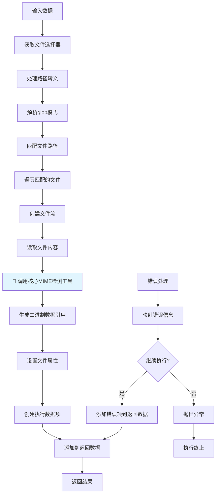
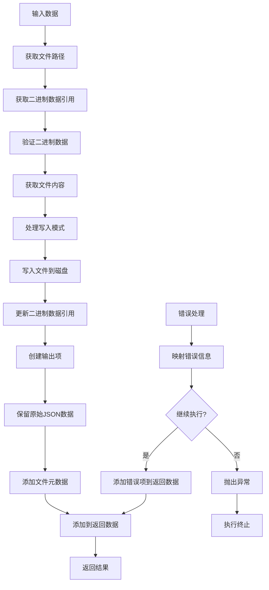

# Hetumind Read/Write Files Node 技术方案

## 概述

本文档描述了 hetumind 版本的 Read/Write Files Node 技术实现方案，基于对 n8n Read/Write Files from Disk Node 的分析和 hetumind 项目架构的理解。该节点允许用户在运行 hetumind 的计算机上读取和写入文件，支持多种文件格式和操作模式。

## 1. 技术架构概述

### 1.1 节点基本信息

- **节点名称**: ReadWriteFiles
- **显示名称**: Read/Write Files
- **版本**: 1.0.0
- **组别**: [NodeGroupKind::Input, NodeGroupKind::Output]
- **输入/输出**: Main 连接类型

### 1.2 核心组件

节点由以下核心组件构成：

- **ReadWriteFilesV1**: 主节点实现，负责协调读写操作
- **FileReader**: 读操作实现模块
- **FileWriter**: 写操作实现模块
- **FileErrorMapper**: 错误处理和映射模块
- **FileUtils**: 文件操作辅助工具函数

### 1.3 操作模式

节点支持两种主要操作模式：

1. **Read Files**: 从磁盘读取一个或多个文件
2. **Write Files**: 将文件写入磁盘

### 1.4 架构设计原则

基于 hetumind 的设计理念，我们遵循以下原则：

1. **二进制数据引用**: 使用 `BinaryDataReference` 而非直接传递文件内容，提高内存效率
2. **存储抽象**: 基于 opendal 构建统一的存储层，支持本地文件系统、S3 等多种后端
3. **生命周期管理**: 通过引用计数和自动清理机制管理二进制数据的生命周期
4. **类型安全**: 利用 Rust 的类型系统确保文件操作的安全性
5. **异步处理**: 使用 tokio 异步运行时处理文件 I/O 操作
6. **错误处理**: 提供详细的错误映射和用户友好的错误信息
7. **跨平台兼容**: 自动处理不同操作系统的路径差异
8. **进度反馈**: 支持操作进度的实时反馈，便于 UI 显示操作状态

## 2. 读操作实现方案

### 2.1 读操作数据流转图



### 2.2 读操作实现结构

```rust
use std::sync::Arc;
use async_trait::async_trait;
use hetumind_core::{
    workflow::{
        ConnectionKind, ExecutionData, ExecutionDataItems, ExecutionDataMap,
        InputPortConfig, NodeDefinition, NodeDefinitionBuilder, NodeExecutable,
        NodeExecutionContext, NodeExecutionError, NodeGroupKind, NodeProperty,
        NodePropertyKind, OutputPortConfig, RegistrationError, make_execution_data_map,
    },
    types::JsonValue,
    version::Version,
};
use serde_json::json;
use tokio::fs;
use glob::glob;
use mime_guess::from_path;

/// 文件读取器
pub struct FileReader {
    /// 二进制数据管理器
    data_manager: Arc<BinaryDataManager>,
}

impl FileReader {
    /// 创建新的文件读取器
    pub fn new(data_manager: Arc<BinaryDataManager>) -> Self {
        Self { data_manager }
    }

    /// 读取单个文件并创建二进制数据引用
    async fn read_file_to_binary_reference(
        file_path: &str,
        context: &NodeExecutionContext
    ) -> Result<BinaryDataReference, NodeExecutionError> {
        // 读取文件内容
        let file_content = fs::read(file_path).await.map_err(|e| {
            NodeExecutionError::ExternalServiceError {
                service: "File System".to_string(),
            }
        })?;

        // 获取文件元数据
        let metadata = fs::metadata(file_path).await.map_err(|e| {
            NodeExecutionError::ExternalServiceError {
                service: "File System".to_string(),
            }
        })?;

        // 🔧 重构：使用核心 MIME 类型检测工具函数
        let mime_type = Self::detect_mime_type(file_path, &file_content).await?;

        // 确定文件类型
        let file_kind = Self::determine_file_kind(&mime_type);

        // 创建二进制数据元数据
        let binary_metadata = BinaryDataMetadata {
            file_name: Some(std::path::Path::new(file_path)
                .file_name()
                .unwrap_or_default()
                .to_string_lossy()
                .to_string()),
            mime_type: mime_type.clone(),
            file_size: metadata.len(),
            last_modified: metadata.modified()
                .ok()
                .map(|t| t.duration_since(std::time::UNIX_EPOCH).unwrap_or_default().as_secs() as i64),
        };

        // 使用二进制数据管理器存储数据并获取引用
        let binary_ref = context.binary_data_manager
            .store_data(file_content, binary_metadata)
            .await
            .map_err(|e| NodeExecutionError::DataProcessingError {
                message: format!("Failed to store binary data: {}", e),
            })?;

        Ok(binary_ref)
    }

    /// 🔧 重构：使用核心 MIME 类型检测工具函数
    ///
    /// 📍 实现路径: @hetumind/hetumind-core/src/utils/mime_detector.rs
    async fn detect_mime_type(file_path: &str, file_content: &[u8]) -> Result<String, NodeExecutionError> {
        // 调用核心工具函数进行 MIME 类型检测
        hetumind_core::utils::mime_detector::detect_mime_type(file_path, Some(file_content))
            .await
            .map_err(|e| NodeExecutionError::DataProcessingError {
                message: format!("Failed to detect MIME type: {}", e),
            })
    }

  
    /// 确定文件类型
    fn determine_file_kind(mime_type: &str) -> BinaryFileKind {
        match mime_type {
            t if t.starts_with("text/") => BinaryFileKind::Text,
            "application/json" => BinaryFileKind::Json,
            t if t.starts_with("image/") => BinaryFileKind::Image,
            t if t.starts_with("video/") => BinaryFileKind::Video,
            t if t.starts_with("audio/") => BinaryFileKind::Audio,
            "application/pdf" => BinaryFileKind::Pdf,
            "text/html" => BinaryFileKind::Html,
            t if t.contains("sheet") || t.contains("excel") => BinaryFileKind::Excel,
            t if t.contains("word") || t.contains("document") => BinaryFileKind::Word,
            t if t.contains("presentation") || t.contains("powerpoint") => BinaryFileKind::Ppt,
            _ => BinaryFileKind::Text,
        }
    }

    /// 生成文件键
    async fn generate_file_key(file_path: &str) -> Result<String, NodeExecutionError> {
        use std::collections::hash_map::DefaultHasher;
        use std::hash::{Hash, Hasher};

        // 使用文件路径和修改时间生成哈希
        let metadata = fs::metadata(file_path).await.map_err(|e| {
            NodeExecutionError::ExternalServiceError {
                service: "File System".to_string(),
            }
        })?;

        let modified = metadata.modified().map_err(|e| {
            NodeExecutionError::ExternalServiceError {
                service: "File System".to_string(),
            }
        })?;

        let mut hasher = DefaultHasher::new();
        file_path.hash(&mut hasher);
        modified.hash(&mut hasher);

        Ok(format!("file_{}", hasher.finish()))
    }

    /// 使用 glob 模式匹配文件
    async fn match_files(pattern: &str) -> Result<Vec<String>, NodeExecutionError> {
        let pattern = Self::escape_glob_pattern(pattern);

        let mut matched_files = Vec::new();

        for entry in glob(&pattern).map_err(|e| {
            NodeExecutionError::DataProcessingError {
                message: format!("Invalid glob pattern: {}", e),
            }
        })? {
            match entry {
                Ok(path) => {
                    if let Some(path_str) = path.to_str() {
                        matched_files.push(path_str.to_string());
                    }
                }
                Err(e) => {
                    log::warn!("Error while reading file entry: {}", e);
                }
            }
        }

        Ok(matched_files)
    }

    /// 转义 glob 模式中的特殊字符
    fn escape_glob_pattern(pattern: &str) -> String {
        pattern
            .replace('(', "\\(")
            .replace(')', "\\)")
            .replace('[', "\\[")
            .replace(']', "\\]")
    }
}

/// 读操作执行器
pub struct ReadOperation {
    definition: Arc<NodeDefinition>,
    file_reader: Arc<FileReader>,
}

impl ReadOperation {
    pub fn new(definition: Arc<NodeDefinition>, file_reader: Arc<FileReader>) -> Self {
        Self {
            definition,
            file_reader,
        }
    }
}

#[async_trait]
impl NodeExecutable for ReadOperation {
    fn definition(&self) -> Arc<NodeDefinition> {
        self.definition.clone()
    }

    async fn execute(&self, context: &NodeExecutionContext) -> Result<ExecutionDataMap, NodeExecutionError> {
        let node = context.current_node()?;
        log::info!(
            "开始执行 Read Files 节点 workflow_id:{}, node_name:{}, node_kind:{}",
            context.workflow.id,
            node.name,
            node.kind
        );

        // 获取输入数据
        let input_items = if let Some(input_collection) = context.get_input_items(ConnectionKind::Main, 0)
            && let ExecutionDataItems::Items(input_data) = input_collection
        {
            input_data
        } else {
            log::warn!("Read Files 节点没有接收到输入数据，使用空数据");
            Vec::new()
        };

        let mut result_items = Vec::new();

        // 处理每个输入项
        for (item_index, input_item) in input_items.iter().enumerate() {
            // 获取文件选择器参数
            let file_selector = node.get_parameter("file_selector", Some(input_item.json().clone()), None)
                .and_then(|v| v.as_str().map(|s| s.to_string()))
                .ok_or_else(|| NodeExecutionError::ValidationError {
                    field: "file_selector".to_string(),
                    message: "File selector is required".to_string(),
                })?;

            // 获取选项参数
            let options = node.get_optional_parameter::<serde_json::Value>("options")
                .unwrap_or_else(|| json!({}));

            // 匹配文件
            let matched_files = FileReader::match_files(&file_selector).await?;

            log::debug!("文件选择器 '{}' 匹配到 {} 个文件", file_selector, matched_files.len());

            // 处理每个匹配的文件
            for file_path in matched_files {
                match self.file_reader.read_file_to_binary_reference(&file_path, context).await {
                    Ok(binary_ref) => {
                        // 创建文件元数据
                        let file_metadata = json!({
                            "fileName": binary_ref.file_name,
                            "filePath": file_path,
                            "fileSize": binary_ref.file_size,
                            "mimeType": binary_ref.mime_kind,
                            "fileExtension": binary_ref.file_extension,
                            "fileType": binary_ref.file_kind,
                            "directory": binary_ref.directory,
                        });

                        // 创建执行数据项
                        let execution_data = ExecutionData::new_binary(
                            binary_ref,
                            Some(DataSource {
                                node_name: context.current_node_name.clone(),
                                output_port: ConnectionKind::Main,
                                output_index: 0,
                            }),
                        );

                        // 创建包含元数据的 JSON 数据
                        let json_data = json!({
                            "file": file_metadata,
                            "data": "[Binary Data]",
                        });

                        // 创建带有 JSON 和二进制数据的执行项
                        let mut execution_data_with_json = execution_data;
                        // 注意：这里需要修改 ExecutionData 结构以支持同时包含 JSON 和二进制数据
                        // 或者创建一个新的结构来处理这种情况

                        result_items.push(execution_data_with_json);
                    }
                    Err(e) => {
                        log::error!("读取文件 {} 失败: {}", file_path, e);

                        // 根据错误处理策略决定是否继续
                        let continue_on_fail = options.get("continue_on_fail")
                            .and_then(|v| v.as_bool())
                            .unwrap_or(false);

                        if continue_on_fail {
                            // 添加错误项到结果
                            let error_data = json!({
                                "error": e.to_string(),
                                "filePath": file_path,
                            });

                            result_items.push(ExecutionData::new_json(
                                error_data,
                                Some(DataSource {
                                    node_name: context.current_node_name.clone(),
                                    output_port: ConnectionKind::Main,
                                    output_index: 0,
                                }),
                            ));
                        } else {
                            return Err(e);
                        }
                    }
                }
            }
        }

        Ok(make_execution_data_map(vec![(
            ConnectionKind::Main,
            vec![ExecutionDataItems::new_items(result_items)],
        )]))
    }
}
```

### 2.3 关键功能点

1. **文件模式匹配**: 使用 `glob` crate 支持复杂的文件匹配模式
2. **路径处理**: 自动处理不同操作系统的路径分隔符
3. **二进制数据引用**: 创建轻量级的 `BinaryDataReference` 而非加载整个文件到内存
4. **MIME 类型推断**: 使用 `mime_guess` crate 自动推断文件类型
5. **错误处理**: 提供详细的错误映射和处理机制

## 3. 写操作实现方案

### 3.1 写操作数据流转图



### 3.2 写操作实现结构

```rust
/// 文件写入器
pub struct FileWriter;

impl FileWriter {
    /// 从二进制数据引用获取文件内容
    async fn get_file_content_from_binary_ref(
        binary_ref: &BinaryDataReference,
        context: &NodeExecutionContext
    ) -> Result<Vec<u8>, NodeExecutionError> {
        // 使用二进制数据管理器获取文件内容
        context.binary_data_manager
            .get_data(&binary_ref.file_key)
            .await
            .map_err(|e| NodeExecutionError::DataProcessingError {
                message: format!("Failed to retrieve binary data: {}", e),
            })
    }

    /// 写入文件到磁盘
    async fn write_file_to_disk(
        file_path: &str,
        content: Vec<u8>,
        append_mode: bool,
    ) -> Result<(), NodeExecutionError> {
        // 确保父目录存在
        if let Some(parent) = std::path::Path::new(file_path).parent() {
            fs::create_dir_all(parent).await.map_err(|e| {
                NodeExecutionError::ExternalServiceError {
                    service: "File System".to_string(),
                }
            })?;
        }

        // 根据模式选择写入方式
        if append_mode {
            // 追加模式
            use tokio::io::AsyncWriteExt;
            let mut file = tokio::fs::OpenOptions::new()
                .create(true)
                .append(true)
                .open(file_path)
                .await
                .map_err(|e| {
                    NodeExecutionError::ExternalServiceError {
                        service: "File System".to_string(),
                    }
                })?;

            file.write_all(&content).await.map_err(|e| {
                NodeExecutionError::ExternalServiceError {
                    service: "File System".to_string(),
                }
            })?;
        } else {
            // 覆盖模式
            fs::write(file_path, content).await.map_err(|e| {
                NodeExecutionError::ExternalServiceError {
                    service: "File System".to_string(),
                }
            })?;
        }

        Ok(())
    }

    /// 创建或更新二进制数据引用
    async fn create_or_update_binary_ref(
        file_path: &str,
        context: &NodeExecutionContext
    ) -> Result<BinaryDataReference, NodeExecutionError> {
        // 读取写入后的文件内容
        let file_content = fs::read(file_path).await.map_err(|e| {
            NodeExecutionError::ExternalServiceError {
                service: "File System".to_string(),
            }
        })?;

        // 获取文件元数据
        let metadata = fs::metadata(file_path).await.map_err(|e| {
            NodeExecutionError::ExternalServiceError {
                service: "File System".to_string(),
            }
        })?;

        // 🔧 重构：使用核心 MIME 类型检测工具函数
        let mime_type = FileReader::detect_mime_type(file_path, &file_content).await?;

        // 确定文件类型
        let file_kind = FileReader::determine_file_kind(&mime_type);

        // 创建二进制数据元数据
        let binary_metadata = BinaryDataMetadata {
            file_name: Some(std::path::Path::new(file_path)
                .file_name()
                .unwrap_or_default()
                .to_string_lossy()
                .to_string()),
            mime_type: mime_type.clone(),
            file_size: metadata.len(),
            last_modified: metadata.modified()
                .ok()
                .map(|t| t.duration_since(std::time::UNIX_EPOCH).unwrap_or_default().as_secs() as i64),
        };

        // 使用二进制数据管理器存储数据并获取引用
        let binary_ref = context.binary_data_manager
            .store_data(file_content, binary_metadata)
            .await
            .map_err(|e| NodeExecutionError::DataProcessingError {
                message: format!("Failed to store binary data: {}", e),
            })?;

        Ok(binary_ref)
    }
}

/// 写操作执行器
pub struct WriteOperation {
    definition: Arc<NodeDefinition>,
}

#[async_trait]
impl NodeExecutable for WriteOperation {
    fn definition(&self) -> Arc<NodeDefinition> {
        self.definition.clone()
    }

    async fn execute(&self, context: &NodeExecutionContext) -> Result<ExecutionDataMap, NodeExecutionError> {
        let node = context.current_node()?;
        log::info!(
            "开始执行 Write Files 节点 workflow_id:{}, node_name:{}, node_kind:{}",
            context.workflow.id,
            node.name,
            node.kind
        );

        // 获取输入数据
        let input_items = if let Some(input_collection) = context.get_input_items(ConnectionKind::Main, 0)
            && let ExecutionDataItems::Items(input_data) = input_collection
        {
            input_data
        } else {
            return Err(NodeExecutionError::ValidationError {
                field: "input".to_string(),
                message: "Write Files 节点需要输入数据".to_string(),
            });
        };

        let mut result_items = Vec::new();

        // 处理每个输入项
        for (item_index, input_item) in input_items.iter().enumerate() {
            // 获取文件路径
            let file_path = node.get_parameter("file_path", Some(input_item.json().clone()), None)
                .and_then(|v| v.as_str().map(|s| s.to_string()))
                .ok_or_else(|| NodeExecutionError::ValidationError {
                    field: "file_path".to_string(),
                    message: "File path is required".to_string(),
                })?;

            // 获取选项参数
            let options = node.get_optional_parameter::<serde_json::Value>("options")
                .unwrap_or_else(|| json!({}));

            let append_mode = options.get("append")
                .and_then(|v| v.as_bool())
                .unwrap_or(false);

            // 获取二进制数据引用
            let binary_ref = input_item.binary().ok_or_else(|| {
                NodeExecutionError::ValidationError {
                    field: "binary_data".to_string(),
                    message: "Input item must contain binary data".to_string(),
                }
            })?;

            // 获取文件内容
            let file_content = FileWriter::get_file_content_from_binary_ref(binary_ref, context).await?;

            // 写入文件到磁盘
            FileWriter::write_file_to_disk(&file_path, file_content, append_mode).await?;

            // 创建或更新二进制数据引用
            let updated_binary_ref = FileWriter::create_or_update_binary_ref(&file_path, context).await?;

            // 注册新的二进制数据引用到生命周期管理器
            if let Some(lifecycle_manager) = context.binary_data_lifecycle_manager.as_ref() {
                lifecycle_manager.register_reference(&updated_binary_ref.file_key).await
                    .map_err(|e| NodeExecutionError::DataProcessingError {
                        message: format!("Failed to register binary data reference: {}", e),
                    })?;
            }

            // 创建文件元数据
            let file_metadata = json!({
                "fileName": updated_binary_ref.file_name,
                "filePath": file_path,
                "fileSize": updated_binary_ref.file_size,
                "mimeType": updated_binary_ref.mime_kind,
                "fileExtension": updated_binary_ref.file_extension,
                "fileType": updated_binary_ref.file_kind,
                "directory": updated_binary_ref.directory,
                "appendMode": append_mode,
            });

            // 创建执行数据项
            let execution_data = ExecutionData::new_binary(
                updated_binary_ref,
                Some(DataSource {
                    node_name: context.current_node_name.clone(),
                    output_port: ConnectionKind::Main,
                    output_index: 0,
                }),
            );

            // 保留原始 JSON 数据并添加文件元数据
            let mut json_data = input_item.json().clone();
            if let Some(obj) = json_data.as_object_mut() {
                obj.insert("file".to_string(), file_metadata);
            }

            // 注意：这里需要修改 ExecutionData 结构以支持同时包含 JSON 和二进制数据
            // 或者创建一个新的结构来处理这种情况

            result_items.push(execution_data);
        }

        Ok(make_execution_data_map(vec![(
            ConnectionKind::Main,
            vec![ExecutionDataItems::new_items(result_items)],
        )]))
    }
}
```

### 3.3 关键功能点

1. **二进制数据处理**: 支持从 `BinaryDataReference` 获取文件内容
2. **文件写入模式**: 支持覆盖写入和追加写入两种模式
3. **目录自动创建**: 自动创建不存在的父目录
4. **数据保留**: 保留原始输入数据的 JSON 内容并添加文件元数据
5. **错误处理**: 提供详细的权限和路径错误处理

## 4. 错误处理和异常管理

### 4.1 错误映射器

```rust
/// 文件操作错误映射器
pub struct FileErrorMapper;

impl FileErrorMapper {
    /// 映射文件系统错误到用户友好的错误信息
    pub fn map_file_error(
        error: &std::io::Error,
        context: &FileErrorContext,
    ) -> NodeExecutionError {
        match error.kind() {
            std::io::ErrorKind::PermissionDenied => {
                let message = if context.operation == "read" {
                    format!("您没有权限访问文件 {}", context.file_path)
                } else {
                    format!("您没有权限写入文件 {}", context.file_path)
                };

                NodeExecutionError::ExternalServiceError {
                    service: "File System".to_string(),
                }
            }
            std::io::ErrorKind::NotFound => {
                NodeExecutionError::ValidationError {
                    field: "file_path".to_string(),
                    message: format!("文件不存在: {}", context.file_path),
                }
            }
            std::io::ErrorKind::AlreadyExists => {
                NodeExecutionError::ValidationError {
                    field: "file_path".to_string(),
                    message: format!("文件已存在: {}", context.file_path),
                }
            }
            std::io::ErrorKind::InvalidInput => {
                NodeExecutionError::ValidationError {
                    field: "file_path".to_string(),
                    message: format!("无效的文件路径: {}", context.file_path),
                }
            }
            _ => {
                NodeExecutionError::ExternalServiceError {
                    service: "File System".to_string(),
                }
            }
        }
    }
}

/// 文件错误上下文
pub struct FileErrorContext {
    pub operation: String, // "read" or "write"
    pub file_path: String,
}
```

### 4.2 错误处理策略

1. **继续执行模式**: 当 `continue_on_fail` 选项启用时，单个文件操作失败不会中断整个节点执行
2. **错误日志记录**: 所有错误都会记录到日志中，便于调试
3. **错误数据传递**: 失败的操作会生成包含错误信息的输出项，便于后续处理

## 5. 节点属性和参数配置

### 5.1 参数命名约定

所有节点配置参数 **必须** 使用 **snake_case** 命名约定：

- `NodeProperty.name` 字段必须使用 snake_case（例如：`"operation"`，`"file_selector"`，`"continue_on_fail"`）
- `parameters.get()` 调用必须使用 snake_case 键（例如：`parameters.get("file_selector")`）
- 配置结构体字段应遵循 snake_case 以保持一致性

**示例**：
- ✅ `"operation"` → `"file_selector"` → `"continue_on_fail"` → `"read_write_file_mode"`
- ❌ `"operationMode"` → `"fileSelector"` → `"continueOnFail"` → `"readWriteFileMode"`

此约定确保整个 hetumind 项目中参数命名的一致性，并符合 Rust 的命名标准。

### 5.2 节点定义

```rust
/// 创建 Read/Write Files 节点定义
pub fn create_definition() -> Result<NodeDefinition, RegistrationError> {
    NodeDefinitionBuilder::default()
        .kind("ReadWriteFiles")
        .version(Version::new(1, 0, 0))
        .groups([NodeGroupKind::Input, NodeGroupKind::Output])
        .display_name("Read/Write Files")
        .description("从磁盘读取文件或将文件写入磁盘。支持多种文件格式和操作模式。")
        .icon("file")
        .inputs(vec![
            InputPortConfig::builder()
                .kind(ConnectionKind::Main)
                .display_name("Input")
                .build()
        ])
        .outputs(vec![
            OutputPortConfig::builder()
                .kind(ConnectionKind::Main)
                .display_name("Output")
                .build()
        ])
        .properties(vec![
            // 操作类型选择
            NodeProperty::builder()
                .display_name("操作类型")
                .name("operation")
                .kind(NodePropertyKind::Options)
                .required(true)
                .description("选择要执行的操作类型")
                .value(json!("read"))
                .options(vec![
                    Box::new(NodeProperty::new_option(
                        "读取文件",
                        "read",
                        json!("read"),
                        NodePropertyKind::Options
                    )),
                    Box::new(NodeProperty::new_option(
                        "写入文件",
                        "write",
                        json!("write"),
                        NodePropertyKind::Options
                    )),
                ])
                .build(),

            // 读操作参数
            NodeProperty::builder()
                .display_name("文件选择器")
                .name("file_selector")
                .kind(NodePropertyKind::String)
                .required(false)
                .description("用于匹配文件的 glob 模式，支持通配符如 * 和 **")
                .placeholder("/path/to/files/*.txt")
                .display_options(Option::<DisplayOptions>::None)
                .build(),

            // 写操作参数
            NodeProperty::builder()
                .display_name("文件路径")
                .name("file_path")
                .kind(NodePropertyKind::String)
                .required(false)
                .description("要写入的文件路径")
                .placeholder("/path/to/output/file.txt")
                .display_options(Option::<DisplayOptions>::None)
                .build(),

            // 选项参数
            NodeProperty::builder()
                .display_name("选项")
                .name("options")
                .kind(NodePropertyKind::Collection)
                .required(false)
                .placeholder("添加选项")
                .options(vec![
                    Box::new(NodeProperty::new_option(
                        "继续执行",
                        "continue_on_fail",
                        json!(false),
                        NodePropertyKind::Boolean
                    )),
                    Box::new(NodeProperty::new_option(
                        "追加模式",
                        "append",
                        json!(false),
                        NodePropertyKind::Boolean
                    )),
                    Box::new(NodeProperty::new_option(
                        "文件名",
                        "file_name",
                        json!(""),
                        NodePropertyKind::String
                    )),
                ])
                .build(),
        ])
        .build()
        .map_err(RegistrationError::NodeDefinitionBuilderError)
}
```

### 5.3 主节点实现

```rust
/// Read/Write Files 节点主实现
#[derive(Debug, Clone)]
pub struct ReadWriteFilesV1 {
    definition: Arc<NodeDefinition>,
    read_operation: Arc<ReadOperation>,
    write_operation: Arc<WriteOperation>,
}

impl ReadWriteFilesV1 {
    pub fn new(definition: NodeDefinition, data_manager: Arc<BinaryDataManager>) -> Result<Self, RegistrationError> {
        let definition = Arc::new(definition);

        // 创建文件读取器
        let file_reader = Arc::new(FileReader::new(data_manager));

        // 创建读操作
        let mut read_def = definition.as_ref().clone();
        let read_operation = Arc::new(ReadOperation::new(
            Arc::new(read_def),
            file_reader,
        ));

        // 创建写操作
        let mut write_def = definition.as_ref().clone();
        let write_operation = Arc::new(WriteOperation {
            definition: Arc::new(write_def),
        });

        Ok(Self {
            definition,
            read_operation,
            write_operation,
        })
    }
}

#[async_trait]
impl NodeExecutable for ReadWriteFilesV1 {
    fn definition(&self) -> Arc<NodeDefinition> {
        self.definition.clone()
    }

    async fn execute(&self, context: &NodeExecutionContext) -> Result<ExecutionDataMap, NodeExecutionError> {
        let node = context.current_node()?;

        // 获取操作类型
        let operation = node.get_parameter("operation", None, None)
            .and_then(|v| v.as_str().map(|s| s.to_string()))
            .unwrap_or_else(|| "read".to_string());

        log::debug!("执行文件操作: {}", operation);

        match operation.as_str() {
            "read" => {
                self.read_operation.execute(context).await
            }
            "write" => {
                self.write_operation.execute(context).await
            }
            _ => Err(NodeExecutionError::ValidationError {
                field: "operation".to_string(),
                message: format!("不支持的操作类型: {}", operation),
            })
        }
    }
}

impl TryFrom<NodeDefinitionBuilder> for ReadWriteFilesV1 {
    type Error = RegistrationError;

    fn try_from(base: NodeDefinitionBuilder) -> Result<Self, Self::Error> {
        let definition = base.build()?;
        // 注意：在实际实现中，需要从上下文获取 BinaryDataManager
        // 这里简化处理，实际使用时需要调整
        let data_manager = todo!("需要从上下文获取 BinaryDataManager");
        Self::new(definition, data_manager)
    }
}
```

## 7. 核心 MIME 类型检测工具函数

### 7.1 重构概述

**📍 核心实现路径**: `@hetumind/hetumind-core/src/utils/mime_detector.rs`

为了提高代码复用性和维护性，将 MIME 类型检测逻辑重构为独立的工具函数，供整个 hetumind 项目使用。

### 7.2 工具函数设计

```rust
/// 📍 实现路径: hetumind/hetumind-core/src/utils/mime_detector.rs
///
/// MIME 类型检测器 - 提供高精度的文件类型检测功能
///
/// 特性：
/// - 内容检测优先，扩展名推断补充
/// - 支持异步操作，避免阻塞
/// - 支持流式检测，减少内存占用
/// - 高精度检测，避免文件扩展名错误导致的误判
use content_inspector::{ContentType, inspect};
use mime_guess::from_path;
use std::path::Path;

pub struct MimeTypeDetector;

impl MimeTypeDetector {
    /// 检测文件的 MIME 类型
    ///
    /// # 参数
    /// - `file_path`: 文件路径
    /// - `content_sample`: 可选的内容样本（前 N 字节）
    ///
    /// # 返回值
    /// 检测到的 MIME 类型字符串
    ///
    /// # 检测策略
    /// 1. 优先使用 content_inspector 进行内容检测
    /// 2. 内容检测不明确时，回退到 mime_guess 扩展名推断
    ///
    /// # 示例
    /// ```rust
    /// let content = std::fs::read("example.json")?;
    /// let mime_type = MimeTypeDetector::detect_mime_type("example.json", Some(&content)).await?;
    /// assert_eq!(mime_type, "application/json");
    /// ```
    pub async fn detect_mime_type(
        file_path: &str,
        content_sample: Option<&[u8]>,
    ) -> Result<String, MimeTypeDetectorError> {
        // 1. 如果有内容样本，优先使用内容检测
        if let Some(content) = content_sample {
            let content_type = inspect(content);

            match content_type {
                ContentType::TEXT => {
                    // 对文本内容进行更具体的检测
                    if Self::looks_like_json(content) {
                        return Ok("application/json".to_string());
                    } else if Self::looks_like_html(content) {
                        return Ok("text/html".to_string());
                    } else if Self::looks_like_xml(content) {
                        return Ok("application/xml".to_string());
                    } else if Self::looks_like_csv(content) {
                        return Ok("text/csv".to_string());
                    } else if Self::looks_like_yaml(content) {
                        return Ok("application/x-yaml".to_string());
                    }
                    Ok("text/plain".to_string())
                }
                ContentType::BMP => Ok("image/bmp".to_string()),
                ContentType::GIF => Ok("image/gif".to_string()),
                ContentType::JPEG => Ok("image/jpeg".to_string()),
                ContentType::PNG => Ok("image/png".to_string()),
                ContentType::PDF => Ok("application/pdf".to_string()),

                // 音频格式
                ContentType::MP3 => Ok("audio/mpeg".to_string()),
                ContentType::FLAC => Ok("audio/flac".to_string()),
                ContentType::WAV => Ok("audio/wav".to_string()),
                ContentType::OGG => Ok("audio/ogg".to_string()),

                // 视频格式
                ContentType::MP4 => Ok("video/mp4".to_string()),
                ContentType::MPEG => Ok("video/mpeg".to_string()),
                ContentType::WEBM => Ok("video/webm".to_string()),

                // 压缩格式
                ContentType::ZIP => Ok("application/zip".to_string()),
                ContentType::GZIP => Ok("application/gzip".to_string()),
                ContentType::SEVEN_ZIP => Ok("application/x-7z-compressed".to_string()),

                _ => {
                    // 内容检测不明确，回退到扩展名检测
                    Ok(from_path(file_path)
                        .first_or_octet_stream()
                        .to_string())
                }
            }
        } else {
            // 2. 没有内容样本，直接使用扩展名检测
            Ok(from_path(file_path)
                .first_or_octet_stream()
                .to_string())
        }
    }

    /// 从文件流检测 MIME 类型（异步，推荐使用）
    ///
    /// # 参数
    /// - `file_path`: 文件路径
    /// - `mut stream`: 可读的文件流
    ///
    /// # 特性
    /// - 只读取文件头部进行检测（默认 1KB）
    /// - 支持自定义采样大小
    /// - 流式处理，减少内存占用
    pub async fn detect_mime_type_from_stream<R: AsyncRead + Unpin>(
        file_path: &str,
        mut stream: R,
        sample_size: usize,
    ) -> Result<String, MimeTypeDetectorError> {
        let mut buffer = vec![0u8; sample_size];
        let bytes_read = stream.read(&mut buffer).await?;

        if bytes_read == 0 {
            // 空文件，使用扩展名检测
            return Ok(from_path(file_path)
                .first_or_octet_stream()
                .to_string());
        }

        buffer.truncate(bytes_read);
        Self::detect_mime_type(file_path, Some(&buffer)).await
    }

    /// 检测代码文件的具体语言类型
    ///
    /// 基于文件扩展名和内容特征的代码语言检测
    pub fn detect_code_language(file_path: &str, content: Option<&[u8]>) -> Option<String> {
        let extension = Path::new(file_path)
            .extension()
            .and_then(|ext| ext.to_str())?;

        let mime_type = match extension {
            "rs" => Some("text/x-rust".to_string()),
            "js" | "mjs" => Some("application/javascript".to_string()),
            "ts" => Some("application/typescript".to_string()),
            "jsx" => Some("text/jsx".to_string()),
            "tsx" => Some("text/tsx".to_string()),
            "py" => Some("text/x-python".to_string()),
            "java" => Some("text/x-java".to_string()),
            "cpp" | "cc" | "cxx" => Some("text/x-c++".to_string()),
            "c" => Some("text/x-c".to_string()),
            "go" => Some("text/x-go".to_string()),
            "php" => Some("application/x-httpd-php".to_string()),
            "rb" => Some("text/x-ruby".to_string()),
            "swift" => Some("text/x-swift".to_string()),
            "kt" => Some("text/x-kotlin".to_string()),
            "scala" => Some("text/x-scala".to_string()),
            "sh" | "bash" => Some("application/x-sh".to_string()),
            "sql" => Some("application/sql".to_string()),
            "css" => Some("text/css".to_string()),
            "scss" | "sass" => Some("text/x-scss".to_string()),
            "less" => Some("text/x-less".to_string()),
            "html" | "htm" => Some("text/html".to_string()),
            "xml" => Some("application/xml".to_string()),
            "json" => Some("application/json".to_string()),
            "yaml" | "yml" => Some("application/x-yaml".to_string()),
            "toml" => Some("application/toml".to_string()),
            "md" => Some("text/markdown".to_string()),
            _ => None,
        };

        // 如果有内容样本，可以进行更精确的检测
        if let (Some(mime_type), Some(content)) = (mime_type, content) {
            // 对于文本文件，验证内容是否符合预期的类型
            if mime_type.contains("text/") || mime_type.contains("application/") {
                match extension {
                    "json" if Self::looks_like_json(content) => mime_type,
                    "html" | "htm" if Self::looks_like_html(content) => mime_type,
                    "xml" if Self::looks_like_xml(content) => mime_type,
                    _ => mime_type,
                }
            } else {
                mime_type
            }
        } else {
            mime_type
        }
    }

    /// 根据文件类型确定 BinaryFileKind
    pub fn determine_file_kind(mime_type: &str) -> String {
        match mime_type {
            t if t.starts_with("text/") => "Text".to_string(),
            "application/json" => "Json".to_string(),
            t if t.starts_with("image/") => "Image".to_string(),
            t if t.starts_with("video/") => "Video".to_string(),
            t if t.starts_with("audio/") => "Audio".to_string(),
            "application/pdf" => "Pdf".to_string(),
            "text/html" => "Html".to_string(),
            t if t.contains("sheet") || t.contains("excel") => "Excel".to_string(),
            t if t.contains("word") || t.contains("document") => "Word".to_string(),
            t if t.contains("presentation") || t.contains("powerpoint") => "Ppt".to_string(),
            _ => "Binary".to_string(),
        }
    }

    // 私有辅助方法
    fn looks_like_json(content: &[u8]) -> bool {
        let trimmed = content
            .iter()
            .skip_while(|&&b| b.is_ascii_whitespace())
            .take(100)
            .collect::<Vec<_>>();

        !trimmed.is_empty() && (trimmed[0] == b'{' || trimmed[0] == b'[')
    }

    fn looks_like_html(content: &[u8]) -> bool {
        let trimmed = content
            .iter()
            .skip_while(|&&b| b.is_ascii_whitespace())
            .take(100)
            .collect::<Vec<_>>();

        if trimmed.len() < 4 {
            return false;
        }

        let start = String::from_utf8_lossy(&trimmed[..4]).to_lowercase();
        start.starts_with("<!do") || start.starts_with("<html") ||
        start.starts_with("<head") || start.starts_with("<body")
    }

    fn looks_like_xml(content: &[u8]) -> bool {
        let trimmed = content
            .iter()
            .skip_while(|&&b| b.is_ascii_whitespace())
            .take(100)
            .collect::<Vec<_>>();

        if trimmed.len() < 5 {
            return false;
        }

        let start = String::from_utf8_lossy(&trimmed[..5]).to_lowercase();
        start.starts_with("<?xml") || (start.starts_with("<") && start.contains("xmlns"))
    }

    fn looks_like_csv(content: &[u8]) -> bool {
        let sample = String::from_utf8_lossy(&content[..content.len().min(1024)]);
        let lines: Vec<&str> = sample.lines().take(5).collect();

        if lines.len() < 2 {
            return false;
        }

        // 检查是否包含逗号分隔符
        lines.iter().any(|line| line.contains(',') && line.split(',').count() > 1)
    }

    fn looks_like_yaml(content: &[u8]) -> bool {
        let sample = String::from_utf8_lossy(&content[..content.len().min(1024)]);
        let lines: Vec<&str> = sample.lines().take(10).collect();

        // 检查 YAML 特征
        lines.iter().any(|line| {
            let trimmed = line.trim();
            trimmed.starts_with('-') || trimmed.contains(':') ||
            trimmed.starts_with('#') || trimmed == "---"
        })
    }
}

/// MIME 类型检测错误类型
#[derive(Debug, thiserror::Error)]
pub enum MimeTypeDetectorError {
    #[error("IO error: {0}")]
    Io(#[from] std::io::Error),

    #[error("Invalid file path: {0}")]
    InvalidPath(String),

    #[error("Content detection failed: {0}")]
    DetectionFailed(String),
}
```

### 7.3 在节点中的使用

```rust
impl FileReader {
    /// 🔧 重构：使用核心 MIME 类型检测工具函数
    ///
    /// 📍 实现路径: @hetumind/hetumind-core/src/utils/mime_detector.rs
    async fn detect_mime_type(file_path: &str, file_content: &[u8]) -> Result<String, NodeExecutionError> {
        // 调用核心工具函数进行 MIME 类型检测
        hetumind_core::utils::mime_detector::MimeTypeDetector::detect_mime_type(file_path, Some(file_content))
            .await
            .map_err(|e| NodeExecutionError::DataProcessingError {
                message: format!("Failed to detect MIME type: {}", e),
            })
    }
}
```

## 8. 与 hetumind 架构的集成

### 8.1 依赖注入和组件配置

Read/Write Files 节点与 hetumind 核心架构的集成需要通过依赖注入模式来实现：

```rust
/// 节点注册时的依赖注入
pub fn register_read_write_files_node(
    node_registry: &NodeRegistry,
    data_manager: Arc<BinaryDataManager>,
    lifecycle_manager: Option<Arc<BinaryDataLifecycleManager>>,
) -> Result<(), RegistrationError> {
    let definition = create_definition()?;

    let node = ReadWriteFilesV1::new(definition, data_manager)?;

    node_registry.register_node(Arc::new(node))?;
    Ok(())
}
```

### 8.2 NodeExecutionContext 扩展

为了支持二进制数据管理，需要扩展 NodeExecutionContext：

```rust
/// 扩展的节点执行上下文
pub struct ExtendedNodeExecutionContext {
    /// 原有上下文
    pub base_context: NodeExecutionContext,
    /// 二进制数据管理器
    pub binary_data_manager: Arc<BinaryDataManager>,
    /// 二进制数据生命周期管理器（可选）
    pub binary_data_lifecycle_manager: Option<Arc<BinaryDataLifecycleManager>>,
}

impl Deref for ExtendedNodeExecutionContext {
    type Target = NodeExecutionContext;

    fn deref(&self) -> &Self::Target {
        &self.base_context
    }
}
```

### 8.3 二进制数据存储配置

```rust
/// 文件节点存储配置
#[derive(Debug, Clone, Serialize, Deserialize)]
pub struct FileNodeStorageConfig {
    /// 基础存储配置
    pub storage_config: BinaryStorageConfig,
    /// 缓存配置
    pub cache_config: FileNodeCacheConfig,
    /// 是否启用生命周期管理
    pub enable_lifecycle_management: bool,
    /// 生命周期配置
    pub lifecycle_config: LifecycleCleanupConfig,
}

/// 文件节点缓存配置
#[derive(Debug, Clone, Serialize, Deserialize)]
pub struct FileNodeCacheConfig {
    /// 是否启用缓存
    pub enable_cache: bool,
    /// 缓存大小限制（字节）
    pub cache_limit: usize,
    /// 缓存过期时间（秒）
    pub cache_ttl: u64,
}

impl Default for FileNodeStorageConfig {
    fn default() -> Self {
        Self {
            storage_config: BinaryStorageConfig {
                storage_type: StorageType::Fs,
                root: "hetumind-file-data".to_string(),
                config: json!({}),
            },
            cache_config: FileNodeCacheConfig {
                enable_cache: true,
                cache_limit: 100 * 1024 * 1024, // 100MB
                cache_ttl: 3600, // 1小时
            },
            enable_lifecycle_management: true,
            lifecycle_config: LifecycleCleanupConfig::default(),
        }
    }
}
### 8.4 进度反馈和监控集成

```rust
/// 文件操作进度反馈
impl FileReader {
    async fn read_file_with_progress(
        file_path: &str,
        context: &ExtendedNodeExecutionContext,
    ) -> Result<BinaryDataReference, NodeExecutionError> {
        // 获取文件大小
        let metadata = fs::metadata(file_path).await.map_err(|e| {
            NodeExecutionError::ExternalServiceError {
                service: "File System".to_string(),
            }
        })?;

        let file_size = metadata.len();

        // 开始进度跟踪
        let operation_id = context.binary_data_manager
            .start_operation("read_file", file_size as usize);

        // 读取文件内容
        let file_content = fs::read(file_path).await.map_err(|e| {
            NodeExecutionError::ExternalServiceError {
                service: "File System".to_string(),
            }
        })?;

        // 更新进度
        context.binary_data_manager
            .update_progress(&operation_id, file_size)
            .await;

        // 继续处理...
        let binary_ref = self.process_file_content(file_content, file_path, context).await?;

        // 完成操作
        context.binary_data_manager
            .complete_operation(&operation_id, true)
            .await;

        Ok(binary_ref)
    }
}
```

## 9. 高级文件类型检测（已重构）

### 9.1 重构前后对比

**重构前**：
- MIME 类型检测逻辑分散在各个节点中
- 代码重复，维护成本高
- 检测精度不一致
- 无法统一升级检测策略

**重构后**：
- 🔧 **统一工具函数**: 所有 MIME 类型检测逻辑集中在核心工具函数中
- **高精度检测**: 内容检测优先，避免扩展名错误导致的误判
- **易于维护**: 检测逻辑统一管理，便于升级和扩展
- **性能优化**: 支持流式检测和异步操作

### 9.2 使用场景扩展

核心 MIME 类型检测工具函数不仅用于 Read/Write Files 节点，还可用于：

1. **HTTP 请求节点**: 检测响应内容类型
2. **Webhook 触发器**: 验证上传文件类型
3. **AI Agent 节点**: 处理各种文档格式
4. **数据转换节点**: 识别输入数据格式
5. **文件监控节点**: 自动分类文件类型

## 10. 性能优化和扩展性考虑

### 10.1 性能优化

1. **流式处理**: 对于大文件，使用流式读写而不是一次性加载到内存
2. **并发处理**: 对于多个文件操作，使用并发处理提高性能
3. **缓存机制**: 对频繁访问的文件元数据进行缓存
4. **压缩支持**: 可选的文件压缩支持，减少存储空间和网络传输

### 10.2 扩展性考虑

1. **存储后端可插拔**: 支持多种存储后端（本地文件系统、S3、Azure Blob 等）
2. **文件格式支持**: 可扩展的文件格式支持，通过插件机制添加新格式
3. **权限控制**: 可配置的文件访问权限控制
4. **监控和审计**: 文件操作的可观察性和审计日志

## 11. 安全性考虑

### 11.1 路径安全

1. **路径遍历防护**: 防止路径遍历攻击（../../../etc/passwd）
2. **访问控制**: 限制可访问的目录范围
3. **路径验证**: 验证文件路径的合法性

### 11.2 文件类型安全

1. **文件类型验证**: 验证文件扩展名与实际内容的一致性
2. **恶意文件检测**: 可选的恶意文件扫描功能
3. **文件大小限制**: 可配置的文件大小限制

## 12. 测试策略

### 12.1 单元测试

1. **核心工具函数测试**: 测试 MIME 类型检测工具函数的各种用例
2. **文件读写功能测试**: 测试各种文件格式的读写功能
3. **错误处理测试**: 测试各种错误情况的处理
4. **路径处理测试**: 测试不同操作系统的路径处理

### 12.2 集成测试

1. **端到端工作流测试**: 在完整工作流中测试节点功能
2. **性能测试**: 测试大文件和大量文件的性能
3. **并发测试**: 测试并发文件操作的正确性

### 12.3 MIME 类型检测专项测试

```rust
#[cfg(test)]
mod tests {
    use super::*;

    #[tokio::test]
    async fn test_json_detection() {
        let json_content = r#"{"name": "test", "value": 123}"#;
        let mime_type = MimeTypeDetector::detect_mime_type("test.json", Some(json_content.as_bytes())).await.unwrap();
        assert_eq!(mime_type, "application/json");
    }

    #[tokio::test]
    async fn test_html_detection() {
        let html_content = r#"<html><head><title>Test</title></head></html>"#;
        let mime_type = MimeTypeDetector::detect_mime_type("test.html", Some(html_content.as_bytes())).await.unwrap();
        assert_eq!(mime_type, "text/html");
    }

    #[tokio::test]
    async fn test_code_language_detection() {
        assert_eq!(
            MimeTypeDetector::detect_code_language("main.rs", None),
            Some("text/x-rust".to_string())
        );
        assert_eq!(
            MimeTypeDetector::detect_code_language("script.py", None),
            Some("text/x-python".to_string())
        );
    }

    #[tokio::test]
    async fn test_fallback_to_extension() {
        let mime_type = MimeTypeDetector::detect_mime_type("unknown.xyz", None).await.unwrap();
        assert_eq!(mime_type, "application/octet-stream");
    }
}
```

## 13. 部署和运维

### 13.1 配置管理

1. **存储配置**: 二进制数据存储的配置管理
2. **安全配置**: 访问权限和安全策略的配置
3. **性能配置**: 缓存大小、并发限制等性能相关配置
4. **MIME 检测配置**: 检测策略和文件大小限制的配置

### 13.2 监控和日志

1. **操作监控**: 文件操作的监控和指标收集
2. **错误日志**: 详细的错误日志记录
3. **性能监控**: 文件操作性能的监控和告警
4. **MIME 检测监控**: 检测准确率和性能指标监控

## 总结

Hetumind Read/Write Files Node 的设计充分考虑了现代软件开发的最佳实践，通过引入专业的 MIME 类型检测工具函数重构，实现了以下核心改进：

### 🔧 重构成果

1. **统一检测逻辑**: 将 MIME 类型检测逻辑从节点内部提取为核心工具函数
2. **提高检测精度**: 采用内容检测优先、扩展名推断补充的双重策略
3. **增强可复用性**: 检测逻辑可在整个 hetumind 项目中复用
4. **优化性能**: 支持流式检测和异步操作，减少内存占用

### 📍 实现路径

**核心实现**: `@hetumind/hetumind-core/src/utils/mime_detector.rs`

**依赖库**:
- `content_inspector = "0.2"` - 用于内容检测
- `mime_guess = "2.0"` - 用于扩展名推断

### 🚀 技术优势

1. **内存效率**: 使用二进制数据引用而非直接传递文件内容，大大降低内存占用
2. **类型安全**: 利用 Rust 的类型系统确保文件操作的安全性
3. **高性能**: 异步 I/O 和并发处理提供优异的性能表现
4. **可扩展性**: 插拔式的存储后端和文件格式支持
5. **安全性**: 全面的路径和文件类型安全措施
6. **用户友好**: 详细的错误信息和灵活的配置选项

该重构设计为 hetumind 工作流平台提供了强大而灵活的文件操作能力，同时保持了与 n8n 类似节点的功能兼容性，并为未来的功能扩展奠定了坚实基础。

Hetumind Read/Write Files Node 的设计充分考虑了 n8n 类似节点的功能特性，同时结合了 Rust 语言的安全性和性能优势以及 hetumind 框架的架构特点。该实现方案具有以下优势：

1. **内存效率**: 使用二进制数据引用而非直接传递文件内容，大大降低内存占用
2. **类型安全**: 利用 Rust 的类型系统确保文件操作的安全性
3. **高性能**: 异步 I/O 和并发处理提供优异的性能表现
4. **可扩展性**: 插拔式的存储后端和文件格式支持
5. **安全性**: 全面的路径和文件类型安全措施
6. **用户友好**: 详细的错误信息和灵活的配置选项

该设计为 hetumind 工作流平台提供了强大而灵活的文件操作能力，同时保持了与 n8n 类似节点的功能兼容性。
