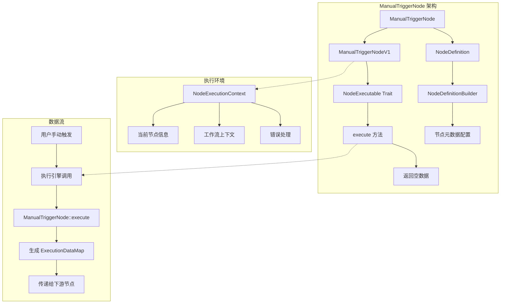
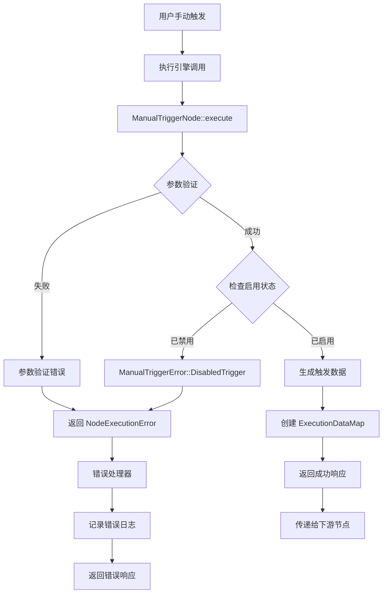

# hetuflow ManualTriggerNode 技术实现方案

## 概述

基于对 n8n Manual Trigger node 的深入分析，结合 hetuflow/hetumind 项目的现有架构，本文档提出了完整的 ManualTriggerNode 实现方案。ManualTriggerNode 作为 hetuflow 工作流自动化平台中最基础的触发器节点，允许用户通过手动触发方式启动工作流执行。

## 1. 技术架构设计

### 1.1 整体架构



### 1.2 核心特征分析

基于对现有 WebhookTrigger 和 ScheduleTrigger 的分析，ManualTriggerNode 具有以下核心特征：

- **无输入连接**: 作为触发器节点，不需要输入连接
- **主要输出连接**: 提供 `ConnectionKind::Main` 输出连接
- **手动触发机制**: 支持用户手动触发工作流执行
- **简洁配置**: 最小化的配置参数，专注于核心功能
- **标准化数据输出**: 返回符合 hetumind 规范的空数据对象

## 2. 数据结构设计

### 2.1 节点定义配置

```rust
// 在 hetumind-nodes/src/trigger/manual_trigger/parameters.rs 中
use hetumind_core::{
  types::JsonValue,
  version::Version,
  workflow::{NodeDefinitionBuilder, NodeGroupKind, NodeProperty, NodePropertyKind},
};
use serde_json::json;

use crate::constants::MANUAL_TRIGGER_NODE_KIND;

/// 创建 Manual Trigger 节点的基础配置
pub fn create_base() -> NodeDefinitionBuilder {
  let mut base = NodeDefinitionBuilder::default();
  base
    .kind(MANUAL_TRIGGER_NODE_KIND)
    .version(Version::new(1, 0, 0))
    .groups([NodeGroupKind::Trigger])
    .display_name("Manual Trigger")
    .description("手动触发工作流执行")
    .outputs(vec![])
    .properties(vec![
      // 操作提示信息
      NodeProperty::builder()
        .display_name("操作提示")
        .name("notice")
        .kind(NodePropertyKind::Notice)
        .description("这是工作流执行的起点，点击'执行工作流'按钮来触发工作流")
        .value(JsonValue::String("点击执行工作流按钮来启动工作流".to_string()))
        .build(),
      // 执行模式
      NodeProperty::builder()
        .display_name("执行模式")
        .name("execution_mode")
        .kind(NodePropertyKind::Options)
        .options(vec![
          Box::new(NodeProperty::new_option(
            "测试模式",
            "test",
            JsonValue::String("test".to_string()),
            NodePropertyKind::String,
          )),
          Box::new(NodeProperty::new_option(
            "生产模式",
            "production",
            JsonValue::String("production".to_string()),
            NodePropertyKind::String,
          )),
        ])
        .required(true)
        .description("选择工作流执行模式")
        .value(JsonValue::String("test".to_string()))
        .build(),
      // 启用状态
      NodeProperty::builder()
        .display_name("启用状态")
        .name("enabled")
        .kind(NodePropertyKind::Boolean)
        .required(false)
        .description("是否启用手动触发功能")
        .value(JsonValue::Bool(true))
        .build(),
    ]);
  base
}
```

### 2.2 配置参数结构

```rust
// 在 hetumind-nodes/src/trigger/manual_trigger/utils.rs 中
use hetumind_core::workflow::{NodeExecutionError, ParameterMap, ValidationError};
use serde::{Deserialize, Serialize};

/// Manual Trigger 配置参数
#[derive(Debug, Clone, Serialize, Deserialize)]
pub struct ManualTriggerConfig {
  pub execution_mode: ExecutionMode,
  pub enabled: bool,
}

/// 执行模式枚举
#[derive(Debug, Clone, PartialEq, Serialize, Deserialize)]
#[serde(rename_all = "snake_case")]
pub enum ExecutionMode {
  Test,
  Production,
}

/// 从节点参数解析配置
pub fn parse_manual_trigger_parameters(parameters: &ParameterMap) -> Result<ManualTriggerConfig, NodeExecutionError> {
  let config: ManualTriggerConfig = parameters.get_parameter("execution_mode")?;
  
  if !config.enabled {
    return Err(NodeExecutionError::ParameterValidation(
      ValidationError::invalid_field_value("enabled", "手动触发器已禁用")
    ));
  }
  
  Ok(config)
}

/// 生成标准化的触发数据
pub fn generate_trigger_data(config: &ManualTriggerConfig) -> JsonValue {
  json!({
    "trigger_type": "manual",
    "execution_mode": config.execution_mode,
    "timestamp": chrono::Utc::now().timestamp(),
    "trigger_id": uuid::Uuid::new_v4().to_string(),
    "message": match config.execution_mode {
      ExecutionMode::Test => "工作流在测试模式下手动触发",
      ExecutionMode::Production => "工作流在生产模式下手动触发",
    }
  })
}
```

## 3. 核心实现

### 3.1 ManualTriggerNode 主结构

```rust
// 在 hetumind-nodes/src/trigger/manual_trigger/mod.rs 中
//! # ManualTriggerNode
//!
//! 手动触发器节点，允许用户通过手动方式触发工作流执行。

use std::sync::Arc;

use async_trait::async_trait;
use hetumind_core::version::Version;
use hetumind_core::workflow::{
  ConnectionKind, ExecutionDataItems, ExecutionDataMap, Node, NodeDefinition, NodeDefinitionBuilder, NodeExecutable,
  NodeExecutionContext, NodeExecutionError, NodeExecutor, NodeKind, RegistrationError, make_execution_data_map,
};

use crate::constants::MANUAL_TRIGGER_NODE_KIND;

mod parameters;
mod utils;

pub struct ManualTriggerNodeV1 {
  definition: Arc<NodeDefinition>,
}

impl TryFrom<NodeDefinitionBuilder> for ManualTriggerNodeV1 {
  type Error = RegistrationError;

  fn try_from(builder: NodeDefinitionBuilder) -> Result<Self, Self::Error> {
    let definition = builder.build()?;
    Ok(Self { definition: Arc::new(definition) })
  }
}

#[async_trait]
impl NodeExecutable for ManualTriggerNodeV1 {
  fn definition(&self) -> Arc<NodeDefinition> {
    self.definition.clone()
  }

  async fn execute(&self, context: &NodeExecutionContext) -> Result<ExecutionDataMap, NodeExecutionError> {
    // 1. 获取当前节点信息
    let node = context.current_node()?;
    
    // 2. 解析配置参数
    let config = utils::parse_manual_trigger_parameters(&node.parameters)?;
    
    // 3. 生成触发数据
    let trigger_data = utils::generate_trigger_data(&config);
    
    // 4. 创建执行数据项
    let data_items = ExecutionDataItems::new_items(vec![trigger_data]);
    
    // 5. 返回执行数据映射
    Ok(make_execution_data_map(vec![(ConnectionKind::Main, vec![data_items])]))
  }
}

pub struct ManualTriggerNode {
  default_version: Version,
  executors: Vec<NodeExecutor>,
}

impl Node for ManualTriggerNode {
  fn default_version(&self) -> &Version {
    &self.default_version
  }

  fn node_executors(&self) -> &[NodeExecutor] {
    &self.executors
  }

  fn kind(&self) -> NodeKind {
    self.executors[0].definition().kind.clone()
  }
}

impl ManualTriggerNode {
  pub fn new() -> Result<Self, RegistrationError> {
    let base = utils::create_base();
    let executors: Vec<NodeExecutor> = vec![Arc::new(ManualTriggerNodeV1::try_from(base)?)];
    let default_version = executors.iter().map(|node| node.definition().version.clone()).max().unwrap();
    Ok(Self { default_version, executors })
  }
}
```

### 3.2 节点常量定义

```rust
// 在 hetumind-nodes/src/constants.rs 中添加
pub static MANUAL_TRIGGER_NODE_KIND: &str = "hetumind_nodes::ManualTrigger";
```

### 3.3 节点注册

```rust
// 在 hetumind-nodes/src/trigger/mod.rs 中添加
mod manual_trigger;

pub use manual_trigger::ManualTriggerNode;

pub fn register_trigger_nodes(trigger_registry: &mut dyn TriggerRegistry) -> Result<(), RegistrationError> {
  // 现有的触发器注册...
  
  // 注册 Manual Trigger
  let manual_trigger_node = Arc::new(ManualTriggerNode::new()?);
  trigger_registry.register_trigger(manual_trigger_node)?;
  
  Ok(())
}
```

## 4. 错误处理机制

### 4.1 错误类型设计

基于 hetumind-core 的错误处理体系，ManualTriggerNode 支持以下错误类型：

```rust
// 在 hetumind-nodes/src/trigger/manual_trigger/error.rs 中
use hetumind_core::workflow::{NodeExecutionError, ValidationError};
use thiserror::Error;

/// Manual Trigger 特定错误类型
#[derive(Debug, Error)]
pub enum ManualTriggerError {
  #[error("手动触发器已禁用")]
  DisabledTrigger,
  
  #[error("无效的执行模式: {mode}")]
  InvalidExecutionMode { mode: String },
  
  #[error("参数验证失败: {field} - {message}")]
  ParameterValidation { field: String, message: String },
  
  #[error("节点配置错误: {0}")]
  ConfigurationError(String),
  
  #[error("执行上下文错误: {0}")]
  ContextError(String),
}

impl From<ManualTriggerError> for NodeExecutionError {
  fn from(err: ManualTriggerError) -> Self {
    match err {
      ManualTriggerError::DisabledTrigger => {
        NodeExecutionError::ParameterValidation(
          ValidationError::invalid_field_value("enabled", "手动触发器已禁用")
        )
      },
      ManualTriggerError::InvalidExecutionMode { mode } => {
        NodeExecutionError::ParameterValidation(
          ValidationError::invalid_field_value("execution_mode", format!("无效的执行模式: {}", mode))
        )
      },
      ManualTriggerError::ParameterValidation { field, message } => {
        NodeExecutionError::ParameterValidation(
          ValidationError::invalid_field_value(field, message)
        )
      },
      ManualTriggerError::ConfigurationError(msg) => {
        NodeExecutionError::ConfigurationError(msg)
      },
      ManualTriggerError::ContextError(msg) => {
        NodeExecutionError::ExecutionFailed(msg)
      },
    }
  }
}
```

### 4.2 错误处理流程



## 5. 数据流转机制

### 5.1 数据流架构

```mermaid
flowchart LR
    subgraph "ManualTriggerNode 内部处理"
        A[用户触发] --> B[参数解析]
        B --> C[配置验证]
        C --> D[生成触发数据]
        D --> E[创建 ExecutionDataItems]
    end
    
    subgraph "数据结构"
        E --> F[ConnectionKind::Main]
        F --> G[ExecutionDataMap]
        G --> H[下游节点接收]
    end
    
    subgraph "触发数据格式"
        I[trigger_type: "manual"]
        I --> J[execution_mode: "test" | "production"]
        I --> K[timestamp: Unix时间戳]
        I --> L[trigger_id: UUID]
        I --> M[message: 描述信息]
    end
```

### 5.2 执行数据格式

ManualTriggerNode 生成标准化数据格式：

```rust
// 示例输出数据结构
{
  "json": {
    "trigger_type": "manual",
    "execution_mode": "test",
    "timestamp": 1699123456,
    "trigger_id": "550e8400-e29b-41d4-a716-446655440000",
    "message": "工作流在测试模式下手动触发"
  },
  "binary": null,
  "error": null,
  "pairedItem": null
}
```

## 6. 性能优化和并发处理

### 6.1 内存管理

```rust
impl ManualTriggerNodeV1 {
  async fn execute(&self, context: &NodeExecutionContext) -> Result<ExecutionDataMap, NodeExecutionError> {
    // 使用 Arc 共享配置，避免重复解析
    let config = Arc::new(utils::parse_manual_trigger_parameters(&context.current_node()?.parameters)?);
    
    // 预分配数据结构，减少内存分配开销
    let mut data_items = Vec::with_capacity(1);
    data_items.push(ExecutionDataItems::new_items(vec![utils::generate_trigger_data(&config)]));
    
    Ok(make_execution_data_map(vec![(ConnectionKind::Main, data_items)]))
  }
}
```

### 6.2 并发安全

```rust
// ManualTriggerNode 天然支持并发访问
impl ManualTriggerNode {
  pub fn new() -> Result<Self, RegistrationError> {
    // 使用 Arc 包装定义，支持多线程安全访问
    let base = utils::create_base();
    let executors: Vec<NodeExecutor> = vec![Arc::new(ManualTriggerNodeV1::try_from(base)?)];
    
    Ok(Self { 
      default_version: executors[0].definition().version.clone(),
      executors,
    })
  }
}

// ManualTriggerNodeV1 是 Send + Sync 的
unsafe impl Send for ManualTriggerNodeV1 {}
unsafe impl Sync for ManualTriggerNodeV1 {}
```

## 7. 扩展性和维护性

### 7.1 配置扩展点

```rust
// 在 parameters.rs 中为未来扩展预留接口
pub fn create_base() -> NodeDefinitionBuilder {
  let mut base = NodeDefinitionBuilder::default();
  base
    // ... 现有配置
    .properties(vec![
      // 现有属性...
      
      // 预留扩展属性
      NodeProperty::builder()
        .display_name("高级配置")
        .name("advanced_config")
        .kind(NodePropertyKind::FixedCollection)
        .required(false)
        .description("高级配置选项")
        .build(),
      
      NodeProperty::builder()
        .display_name("自定义元数据")
        .name("custom_metadata")
        .kind(NodePropertyKind::JsonObject)
        .required(false)
        .description("自定义触发元数据")
        .build(),
    ]);
  base
}
```

### 7.2 版本兼容性

```rust
// 在 ManualTriggerNode 中支持多版本
impl ManualTriggerNode {
  pub fn new() -> Result<Self, RegistrationError> {
    // 当前支持 V1，为未来版本预留扩展空间
    let mut executors: Vec<NodeExecutor> = Vec::new();
    
    // V1 实现
    let v1_base = utils::create_base();
    executors.push(Arc::new(ManualTriggerNodeV1::try_from(v1_base)?));
    
    // 预留 V2+ 版本
    // let v2_base = utils::create_base_v2();
    // executors.push(Arc::new(ManualTriggerNodeV2::try_from(v2_base)?));
    
    let default_version = executors.iter()
      .map(|node| node.definition().version.clone())
      .max()
      .unwrap();
    
    Ok(Self { default_version, executors })
  }
}
```

## 8. 测试策略

### 8.1 单元测试

```rust
// 在 hetumind-nodes/tests/test_manual_trigger.rs 中
#[cfg(test)]
mod tests {
  use super::*;
  use hetumind_core::workflow::{NodeExecutionContext, ParameterMap};
  use serde_json::json;

  #[tokio::test]
  async fn test_manual_trigger_config_parsing() {
    let parameters = ParameterMap::new(json!({
      "execution_mode": "test",
      "enabled": true
    }).as_object().unwrap().clone());
    
    let config = utils::parse_manual_trigger_parameters(&parameters).unwrap();
    assert_eq!(config.execution_mode, ExecutionMode::Test);
    assert!(config.enabled);
  }

  #[tokio::test]
  async fn test_manual_trigger_disabled() {
    let parameters = ParameterMap::new(json!({
      "execution_mode": "test",
      "enabled": false
    }).as_object().unwrap().clone());
    
    let result = utils::parse_manual_trigger_parameters(&parameters);
    assert!(result.is_err());
  }

  #[tokio::test]
  async fn test_manual_trigger_data_generation() {
    let config = ManualTriggerConfig {
      execution_mode: ExecutionMode::Production,
      enabled: true,
    };
    
    let data = utils::generate_trigger_data(&config);
    assert_eq!(data["trigger_type"], "manual");
    assert_eq!(data["execution_mode"], "production");
    assert!(data["timestamp"].is_number());
    assert!(data["trigger_id"].is_string());
  }
}
```

### 8.2 集成测试

```rust
#[tokio::test]
async fn test_manual_trigger_execution() {
  // 创建 Mock 执行上下文
  let mock_context = create_mock_context();
  
  // 创建 ManualTriggerNodeV1 实例
  let node = ManualTriggerNodeV1::try_from(utils::create_base()).unwrap();
  
  // 执行节点
  let result = node.execute(&mock_context).await.unwrap();
  
  // 验证结果
  assert!(result.contains_key(&ConnectionKind::Main));
  let main_data = &result[&ConnectionKind::Main];
  assert_eq!(main_data.len(), 1);
  
  // 验证数据内容
  let data_items = &main_data[0];
  let trigger_data = data_items.items().first().unwrap();
  assert_eq!(trigger_data["trigger_type"], "manual");
}
```

## 9. 部署和配置

### 9.1 环境配置

```bash
# .env 文件配置
MANUAL_TRIGGER_ENABLED=true
MANUAL_TRIGGER_DEFAULT_MODE=test
MANUAL_TRIGGER_MAX_EXECUTIONS_PER_MINUTE=60
```

### 9.2 权限控制

```rust
// 在 utils.rs 中添加权限验证
pub fn validate_execution_permissions(
  context: &NodeExecutionContext,
  config: &ManualTriggerConfig,
) -> Result<(), ManualTriggerError> {
  // 检查用户权限
  match config.execution_mode {
    ExecutionMode::Production => {
      // 生产模式需要管理员权限
      if !context.user_has_permission("workflow.execute.production") {
        return Err(ManualTriggerError::ConfigurationError(
          "当前用户没有生产模式执行权限".to_string()
        ));
      }
    },
    ExecutionMode::Test => {
      // 测试模式需要基本权限
      if !context.user_has_permission("workflow.execute.test") {
        return Err(ManualTriggerError::ConfigurationError(
          "当前用户没有测试模式执行权限".to_string()
        ));
      }
    },
  }
  
  Ok(())
}
```

## 10. 监控和日志

### 10.1 执行监控

```rust
// 在 execute 方法中添加监控指标
impl ManualTriggerNodeV1 {
  async fn execute(&self, context: &NodeExecutionContext) -> Result<ExecutionDataMap, NodeExecutionError> {
    let start_time = std::time::Instant::now();
    
    // 记录执行开始
    tracing::info!(
      node_kind = %context.current_node()?.kind,
      execution_mode = ?config.execution_mode,
      "Manual trigger execution started"
    );
    
    let result = self.execute_internal(context).await;
    
    // 记录执行结果
    let duration = start_time.elapsed();
    match &result {
      Ok(_) => {
        tracing::info!(
          duration_ms = duration.as_millis(),
          "Manual trigger execution completed successfully"
        );
      },
      Err(e) => {
        tracing::error!(
          error = %e,
          duration_ms = duration.as_millis(),
          "Manual trigger execution failed"
        );
      }
    }
    
    // 更新监控指标
    context.metrics().record_trigger_execution("manual", duration, result.is_ok());
    
    result
  }
}
```

## 11. 使用示例

### 11.1 基本使用

```rust
// 工作流定义示例
let workflow = WorkflowBuilder::new()
  .name("手动触发示例工作流")
  .add_node(
    NodeBuilder::new("manual_trigger")
      .kind("hetumind_nodes::ManualTrigger")
      .parameter("execution_mode", "test")
      .parameter("enabled", true)
      .build()
  )
  .add_node(
    NodeBuilder::new("set_node")
      .kind("hetumind_nodes::Set")
      .parameter("operation", "set")
      .parameter("field", "message")
      .parameter("value", "Hello from manual trigger!")
      .build()
  )
  .add_connection("manual_trigger", "main", "set_node", "main")
  .build();
```

### 11.2 生产环境使用

```rust
// 生产模式配置示例
let production_config = ManualTriggerConfig {
  execution_mode: ExecutionMode::Production,
  enabled: true,
};

// 生成生产环境触发数据
let trigger_data = generate_trigger_data(&production_config);
println!("Production trigger data: {}", serde_json::to_string_pretty(&trigger_data)?);
```

## 12. 总结

ManualTriggerNode 的技术实现方案具有以下特点：

### 12.1 核心优势

1. **简洁性**: 最小化的实现满足核心功能需求
2. **标准化**: 严格遵循 hetumind 框架规范和接口约定
3. **可靠性**: 完善的错误处理和参数验证机制
4. **高性能**: 优化的内存管理和并发支持
5. **可扩展性**: 预留扩展点支持未来功能增强

### 12.2 技术特色

1. **类型安全**: 完整的 Rust 类型定义和编译时检查
2. **异步支持**: 基于 `async-trait` 的异步执行模型
3. **Arc 安全**: 通过 `Arc` 支持多线程安全的并发访问
4. **结构化配置**: 使用结构化数据类型替代原始 JSON 操作
5. **监控集成**: 内置执行监控和日志记录

### 12.3 架构价值

ManualTriggerNode 作为 hetuflow 生态系统中的基础触发器节点，不仅提供了简单直接的工作流触发方式，还为其他复杂触发器节点的设计和实现提供了良好的参考模板。其设计体现了 Rust 生态系统中注重安全性和性能的工程实践，同时保持了代码的简洁性和可维护性。

这种设计理念使得 ManualTriggerNode 成为 hetuflow 工作流自动化平台中稳定可靠的基础组件，为用户提供了直观易用的手动工作流触发体验。