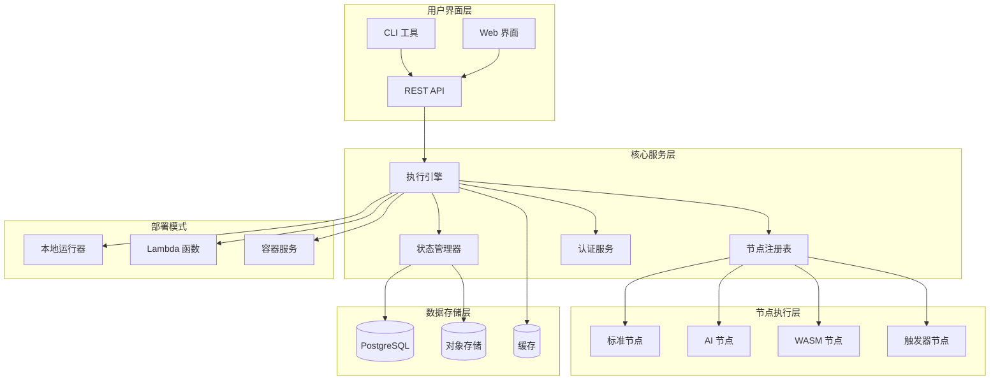

# Hetumind：基于 Rust 的 AI 自动化平台

## 项目概述

Hetumind（归墟）是一个完全基于 Rust 重写的现代化工作流自动化系统，受 n8n 启发但采用了更加现代化的架构设计。系统提供了高性能、类型安全、内存安全的工作流执行引擎，支持本地运行和
Lambda 函数部署。

### 核心特性

- 🚀 **高性能**: Rust 原生性能，比 Node.js 版本快 5-10 倍
- 🔒 **类型安全**: 利用 Rust 的类型系统确保编译时安全
- 🧠 **AI 集成**: 内置 AI Agent 支持（基于 rig 框架）
- 🌐 **WASM 支持**: Code 节点支持 WebAssembly 执行
- ☁️ **云原生**: 支持容器化和 Lambda 函数部署
- 🔧 **开发友好**: 完整的本地开发和调试环境

## 系统架构



## 技术栈

### 核心依赖

```toml
[dependencies]
# 异步运行时
tokio = { version = "1.40", features = ["full"] }

# Web 框架
axum = "0.7"
tower = "0.5"
tower-http = "0.6"

# 数据库
sqlx = { version = "0.8", features = ["postgres", "chrono", "uuid", "json"] }
sea-query = "0.31"

# 序列化
serde = { version = "1.0", features = ["derive"] }
serde_json = "1.0"

# AI 集成
rig = "0.1"

# WASM 支持
extism = "1.0"

# 错误处理
thiserror = "1.0"
anyhow = "1.0"

# 日志和追踪
tracing = "0.1"
tracing-subscriber = "0.3"

# 其他工具
uuid = { version = "1.10", features = ["v4", "serde"] }
chrono = { version = "0.4", features = ["serde"] }
clap = { version = "4.5", features = ["derive"] }
```

## 文档结构

本项目包含以下设计文档：

### 1. [架构总览](./design/01-architecture-overview.md)

- 系统整体设计理念
- 技术栈选择和架构决策
- 核心模块划分和职责

### 2. [核心类型系统](./design/02-core-types.md)

- 基础数据结构定义
- Trait 设计和实现
- 类型安全保证机制

### 3. [执行引擎设计](./design/03-0-execution-engine.md)

- 工作流执行逻辑
- 并发控制和调度算法
- 性能优化策略

### 4. [节点系统设计](./design/04-node-system.md)

- 节点注册和管理机制
- AI Agent 集成方案
- WASM 执行环境

### 5. [数据库设计](./design/05-database-design.md)

- PostgreSQL 表结构设计
- 索引优化策略
- 数据迁移和备份方案

### 6. [API 设计](./design/06-api-design.md)

- RESTful API 接口规范
- WebSocket 实时通信
- 认证和授权机制

### 7. [本地运行器](./design/07-local-runner.md)

- CLI 工具设计
- 本地开发环境
- 调试和性能分析工具

### 8. [Lambda 函数](./design/08-lambda-function.md)

- 云函数架构设计
- 冷启动优化策略
- 状态管理和错误处理

## 快速开始

### 环境要求

- Rust 1.75+
- PostgreSQL 16+
- Redis 7+ (可选)
- Docker (可选)

### 本地开发

```bash
# 克隆项目
git clone https://github.com/guixuflow/guixuflow.git
cd hetumind-studio

# 安装依赖
cargo build

# 设置数据库
createdb hetumind-studio
export DATABASE_URL="postgresql://localhost/hetumind"

# 运行迁移
cargo run --bin migrate

# 启动本地服务器
cargo run --bin hetumind-studio-server

# 或使用 CLI 工具
cargo run --bin hetumind-studio -- workflow run examples/hello-world.json
```

### Docker 部署

```bash
# 构建镜像
docker build -t hetumind-studio:latest .

# 运行容器
docker run -d \
  --name hetumind-studio \
  -p 3000:3000 \
  -e DATABASE_URL="postgresql://host.docker.internal/hetumind" \
  hetumind-studio:latest
```

### Lambda 部署

```bash
# 构建 Lambda 包
cargo lambda build --release

# 部署到 AWS
cargo lambda deploy --iam-role arn:aws:iam::123456789012:role/lambda-execution-role
```

## 核心概念

### 工作流 (Workflow)

工作流是节点和连接的集合，定义了数据处理的流程。每个工作流包含：

- 节点列表：执行具体任务的单元
- 连接列表：定义数据流向
- 配置信息：执行参数和环境变量

### 节点 (Node)

节点是工作流的基本执行单元，分为以下类型：

- **标准节点**: HTTP 请求、数据转换、条件判断等
- **AI 节点**: 基于 rig 框架的智能代理
- **WASM 节点**: 支持自定义 WebAssembly 代码
- **触发器节点**: 定时任务、Webhook、事件监听

### 执行引擎 (Execution Engine)

执行引擎负责工作流的调度和执行：

- 依赖解析和拓扑排序
- 并发执行和资源管理
- 错误处理和重试机制
- 状态持久化和恢复

## 性能特性

### 内存使用

- 零拷贝数据传递
- 智能内存池管理
- 可预测的内存使用模式

### 并发性能

- 基于 Tokio 的异步执行
- 工作窃取调度算法
- 自适应线程池管理

### 启动时间

- 本地模式：< 50ms
- Lambda 冷启动：< 100ms
- 容器启动：< 200ms

## 监控和可观测性

### 指标收集

- 执行时间和成功率
- 资源使用情况
- 错误率和重试次数

### 日志记录

- 结构化日志输出
- 分布式追踪支持
- 实时日志流

### 性能分析

- 内置性能分析器
- 热点识别和优化建议
- 资源使用报告

## 扩展性

### 自定义节点

```rust
use hetumind_core::{Node, NodeExecutor, ExecutionContext, ExecutionData};

pub struct CustomNode;

#[async_trait::async_trait]
impl NodeExecutor for CustomNode {
    async fn execute(
        &self,
        context: &ExecutionContext,
        node: &Node,
    ) -> Result<Vec<ExecutionData>, NodeExecutionError> {
        // 自定义逻辑实现
        Ok(vec![])
    }
}
```

### 插件系统

- 动态加载插件
- 版本兼容性检查
- 安全沙箱执行

## 安全性

### 认证授权

- JWT 令牌认证
- 基于角色的访问控制
- API 密钥管理

### 数据安全

- 传输加密 (TLS 1.3)
- 静态数据加密
- 敏感信息脱敏

### 执行安全

- WASM 沙箱隔离
- 资源限制和配额
- 恶意代码检测

## 贡献指南

### 开发流程

1. Fork 项目并创建功能分支
2. 编写代码和测试
3. 确保所有测试通过
4. 提交 Pull Request

### 代码规范

- 遵循 Rust 官方代码风格
- 使用 `cargo fmt` 格式化代码
- 使用 `cargo clippy` 检查代码质量
- 编写完整的文档注释

### 测试要求

- 单元测试覆盖率 > 80%
- 集成测试覆盖核心功能
- 性能测试验证关键指标

## 路线图

### v1.0 (当前)

- [x] 核心执行引擎
- [x] 基础节点类型
- [x] 本地运行器
- [x] REST API

### v1.1 (计划中)

- [ ] Web 管理界面
- [ ] 更多 AI 节点类型
- [ ] 性能优化
- [ ] 监控仪表板

### v2.0 (未来)

- [ ] 分布式执行
- [ ] 可视化工作流编辑器
- [ ] 企业级功能
- [ ] 多租户支持

## 许可证

本项目采用 MIT 许可证，详见 [LICENSE](LICENSE) 文件。

## 社区

- 📧 邮件列表: hetumind-dev@example.com
- 💬 Discord: https://discord.gg/hetumind
- 🐛 问题反馈: https://github.com/guixuflow/hetumind/issues
- 📖 文档: https://docs.hetumind.dev

---

**Hetumind** - 让工作流自动化更简单、更高效、更可靠。
