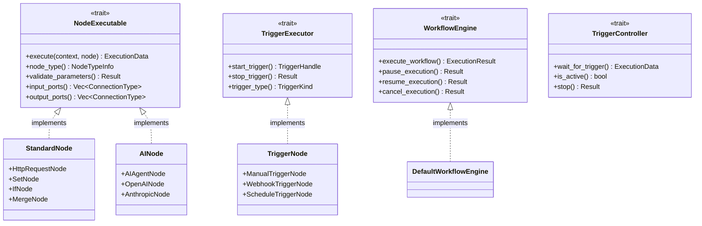

# Hetumind 核心类型系统设计

## 1. 基础类型定义

### 1.1 核心标识符类型

```rust
use chrono::{DateTime, FixedOffset};
use serde::{Deserialize, Serialize};
use uuid::Uuid;
use std::collections::HashMap;
use fusion_common::time::OffsetDateTime;

/// 节点唯一标识符
pub type NodeId = Uuid;

/// 工作流唯一标识符
pub type WorkflowId = Uuid;

/// 执行唯一标识符
pub type ExecutionId = Uuid;

/// 用户唯一标识符
pub type UserId = Uuid;

/// 连接唯一标识符
pub type ConnectionId = Uuid;

/// 时间戳类型
pub type Timestamp = OffsetDateTime;

/// JSON 值类型
pub type JsonValue = serde_json::Value;

/// 参数映射类型
pub type ParameterMap = HashMap<String, JsonValue>;
```

### 1.2 执行状态枚举

- [ExecutionStatus](../../../crates/hetumind/hetumind-core/src/workflow/execution.rs)
- [NodeExecutionStatus](../../../crates/hetumind/hetumind-core/src/node/model.rs)

#### 状态转换关系

节点状态如何影响工作流状态：

1. **Running**: 只要有任何节点是 `Running`，工作流就是 `Running`
2. **Success**: 所有节点都是 `Success` 或 `Skipped` 时，工作流才是 `Success`
3. **Failed**: 任何关键节点 `Failed` 且没有错误处理时，工作流变为 `Failed`
4. **Waiting**: 当工作流需要等待外部事件（如所有当前活跃节点都是 `Waiting`）时

### 1.3 节点类型枚举

- [NodeKind](../../../hetumind-core/src/workflow/node.rs)。某种程度上是节点的唯一名字，多个不同版本的节点都使用同一个 NodeKind，所有 NodeKind 为 String newtype
- [TriggerKind](../../../hetumind-core/src/node/model.rs)

## 2. 核心数据结构

### 2.1 工作流结构

- [Workflow](../../../crates/hetumind/hetumind-core/src/workflow/model.rs)
- [WorkflowSettings](../../../crates/hetumind/hetumind-core/src/workflow/model.rs)
- [ErrorHandlingStrategy](../../../crates/hetumind/hetumind-core/src/workflow/model.rs)
- [ExecutionMode](../../../crates/hetumind/hetumind-core/src/workflow/model.rs)

### 2.2 节点结构

- [WorkflowNode](../../../crates/hetumind/hetumind-core/src/node/model.rs)

### 2.3 连接结构

- [ConnectionPort](../../../crates/hetumind/hetumind-core/src/node/port.rs)
- [Connection](../../../crates/hetumind/hetumind-core/src/node/connection.rs)

## 3. 执行相关结构

### 3.1 执行实例

- [ExecutionMetadata](../../../crates/hetumind/hetumind-core/src/workflow/execution.rs)
- [Execution](../../../crates/hetumind/hetumind-core/src/workflow/execution.rs):
  代表正在运行或已完成的工作流的对象，它是执行引擎进行所有操作的核心。它是在内存中传递，包含执行状态和数据，被
  WorkflowEngine 所使用。
- [ExecutionResult](../../../crates/hetumind/hetumind-core/src/workflow/execution.rs)

- [ExecutionEntity](../../../crates/hetumind/hetumind-studio/src/domain/workflow/workflow_model.rs)：持久化到数据库

### 3.2 节点执行

- [NodeExecution](../../../crates/hetumind/hetumind-core/src/node/execution.rs)
- [NodeExecutionResult](../../../crates/hetumind/hetumind-core/src/node/execution.rs)

### 3.3 执行上下文

- [NodeExecutionContext](../../../crates/hetumind/hetumind-core/src/node/execution.rs)
- [ExecutionData](../../../crates/hetumind/hetumind-core/src/node/execution.rs): 节点之间的执行数据（传递）
- [DataSource](../../../crates/hetumind/hetumind-core/src/node/execution.rs)
- [BinaryDataReference](../../../crates/hetumind/hetumind-core/src/node/execution.rs)

##### 与 n8n 总览对比

| Hetumind 结构 (.rs)  | n8n 对应概念 (.ts)                                  | 主要区别与优势                                                                                |
| -------------------- | --------------------------------------------------- | --------------------------------------------------------------------------------------------- |
| NodeExecutionContext | IExecuteFunctions (作为 this 上下文)                | 数据驱动 vs. 服务驱动。Hetumind 的 struct 更明确、易于序列化和跨线程/服务传递。               |
| ExecutionData        | INodeExecutionData (主要包含 json 和 binary 属性)   | 结构更丰富。Hetumind 显式包含了 source 和 index，数据溯源能力更强。                           |
| DataSource           | 隐式存在于表达式中 (e.g., $('Node Name').item.json) | 数据血缘明确。Hetumind 将数据来源作为元数据携带，极大地方便了调试和日志分析。                 |
| BinaryDataReference  | IBinaryData                                         | 引用 vs. 实体。Hetumind 的设计更适合分布式/无服务器环境，避免了在内存中传递庞大的二进制数据。 |

n8n 的方式:

在 n8n 中，没有一个单一的 NodeExecutionContext 对象。取而代之的是，在执行节点的 execute 方法时，其 this 上下文是一个实现了
IExecuteFunctions 接口的对象。节点通过调用 this 上的方法来获取所需信息，例如：

- `this.getInputData()`：获取输入数据
- `this.getWorkflow()`：获取工作流对象
- `this.getNode()`：获取当前节点
- `this.getCredentials('credentialName')`：获取凭证

分析与比较:

- 设计范式:
  - Hetumind: 采用了数据驱动的方法。NodeExecutionContext 是一个包含了所有必需信息的不可变（或 Clone）的数据结构。这非常符合
    Rust 的理念，使得上下文的传递非常明确，易于测试、序列化，以及跨线程/网络传递（例如传递给 Lambda 函数）。
  - n8n: 采用了服务驱动的方法。this 对象像一个服务容器，按需提供数据和功能。这种方式更动态，但在强类型语言中实现会更复杂，且状态管理不那么直观。
- 优势: 当前的设计更胜一筹。它让节点执行函数的签名变得非常清晰，依赖关系一目了然，并且为未来的分布式执行打下了坚实的基础。

## 4. 核心 Trait 定义

### 4.1 节点执行 Trait

- [NodeExecutable](../../../crates/hetumind/hetumind-core/src/node/executor.rs)
- [TriggerExecutor](../../../crates/hetumind/hetumind-core/src/node/trigger.rs)

### 4.2 工作流引擎 Trait

- [WorkflowEngine](../../../crates/hetumind/hetumind-core/src/workflow/engine.rs)

- 关系总结: WorkflowEngine 是所有这些组件的中心协调者。它的工作流程如下：
  1. 接收触发: 从一个 TriggerController 那里接收到 ExecutionData，或者通过 API 调用手动触发。
  2. 启动执行: 创建一个 ExecutionContext，开始执行工作流。
  3. 遍历图: 按照工作流的图结构，一个接一个地处理节点。
  4. 委托任务: 对于每一个要执行的节点，它向 NodeRegistry 请求对应的 NodeExecutable。
  5. 调用执行: 调用该 executor 的 execute 方法，并将当前的 ExecutionContext 传递给它。
  6. 收集结果: 收集 executor 的返回结果（Vec<ExecutionData>），并将其准备好作为下一个节点的输入。
  7. 管理状态: 更新整个工作流的执行状态 (ExecutionStatus) 和各个节点的执行日志。
  8. 循环: 重复 3-7 步，直到没有更多的节点可以执行。
  9. 完成: 返回最终的 ExecutionResult。
- n8n 的对应物: WorkflowExecute.ts 和 Execute.ts 中的一系列类和函数。它们共同构成了 n8n 的执行核心。

## 5. 类型关系图

### 5.1 核心结构关系


### 5.2 Trait 继承关系



## 6. 错误处理类型

### 6.1 错误定义

- [GuixuError](../../../crates/hetumind/hetumind-context/src/error.rs)
- [WorkflowExecutionError](../../../crates/hetumind/hetumind-core/src/workflow/error.rs)
- [NodeExecutionError](../../../crates/hetumind/hetumind-core/src/node/error.rs)
- [TriggerError](../../../crates/hetumind/hetumind-core/src/node/error.rs)
- [ValidationError](../../../crates/hetumind/hetumind-core/src/common/error.rs)

这个核心类型系统为 Hetumind 提供了类型安全的基础架构，确保在编译时就能捕获大部分错误，同时提供了清晰的数据结构和接口定义。
