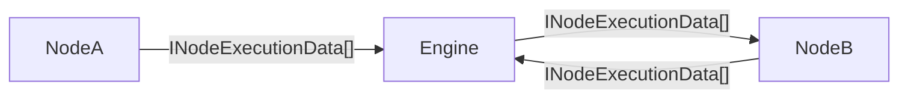

# ExecutionData of n8n

### 1. `INodeExecutionData` 的实现类

这是一个关键点：`INodeExecutionData` 是一个 TypeScript **`interface`**，而不是一个 `class`。

这意味着它**没有传统的“实现类”**。在 TypeScript 的结构化类型系统（Structural Typing）中，任何一个对象，只要它的“形状”符合 `INodeExecutionData` 接口的定义（即至少拥有一个 `json: IDataObject` 属性），就被认为是合法的 `INodeExecutionData` 类型。

所以，你不会在代码库中找到 `class MyExecutionData implements INodeExecutionData` 这样的代码。相反，你会看到 n8n 在各处创建**符合该接口形状的普通 JavaScript 对象**。

---

### 2. `INodeExecutionData` 是如何构建的？

`INodeExecutionData` 对象主要在节点的 `execute`, `trigger`, `poll` 等核心方法内部被构建，准备作为输出返回。构建方式主要有两种：

#### a) 使用辅助函数 (Helpers) - 最常见

n8n 提供了便捷的辅助函数来简化这个过程，开发者不需要手动构建整个对象。

```typescript
// 在一个节点的 execute 方法内部
async execute(this: IExecuteFunctions): Promise<INodeExecutionData[][]> {
    const items = this.getInputData();
    const returnData: IDataObject[] = [];

    for (let i = 0; i < items.length; i++) {
        const name = this.getNodeParameter('name', i) as string;
        const newJsonData = {
            message: `Hello ${name}!`,
            processedAt: new Date(),
        };
        returnData.push(newJsonData);
    }

    // this.helpers.returnJsonArray 会自动将每个 IDataObject 包装成 INodeExecutionData
    // 结果：[{ json: { message: '...' } }, { json: { message: '...' } }]
    return this.helpers.returnJsonArray(returnData);
}
```

`this.helpers.returnJsonArray()` 负责了将简单的 JSON 对象数组 `IDataObject[]` 转换为 `INodeExecutionData[]` 的繁琐工作。

#### b) 手动构建 - 用于复杂场景

在需要附加二进制文件、错误信息或自定义配对信息时，开发者会手动构建对象。

```typescript
// 在一个节点的 execute 方法内部
async execute(this: IExecuteFunctions): Promise<INodeExecutionData[][]> {
    const items = this.getInputData();
    const returnData: INodeExecutionData[] = [];

    for (let i = 0; i < items.length; i++) {
        try {
            // ... 一些可能出错的操作 ...
            const result = await someApiCall();

            const newItem: INodeExecutionData = {
                json: result, // API 返回的 JSON 数据
                // 将此输出项与触发它的输入项进行配对，用于数据追踪
                pairedItem: {
                    item: i,
                },
            };
            returnData.push(newItem);

        } catch (error) {
            if (this.continueOnFail()) {
                const errorItem: INodeExecutionData = {
                    json: { // 依然提供一个 json 对象
                        error: error.message,
                        originalItem: items[i].json,
                    },
                    error: new NodeApiError(this.getNode(), error, { itemIndex: i }), // 附加一个标准的错误对象
                    pairedItem: {
                        item: i,
                    },
                };
                returnData.push(errorItem);
            } else {
                throw error;
            }
        }
    }
    return [returnData];
}
```

---

### 3. n8n 在哪些场景中运用它？

`INodeExecutionData` 是 n8n 数据流的原子单位，被用于以下所有核心场景：

#### a) **节点间数据传递的核心载体**

这是它最根本的用途。工作流中从一个节点流向下个节点的所有数据，都被包裹在 `INodeExecutionData` 对象的数组中 (`INodeExecutionData[]`)。



#### b) **封装不同类型的数据**

一个 `INodeExecutionData` 对象可以同时携带多种数据：

- **`json` (必需)**: 存放核心的、结构化的 JSON 数据。这是所有 item 的基础。
- **`binary` (可选)**: 存放二进制数据（如文件）。它不直接存储文件内容，而是存储文件的元数据和一个 key，该 key 指向内存中的二进制数据存储区。这避免了巨大的文件内容污染主数据流。
- **`error` (可选)**: 当节点配置了 "Continue on Fail" 时，用它来携带错误信息向下游传递，而不是让整个工作流崩溃。

```mermaid
graph TD
    subgraph INodeExecutionData
        A[json: {...}]
        B[binary?: {...}]
        C[error?: ErrorObject]
        D[pairedItem?: {...}]
    end
    A -- Mandatory --> INodeExecutionData
    B -- Optional --> INodeExecutionData
    C -- Optional --> INodeExecutionData
    D -- Optional --> INodeExecutionData
```

#### c) **数据溯源与配对 (`pairedItem`)**

`pairedItem` 属性是实现复杂数据合并和追踪的关键。

- **1 对 1**: 在简单节点中，`pairedItem: { item: 0 }` 表示这个输出项是由第一个输入项生成的。
- **多对 1 (Merge)**: 在 Merge 节点中，一个输出项可能由多个输入流的项合并而来，此时 `pairedItem` 会是一个数组，例如 `pairedItem: [{ input: 0, item: 5 }, { input: 1, item: 2 }]`。这清晰地记录了数据的完整血缘关系。

#### d) **作为节点方法的输入和输出**

所有处理数据的节点方法，其**输入** (`this.getInputData()`) 和**输出** (方法的 `return` 值) 都被严格定义为 `INodeExecutionData` 的数组。这形成了 n8n 节点开发的统一接口规范。

**总结**: `INodeExecutionData` 不仅仅是一个简单的 "数据持有者"，它是一个经过精心设计的、多功能的**数据容器**。它统一了 JSON 数据、二进制数据和错误信息的处理方式，并通过 `pairedItem` 机制提供了强大的数据溯源能力，是支撑 n8n 强大而灵活的执行引擎的基石。
