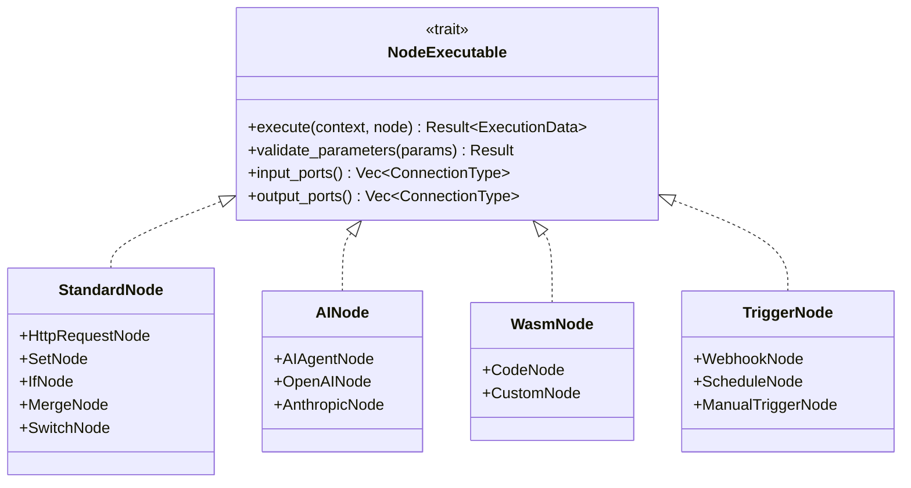

# Hetumind 节点系统设计

## 1. 节点系统概述

Hetumind 节点系统提供了可扩展的节点架构，支持标准节点、AI Agent 和 WASM 执行环境。每个节点都实现统一的 `NodeExecutable`
trait，确保类型安全和高性能执行。

### 1.1 节点架构



### 1.2 节点数据类型

#### 1.2.1 节点属性

节点属性（节点参数）定义节点可以接收的参数定义，如：参数名（`field`）、参数类型、界面控件、默认值、等。

- [`PropertyKind`](../../../crates/hetumind/hetumind-core/src/node/property.rs)

**NodeProperties**
工作流节点属性定义

- [`NodeProperties`](../../../crates/hetumind/hetumind-core/src/node/property.rs)

```rust
/// 能用节点属性设置，各具体实现节点可以有自己的设置。但同名属性（struct 内）应该保持与 PropertyDefinition 相同的全名和含义
///
/// `value`, `default_value`, `expression` 在定义时至少要设置一个
pub struct PropertyDefinition {
  pub kind: PropertyKind,
  /// 接口直接传入的值
  pub value: Option<JsonValue>,
  /// 默认值。当 value 和 expression 都为空时
  pub default_value: Option<JsonValue>,
  /// 表达式。可以从 input_data (`Vec<ExecutionData>`) 中检索拉取及进行计算后的值
  pub expression: Option<Expression>,
}

pub struct NodeProperties {
  pub properties: Vec<NodeProperty>,
}

pub struct NodeProperty {
  pub field: String,
  pub property: JsonValue,
}

impl NodeProperty {
  pub fn get_property<T>(&self, field: &str) -> Result<T, ValidationError>
  where T: DeserializedOwner {
    let property = self.properties.iter().find(|p| p.field == field)?;
    serde_json.from_value(property.property)
  }
}
```

对于 `IfNode` 的节点属性定义，**IfProperty** 如下：

```rust
pub struct IfProperty {

}
```

## 2. 节点注册系统

### 2.1 节点注册表

- [NodeRegistry](../../../crates/hetumind/hetumind-studio/src/runtime/node/node_registry.rs)
- [NodeGroup](../../../crates/hetumind/hetumind-core/src/node/model.rs)
- [NodeDefinition](../../../crates/hetumind/hetumind-core/src/node/model.rs)

### 2.2 标准节点实现

#### NodeGroup: Core

- [IfNode](../../../crates/hetumind/hetumind-nodes/src/core/if_node.rs)
- [MergeNode](../../../crates/hetumind/hetumind-nodes/src/core/merge_node.rs)
- [SetNode](../../../crates/hetumind/hetumind-nodes/src/core/set_node.rs)
- [LoopOverItems](../../../crates/hetumind/hetumind-nodes/src/core/loop_over_items.rs)

#### NodeGroup: Integration

- [HttpRequestNode](../../../crates/hetumind/hetumind-nodes/src/integration/http_request_node/http_request.rs)

## 3. AI Agent 节点

### 3.1 AI Agent 基础结构

```rust
use rig::{Agent, Tool, ChatModel};

pub struct AIAgentNode {
    /// Rig Agent 实例
    agent: Option<Agent>,
    /// 配置的工具列表
    tools: Vec<Box<dyn Tool + Send + Sync>>,
}

#[async_trait::async_trait]
impl NodeExecutable for AIAgentNode {
    async fn execute(
        &self,
        context: &ExecutionContext,
        node: &Node,
    ) -> Result<Vec<ExecutionData>, NodeExecutionError> {
        // 获取 AI 模型配置
        let model_config = self.get_parameter::<ModelConfig>(&node.parameters, "model")?;
        let system_prompt = self.get_parameter::<String>(&node.parameters, "system_prompt")
            .unwrap_or_else(|_| "You are a helpful assistant.".to_string());

        // 创建 Rig Agent
        let agent = Agent::new()
            .with_model(self.create_model(&model_config)?)
            .with_system_prompt(&system_prompt)
            .with_tools(self.tools.clone());

        // 获取用户输入
        let user_input = context.input_data
            .first()
            .and_then(|d| d.data.as_str())
            .ok_or(NodeExecutionError::InvalidInputData)?;

        // 执行 AI Agent
        let response = agent.chat(user_input).await
            .map_err(|e| NodeExecutionError::ExternalServiceError {
                service: "AI Model".to_string(),
                error: e.to_string(),
            })?;

        Ok(vec![ExecutionData {
            data: serde_json::json!({
                "response": response.content,
                "model": model_config.model_name,
                "tokens_used": response.usage.total_tokens,
            }),
            source: None,
            index: 0,
            binary: None,
        }])
    }

    fn node_type(&self) -> &NodeDefinition {
        &NodeDefinition {
            name: "ai_agent".to_string(),
            display_name: "AI Agent".to_string(),
            description: "AI智能代理节点".to_string(),
            group: NodeGroup::AI,
            version: "1.0.0".to_string(),
            icon: Some("brain".to_string()),
            inputs: vec![PortDefinition::main()],
            outputs: vec![PortDefinition::main()],
            parameters: vec![
                ParameterDefinition::object("model", "模型配置", true),
                ParameterDefinition::string("system_prompt", "系统提示", false),
                ParameterDefinition::array("tools", "工具列表", false),
            ],
        }
    }
}

#[derive(Debug, Clone, Serialize, Deserialize)]
pub struct ModelConfig {
    pub provider: String,  // "openai", "anthropic", "ollama"
    pub model_name: String,
    pub api_key: Option<String>,
    pub base_url: Option<String>,
    pub temperature: Option<f32>,
    pub max_tokens: Option<u32>,
}
```

### 3.2 AI 工具系统

```rust
#[async_trait::async_trait]
pub trait AITool: Send + Sync {
    /// 工具名称
    fn name(&self) -> &str;

    /// 工具描述
    fn description(&self) -> &str;

    /// 参数模式
    fn parameters(&self) -> serde_json::Value;

    /// 执行工具
    async fn execute(&self, parameters: serde_json::Value) -> Result<serde_json::Value, ToolError>;
}

// HTTP 请求工具示例
pub struct HttpTool;

#[async_trait::async_trait]
impl AITool for HttpTool {
    fn name(&self) -> &str {
        "http_request"
    }

    fn description(&self) -> &str {
        "发送HTTP请求获取数据"
    }

    fn parameters(&self) -> serde_json::Value {
        serde_json::json!({
            "type": "object",
            "properties": {
                "url": {"type": "string", "description": "请求URL"},
                "method": {"type": "string", "enum": ["GET", "POST"], "default": "GET"}
            },
            "required": ["url"]
        })
    }

    async fn execute(&self, parameters: serde_json::Value) -> Result<serde_json::Value, ToolError> {
        let url = parameters["url"].as_str()
            .ok_or(ToolError::InvalidParameter("url".to_string()))?;
        let method = parameters["method"].as_str().unwrap_or("GET");

        let client = reqwest::Client::new();
        let response = match method {
            "GET" => client.get(url).send().await?,
            "POST" => client.post(url).send().await?,
            _ => return Err(ToolError::UnsupportedMethod(method.to_string())),
        };

        let data = response.json::<serde_json::Value>().await?;
        Ok(data)
    }
}
```

## 4. WASM 执行支持

### 4.1 WASM 节点实现

```rust
use extism::{Plugin, Manifest, Wasm};

pub struct WasmNode {
    /// 插件缓存
    plugin_cache: Arc<RwLock<HashMap<String, Plugin>>>,
}

impl WasmNode {
    pub fn new() -> Self {
        Self {
            plugin_cache: Arc::new(RwLock::new(HashMap::default())),
        }
    }

    async fn get_or_create_plugin(&self, wasm_code: &str) -> Result<Plugin, WasmError> {
        let code_hash = self.hash_code(wasm_code);

        {
            let cache = self.plugin_cache.read().await;
            if let Some(plugin) = cache.get(&code_hash) {
                return Ok(plugin.clone());
            }
        }

        // 创建新插件
        let wasm = Wasm::data(wasm_code.as_bytes());
        let manifest = Manifest::new([wasm]);
        let plugin = Plugin::new(&manifest, [], true)?;

        // 缓存插件
        {
            let mut cache = self.plugin_cache.write().await;
            cache.insert(code_hash, plugin.clone());
        }

        Ok(plugin)
    }
}

#[async_trait::async_trait]
impl NodeExecutable for WasmNode {
    async fn execute(
        &self,
        context: &ExecutionContext,
        node: &Node,
    ) -> Result<Vec<ExecutionData>, NodeExecutionError> {
        // 获取 WASM 代码
        let wasm_code = self.get_parameter::<String>(&node.parameters, "code")?;
        let function_name = self.get_parameter::<String>(&node.parameters, "function")
            .unwrap_or_else(|_| "main".to_string());

        // 准备输入数据
        let input_json = serde_json::to_string(&context.input_data)
            .map_err(|e| NodeExecutionError::SerializationError(e.to_string()))?;

        // 获取或创建插件
        let plugin = self.get_or_create_plugin(&wasm_code).await?;

        // 执行 WASM 函数
        let output = plugin.call(&function_name, &input_json)
            .map_err(|e| NodeExecutionError::WasmExecutionError(e.to_string()))?;

        // 解析输出
        let result: serde_json::Value = serde_json::from_str(&output)
            .map_err(|e| NodeExecutionError::SerializationError(e.to_string()))?;

        Ok(vec![ExecutionData {
            data: result,
            source: None,
            index: 0,
            binary: None,
        }])
    }

    fn node_type(&self) -> &NodeDefinition {
        &NodeDefinition {
            name: "wasm_code".to_string(),
            display_name: "WASM Code".to_string(),
            description: "执行WebAssembly代码".to_string(),
            group: NodeGroup::Core,
            version: "1.0.0".to_string(),
            icon: Some("code".to_string()),
            inputs: vec![PortDefinition::main()],
            outputs: vec![PortDefinition::main()],
            parameters: vec![
                ParameterDefinition::code("code", "WASM代码", true),
                ParameterDefinition::string("function", "入口函数", false),
            ],
        }
    }
}
```

## 5. 调度和触发器节点

### 5.1 定时触发器

```rust
use tokio_cron_scheduler::{JobScheduler, Job};

pub struct ScheduleTriggerNode {
    scheduler: Arc<RwLock<Option<JobScheduler>>>,
}

#[async_trait::async_trait]
impl TriggerExecutor for ScheduleTriggerNode {
    async fn start_trigger(
        &self,
        workflow_id: WorkflowId,
        node: &Node,
        context: &TriggerContext,
    ) -> Result<TriggerHandle, TriggerError> {
        let cron_expression = self.get_parameter::<String>(&node.parameters, "cron")?;

        // 创建调度器
        let scheduler = JobScheduler::new().await?;

        // 创建任务
        let job = Job::new_async(cron_expression, move |_uuid, _l| {
            Box::pin(async move {
                // 触发工作流执行
                context.trigger_workflow(workflow_id, vec![]).await;
            })
        })?;

        scheduler.add(job).await?;
        scheduler.start().await?;

        // 保存调度器引用
        {
            let mut scheduler_ref = self.scheduler.write().await;
            *scheduler_ref = Some(scheduler);
        }

        Ok(Box::new(ScheduleTriggerController::new(self.scheduler.clone())))
    }

    async fn stop_trigger(&self, _handle: &TriggerHandle) -> Result<(), TriggerError> {
        let mut scheduler_ref = self.scheduler.write().await;
        if let Some(scheduler) = scheduler_ref.take() {
            scheduler.shutdown().await?;
        }
        Ok(())
    }

    fn trigger_type(&self) -> TriggerKind {
        TriggerKind::Schedule
    }
}
```

### 5.2 Webhook 触发器

```rust
use axum::{Router, Json, extract::Path};

pub struct WebhookTriggerNode {
    webhook_registry: Arc<WebhookRegistry>,
}

#[async_trait::async_trait]
impl TriggerExecutor for WebhookTriggerNode {
    async fn start_trigger(
        &self,
        workflow_id: WorkflowId,
        node: &Node,
        context: &TriggerContext,
    ) -> Result<TriggerHandle, TriggerError> {
        let webhook_path = self.get_parameter::<String>(&node.parameters, "path")?;
        let method = self.get_parameter::<String>(&node.parameters, "method")
            .unwrap_or_else(|_| "POST".to_string());

        // 注册 webhook
        let webhook_id = self.webhook_registry.register_webhook(
            webhook_path,
            method,
            workflow_id,
            context.clone(),
        ).await?;

        Ok(Box::new(WebhookTriggerController::new(webhook_id, self.webhook_registry.clone())))
    }

    async fn stop_trigger(&self, handle: &TriggerHandle) -> Result<(), TriggerError> {
        // 具体实现 webhook 注销逻辑
        Ok(())
    }

    fn trigger_type(&self) -> TriggerKind {
        TriggerKind::Webhook
    }
}

pub struct WebhookRegistry {
    webhooks: Arc<RwLock<HashMap<String, WebhookInfo>>>,
    router: Arc<RwLock<Router>>,
}

#[derive(Debug, Clone)]
pub struct WebhookInfo {
    pub workflow_id: WorkflowId,
    pub method: String,
    pub context: TriggerContext,
}
```

## 6. 节点性能优化

### 6.1 节点执行池

```rust
pub struct NodeExecutionPool {
    /// 通用执行池
    general_pool: Arc<tokio::runtime::Handle>,
    /// CPU 密集型执行池
    cpu_intensive_pool: Arc<tokio::runtime::Handle>,
    /// IO 密集型执行池
    io_intensive_pool: Arc<tokio::runtime::Handle>,
    /// AI 模型执行池
    ai_pool: Arc<tokio::runtime::Handle>,
}

impl NodeExecutionPool {
    pub fn new() -> Self {
        Self {
            general_pool: Arc::new(tokio::runtime::Handle::current()),
            cpu_intensive_pool: Arc::new(Self::create_cpu_pool()),
            io_intensive_pool: Arc::new(Self::create_io_pool()),
            ai_pool: Arc::new(Self::create_ai_pool()),
        }
    }

    pub fn get_pool_for_node(&self, node_type: &str) -> Arc<tokio::runtime::Handle> {
        match node_type {
            "wasm_code" | "code" => self.cpu_intensive_pool.clone(),
            "http_request" | "webhook" => self.io_intensive_pool.clone(),
            "ai_agent" | "openai" => self.ai_pool.clone(),
            _ => self.general_pool.clone(),
        }
    }
}
```

这个节点系统设计提供了完整的可扩展节点架构，支持标准节点、AI Agent 和 WASM 执行，为 Hetumind 系统提供了强大的功能扩展能力。
